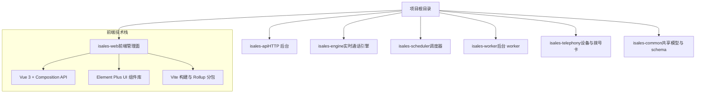
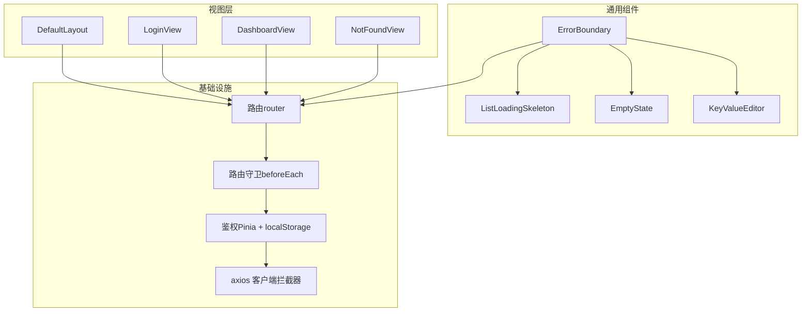
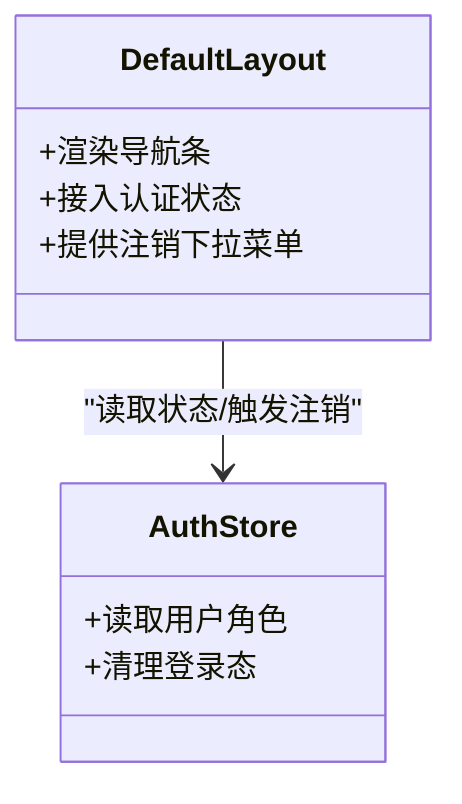
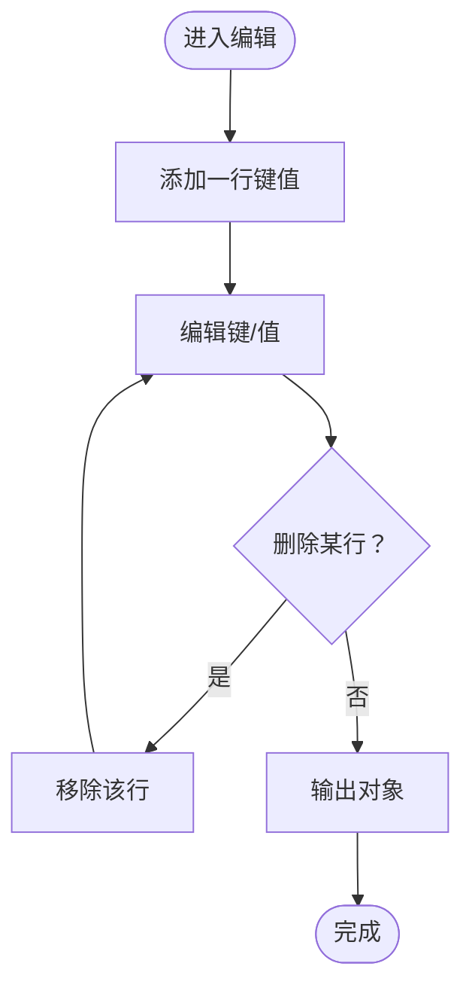
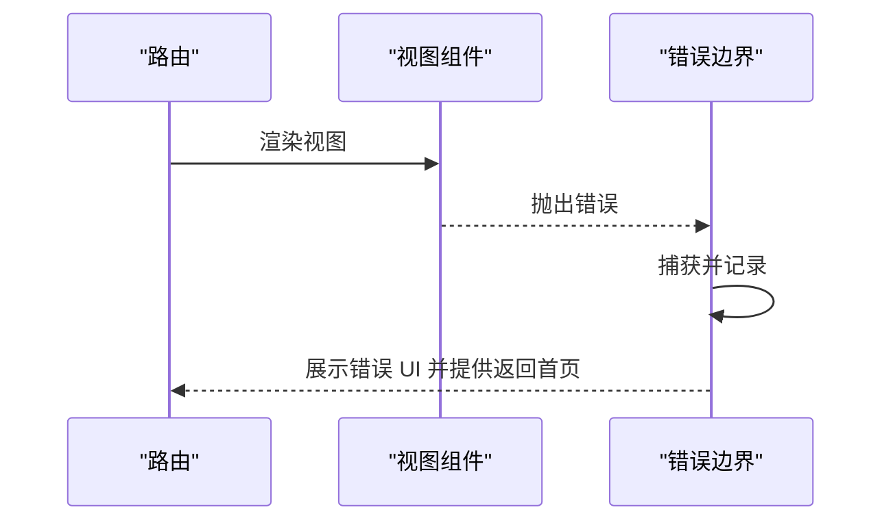
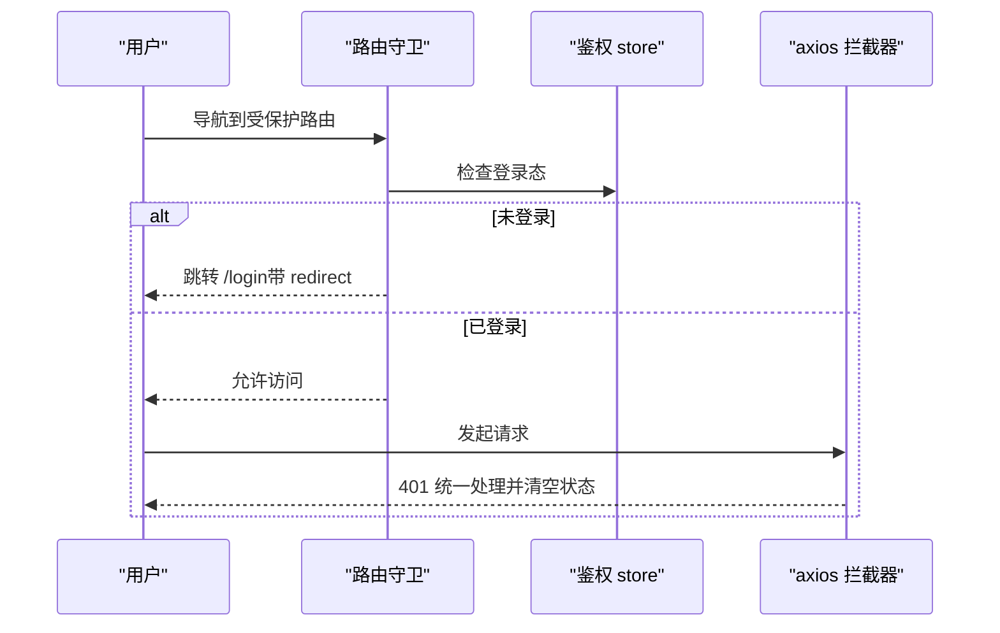
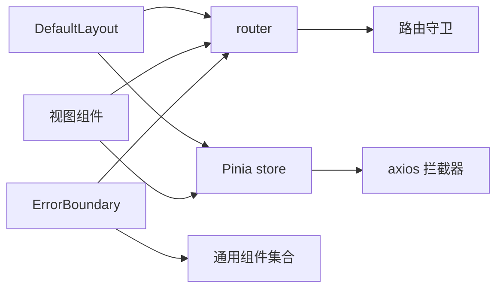

# Vue 3 组件架构

<cite>
**本文引用的文件**
- [README.md](file://README.md)
- [design.md](file://openspec/changes/archive/2026-05-22-web-admin-ui-redesign/design.md)
- [tasks.md](file://openspec/changes/archive/2026-05-08-impl-web/tasks.md)
- [tasks.md](file://openspec/changes/archive/2026-05-08-impl-web-polish/tasks.md)
- [design.md](file://openspec/changes/archive/2026-05-08-impl-web/design.md)
- [tasks.md](file://openspec/changes/archive/2026-05-17-windows-client-core/tasks.md)
</cite>

## 目录
1. [简介](#简介)
2. [项目结构](#项目结构)
3. [核心组件](#核心组件)
4. [架构总览](#架构总览)
5. [详细组件分析](#详细组件分析)
6. [依赖分析](#依赖分析)
7. [性能考虑](#性能考虑)
8. [故障排除指南](#故障排除指南)
9. [结论](#结论)
10. [附录](#附录)

## 简介
本文件面向 Vue 3 组件架构的技术文档，围绕基于 Composition API 的组件设计模式进行系统化梳理。结合仓库中的 OpenSpec 设计与任务记录，重点覆盖以下主题：
- 组件层次结构与布局容器
- 父子组件通信与插槽使用
- 生命周期管理与响应式数据绑定
- 计算属性与侦听器的使用
- 路由守卫、权限控制与错误边界
- 性能优化策略与测试实践
- 调试技巧与最佳实践

该文档以仓库内现有设计与任务记录为依据，通过图示与分层讲解帮助读者快速理解并应用 Vue 3 组件架构。

## 项目结构
从仓库信息可知，iSales 项目采用多仓协作模式，其中前端管理面位于 isales-web 仓库。根据 OpenSpec 文档，前端采用 Vue 3 + Element Plus 的技术栈，并通过主题与设计令牌统一视觉风格。构建侧采用 Vite，利用手动分包策略优化第三方库打包体积。

**章节来源**
- [README.md:1-14](file://README.md#L1-L14)
- [design.md:33-40](file://openspec/changes/archive/2026-05-22-web-admin-ui-redesign/design.md#L33-L40)
- [tasks.md:10](file://openspec/changes/archive/2026-05-08-impl-web-polish/tasks.md#L10)

## 核心组件
本节从设计与任务记录中提炼出前端管理面的核心组件与职责边界，涵盖布局容器、通用组件与错误边界等。

- 布局容器
  - DefaultLayout：顶部导航接入认证状态，提供注销下拉菜单，承担页面骨架与导航职责。
- 通用组件
  - ListLoadingSkeleton：列表加载骨架屏，提升交互感知。
  - EmptyState：空状态占位，改善无数据场景。
  - KeyValueEditor：动态键值编辑器，支持行级增删与对象输出，避免 watch 覆盖。
  - NotFoundView：404 页面，替代占位视图。
- 错误边界
  - ErrorBoundary：捕获子树错误，展示结果与返回首页按钮，包裹 router-view 作为全局兜底。

这些组件体现了“布局容器 + 通用功能 + 错误兜底”的分层思路，便于复用与维护。

**章节来源**
- [tasks.md:16-22](file://openspec/changes/archive/2026-05-08-impl-web-polish/tasks.md#L16-L22)
- [tasks.md:20](file://openspec/changes/archive/2026-05-08-impl-web-polish/tasks.md#L20)
- [design.md:33-40](file://openspec/changes/archive/2026-05-22-web-admin-ui-redesign/design.md#L33-L40)

## 架构总览
前端管理面的整体架构围绕“布局容器 + 视图页面 + 通用组件 + 错误边界”展开，配合路由守卫与鉴权流程，形成清晰的职责划分与用户体验闭环。

**图表来源**
- [tasks.md:17-24](file://openspec/changes/archive/2026-05-08-impl-web/tasks.md#L17-L24)
- [tasks.md:20](file://openspec/changes/archive/2026-05-08-impl-web-polish/tasks.md#L20)

**章节来源**
- [tasks.md:17-24](file://openspec/changes/archive/2026-05-08-impl-web/tasks.md#L17-L24)
- [tasks.md:20](file://openspec/changes/archive/2026-05-08-impl-web-polish/tasks.md#L20)

## 详细组件分析

### 布局容器 DefaultLayout
- 职责
  - 提供页面骨架与导航条。
  - 接入认证状态，渲染用户信息与注销下拉菜单。
- 交互
  - 与 Pinia 认证 store 交互，读取用户角色与登录态。
  - 通过路由跳转实现注销后的导航。
- 设计要点
  - 将导航与布局解耦，便于在不同视图复用。
  - 下拉菜单触发注销逻辑，避免在布局中引入路由循环依赖。

**图表来源**
- [tasks.md:24](file://openspec/changes/archive/2026-05-08-impl-web/tasks.md#L24)

**章节来源**
- [tasks.md:24](file://openspec/changes/archive/2026-05-08-impl-web/tasks.md#L24)

### 通用组件 KeyValueEditor
- 功能
  - 动态增删键值行，输出对象。
  - 防止 watch 覆盖，保证编辑过程的稳定性。
- 使用场景
  - 配置项编辑、规则参数输入等。
- 设计要点
  - 通过受控与非受控结合的方式，避免双向绑定导致的状态抖动。
  - 事件驱动输出对象，便于父组件统一校验与提交。

**图表来源**
- [tasks.md:19](file://openspec/changes/archive/2026-05-08-impl-web-polish/tasks.md#L19)

**章节来源**
- [tasks.md:19](file://openspec/changes/archive/2026-05-08-impl-web-polish/tasks.md#L19)

### 错误边界 ErrorBoundary
- 职责
  - 捕获子树错误，展示结果与返回首页按钮。
  - 作为全局兜底，包裹 router-view。
- 与路由的关系
  - 在 404 场景可与 NotFoundView 协作，提供更友好的错误提示。
- 最佳实践
  - 仅用于全局兜底，局部错误应尽量在组件内部处理。
  - 记录错误上下文，便于后续定位与修复。

**图表来源**
- [tasks.md:20](file://openspec/changes/archive/2026-05-08-impl-web-polish/tasks.md#L20)

**章节来源**
- [tasks.md:20](file://openspec/changes/archive/2026-05-08-impl-web-polish/tasks.md#L20)

### 鉴权与路由守卫
- 鉴权
  - 使用 Pinia store 管理登录态与角色，持久化至 localStorage。
  - axios 请求拦截器自动附加 Authorization，401 时统一处理并跳转登录页。
- 路由守卫
  - 未登录访问受保护路由跳转登录页（携带 redirect 参数）。
  - 已登录访问登录页跳转仪表盘。
- 设计要点
  - 将导航职责交由调用方，避免守卫与路由之间产生循环依赖。
  - 登出仅清理状态，具体导航由业务方决定。

**图表来源**
- [tasks.md:19-24](file://openspec/changes/archive/2026-05-08-impl-web/tasks.md#L19-L24)

**章节来源**
- [tasks.md:19-24](file://openspec/changes/archive/2026-05-08-impl-web/tasks.md#L19-L24)

## 依赖分析
从前端技术选型与构建配置可见，项目在组件层面强调“布局容器 + 通用组件 + 错误边界”的分层，在基础设施层面强调“路由守卫 + 鉴权 + axios 拦截器”的统一入口。

**图表来源**
- [tasks.md:17-24](file://openspec/changes/archive/2026-05-08-impl-web/tasks.md#L17-L24)
- [tasks.md:20](file://openspec/changes/archive/2026-05-08-impl-web-polish/tasks.md#L20)

**章节来源**
- [tasks.md:17-24](file://openspec/changes/archive/2026-05-08-impl-web/tasks.md#L17-L24)
- [tasks.md:20](file://openspec/changes/archive/2026-05-08-impl-web-polish/tasks.md#L20)

## 性能考虑
- 构建与分包
  - 通过 Rollup 的 manualChunks 将第三方库拆分为独立 chunk，降低首屏体积与缓存命中成本。
  - 对特定视图进行分包优化，减少无关资源加载。
- 组件层面
  - 使用骨架屏与空状态组件提升感知性能。
  - 避免不必要的重渲染，合理使用响应式与计算属性。
- 网络层
  - axios 拦截器集中处理鉴权与错误，减少重复逻辑与分支判断。

**章节来源**
- [tasks.md:10](file://openspec/changes/archive/2026-05-08-impl-web-polish/tasks.md#L10)

## 故障排除指南
- 登录与鉴权
  - 若出现 401，确认 axios 拦截器是否正确附加 Authorization，并检查鉴权 store 是否清空状态。
  - 登录后无法跳转：检查路由守卫是否正确处理 redirect 参数。
- 错误边界
  - 子组件抛错但未显示错误 UI：确认 ErrorBoundary 是否包裹 router-view，以及是否正确捕获异常。
- 通用组件
  - KeyValueEditor 输出对象异常：检查事件输出时机与 watch 覆盖问题，确保编辑过程稳定。

**章节来源**
- [tasks.md:19-24](file://openspec/changes/archive/2026-05-08-impl-web/tasks.md#L19-L24)
- [tasks.md:20](file://openspec/changes/archive/2026-05-08-impl-web-polish/tasks.md#L20)
- [tasks.md:19](file://openspec/changes/archive/2026-05-08-impl-web-polish/tasks.md#L19)

## 结论
本项目在前端管理面采用 Vue 3 Composition API 与 Element Plus，通过布局容器、通用组件与错误边界实现清晰的分层；配合统一的路由守卫与鉴权机制，形成一致的用户体验与安全边界。构建侧通过分包策略优化性能，测试与 CI 流程保障质量。建议在后续迭代中持续完善组件测试与调试工具链，进一步提升可维护性与可扩展性。

## 附录
- 术语
  - Composition API：Vue 3 的函数式组合式 API，强调逻辑复用与可读性。
  - Pinia：轻量级状态管理库，支持模块化与 TypeScript。
  - axios：HTTP 客户端，支持拦截器与统一错误处理。
- 参考
  - Vue 3 官方文档与 Composition API 指南
  - Element Plus 组件库与主题定制
  - Vite 与 Rollup 分包策略