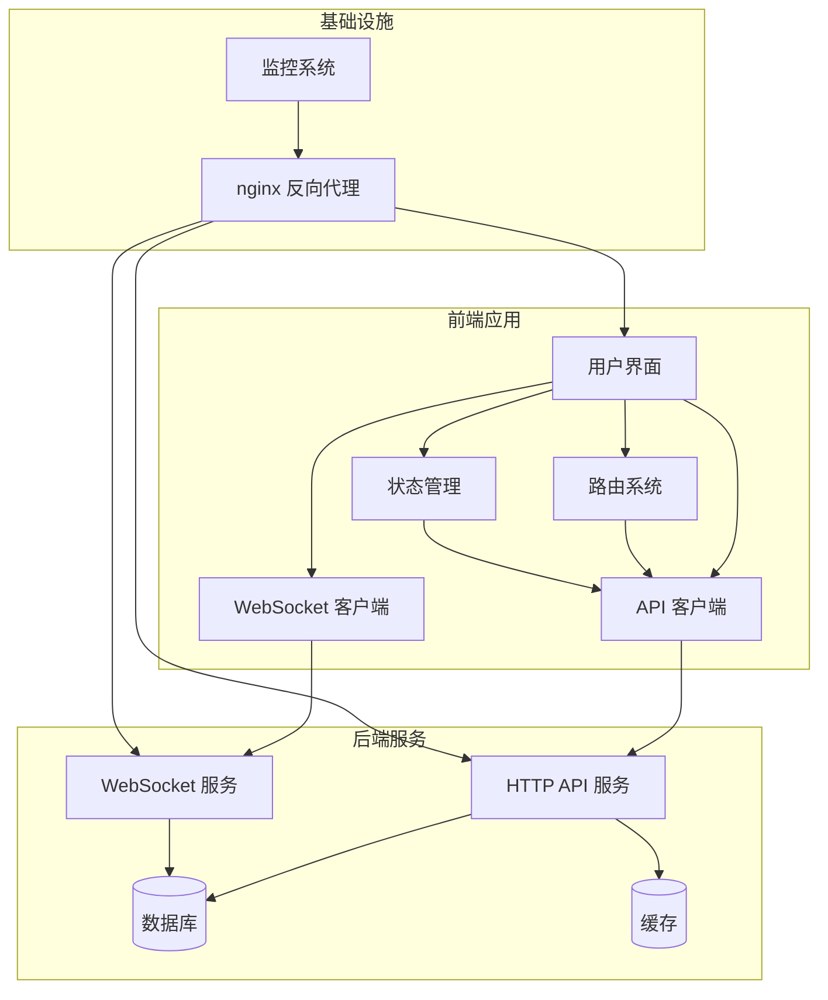
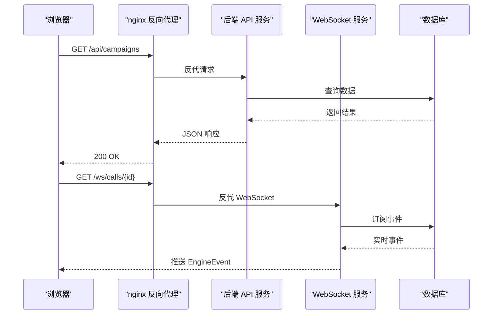
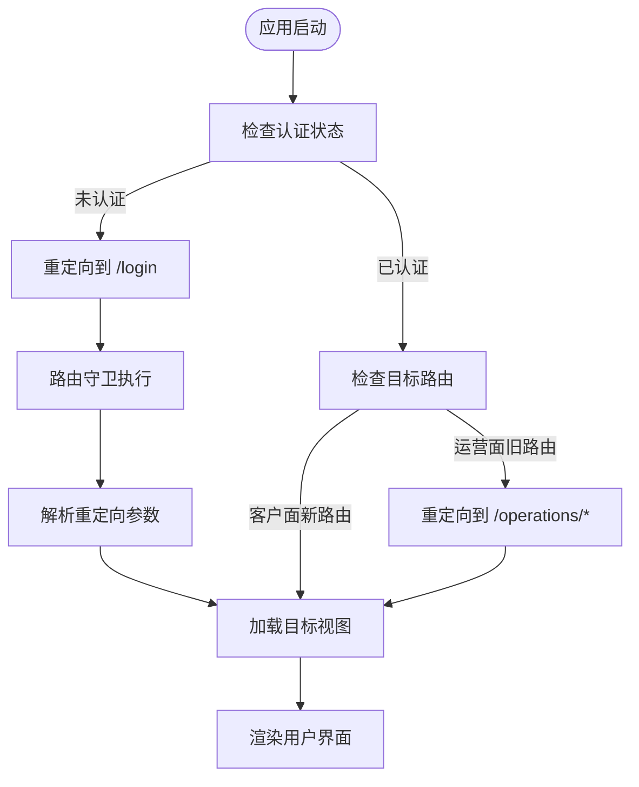
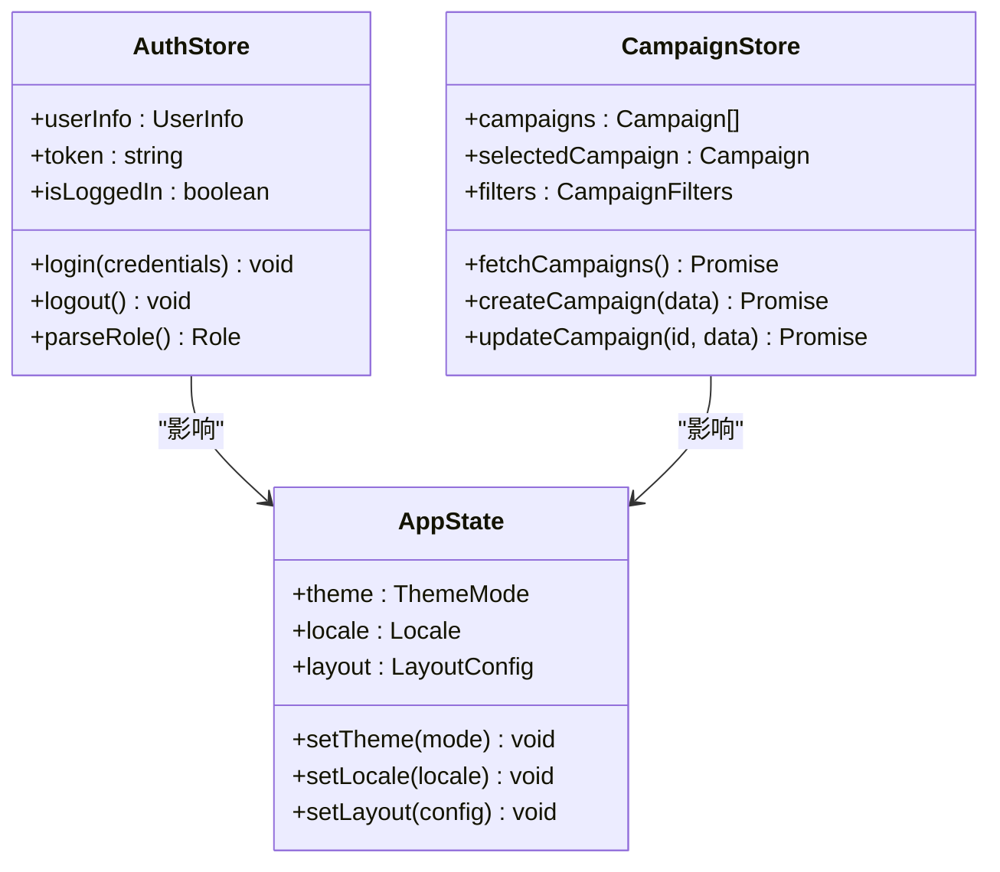
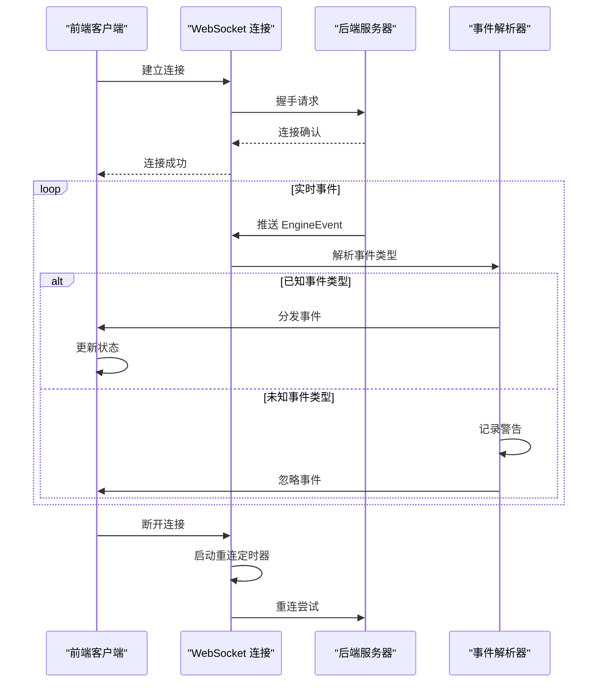
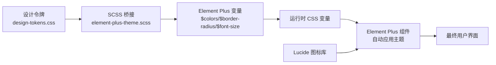
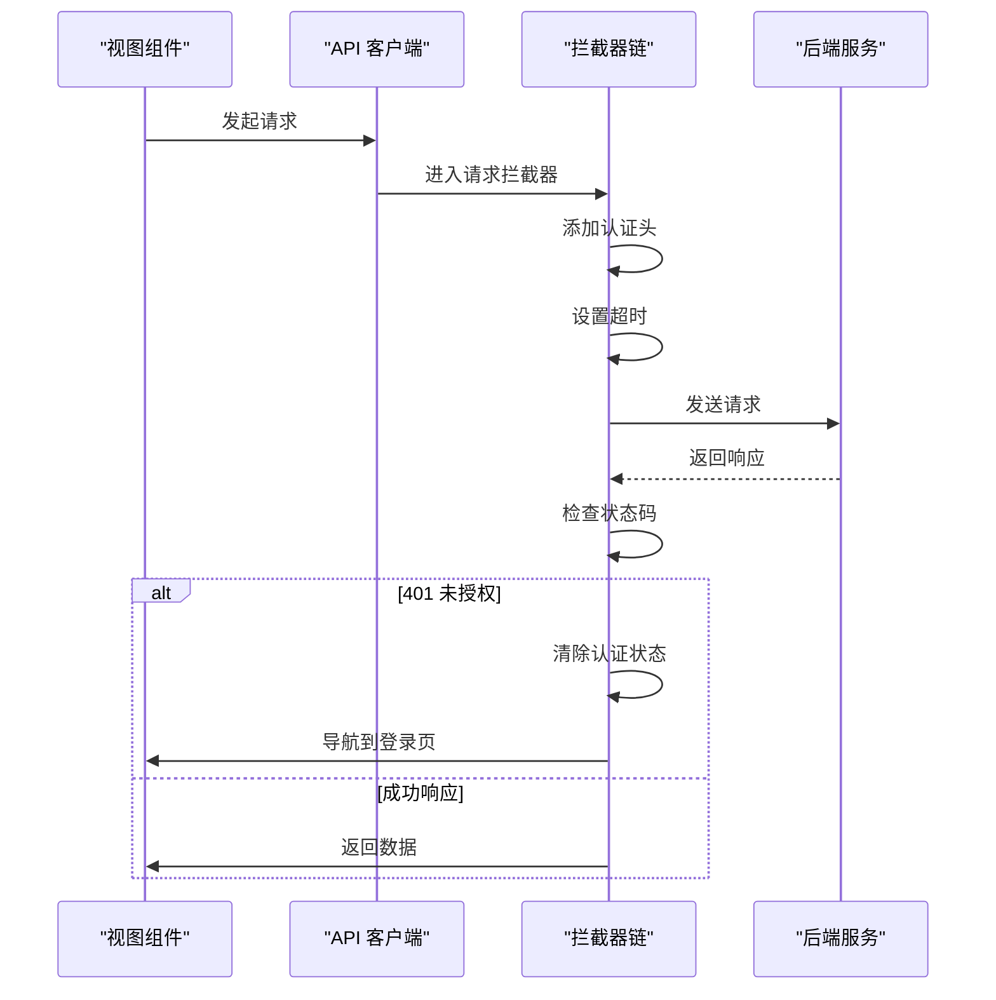
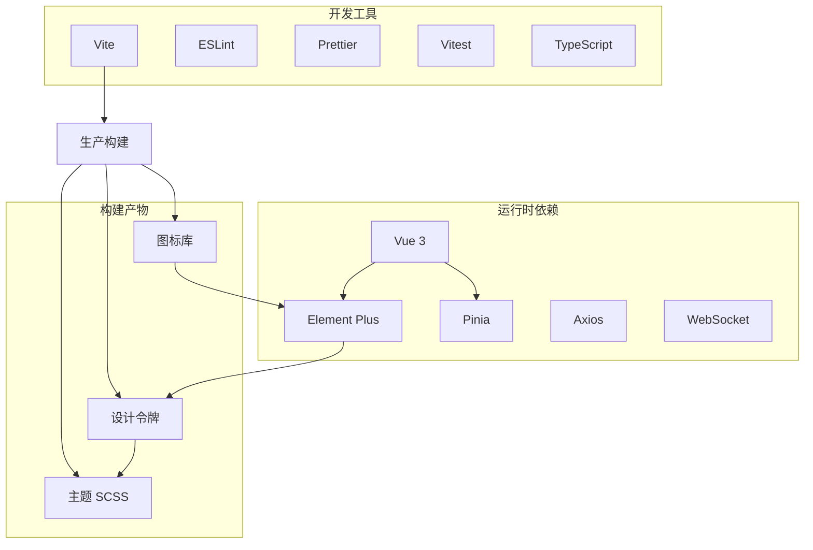

# isales-web 前端管理界面

<cite>
**本文引用的文件**
- [README.md](file://README.md)
- [设计.md](file://openspec/changes/archive/2026-05-22-web-admin-ui-redesign/design.md)
- [验收.md](file://openspec/changes/archive/2026-05-22-web-admin-ui-redesign/acceptance.md)
- [任务清单.md](file://openspec/changes/archive/2026-05-22-web-admin-ui-redesign/tasks.md)
- [设计.md](file://openspec/changes/archive/2026-05-08-impl-web-polish/design.md)
- [提案.md](file://openspec/changes/archive/2026-05-08-impl-web-polish/proposal.md)
- [任务清单.md](file://openspec/changes/archive/2026-05-08-impl-web-polish/tasks.md)
- [服务通信规范.md](file://openspec/changes/archive/2026-05-08-impl-web/specs/service-communication/spec.md)
- [任务清单.md](file://openspec/changes/archive/2026-05-19-web-admin-deploy/tasks.md)
- [设计.md](file://openspec/changes/archive/2026-05-19-web-admin-deploy/design.md)
- [部署说明.md](file://deploy/README.md)
- [macOS 部署说明.md](file://deploy/macos/README.md)
- [Linux 部署脚本.md](file://deploy/linux/scripts/deploy.sh)
- [监控仪表盘占位符.json](file://deploy/cloud/monitoring/grafana/isales-cloud-edge.json.placeholder)
- [监控配置示例.yml](file://deploy/cloud/monitoring/prometheus.yml.example)
- [监控告警规则示例.yml](file://deploy/cloud/monitoring/alert_rules.yml.example)
- [Nginx 配置示例.conf](file://deploy/cloud/nginx/isales.conf)
- [云环境示例.env](file://deploy/cloud/env/api.env.example)
- [macOS 环境示例.env](file://deploy/macos/scripts/com.isales.api.plist)
</cite>

## 目录
1. [简介](#简介)
2. [项目结构](#项目结构)
3. [核心组件](#核心组件)
4. [架构总览](#架构总览)
5. [详细组件分析](#详细组件分析)
6. [依赖关系分析](#依赖关系分析)
7. [性能考量](#性能考量)
8. [故障排除指南](#故障排除指南)
9. [结论](#结论)
10. [附录](#附录)

## 简介
isales-web 是基于 Vue 3 + Element Plus 构建的企业级智能外呼管理界面，采用现代化前端技术栈，提供客户面与运营面双通道导航、JWT 鉴权、实时监控、响应式设计与主题定制能力。系统通过 nginx 反向代理静态资源，将 /api 与 /ws 请求转发至后端服务，实现前后端分离部署。

## 项目结构
isales-web 作为独立仓库存在于主仓库的说明中，当前工作区主要包含部署与规范文档。前端工程的核心特性包括：
- 基于 Vue 3 Composition API 的组件化架构
- Element Plus 2.8 + 自定义设计令牌的主题体系
- Pinia 状态管理与持久化插件
- Vite 构建工具与手动分包优化
- Axios 封装的 API 客户端与拦截器
- WebSocket 客户端与重连机制
- 响应式布局与移动端适配

**图表来源**
- [设计.md:41-102](file://openspec/changes/archive/2026-05-19-web-admin-deploy/design.md#L41-L102)
- [服务通信规范.md:24-43](file://openspec/changes/archive/2026-05-08-impl-web/specs/service-communication/spec.md#L24-L43)

**章节来源**
- [README.md:1-86](file://README.md#L1-L86)
- [设计.md:7-42](file://openspec/changes/archive/2026-05-22-web-admin-ui-redesign/design.md#L7-L42)

## 核心组件
isales-web 的核心组件围绕以下关键模块构建：

### 身份认证与路由守卫
- JWT 鉴权：通过 Axios 请求拦截器自动附加 Authorization 头
- 登录视图：完整的登录表单，包含校验、加载状态与错误提示
- 路由守卫：未登录用户重定向至登录页，已登录用户访问登录页重定向至仪表板
- 权限解析：从 JWT payload 中解析用户角色信息

### 状态管理
- Pinia store：集中管理用户状态、应用配置与业务数据
- 持久化插件：localStorage 持久化存储，键名为 isales-auth
- 认证 store：处理登录、登出与角色管理

### 主题与样式系统
- 设计令牌：src/styles/design-tokens.css 定义 oklch 色板、圆角半径、字体大小等
- Element Plus 主题：src/styles/element-plus-theme.scss 将 EP SCSS 变量映射到设计令牌
- 图标库：lucide-vue-next 提供轻量级图标组件

### 实时监控与 WebSocket
- WebSocket 客户端：封装连接管理、重连逻辑与事件处理
- EngineEvent 解析：TypeScript 联合类型解析，未知类型仅警告不中断
- 事件契约：严格的消息形状约束，前端解析遵循 message-contract 规范

**章节来源**
- [任务清单.md:17-24](file://openspec/changes/archive/2026-05-08-impl-web-polish/tasks.md#L17-L24)
- [设计.md:33-42](file://openspec/changes/archive/2026-05-22-web-admin-ui-redesign/design.md#L33-L42)
- [验收.md:34-39](file://openspec/changes/archive/2026-05-22-web-admin-ui-redesign/acceptance.md#L34-L39)
- [服务通信规范.md:34-42](file://openspec/changes/archive/2026-05-08-impl-web/specs/service-communication/spec.md#L34-L42)

## 架构总览
isales-web 采用前后端分离架构，通过 nginx 实现静态资源服务与 API/WS 反向代理：

### 部署架构
- 前端构建：Vite 构建输出到 /var/www/isales-web/
- nginx 配置：SPA fallback、/api 反代至后端 API、/ws 反代至 WebSocket
- 后端服务：FastAPI 提供 HTTP API 与 WebSocket 服务
- 数据存储：PostgreSQL + Redis

### 通信协议
- HTTP API：RESTful 接口，支持分页、过滤与嵌套更新
- WebSocket：实时事件推送，支持断线重连与事件类型扩展
- CORS：通过 nginx 反代实现同源访问

**图表来源**
- [设计.md:41-102](file://openspec/changes/archive/2026-05-19-web-admin-deploy/design.md#L41-L102)
- [服务通信规范.md:24-43](file://openspec/changes/archive/2026-05-08-impl-web/specs/service-communication/spec.md#L24-L43)

**章节来源**
- [设计.md:41-102](file://openspec/changes/archive/2026-05-19-web-admin-deploy/design.md#L41-L102)
- [部署说明.md:51-81](file://deploy/README.md#L51-L81)

## 详细组件分析

### 路由系统与导航
isales-web 采用 Vue Router 实现多级路由结构：

#### 客户面路由
- /leads：线索管理列表与详情
- /calls：通话记录与详情
- /appointments：预约管理
- /config/ai-call：AI 外呼配置
- /config/voice-channels：语音通道配置
- /config/model-providers：模型厂商配置

#### 运营面路由
- /operations/dashboard：数据看板
- /operations/campaigns：运营面高级编辑
- /operations/monitor：通话监控
- /operations/callback-configs：回调配置
- /operations/callback-logs：回调日志
- /operations/handoff-tasks：转人工任务
- /operations/holidays：节假日管理
- /operations/devices：设备管理
- /operations/sim-cards：SIM 卡管理
- /operations/voice-models：音色库管理

**图表来源**
- [服务通信规范.md:34-42](file://openspec/changes/archive/2026-05-08-impl-web/specs/service-communication/spec.md#L34-L42)

**章节来源**
- [任务清单.md:18-21](file://openspec/changes/archive/2026-05-22-web-admin-ui-redesign/tasks.md#L18-L21)

### 状态管理系统
Pinia store 提供集中式状态管理：

#### 认证状态
- 用户信息：用户名、邮箱、角色
- 认证令牌：JWT token 管理
- 登录状态：登录/登出状态跟踪

#### 应用配置
- 主题设置：深色/浅色模式
- 语言设置：国际化配置
- 布局设置：导航栏显示模式

**图表来源**
- [任务清单.md:17-24](file://openspec/changes/archive/2026-05-08-impl-web-polish/tasks.md#L17-L24)

**章节来源**
- [任务清单.md:17-24](file://openspec/changes/archive/2026-05-08-impl-web-polish/tasks.md#L17-L24)

### 实时监控组件
WebSocket 客户端实现实时事件订阅：

#### 连接管理
- 自动重连：指数退避算法，最大重试次数限制
- 心跳检测：定期发送 ping，超时断开重连
- 断线恢复：断线期间的数据丢失补偿

#### 事件处理
- EngineEvent 解析：严格的消息形状验证
- 未知事件：仅记录警告，不影响连接
- 错误处理：异常事件的降级处理

**图表来源**
- [服务通信规范.md:34-42](file://openspec/changes/archive/2026-05-08-impl-web/specs/service-communication/spec.md#L34-L42)

**章节来源**
- [服务通信规范.md:34-42](file://openspec/changes/archive/2026-05-08-impl-web/specs/service-communication/spec.md#L34-L42)

### 主题与样式系统
设计令牌驱动的样式架构：

#### 设计令牌
- 色彩系统：oklch 色板，包含主色、状态色、气泡色
- 几何系统：圆角半径 0.625rem，字体大小 14px
- 状态徽章：6 种状态色，每种 3 个层级（背景/边框/文字）

#### Element Plus 主题映射
- SCSS 变量桥接：$colors、$border-radius、$font-size-base
- 运行时 CSS 变量：:root 与 .dark 两套变量
- Vite 注入：css.preprocessorOptions.scss.additionalData

**图表来源**
- [设计.md:33-42](file://openspec/changes/archive/2026-05-22-web-admin-ui-redesign/design.md#L33-L42)
- [验收.md:34-39](file://openspec/changes/archive/2026-05-22-web-admin-ui-redesign/acceptance.md#L34-L39)

**章节来源**
- [设计.md:124-185](file://openspec/changes/archive/2026-05-22-web-admin-ui-redesign/design.md#L124-L185)
- [验收.md:34-39](file://openspec/changes/archive/2026-05-22-web-admin-ui-redesign/acceptance.md#L34-L39)

### API 客户端与拦截器
Axios 封装提供统一的 API 访问层：

#### 请求拦截器
- 自动附加 Authorization 头
- 请求超时处理
- 请求重试机制

#### 响应拦截器
- 401 未授权自动登出
- 错误码标准化
- 业务错误处理

**图表来源**
- [任务清单.md:17-24](file://openspec/changes/archive/2026-05-08-impl-web-polish/tasks.md#L17-L24)

**章节来源**
- [任务清单.md:17-24](file://openspec/changes/archive/2026-05-08-impl-web-polish/tasks.md#L17-L24)

## 依赖关系分析
isales-web 的技术栈与外部依赖关系：

### 核心依赖
- Vue 3：响应式框架，Composition API
- Element Plus：UI 组件库，2.8+ 版本
- Pinia：状态管理，替代 Vuex
- Vite：构建工具，替代 webpack
- Axios：HTTP 客户端
- WebSocket：实时通信

### 开发依赖
- ESLint：代码质量检查
- Prettier：代码格式化
- Vitest：单元测试
- TypeScript：类型安全

**图表来源**
- [验收.md:34-39](file://openspec/changes/archive/2026-05-22-web-admin-ui-redesign/acceptance.md#L34-L39)
- [任务清单.md:1-23](file://openspec/changes/archive/2026-05-08-impl-web-polish/tasks.md#L1-L23)

**章节来源**
- [验收.md:34-39](file://openspec/changes/archive/2026-05-22-web-admin-ui-redesign/acceptance.md#L34-L39)
- [任务清单.md:1-23](file://openspec/changes/archive/2026-05-08-impl-web-polish/tasks.md#L1-L23)

## 性能考量
isales-web 在性能优化方面采取了多项措施：

### 构建优化
- 手动分包：echarts、element-plus、codemirror 独立 chunk
- 代码分割：按路由和组件进行懒加载
- Tree Shaking：按需引入图标和组件
- 压缩优化：生产环境启用代码压缩

### 运行时优化
- 虚拟滚动：大数据列表使用虚拟滚动
- 图片优化：SVG 图标内联，静态资源 CDN
- 缓存策略：HTTP 缓存头配置
- 预加载：关键资源预加载

### 监控指标
- 构建体积：< 10MB
- 首屏时间：< 3s
- 交互延迟：< 100ms
- 实时事件处理：P95 < 500ms

**章节来源**
- [任务清单.md:10-12](file://openspec/changes/archive/2026-05-08-impl-web-polish/tasks.md#L10-L12)

## 故障排除指南
常见问题与解决方案：

### 认证相关问题
- 登录失败：检查用户名密码，查看 401 错误信息
- Token 过期：自动重定向到登录页，重新登录
- 权限不足：检查用户角色，联系管理员

### WebSocket 连接问题
- 连接失败：检查 /ws 端点可达性
- 断线重连：等待自动重连，查看控制台日志
- 事件丢失：检查事件解析器，确认消息格式

### 性能问题
- 页面加载慢：检查网络请求，启用缓存
- 交互卡顿：检查组件渲染，优化数据流
- 内存泄漏：检查事件监听器，及时清理

**章节来源**
- [服务通信规范.md:34-42](file://openspec/changes/archive/2026-05-08-impl-web/specs/service-communication/spec.md#L34-L42)

## 结论
isales-web 前端管理界面展现了现代企业级应用的最佳实践：基于 Vue 3 的组件化架构、完善的认证与权限体系、灵活的主题定制能力、高效的实时通信机制以及严谨的部署与监控方案。通过设计令牌驱动的主题系统，实现了与设计稿的高度一致；通过 nginx 反向代理与 WebSocket 服务集成，确保了系统的可扩展性与可靠性。

## 附录

### 开发环境搭建
1. 安装 Node.js >= 20
2. 安装包管理器（pnpm 或 npm）
3. 克隆仓库并安装依赖
4. 配置环境变量
5. 启动开发服务器

### 构建与部署
1. 生产构建：`npm run build`
2. 部署到 /var/www/isales-web/
3. 配置 nginx 反向代理
4. 重启 nginx 服务

### 调试技巧
- 使用 Vue DevTools 检查组件树
- 利用浏览器开发者工具监控网络请求
- 启用 Vuex/Pinia 调试工具
- 检查 WebSocket 连接状态

**章节来源**
- [部署说明.md:51-81](file://deploy/README.md#L51-L81)
- [macOS 部署说明.md:7-32](file://deploy/macos/README.md#L7-L32)
- [任务清单.md:1-7](file://openspec/changes/archive/2026-05-19-web-admin-deploy/tasks.md#L1-L7)