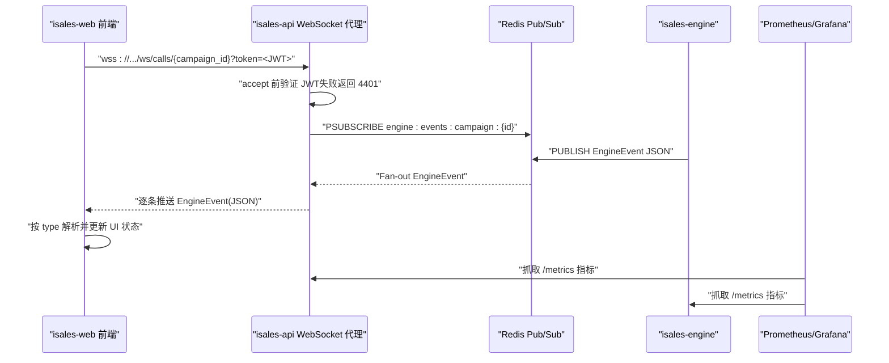
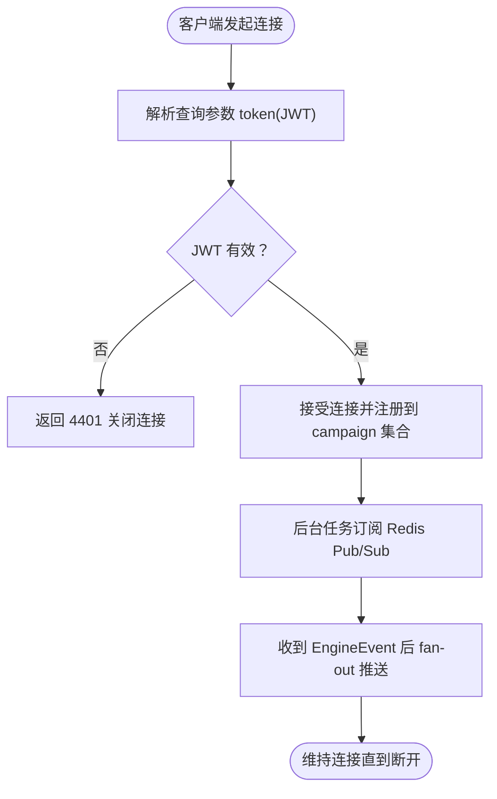
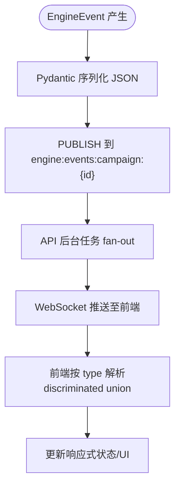
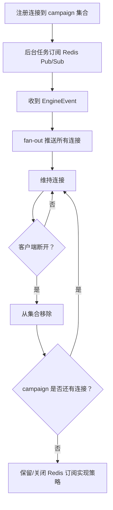
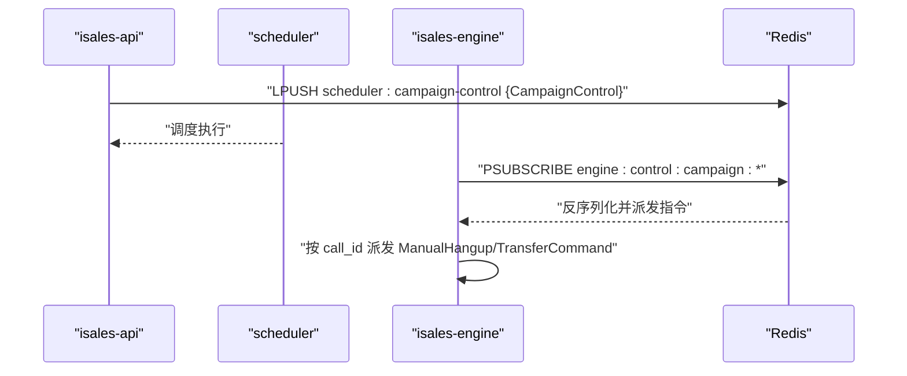
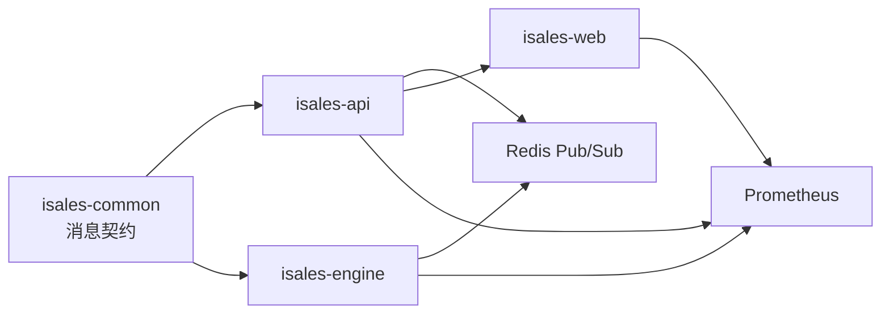

# 实时监控功能

<cite>
**本文引用的文件**
- [README.md](file://README.md)
- [service-communication 规格（归档）](file://openspec/changes/archive/2026-05-06-impl-api/specs/service-communication/spec.md)
- [service-communication 规格（归档·修订）](file://openspec/changes/archive/2026-05-08-impl-web/specs/service-communication/spec.md)
- [service-communication 规格（云-边拆分）](file://openspec/changes/arch-cloud-edge-split/specs/service-communication/spec.md)
- [消息契约规格](file://openspec/specs/message-contract/spec.md)
- [API 实施设计（归档）](file://openspec/changes/archive/2026-05-06-impl-api/design.md)
- [引擎实施设计（归档）](file://openspec/changes/archive/2026-05-07-impl-engine/design.md)
- [引擎实施任务清单（归档）](file://openspec/changes/archive/2026-05-07-impl-engine/tasks.md)
- [云-边部署拓扑规格](file://openspec/changes/arch-cloud-edge-split/specs/deployment-topology/spec.md)
- [Prometheus 监控配置示例](file://deploy/cloud/monitoring/prometheus.yml.example)
- [云-边 RUNBOOK（故障排查）](file://deploy/RUNBOOK-cloud.md)
</cite>

## 目录
1. [简介](#简介)
2. [项目结构](#项目结构)
3. [核心组件](#核心组件)
4. [架构总览](#架构总览)
5. [详细组件分析](#详细组件分析)
6. [依赖分析](#依赖分析)
7. [性能考量](#性能考量)
8. [故障排查指南](#故障排查指南)
9. [结论](#结论)
10. [附录](#附录)

## 简介
本技术文档围绕基于 WebSocket 的实时监控功能展开，聚焦于“通话状态实时更新、设备状态监控、系统健康检查与告警通知”。文档依据 OpenSpec 规格与实施设计，系统阐述实时数据流设计、消息格式规范、连接与订阅管理、断线重连策略、安全与错误处理、以及性能优化方案，并提供可落地的实现示例与运维建议。

## 项目结构
实时监控涉及多仓协作：
- isales-api：提供 WebSocket 端点，订阅 Redis Pub/Sub 并将 EngineEvent fan-out 给前端。
- isales-engine：产生 EngineEvent，发布到 Redis Pub/Sub；消费来自 API 的 EngineControl。
- isales-common：定义跨服务消息契约（Pydantic 模型、Discriminated Union、版本与可观测性约定）。
- isales-web：订阅 WebSocket，使用 EngineEvent discriminated union 解析并更新响应式状态。
- 运维侧：Prometheus/Grafana 健康监控与告警，Nginx/SSL/TLS 代理，systemd 服务治理。

```mermaid
graph TB
subgraph "前端"
WEB["isales-web<br/>Vue 3 管理面"]
end
subgraph "后端"
API["isales-api<br/>FastAPI + WebSocket"]
ENGINE["isales-engine<br/>状态机/实时引擎"]
COMMON["isales-common<br/>消息契约"]
end
subgraph "基础设施"
REDIS["Redis Pub/Sub"]
NGINX["Nginx/SSL 代理"]
PROM["Prometheus/Grafana"]
end
WEB --> NGINX --> API
API <- --> REDIS
ENGINE --> REDIS
API --> COMMON
ENGINE --> COMMON
PROM --> API
PROM --> ENGINE
```

**图表来源**
- [service-communication 规格（归档）:1-31](file://openspec/changes/archive/2026-05-06-impl-api/specs/service-communication/spec.md#L1-L31)
- [service-communication 规格（归档·修订）:1-43](file://openspec/changes/archive/2026-05-08-impl-web/specs/service-communication/spec.md#L1-L43)
- [云-边部署拓扑规格:199-213](file://openspec/changes/arch-cloud-edge-split/specs/deployment-topology/spec.md#L199-L213)

**章节来源**
- [README.md:1-86](file://README.md#L1-L86)
- [云-边部署拓扑规格:199-213](file://openspec/changes/arch-cloud-edge-split/specs/deployment-topology/spec.md#L199-L213)

## 核心组件
- WebSocket 代理端点：/ws/calls/{campaign_id}，鉴权采用查询参数携带 JWT，失败返回 4401。
- 连接管理：进程内按 campaign_id 维护连接集合，后台任务订阅 Redis Pub/Sub，fan-out 到所有连接。
- 消息契约：EngineEvent 为 Discriminated Union，直接透传 JSON，前端按 type 分发处理。
- 事件来源：isales-engine 在状态转换、ASR、挂断等时机发布 EngineEvent 到 Redis。
- 控制通道：API 向 scheduler 写入 CampaignControl；engine 订阅 engine:control:campaign:* 并派发指令。
- 监控与告警：Prometheus 抓取各服务指标，Grafana 展示关键面板；告警规则覆盖队列深度、设备标记比例、回调失败率等。

**章节来源**
- [API 实施设计（归档）:30-53](file://openspec/changes/archive/2026-05-06-impl-api/design.md#L30-L53)
- [service-communication 规格（归档）:1-31](file://openspec/changes/archive/2026-05-06-impl-api/specs/service-communication/spec.md#L1-L31)
- [service-communication 规格（归档·修订）:1-43](file://openspec/changes/archive/2026-05-08-impl-web/specs/service-communication/spec.md#L1-L43)
- [引擎实施任务清单（归档）:99-107](file://openspec/changes/archive/2026-05-07-impl-engine/tasks.md#L99-L107)

## 架构总览
WebSocket 实时监控的端到端流程如下：



**图表来源**
- [service-communication 规格（归档）:1-31](file://openspec/changes/archive/2026-05-06-impl-api/specs/service-communication/spec.md#L1-L31)
- [API 实施设计（归档）:41-53](file://openspec/changes/archive/2026-05-06-impl-api/design.md#L41-L53)
- [引擎实施任务清单（归档）:99-107](file://openspec/changes/archive/2026-05-07-impl-engine/tasks.md#L99-L107)

## 详细组件分析

### WebSocket 连接与鉴权
- 连接地址：/ws/calls/{campaign_id}，使用 wss（生产环境）。
- 鉴权：查询参数 token=JWT，服务端在 accept 前验证；失败立即关闭并返回 4401。
- 单实例限制：v1 仅单实例运行，不假设跨实例广播；多实例扩展需通过 OpenSpec 变更提案（候选：sticky session 或 Redis Streams + 跨实例转发）。



**图表来源**
- [API 实施设计（归档）:41-46](file://openspec/changes/archive/2026-05-06-impl-api/design.md#L41-L46)
- [service-communication 规格（归档）:7-11](file://openspec/changes/archive/2026-05-06-impl-api/specs/service-communication/spec.md#L7-L11)
- [service-communication 规格（云-边拆分）:231-235](file://openspec/changes/arch-cloud-edge-split/specs/service-communication/spec.md#L231-L235)

**章节来源**
- [API 实施设计（归档）:41-46](file://openspec/changes/archive/2026-05-06-impl-api/design.md#L41-L46)
- [service-communication 规格（归档）:7-11](file://openspec/changes/archive/2026-05-06-impl-api/specs/service-communication/spec.md#L7-L11)

### 消息格式与数据流
- 消息来源：isales-engine 在状态转换、ASR、挂断等时机发布 EngineEvent。
- 消息形状：直接透传 EngineEvent JSON，不重新包装；前端按 message-contract 的 discriminated union 解析。
- 版本与可观测性：消息基类包含 schema_version、message_id、created_at；consumer 校验版本并按 dead letter 处理不支持版本。
- 通道覆盖：消息契约规格要求覆盖 service-communication 通道矩阵中标注为“含消息体”的跨服务通道。



**图表来源**
- [引擎实施任务清单（归档）:99-107](file://openspec/changes/archive/2026-05-07-impl-engine/tasks.md#L99-L107)
- [service-communication 规格（归档·修订）:29-32](file://openspec/changes/archive/2026-05-08-impl-web/specs/service-communication/spec.md#L29-L32)
- [消息契约规格:25-38](file://openspec/specs/message-contract/spec.md#L25-L38)

**章节来源**
- [引擎实施任务清单（归档）:99-107](file://openspec/changes/archive/2026-05-07-impl-engine/tasks.md#L99-L107)
- [service-communication 规格（归档·修订）:29-32](file://openspec/changes/archive/2026-05-08-impl-web/specs/service-communication/spec.md#L29-L32)
- [消息契约规格:25-38](file://openspec/specs/message-contract/spec.md#L25-L38)

### 连接管理与断线重连
- 连接集合：按 campaign_id 维护 Set[WebSocket]；后台一个 asyncio task 订阅 Redis Pub/Sub。
- fan-out 策略：收到消息后 fan-out 给该 campaign 的所有连接；避免每个 WS 连接独立订阅 Redis，防止 Redis 连接膨胀。
- 断开处理：客户端断开时从连接集合移除；当 campaign 无连接时可选择保留或关闭 Redis 订阅（实现策略由具体实现决定）。
- 重连建议：前端在连接断开后指数退避重连，重连时携带最新 token；若 campaign 无连接，可等待后台任务重新订阅后再推送历史事件（取决于实现策略）。



**图表来源**
- [API 实施设计（归档）:47-53](file://openspec/changes/archive/2026-05-06-impl-api/design.md#L47-L53)
- [service-communication 规格（归档）:17-21](file://openspec/changes/archive/2026-05-06-impl-api/specs/service-communication/spec.md#L17-L21)

**章节来源**
- [API 实施设计（归档）:47-53](file://openspec/changes/archive/2026-05-06-impl-api/design.md#L47-L53)
- [service-communication 规格（归档）:17-21](file://openspec/changes/archive/2026-05-06-impl-api/specs/service-communication/spec.md#L17-L21)

### 控制通道与系统健康
- 控制通道：API 向 scheduler 写入 CampaignControl；engine 订阅 engine:control:campaign:* 并派发 ManualHangup/TransferCommand 等指令。
- 健康检查：Prometheus 抓取 isales-api、isales-engine、isales-scheduler、isales-worker、node_exporter、postgres_exporter 等指标；Grafana 展示当前在播通话数、队列深度、接通率、错误日志计数、边缘机健康率等。
- 告警规则：覆盖 engine:dial 队列深度、设备 flagged 比例、回调失败率、PG 连接数、云-边 gRPC 断连等。



**图表来源**
- [引擎实施任务清单（归档）:104-107](file://openspec/changes/archive/2026-05-07-impl-engine/tasks.md#L104-L107)
- [云-边部署拓扑规格:199-213](file://openspec/changes/arch-cloud-edge-split/specs/deployment-topology/spec.md#L199-L213)

**章节来源**
- [引擎实施任务清单（归档）:104-107](file://openspec/changes/archive/2026-05-07-impl-engine/tasks.md#L104-L107)
- [云-边部署拓扑规格:199-213](file://openspec/changes/arch-cloud-edge-split/specs/deployment-topology/spec.md#L199-L213)

### 实时监控实现示例

#### 通话状态实时更新
- 触发点：状态转换、ASR 文本增量、挂断等。
- 前端处理：按 EngineEvent.type 分发到对应 reactive store；未知 type 仅警告并跳过，不中断连接。
- 示例路径：[引擎实施任务清单（归档）:99-107](file://openspec/changes/archive/2026-05-07-impl-engine/tasks.md#L99-L107)

**章节来源**
- [引擎实施任务清单（归档）:99-107](file://openspec/changes/archive/2026-05-07-impl-engine/tasks.md#L99-L107)
- [service-communication 规格（归档·修订）:34-38](file://openspec/changes/archive/2026-05-08-impl-web/specs/service-communication/spec.md#L34-L38)

#### 设备状态监控
- 通道：硬件告警经 gRPC 上报，worker 汇总为 isales_hardware_alert_total 指标。
- 前端：结合 Grafana 面板展示设备在线/离线、信号强度、欠费等状态。
- 示例路径：[云-边部署拓扑规格:199-213](file://openspec/changes/arch-cloud-edge-split/specs/deployment-topology/spec.md#L199-L213)

**章节来源**
- [云-边部署拓扑规格:199-213](file://openspec/changes/arch-cloud-edge-split/specs/deployment-topology/spec.md#L199-L213)

#### 系统健康检查与告警通知
- 指标采集：Prometheus 抓取各服务 /metrics；Grafana 导入 overview 面板。
- 告警规则：队列深度、设备 flagged 比例、回调失败率、PG 连接数、云-边断连等。
- 示例路径：[Prometheus 监控配置示例:38-76](file://deploy/cloud/monitoring/prometheus.yml.example#L38-L76)

**章节来源**
- [Prometheus 监控配置示例:38-76](file://deploy/cloud/monitoring/prometheus.yml.example#L38-L76)
- [云-边部署拓扑规格:199-213](file://openspec/changes/arch-cloud-edge-split/specs/deployment-topology/spec.md#L199-L213)

### 安全考虑、错误处理与用户体验优化
- 安全：
  - JWT 鉴权：HS256，24h 过期，无 refresh；查询参数携带 token，失败返回 4401。
  - 单实例限制：v1 单实例，避免跨实例广播假设。
- 错误处理：
  - 前端：未知 type 仅警告并跳过；字段缺失/类型错仅警告。
  - 后端：EngineEvent publish fire-and-forget，失败仅警告日志，不阻塞主流程。
- 用户体验：
  - 前端按 type 解析，避免对字段命名/类型的假设；新增事件类型需通过 OpenSpec 变更同步。
  - 指标与告警：Grafana 面板与 Prometheus 告警帮助快速定位问题。

**章节来源**
- [API 实施设计（归档）:32-46](file://openspec/changes/archive/2026-05-06-impl-api/design.md#L32-L46)
- [service-communication 规格（归档·修订）:34-42](file://openspec/changes/archive/2026-05-08-impl-web/specs/service-communication/spec.md#L34-L42)
- [引擎实施设计（归档）:168-178](file://openspec/changes/archive/2026-05-07-impl-engine/design.md#L168-L178)

## 依赖分析
- 服务间依赖：
  - isales-api 依赖 isales-common 的消息契约（EngineEvent、CampaignControl 等）。
  - isales-engine 依赖 isales-common 的消息契约，并向 Redis 发布/订阅。
  - isales-web 依赖前端对 EngineEvent discriminated union 的解析。
- 外部依赖：
  - Redis：Pub/Sub 作为实时事件通道。
  - Prometheus/Grafana：系统健康与告警。
  - Nginx：WebSocket 代理与 SSL 终端。



**图表来源**
- [消息契约规格:1-85](file://openspec/specs/message-contract/spec.md#L1-L85)
- [service-communication 规格（归档）:1-31](file://openspec/changes/archive/2026-05-06-impl-api/specs/service-communication/spec.md#L1-L31)

**章节来源**
- [消息契约规格:1-85](file://openspec/specs/message-contract/spec.md#L1-L85)
- [service-communication 规格（归档）:1-31](file://openspec/changes/archive/2026-05-06-impl-api/specs/service-communication/spec.md#L1-L31)

## 性能考量
- 连接与订阅：
  - 进程内按 campaign_id 维护连接集合，后台任务统一订阅 Redis，避免每个 WS 连接独立订阅导致 Redis 连接膨胀。
- 发布与 fan-out：
  - EngineEvent publish fire-and-forget，内部超时/异常仅警告日志，不阻塞通话主路径。
- 指标与告警：
  - Prometheus 抓取关键指标，Grafana 面板辅助容量与稳定性评估。
- 退化策略：
  - 云-边 gRPC keepalive 参数对称设置（周期 30s、超时 10s），减少 NAT/防火墙空闲超时导致的断连。

**章节来源**
- [API 实施设计（归档）:47-53](file://openspec/changes/archive/2026-05-06-impl-api/design.md#L47-L53)
- [引擎实施设计（归档）:168-178](file://openspec/changes/archive/2026-05-07-impl-engine/design.md#L168-L178)
- [云-边部署拓扑规格:199-213](file://openspec/changes/arch-cloud-edge-split/specs/deployment-topology/spec.md#L199-L213)

## 故障排查指南
- 常见症状与第一动作：
  - edge 全部离线：检查 nginx 状态与端口监听；查看 worker watchdog 日志。
  - 通话拨通后无 AI 声：查找 DingRTC join 失败、RtcEngineErrorJoinChannelFailed、LD_LIBRARY_PATH 错误；检查 dingrtc_pywrap 导入异常。
  - latency 超 800ms 持续告警：调整 engine.env 的 pipeline 参数，降低并发或默认 N 值。
  - RDS 连接被打满：检查 scheduler/engine 连接池上限，参考 RUNBOOK 的 pg-pool。
  - nginx 502 in grpc：engine 崩溃，重启 isales-engine 并查看 core dump。
  - LE 证书快过期：执行 certbot renew --dry-run 验证，定时器应自动续期。
  - isales-web SPA 加载但 admin 操作全 401：JWT 过期/失效，重新登录；若无法登录，查看 isales-api 的 authenticate 失败原因。
- 监控与告警：
  - Prometheus 抓取目标与告警规则参考部署模板；Grafana 导入 overview 面板。

**章节来源**
- [云-边 RUNBOOK（故障排查）:584-599](file://deploy/RUNBOOK-cloud.md#L584-L599)
- [Prometheus 监控配置示例:38-76](file://deploy/cloud/monitoring/prometheus.yml.example#L38-L76)

## 结论
本文基于 OpenSpec 规格与实施设计，系统梳理了基于 WebSocket 的实时监控方案：从连接鉴权、订阅管理、消息契约到断线重连、安全与错误处理、性能优化与运维告警，给出了可落地的实现路径与示例。v1 单实例部署简化了连接管理与广播策略，多实例扩展需遵循 OpenSpec 变更提案与候选方案（sticky session 或 Redis Streams）。通过 Prometheus/Grafana 的指标与告警，配合前端对 EngineEvent 的强契约解析，可实现稳定可靠的实时监控体验。

## 附录
- 相关 OpenSpec 规格与设计：
  - [service-communication 规格（归档）](file://openspec/changes/archive/2026-05-06-impl-api/specs/service-communication/spec.md)
  - [service-communication 规格（归档·修订）](file://openspec/changes/archive/2026-05-08-impl-web/specs/service-communication/spec.md)
  - [service-communication 规格（云-边拆分）](file://openspec/changes/arch-cloud-edge-split/specs/service-communication/spec.md)
  - [消息契约规格](file://openspec/specs/message-contract/spec.md)
  - [API 实施设计（归档）](file://openspec/changes/archive/2026-05-06-impl-api/design.md)
  - [引擎实施设计（归档）](file://openspec/changes/archive/2026-05-07-impl-engine/design.md)
  - [引擎实施任务清单（归档）](file://openspec/changes/archive/2026-05-07-impl-engine/tasks.md)
  - [云-边部署拓扑规格](file://openspec/changes/arch-cloud-edge-split/specs/deployment-topology/spec.md)
  - [Prometheus 监控配置示例](file://deploy/cloud/monitoring/prometheus.yml.example)
  - [云-边 RUNBOOK（故障排查）](file://deploy/RUNBOOK-cloud.md)