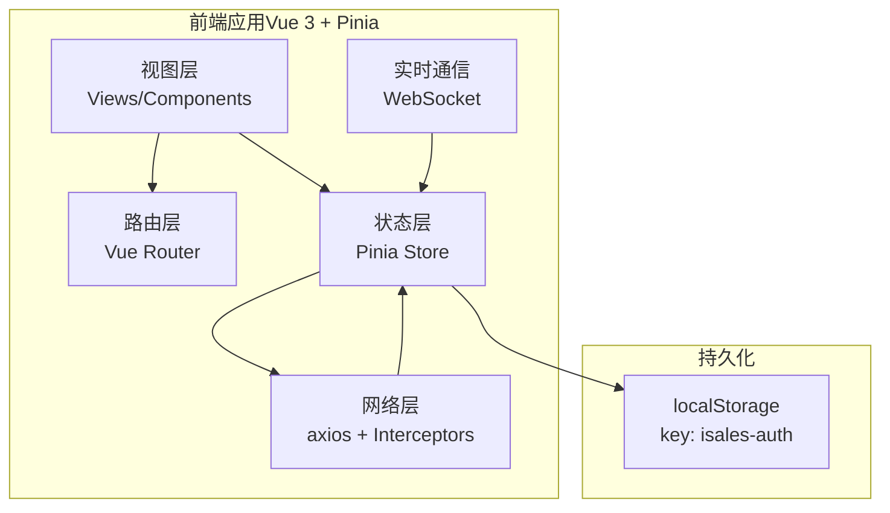
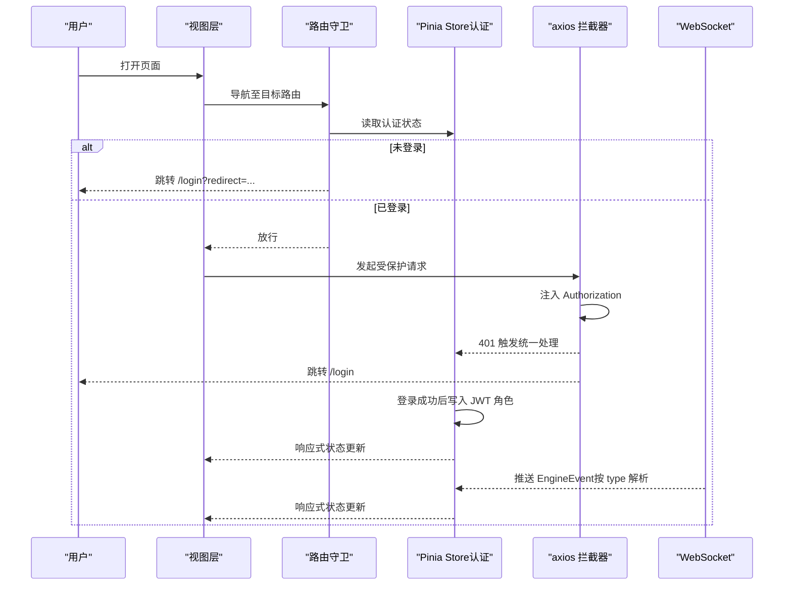
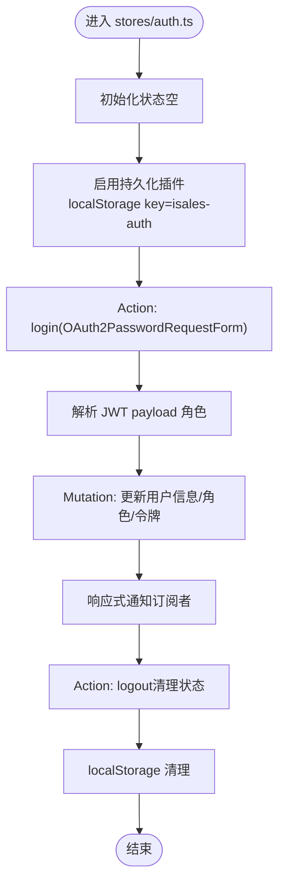
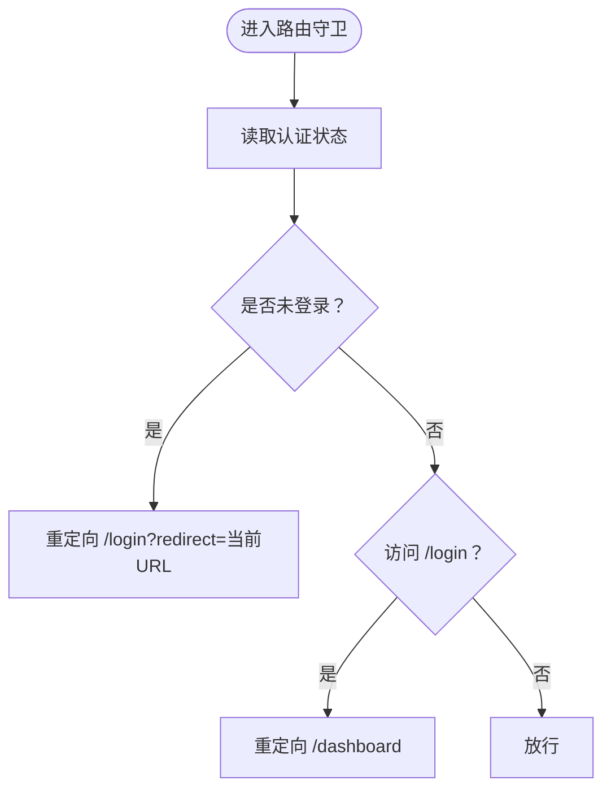
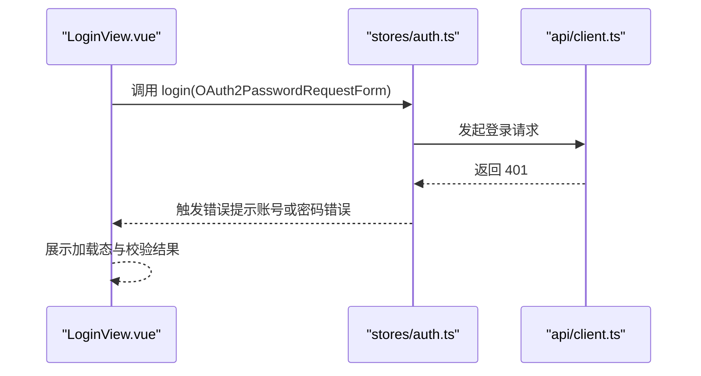
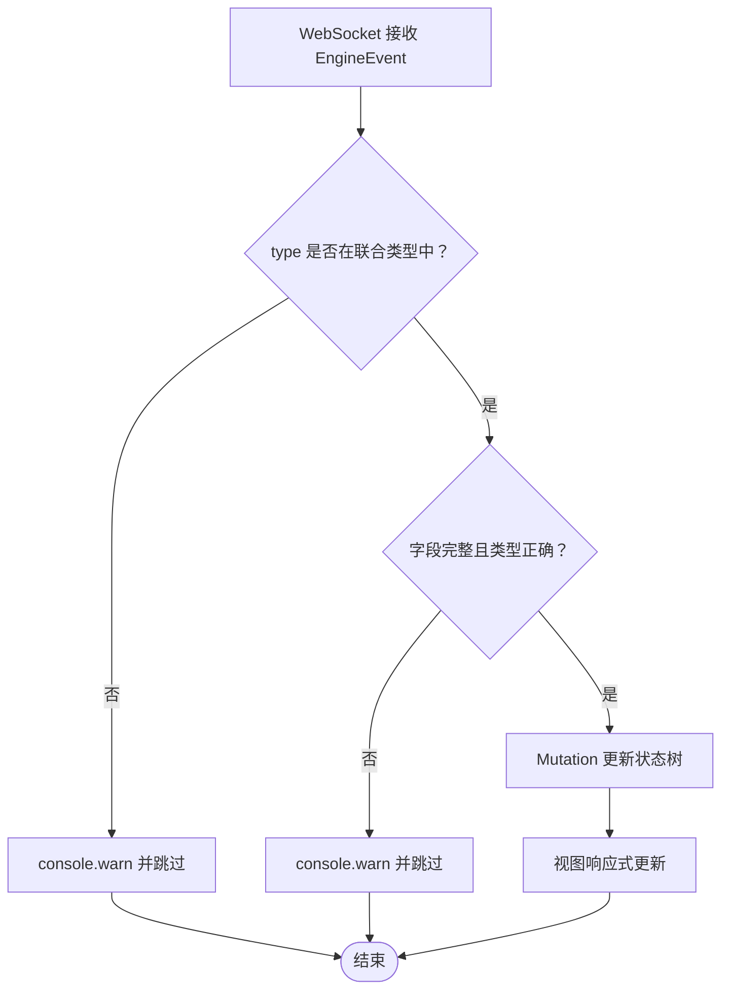
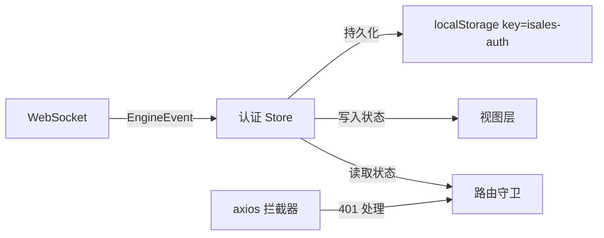

# 状态管理

<cite>
**本文引用的文件**
- [README.md](file://README.md)
- [tasks.md](file://openspec/changes/archive/2026-05-08-impl-web/tasks.md)
- [design.md](file://openspec/changes/archive/2026-05-08-impl-web-polish/design.md)
- [spec.md](file://openspec/changes/arch-cloud-edge-split/specs/service-communication/spec.md)
- [spec.md](file://openspec/changes/archive/2026-05-08-impl-web/specs/service-communication/spec.md)
</cite>

## 目录
1. [引言](#引言)
2. [项目结构](#项目结构)
3. [核心组件](#核心组件)
4. [架构总览](#架构总览)
5. [详细组件分析](#详细组件分析)
6. [依赖分析](#依赖分析)
7. [性能考虑](#性能考虑)
8. [故障排除指南](#故障排除指南)
9. [结论](#结论)
10. [附录](#附录)

## 引言
本技术文档围绕前端状态管理展开，聚焦于基于 Pinia 的状态管理模式，系统阐述状态树设计、Actions/Getters/Mutations 的使用方式、模块化状态管理与持久化策略，并结合仓库中的实施记录与规范说明，解释响应式状态更新、状态同步机制、跨组件状态共享以及状态调试工具的应用。同时，提供用户认证状态、路由状态、表单状态与实时数据状态的管理示例路径与最佳实践，帮助读者在实际项目中高效落地。

## 项目结构
根据仓库信息可知，前端工程位于独立的 isales-web 仓库中，采用 Vue 3 + Vite + TypeScript + Element Plus + Pinia + Vue Router + axios + ECharts + Vitest 技术栈。状态管理采用 Pinia，并通过 pinia-plugin-persistedstate 插件实现 localStorage 持久化。认证与路由守卫在该仓库中完成集成，WebSocket 实时事件在前端进行解析与处理。

**图表来源**
- [tasks.md:17-24](file://openspec/changes/archive/2026-05-08-impl-web/tasks.md#L17-L24)
- [design.md:128-147](file://openspec/changes/archive/2026-05-08-impl-web-polish/design.md#L128-L147)

**章节来源**
- [README.md:1-14](file://README.md#L1-L14)
- [tasks.md:1-24](file://openspec/changes/archive/2026-05-08-impl-web/tasks.md#L1-L24)
- [design.md:128-147](file://openspec/changes/archive/2026-05-08-impl-web-polish/design.md#L128-L147)

## 核心组件
- 状态存储（Pinia Store）
  - 认证状态：stores/auth.ts 使用 Pinia + 持久化插件，登录时写入 JWT 角色信息，登出时清理状态并交由调用方决定导航。
  - 持久化键：localStorage key 为 isales-auth。
- 网络拦截器：api/client.ts 在请求拦截器中注入 Authorization，在响应 401 时触发统一处理并跳转登录页。
- 路由守卫：router beforeEach guard 未登录跳转登录页（携带 redirect 参数），已登录访问登录页则跳转仪表盘。
- 视图层：views/LoginView.vue 提供登录表单校验、加载态与错误提示（401 显示“账号或密码错误”）。
- 实时事件：WebSocket 接收 EngineEvent，前端使用 TypeScript 联合类型按 type 字段解析，未知类型仅告警跳过，字段缺失或类型错误亦仅告警跳过。

**章节来源**
- [tasks.md:17-24](file://openspec/changes/archive/2026-05-08-impl-web/tasks.md#L17-L24)
- [spec.md:231-250](file://openspec/changes/arch-cloud-edge-split/specs/service-communication/spec.md#L231-L250)
- [spec.md:24-43](file://openspec/changes/archive/2026-05-08-impl-web/specs/service-communication/spec.md#L24-L43)

## 架构总览
下图展示了前端状态管理在认证、路由、网络与实时事件之间的交互关系，体现 Pinia 作为单一事实来源的作用。

**图表来源**
- [tasks.md:17-24](file://openspec/changes/archive/2026-05-08-impl-web/tasks.md#L17-L24)
- [spec.md:231-250](file://openspec/changes/arch-cloud-edge-split/specs/service-communication/spec.md#L231-L250)

## 详细组件分析

### 认证状态管理（Pinia + 持久化）
- 状态树设计
  - stores/auth.ts 维护用户认证相关状态（如登录态、角色等），通过 Pinia 的响应式 API 对外暴露。
  - 使用 pinia-plugin-persistedstate 将状态持久化到 localStorage，键名为 isales-auth。
- Actions/Getters/Mutations
  - Actions：login（OAuth2PasswordRequestForm）、logout（仅清理状态，导航职责由调用方承担）。
  - Getters：可派生用户角色、权限标识等。
  - Mutations：内部用于修改状态（如设置用户信息、令牌、角色）。
- 响应式更新与跨组件共享
  - 任意组件通过 storeToRefs/useStore 获取状态与方法，实现响应式订阅与跨组件共享。
- 调试工具
  - 开发环境默认启用 Pinia DevTools，生产构建禁用。

**图表来源**
- [tasks.md:17-24](file://openspec/changes/archive/2026-05-08-impl-web/tasks.md#L17-L24)
- [design.md:128-147](file://openspec/changes/archive/2026-05-08-impl-web-polish/design.md#L128-L147)

**章节来源**
- [tasks.md:17-24](file://openspec/changes/archive/2026-05-08-impl-web/tasks.md#L17-L24)
- [design.md:128-147](file://openspec/changes/archive/2026-05-08-impl-web-polish/design.md#L128-L147)

### 路由状态与守卫
- 路由守卫逻辑
  - 未登录访问受保护路由：重定向至 /login 并携带 redirect 查询参数。
  - 已登录访问 /login：重定向至 /dashboard。
- 与状态层协作
  - 守卫读取 Pinia 认证状态判断登录态，避免循环依赖，将导航职责交给调用方。

**图表来源**
- [tasks.md:17-24](file://openspec/changes/archive/2026-05-08-impl-web/tasks.md#L17-L24)

**章节来源**
- [tasks.md:17-24](file://openspec/changes/archive/2026-05-08-impl-web/tasks.md#L17-L24)

### 表单状态管理
- 登录表单
  - views/LoginView.vue 提供完整登录表单，包含校验、加载态与错误提示（401 显示“账号或密码错误”）。
  - 与 stores/auth.ts 的 login Action 协作，提交 OAuth2PasswordRequestForm。
- 最佳实践
  - 表单状态局部化，仅在组件内维护临时状态；提交成功后通过 Store 的 Action 更新全局状态。
  - 使用响应式验证规则与错误提示，避免重复渲染。

**图表来源**
- [tasks.md:17-24](file://openspec/changes/archive/2026-05-08-impl-web/tasks.md#L17-L24)

**章节来源**
- [tasks.md:17-24](file://openspec/changes/archive/2026-05-08-impl-web/tasks.md#L17-L24)

### 实时数据状态管理（WebSocket 事件）
- 事件契约
  - 后端通过 WebSocket 直接推送 EngineEvent JSON；前端使用 TypeScript 联合类型按 type 字段解析。
  - 未知 type 仅 console.warn 并跳过；字段缺失或类型错误亦仅告警跳过，保证连接稳定。
- 状态同步
  - 前端 Store 接收事件后，通过 Mutation 更新状态树，驱动视图响应式更新。
- 容错策略
  - 严格的消息校验与降级处理，避免因单条消息异常导致整体连接中断。

**图表来源**
- [spec.md:231-250](file://openspec/changes/arch-cloud-edge-split/specs/service-communication/spec.md#L231-L250)
- [spec.md:24-43](file://openspec/changes/archive/2026-05-08-impl-web/specs/service-communication/spec.md#L24-L43)

**章节来源**
- [spec.md:231-250](file://openspec/changes/arch-cloud-edge-split/specs/service-communication/spec.md#L231-L250)
- [spec.md:24-43](file://openspec/changes/archive/2026-05-08-impl-web/specs/service-communication/spec.md#L24-L43)

## 依赖分析
- 组件耦合与内聚
  - 认证 Store 与路由守卫低耦合：守卫仅读取状态，导航职责由调用方承担，避免循环依赖。
  - Store 与网络层解耦：axios 拦截器负责统一错误处理与授权注入，Store 专注状态管理。
- 外部依赖与集成点
  - Pinia 持久化插件：localStorage key 为 isales-auth。
  - WebSocket：遵循 EngineEvent 联合类型契约，前端负责解析与容错。
- 可能的循环依赖风险
  - 登出时导航职责交由调用方，避免 Store 直接依赖路由实例，降低循环依赖风险。

**图表来源**
- [tasks.md:17-24](file://openspec/changes/archive/2026-05-08-impl-web/tasks.md#L17-L24)
- [design.md:128-147](file://openspec/changes/archive/2026-05-08-impl-web-polish/design.md#L128-L147)

**章节来源**
- [tasks.md:17-24](file://openspec/changes/archive/2026-05-08-impl-web/tasks.md#L17-L24)
- [design.md:128-147](file://openspec/changes/archive/2026-05-08-impl-web-polish/design.md#L128-L147)

## 性能考虑
- 响应式更新粒度
  - 使用 storeToRefs/useStore 精准订阅所需状态，避免不必要的重渲染。
- 持久化策略
  - 仅持久化必要字段（如令牌、角色），减少 localStorage 写入与解析开销。
- 网络与实时事件
  - 401 统一处理与 WebSocket 容错，避免频繁重连与全量刷新。
- 调试与可观测性
  - 开发环境启用 Pinia DevTools，生产构建禁用，平衡调试能力与性能。

**章节来源**
- [design.md:128-147](file://openspec/changes/archive/2026-05-08-impl-web-polish/design.md#L128-L147)

## 故障排除指南
- 401 未授权
  - 现象：登录或访问受保护资源返回 401。
  - 处理：axios 拦截器触发统一处理并跳转登录页；确认 Authorization 注入与后端鉴权配置。
- 登录失败提示
  - 现象：输入错误凭证后显示“账号或密码错误”。
  - 处理：确认 LoginView.vue 的错误提示逻辑与后端返回状态一致。
- WebSocket 事件异常
  - 现象：收到未知 type 或字段缺失事件。
  - 处理：前端仅告警跳过，保持连接稳定；后端需同步新增事件类型并在前端补充对应处理器。
- 持久化失效
  - 现象：刷新后登录状态丢失。
  - 处理：确认 localStorage key 为 isales-auth，检查持久化插件初始化与序列化/反序列化逻辑。

**章节来源**
- [tasks.md:17-24](file://openspec/changes/archive/2026-05-08-impl-web/tasks.md#L17-L24)
- [spec.md:231-250](file://openspec/changes/arch-cloud-edge-split/specs/service-communication/spec.md#L231-L250)
- [spec.md:24-43](file://openspec/changes/archive/2026-05-08-impl-web/specs/service-communication/spec.md#L24-L43)

## 结论
本仓库前端状态管理以 Pinia 为核心，结合持久化插件、路由守卫与 axios 拦截器，实现了认证状态的可靠管理与跨组件共享。通过严格的 WebSocket 事件契约与容错处理，保障了实时数据的稳定接入。建议在后续迭代中持续完善状态树拆分、模块化与调试工具配置，以提升可维护性与性能表现。

## 附录
- 术语
  - Pinia：Vue 3 的轻量状态管理库。
  - 持久化：通过插件将状态写入 localStorage，实现刷新后状态恢复。
  - 联合类型：TypeScript 的 discriminated union，用于按 type 字段区分不同事件类型。
- 参考路径
  - 认证状态与持久化：[tasks.md:17-24](file://openspec/changes/archive/2026-05-08-impl-web/tasks.md#L17-L24)
  - 开发调试工具与构建配置：[design.md:128-147](file://openspec/changes/archive/2026-05-08-impl-web-polish/design.md#L128-L147)
  - WebSocket 事件契约与容错：[spec.md:231-250](file://openspec/changes/arch-cloud-edge-split/specs/service-communication/spec.md#L231-L250)