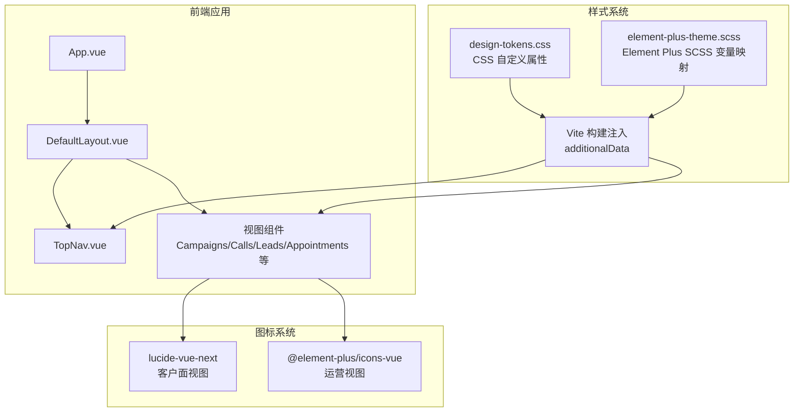
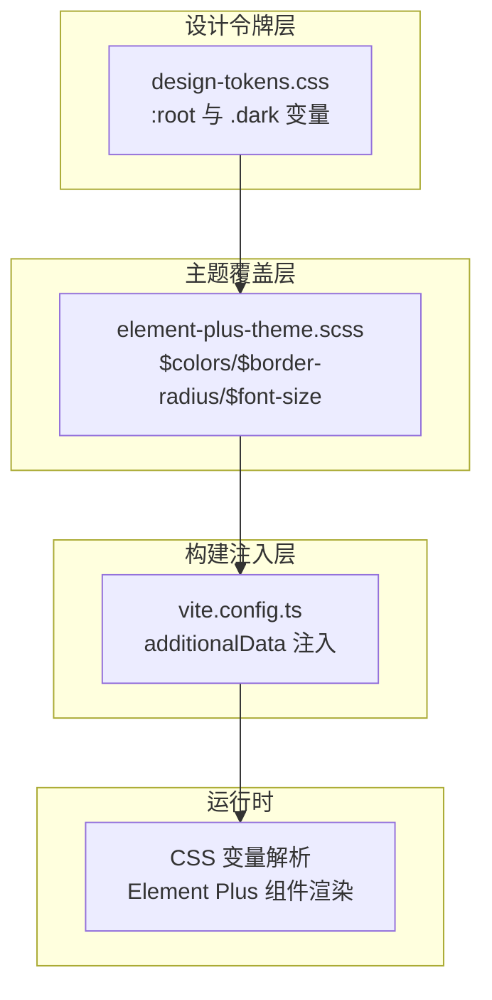
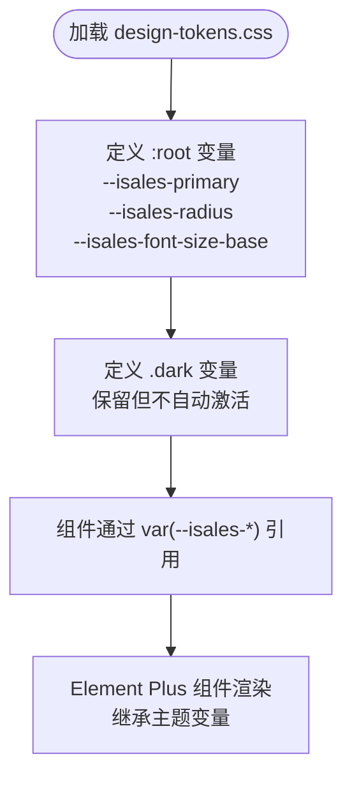
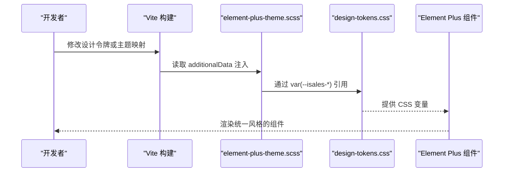
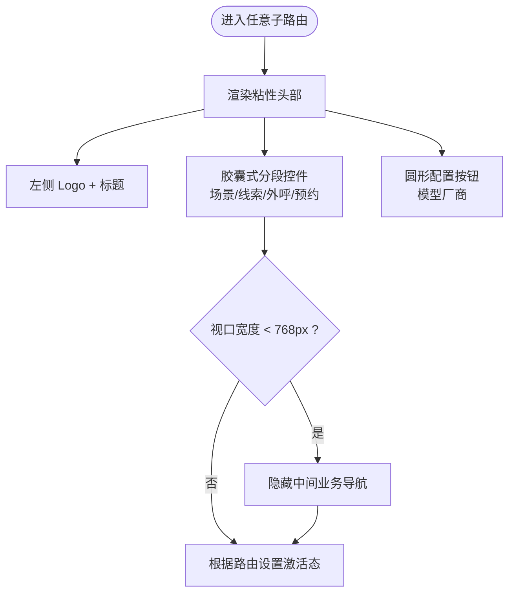
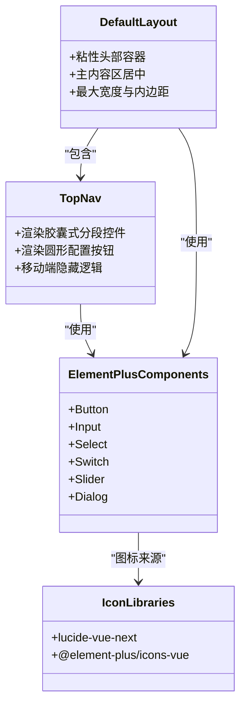
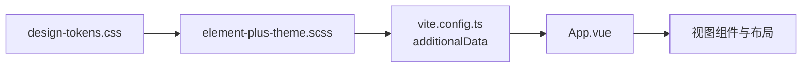

# 用户界面设计系统

<cite>
**本文档引用的文件**
- [DESIGN.md](file://DESIGN.md)
- [README.md](file://README.md)
- [web-admin-ui 规范](file://openspec/specs/web-admin-ui/spec.md)
- [Web 管理界面重设计决策](file://openspec/changes/archive/2026-05-22-web-admin-ui-redesign/design.md)
- [Web 管理界面重设计任务清单](file://openspec/changes/archive/2026-05-22-web-admin-ui-redesign/tasks.md)
- [Web 管理界面重设计验收标准](file://openspec/changes/archive/2026-05-22-web-admin-ui-redesign/acceptance.md)
- [Web 管理界面重设计提案](file://openspec/changes/archive/2026-05-22-web-admin-ui-redesign/proposal.md)
</cite>

## 目录
1. [简介](#简介)
2. [项目结构](#项目结构)
3. [核心组件](#核心组件)
4. [架构总览](#架构总览)
5. [详细组件分析](#详细组件分析)
6. [依赖关系分析](#依赖关系分析)
7. [性能考虑](#性能考虑)
8. [故障排除指南](#故障排除指南)
9. [结论](#结论)
10. [附录](#附录)

## 简介
本文件面向 iSales 管理后台的用户界面设计系统，围绕基于 Element Plus 的设计系统实现进行系统化说明。重点涵盖设计令牌（Design Tokens）的应用、CSS 变量注入、主题定制与组件样式覆盖；同时阐述响应式设计原则、移动端适配、暗色主题预留以及无障碍访问相关要求。文档还提供了颜色系统、字体系统、间距系统、圆角系统和组件样式规范的具体实现示例，并给出设计系统的维护策略、版本管理和团队协作规范。

## 项目结构
本设计系统属于 isales-web 仓库的一部分，采用 Vue 3 + Element Plus + Vite 技术栈。设计系统的核心实现包括：
- 设计令牌文件：src/styles/design-tokens.css
- Element Plus SCSS 主题覆盖：src/styles/element-plus-theme.scss
- 构建注入配置：vite.config.ts（通过 css.preprocessorOptions.scss.additionalData 注入 SCSS）
- 顶部导航与布局重构：TopNav.vue、DefaultLayout.vue
- 图标库：lucide-vue-next（客户面视图使用），保留 @element-plus/icons-vue（运营视图）

**图表来源**
- [Web 管理界面重设计任务清单:1-21](file://openspec/changes/archive/2026-05-22-web-admin-ui-redesign/tasks.md#L1-L21)
- [Web 管理界面重设计验收标准:34-39](file://openspec/changes/archive/2026-05-22-web-admin-ui-redesign/acceptance.md#L34-L39)

**章节来源**
- [README.md: 项目概述与部署:1-86](file://README.md#L1-L86)
- [DESIGN.md: 项目索引与 OpenSpec 工作流:1-75](file://DESIGN.md#L1-L75)
- [Web 管理界面重设计任务清单:1-21](file://openspec/changes/archive/2026-05-22-web-admin-ui-redesign/tasks.md#L1-L21)

## 核心组件
本设计系统的核心组件包括：
- 设计令牌（Design Tokens）：通过 CSS 自定义属性集中管理颜色、圆角、字号等视觉变量，前缀为 --isales-*
- Element Plus 主题覆盖：通过 SCSS 将 Element Plus 的内部变量映射到设计令牌，实现全局主题定制
- 顶部导航与布局：TopNav.vue 提供胶囊式分段控件与配置入口，DefaultLayout.vue 作为粘性头部容器
- 图标系统：lucide-vue-next 用于客户面视图，保留 @element-plus/icons-vue 用于运营视图
- 响应式与移动端适配：在小于 768px 时隐藏中间业务导航，保留配置入口

**章节来源**
- [web-admin-ui 规范: 设计令牌与主题:124-166](file://openspec/specs/web-admin-ui/spec.md#L124-L166)
- [Web 管理界面重设计任务清单:1-21](file://openspec/changes/archive/2026-05-22-web-admin-ui-redesign/tasks.md#L1-L21)
- [Web 管理界面重设计验收标准:34-39](file://openspec/changes/archive/2026-05-22-web-admin-ui-redesign/acceptance.md#L34-L39)

## 架构总览
设计系统采用“设计令牌 + 主题覆盖 + 构建注入”的三层架构：
- 设计令牌层：集中定义视觉变量，支持亮色与暗色两套变量（暗色不自动激活）
- 主题覆盖层：将 Element Plus 的 SCSS 变量映射到设计令牌，保证 Element Plus 组件风格统一
- 构建注入层：通过 Vite 的 additionalData 将 SCSS 注入到所有样式文件，确保变量在编译期生效

**图表来源**
- [Web 管理界面重设计任务清单:4-6](file://openspec/changes/archive/2026-05-22-web-admin-ui-redesign/tasks.md#L4-L6)
- [Web 管理界面重设计验收标准:34-39](file://openspec/changes/archive/2026-05-22-web-admin-ui-redesign/acceptance.md#L34-L39)

**章节来源**
- [Web 管理界面重设计决策:33-42](file://openspec/changes/archive/2026-05-22-web-admin-ui-redesign/design.md#L33-L42)
- [Web 管理界面重设计任务清单:4-6](file://openspec/changes/archive/2026-05-22-web-admin-ui-redesign/tasks.md#L4-L6)

## 详细组件分析

### 设计令牌（Design Tokens）应用
- 令牌命名：统一使用 --isales-* 前缀，涵盖主色、圆角半径、基础字号等
- 令牌内容：包含 oklch 色板、状态色（new/blue、contacted/yellow、interested/green、appointed/purple、visited/gray、lost/red 等）及其 100/700/800 三档
- 作用范围：通过 CSS 变量在所有组件中引用，确保设计一致性
- 暗色主题预留：同时定义 :root 与 .dark 两组变量，但 v1.0 内不自动激活

**图表来源**
- [web-admin-ui 规范: 设计令牌与主题:124-166](file://openspec/specs/web-admin-ui/spec.md#L124-L166)
- [Web 管理界面重设计任务清单:4-4](file://openspec/changes/archive/2026-05-22-web-admin-ui-redesign/tasks.md#L4-L4)

**章节来源**
- [web-admin-ui 规范: 设计令牌与主题:124-166](file://openspec/specs/web-admin-ui/spec.md#L124-L166)
- [Web 管理界面重设计任务清单:4-4](file://openspec/changes/archive/2026-05-22-web-admin-ui-redesign/tasks.md#L4-L4)

### CSS 变量注入与主题定制
- 注入机制：通过 Vite 的 css.preprocessorOptions.scss.additionalData，在编译期将 SCSS 注入到所有样式文件
- 主题映射：element-plus-theme.scss 将 Element Plus 的 $colors、$border-radius、$font-size-base 等变量映射到设计令牌
- 组件样式覆盖：通过主题覆盖实现 Element Plus 组件的外观统一，避免深链样式污染

**图表来源**
- [Web 管理界面重设计任务清单:5-6](file://openspec/changes/archive/2026-05-22-web-admin-ui-redesign/tasks.md#L5-L6)
- [Web 管理界面重设计验收标准:34-39](file://openspec/changes/archive/2026-05-22-web-admin-ui-redesign/acceptance.md#L34-L39)

**章节来源**
- [Web 管理界面重设计任务清单:5-6](file://openspec/changes/archive/2026-05-22-web-admin-ui-redesign/tasks.md#L5-L6)
- [Web 管理界面重设计验收标准:34-39](file://openspec/changes/archive/2026-05-22-web-admin-ui-redesign/acceptance.md#L34-L39)

### 顶部导航与布局（TopNav 与 DefaultLayout）
- 顶部导航：提供胶囊式分段控件（场景/线索/外呼/预约）与圆形配置按钮（模型厂商），支持激活态视觉反馈
- 布局容器：DefaultLayout 作为粘性头部容器，移除侧边栏，主内容区居中并设置最大宽度与内边距
- 移动端适配：当视口宽度小于 768px 时，隐藏中间业务导航，保留配置入口

**图表来源**
- [web-admin-ui 规范: 顶级信息架构:157-185](file://openspec/specs/web-admin-ui/spec.md#L157-L185)
- [Web 管理界面重设计任务清单:13-16](file://openspec/changes/archive/2026-05-22-web-admin-ui-redesign/tasks.md#L13-L16)

**章节来源**
- [web-admin-ui 规范: 顶级信息架构:157-185](file://openspec/specs/web-admin-ui/spec.md#L157-L185)
- [Web 管理界面重设计任务清单:13-16](file://openspec/changes/archive/2026-05-22-web-admin-ui-redesign/tasks.md#L13-L16)

### 图标系统与组件样式规范
- 图标库：客户面视图使用 lucide-vue-next，运营视图保留 @element-plus/icons-vue
- 组件样式：优先使用 Element Plus 原生组件（Button/Input/Select/Switch/Slider/Dialog），通过卡片/头部等自定义外壳包裹，减少深链样式依赖
- 样式覆盖：针对极少数泄漏默认样式的组件，进行针对性 SCSS 覆盖

**图表来源**
- [web-admin-ui 规范: 图标库切换:143-156](file://openspec/specs/web-admin-ui/spec.md#L143-L156)
- [Web 管理界面重设计任务清单:7-8](file://openspec/changes/archive/2026-05-22-web-admin-ui-redesign/tasks.md#L7-L8)

**章节来源**
- [web-admin-ui 规范: 图标库切换:143-156](file://openspec/specs/web-admin-ui/spec.md#L143-L156)
- [Web 管理界面重设计决策:101-103](file://openspec/changes/archive/2026-05-22-web-admin-ui-redesign/design.md#L101-L103)

### 响应式设计与移动端适配
- 断点策略：视口宽度小于 768px 时，中间业务导航隐藏，配置入口保留
- 布局约束：主内容区设置最大宽度并居中，确保在小屏设备上的可读性与可用性
- 交互优化：胶囊式分段控件在移动端通过更紧凑的布局保持操作效率

**章节来源**
- [web-admin-ui 规范: 顶级信息架构:181-185](file://openspec/specs/web-admin-ui/spec.md#L181-L185)

### 暗色主题支持（预留）
- 变量预留：design-tokens.css 同时定义 :root 与 .dark 两组变量
- 切换策略：v1.0 范围内不自动激活，后续通过独立变更引入主题切换功能
- 兼容性：现有组件样式不受影响，暗色变量仅为未来扩展预留

**章节来源**
- [web-admin-ui 规范: 暗色主题预留:138-142](file://openspec/specs/web-admin-ui/spec.md#L138-L142)
- [Web 管理界面重设计决策](file://openspec/changes/archive/2026-05-22-web-admin-ui-redesign/design.md#L26)

### 无障碍访问（A11y）要求
- 语义化标签：使用 Element Plus 原生组件的语义化结构，确保屏幕阅读器可正确识别
- 键盘导航：保持组件的原生键盘可达性，避免自定义外壳破坏默认焦点顺序
- 对比度与可读性：通过设计令牌中的状态色与文本色保障足够的对比度
- 状态反馈：激活态视觉反馈（胶囊式分段控件的背景与阴影）帮助用户感知当前状态

**章节来源**
- [web-admin-ui 规范: 设计令牌与主题:124-166](file://openspec/specs/web-admin-ui/spec.md#L124-L166)

## 依赖关系分析
设计系统的依赖关系主要体现在样式注入与主题映射上：

**图表来源**
- [Web 管理界面重设计任务清单:4-6](file://openspec/changes/archive/2026-05-22-web-admin-ui-redesign/tasks.md#L4-L6)
- [Web 管理界面重设计验收标准:34-39](file://openspec/changes/archive/2026-05-22-web-admin-ui-redesign/acceptance.md#L34-L39)

**章节来源**
- [Web 管理界面重设计任务清单:4-6](file://openspec/changes/archive/2026-05-22-web-admin-ui-redesign/tasks.md#L4-L6)
- [Web 管理界面重设计验收标准:34-39](file://openspec/changes/archive/2026-05-22-web-admin-ui-redesign/acceptance.md#L34-L39)

## 性能考虑
- 体积控制：通过 Vite 的 manualChunks 将第三方库拆分为独立 chunk，降低首屏包体
- 图标按需：lucide-vue-next 采用树摇导入，实际打包尺寸控制在 30 KB 以内
- 样式注入：通过 additionalData 在编译期注入 SCSS，避免运行时样式计算开销

**章节来源**
- [Web 管理界面重设计任务清单:10-10](file://openspec/changes/archive/2026-05-22-web-admin-ui-redesign/tasks.md#L10-L10)
- [Web 管理界面重设计任务清单:7-8](file://openspec/changes/archive/2026-05-22-web-admin-ui-redesign/tasks.md#L7-L8)

## 故障排除指南
- 主题不生效：检查 vite.config.ts 的 additionalData 配置是否正确注入 element-plus-theme.scss
- 变量未定义：确认 design-tokens.css 是否正确加载，且变量前缀为 --isales-*
- 组件样式异常：若出现 Element Plus 组件使用硬编码颜色或阴影，需在主题覆盖中补充针对性 SCSS 覆盖
- 图标缺失：确认 lucide-vue-next 已安装并在客户面视图中使用，运营视图仍使用 @element-plus/icons-vue

**章节来源**
- [Web 管理界面重设计决策:101-103](file://openspec/changes/archive/2026-05-22-web-admin-ui-redesign/design.md#L101-L103)
- [Web 管理界面重设计任务清单:7-8](file://openspec/changes/archive/2026-05-22-web-admin-ui-redesign/tasks.md#L7-L8)

## 结论
本设计系统通过“设计令牌 + 主题覆盖 + 构建注入”的架构，实现了 Element Plus 组件的统一风格与可维护性。设计令牌集中管理视觉变量，Element Plus SCSS 主题覆盖确保组件外观一致，构建注入机制保证变量在编译期生效。配合顶部导航与布局重构、图标库切换以及移动端适配策略，形成了稳定、可扩展的前端设计系统。暗色主题预留为未来扩展奠定基础，而无障碍访问要求则确保系统具备良好的可用性。

## 附录

### 设计令牌规范示例
- 主色：--isales-primary = #030213
- 圆角：--isales-radius = 0.625rem
- 基础字号：--isales-font-size-base = 14px（中文密致基线）
- 状态色：new/blue、contacted/yellow、interested/green、appointed/purple、visited/gray、lost/red，各色包含 100/700/800 三档

**章节来源**
- [web-admin-ui 规范: 设计令牌与主题:128-136](file://openspec/specs/web-admin-ui/spec.md#L128-L136)

### 版本管理与团队协作规范
- OpenSpec 工作流：通过 /opsx:propose → /opsx:apply → /opsx:archive 的完整生命周期管理设计变更
- 变更落地：设计系统相关变更需在 isales-web 仓库中实施，遵循任务清单与验收标准
- 团队协作：前端团队负责样式与组件实现，后端团队负责 API 能力支撑，共同确保设计令牌与组件样式的对齐

**章节来源**
- [DESIGN.md: OpenSpec 工作流:49-56](file://DESIGN.md#L49-L56)
- [Web 管理界面重设计提案:1-5](file://openspec/changes/archive/2026-05-22-web-admin-ui-redesign/proposal.md#L1-L5)