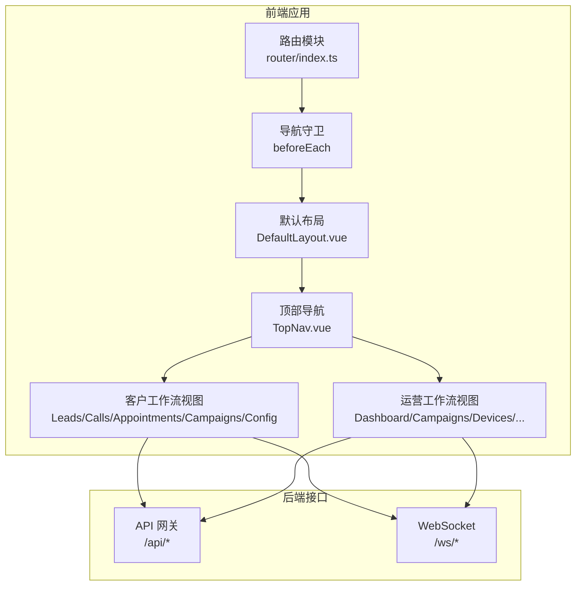
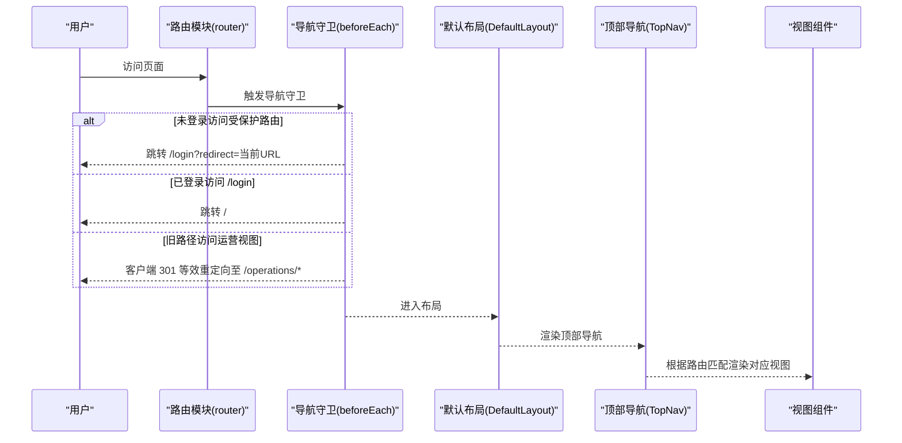
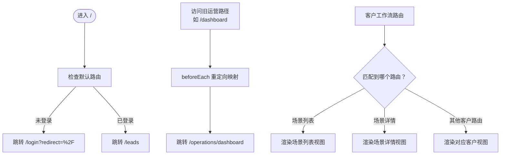
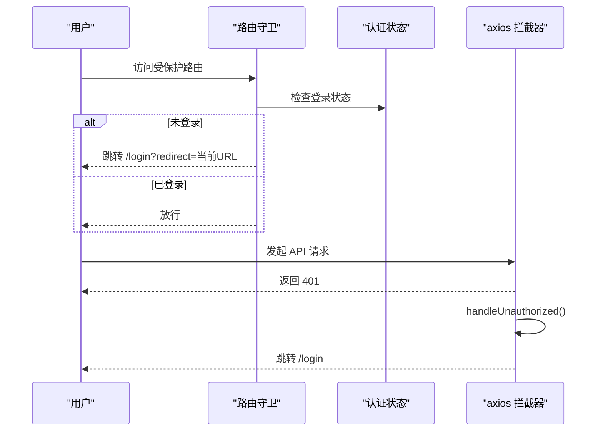
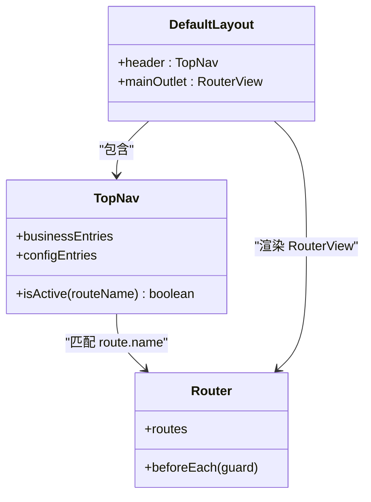
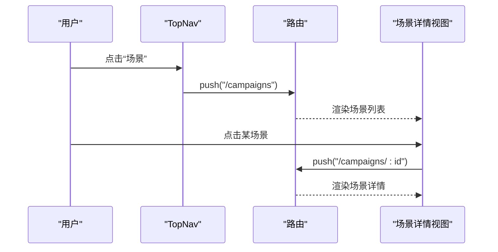
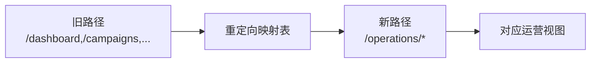
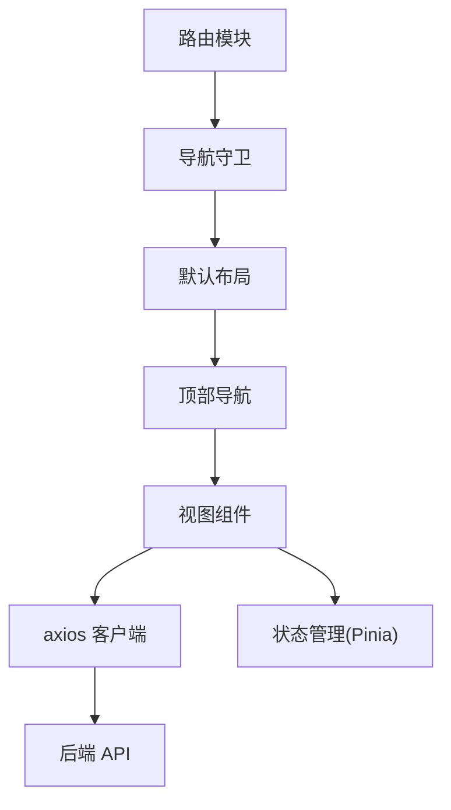

# 路由与导航

<cite>
**本文引用的文件**
- [2026-05-08-impl-web 任务清单](file://openspec/changes/archive/2026-05-08-impl-web/tasks.md)
- [2026-05-22-web-admin-ui-redesign 任务清单](file://openspec/changes/archive/2026-05-22-web-admin-ui-redesign/tasks.md)
- [2026-05-23-web-admin-campaign-workflow 任务清单](file://openspec/changes/archive/2026-05-23-web-admin-campaign-workflow/tasks.md)
- [2026-05-22-web-admin-ui-redesign 设计决策](file://openspec/changes/archive/2026-05-22-web-admin-ui-redesign/design.md)
</cite>

## 目录
1. [简介](#简介)
2. [项目结构](#项目结构)
3. [核心组件](#核心组件)
4. [架构总览](#架构总览)
5. [详细组件分析](#详细组件分析)
6. [依赖关系分析](#依赖关系分析)
7. [性能考量](#性能考量)
8. [故障排查指南](#故障排查指南)
9. [结论](#结论)
10. [附录](#附录)

## 简介
本技术文档围绕基于 Vue Router 的路由与导航系统进行系统化梳理，重点覆盖以下方面：
- 路由定义与组织：客户工作流路由、运营工作流路由、嵌套路由与子路由设计
- 导航管理：导航拦截、权限控制、面包屑与侧边栏/顶部导航的实现思路
- 路由重定向与历史记录：客户端 301 等效重定向策略、查询参数与哈希保留
- 性能优化：懒加载策略、SEO 友好性与构建体积控制
- 实践示例：以“场景（Campaigns）”为例的路由实现路径与导航联动

## 项目结构
根据变更记录可知，前端采用 Vue 3 + Vite + Element Plus + Pinia + Vue Router + axios 的技术栈，路由与导航相关的关键位置如下：
- 路由入口与守卫：位于路由模块（router/index.ts），包含 beforeEach 导航守卫与重定向映射
- 顶部导航与布局：DefaultLayout 与 TopNav 组件负责导航状态与布局
- 权限与鉴权：axios 请求拦截器与响应拦截器处理 401，结合路由守卫实现未登录拦截
- 视图与工作流：客户工作流（线索/外呼/预约/场景/配置）与运营工作流（仪表盘/场景管理/设备/回调等）的视图入口

**图表来源**
- [2026-05-22-web-admin-ui-redesign 设计决策:44-63](file://openspec/changes/archive/2026-05-22-web-admin-ui-redesign/design.md#L44-L63)
- [2026-05-22-web-admin-ui-redesign 任务清单:18-30](file://openspec/changes/archive/2026-05-22-web-admin-ui-redesign/tasks.md#L18-L30)
- [2026-05-08-impl-web 任务清单:17-25](file://openspec/changes/archive/2026-05-08-impl-web/tasks.md#L17-L25)

**章节来源**
- [2026-05-22-web-admin-ui-redesign 设计决策:44-63](file://openspec/changes/archive/2026-05-22-web-admin-ui-redesign/design.md#L44-L63)
- [2026-05-22-web-admin-ui-redesign 任务清单:18-30](file://openspec/changes/archive/2026-05-22-web-admin-ui-redesign/tasks.md#L18-L30)
- [2026-05-08-impl-web 任务清单:17-25](file://openspec/changes/archive/2026-05-08-impl-web/tasks.md#L17-L25)

## 核心组件
- 路由模块与导航守卫
  - 路由入口与重定向：在路由模块中新增客户工作流路由，并将原有运营视图迁移至 /operations 前缀，同时在 beforeEach 中实现旧路径到新路径的客户端 301 等效重定向，保留查询参数与哈希
  - 权限控制：未登录用户强制跳转登录页（携带 redirect 参数），已登录访问登录页则跳转到默认页面
- 顶部导航与布局
  - DefaultLayout 移除了侧边栏，采用 Sticky Header 的 TopNav 作为主导航容器，主内容区居中并设置最大宽度与内边距
  - TopNav 使用 vue-router 控制激活态，通过 route.name 匹配实现导航高亮
- 视图与工作流
  - 客户工作流：线索、外呼、预约、场景（列表/详情）、配置（模型厂商等）
  - 运营工作流：仪表盘、场景管理、监控、回调配置/日志、转人工任务、节假日、设备、SIM 卡等

**章节来源**
- [2026-05-22-web-admin-ui-redesign 任务清单:18-30](file://openspec/changes/archive/2026-05-22-web-admin-ui-redesign/tasks.md#L18-L30)
- [2026-05-23-web-admin-campaign-workflow 任务清单:35-47](file://openspec/changes/archive/2026-05-23-web-admin-campaign-workflow/tasks.md#L35-L47)
- [2026-05-08-impl-web 任务清单:17-25](file://openspec/changes/archive/2026-05-08-impl-web/tasks.md#L17-L25)

## 架构总览
下图展示了路由与导航的整体交互：路由守卫负责权限与重定向，布局组件承载导航，视图组件承载业务工作流。

**图表来源**
- [2026-05-22-web-admin-ui-redesign 设计决策:54-63](file://openspec/changes/archive/2026-05-22-web-admin-ui-redesign/design.md#L54-L63)
- [2026-05-22-web-admin-ui-redesign 任务清单:24-25](file://openspec/changes/archive/2026-05-22-web-admin-ui-redesign/tasks.md#L24-L25)
- [2026-05-08-impl-web 任务清单:19-23](file://openspec/changes/archive/2026-05-08-impl-web/tasks.md#L19-L23)

## 详细组件分析

### 路由定义与组织
- 客户工作流路由
  - 新增场景列表与详情路由，将原本独立的配置路由整合到场景详情中，减少顶层路由数量，提升信息架构清晰度
  - 默认路由重定向至客户工作流首页，确保首次访问进入正确的业务域
- 运营工作流路由
  - 将原有运营视图迁移至 /operations 前缀，便于区分客户与运营视角，同时通过导航守卫实现旧路径到新路径的客户端重定向
- 嵌套路由与子路由
  - 通话详情等复杂视图采用嵌套路由设计，父路由负责容器，子路由负责具体区域（如详情页的头部/侧边/主体）

**图表来源**
- [2026-05-22-web-admin-ui-redesign 任务清单:20-25](file://openspec/changes/archive/2026-05-22-web-admin-ui-redesign/tasks.md#L20-L25)
- [2026-05-23-web-admin-campaign-workflow 任务清单:40-46](file://openspec/changes/archive/2026-05-23-web-admin-campaign-workflow/tasks.md#L40-L46)

**章节来源**
- [2026-05-22-web-admin-ui-redesign 任务清单:20-29](file://openspec/changes/archive/2026-05-22-web-admin-ui-redesign/tasks.md#L20-L29)
- [2026-05-23-web-admin-campaign-workflow 任务清单:40-46](file://openspec/changes/archive/2026-05-23-web-admin-campaign-workflow/tasks.md#L40-L46)

### 导航拦截与权限控制
- 未登录拦截
  - 导航守卫检测用户状态，未登录访问受保护路由时跳转登录页，并携带 redirect 参数以便登录后回到原页面
- 登录页保护
  - 已登录用户访问登录页时，守卫将其重定向到默认首页，避免重复登录
- 401 自动处理
  - axios 请求拦截器在收到 401 时调用统一处理函数，清除本地状态并跳转登录页，保证全局一致性

**图表来源**
- [2026-05-08-impl-web 任务清单:19-23](file://openspec/changes/archive/2026-05-08-impl-web/tasks.md#L19-L23)

**章节来源**
- [2026-05-08-impl-web 任务清单:19-23](file://openspec/changes/archive/2026-05-08-impl-web/tasks.md#L19-L23)

### 面包屑导航与侧边栏/顶部导航
- 顶部导航
  - 采用自定义 TopNav 组件，使用 flex 布局与图标库，通过 vue-router 的 route.name 匹配控制激活态
  - 导航分为业务入口与配置入口两类，移动端在小屏下隐藏部分业务入口，保证可用性
- 侧边栏
  - 默认布局已移除侧边栏，采用顶部导航与主内容区的组合，提升桌面端信息密度与一致性
- 面包屑
  - 通过路由元信息与导航组件协作实现层级展示，结合导航守卫与布局组件共同维护导航上下文

**图表来源**
- [2026-05-22-web-admin-ui-redesign 设计决策:44-52](file://openspec/changes/archive/2026-05-22-web-admin-ui-redesign/design.md#L44-L52)
- [2026-05-22-web-admin-ui-redesign 任务清单:13-16](file://openspec/changes/archive/2026-05-22-web-admin-ui-redesign/tasks.md#L13-L16)

**章节来源**
- [2026-05-22-web-admin-ui-redesign 设计决策:44-52](file://openspec/changes/archive/2026-05-22-web-admin-ui-redesign/design.md#L44-L52)
- [2026-05-22-web-admin-ui-redesign 任务清单:13-16](file://openspec/changes/archive/2026-05-22-web-admin-ui-redesign/tasks.md#L13-L16)

### 客户工作流路由与导航联动
- 场景（Campaigns）路由
  - 新增场景列表与详情路由，详情页集成外呼策略配置、可拨时段编辑、音色选择等能力
  - 通过导航守卫与布局组件，确保从客户工作流入口进入后，导航状态与视图一致
- 线索（Leads）与外呼（Calls）/预约（Appointments）
  - 线索列表移除外呼按钮，改为编辑/删除；顶部横幅提示外呼由场景驱动，引导用户前往场景管理
  - 外呼与预约视图作为客户工作流的入口，配合 TopNav 的业务入口实现快速切换

**图表来源**
- [2026-05-23-web-admin-campaign-workflow 任务清单:40-46](file://openspec/changes/archive/2026-05-23-web-admin-campaign-workflow/tasks.md#L40-L46)
- [2026-05-23-web-admin-campaign-workflow 任务清单:50-66](file://openspec/changes/archive/2026-05-23-web-admin-campaign-workflow/tasks.md#L50-L66)

**章节来源**
- [2026-05-23-web-admin-campaign-workflow 任务清单:40-66](file://openspec/changes/archive/2026-05-23-web-admin-campaign-workflow/tasks.md#L40-L66)

### 运营工作流路由与重定向
- 运营视图迁移
  - 将原有运营视图迁移至 /operations 前缀，避免与客户工作流混淆
- 客户端 301 等效重定向
  - 在 beforeEach 中维护重定向映射表，将旧路径映射到新的 /operations/* 路径，保留查询参数与哈希，确保书签与分享链接可用
- 运营入口
  - 顶部导航的用户下拉菜单或右侧操作区提供“运营管理”入口，指向 /operations

**图表来源**
- [2026-05-22-web-admin-ui-redesign 设计决策:54-63](file://openspec/changes/archive/2026-05-22-web-admin-ui-redesign/design.md#L54-L63)
- [2026-05-22-web-admin-ui-redesign 任务清单:22-29](file://openspec/changes/archive/2026-05-22-web-admin-ui-redesign/tasks.md#L22-L29)

**章节来源**
- [2026-05-22-web-admin-ui-redesign 设计决策:54-63](file://openspec/changes/archive/2026-05-22-web-admin-ui-redesign/design.md#L54-L63)
- [2026-05-22-web-admin-ui-redesign 任务清单:22-29](file://openspec/changes/archive/2026-05-22-web-admin-ui-redesign/tasks.md#L22-L29)

### 动态路由与导航拦截
- 动态路由
  - 场景详情路由使用动态参数（如 :id），用于加载指定场景的数据与配置
- 导航拦截
  - 在 beforeEach 中对动态路由进行权限校验与参数校验，必要时进行重定向或错误处理

**章节来源**
- [2026-05-23-web-admin-campaign-workflow 任务清单:40-46](file://openspec/changes/archive/2026-05-23-web-admin-campaign-workflow/tasks.md#L40-L46)

## 依赖关系分析
- 路由模块依赖导航守卫与布局组件，布局组件依赖顶部导航组件
- 顶部导航依赖路由状态（route.name）进行激活态控制
- 视图组件依赖 API 模块与状态管理（Pinia），并通过 axios 与后端交互
- 导航守卫依赖认证状态与重定向映射表，确保全局一致性

**图表来源**
- [2026-05-08-impl-web 任务清单:19-23](file://openspec/changes/archive/2026-05-08-impl-web/tasks.md#L19-L23)
- [2026-05-22-web-admin-ui-redesign 任务清单:13-16](file://openspec/changes/archive/2026-05-22-web-admin-ui-redesign/tasks.md#L13-L16)

**章节来源**
- [2026-05-08-impl-web 任务清单:19-23](file://openspec/changes/archive/2026-05-08-impl-web/tasks.md#L19-L23)
- [2026-05-22-web-admin-ui-redesign 任务清单:13-16](file://openspec/changes/archive/2026-05-22-web-admin-ui-redesign/tasks.md#L13-L16)

## 性能考量
- 懒加载策略
  - 通过路由级别的懒加载减少首屏包体，结合按需导入与 Tree Shaking 控制第三方依赖体积
- 构建体积控制
  - 通过依赖精简与图标库按需引入，确保打包体积在合理范围内
- SEO 友好性
  - SPA 场景下建议结合服务端渲染或预渲染策略（如后续扩展），当前以客户端路由为主，需注意搜索引擎抓取与索引问题

**章节来源**
- [2026-05-22-web-admin-ui-redesign 任务清单:86-88](file://openspec/changes/archive/2026-05-22-web-admin-ui-redesign/tasks.md#L86-L88)

## 故障排查指南
- 登录后无法回到原页面
  - 检查导航守卫是否正确传递 redirect 参数，以及登录页是否正确处理 redirect 查询参数
- 旧路径访问 404
  - 确认导航守卫中的重定向映射表是否包含该路径，以及是否保留了查询参数与哈希
- 401 未触发登录跳转
  - 检查 axios 拦截器是否正确调用统一处理函数并执行路由跳转
- 顶部导航激活态异常
  - 确认 TopNav 的 isActive 逻辑与 route.name 匹配是否一致，以及是否存在子路由未覆盖的情况

**章节来源**
- [2026-05-08-impl-web 任务清单:19-23](file://openspec/changes/archive/2026-05-08-impl-web/tasks.md#L19-L23)
- [2026-05-22-web-admin-ui-redesign 设计决策:54-63](file://openspec/changes/archive/2026-05-22-web-admin-ui-redesign/design.md#L54-L63)

## 结论
本路由与导航系统以 Vue Router 为核心，结合自定义顶部导航与布局组件，实现了清晰的客户与运营工作流分离、完善的权限控制与导航拦截机制。通过客户端 301 等效重定向与路由元信息，既保证了用户体验与书签兼容，也为后续扩展埋下了良好基础。建议在后续阶段进一步完善懒加载策略与 SEO 友好性方案，持续优化构建体积与运行性能。

## 附录
- 示例：场景（Campaigns）路由实现路径
  - 客户工作流路由新增场景列表与详情路由，详情页集成外呼策略配置、可拨时段编辑、音色选择等能力
  - 顶部导航通过 route.name 匹配控制激活态，确保用户在不同视图间切换时的导航一致性

**章节来源**
- [2026-05-23-web-admin-campaign-workflow 任务清单:40-66](file://openspec/changes/archive/2026-05-23-web-admin-campaign-workflow/tasks.md#L40-L66)