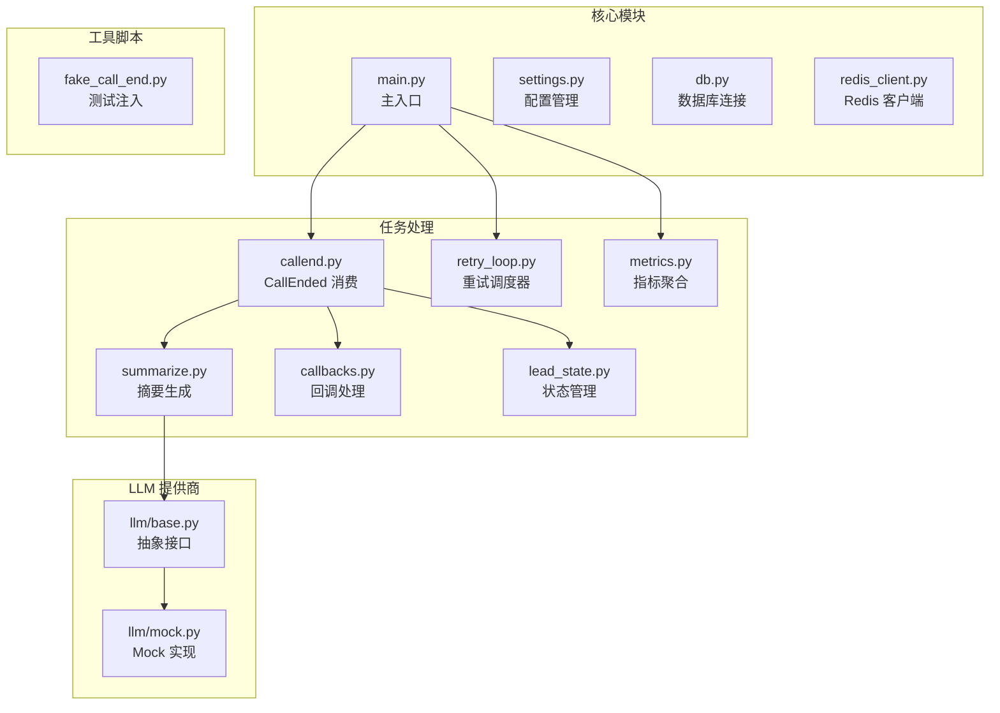
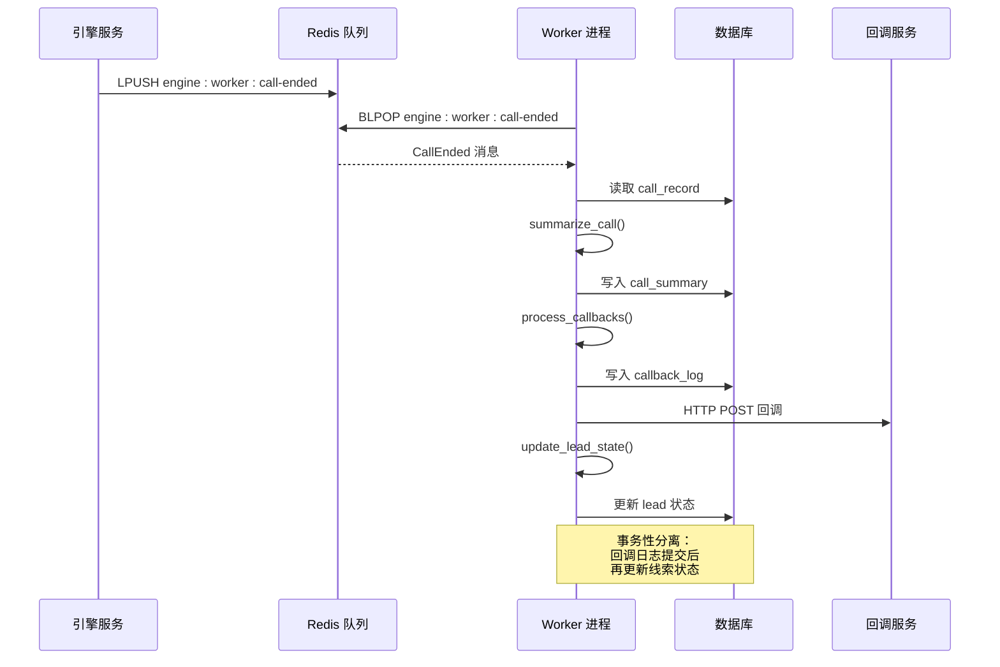
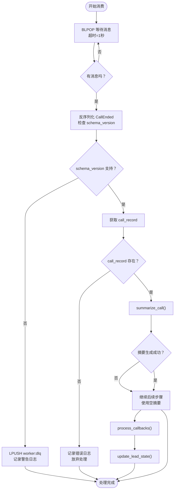
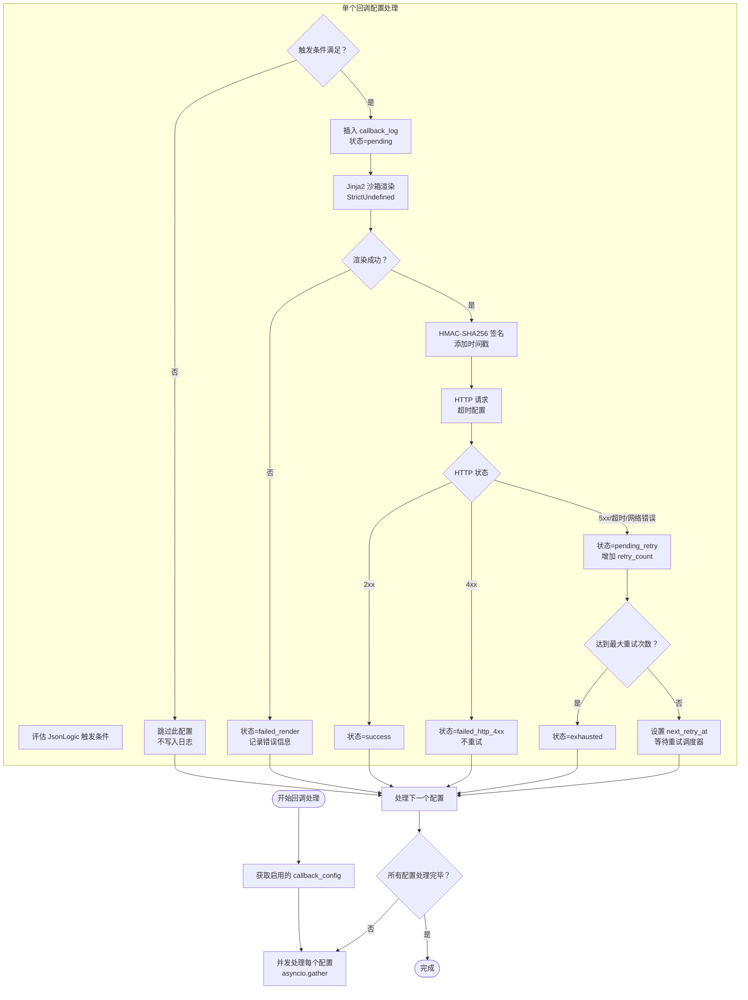
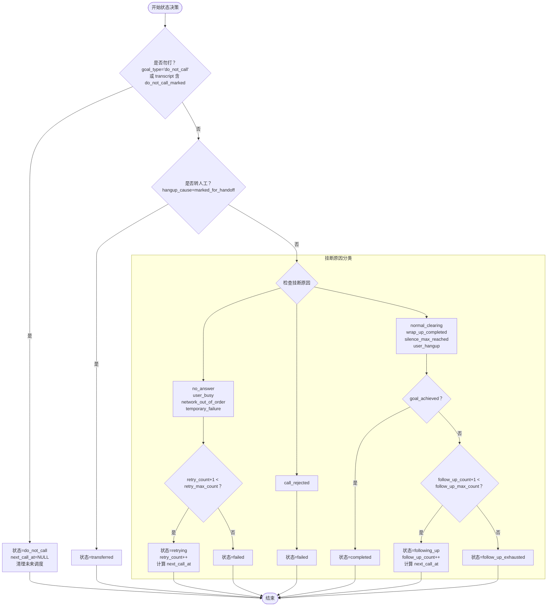
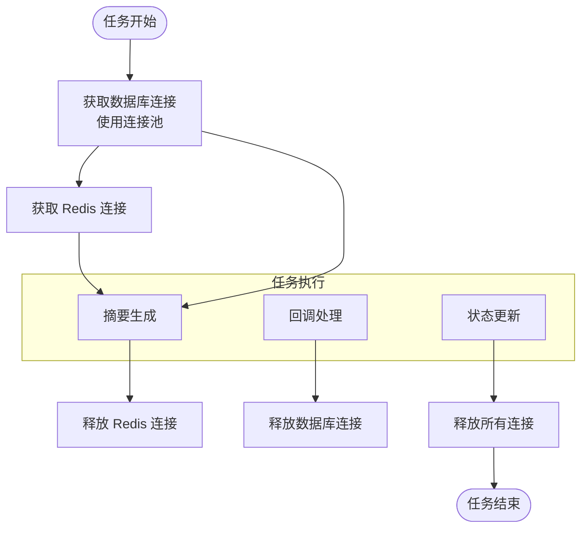
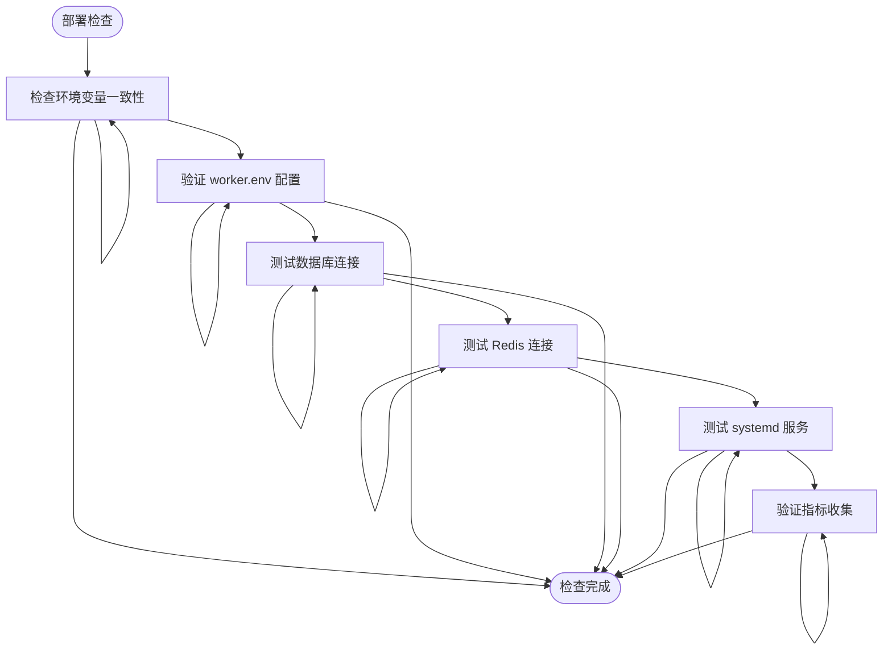

# isales-worker 异步处理器

<cite>
**本文档引用的文件**
- [README.md](file://README.md)
- [IMPLEMENTATION_PLAN.md](file://IMPLEMENTATION_PLAN.md)
- [design.md](file://openspec/changes/archive/2026-05-06-impl-worker/design.md)
- [proposal.md](file://openspec/changes/archive/2026-05-06-impl-worker/proposal.md)
- [tasks.md](file://openspec/changes/archive/2026-05-06-impl-worker/tasks.md)
- [webhook-callback 规范.md](file://openspec/changes/archive/2026-05-06-impl-worker/specs/webhook-callback/spec.md)
- [retry-followup 规范.md](file://openspec/changes/archive/2026-05-06-impl-scheduler/specs/retry-followup/spec.md)
- [worker.env.example](file://deploy/cloud/env/worker.env.example)
- [isales-worker.service](file://deploy/cloud/systemd/isales-worker.service)
- [check_env_consistency.py](file://deploy/linux/scripts/check_env_consistency.py)
</cite>

## 目录
1. [简介](#简介)
2. [项目结构](#项目结构)
3. [核心组件](#核心组件)
4. [架构概览](#架构概览)
5. [详细组件分析](#详细组件分析)
6. [依赖关系分析](#依赖关系分析)
7. [性能考虑](#性能考虑)
8. [故障排除指南](#故障排除指南)
9. [结论](#结论)

## 简介

isales-worker 是 iSales 语音外呼系统中的异步处理器，负责在通话结束后执行后处理任务。该系统采用 asyncio 架构，使用 Redis 作为消息队列，实现了完整的异步任务处理流水线。

### 系统目标

- **异步后处理**：消费 `engine:worker:call-ended` 队列中的通话结束事件
- **任务串行化**：按 `summarize_call → process_callbacks → update_lead_state` 顺序执行
- **回调通知**：支持 JsonLogic 触发条件、Jinja2 模板渲染、HMAC-SHA256 签名的 Webhook 回调
- **状态管理**：根据通话结果更新线索状态，支持重试和跟进策略
- **监控告警**：提供指标聚合和告警机制

## 项目结构

基于 OpenSpec 规范，isales-worker 采用模块化设计，包含以下核心模块：



**图表来源**
- [tasks.md:16-13](file://openspec/changes/archive/2026-05-06-impl-worker/tasks.md#L16-L13)

**章节来源**
- [tasks.md:4-14](file://openspec/changes/archive/2026-05-06-impl-worker/tasks.md#L4-L14)
- [README.md:1-14](file://README.md#L1-L14)

## 核心组件

### 1. CallEnded 消费器

CallEnded 消费器是系统的核心入口，负责从 Redis 队列中消费通话结束事件。

**主要功能**：
- 使用 `BLPOP` 阻塞式监听 `engine:worker:call-ended` 队列
- 反序列化 CallEnded 消息，支持多种 schema 版本
- 单条消息处理完整链路：summarize → callbacks → lead state 更新
- 错误处理和死信队列机制

**章节来源**
- [tasks.md:16-22](file://openspec/changes/archive/2026-05-06-impl-worker/tasks.md#L16-L22)
- [design.md:37-56](file://openspec/changes/archive/2026-05-06-impl-worker/design.md#L37-L56)

### 2. 摘要生成器 (summarize_call)

摘要生成器负责将通话记录转换为结构化摘要信息。

**核心特性**：
- 支持 Mock LLM Provider 和真实 LLM Provider
- 从 transcript 中提取用户语音和机器人语音内容
- 生成摘要文本和结构化提取字段
- 唯一性约束防止重复摘要

**章节来源**
- [tasks.md:24-29](file://openspec/changes/archive/2026-05-06-impl-worker/tasks.md#L24-L29)
- [design.md:57-64](file://openspec/changes/archive/2026-05-06-impl-worker/design.md#L57-L64)

### 3. 回调处理器 (process_callbacks)

回调处理器实现完整的 Webhook 回调机制。

**功能特性**：
- JsonLogic 触发条件评估
- Jinja2 沙箱模板渲染
- HMAC-SHA256 签名机制
- 指数退避重试策略
- 失败状态分类和处理

**章节来源**
- [tasks.md:31-41](file://openspec/changes/archive/2026-05-06-impl-worker/tasks.md#L31-L41)
- [design.md:66-105](file://openspec/changes/archive/2026-05-06-impl-worker/design.md#L66-L105)

### 4. 线索状态管理器 (update_lead_state)

状态管理器根据通话结果更新线索状态。

**决策矩阵**：
- 重试状态：`retrying`（达到最大重试次数后转 `failed`）
- 成功状态：`completed`（目标达成）
- 跟进状态：`following_up`（目标未达成但允许跟进）
- 终止状态：`failed`、`transferred`、`do_not_call`、`follow_up_exhausted`

**章节来源**
- [tasks.md:51-61](file://openspec/changes/archive/2026-05-06-impl-worker/tasks.md#L51-L61)
- [design.md:106-129](file://openspec/changes/archive/2026-05-06-impl-worker/design.md#L106-L129)

### 5. 重试调度器 (retry_loop)

独立的后台任务，负责处理回调重试。

**工作原理**：
- 每 60 秒扫描 `callback_log` 表中状态为 `pending_retry` 的记录
- 按 `next_retry_at` 时间排序处理
- 复用原始请求体，避免上下文漂移
- 支持最大重试次数限制

**章节来源**
- [tasks.md:42-49](file://openspec/changes/archive/2026-05-06-impl-worker/tasks.md#L42-L49)
- [design.md:98-105](file://openspec/changes/archive/2026-05-06-impl-worker/design.md#L98-L105)

### 6. 指标聚合器 (aggregate_metrics)

定时任务，负责收集和聚合系统指标。

**聚合内容**：
- 7 天内的接通率
- 目标达成率  
- 平均通话时长
- 写入 Redis Hash 结构

**章节来源**
- [tasks.md:62-68](file://openspec/changes/archive/2026-05-06-impl-worker/tasks.md#L62-L68)
- [design.md:137-142](file://openspec/changes/archive/2026-05-06-impl-worker/design.md#L137-L142)

## 架构概览



**图表来源**
- [proposal.md:12-16](file://openspec/changes/archive/2026-05-06-impl-worker/proposal.md#L12-L16)
- [design.md:131-136](file://openspec/changes/archive/2026-05-06-impl-worker/design.md#L131-L136)

## 详细组件分析

### CallEnded 消费器详细流程



**图表来源**
- [tasks.md:18-22](file://openspec/changes/archive/2026-05-06-impl-worker/tasks.md#L18-L22)
- [design.md:46-56](file://openspec/changes/archive/2026-05-06-impl-worker/design.md#L46-L56)

**章节来源**
- [tasks.md:16-22](file://openspec/changes/archive/2026-05-06-impl-worker/tasks.md#L16-L22)

### 回调处理完整流程



**图表来源**
- [tasks.md:31-41](file://openspec/changes/archive/2026-05-06-impl-worker/tasks.md#L31-L41)
- [webhook-callback 规范.md:3-36](file://openspec/changes/archive/2026-05-06-impl-worker/specs/webhook-callback/spec.md#L3-L36)

**章节来源**
- [tasks.md:31-41](file://openspec/changes/archive/2026-05-06-impl-worker/tasks.md#L31-L41)

### 线索状态决策矩阵



**图表来源**
- [design.md:114-129](file://openspec/changes/archive/2026-05-06-impl-worker/design.md#L114-L129)
- [retry-followup 规范.md:34-51](file://openspec/changes/archive/2026-05-06-impl-scheduler/specs/retry-followup/spec.md#L34-L51)

**章节来源**
- [design.md:106-129](file://openspec/changes/archive/2026-05-06-impl-worker/design.md#L106-L129)

## 依赖关系分析

### 外部依赖

```mermaid
graph TB
subgraph "Python 依赖"
A[isales-common >= 0.1.2<br/>Pydantic 2 / SQLAlchemy 2]
B[sqlalchemy[asyncio]<br/>asyncpg]
C[redis]
D[httpx]
E[jinja2<br/>json-logic-py]
F[cryptography]
end
subgraph "系统依赖"
G[PostgreSQL 15+]
H[Redis 7+]
I[Python 3.11+]
end
Worker --> A
Worker --> B
Worker --> C
Worker --> D
Worker --> E
Worker --> F
A --> G
A --> H
Worker --> I
```

**图表来源**
- [tasks.md:7-8](file://openspec/changes/archive/2026-05-06-impl-worker/tasks.md#L7-L8)

### 配置依赖关系

| 环境变量 | 用途 | 依赖服务 | 默认值 |
|---------|------|----------|--------|
| `ISALES_DATABASE_URL` | 数据库连接 | PostgreSQL | - |
| `ISALES_REDIS_URL` | Redis 连接 | Redis | - |
| `ISALES_FERNET_KEY` | 加密密钥 | 所有服务共享 | - |
| `ISALES_WORKER_LLM_PROVIDER` | LLM 提供商类型 | LLM Provider | `mock` |
| `ISALES_WEBHOOK_DEFAULT_TIMEOUT_SECONDS` | 回调超时 | HTTP 请求 | `10` |
| `ISALES_WORKER_RETRY_TICK_INTERVAL` | 重试轮询间隔 | 重试调度器 | `60` |
| `TZ` | 时区设置 | 所有时间相关操作 | `Asia/Shanghai` |

**章节来源**
- [tasks.md:11](file://openspec/changes/archive/2026-05-06-impl-worker/tasks.md#L11)
- [worker.env.example:6-28](file://deploy/cloud/env/worker.env.example#L6-L28)

## 性能考虑

### 并发处理策略

1. **单实例部署**：v1 采用单实例部署，避免分布式协调复杂度
2. **异步非阻塞**：所有 I/O 操作使用 asyncio，提高并发效率
3. **回调并行化**：单条消息内多个回调配置使用 `asyncio.gather` 并行处理

### 资源管理



**图表来源**
- [design.md:37-44](file://openspec/changes/archive/2026-05-06-impl-worker/design.md#L37-L44)

### 监控指标

系统提供以下监控指标：

| 指标类型 | 指标名称 | 描述 |
|---------|----------|------|
| 计数器 | `call_processed_total` | 处理的通话总数 |
| 计数器 | `callback_success_total` | 成功回调数量 |
| 计数器 | `callback_failed_total` | 失败回调数量 |
| 计数器 | `lead_state_updated_total` | 线索状态更新数量 |
| 计时器 | `callback_duration_seconds` | 回调处理耗时 |
| 计数器 | `error_count_total` | 错误发生次数 |

## 故障排除指南

### 常见问题诊断

#### 1. 消息消费问题

**症状**：Worker 不消费队列消息
**排查步骤**：
1. 检查 Redis 服务状态：`redis-cli ping`
2. 验证队列是否存在：`redis-cli LLEN engine:worker:call-ended`
3. 检查 Worker 日志：`journalctl -u isales-worker -f`

**章节来源**
- [tasks.md:18](file://openspec/changes/archive/2026-05-06-impl-worker/tasks.md#L18)

#### 2. 回调失败问题

**症状**：回调请求失败或超时
**排查步骤**：
1. 检查 callback_log 表状态
2. 验证目标服务可达性
3. 查看重试调度器日志
4. 检查网络超时配置

**章节来源**
- [tasks.md:42-49](file://openspec/changes/archive/2026-05-06-impl-worker/tasks.md#L42-L49)

#### 3. 线索状态更新冲突

**症状**：UPDATE lead 语句返回 0 行受影响
**可能原因**：
- Scheduler 还未将状态设置为 'calling'
- 其他 Worker 已经更新了状态
- 线索已被手动修改

**解决方案**：
- 检查状态守卫条件
- 查看日志中的 WARN 信息
- 确认业务流程正确性

**章节来源**
- [design.md:106-112](file://openspec/changes/archive/2026-05-06-impl-worker/design.md#L106-L112)

### 部署和配置检查



**图表来源**
- [check_env_consistency.py:17](file://deploy/linux/scripts/check_env_consistency.py#L17)
- [check_env_consistency.py:38](file://deploy/linux/scripts/check_env_consistency.py#L38)

**章节来源**
- [check_env_consistency.py:17](file://deploy/linux/scripts/check_env_consistency.py#L17)
- [check_env_consistency.py:38](file://deploy/linux/scripts/check_env_consistency.py#L38)

## 结论

isales-worker 异步处理器是一个设计精良的后台处理系统，具有以下特点：

### 技术优势

1. **架构简洁**：采用 asyncio + Redis 的轻量级设计，避免了复杂的分布式协调
2. **任务串行化**：确保业务逻辑的正确性和一致性
3. **完善的错误处理**：包含重试机制、死信队列和详细的日志记录
4. **监控完备**：提供指标聚合和告警机制

### 业务价值

1. **自动化程度高**：从通话结束到状态更新的全流程自动化
2. **扩展性强**：支持多种 LLM Provider 和回调配置
3. **可靠性保障**：通过指数退避和重试机制确保任务完成
4. **运维友好**：提供丰富的监控指标和故障诊断能力

### 发展建议

1. **性能优化**：随着业务增长，可考虑多实例部署和任务分片
2. **监控增强**：增加更细粒度的指标和告警规则
3. **配置管理**：引入配置中心支持动态调整参数
4. **可观测性**：增加分布式追踪和性能分析工具

该系统为 iSales 语音外呼平台提供了坚实的异步处理基础，为后续的功能扩展和性能优化奠定了良好的技术基础。