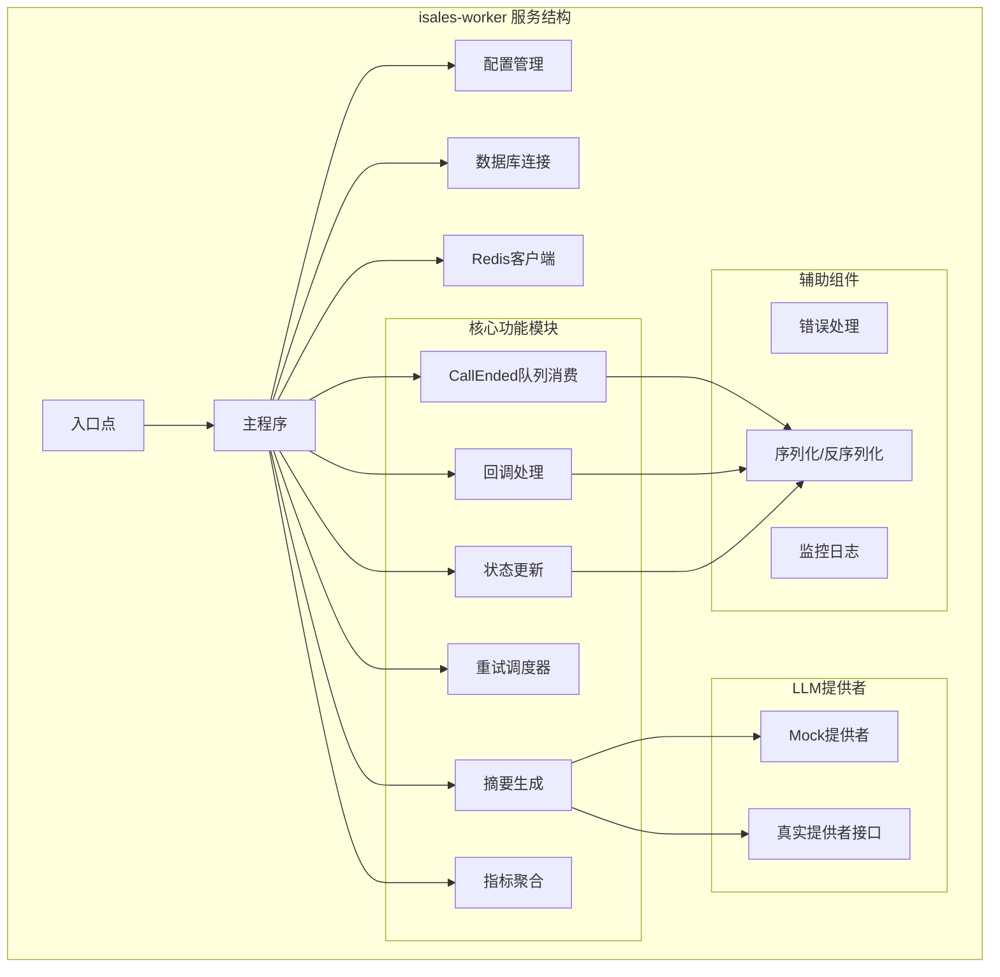
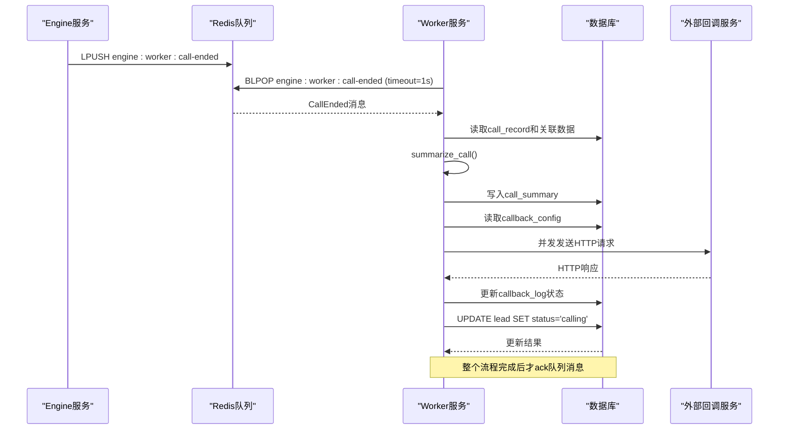
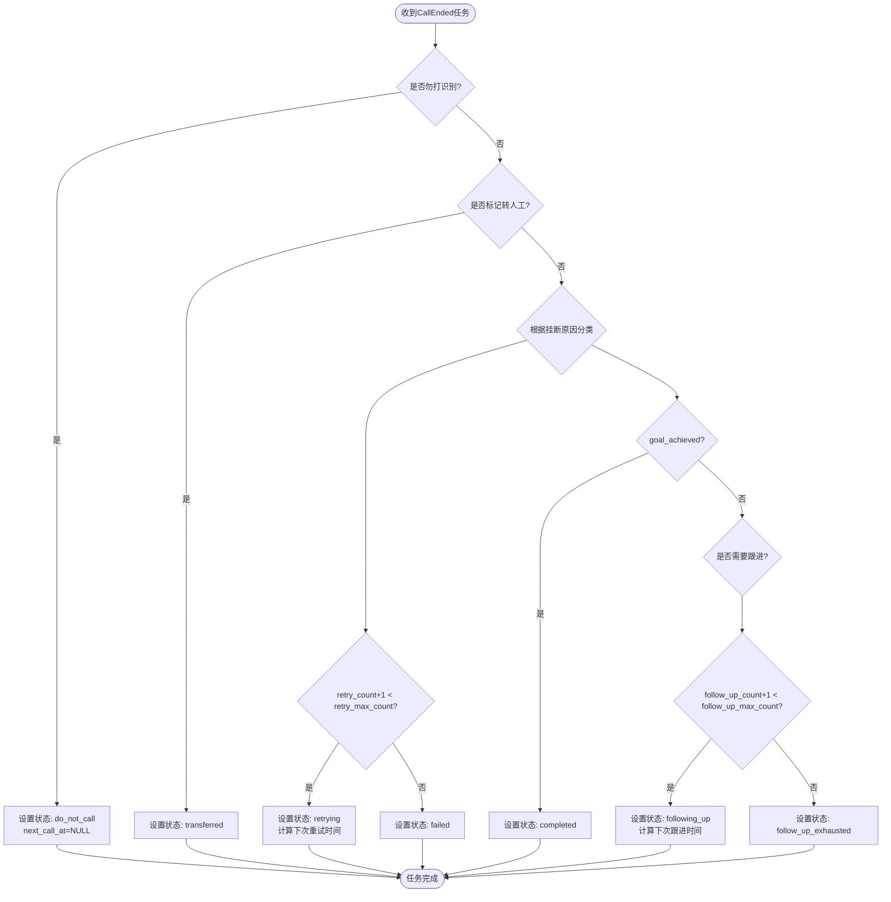
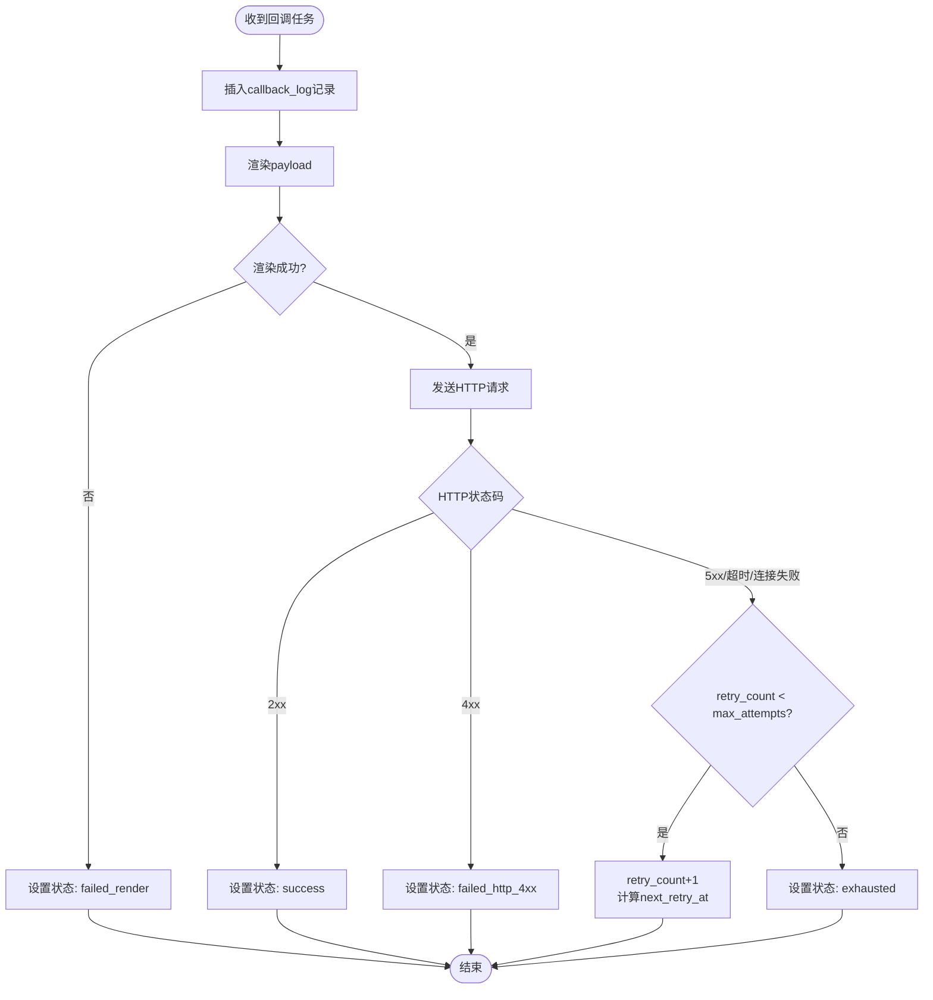
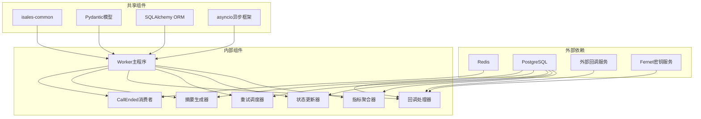

# 后处理任务队列

<cite>
**本文档引用的文件**
- [worker.env](file://deploy/cloud/env/worker.env)
- [design.md](file://openspec/changes/archive/2026-05-06-impl-worker/design.md)
- [tasks.md](file://openspec/changes/archive/2026-05-06-impl-worker/tasks.md)
- [message-contract.spec.md](file://openspec/changes/archive/2026-05-01-init-isales-common/specs/message-contract/spec.md)
- [README.md](file://README.md)
- [check_env_consistency.py](file://deploy/linux/scripts/check_env_consistency.py)
</cite>

## 目录
1. [简介](#简介)
2. [项目结构](#项目结构)
3. [核心组件](#核心组件)
4. [架构概览](#架构概览)
5. [详细组件分析](#详细组件分析)
6. [依赖关系分析](#依赖关系分析)
7. [性能考虑](#性能考虑)
8. [故障排除指南](#故障排除指南)
9. [结论](#结论)

## 简介

isales-worker 是 iSales 系统中的后处理任务队列服务，负责从 Redis 队列中消费异步任务，执行通话结束后的数据处理流程。该服务采用 asyncio 架构，使用 Redis BLPOP 模式进行任务消费，实现了完整的任务生命周期管理，包括任务类型分类、优先级管理、队列调度策略和负载均衡机制。

Worker 服务的核心职责是处理通话结束后的后续任务，按照 `summarize_call → process_callbacks → update_lead_state` 的顺序串行执行，确保业务逻辑的正确性和数据一致性。

## 项目结构

基于设计文档和规范，isales-worker 项目的结构组织如下：

**图表来源**
- [tasks.md:16-89](file://openspec/changes/archive/2026-05-06-impl-worker/tasks.md#L16-L89)
- [design.md:35-186](file://openspec/changes/archive/2026-05-06-impl-worker/design.md#L35-L186)

**章节来源**
- [tasks.md:4-14](file://openspec/changes/archive/2026-05-06-impl-worker/tasks.md#L4-L14)
- [design.md:35-44](file://openspec/changes/archive/2026-05-06-impl-worker/design.md#L35-L44)

## 核心组件

### 队列消费组件

Worker 使用 Redis BLPOP 模式进行任务消费，这是其核心架构决策之一：

- **队列名称**: `engine:worker:call-ended`
- **消费模式**: 单线程 BLPOP 循环，超时时间为 1 秒
- **任务类型**: 仅处理 CallEnded 任务，不引入额外队列
- **死信队列**: `worker:dlq` 用于处理 schema_version 不支持或反序列化失败的消息

### 任务处理流水线

任务处理采用严格的串行顺序，确保业务逻辑的正确性：

1. **摘要生成** (`summarize_call`)
2. **回调处理** (`process_callbacks`)  
3. **状态更新** (`update_lead_state`)

每个阶段都有明确的错误处理和重试机制，确保系统的稳定性。

**章节来源**
- [design.md:46-56](file://openspec/changes/archive/2026-05-06-impl-worker/design.md#L46-L56)
- [tasks.md:16-22](file://openspec/changes/archive/2026-05-06-impl-worker/tasks.md#L16-L22)

## 架构概览

isales-worker 采用事件驱动的异步架构，通过 Redis 实现服务间的解耦：

**图表来源**
- [design.md:16-23](file://openspec/changes/archive/2026-05-06-impl-worker/design.md#L16-L23)
- [tasks.md:20-22](file://openspec/changes/archive/2026-05-06-impl-worker/tasks.md#L20-L22)

## 详细组件分析

### 任务类型分类

Worker 将任务分为以下几类：

#### 1. 通话结束任务 (CallEnded)
- **触发条件**: 通话结束后由 Engine 服务产生
- **处理流程**: 摘要生成 → 回调处理 → 状态更新
- **队列**: `engine:worker:call-ended`

#### 2. 转写处理任务
- **触发条件**: 通话转写完成后
- **处理内容**: 转写文本的后处理和存储
- **实现方式**: 通过 CallEnded 任务的摘要生成阶段处理

#### 3. 统计聚合任务
- **触发条件**: 定时任务（每 60 秒）
- **处理内容**: 计算接通率、目标达成率等指标
- **存储**: Redis Hash `isales:metrics:7d:{campaign_id}`

**章节来源**
- [design.md:114-128](file://openspec/changes/archive/2026-05-06-impl-worker/design.md#L114-L128)
- [tasks.md:62-67](file://openspec/changes/archive/2026-05-06-impl-worker/tasks.md#L62-L67)

### 任务优先级管理

Worker 实现了基于业务规则的优先级管理：

**图表来源**
- [design.md:114-128](file://openspec/changes/archive/2026-05-06-impl-worker/design.md#L114-L128)
- [tasks.md:51-61](file://openspec/changes/archive/2026-05-06-impl-worker/tasks.md#L51-L61)

### 队列调度策略

Worker 采用了高效的队列调度策略：

#### 1. 单消费者模式
- **优势**: 简化并发控制，避免重复处理
- **限制**: 单实例部署，无法水平扩展
- **适用场景**: v1 单主机部署，每日数千通通话

#### 2. BLPOP 超时机制
- **超时时间**: 1 秒
- **作用**: 允许优雅停机和资源清理
- **性能**: 低延迟，适合实时处理

#### 3. 死信队列处理
- **触发条件**: schema_version 不支持或反序列化失败
- **处理方式**: LPUSH 到 `worker:dlq`
- **监控**: 专门的日志记录和告警

**章节来源**
- [design.md:37-44](file://openspec/changes/archive/2026-05-06-impl-worker/design.md#L37-L44)
- [tasks.md:18-22](file://openspec/changes/archive/2026-05-06-impl-worker/tasks.md#L18-L22)

### 负载均衡机制

由于 Worker 采用单实例部署，负载均衡主要体现在以下几个方面：

#### 1. 任务批处理
- **批量大小**: 可配置的批次大小
- **处理策略**: 每个 CallEnded 任务独立处理
- **资源控制**: 避免大量任务同时竞争资源

#### 2. 并发控制
- **回调并发**: 使用 `asyncio.gather` 并发处理多个 callback_config
- **数据库连接**: 通过连接池管理数据库访问
- **Redis连接**: 单独的 Redis 客户端实例

#### 3. 资源监控
- **内存使用**: 监控任务队列长度
- **CPU使用**: 监控处理时间分布
- **数据库负载**: 监控查询响应时间

**章节来源**
- [design.md:155-166](file://openspec/changes/archive/2026-05-06-impl-worker/design.md#L155-L166)
- [tasks.md:38-39](file://openspec/changes/archive/2026-05-06-impl-worker/tasks.md#L38-L39)

### 任务序列化和反序列化

Worker 严格遵循消息契约规范，确保跨服务的消息一致性：

#### 1. 序列化规范
- **序列化方式**: 使用 isales-common 的 Pydantic 模型
- **序列化方法**: `.model_dump_json()` 
- **版本控制**: `schema_version` 字段确保向后兼容

#### 2. 反序列化规范
- **反序列化方式**: 使用 `model_validate_json()`
- **版本校验**: 仅接受支持的 `schema_version`
- **错误处理**: 不支持的版本进入死信队列

#### 3. 消息契约
- **基类要求**: 所有消息继承 `BaseMessage` 基类
- **必需字段**: `schema_version`、`message_id`、`created_at`
- **跨服务一致性**: 所有服务使用相同的消息模型

**章节来源**
- [message-contract.spec.md:1-34](file://openspec/changes/archive/2026-05-01-init-isales-common/specs/message-contract/spec.md#L1-L34)
- [tasks.md:18-22](file://openspec/changes/archive/2026-05-06-impl-worker/tasks.md#L18-L22)

### 错误处理和重试机制

Worker 实现了多层次的错误处理和重试机制：

#### 1. 任务级别错误处理
- **摘要生成失败**: 记录错误日志，但仍继续后续处理
- **回调处理失败**: 根据 HTTP 状态码决定重试策略
- **状态更新失败**: 使用行级守卫防止竞态条件

#### 2. 回调重试策略
- **重试间隔**: 指数退避，最大 5 分钟
- **最大重试次数**: 可配置，超过则标记 exhausted
- **重试条件**: 5xx 错误、超时、连接失败

#### 3. 重试调度器
- **调度频率**: 每 60 秒扫描一次
- **扫描范围**: `pending_retry` 状态且到达重试时间的任务
- **批量处理**: 可配置的批量大小

**图表来源**
- [design.md:98-104](file://openspec/changes/archive/2026-05-06-impl-worker/design.md#L98-L104)
- [tasks.md:42-49](file://openspec/changes/archive/2026-05-06-impl-worker/tasks.md#L42-L49)

**章节来源**
- [design.md:155-166](file://openspec/changes/archive/2026-05-06-impl-worker/design.md#L155-L166)
- [tasks.md:42-49](file://openspec/changes/archive/2026-05-06-impl-worker/tasks.md#L42-L49)

### 任务状态跟踪和监控

Worker 提供了完善的状态跟踪和监控机制：

#### 1. 数据库监控
- **callback_log 表**: 记录所有回调任务的状态变化
- **call_summary 表**: 存储摘要生成结果
- **lead 表**: 记录通话状态的最终更新

#### 2. Redis 监控
- **队列长度**: 监控 `engine:worker:call-ended` 队列长度
- **指标缓存**: Redis Hash 存储 7 天指标数据
- **死信队列**: 监控 `worker:dlq` 队列长度

#### 3. 日志监控
- **错误日志**: 详细的错误信息和堆栈跟踪
- **性能日志**: 处理时间统计和性能指标
- **业务日志**: 关键业务事件的审计跟踪

**章节来源**
- [design.md:131-136](file://openspec/changes/archive/2026-05-06-impl-worker/design.md#L131-L136)
- [tasks.md:62-67](file://openspec/changes/archive/2026-05-06-impl-worker/tasks.md#L62-L67)

## 依赖关系分析

Worker 服务的依赖关系图：

**图表来源**
- [design.md:35-44](file://openspec/changes/archive/2026-05-06-impl-worker/design.md#L35-L44)
- [tasks.md:7-13](file://openspec/changes/archive/2026-05-06-impl-worker/tasks.md#L7-L13)

**章节来源**
- [design.md:5-11](file://openspec/changes/archive/2026-05-06-impl-worker/design.md#L5-L11)
- [tasks.md:7-13](file://openspec/changes/archive/2026-05-06-impl-worker/tasks.md#L7-L13)

## 性能考虑

### 1. 异步处理优化
- **事件循环**: 使用 asyncio 事件循环处理所有 I/O 操作
- **并发控制**: 回调处理使用 `asyncio.gather` 实现并发
- **连接池**: 数据库和 Redis 使用连接池减少连接开销

### 2. 内存管理
- **消息大小**: 控制单个 CallEnded 消息的大小
- **批处理**: 合理设置批处理大小避免内存峰值
- **垃圾回收**: 定期触发垃圾回收释放内存

### 3. 网络优化
- **HTTP客户端**: 使用连接复用减少 TCP 握手开销
- **超时设置**: 合理设置 HTTP 请求超时时间
- **重试策略**: 指数退避避免对下游服务造成冲击

### 4. 数据库优化
- **查询优化**: 使用合适的索引和查询计划
- **事务管理**: 最小化事务持有时间
- **批量操作**: 使用批量插入和更新减少网络往返

## 故障排除指南

### 1. 常见问题诊断

#### 队列消费问题
- **症状**: 队列积压严重
- **原因**: 处理时间过长或并发不足
- **解决方案**: 检查数据库性能、优化查询、调整并发参数

#### 回调失败问题
- **症状**: 回调任务频繁重试
- **原因**: 外部服务不稳定或配置错误
- **解决方案**: 检查外部服务状态、验证回调配置、查看重试日志

#### 数据库连接问题
- **症状**: 数据库连接超时或拒绝
- **原因**: 连接池耗尽或查询阻塞
- **解决方案**: 调整连接池大小、优化慢查询、检查数据库性能

### 2. 监控指标

#### 关键性能指标
- **队列长度**: `engine:worker:call-ended` 队列长度
- **处理时间**: 单个任务的平均处理时间
- **错误率**: 回调失败率和数据库错误率
- **内存使用**: Worker 进程的内存使用情况

#### 告警阈值
- **队列长度**: 超过 1000 条触发告警
- **处理时间**: 超过 30 秒触发告警  
- **错误率**: 超过 5% 触发告警
- **内存使用**: 超过 80% 触发告警

### 3. 调试工具

#### 开发工具
- **fake_call_end.py**: 用于本地测试和调试
- **数据库查询**: 直接查询数据库验证状态
- **Redis监控**: 使用 Redis CLI 监控队列状态

#### 生产环境工具
- **日志分析**: 使用日志聚合工具分析错误模式
- **性能分析**: 使用性能分析工具识别瓶颈
- **监控仪表板**: 使用 Prometheus 和 Grafana 监控系统状态

**章节来源**
- [design.md:155-166](file://openspec/changes/archive/2026-05-06-impl-worker/design.md#L155-L166)
- [tasks.md:69-76](file://openspec/changes/archive/2026-05-06-impl-worker/tasks.md#L69-L76)

## 结论

isales-worker 后处理任务队列是一个设计精良的异步处理系统，具有以下特点：

### 优势
- **架构简洁**: 采用单消费者模式，简化了并发控制
- **可靠性高**: 多层次的错误处理和重试机制
- **可观测性强**: 完善的日志记录和监控体系
- **扩展性好**: 基于消息契约的设计便于未来扩展

### 适用场景
- **v1 单实例部署**: 满足每日数千通通话的需求
- **实时处理**: 适合需要快速响应的业务场景
- **事件驱动**: 符合现代微服务架构的设计理念

### 改进建议
- **多实例支持**: 为未来的业务增长做好准备
- **监控增强**: 添加更细粒度的性能指标
- **配置管理**: 提供更灵活的配置选项

该系统为 iSales 系统提供了可靠的后处理能力，确保通话结束后的数据处理能够及时、准确地完成。