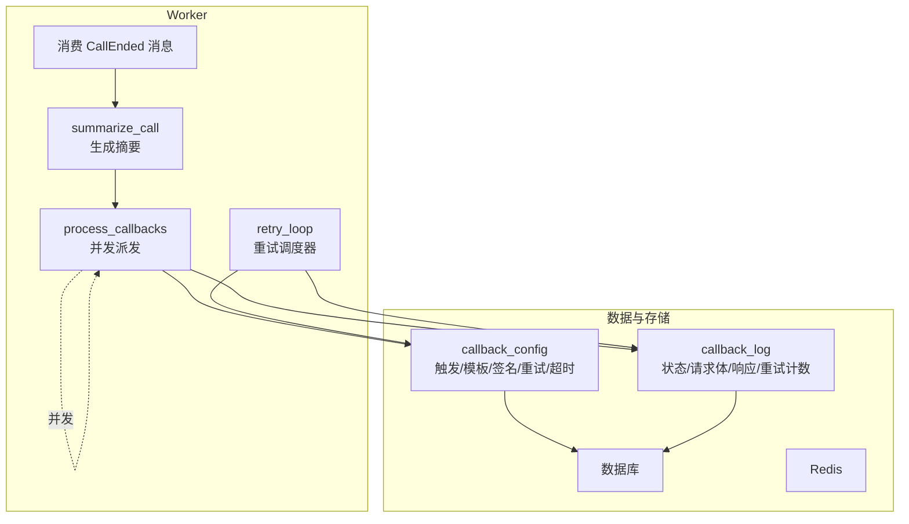
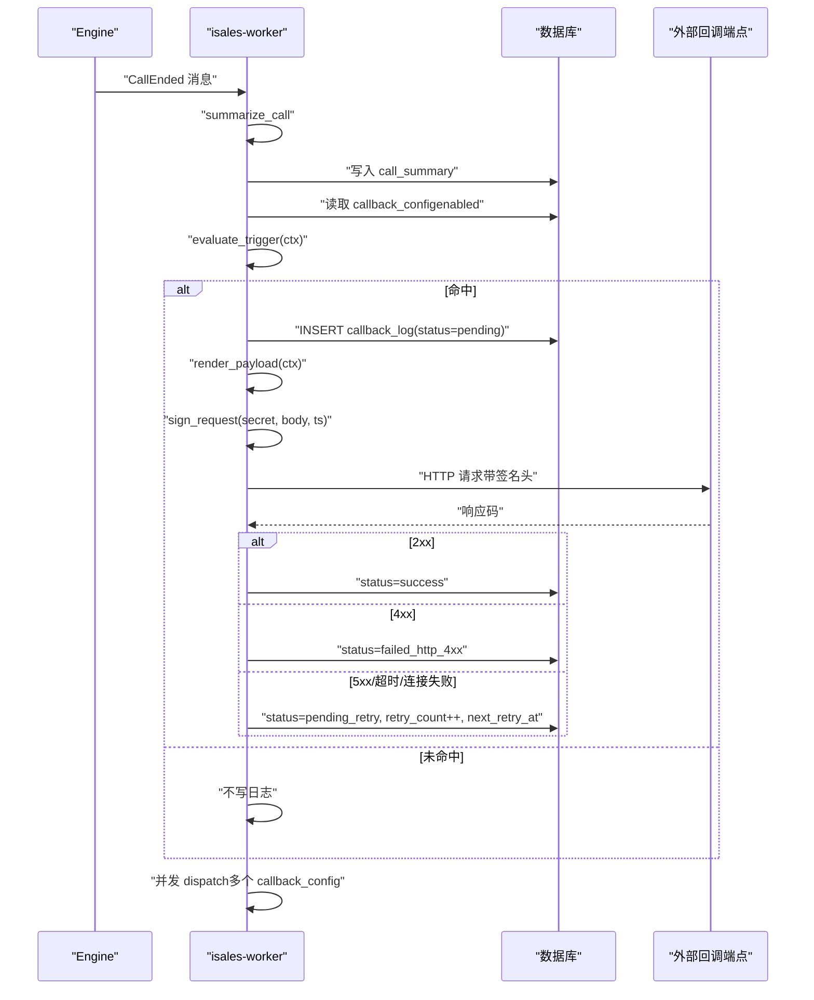
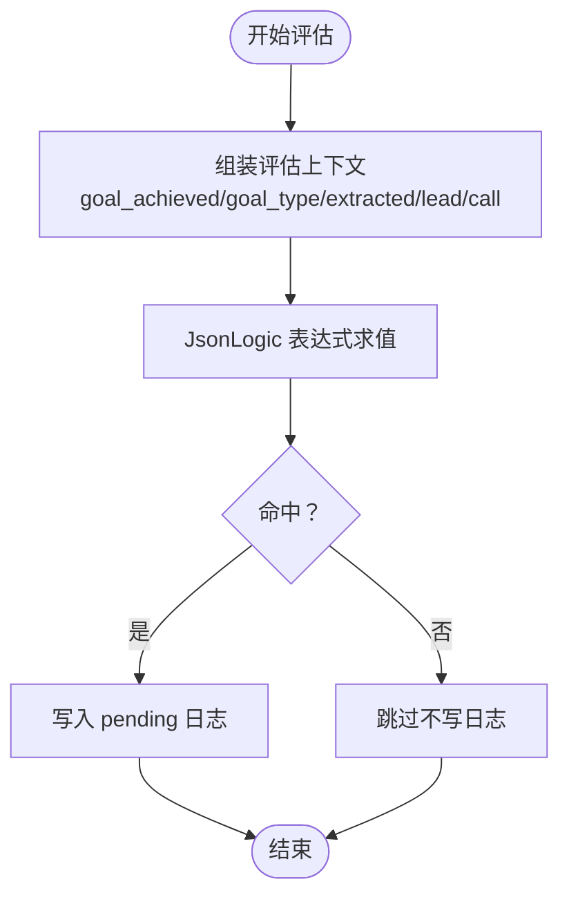
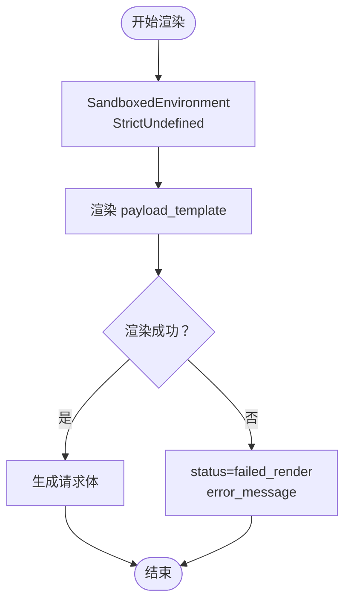
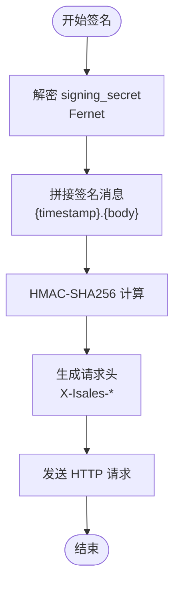
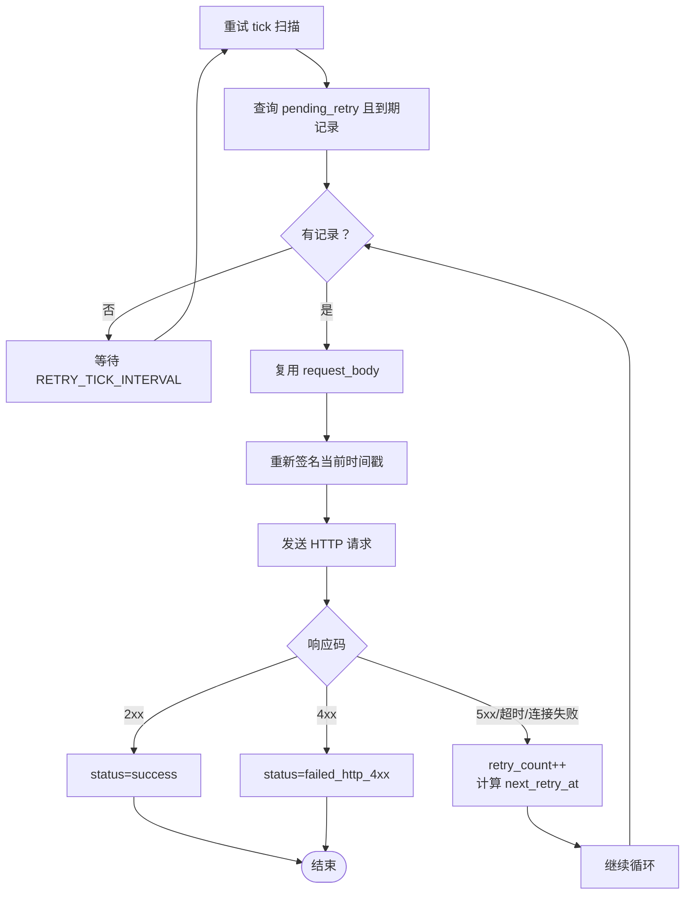
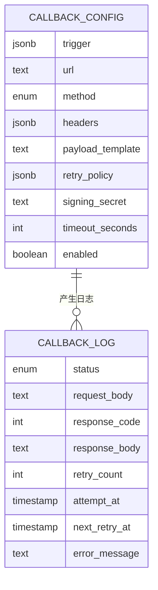
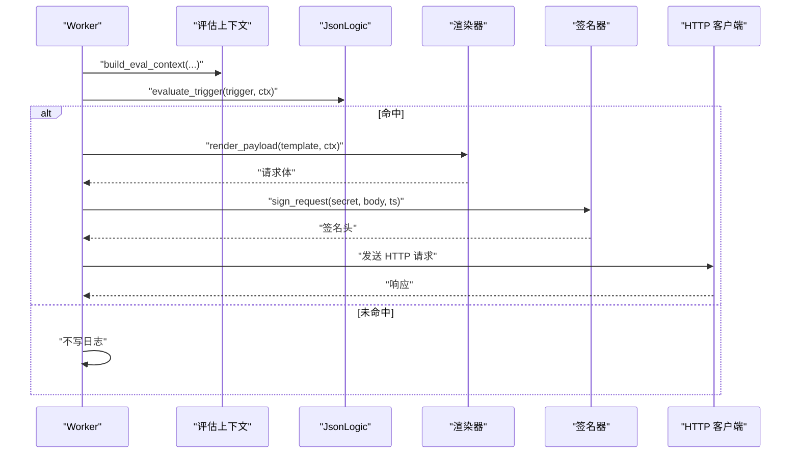
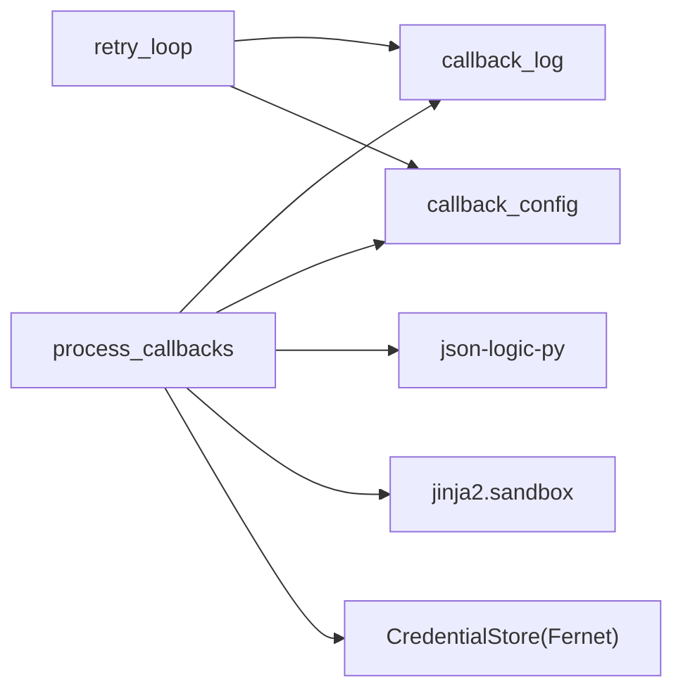

# 回调通知机制

<cite>
**本文引用的文件**
- [回调规范（webhook-callback）](file://openspec/specs/webhook-callback/spec.md)
- [实现计划（IMPLEMENTATION_PLAN.md）](file://IMPLEMENTATION_PLAN.md)
- [变更记录：实现 worker（tasks.md）](file://openspec/changes/archive/2026-05-06-impl-worker/tasks.md)
- [变更记录：实现 worker（design.md）](file://openspec/changes/archive/2026-05-06-impl-worker/design.md)
- [变更记录：实现 web（specs/webhook-callback）](file://openspec/changes/archive/2026-05-08-impl-web-polish/specs/webhook-callback/spec.md)
- [变更记录：凭证统一存储（provider-credential）](file://openspec/changes/archive/2026-05-24-impl-provider-credential-db-ssot/specs/provider-credential/spec.md)
- [变更记录：实现 scheduler（tasks.md）](file://openspec/changes/archive/2026-05-06-impl-scheduler/tasks.md)
</cite>

## 目录
1. [简介](#简介)
2. [项目结构](#项目结构)
3. [核心组件](#核心组件)
4. [架构总览](#架构总览)
5. [详细组件分析](#详细组件分析)
6. [依赖关系分析](#依赖关系分析)
7. [性能考量](#性能考量)
8. [故障排查指南](#故障排查指南)
9. [结论](#结论)
10. [附录](#附录)

## 简介
本文件面向 isales-worker 的回调通知机制，系统性阐述以下关键能力与实现细节：
- JsonLogic 表达式触发器：触发条件的建模、上下文组装与评估策略
- Jinja2 沙盒模板渲染：安全渲染策略与失败处理
- HMAC-SHA256 签名验证：签名算法、头部格式与防重放建议
- 指数退避重试策略：重试调度器、间隔计算与最大次数控制
- 回调配置数据模型：字段定义、启用状态与超时覆盖
- 触发条件评估、请求体渲染、HTTP 请求发送与失败处理
- 完整的配置示例与调试指南

## 项目结构
回调机制由 isales-worker 在通话结束事件后执行，遵循“摘要生成 → 回调派发 → 状态更新”的顺序。核心实现位于 worker 的回调处理与重试调度器模块中。

图示来源
- [实现计划（IMPLEMENTATION_PLAN.md）:179-179](file://IMPLEMENTATION_PLAN.md#L179-L179)
- [变更记录：实现 worker（design.md）:15-15](file://openspec/changes/archive/2026-05-06-impl-worker/design.md#L15-L15)
- [变更记录：实现 worker（design.md）:47-47](file://openspec/changes/archive/2026-05-06-impl-worker/design.md#L47-L47)
- [变更记录：实现 worker（design.md）:98-104](file://openspec/changes/archive/2026-05-06-impl-worker/design.md#L98-L104)

章节来源
- [实现计划（IMPLEMENTATION_PLAN.md）:179-179](file://IMPLEMENTATION_PLAN.md#L179-L179)
- [变更记录：实现 worker（design.md）:15-15](file://openspec/changes/archive/2026-05-06-impl-worker/design.md#L15-L15)
- [变更记录：实现 worker（design.md）:47-47](file://openspec/changes/archive/2026-05-06-impl-worker/design.md#L47-L47)
- [变更记录：实现 worker（design.md）:98-104](file://openspec/changes/archive/2026-05-06-impl-worker/design.md#L98-L104)

## 核心组件
- 触发器（JsonLogic）：基于预定义上下文评估表达式，命中则进入派发流程
- 模板渲染（Jinja2 沙盒）：在严格沙盒环境下渲染 payload，失败即终止并记录
- 签名（HMAC-SHA256）：按规范生成签名头部，结合时间戳防重放
- 重试调度器：独立后台任务，周期扫描并按指数退避重试
- 数据模型：callback_config 与 callback_log 的字段与状态机

章节来源
- [回调规范（webhook-callback）:19-46](file://openspec/specs/webhook-callback/spec.md#L19-L46)
- [回调规范（webhook-callback）:47-67](file://openspec/specs/webhook-callback/spec.md#L47-L67)
- [回调规范（webhook-callback）:68-98](file://openspec/specs/webhook-callback/spec.md#L68-L98)
- [回调规范（webhook-callback）:100-132](file://openspec/specs/webhook-callback/spec.md#L100-L132)
- [变更记录：实现 worker（tasks.md）:31-40](file://openspec/changes/archive/2026-05-06-impl-worker/tasks.md#L31-L40)
- [变更记录：实现 worker（tasks.md）:42-49](file://openspec/changes/archive/2026-05-06-impl-worker/tasks.md#L42-L49)

## 架构总览
回调机制的关键流程如下：
- 通话结束：summarize_call 生成摘要并写入 call_summary
- 并发派发：process_callbacks 遍历启用的 callback_config，按 JsonLogic 命中与否决定是否写入 pending 日志
- 渲染与签名：命中后渲染 payload，生成 HMAC-SHA256 签名头部，发送 HTTP 请求
- 状态更新：根据响应码分类写入 callback_log 状态
- 重试调度：retry_loop 周期扫描 pending_retry，按指数退避复用已存请求体重发

图示来源
- [回调规范（webhook-callback）:5-17](file://openspec/specs/webhook-callback/spec.md#L5-L17)
- [变更记录：实现 worker（tasks.md）:31-40](file://openspec/changes/archive/2026-05-06-impl-worker/tasks.md#L31-L40)
- [变更记录：实现 worker（tasks.md）:42-49](file://openspec/changes/archive/2026-05-06-impl-worker/tasks.md#L42-L49)

章节来源
- [回调规范（webhook-callback）:5-17](file://openspec/specs/webhook-callback/spec.md#L5-L17)
- [变更记录：实现 worker（tasks.md）:31-40](file://openspec/changes/archive/2026-05-06-impl-worker/tasks.md#L31-L40)
- [变更记录：实现 worker（tasks.md）:42-49](file://openspec/changes/archive/2026-05-06-impl-worker/tasks.md#L42-L49)

## 详细组件分析

### JsonLogic 触发器
- 上下文组装：包含目标达成、目标类型、提取字段、线索与通话记录等字段，确保触发条件可追溯
- 评估策略：使用 json-logic-py 库进行表达式求值；异常视为未命中，避免误触发
- 与摘要一致性：仅在 summarize_call 完成后执行，保证触发条件引用的字段来自“触发时刻”的快照

图示来源
- [变更记录：实现 worker（tasks.md）:33-34](file://openspec/changes/archive/2026-05-06-impl-worker/tasks.md#L33-L34)
- [回调规范（webhook-callback）:33-46](file://openspec/specs/webhook-callback/spec.md#L33-L46)

章节来源
- [变更记录：实现 worker（tasks.md）:33-34](file://openspec/changes/archive/2026-05-06-impl-worker/tasks.md#L33-L34)
- [回调规范（webhook-callback）:33-46](file://openspec/specs/webhook-callback/spec.md#L33-L46)

### Jinja2 沙盒模板渲染
- 渲染环境：使用 SandboxedEnvironment，StrictUndefined 策略禁止静默输出
- 失败处理：任意渲染错误（未定义变量、安全违规、语法错误）均记为 failed_render，不重试
- 输出要求：模板必须渲染为合法 JSON 文本

图示来源
- [变更记录：实现 worker（design.md）:82-87](file://openspec/changes/archive/2026-05-06-impl-worker/design.md#L82-L87)
- [变更记录：实现 worker（tasks.md）:35-35](file://openspec/changes/archive/2026-05-06-impl-worker/tasks.md#L35-L35)

章节来源
- [变更记录：实现 worker（design.md）:82-87](file://openspec/changes/archive/2026-05-06-impl-worker/design.md#L82-L87)
- [变更记录：实现 worker（tasks.md）:35-35](file://openspec/changes/archive/2026-05-06-impl-worker/tasks.md#L35-L35)

### HMAC-SHA256 签名验证
- 密钥管理：callback_config.signing_secret 采用统一 Fernet 加密存储，仅在创建或旋转时一次性返回明文
- 签名内容：timestamp + "." + body_bytes，使用解密后的明文 secret 计算 HMAC-SHA256
- 请求头：X-Isales-Signature: sha256=<hex_digest>、X-Isales-Timestamp: <unix_seconds>、Content-Type: application/json
- 接收方建议：校验时间戳偏差（如小于 5 分钟）与常量时间比较

图示来源
- [变更记录：凭证统一存储（provider-credential）:140-165](file://openspec/changes/archive/2026-05-24-impl-provider-credential-db-ssot/specs/provider-credential/spec.md#L140-L165)
- [回调规范（webhook-callback）:68-98](file://openspec/specs/webhook-callback/spec.md#L68-L98)

章节来源
- [变更记录：凭证统一存储（provider-credential）:140-165](file://openspec/changes/archive/2026-05-24-impl-provider-credential-db-ssot/specs/provider-credential/spec.md#L140-L165)
- [回调规范（webhook-callback）:68-98](file://openspec/specs/webhook-callback/spec.md#L68-L98)

### 指数退避重试策略
- 重试调度器：独立后台任务，周期扫描 status=pending_retry 且 next_retry_at ≤ now 的记录
- 重试行为：复用已存 request_body，重新签名后重发；2xx 成功，4xx 标记失败，5xx/超时/连接失败递增 retry_count 并按 intervals_seconds 计算下一次重试时间
- 边界处理：超过 intervals 数组长度时沿用最后一项；达到 max_attempts 后置 exhausted 终态

图示来源
- [回调规范（webhook-callback）:100-132](file://openspec/specs/webhook-callback/spec.md#L100-L132)
- [变更记录：实现 worker（tasks.md）:42-49](file://openspec/changes/archive/2026-05-06-impl-worker/tasks.md#L42-L49)

章节来源
- [回调规范（webhook-callback）:100-132](file://openspec/specs/webhook-callback/spec.md#L100-L132)
- [变更记录：实现 worker（tasks.md）:42-49](file://openspec/changes/archive/2026-05-06-impl-worker/tasks.md#L42-L49)

### 回调配置数据模型
- callback_config 字段
  - trigger：JSONB（JsonLogic 表达式）
  - url/method/headers：目标地址、HTTP 方法与附加头部
  - payload_template：Jinja2 模板文本
  - retry_policy：JSONB {intervals_seconds[], max_attempts}
  - signing_secret：加密存储（Fernet）
  - timeout_seconds：单条覆盖全局超时
  - enabled：启用开关
- callback_log 字段
  - status：枚举（pending/success/failed_render/failed_http_4xx/failed_http_5xx/pending_retry/exhausted）
  - request_body/response_code/response_body：请求与响应
  - retry_count/attempt_at/next_retry_at：重试计数与时序
  - error_message：失败原因

图示来源
- [回调规范（webhook-callback）:210-231](file://openspec/specs/webhook-callback/spec.md#L210-L231)

章节来源
- [回调规范（webhook-callback）:210-231](file://openspec/specs/webhook-callback/spec.md#L210-L231)

### 触发条件评估、请求体渲染与 HTTP 发送
- 评估：evaluate_trigger 使用 json-logic-py，异常视为未命中
- 上下文：build_eval_context 组装 {goal_achieved, goal_type, extracted, lead, call}，call.hangup_cause 从 call_record 派生
- 渲染：render_payload 使用 SandboxedEnvironment，StrictUndefined，失败记 failed_render
- 发送：sign_request 生成签名头，dispatch_callback 并发派发，process_callbacks 对多个配置并发执行

图示来源
- [变更记录：实现 worker（tasks.md）:31-40](file://openspec/changes/archive/2026-05-06-impl-worker/tasks.md#L31-L40)

章节来源
- [变更记录：实现 worker（tasks.md）:31-40](file://openspec/changes/archive/2026-05-06-impl-worker/tasks.md#L31-L40)

### 失败处理与错误恢复
- 渲染失败：failed_render，不重试，记录错误信息
- 4xx：failed_http_4xx，不重试
- 5xx/超时/连接失败：pending_retry，按指数退避重试，直至 exhausted
- 重试调度器与派发并发：通过主键更新与行级隔离避免冲突

章节来源
- [回调规范（webhook-callback）:114-132](file://openspec/specs/webhook-callback/spec.md#L114-L132)
- [变更记录：实现 worker（tasks.md）:42-49](file://openspec/changes/archive/2026-05-06-impl-worker/tasks.md#L42-L49)

## 依赖关系分析
- 模块耦合
  - process_callbacks 与 retry_loop 通过 callback_log 状态机解耦
  - 签名依赖 CredentialStore 解密（Fernet），避免明文长期驻留
- 外部依赖
  - json-logic-py：表达式求值
  - jinja2.sandbox：安全渲染
  - 数据库：持久化配置与日志
  - Redis：并发控制与队列（在其他模块中使用）

图示来源
- [变更记录：实现 worker（tasks.md）:31-40](file://openspec/changes/archive/2026-05-06-impl-worker/tasks.md#L31-L40)
- [变更记录：实现 worker（tasks.md）:42-49](file://openspec/changes/archive/2026-05-06-impl-worker/tasks.md#L42-L49)
- [变更记录：凭证统一存储（provider-credential）:140-165](file://openspec/changes/archive/2026-05-24-impl-provider-credential-db-ssot/specs/provider-credential/spec.md#L140-L165)

章节来源
- [变更记录：实现 worker（tasks.md）:31-40](file://openspec/changes/archive/2026-05-06-impl-worker/tasks.md#L31-L40)
- [变更记录：实现 worker（tasks.md）:42-49](file://openspec/changes/archive/2026-05-06-impl-worker/tasks.md#L42-L49)
- [变更记录：凭证统一存储（provider-credential）:140-165](file://openspec/changes/archive/2026-05-24-impl-provider-credential-db-ssot/specs/provider-credential/spec.md#L140-L165)

## 性能考量
- 并发派发：process_callbacks 对多个 callback_config 使用并发执行，降低整体延迟
- 重试批处理：retry_loop 按到期时间排序批量处理，减少扫描开销
- 渲染与签名：仅在命中后执行，避免无效计算
- 超时控制：支持 per-config 覆盖，平衡吞吐与可靠性

## 故障排查指南
- 触发未生效
  - 检查 callback_config.enabled 与 trigger 表达式语法
  - 确认评估上下文字段是否齐全（goal_achieved、goal_type、extracted、lead、call）
- 渲染失败
  - 查看 callback_log.status=failed_render 与 error_message
  - 使用 /callback-configs/validate 进行干跑校验
- 签名失败
  - 确认 X-Isales-Signature/X-Isales-Timestamp 头部格式正确
  - 核对时间戳偏差与签名内容拼接规则
- 重试未触发
  - 检查 callback_log.status 是否为 pending_retry 且 next_retry_at 到期
  - 确认 retry_policy.intervals_seconds 与 max_attempts 设置
- 4xx/5xx/超时
  - 4xx：检查外部端点状态与请求体
  - 5xx/超时：确认网络连通性与外部端点健康状况

章节来源
- [变更记录：实现 web（specs/webhook-callback）:1-41](file://openspec/changes/archive/2026-05-08-impl-web-polish/specs/webhook-callback/spec.md#L1-L41)
- [回调规范（webhook-callback）:114-132](file://openspec/specs/webhook-callback/spec.md#L114-L132)

## 结论
回调通知机制通过严格的触发条件、安全渲染与签名策略，以及指数退避重试，实现了高可靠、可审计的异步回调能力。其设计强调“触发时刻事实不可篡改”与“失败不影响主流程”，并通过独立的重试调度器保障最终一致性。

## 附录

### 回调配置示例（字段说明）
- trigger：JsonLogic 表达式，如命中目标达成且目标类型为预约
- url/method/headers：回调地址、HTTP 方法与附加头部
- payload_template：Jinja2 模板，输出合法 JSON
- retry_policy：intervals_seconds（秒级间隔数组）、max_attempts（最大重试次数）
- signing_secret：加密存储，创建/旋转时一次性返回明文
- timeout_seconds：单条配置覆盖全局超时
- enabled：启用开关

章节来源
- [回调规范（webhook-callback）:210-231](file://openspec/specs/webhook-callback/spec.md#L210-L231)