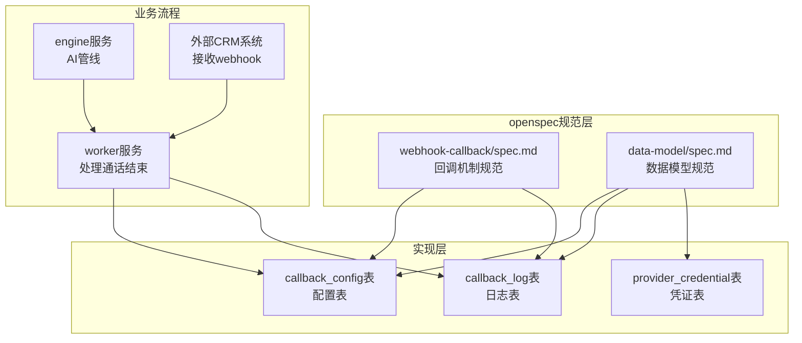
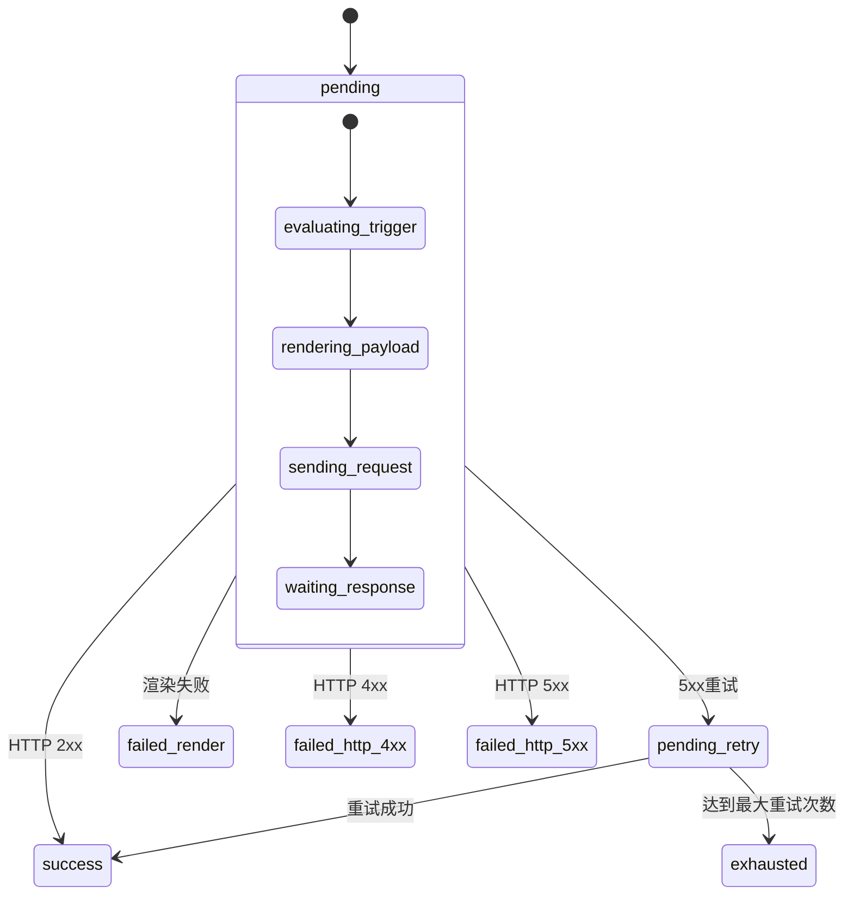
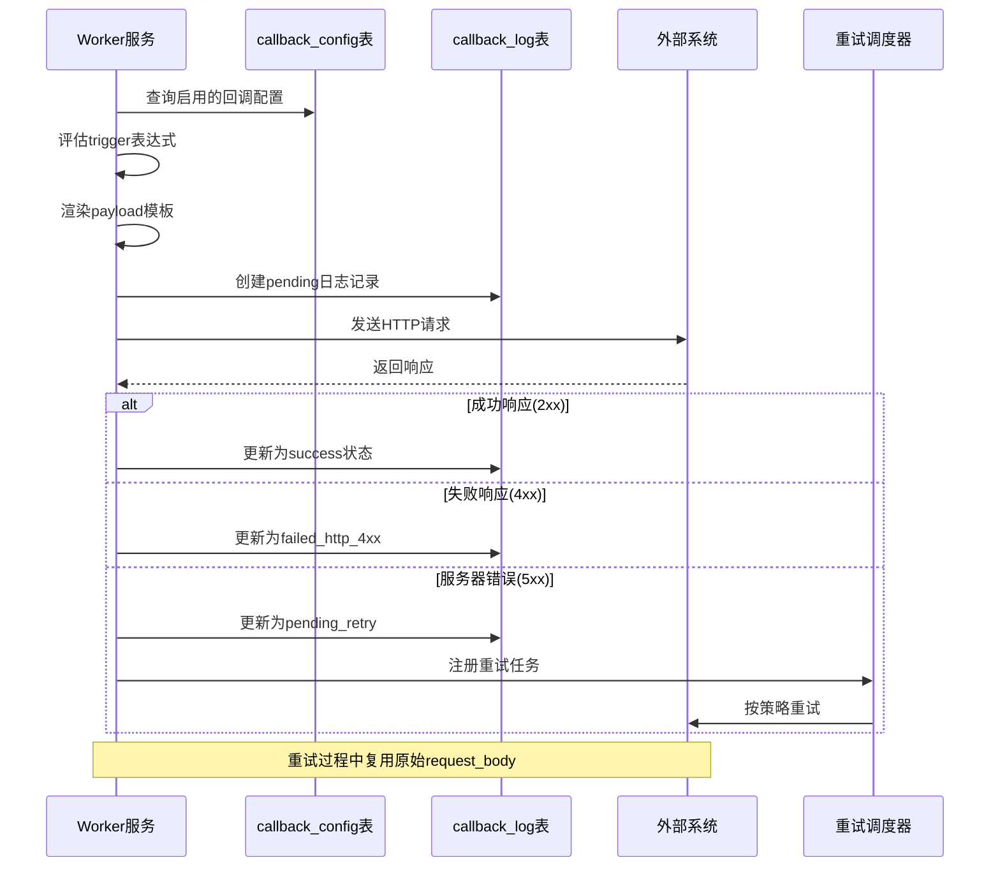
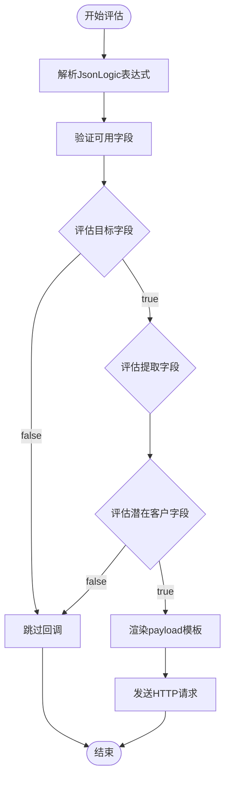
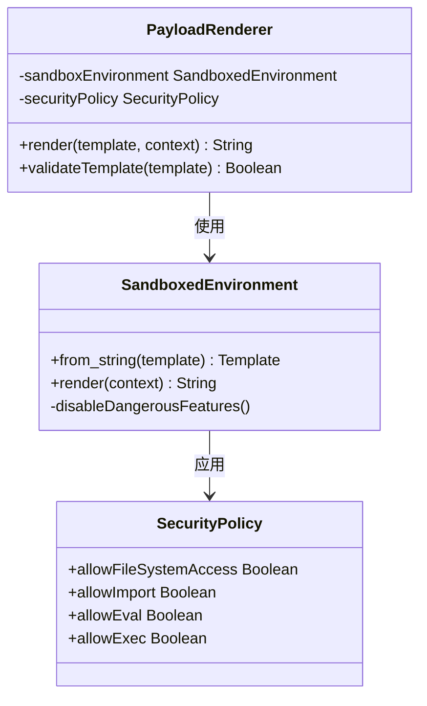
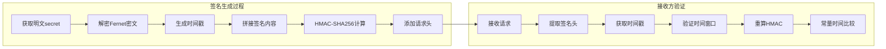
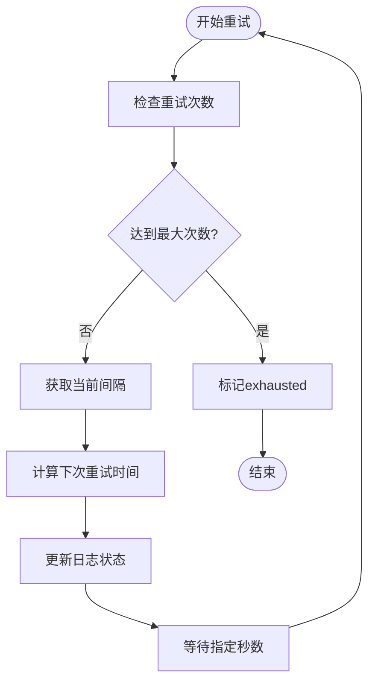
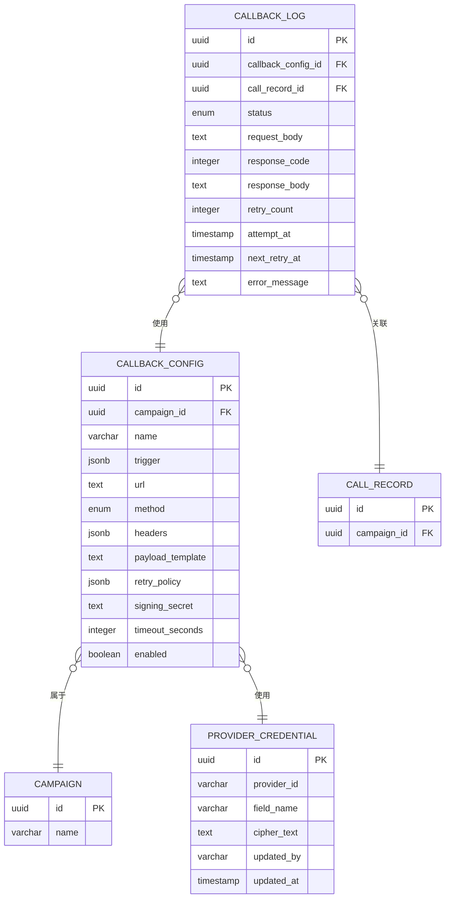

# 数据模型设计

<cite>
**本文档引用的文件**
- [webhook-callback/spec.md](file://openspec/specs/webhook-callback/spec.md)
- [data-model/spec.md](file://openspec/specs/data-model/spec.md)
</cite>

## 目录
1. [简介](#简介)
2. [项目结构](#项目结构)
3. [核心组件](#核心组件)
4. [架构概览](#架构概览)
5. [详细组件分析](#详细组件分析)
6. [依赖关系分析](#依赖关系分析)
7. [性能考虑](#性能考虑)
8. [故障排除指南](#故障排除指南)
9. [结论](#结论)

## 简介

本文档详细介绍了iSales系统中回调通知机制的数据模型设计。该机制允许在通话结束后异步触发外部webhook，通过JsonLogic表达式进行条件触发、Jinja2模板渲染payload、HMAC-SHA256签名验证以及指数退避重试策略。文档涵盖了callback_config表和callback_log表的完整字段设计、约束规则、状态枚举以及相关的索引和约束设计。

## 项目结构

回调通知机制的数据模型位于iSales项目的openspec规范文档中，采用分层架构设计：

**图表来源**
- [webhook-callback/spec.md:210-231](file://openspec/specs/webhook-callback/spec.md#L210-L231)
- [data-model/spec.md:44-45](file://openspec/specs/data-model/spec.md#L44-L45)

**章节来源**
- [webhook-callback/spec.md:1-231](file://openspec/specs/webhook-callback/spec.md#L1-L231)
- [data-model/spec.md:1-83](file://openspec/specs/data-model/spec.md#L1-L83)

## 核心组件

### callback_config表

callback_config表存储每个营销活动的回调配置，包含触发条件、目标URL、HTTP方法、请求头、payload模板等关键信息。

#### 字段设计

| 字段名 | 类型 | 约束 | 默认值 | 描述 |
|--------|------|------|--------|------|
| id | UUID | PRIMARY KEY | 自动生成 | 主键标识符 |
| campaign_id | UUID | NOT NULL, FOREIGN KEY |  | 关联的营销活动 |
| name | VARCHAR(255) | NOT NULL |  | 配置名称 |
| trigger | JSONB | NOT NULL |  | JsonLogic表达式，定义触发条件 |
| url | TEXT | NOT NULL |  | Webhook目标URL |
| method | ENUM | NOT NULL |  | HTTP方法（POST/PUT/PATCH/DELETE等） |
| headers | JSONB |  | {} | 额外的HTTP请求头 |
| payload_template | TEXT | NOT NULL |  | Jinja2模板字符串 |
| retry_policy | JSONB | NOT NULL |  | 重试策略配置 |
| signing_secret | TEXT | NOT NULL |  | 加密存储的签名密钥 |
| timeout_seconds | INTEGER |  | NULL | 覆盖全局的HTTP超时设置 |
| enabled | BOOLEAN | NOT NULL | TRUE | 是否启用该配置 |

#### 约束规则

- **JsonLogic验证**：trigger字段必须是有效的JsonLogic表达式
- **Jinja2模板验证**：payload_template必须是有效的Jinja2模板
- **签名密钥加密**：signing_secret必须使用Fernet加密存储
- **HTTP方法限制**：method必须是标准的HTTP方法
- **重试策略验证**：retry_policy必须包含intervals_seconds和max_attempts

### callback_log表

callback_log表记录每次webhook调用的详细状态和结果。

#### 字段设计

| 字段名 | 类型 | 约束 | 默认值 | 描述 |
|--------|------|------|--------|------|
| id | UUID | PRIMARY KEY | 自动生成 | 主键标识符 |
| callback_config_id | UUID | NOT NULL, FOREIGN KEY |  | 关联的回调配置 |
| call_record_id | UUID | NOT NULL, FOREIGN KEY |  | 关联的通话记录 |
| status | ENUM | NOT NULL | pending | 当前状态 |
| request_body | TEXT | NOT NULL |  | HTTP请求体内容 |
| response_code | INTEGER |  | NULL | HTTP响应状态码 |
| response_body | TEXT |  | NULL | HTTP响应体内容 |
| retry_count | INTEGER | NOT NULL | 0 | 已重试次数 |
| attempt_at | TIMESTAMP | NOT NULL | CURRENT_TIMESTAMP | 首次尝试时间 |
| next_retry_at | TIMESTAMP |  | NULL | 下次重试时间 |
| error_message | TEXT |  | NULL | 错误信息描述 |

#### 状态枚举

回调日志的状态枚举定义了完整的生命周期状态：

**图表来源**
- [webhook-callback/spec.md:223](file://openspec/specs/webhook-callback/spec.md#L223)

**状态转换说明**：
- **pending**：初始状态，等待处理
- **success**：HTTP 2xx响应，处理成功
- **failed_render**：触发条件评估或payload渲染失败
- **failed_http_4xx**：HTTP 4xx客户端错误，不重试
- **failed_http_5xx**：HTTP 5xx服务器错误，进入重试流程
- **pending_retry**：等待下次重试
- **exhausted**：达到最大重试次数，终止

**章节来源**
- [webhook-callback/spec.md:210-231](file://openspec/specs/webhook-callback/spec.md#L210-L231)
- [data-model/spec.md:44-45](file://openspec/specs/data-model/spec.md#L44-L45)

## 架构概览

回调通知机制采用异步处理架构，确保与主业务流程的解耦：

**图表来源**
- [webhook-callback/spec.md:7-17](file://openspec/specs/webhook-callback/spec.md#L7-L17)
- [webhook-callback/spec.md:100-133](file://openspec/specs/webhook-callback/spec.md#L100-L133)

## 详细组件分析

### JsonLogic触发器设计

触发器使用JsonLogic表达式语言，支持复杂的条件判断逻辑：

**图表来源**
- [webhook-callback/spec.md:19-46](file://openspec/specs/webhook-callback/spec.md#L19-L46)

#### 支持的字段引用范围

触发器表达式可引用以下数据源：

1. **call_summary字段**：`goal_achieved`、`goal_type`
2. **extracted_fields嵌套字段**：`extracted.*`
3. **lead表字段**：`lead.name`、`lead.phone`、`lead.source`、`lead.status`、`lead.custom_data.*`
4. **call_record字段**：`call.duration`、`call.started_at`、`call.transfer_status`、`call.hangup_cause`

### Jinja2 Payload模板引擎

payload模板使用Jinja2沙盒环境渲染，确保安全性：

**图表来源**
- [webhook-callback/spec.md:47-67](file://openspec/specs/webhook-callback/spec.md#L47-L67)

#### 沙盒安全特性

- 禁用文件系统IO操作
- 禁用动态导入功能
- 禁用eval和exec函数
- 严格变量访问控制
- 自动HTML转义

### HMAC-SHA256签名机制

签名机制确保请求的真实性和完整性：

**图表来源**
- [webhook-callback/spec.md:68-99](file://openspec/specs/webhook-callback/spec.md#L68-L99)

#### 请求头规范

- `X-Isales-Signature: sha256=<hex_digest>`
- `X-Isales-Timestamp: <unix_seconds>`
- `Content-Type: application/json`

### 指数退避重试策略

重试策略采用指数退避算法，支持灵活的重试配置：

**图表来源**
- [webhook-callback/spec.md:100-133](file://openspec/specs/webhook-callback/spec.md#L100-L133)

#### 重试策略配置

- **intervals_seconds**: 指数退避间隔数组
- **max_attempts**: 最大重试次数
- **策略扩展**: 超出数组长度时沿用最后一个间隔

**章节来源**
- [webhook-callback/spec.md:19-133](file://openspec/specs/webhook-callback/spec.md#L19-L133)

## 依赖关系分析

回调通知机制涉及多个表之间的复杂关系：

**图表来源**
- [data-model/spec.md:44-50](file://openspec/specs/data-model/spec.md#L44-L50)

### 外键约束关系

1. **callback_config.campaign_id** → **campaign.id**
2. **callback_log.callback_config_id** → **callback_config.id**
3. **callback_log.call_record_id** → **call_record.id**
4. **callback_config.signing_secret** → **provider_credential.cipher_text**

### 索引设计建议

基于查询模式，建议创建以下索引：

1. **callback_config索引**：
   - `campaign_id` (用于按活动查询)
   - `enabled` (用于快速筛选启用的配置)

2. **callback_log索引**：
   - `(callback_config_id, status)` (用于查询特定配置的日志)
   - `status` (用于查询特定状态的日志)
   - `next_retry_at` (用于重试调度)
   - `(attempt_at DESC)` (用于按时间排序)

**章节来源**
- [data-model/spec.md:44-50](file://openspec/specs/data-model/spec.md#L44-L50)

## 性能考虑

### 异步处理优势

回调通知机制采用异步处理模式，具有以下性能优势：

1. **非阻塞设计**：webhook调用不会阻塞主业务流程
2. **并发处理**：多个回调可以并行处理
3. **资源隔离**：失败的回调不会影响其他业务操作
4. **重试优化**：指数退避减少服务器压力

### 内存和存储优化

1. **payload复用**：重试时复用原始request_body，避免重复渲染
2. **状态机优化**：精简的状态转换减少不必要的数据库操作
3. **索引优化**：合理的索引设计提高查询性能

## 故障排除指南

### 常见问题诊断

#### 触发器评估失败

**症状**：callback_log.status = failed_render
**原因**：
- JsonLogic表达式语法错误
- 引用了不存在的字段
- 字段类型不匹配

**解决方案**：
1. 使用validate API测试触发器语法
2. 检查引用字段是否存在
3. 验证字段类型是否正确

#### Payload渲染失败

**症状**：callback_log.status = failed_render
**原因**：
- Jinja2模板语法错误
- 引用了未定义的变量
- 沙盒环境限制

**解决方案**：
1. 使用validate API测试模板
2. 检查模板中的变量引用
3. 确认沙盒环境限制

#### HTTP请求失败

**症状**：callback_log.status = failed_http_4xx或failed_http_5xx
**原因**：
- 4xx错误：URL错误、认证失败、参数错误
- 5xx错误：服务器内部错误、超时

**解决方案**：
1. 检查URL和认证信息
2. 验证网络连接
3. 查看响应体获取详细错误信息

#### 重试机制问题

**症状**：重试调度器无法正常工作
**原因**：
- next_retry_at字段未正确更新
- 重试策略配置错误
- 数据库连接问题

**解决方案**：
1. 检查重试调度器配置
2. 验证重试策略的有效性
3. 确认数据库连接状态

**章节来源**
- [webhook-callback/spec.md:134-133](file://openspec/specs/webhook-callback/spec.md#L134-L133)

## 结论

回调通知机制的数据模型设计体现了现代微服务架构的最佳实践：

1. **解耦设计**：webhook处理与主业务流程完全分离
2. **安全性**：多层安全防护，包括沙盒渲染、HMAC签名、加密存储
3. **可靠性**：指数退避重试、状态持久化、错误处理
4. **可维护性**：清晰的状态机、详细的日志记录、完善的监控

该设计确保了系统的高可用性和可扩展性，为未来的功能扩展奠定了坚实的基础。