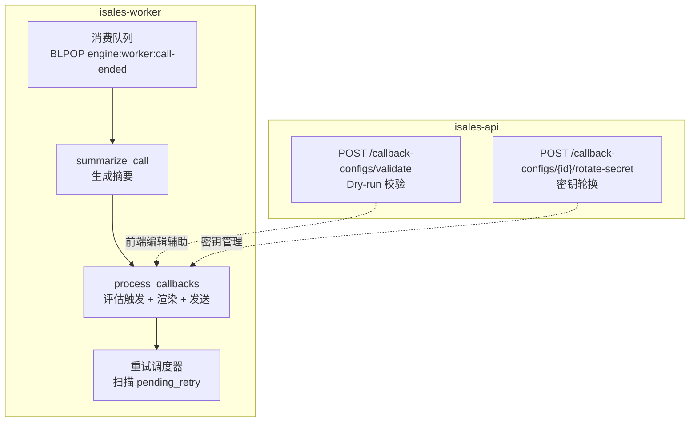
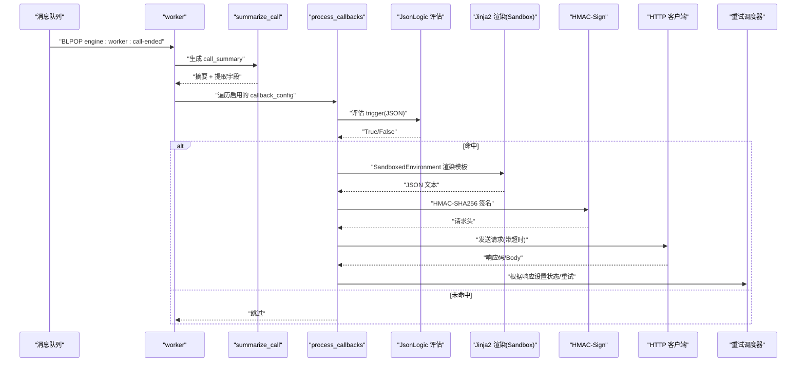
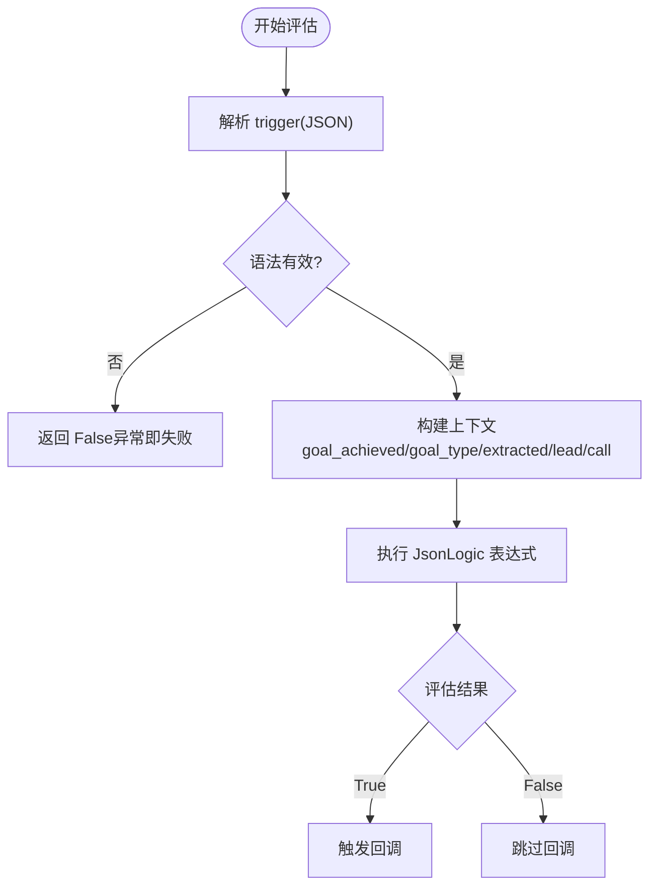
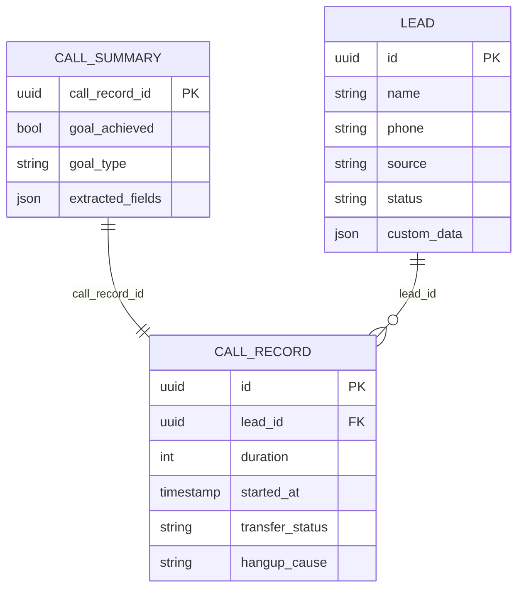
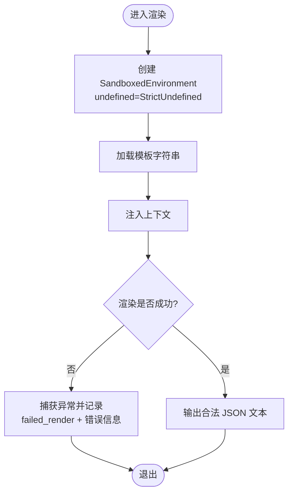
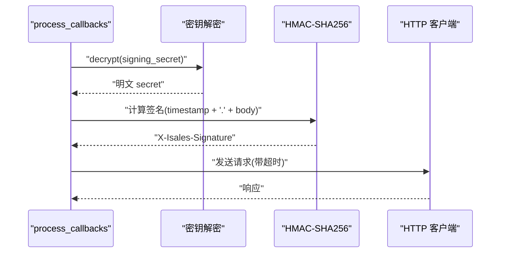
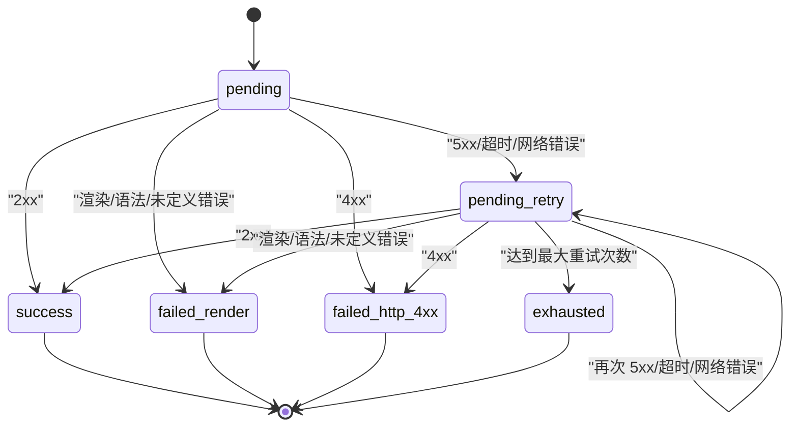
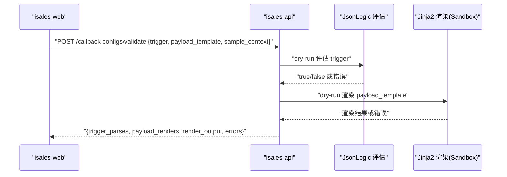
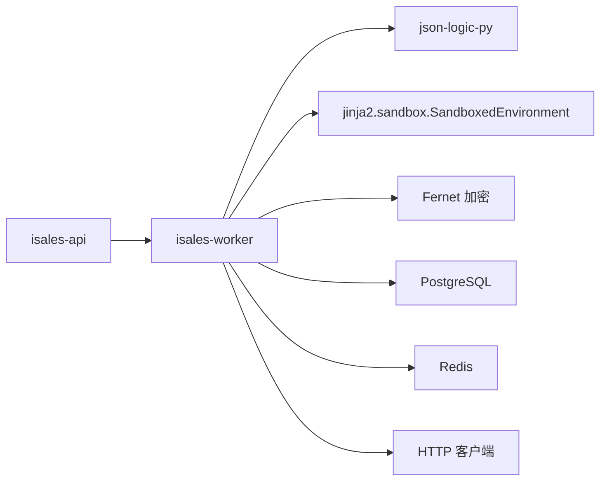

# 模板渲染系统

<cite>
**本文引用的文件**
- [设计文档（2026-05-06 实施 worker）](file://openspec/changes/archive/2026-05-06-impl-worker/design.md)
- [提案（2026-05-06 实施 worker）](file://openspec/changes/archive/2026-05-06-impl-worker/proposal.md)
- [任务清单（2026-05-06 实施 worker）](file://openspec/changes/archive/2026-05-06-impl-worker/tasks.md)
- [规范：webhook 回调](file://openspec/specs/webhook-callback/spec.md)
- [规范：webhook 回调（修订版）](file://openspec/changes/archive/2026-05-08-impl-web-polish/specs/webhook-callback/spec.md)
</cite>

## 目录
1. [简介](#简介)
2. [项目结构](#项目结构)
3. [核心组件](#核心组件)
4. [架构总览](#架构总览)
5. [组件详解](#组件详解)
6. [依赖关系分析](#依赖关系分析)
7. [性能考量](#性能考量)
8. [故障排查指南](#故障排查指南)
9. [结论](#结论)
10. [附录](#附录)

## 简介
本技术文档围绕基于 Jinja2 沙盒的模板渲染系统进行深入说明，重点涵盖：
- SandboxedEnvironment 的安全机制与禁用特性
- 模板语法支持范围（变量引用、过滤器、控制结构）
- 模板渲染的完整流程与上下文数据结构
- 错误处理机制与沙盒环境下的安全限制
- 模板编写指南、常见问题与调试技巧

该系统用于在通话结束后异步触发外部 webhook，其关键流程包括：触发条件评估（JsonLogic）、上下文构建、模板渲染（Jinja2 SandboxedEnvironment）、签名与发送、重试策略与状态记录。

## 项目结构
本项目将“模板渲染”作为 isales-worker 的一部分，配合 isales-api 的“配置校验”接口共同完成前端编辑体验与运行时安全校验。核心职责划分如下：
- isales-worker：消费通话结束消息，汇总摘要，评估触发条件，渲染模板，签名并发送 HTTP 请求，管理重试与状态记录
- isales-api：提供配置校验与密钥轮换接口，确保前端编辑阶段即可发现语法与渲染问题

图表来源
- [提案（2026-05-06 实施 worker）:12-38](file://openspec/changes/archive/2026-05-06-impl-worker/proposal.md#L12-L38)
- [规范：webhook 回调:1-20](file://openspec/specs/webhook-callback/spec.md#L1-L20)

章节来源
- [提案（2026-05-06 实施 worker）:12-38](file://openspec/changes/archive/2026-05-06-impl-worker/proposal.md#L12-L38)
- [规范：webhook 回调:1-20](file://openspec/specs/webhook-callback/spec.md#L1-L20)

## 核心组件
- 触发条件评估（JsonLogic）
  - 使用 json-logic-py 评估 trigger 表达式，异常视为 False
  - 上下文字段范围明确：goal_achieved、goal_type、extracted.*、lead.*、call.*
- 模板渲染（Jinja2 SandboxedEnvironment）
  - 使用 SandboxedEnvironment，禁用文件 IO、import、eval 等危险能力
  - undefined 参数采用 StrictUndefined，避免静默输出空串
  - 渲染失败统一映射为 failed_render，不重试
- 签名与发送
  - 使用 HMAC-SHA256 对请求体签名，携带时间戳与 Content-Type
  - 超时可按配置覆盖全局默认值
- 重试策略
  - 指数退避 + 最大次数；重试调度器周期扫描并复用上次 request_body
- 数据模型
  - callback_config：存储 trigger、url、method、headers、payload_template、retry_policy、signing_secret、timeout_seconds、enabled
  - callback_log：记录状态、请求体、响应码、重试计数、下次重试时间、错误信息等

章节来源
- [设计文档（2026-05-06 实施 worker）:82-87](file://openspec/changes/archive/2026-05-06-impl-worker/design.md#L82-L87)
- [任务清单（2026-05-06 实施 worker）:31-40](file://openspec/changes/archive/2026-05-06-impl-worker/tasks.md#L31-L40)
- [规范：webhook 回调:47-67](file://openspec/specs/webhook-callback/spec.md#L47-L67)
- [规范：webhook 回调:100-133](file://openspec/specs/webhook-callback/spec.md#L100-L133)
- [规范：webhook 回调:210-231](file://openspec/specs/webhook-callback/spec.md#L210-L231)

## 架构总览
模板渲染系统在 isales-worker 中的运行时架构如下：

图表来源
- [提案（2026-05-06 实施 worker）:25-38](file://openspec/changes/archive/2026-05-06-impl-worker/proposal.md#L25-L38)
- [规范：webhook 回调:100-133](file://openspec/specs/webhook-callback/spec.md#L100-L133)

## 组件详解

### 触发条件评估（JsonLogic）
- 评估库：json-logic-py
- 上下文字段范围：goal_achieved、goal_type、extracted.*、lead.*、call.*
- 异常处理：任何异常视为 False，避免误触发
- 前端校验：isales-api 提供 dry-run 校验接口，仅评估 trigger 语法，不写数据库或队列

图表来源
- [提案（2026-05-06 实施 worker）:25-28](file://openspec/changes/archive/2026-05-06-impl-worker/proposal.md#L25-L28)
- [规范：webhook 回调:171-194](file://openspec/specs/webhook-callback/spec.md#L171-L194)

章节来源
- [提案（2026-05-06 实施 worker）:25-28](file://openspec/changes/archive/2026-05-06-impl-worker/proposal.md#L25-L28)
- [规范：webhook 回调:171-194](file://openspec/specs/webhook-callback/spec.md#L171-L194)

### 模板上下文与字段访问规则
- 上下文来源与字段
  - goal_achieved、goal_type：来自 call_summary
  - extracted.*：来自 call_summary.extracted_fields
  - lead.name、lead.phone、lead.source、lead.status、lead.custom_data.*：来自 lead 表
  - call.duration、call.started_at、call.transfer_status、call.hangup_cause：来自 call_record
- 字段访问方式
  - 嵌套字段通过点号访问（如 extracted.appointment_time）
  - lead.custom_data.* 通过平铺字段访问（如 lead.custom_data.x）

图表来源
- [规范：webhook 回调:33-41](file://openspec/specs/webhook-callback/spec.md#L33-L41)

章节来源
- [规范：webhook 回调:33-41](file://openspec/specs/webhook-callback/spec.md#L33-L41)

### 沙盒模板渲染（SandboxedEnvironment）
- 环境配置
  - 使用 jinja2.sandbox.SandboxedEnvironment
  - 禁用文件 IO、import、eval 等危险能力
  - undefined 参数为 StrictUndefined，未定义变量直接报错
- 渲染流程
  - 将上下文注入模板
  - 输出合法 JSON（模板中可使用 tojson 等过滤器）
- 错误处理
  - 任意异常（UndefinedError、SecurityError、TemplateSyntaxError）统一映射为 failed_render，不重试
  - 错误信息写入 callback_log.error_message

图表来源
- [设计文档（2026-05-06 实施 worker）:82-87](file://openspec/changes/archive/2026-05-06-impl-worker/design.md#L82-L87)
- [规范：webhook 回调:47-67](file://openspec/specs/webhook-callback/spec.md#L47-L67)
- [规范：webhook 回调:134-147](file://openspec/specs/webhook-callback/spec.md#L134-L147)

章节来源
- [设计文档（2026-05-06 实施 worker）:82-87](file://openspec/changes/archive/2026-05-06-impl-worker/design.md#L82-L87)
- [规范：webhook 回调:47-67](file://openspec/specs/webhook-callback/spec.md#L47-L67)
- [规范：webhook 回调:134-147](file://openspec/specs/webhook-callback/spec.md#L134-L147)

### 签名与发送（HMAC-SHA256）
- 密钥管理
  - signing_secret 通过 Fernet 加密存储，仅在创建或轮换时一次性返回明文
- 签名计算
  - 请求体 = JSON 文本（已渲染）
  - 签名内容 = timestamp + "." + body_bytes
  - 使用 HMAC-SHA256(secret) 计算摘要
- 请求头
  - X-Isales-Signature: sha256=<hex>
  - X-Isales-Timestamp: <unix_seconds>
  - Content-Type: application/json
- 超时
  - callback_config.timeout_seconds 可覆盖全局默认值

图表来源
- [规范：webhook 回调:68-99](file://openspec/specs/webhook-callback/spec.md#L68-L99)
- [规范：webhook 回调:148-156](file://openspec/specs/webhook-callback/spec.md#L148-L156)

章节来源
- [规范：webhook 回调:68-99](file://openspec/specs/webhook-callback/spec.md#L68-L99)
- [规范：webhook 回调:148-156](file://openspec/specs/webhook-callback/spec.md#L148-L156)

### 重试策略与状态管理
- 策略
  - retry_policy = {intervals_seconds: [...], max_attempts: N}
  - 指数退避；超出数组长度沿用最后一项
- 状态机
  - pending → success / failed_render / failed_http_4xx / failed_http_5xx / pending_retry → exhausted
- 调度器
  - 周期扫描 callback_log，筛选 status='pending_retry' 且 next_retry_at ≤ now
  - 复用上次 request_body，避免上下文漂移

图表来源
- [规范：webhook 回调:100-133](file://openspec/specs/webhook-callback/spec.md#L100-L133)
- [规范：webhook 回调:124-133](file://openspec/specs/webhook-callback/spec.md#L124-L133)

章节来源
- [规范：webhook 回调:100-133](file://openspec/specs/webhook-callback/spec.md#L100-L133)
- [规范：webhook 回调:124-133](file://openspec/specs/webhook-callback/spec.md#L124-L133)

### 前端编辑辅助与 Dry-run 校验
- isales-api 提供 /callback-configs/validate 接口
  - 仅做 dry-run：评估 trigger 语法、用 SandboxedEnvironment 渲染 payload_template
  - 返回结构包含 trigger_parses、payload_renders、render_output、errors
  - 不写数据库、不推队列、不触发外部 HTTP

图表来源
- [规范：webhook 回调（修订版）:1-20](file://openspec/changes/archive/2026-05-08-impl-web-polish/specs/webhook-callback/spec.md#L1-L20)
- [规范：webhook 回调:171-194](file://openspec/specs/webhook-callback/spec.md#L171-L194)

章节来源
- [规范：webhook 回调（修订版）:1-20](file://openspec/changes/archive/2026-05-08-impl-web-polish/specs/webhook-callback/spec.md#L1-L20)
- [规范：webhook 回调:171-194](file://openspec/specs/webhook-callback/spec.md#L171-L194)

## 依赖关系分析
- 组件耦合
  - worker 与 isales-api 通过配置校验接口耦合，确保前端编辑阶段的安全与一致性
  - worker 与数据库、Redis、HTTP 客户端形成运行时依赖
- 外部依赖
  - json-logic-py：触发条件评估
  - jinja2.sandbox.SandboxedEnvironment：模板渲染
  - Fernet：密钥加密存储
- 潜在风险
  - 密钥不一致会导致解密失败，表现为 failed_render
  - 重试调度器与 BLPOP 任务并发写 callback_log，通过主键更新避免冲突

图表来源
- [提案（2026-05-06 实施 worker）:25-38](file://openspec/changes/archive/2026-05-06-impl-worker/proposal.md#L25-L38)
- [规范：webhook 回调:68-99](file://openspec/specs/webhook-callback/spec.md#L68-L99)

章节来源
- [提案（2026-05-06 实施 worker）:25-38](file://openspec/changes/archive/2026-05-06-impl-worker/proposal.md#L25-L38)
- [规范：webhook 回调:68-99](file://openspec/specs/webhook-callback/spec.md#L68-L99)

## 性能考量
- 渲染性能
  - 模板尽量简洁，避免复杂循环与深层嵌套
  - 使用 tojson 等轻量过滤器，减少 Python 层处理开销
- 并发与吞吐
  - 多个 callback 并行发送，但不强制顺序
  - 重试调度器周期扫描，避免阻塞主线程
- 超时与重试
  - 合理设置 timeout_seconds 与 retry_policy，平衡可靠性与资源占用

## 故障排查指南
- 渲染失败（failed_render）
  - 可能原因：模板语法错误、引用未定义变量、沙盒禁用特性（如 import、eval）
  - 处理建议：使用 /callback-configs/validate 进行 dry-run 校验；确认上下文字段存在；避免使用被禁用能力
- 4xx HTTP 响应
  - 处理建议：检查目标服务端逻辑与鉴权；此类错误不重试
- 5xx/超时/网络错误
  - 处理建议：查看 retry_policy 配置；确认网络连通性；关注 callback_log.retry_count 与 next_retry_at
- 密钥问题
  - 处理建议：确认 signing_secret 是否正确轮换；核对 ISALES_FERNET_KEY 一致性；重新生成并轮换密钥

章节来源
- [设计文档（2026-05-06 实施 worker）:82-87](file://openspec/changes/archive/2026-05-06-impl-worker/design.md#L82-L87)
- [规范：webhook 回调:114-133](file://openspec/specs/webhook-callback/spec.md#L114-L133)
- [规范：webhook 回调:195-209](file://openspec/specs/webhook-callback/spec.md#L195-L209)

## 结论
本系统通过严格的沙盒渲染与可控的触发条件评估，实现了安全、可靠、可观测的 webhook 模板渲染流程。前端编辑阶段的 dry-run 校验与后端的 fail-fast 策略相结合，显著降低了配置错误与运行时风险。配合指数退避重试与状态机管理，系统在高并发场景下仍能保持稳定与可维护性。

## 附录

### 模板编写指南
- 变量引用
  - 使用明确的字段路径，避免深层嵌套
  - 注意 lead.custom_data.* 的平铺访问方式
- 过滤器使用
  - 推荐使用 tojson 等安全过滤器
  - 避免使用被沙盒禁用的能力（如 import、eval）
- 控制结构
  - 尽量简化控制结构，避免复杂逻辑
  - 如需条件判断，优先在触发阶段完成

### 常见错误与修复
- 未定义变量：检查上下文字段是否存在，必要时添加默认值或调整模板
- 语法错误：使用 /callback-configs/validate 进行 dry-run 校验
- 安全错误：移除 import、eval 等危险语法，使用允许的过滤器与函数

### 调试技巧
- 使用 /callback-configs/validate 获取渲染输出与错误明细
- 查看 callback_log 中的 error_message 与状态流转
- 关注重试调度器扫描日志，确认重试行为符合预期