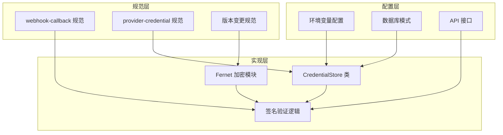
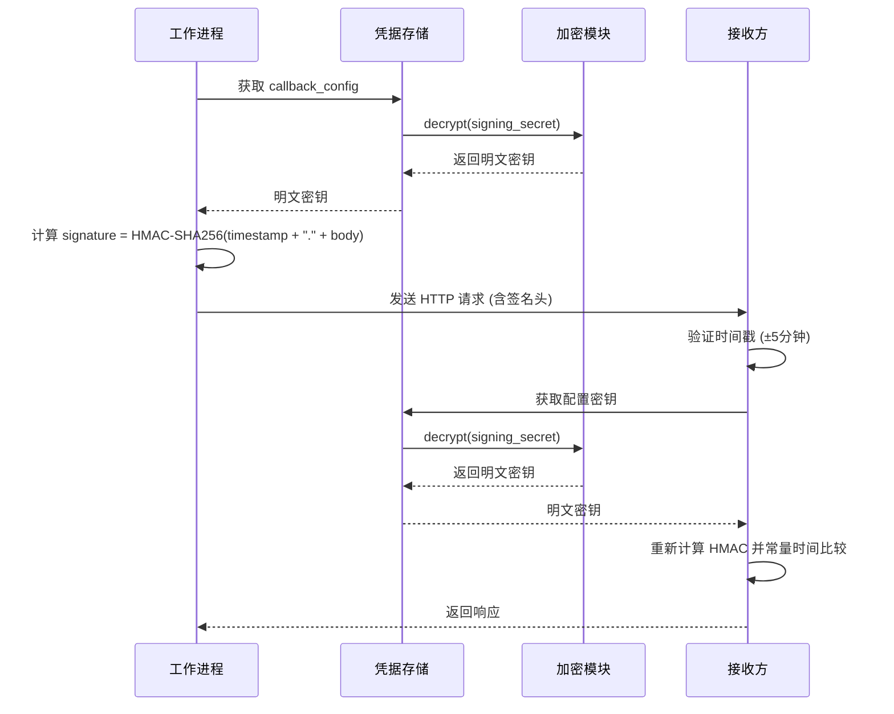
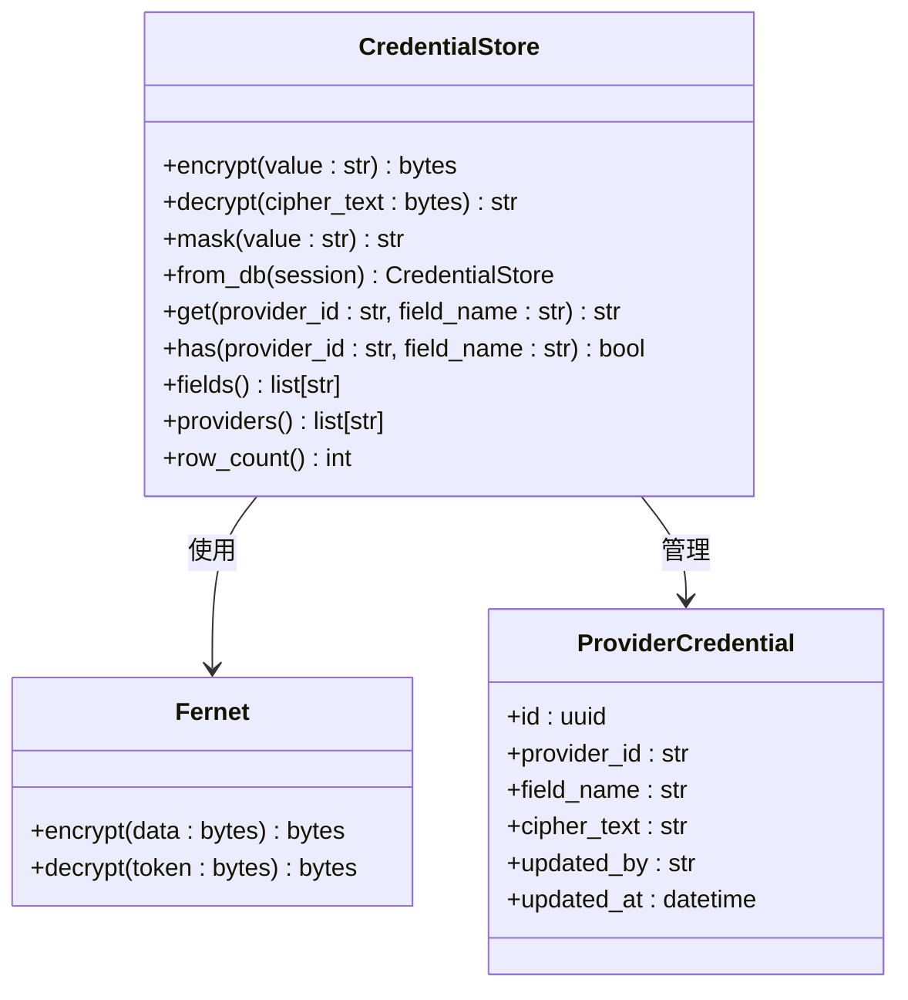
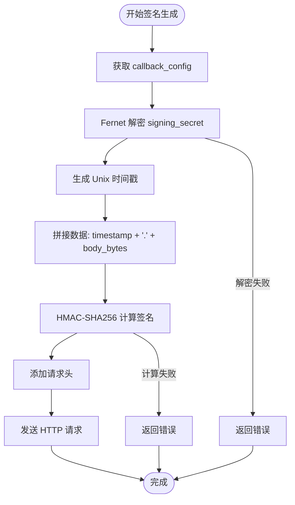
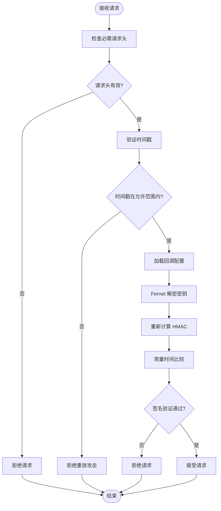
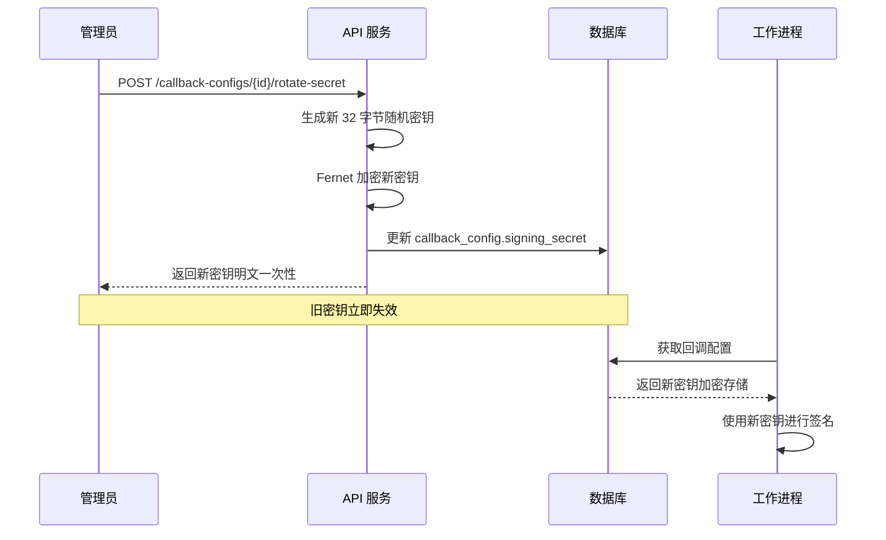
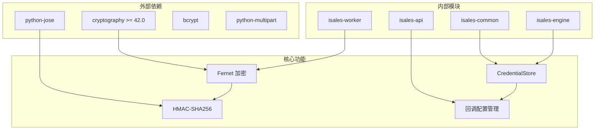

# 签名验证机制

<cite>
**本文档引用的文件**
- [webhook-callback 规范](file://openspec/specs/webhook-callback/spec.md)
- [provider-credential 规范](file://openspec/specs/provider-credential/spec.md)
- [worker 环境配置](file://deploy/cloud/env/worker.env)
- [2026-05-24 版本变更 - webhook-callback](file://openspec/changes/archive/2026-05-24-impl-provider-credential-db-ssot/specs/webhook-callback/spec.md)
- [2026-05-24 版本变更 - provider-credential](file://openspec/changes/archive/2026-05-24-impl-provider-credential-db-ssot/specs/provider-credential/spec.md)
- [2026-05-06 版本变更 - worker](file://openspec/changes/archive/2026-05-06-impl-worker/specs/webhook-callback/spec.md)
- [2026-05-08 版本变更 - web](file://openspec/changes/archive/2026-05-08-impl-web-polish/specs/webhook-callback/spec.md)
</cite>

## 目录
1. [简介](#简介)
2. [项目结构](#项目结构)
3. [核心组件](#核心组件)
4. [架构概览](#架构概览)
5. [详细组件分析](#详细组件分析)
6. [依赖关系分析](#依赖关系分析)
7. [性能考虑](#性能考虑)
8. [故障排除指南](#故障排除指南)
9. [结论](#结论)

## 简介

本文档详细介绍了 isales 项目中的 HMAC-SHA256 签名验证机制。该机制用于确保 webhook 请求的完整性和真实性，防止中间人攻击和重放攻击。系统采用 Fernet 对称加密进行密钥管理，并通过标准化的请求头格式实现端到端的安全通信。

## 项目结构

isales 项目的签名验证机制主要分布在以下三个层面：



**图表来源**
- [webhook-callback 规范:68-98](file://openspec/specs/webhook-callback/spec.md#L68-L98)
- [provider-credential 见证:140-168](file://openspec/specs/provider-credential/spec.md#L140-L168)

**章节来源**
- [webhook-callback 规范:1-231](file://openspec/specs/webhook-callback/spec.md#L1-L231)
- [provider-credential 规范:137-168](file://openspec/specs/provider-credential/spec.md#L137-L168)

## 核心组件

### HMAC-SHA256 签名算法

系统采用 HMAC-SHA256 算法进行消息认证，确保数据完整性。签名计算公式为：

```
signature = HMAC-SHA256(secret, timestamp + "." + body_bytes)
```

其中：
- `secret`：从 Fernet 加密存储中解密得到的明文密钥
- `timestamp`：Unix 时间戳（秒级精度）
- `body_bytes`：HTTP 请求体的字节表示

### 请求头格式

所有 webhook 请求必须包含以下标准化请求头：

| 请求头名称 | 数据类型 | 描述 | 示例值 |
|-----------|----------|------|--------|
| X-Isales-Signature | 字符串 | HMAC-SHA256 签名的十六进制表示 | `sha256=2f700e4b...` |
| X-Isales-Timestamp | 整数 | Unix 时间戳（秒） | `1700000000` |
| Content-Type | 字符串 | 必须为 `application/json` | `application/json` |

### Fernet 密钥管理系统

系统使用 Fernet 对称加密进行密钥管理，采用统一的主密钥进行所有敏感数据的加密存储。

**章节来源**
- [webhook-callback 规范:68-98](file://openspec/specs/webhook-callback/spec.md#L68-L98)
- [provider-credential 规范:140-168](file://openspec/specs/provider-credential/spec.md#L140-L168)

## 架构概览



**图表来源**
- [webhook-callback 规范:80-88](file://openspec/specs/webhook-callback/spec.md#L80-L88)
- [provider-credential 规范:160-168](file://openspec/specs/provider-credential/spec.md#L160-L168)

## 详细组件分析

### CredentialStore 类设计



**图表来源**
- [2026-05-24 版本变更 - provider-credential:5-11](file://openspec/changes/archive/2026-05-24-impl-provider-credential-db-ssot/tasks.md#L5-L11)

### 签名生成流程



**图表来源**
- [webhook-callback 规范:80-83](file://openspec/specs/webhook-callback/spec.md#L80-L83)

### 签名验证流程



**图表来源**
- [webhook-callback 规范:85-88](file://openspec/specs/webhook-callback/spec.md#L85-L88)

**章节来源**
- [2026-05-24 版本变更 - provider-credential:1-12](file://openspec/changes/archive/2026-05-24-impl-provider-credential-db-ssot/tasks.md#L1-L12)

### 密钥轮换机制

系统支持动态密钥轮换，确保安全性并最小化停机时间：



**图表来源**
- [webhook-callback 规范:95-98](file://openspec/specs/webhook-callback/spec.md#L95-L98)

**章节来源**
- [webhook-callback 规范:90-98](file://openspec/specs/webhook-callback/spec.md#L90-L98)

### 安全考虑与最佳实践

#### 防重放攻击

系统实施多层防重放保护：

1. **时间戳验证**：接收方检查 `X-Isales-Timestamp` 与当前时间的偏差不超过 5 分钟
2. **一次性使用**：密钥轮换后旧密钥立即失效
3. **常量时间比较**：防止时序攻击

#### 密钥管理最佳实践

1. **统一密钥源**：所有组件使用相同的 `ISALES_FERNET_KEY`
2. **最小权限原则**：只有必要的服务组件访问密钥
3. **定期轮换**：建议每 90 天轮换一次密钥
4. **审计日志**：记录所有密钥访问和轮换操作

**章节来源**
- [webhook-callback 规范:20-23](file://openspec/specs/webhook-callback/spec.md#L20-L23)
- [worker 环境配置:10-14](file://deploy/cloud/env/worker.env#L10-L14)

## 依赖关系分析



**图表来源**
- [2026-05-24 版本变更 - provider-credential:3-4](file://openspec/changes/archive/2026-05-24-impl-provider-credential-db-ssot/tasks.md#L3-L4)

**章节来源**
- [2026-05-24 版本变更 - provider-credential:1-12](file://openspec/changes/archive/2026-05-24-impl-provider-credential-db-ssot/tasks.md#L1-L12)

## 性能考虑

### 加密性能优化

1. **批量操作**：CredentialStore 实现内存缓存，减少重复解密操作
2. **连接池**：数据库连接使用连接池管理，提高并发性能
3. **异步处理**：工作进程使用异步 I/O 处理 webhook 请求

### 缓存策略

- **短期缓存**：凭据存储在内存中缓存，默认 5 分钟过期
- **LRU 淘汰**：使用最近最少使用算法管理缓存大小
- **预热机制**：系统启动时预加载常用凭据

## 故障排除指南

### 常见问题诊断

#### 签名验证失败

**症状**：接收方拒绝 webhook 请求，返回 401 或 403

**排查步骤**：
1. 检查请求头是否包含完整的签名信息
2. 验证时间戳是否在允许的时间窗口内
3. 确认使用的密钥与配置中的密钥一致
4. 检查请求体是否被修改

#### 密钥解密错误

**症状**：工作进程无法解密 callback_config.signing_secret

**排查步骤**：
1. 验证 ISALES_FERNET_KEY 环境变量配置正确
2. 检查数据库中存储的密钥格式是否为有效的 Fernet token
3. 确认没有对存储的密钥进行手动修改

#### 重放攻击防护

**症状**：请求被拒绝，提示时间戳无效

**解决方案**：
1. 同步系统时间到准确的 UTC 时间
2. 检查网络延迟，确保时间差不超过 5 分钟
3. 考虑在网络设备上启用 NTP 同步

**章节来源**
- [webhook-callback 规范:85-88](file://openspec/specs/webhook-callback/spec.md#L85-L88)
- [worker 环境配置:10-14](file://deploy/cloud/env/worker.env#L10-L14)

## 结论

isales 项目的 HMAC-SHA256 签名验证机制通过标准化的请求头格式、严格的密钥管理和完善的防重放保护，为 webhook 通信提供了可靠的安全保障。系统的设计充分考虑了易用性、安全性和性能要求，为生产环境的稳定运行奠定了坚实基础。

通过遵循本文档中的最佳实践和故障排除指南，开发团队可以确保签名验证机制的有效性和可靠性，为系统的整体安全性提供有力支撑。