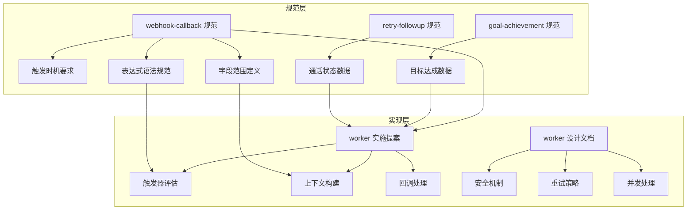
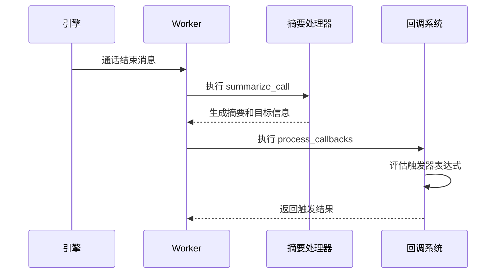
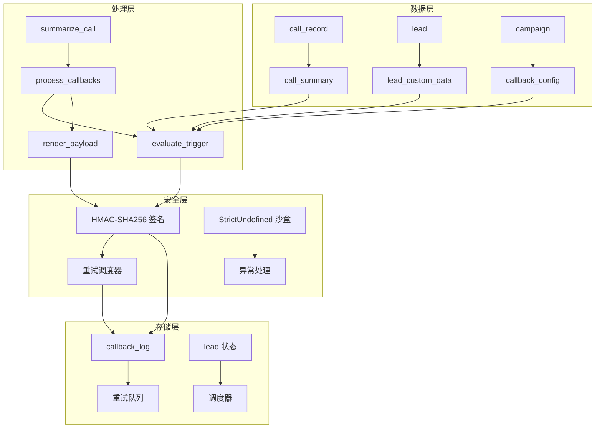
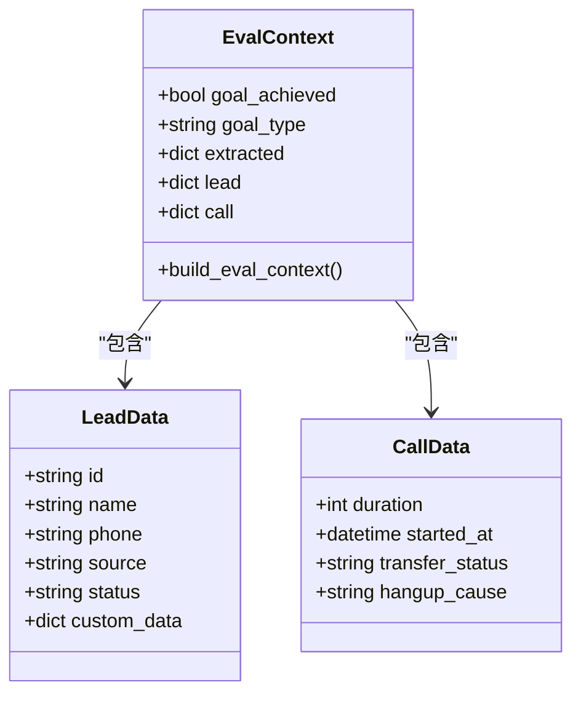
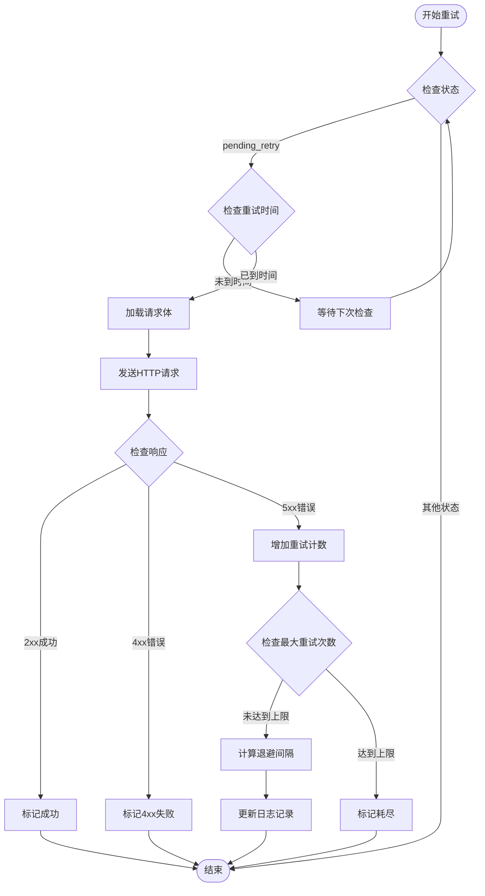
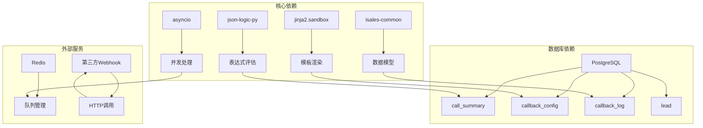

# 触发器表达式系统

<cite>
**本文档引用的文件**
- [webhook-callback 规范](file://openspec/specs/webhook-callback/spec.md)
- [目标达成规范](file://openspec/specs/goal-achievement/spec.md)
- [重试跟进规范](file://openspec/specs/retry-followup/spec.md)
- [worker 实施提案](file://openspec/changes/archive/2026-05-06-impl-worker/proposal.md)
- [worker 设计文档](file://openspec/changes/archive/2026-05-06-impl-worker/design.md)
- [worker 任务清单](file://openspec/changes/archive/2026-05-06-impl-worker/tasks.md)
- [web 实现提案](file://openspec/changes/archive/2026-05-08-impl-web-polish/proposal.md)
</cite>

## 目录
1. [简介](#简介)
2. [项目结构](#项目结构)
3. [核心组件](#核心组件)
4. [架构概览](#架构概览)
5. [详细组件分析](#详细组件分析)
6. [依赖关系分析](#依赖关系分析)
7. [性能考虑](#性能考虑)
8. [故障排除指南](#故障排除指南)
9. [结论](#结论)

## 简介

触发器表达式系统是 isales 通话自动化平台的核心组件，基于 JsonLogic 语法为回调触发提供强大的条件判断能力。该系统确保在通话结束后准确触发外部 webhook，支持复杂的业务逻辑判断，包括目标达成状态、通话结果、客户信息等多个维度的条件组合。

系统采用"summarize_call 之后触发"的设计原则，确保触发时机的准确性，避免在通话过程中产生误触发。通过严格的字段范围控制和安全的表达式评估机制，系统为业务场景提供了灵活而可靠的自动化能力。

## 项目结构

触发器表达式系统主要分布在以下规范文件中：

**图表来源**
- [webhook-callback 规范:1-231](file://openspec/specs/webhook-callback/spec.md#L1-L231)
- [worker 实施提案:7-72](file://openspec/changes/archive/2026-05-06-impl-worker/proposal.md#L7-L72)

**章节来源**
- [webhook-callback 规范:1-231](file://openspec/specs/webhook-callback/spec.md#L1-L231)
- [worker 实施提案:7-72](file://openspec/changes/archive/2026-05-06-impl-worker/proposal.md#L7-L72)

## 核心组件

### JsonLogic 表达式引擎

系统使用 json-logic-py 库作为 JsonLogic 表达式评估引擎，提供稳定可靠的表达式解析和执行能力。

**表达式评估流程**：
1. 将回调配置中的 JsonLogic 表达式转换为可执行的逻辑树
2. 构建评估上下文，包含所有允许访问的字段
3. 执行表达式评估，返回布尔结果
4. 异常情况统一处理为 False

### 触发时机控制

系统严格规定触发时机必须在 `summarize_call` 任务完成后执行：

**图表来源**
- [worker 实施提案:18-23](file://openspec/changes/archive/2026-05-06-impl-worker/proposal.md#L18-L23)
- [webhook-callback 规范:5-17](file://openspec/specs/webhook-callback/spec.md#L5-L17)

### 字段范围访问控制

系统定义了严格的字段访问范围，确保触发器只能访问必要的数据：

| 字段类别 | 访问路径 | 数据来源 | 说明 |
|---------|---------|---------|------|
| 目标状态 | goal_achieved, goal_type | call_summary | 通话目标达成状态和类型 |
| 提取字段 | extracted.* | call_summary.extracted_fields | 通话中提取的关键信息 |
| 客户信息 | lead.name, lead.phone, lead.source, lead.status, lead.custom_data.* | lead 表 | 客户基本信息和自定义数据 |
| 通话信息 | call.duration, call.started_at, call.transfer_status, call.hangup_cause | call_record | 通话过程和结果数据 |

**章节来源**
- [webhook-callback 规范:33-46](file://openspec/specs/webhook-callback/spec.md#L33-L46)
- [worker 设计文档:74-81](file://openspec/changes/archive/2026-05-06-impl-worker/design.md#L74-L81)

## 架构概览

触发器表达式系统采用分层架构设计，确保各组件职责清晰、耦合度低：

**图表来源**
- [worker 设计文档:37-105](file://openspec/changes/archive/2026-05-06-impl-worker/design.md#L37-L105)
- [webhook-callback 规范:100-133](file://openspec/specs/webhook-callback/spec.md#L100-L133)

## 详细组件分析

### 触发器表达式评估组件

触发器表达式评估是系统的核心功能，负责将 JsonLogic 表达式转换为可执行的条件判断。

#### 表达式语法支持

系统支持完整的 JsonLogic 语法集，包括但不限于：

**比较操作符**：
- 相等比较：`{"==": [...]}`，`{"===": [...]}`  
- 不等比较：`{"!=": [...]}`，`{"!==": [...]}`  
- 大小比较：`{">": [...]}`，`{">=": [...]}`，`{"<": [...]}`，`{"<=": [...]}`

**逻辑操作符**：
- 逻辑与：`{"and": [...]}`  
- 逻辑或：`{"or": [...]}`  
- 逻辑非：`{"not": [...]}`

**数组操作符**：
- 成员检查：`{"in": [...]}`，`{"cat": [...]}`  
- 数组长度：`{"var": "array.length"}`

**条件操作符**：
- 三元条件：`{"?:": [...]}`  
- 数组映射：`{"map": [...]}`

#### 字段引用语法

系统提供多种字段引用方式：

**基础字段引用**：
- `{"var": "goal_achieved"}` - 访问目标达成状态
- `{"var": "goal_type"}` - 访问目标类型
- `{"var": "lead.status"}` - 访问客户状态

**嵌套字段访问**：
- `{"var": "extracted.appointment_time"}` - 访问提取的预约时间
- `{"var": "lead.custom_data.preference"}` - 访问客户偏好设置

**数组和对象访问**：
- `{"var": "extracted.contacts[0].phone"}` - 访问第一个联系人的电话
- `{"var": "lead.tags[*]"}` - 访问所有标签

### 上下文构建组件

上下文构建组件负责将原始数据转换为触发器评估所需的结构化数据。

#### 上下文数据结构

**图表来源**
- [worker 设计文档:74-81](file://openspec/changes/archive/2026-05-06-impl-worker/design.md#L74-L81)
- [worker 任务清单:33-35](file://openspec/changes/archive/2026-05-06-impl-worker/tasks.md#L33-L35)

#### 字段范围验证

系统在构建上下文时进行严格的字段范围验证，确保只包含允许访问的数据：

**验证流程**：
1. 检查目标达成状态字段是否存在
2. 验证提取字段的 JSON 结构完整性
3. 校验客户信息字段的类型一致性
4. 确认通话记录字段的数值范围合理性

### 重试调度组件

重试调度组件实现了指数退避的重试策略，确保系统在面对网络异常时的可靠性。

#### 重试策略算法

**图表来源**
- [webhook-callback 规范:100-133](file://openspec/specs/webhook-callback/spec.md#L100-L133)
- [worker 设计文档:98-105](file://openspec/changes/archive/2026-05-06-impl-worker/design.md#L98-L105)

#### 重试间隔计算

系统使用指数退避算法计算重试间隔：

| 重试次数 | 间隔秒数 | 说明 |
|---------|---------|------|
| 1 | intervals_seconds[0] | 第一次重试 |
| 2 | intervals_seconds[1] | 第二次重试 |
| n | intervals_seconds[n-1] | 第n次重试 |
| n > length | intervals_seconds[length-1] | 超出数组长度时使用最后项 |

### 安全和错误处理组件

系统实现了多层次的安全防护和错误处理机制。

#### HMAC-SHA256 签名机制

每次 HTTP 请求都包含完整的签名信息：

**签名内容格式**：
- `"<timestamp>.<body_bytes>"`
- 使用 `hmac.new(secret.encode(), msg=content.encode(), digestmod=hashlib.sha256).hexdigest()`

**请求头格式**：
- `X-Isales-Signature: sha256=<hex_digest>`
- `X-Isales-Timestamp: <unix_seconds>`
- `Content-Type: application/json`

#### Jinja2 沙盒渲染

payload 模板使用 `SandboxedEnvironment(undefined=StrictUndefined)` 进行渲染：

**沙盒限制**：
- 禁用文件系统访问
- 禁用动态代码执行
- 禁用导入语句
- 严格未定义变量检查

**错误处理**：
- `UndefinedError` → `failed_render`
- `SecurityError` → `failed_render`  
- `TemplateSyntaxError` → `failed_render`

**章节来源**
- [webhook-callback 规范:68-99](file://openspec/specs/webhook-callback/spec.md#L68-L99)
- [worker 设计文档:82-88](file://openspec/changes/archive/2026-05-06-impl-worker/design.md#L82-L88)

## 依赖关系分析

触发器表达式系统涉及多个组件间的复杂依赖关系：

**图表来源**
- [worker 任务清单:31-40](file://openspec/changes/archive/2026-05-06-impl-worker/tasks.md#L31-L40)
- [webhook-callback 规范:210-231](file://openspec/specs/webhook-callback/spec.md#L210-L231)

### 组件耦合度分析

系统采用松耦合设计，各组件间通过明确定义的接口交互：

**低耦合特征**：
- 表达式评估与数据访问分离
- 上下文构建与业务逻辑解耦
- 安全机制独立于核心功能
- 重试机制可独立配置和扩展

**接口契约**：
- 所有组件遵循统一的数据格式
- 错误处理采用标准化的状态码
- 日志记录使用统一的结构化格式

**章节来源**
- [worker 设计文档:37-44](file://openspec/changes/archive/2026-05-06-impl-worker/design.md#L37-L44)
- [webhook-callback 规范:157-170](file://openspec/specs/webhook-callback/spec.md#L157-L170)

## 性能考虑

触发器表达式系统在设计时充分考虑了性能优化：

### 并发处理策略

系统采用 `asyncio.gather` 实现回调配置的并行处理：

**并发优势**：
- 每个 callback_config 独立处理，互不阻塞
- 支持大量回调配置的同时评估
- 避免单点瓶颈，提高整体吞吐量

**资源控制**：
- 通过配置项限制最大并发数
- 实现背压机制防止资源耗尽
- 监控关键指标及时调整并发度

### 缓存和预计算

系统实现了多级缓存机制：

**表达式缓存**：
- 已评估的触发器结果短期缓存
- 避免重复计算相同表达式
- 减少 CPU 开销和响应时间

**上下文缓存**：
- 常用字段的快速访问
- 减少数据库查询次数
- 优化热数据访问性能

### 内存管理

系统采用高效的内存管理模式：

**垃圾回收优化**：
- 及时释放临时对象
- 避免内存泄漏
- 监控内存使用趋势

**批量处理**：
- 批量写入数据库日志
- 减少 I/O 操作次数
- 提高数据持久化效率

## 故障排除指南

### 常见问题诊断

**触发器不生效**：
1. 检查触发时机是否在 `summarize_call` 之后
2. 验证表达式语法是否正确
3. 确认字段引用路径是否有效
4. 查看 callback_log 中的错误信息

**回调失败**：
1. 检查 HTTP 状态码和响应内容
2. 验证签名头是否正确设置
3. 确认第三方服务可达性
4. 查看重试日志和最终状态

**性能问题**：
1. 监控并发处理指标
2. 检查数据库连接池使用情况
3. 分析表达式评估耗时
4. 优化复杂表达式的计算

### 调试工具和方法

**开发环境调试**：
- 使用 `scripts/fake_call_end.py` 注入测试数据
- 启用详细的日志记录
- 使用断点调试表达式评估过程

**生产环境监控**：
- 实时监控 callback_log 状态分布
- 设置关键指标告警阈值
- 定期分析重试模式和成功率

**章节来源**
- [worker 实施提案:58-62](file://openspec/changes/archive/2026-05-06-impl-worker/proposal.md#L58-L62)
- [worker 设计文档:155-166](file://openspec/changes/archive/2026-05-06-impl-worker/design.md#L155-L166)

## 结论

触发器表达式系统通过精心设计的架构和严格的实现规范，为 isales 平台提供了强大而可靠的回调触发能力。系统不仅满足了复杂的业务需求，还确保了安全性、性能和可维护性的平衡。

**主要优势**：
- **灵活性**：支持完整的 JsonLogic 语法，满足各种业务场景
- **安全性**：多重安全防护机制，防止恶意攻击和数据泄露
- **可靠性**：指数退避重试策略，确保系统稳定性
- **可观测性**：完善的日志记录和监控机制
- **可扩展性**：模块化设计，便于功能扩展和维护

**最佳实践建议**：
1. 在设计触发器表达式时，优先考虑简单明了的逻辑
2. 定期审查和优化复杂的表达式，避免性能问题
3. 建立完善的测试流程，确保表达式逻辑的正确性
4. 监控系统关键指标，及时发现和解决问题
5. 定期备份和审计回调配置，确保系统的可追溯性

通过遵循这些指导原则，用户可以充分发挥触发器表达式系统的能力，构建高效可靠的通话自动化解决方案。