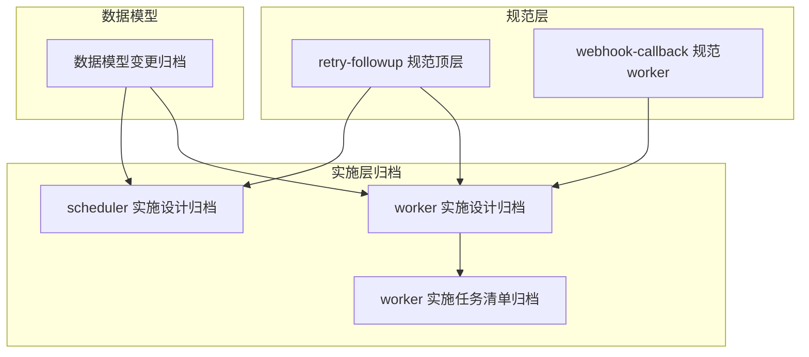
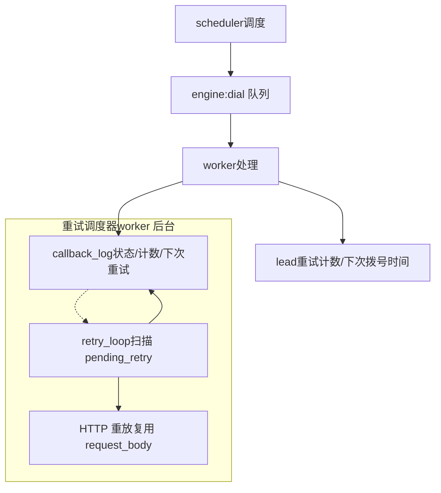
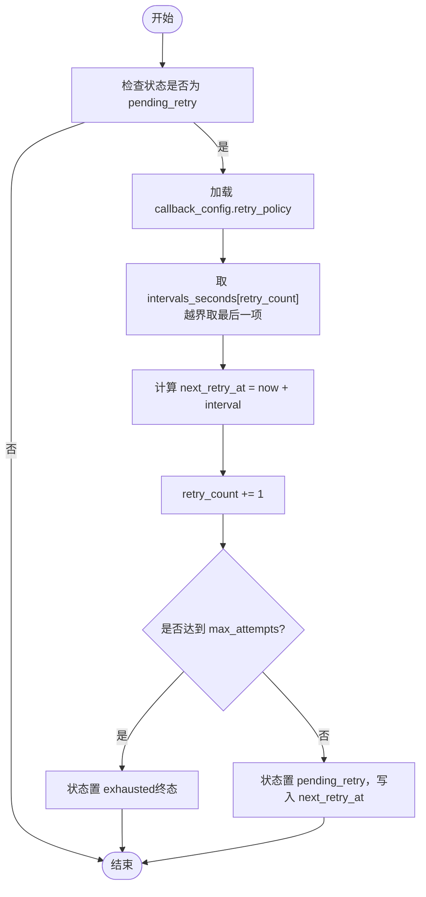
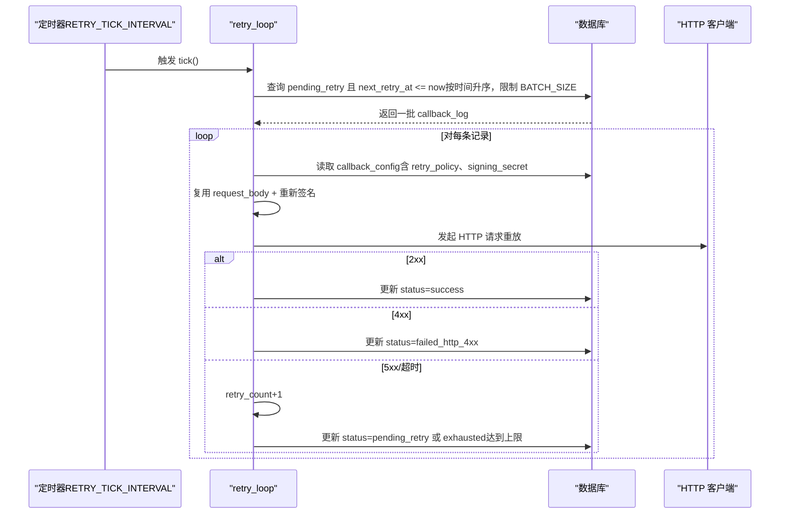
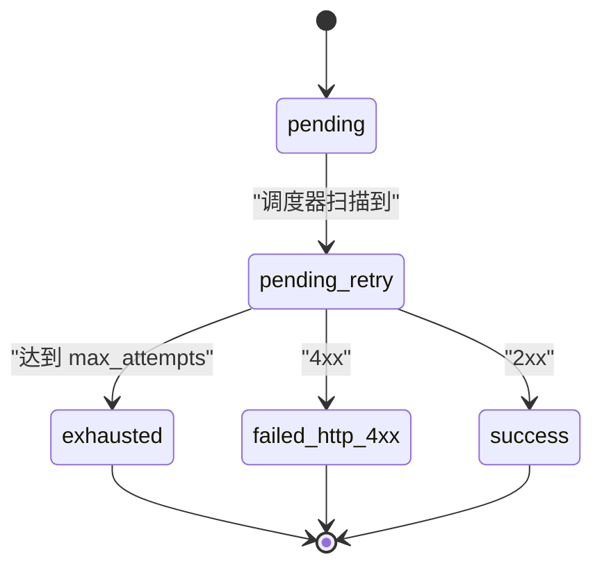

# 重试调度系统

<cite>
**本文引用的文件**
- [retry-followup 规范（顶层）](file://openspec/specs/retry-followup/spec.md)
- [回调重试规范（worker）](file://openspec/changes/archive/2026-05-06-impl-worker/specs/webhook-callback/spec.md)
- [worker 实施设计（归档）](file://openspec/changes/archive/2026-05-06-impl-worker/design.md)
- [worker 实施任务清单（归档）](file://openspec/changes/archive/2026-05-06-impl-worker/tasks.md)
- [scheduler 实施设计（归档）](file://openspec/changes/archive/2026-05-06-impl-scheduler/design.md)
- [数据模型变更（归档）](file://openspec/changes/archive/2026-05-01-clarify-stage2-boundaries/specs/data-model/spec.md)
- [监控告警示例（部署）](file://deploy/monitoring/alert_rules.yml.example)
- [运行手册（部署）](file://deploy/RUNBOOK.md)
</cite>

## 目录
1. [简介](#简介)
2. [项目结构](#项目结构)
3. [核心组件](#核心组件)
4. [架构总览](#架构总览)
5. [详细组件分析](#详细组件分析)
6. [依赖关系分析](#依赖关系分析)
7. [性能考量](#性能考量)
8. [故障排除指南](#故障排除指南)
9. [结论](#结论)
10. [附录](#附录)

## 简介
本文件面向“指数退避重试调度系统”，聚焦以下方面：
- 重试策略的数据结构（intervals_seconds、max_attempts）
- 指数退避算法的实现与边界处理
- 重试调度器工作机制（后台任务扫描、时间窗口检查、批量处理）
- 重试状态管理（pending_retry、exhausted、failed_* 等）
- 重试条件判断（5xx 错误触发重试，4xx 直接失败）
- 重试计数与状态转换
- 性能优化建议（批处理、索引、并发控制）
- 配置示例与故障排除

## 项目结构
本系统相关规范与实施记录主要分布在 openspec 的“retry-followup”与“webhook-callback”子规范，以及 worker/scheduler 的实施设计与任务清单中。数据模型层面，callback_log 与 lead 表承担了重试状态与计数的关键字段。



图表来源
- [retry-followup 规范（顶层）:1-176](file://openspec/specs/retry-followup/spec.md#L1-L176)
- [回调重试规范（worker）:1-36](file://openspec/changes/archive/2026-05-06-impl-worker/specs/webhook-callback/spec.md#L1-L36)
- [worker 实施设计（归档）:1-200](file://openspec/changes/archive/2026-05-06-impl-worker/design.md#L1-L200)
- [worker 实施任务清单（归档）:42-49](file://openspec/changes/archive/2026-05-06-impl-worker/tasks.md#L42-L49)
- [scheduler 实施设计（归档）:1-140](file://openspec/changes/archive/2026-05-06-impl-scheduler/design.md#L1-L140)
- [数据模型变更（归档）:20-27](file://openspec/changes/archive/2026-05-01-clarify-stage2-boundaries/specs/data-model/spec.md#L20-L27)

章节来源
- [retry-followup 规范（顶层）:1-176](file://openspec/specs/retry-followup/spec.md#L1-L176)
- [回调重试规范（worker）:1-36](file://openspec/changes/archive/2026-05-06-impl-worker/specs/webhook-callback/spec.md#L1-L36)
- [worker 实施设计（归档）:1-200](file://openspec/changes/archive/2026-05-06-impl-worker/design.md#L1-L200)
- [worker 实施任务清单（归档）:42-49](file://openspec/changes/archive/2026-05-06-impl-worker/tasks.md#L42-L49)
- [scheduler 实施设计（归档）:1-140](file://openspec/changes/archive/2026-05-06-impl-scheduler/design.md#L1-L140)
- [数据模型变更（归档）:20-27](file://openspec/changes/archive/2026-05-01-clarify-stage2-boundaries/specs/data-model/spec.md#L20-L27)

## 核心组件
- 重试策略数据结构
  - intervals_seconds：指数退避秒级间隔数组
  - max_attempts：最大重试次数
- 重试调度器（worker 后台任务）
  - 周期性扫描：按 next_retry_at 升序取一批 pending_retry
  - 重试执行：复用 request_body，重新签名后发起 HTTP
  - 状态更新：2xx→success；4xx→failed_http_4xx；5xx/超时→retry_count+1、计算下一次重试时间、达到上限→exhausted
- 状态管理
  - callback_log.status：pending、pending_retry、success、failed_http_4xx、failed_render、exhausted
  - lead 表：retry_count、next_call_at、last_hangup_cause 等
- 条件判断
  - 5xx/超时/网络错误：触发重试
  - 4xx/渲染失败：不重试，直接失败

章节来源
- [回调重试规范（worker）:3-36](file://openspec/changes/archive/2026-05-06-impl-worker/specs/webhook-callback/spec.md#L3-L36)
- [worker 实施设计（归档）:90-130](file://openspec/changes/archive/2026-05-06-impl-worker/design.md#L90-L130)
- [数据模型变更（归档）:20-27](file://openspec/changes/archive/2026-05-01-clarify-stage2-boundaries/specs/data-model/spec.md#L20-L27)

## 架构总览
系统分为两部分协同工作：
- scheduler：负责外呼调度，将 lead 状态推进至 calling，并将 DialRequest 写入 engine 队列
- worker：负责通话结束后状态回写与回调通知；其中回调通知采用“重试调度器”后台任务进行指数退避重试



图表来源
- [scheduler 实施设计（归档）:120-158](file://openspec/changes/archive/2026-05-06-impl-scheduler/design.md#L120-L158)
- [worker 实施设计（归档）:90-130](file://openspec/changes/archive/2026-05-06-impl-worker/design.md#L90-L130)
- [回调重试规范（worker）:3-36](file://openspec/changes/archive/2026-05-06-impl-worker/specs/webhook-callback/spec.md#L3-L36)

## 详细组件分析

### 重试策略与指数退避算法
- 数据结构
  - intervals_seconds：数组，第 N 次重试取 intervals_seconds[N-1]
  - max_attempts：达到后状态置 exhausted
- 算法实现要点
  - 超界处理：N 超出数组长度时，沿用最后一项
  - 时间计算：next_retry_at = now + intervals[retry_count]
  - 达到上限：status=exhausted（终态）



图表来源
- [回调重试规范（worker）:7-36](file://openspec/changes/archive/2026-05-06-impl-worker/specs/webhook-callback/spec.md#L7-L36)
- [worker 实施任务清单（归档）:42-49](file://openspec/changes/archive/2026-05-06-impl-worker/tasks.md#L42-L49)

章节来源
- [回调重试规范（worker）:3-36](file://openspec/changes/archive/2026-05-06-impl-worker/specs/webhook-callback/spec.md#L3-L36)
- [worker 实施任务清单（归档）:42-49](file://openspec/changes/archive/2026-05-06-impl-worker/tasks.md#L42-L49)

### 重试调度器工作机制
- 扫描策略
  - 每 tick 执行：SELECT ... WHERE status='pending_retry' AND next_retry_at <= now ORDER BY next_retry_at ASC LIMIT BATCH_SIZE
  - BATCH_SIZE 控制批处理规模，降低单次查询压力
- 重放执行
  - 复用已存 request_body，重新签名后发起 HTTP
  - 2xx→success；4xx→failed_http_4xx；5xx/超时→retry_count+1、计算下一次重试时间
- 并发与一致性
  - 主键更新 + 行级隔离保障 retry_loop 与 process_callbacks 并发不冲突



图表来源
- [worker 实施任务清单（归档）:42-49](file://openspec/changes/archive/2026-05-06-impl-worker/tasks.md#L42-L49)
- [worker 实施设计（归档）:90-130](file://openspec/changes/archive/2026-05-06-impl-worker/design.md#L90-L130)

章节来源
- [worker 实施任务清单（归档）:42-49](file://openspec/changes/archive/2026-05-06-impl-worker/tasks.md#L42-L49)
- [worker 实施设计（归档）:90-130](file://openspec/changes/archive/2026-05-06-impl-worker/design.md#L90-L130)

### 重试状态管理
- callback_log 状态流转
  - pending → pending_retry（等待重试调度器）
  - pending_retry → success（2xx）
  - pending_retry → failed_http_4xx（4xx）
  - pending_retry → exhausted（达到 max_attempts）
- lead 状态与重试
  - scheduler 将 lead 推进到 calling，不写终态或重试时间
  - worker 根据 hangup_cause 与目标达成情况决定 retrying/following_up/failed/do_not_call 等，并计算 next_call_at



图表来源
- [回调重试规范（worker）:17-36](file://openspec/changes/archive/2026-05-06-impl-worker/specs/webhook-callback/spec.md#L17-L36)
- [retry-followup 规范（顶层）:90-118](file://openspec/specs/retry-followup/spec.md#L90-L118)

章节来源
- [回调重试规范（worker）:17-36](file://openspec/changes/archive/2026-05-06-impl-worker/specs/webhook-callback/spec.md#L17-L36)
- [retry-followup 规范（顶层）:90-118](file://openspec/specs/retry-followup/spec.md#L90-L118)

### 重试条件判断与错误分类
- 5xx/超时/连接失败：触发重试，状态 pending_retry，retry_count+1
- 4xx：不重试，状态 failed_http_4xx
- 渲染失败：不重试，状态 failed_render
- 达到 max_attempts：状态 exhausted（终态）

章节来源
- [回调重试规范（worker）:17-36](file://openspec/changes/archive/2026-05-06-impl-worker/specs/webhook-callback/spec.md#L17-L36)
- [worker 实施设计（归档）:80-100](file://openspec/changes/archive/2026-05-06-impl-worker/design.md#L80-L100)

### 数据模型与字段语义
- callback_log
  - 关键字段：status、request_body、response_code、response_body、retry_count、attempt_at、next_retry_at、error_message
- lead
  - 关键字段：retry_count、next_call_at、last_hangup_cause、status

章节来源
- [数据模型变更（归档）:20-27](file://openspec/changes/archive/2026-05-01-clarify-stage2-boundaries/specs/data-model/spec.md#L20-L27)

## 依赖关系分析
- 重试调度器依赖
  - 数据库：扫描 callback_log、更新状态
  - HTTP 客户端：重放请求
  - 签名/加密：使用 signing_secret 重新签名 request_body
- 与调度器的协作
  - scheduler 负责将 lead 推进到 calling，不写终态或重试时间
  - worker 负责状态回写与回调通知（含重试调度器）

```mermaid
graph LR
DB["数据库"] <- --> RL["重试调度器"]
HTTP["HTTP 客户端"] <- --> RL
CC["callback_config.signing_secret"] <- --> RL
S["scheduler"] --> W["worker"]
W --> RL
```

图表来源
- [worker 实施设计（归档）:90-130](file://openspec/changes/archive/2026-05-06-impl-worker/design.md#L90-L130)
- [scheduler 实施设计（归档）:120-158](file://openspec/changes/archive/2026-05-06-impl-scheduler/design.md#L120-L158)

章节来源
- [worker 实施设计（归档）:90-130](file://openspec/changes/archive/2026-05-06-impl-worker/design.md#L90-L130)
- [scheduler 实施设计（归档）:120-158](file://openspec/changes/archive/2026-05-06-impl-scheduler/design.md#L120-L158)

## 性能考量
- 批量处理
  - 使用 LIMIT BATCH_SIZE 控制每 tick 处理数量，避免瞬时高峰
- 索引与扫描
  - 建议在 callback_log 上建立复合索引：(status, next_retry_at, id)，以加速扫描与排序
- 并发与隔离
  - 主键更新 + 行级锁确保 retry_loop 与 process_callbacks 并发安全
- 超界处理
  - 通过“沿用最后一项”避免越界访问，减少分支判断开销
- 配置项
  - RETRY_TICK_INTERVAL（秒级）与 BATCH_SIZE（整型）建议通过环境变量配置，便于运维调优

[本节为通用性能建议，不直接分析具体文件]

## 故障排除指南
- 常见问题定位
  - callback_log 状态长期停留在 pending：检查重试调度器是否运行、tick 间隔与批大小设置
  - 4xx 失败不断重试：确认业务期望（4xx 应直接失败，不应进入 pending_retry）
  - 达到 max_attempts 仍未停止：核对 intervals_seconds 与 max_attempts 配置
- 监控与告警
  - 使用部署示例中的告警规则监控 callback_log 的响应码分布
  - 运行手册中提供了基于 callback_log 的巡检思路
- 日志与审计
  - failed_http_4xx 与 failed_render 状态可用于快速定位失败原因
  - exhausted 状态表示重试上限已达，需检查策略配置

章节来源
- [监控告警示例（部署）:57-57](file://deploy/monitoring/alert_rules.yml.example#L57-L57)
- [运行手册（部署）:211-211](file://deploy/RUNBOOK.md#L211-L211)

## 结论
本系统通过“指数退避 + 最大次数”的重试策略与独立的重试调度器，实现了高可靠、可观察的回调通知重试机制。其关键优势包括：
- 明确的错误分类与状态流转
- 复用原始 request_body，避免触发上下文漂移
- 批量扫描与行级隔离，兼顾吞吐与一致性
- 通过配置项灵活调优，满足不同业务场景

[本节为总结性内容，不直接分析具体文件]

## 附录

### 配置示例
- 重试策略（回调）
  - intervals_seconds：例如 [60, 300, 1800]（秒）
  - max_attempts：例如 3
- 调度器参数（建议）
  - RETRY_TICK_INTERVAL：例如 15～60 秒（按业务峰值与批大小权衡）
  - BATCH_SIZE：例如 100～1000（按数据库负载与网络并发能力设定）

章节来源
- [回调重试规范（worker）:7-16](file://openspec/changes/archive/2026-05-06-impl-worker/specs/webhook-callback/spec.md#L7-L16)
- [worker 实施任务清单（归档）:42-49](file://openspec/changes/archive/2026-05-06-impl-worker/tasks.md#L42-L49)