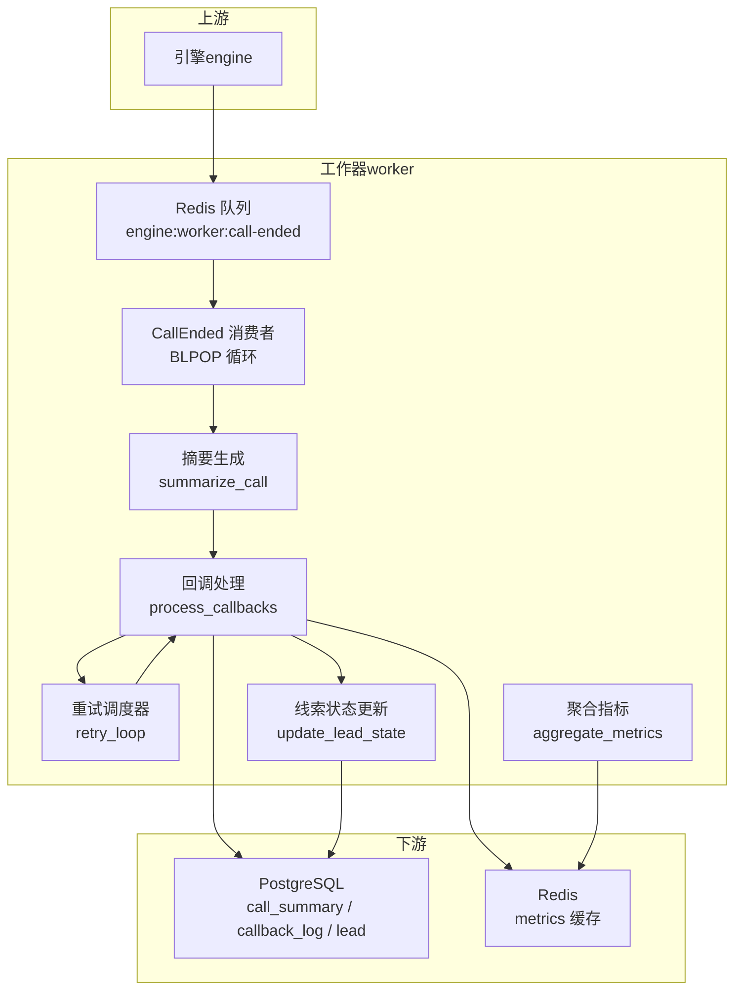
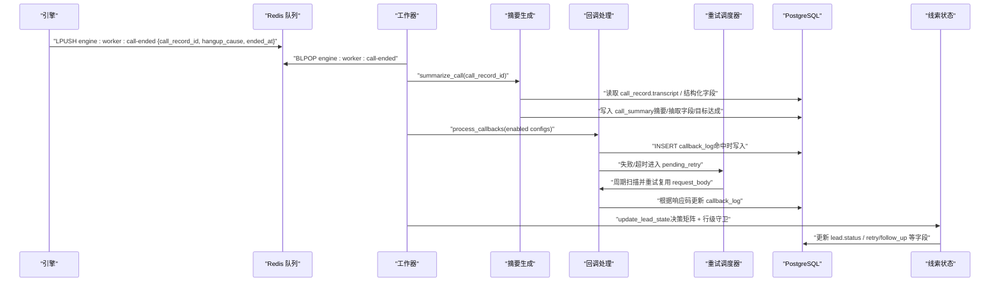
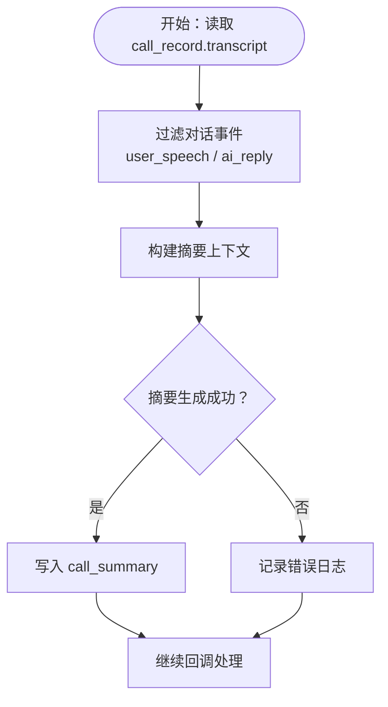
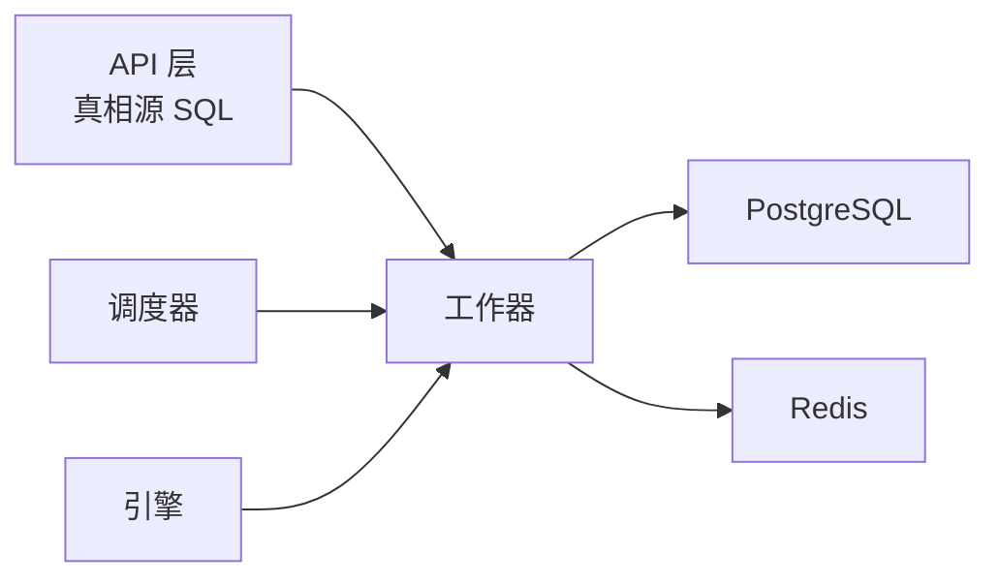

# 数据聚合处理

<cite>
**本文引用的文件**
- [README.md](file://README.md)
- [设计说明（工作器）](file://openspec/changes/archive/2026-05-06-impl-worker/design.md)
- [变更说明（工作器）](file://openspec/changes/archive/2026-05-06-impl-worker/proposal.md)
- [任务清单（工作器）](file://openspec/changes/archive/2026-05-06-impl-worker/tasks.md)
- [工作器环境变量示例](file://deploy/env/worker.env.example)
- [工作器云边拓扑环境变量](file://deploy/cloud/env/worker.env)
- [工作器 systemd 服务](file://deploy/cloud/systemd/isales-worker.service)
- [环境变量一致性检查脚本](file://deploy/linux/scripts/check_env_consistency.py)
- [工作器脚本：测试全仓](file://scripts/test_all.sh)
- [通话转写规范](file://openspec/specs/transcript/spec.md)
</cite>

## 目录
1. [简介](#简介)
2. [项目结构](#项目结构)
3. [核心组件](#核心组件)
4. [架构总览](#架构总览)
5. [详细组件分析](#详细组件分析)
6. [依赖分析](#依赖分析)
7. [性能考虑](#性能考虑)
8. [故障排查指南](#故障排查指南)
9. [结论](#结论)
10. [附录](#附录)

## 简介
本文面向 isales-worker 的“通话结束后数据聚合处理”能力，系统化阐述从通话结束事件消费、转写文本处理、摘要生成、客户数据提取与标准化、统计指标聚合，到数据清洗与验证、多源融合策略、质量控制机制与存储查询优化的全流程。文档基于工作器的 OpenSpec 设计与实施说明，结合环境配置与服务部署，给出可操作的实践建议与可视化图示。

## 项目结构
- 工作器为独立仓库，采用 Python 3.11+、全异步（asyncio）实现，使用 Redis 队列与 PostgreSQL 数据库存储。
- 关键运行要素：
  - 队列通道：engine → worker 使用单向队列“engine:worker:call-ended”，用于承载 CallEnded 消息。
  - 数据存储：PostgreSQL 存储通话记录、摘要、回调日志与线索状态；Redis 用于轻量指标缓存与回调重试调度。
  - 配置来源：通过 systemd 服务加载统一的环境变量文件，确保跨服务密钥一致（如 Fernet 密钥）。

图表来源
- [设计说明（工作器）](file://openspec/changes/archive/2026-05-06-impl-worker/design.md)
- [工作器环境变量示例](file://deploy/env/worker.env.example)
- [工作器云边拓扑环境变量](file://deploy/cloud/env/worker.env)

章节来源
- [README.md](file://README.md)
- [工作器 systemd 服务](file://deploy/cloud/systemd/isales-worker.service)
- [环境变量一致性检查脚本](file://deploy/linux/scripts/check_env_consistency.py)

## 核心组件
- CallEnded 消费与串行处理
  - 使用阻塞列表弹出（BLPOP）消费“engine:worker:call-ended”队列，单条消息内顺序执行：摘要生成 → 回调处理 → 线索状态更新。
  - 若某步骤失败，记录错误日志并继续后续步骤，避免整条消息被无限重试。
- 摘要生成（summarize_call）
  - 读取通话记录与转写（JSONB），按活动配置抽取字段，生成摘要文本；v1 使用 mock LLM provider，后续可接入真实提供商。
  - 将摘要与结构化字段写入 call_summary，并保证唯一性（按 call_record_id 防重）。
- 回调处理（process_callbacks）
  - 评估触发条件（JsonLogic），命中则渲染负载（Jinja2 SandboxedEnvironment），签名（HMAC-SHA256），发起 HTTP 请求。
  - 依据响应码与网络状况分类写入回调日志（success / failed_render / failed_http_4xx / failed_http_5xx / pending_retry），并进入重试调度器。
- 回调重试调度器（retry_loop）
  - 独立后台任务，周期性扫描待重试记录，复用原始请求体进行重试，遵循指数退避策略，达到最大次数后标记 exhausted。
- 线索状态更新（update_lead_state）
  - 基于挂断原因、目标达成状态、跟进次数等，按决策矩阵更新线索状态；使用行级守卫（WHERE status='calling'）避免与调度器竞态。
- 聚合指标（aggregate_metrics）
  - 定时任务（每 60 秒）计算接通率、目标达成率、平均通话时长等，写入 Redis Hash 以支撑前端实时大盘。

章节来源
- [设计说明（工作器）](file://openspec/changes/archive/2026-05-06-impl-worker/design.md)
- [变更说明（工作器）](file://openspec/changes/archive/2026-05-06-impl-worker/proposal.md)
- [任务清单（工作器）](file://openspec/changes/archive/2026-05-06-impl-worker/tasks.md)

## 架构总览
工作器在“通话结束”这一时点，串联起多源数据的采集、清洗、融合与落库，形成闭环的异步后处理流水线。其关键特征：
- 顺序严格：摘要 → 回调 → 状态更新，确保业务语义一致。
- 最终一致：回调与状态更新解耦，回调失败不影响状态写入。
- 轻量化聚合：Redis 缓存指标，SQL 查询仍由 API 层承担真相源。

图表来源
- [设计说明（工作器）](file://openspec/changes/archive/2026-05-06-impl-worker/design.md)
- [变更说明（工作器）](file://openspec/changes/archive/2026-05-06-impl-worker/proposal.md)

## 详细组件分析

### 通话转写文本处理
- 数据来源与结构
  - 转写事件以 JSONB 数组形式存储在通话记录中，包含开场白、用户语音、AI 回复、静默激活、垫词、转人工、收尾等事件类型。
  - 事件统一字段包含类型与时间戳，便于前端播放器精确定位录音时刻。
- 处理要点
  - 仅将对话类事件（用户语音、AI 回复）纳入摘要生成的上下文；系统话术（静默激活、垫词、转人工衔接等）不参与对话历史拼接。
  - v1 摘要生成通过拼接用户与 AI 语音文本生成简单摘要；真实 LLM provider 作为预留扩展点。
- 数据质量控制
  - 缺失字段时，摘要生成失败不阻塞后续流程，仅记录错误日志并继续状态更新与回调。

图表来源
- [通话转写规范](file://openspec/specs/transcript/spec.md)
- [设计说明（工作器）](file://openspec/changes/archive/2026-05-06-impl-worker/design.md)

章节来源
- [通话转写规范](file://openspec/specs/transcript/spec.md)
- [设计说明（工作器）](file://openspec/changes/archive/2026-05-06-impl-worker/design.md)

### 通话摘要生成
- 输入：call_record_id
- 处理：读取转写与结构化字段，按活动配置抽取字段，生成摘要文本
- 输出：写入 call_summary（唯一性约束按 call_record_id）
- v1 行为：mock provider 直接拼接文本；后续可接入真实提供商

章节来源
- [变更说明（工作器）](file://openspec/changes/archive/2026-05-06-impl-worker/proposal.md)
- [设计说明（工作器）](file://openspec/changes/archive/2026-05-06-impl-worker/design.md)

### 客户数据提取与标准化
- 结构化字段来源：engine 已在转写末轮写入目标达成、目标类型与抽取字段。
- 提取策略：按活动配置的抽取字段清单，从转写末轮结构化字段中提取并标准化。
- 标准化原则：保持字段命名与类型一致，缺失值按空值处理，避免脏数据污染下游。

章节来源
- [变更说明（工作器）](file://openspec/changes/archive/2026-05-06-impl-worker/proposal.md)
- [设计说明（工作器）](file://openspec/changes/archive/2026-05-06-impl-worker/design.md)

### 统计指标计算与聚合
- 聚合维度：按活动（campaign）与近 7 天窗口
- 指标项：接通率、目标达成率、平均通话时长
- 实现方式：定时任务每 60 秒计算一次，写入 Redis Hash，键含 campaign_id 与指标值，支撑前端实时大盘；真相源仍由 API 层 SQL 直查。

章节来源
- [设计说明（工作器）](file://openspec/changes/archive/2026-05-06-impl-worker/design.md)
- [工作器环境变量示例](file://deploy/env/worker.env.example)

### 数据清洗与验证
- 转写清洗
  - 仅保留对话事件，剔除系统话术，避免噪声干扰摘要与分析。
- 回调模板验证
  - 使用沙箱环境渲染负载，未命中时不写日志，命中才写入 pending，减少日志膨胀。
- 签名与解密
  - 签名内容与时间戳格式固定；签名密钥在评估时解密，避免明文长期驻留内存。
- 重试策略
  - 复用原始请求体，避免因状态漂移导致的语义不一致；指数退避与最大次数限制保障稳定性。

章节来源
- [设计说明（工作器）](file://openspec/changes/archive/2026-05-06-impl-worker/design.md)
- [变更说明（工作器）](file://openspec/changes/archive/2026-05-06-impl-worker/proposal.md)

### 多源数据融合策略
- 融合点：摘要生成与回调触发评估
  - 摘要：以转写文本为主，结合活动抽取字段清单，形成统一摘要。
  - 回调：以转写末轮结构化字段为触发上下文，结合活动配置的 JsonLogic 规则与 Jinja2 模板。
- 质量控制：失败步骤不阻塞后续流程，确保状态更新与回调的最终一致性。

章节来源
- [设计说明（工作器）](file://openspec/changes/archive/2026-05-06-impl-worker/design.md)
- [变更说明（工作器）](file://openspec/changes/archive/2026-05-06-impl-worker/proposal.md)

### 数据质量控制机制
- 行级守卫：更新线索状态时使用 WHERE 条件，避免与调度器竞态。
- 错误分类：回调失败按 4xx/5xx/超时分类，分别进入不同日志状态与重试策略。
- 日志与可观测性：关键步骤均有日志记录，便于巡检与问题定位。

章节来源
- [设计说明（工作器）](file://openspec/changes/archive/2026-05-06-impl-worker/design.md)

### 聚合结果的存储与查询优化
- Redis 缓存：按活动与时间窗口写入 Hash，前端可直读，降低查询延迟。
- SQL 真相源：API 层仍负责复杂分析查询，worker 仅提供轻量缓存与定时聚合。
- 批量与并发：回调处理支持并发（消息内），提高吞吐；重试扫描批量处理，减少频繁 IO。

章节来源
- [设计说明（工作器）](file://openspec/changes/archive/2026-05-06-impl-worker/design.md)
- [工作器环境变量示例](file://deploy/env/worker.env.example)

## 依赖分析
- 服务间依赖
  - 工作器依赖引擎产出的通话记录与转写；依赖调度器在通话前将线索状态置为“calling”，工作器仅在该状态下更新。
  - 工作器依赖 API 层的真相源 SQL 查询，worker 仅提供 Redis 缓存。
- 配置与密钥
  - 数据库与 Redis 连接字符串需与其它服务一致；Fernet 密钥需跨服务共享，确保回调签名密钥解密一致。
- 运维与部署
  - systemd 服务加载统一环境文件，确保进程安全与资源隔离。

图表来源
- [工作器 systemd 服务](file://deploy/cloud/systemd/isales-worker.service)
- [工作器云边拓扑环境变量](file://deploy/cloud/env/worker.env)
- [环境变量一致性检查脚本](file://deploy/linux/scripts/check_env_consistency.py)

章节来源
- [工作器 systemd 服务](file://deploy/cloud/systemd/isales-worker.service)
- [工作器云边拓扑环境变量](file://deploy/cloud/env/worker.env)
- [环境变量一致性检查脚本](file://deploy/linux/scripts/check_env_consistency.py)

## 性能考虑
- 并发与批处理
  - 回调处理在消息内并发执行，提高吞吐；重试扫描设置批量大小，减少数据库压力。
- 资源隔离与安全
  - systemd 服务启用多项安全限制，避免权限扩大与资源滥用。
- 缓存与直查
  - Redis 缓存用于实时大盘，SQL 查询作为真相源，避免重复聚合带来的冗余计算。

章节来源
- [工作器环境变量示例](file://deploy/env/worker.env.example)
- [工作器 systemd 服务](file://deploy/cloud/systemd/isales-worker.service)

## 故障排查指南
- 回调失败排查
  - 查看回调日志状态（failed_render / failed_http_4xx / failed_http_5xx / pending_retry / exhausted），定位失败原因与重试进度。
  - 检查签名密钥解密是否成功（Fernet 密钥需与 API 层一致）。
- 线索状态异常
  - 若状态未更新，检查是否处于“calling”状态；若更新失败（0 行受影响），属预期（竞态或非本 worker 的线索）。
- 摘要生成异常
  - 摘要失败不会阻塞后续流程，但需关注日志；检查转写完整性与抽取字段配置。
- 环境变量一致性
  - 使用环境变量一致性检查脚本核对模板与 README 的变量声明，确保跨服务变量一致。

章节来源
- [设计说明（工作器）](file://openspec/changes/archive/2026-05-06-impl-worker/design.md)
- [环境变量一致性检查脚本](file://deploy/linux/scripts/check_env_consistency.py)

## 结论
isales-worker 在“通话结束”时点，通过严格的顺序处理与最终一致性的设计，实现了从转写到摘要、从结构化字段到回调与状态更新的完整闭环。配合 Redis 轻量缓存与 API 层真相源查询，既满足实时大盘需求，又保持了系统的可维护性与安全性。建议在后续版本中持续完善回调模板生态、增强异常治理与监控告警，并按需扩展多实例与分片能力。

## 附录
- 验收与测试
  - 使用模拟注入脚本触发完整链路，验证摘要、回调日志与线索状态写入。
  - 全仓测试脚本可一键运行各子仓测试，确保整体健康度。

章节来源
- [工作器脚本：测试全仓](file://scripts/test_all.sh)
- [设计说明（工作器）](file://openspec/changes/archive/2026-05-06-impl-worker/design.md)