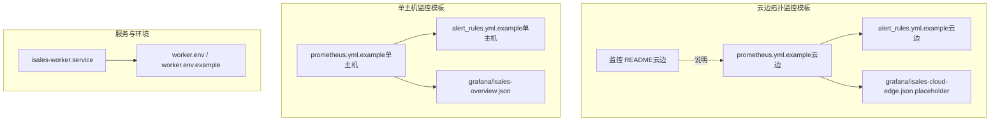
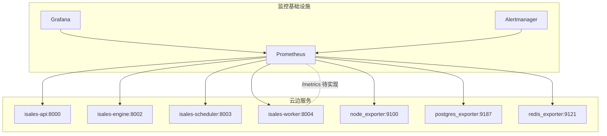
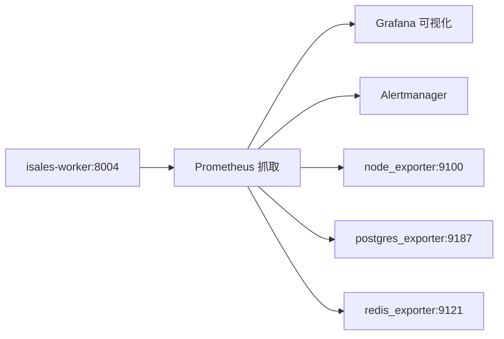

# 监控告警系统

<cite>
**本文引用的文件**
- [worker.env](file://deploy/cloud/env/worker.env)
- [worker.env.example](file://deploy/cloud/env/worker.env.example)
- [isales-worker.service](file://deploy/cloud/systemd/isales-worker.service)
- [prometheus.yml.example（云边拓扑）](file://deploy/cloud/monitoring/prometheus.yml.example)
- [alert_rules.yml.example（云边拓扑）](file://deploy/cloud/monitoring/alert_rules.yml.example)
- [监控 README（云边拓扑）](file://deploy/cloud/monitoring/README.md)
- [grafana 仪表盘占位（云边拓扑）](file://deploy/cloud/monitoring/grafana/isales-cloud-edge.json.placeholder)
- [prometheus.yml.example（单主机）](file://deploy/monitoring/prometheus.yml.example)
- [alert_rules.yml.example（单主机）](file://deploy/monitoring/alert_rules.yml.example)
- [grafana 概览仪表盘](file://deploy/monitoring/grafana/isales-overview.json)
- [install.sh（云边拓扑安装脚本）](file://deploy/cloud/scripts/install.sh)
</cite>

## 目录
1. [简介](#简介)
2. [项目结构](#项目结构)
3. [核心组件](#核心组件)
4. [架构总览](#架构总览)
5. [详细组件分析](#详细组件分析)
6. [依赖关系分析](#依赖关系分析)
7. [性能考量](#性能考量)
8. [故障排查指南](#故障排查指南)
9. [结论](#结论)
10. [附录](#附录)

## 简介
本文件面向 isales-worker 监控告警系统，围绕“性能监控指标设计、采集与上报机制、告警规则与触发条件、异常检测与故障诊断流程、监控仪表板与可视化”等方面，结合仓库中的监控模板与 systemd 配置，给出可操作的实施建议与最佳实践。当前仓库中，Worker 的 /metrics 指标端点尚未实现，但已通过 Prometheus 抓取配置与告警规则预留了关键指标命名与观测维度，便于后续落地。

## 项目结构
与监控告警直接相关的关键位置如下：
- 环境变量与服务单元
  - worker 环境变量文件：用于定义数据库、缓存、加密密钥等运行参数
  - systemd 单元文件：定义 worker 服务的启动、重启策略与环境注入
- 监控模板
  - Prometheus 抓取配置（云边拓扑与单主机两套）
  - 告警规则（云边拓扑与单主机两套）
  - Grafana 仪表盘模板（云边拓扑占位与单主机概览）

图表来源
- [prometheus.yml.example（云边拓扑）:1-77](file://deploy/cloud/monitoring/prometheus.yml.example#L1-L77)
- [alert_rules.yml.example（云边拓扑）:1-116](file://deploy/cloud/monitoring/alert_rules.yml.example#L1-L116)
- [grafana 仪表盘占位（云边拓扑）:1-34](file://deploy/cloud/monitoring/grafana/isales-cloud-edge.json.placeholder#L1-L34)
- [监控 README（云边拓扑）:1-37](file://deploy/cloud/monitoring/README.md#L1-L37)
- [prometheus.yml.example（单主机）:1-63](file://deploy/monitoring/prometheus.yml.example#L1-L63)
- [alert_rules.yml.example（单主机）:1-77](file://deploy/monitoring/alert_rules.yml.example#L1-L77)
- [grafana 概览仪表盘:1-87](file://deploy/monitoring/grafana/isales-overview.json#L1-L87)
- [isales-worker.service:1-31](file://deploy/cloud/systemd/isales-worker.service#L1-L31)
- [worker.env:1-17](file://deploy/cloud/env/worker.env#L1-L17)
- [worker.env.example:1-28](file://deploy/cloud/env/worker.env.example#L1-L28)

章节来源
- [prometheus.yml.example（云边拓扑）:1-77](file://deploy/cloud/monitoring/prometheus.yml.example#L1-L77)
- [alert_rules.yml.example（云边拓扑）:1-116](file://deploy/cloud/monitoring/alert_rules.yml.example#L1-L116)
- [监控 README（云边拓扑）:1-37](file://deploy/cloud/monitoring/README.md#L1-L37)
- [prometheus.yml.example（单主机）:1-63](file://deploy/monitoring/prometheus.yml.example#L1-L63)
- [alert_rules.yml.example（单主机）:1-77](file://deploy/monitoring/alert_rules.yml.example#L1-L77)
- [grafana 概览仪表盘:1-87](file://deploy/monitoring/grafana/isales-overview.json#L1-L87)
- [isales-worker.service:1-31](file://deploy/cloud/systemd/isales-worker.service#L1-L31)
- [worker.env:1-17](file://deploy/cloud/env/worker.env#L1-L17)
- [worker.env.example:1-28](file://deploy/cloud/env/worker.env.example#L1-L28)

## 核心组件
- Worker 服务单元与环境注入
  - systemd 单元通过 EnvironmentFile 注入 /etc/isales/env/worker.env，确保数据库、缓存与加密密钥等参数生效
  - 服务具备 on-failure 自动重启策略，提升可用性
- 监控抓取与告警
  - Prometheus 抓取配置预留了 isales-worker 的 /metrics 端口（127.0.0.1:8004），并标注“待实现”
  - 告警规则针对云边拓扑定义了边缘离线、硬件告警等关键观测项
- 可视化
  - 云边拓扑提供 Grafana 仪表盘占位清单，建议在实际实现指标后导出真实 JSON
  - 单主机模板提供概览仪表盘，包含活跃通话、拨号队列深度、连接率、错误日志等

章节来源
- [isales-worker.service:1-31](file://deploy/cloud/systemd/isales-worker.service#L1-L31)
- [worker.env:1-17](file://deploy/cloud/env/worker.env#L1-L17)
- [worker.env.example:1-28](file://deploy/cloud/env/worker.env.example#L1-L28)
- [prometheus.yml.example（云边拓扑）:45-52](file://deploy/cloud/monitoring/prometheus.yml.example#L45-L52)
- [alert_rules.yml.example（云边拓扑）:1-116](file://deploy/cloud/monitoring/alert_rules.yml.example#L1-L116)
- [grafana 仪表盘占位（云边拓扑）:1-34](file://deploy/cloud/monitoring/grafana/isales-cloud-edge.json.placeholder#L1-L34)
- [prometheus.yml.example（单主机）:36-40](file://deploy/monitoring/prometheus.yml.example#L36-L40)
- [grafana 概览仪表盘:1-87](file://deploy/monitoring/grafana/isales-overview.json#L1-L87)

## 架构总览
下图展示了监控体系在云边拓扑下的整体交互：Prometheus 抓取各服务的 /metrics（含 Worker），Grafana 展示仪表盘，Alertmanager 基于规则触发告警。

图表来源
- [prometheus.yml.example（云边拓扑）:17-77](file://deploy/cloud/monitoring/prometheus.yml.example#L17-L77)
- [监控 README（云边拓扑）:1-37](file://deploy/cloud/monitoring/README.md#L1-L37)

章节来源
- [prometheus.yml.example（云边拓扑）:1-77](file://deploy/cloud/monitoring/prometheus.yml.example#L1-L77)
- [监控 README（云边拓扑）:1-37](file://deploy/cloud/monitoring/README.md#L1-L37)

## 详细组件分析

### 指标设计与观测维度
- 边缘设备健康
  - 设备离线计数：isales_edge_offline_total{device_id}
  - 硬件告警计数：isales_hardware_alert_total{kind}
  - 以上两项来自云边拓扑监控 README 与 Prometheus 模板注释，用于 Worker watchdog 与硬件事件观测
- 引擎侧云边流健康（参考项）
  - 流数量、心跳时间、断线次数、音频推送缓冲区满次数、引擎流水线首字节延迟直方图等
  - 用于跨服务联动观测，辅助定位网络、编码、上游服务瓶颈
- 单主机历史指标（参考项）
  - 活跃通话、拨号队列深度、连接率、回调失败率、PG 连接占比等
  - 便于对比与迁移

章节来源
- [监控 README（云边拓扑）:21-23](file://deploy/cloud/monitoring/README.md#L21-L23)
- [prometheus.yml.example（云边拓扑）:49-52](file://deploy/cloud/monitoring/prometheus.yml.example#L49-L52)
- [prometheus.yml.example（单主机）:18-46](file://deploy/monitoring/prometheus.yml.example#L18-L46)
- [alert_rules.yml.example（单主机）:12-77](file://deploy/monitoring/alert_rules.yml.example#L12-L77)

### 数据采集与上报机制
- 抓取配置
  - Prometheus 抓取 isales-worker 的 /metrics 端口（127.0.0.1:8004），当前模板标注“待实现”
  - 其他组件如 node_exporter、postgres_exporter、redis_exporter 也按模板配置
- 上报路径
  - 当前仓库未包含 Worker 的 /metrics 实现源码；建议在 isales-worker 服务中添加 /metrics 端点，暴露上述关键指标
- 环境注入
  - systemd 单元通过 EnvironmentFile=/etc/isales/env/worker.env 注入运行参数，确保服务正确连接数据库与缓存

章节来源
- [prometheus.yml.example（云边拓扑）:45-52](file://deploy/cloud/monitoring/prometheus.yml.example#L45-L52)
- [isales-worker.service:15-15](file://deploy/cloud/systemd/isales-worker.service#L15-L15)
- [worker.env:7-17](file://deploy/cloud/env/worker.env#L7-L17)
- [worker.env.example:6-25](file://deploy/cloud/env/worker.env.example#L6-L25)

### 告警规则与触发条件
- 云边拓扑规则（示例）
  - 边缘设备离线：基于 isales_cloud_edge_heartbeat_seconds_since_last > 120 触发
  - 频繁重连：基于 isales_cloud_edge_stream_disconnected_total 的窗口增量
  - ARTC 推送缓冲区满：基于 isales_artc_push_audio_buffer_full_total 的短窗增量
  - 引擎流水线首字节延迟预算：基于直方图分位数计算
  - 回调失败率：基于回调尝试与失败总量比值
  - PG 连接高占用：基于连接数与最大连接上限比值
- 单主机规则（示例）
  - 拨号队列堆积、设备标记比例骤升、回调失败率、PG 连接高占用等

章节来源
- [alert_rules.yml.example（云边拓扑）:14-115](file://deploy/cloud/monitoring/alert_rules.yml.example#L14-L115)
- [alert_rules.yml.example（单主机）:12-77](file://deploy/monitoring/alert_rules.yml.example#L12-L77)

### 异常检测与故障诊断流程
- 离线与断线
  - 若出现设备长时间无心跳，优先检查边缘链路稳定性、Worker watchdog 是否正常、引擎侧流状态
- 推送缓冲区满
  - 检查上游 TTS 提供商速率、网络拥塞、编码器负载，必要时降低并发或优化路径
- 延迟预算超限
  - 按阶段（角色、法官、润色）分析直方图，定位瓶颈环节，考虑降级策略（如减少多角色并发）
- 回调失败
  - 核验签名密钥一致性、外部回调端点可用性、Worker 回调日志与响应码分布
- 数据库连接压力
  - 检查连接池配置、应用连接泄漏、事务持有时间

章节来源
- [监控 README（云边拓扑）:14-24](file://deploy/cloud/monitoring/README.md#L14-L24)
- [alert_rules.yml.example（云边拓扑）:14-115](file://deploy/cloud/monitoring/alert_rules.yml.example#L14-L115)

### 监控仪表板与可视化
- 云边拓扑
  - 提供面板清单占位：边缘设备在线数、心跳时延、断线率、活动会话、缓冲区满速率、首字节延迟分位、PG/Redis/CPU/内存/网络等
  - 建议在实现 /metrics 后，在 Grafana 中构建真实面板并导出 JSON 替换占位文件
- 单主机
  - 提供概览面板：活跃通话、拨号队列深度、连接率、服务错误日志等

章节来源
- [grafana 仪表盘占位（云边拓扑）:1-34](file://deploy/cloud/monitoring/grafana/isales-cloud-edge.json.placeholder#L1-L34)
- [grafana 概览仪表盘:12-84](file://deploy/monitoring/grafana/isales-overview.json#L12-L84)

### 部署与运维要点
- systemd 服务单元
  - 使用 EnvironmentFile 注入环境变量，具备 on-failure 自动重启
- 安装脚本
  - install.sh 负责写入 systemd 环境 drop-in、同步 unit、安装 nginx、准备 venv 等
  - 通过 --activate 切换版本并按顺序重启服务

章节来源
- [isales-worker.service:1-31](file://deploy/cloud/systemd/isales-worker.service#L1-L31)
- [install.sh（云边拓扑安装脚本）:203-297](file://deploy/cloud/scripts/install.sh#L203-L297)

## 依赖关系分析
- 组件耦合
  - Prometheus 抓取配置与服务端口耦合（127.0.0.1:8004）
  - 告警规则依赖指标命名与数据类型（计数器、直方图、瞬时值）
  - Grafana 仪表盘依赖 Prometheus 查询表达式
- 外部依赖
  - node_exporter、postgres_exporter、redis_exporter 提供系统与中间件指标
  - Alertmanager 与通知渠道集成（如钉钉/飞书）

图表来源
- [prometheus.yml.example（云边拓扑）:45-77](file://deploy/cloud/monitoring/prometheus.yml.example#L45-L77)

章节来源
- [prometheus.yml.example（云边拓扑）:1-77](file://deploy/cloud/monitoring/prometheus.yml.example#L1-L77)

## 性能考量
- 指标粒度与开销
  - 采用直方图与计数器组合记录延迟与错误，避免过度采样导致的额外开销
- 采样与窗口
  - 告警规则使用短期窗口（如 30s/5m/15m）快速发现异常，同时设置持续时间（for）避免抖动误报
- 资源隔离
  - systemd 限制地址族、命名空间、权限等，降低服务间影响

章节来源
- [alert_rules.yml.example（云边拓扑）:14-115](file://deploy/cloud/monitoring/alert_rules.yml.example#L14-L115)
- [isales-worker.service:17-27](file://deploy/cloud/systemd/isales-worker.service#L17-L27)

## 故障排查指南
- 无 /metrics 指标
  - 确认 isales-worker 已实现 /metrics 并监听 127.0.0.1:8004
  - 检查 Prometheus 抓取日志与目标状态
- 回调失败率升高
  - 核验 Fernet 密钥一致性、回调签名逻辑、外部回调端点可用性
  - 查看 Worker 回调日志与响应码分布
- 边缘设备频繁离线/断线
  - 检查网络稳定性、Worker watchdog 阈值与引擎侧流状态
- 推送缓冲区满
  - 评估上游 TTS 速率与网络带宽，必要时降低并发或优化路径
- 数据库连接压力
  - 检查连接池大小、应用连接泄漏、事务持有时间

章节来源
- [prometheus.yml.example（云边拓扑）:45-52](file://deploy/cloud/monitoring/prometheus.yml.example#L45-L52)
- [alert_rules.yml.example（云边拓扑）:14-115](file://deploy/cloud/monitoring/alert_rules.yml.example#L14-L115)
- [监控 README（云边拓扑）:14-24](file://deploy/cloud/monitoring/README.md#L14-L24)

## 结论
本仓库提供了完善的监控模板与运维基线：明确的指标命名、抓取配置、告警规则与可视化清单。当前 Worker 的 /metrics 尚未实现，建议尽快补齐指标端点，并将云边拓扑的面板占位替换为真实 JSON。通过合理的指标设计与告警策略，可有效支撑 isales-worker 的稳定运行与快速故障定位。

## 附录

### 监控配置示例（路径指引）
- Prometheus 抓取配置（云边拓扑）
  - [prometheus.yml.example（云边拓扑）:1-77](file://deploy/cloud/monitoring/prometheus.yml.example#L1-L77)
- 告警规则（云边拓扑）
  - [alert_rules.yml.example（云边拓扑）:1-116](file://deploy/cloud/monitoring/alert_rules.yml.example#L1-L116)
- Grafana 仪表盘（云边拓扑）
  - [grafana 仪表盘占位（云边拓扑）:1-34](file://deploy/cloud/monitoring/grafana/isales-cloud-edge.json.placeholder#L1-L34)
- Prometheus 抓取配置（单主机）
  - [prometheus.yml.example（单主机）:1-63](file://deploy/monitoring/prometheus.yml.example#L1-L63)
- 告警规则（单主机）
  - [alert_rules.yml.example（单主机）:1-77](file://deploy/monitoring/alert_rules.yml.example#L1-L77)
- Grafana 概览仪表盘
  - [grafana 概览仪表盘:1-87](file://deploy/monitoring/grafana/isales-overview.json#L1-L87)
- systemd 服务单元
  - [isales-worker.service:1-31](file://deploy/cloud/systemd/isales-worker.service#L1-L31)
- 环境变量文件
  - [worker.env:1-17](file://deploy/cloud/env/worker.env#L1-L17)
  - [worker.env.example:1-28](file://deploy/cloud/env/worker.env.example#L1-L28)
- 安装脚本（云边拓扑）
  - [install.sh（云边拓扑安装脚本）:203-297](file://deploy/cloud/scripts/install.sh#L203-L297)