# 数据模型设计

<cite>
**本文档引用的文件**
- [DESIGN.md](file://DESIGN.md)
- [data-model/spec.md](file://openspec/specs/data-model/spec.md)
- [call-state-machine/spec.md](file://openspec/specs/call-state-machine/spec.md)
- [ai-pipeline/spec.md](file://openspec/specs/ai-pipeline/spec.md)
- [role-prompt/spec.md](file://openspec/specs/role-prompt/spec.md)
- [goal-achievement/spec.md](file://openspec/specs/goal-achievement/spec.md)
- [interruption-detection/spec.md](file://openspec/specs/interruption-detection/spec.md)
- [filler/spec.md](file://openspec/specs/filler/spec.md)
- [human-handoff/spec.md](file://openspec/specs/human-handoff/spec.md)
- [silence-activation/spec.md](file://openspec/specs/silence-activation/spec.md)
- [retry-followup/spec.md](file://openspec/specs/retry-followup/spec.md)
- [time-window/spec.md](file://openspec/specs/time-window/spec.md)
- [device-hardware/spec.md](file://openspec/specs/device-hardware/spec.md)
- [architecture/spec.md](file://openspec/specs/architecture/spec.md)
- [provider-credential/spec.md](file://openspec/specs/provider-credential/spec.md)
- [webhook-callback/spec.md](file://openspec/specs/webhook-callback/spec.md)
</cite>

## 目录
1. [简介](#简介)
2. [项目结构](#项目结构)
3. [核心组件](#核心组件)
4. [架构概览](#架构概览)
5. [详细组件分析](#详细组件分析)
6. [依赖分析](#依赖分析)
7. [性能考虑](#性能考虑)
8. [故障排除指南](#故障排除指南)
9. [结论](#结论)

## 简介

iSales 是一个基于 AI 的智能外呼销售系统，采用云边分离架构设计。本系统通过统一的数据模型设计实现了跨服务的一致性和可扩展性，支持 7 个独立的服务仓库，包括共享库 isales-common。

系统的核心数据模型涵盖了通话生命周期管理、AI 三层管线、设备硬件控制、重试跟进机制等多个方面。所有数据表都遵循统一的管理模式，通过 isales-common 统一管理 SQLAlchemy 模型和 Alembic 迁移。

## 项目结构

### 服务架构布局

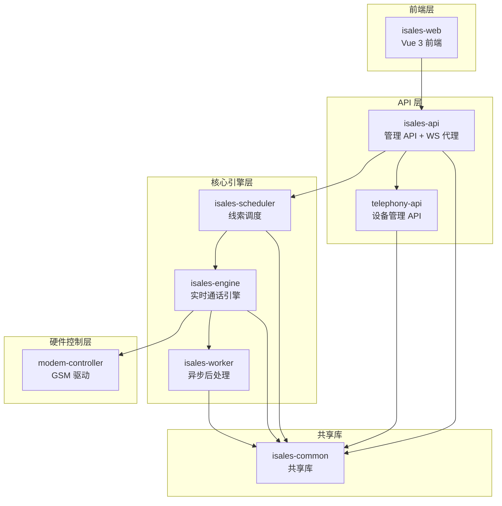

**图表来源**
- [architecture/spec.md:130-168](file://openspec/specs/architecture/spec.md#L130-L168)

### 数据模型层次结构

系统采用分层数据模型设计，按照业务领域进行组织：

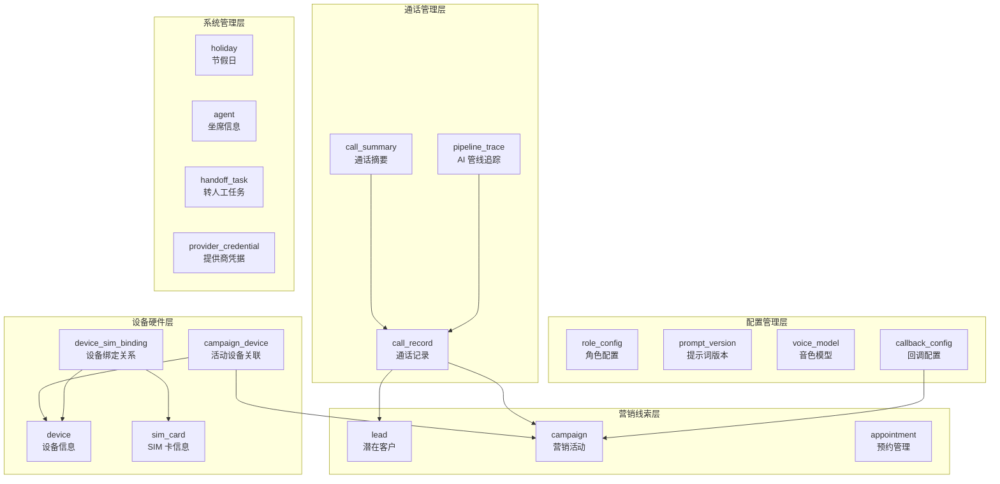

**图表来源**
- [data-model/spec.md:28-51](file://openspec/specs/data-model/spec.md#L28-L51)

**章节来源**
- [architecture/spec.md:5-44](file://openspec/specs/architecture/spec.md#L5-L44)
- [DESIGN.md:11-43](file://DESIGN.md#L11-L43)

## 核心组件

### 数据模型统一管理

系统采用 isales-common 统一管理所有数据模型，确保跨服务的一致性和可维护性：

#### 模型管理原则
- **单一来源**：所有 SQLAlchemy 模型和 Alembic 迁移由 isales-common 管理
- **依赖隔离**：其他服务通过依赖 isales-common 间接访问数据库
- **版本控制**：通过 OpenSpec change proposal 流程管理模型变更

#### 数据库统一策略
- **单一实例**：所有持久化数据存储在同一 PostgreSQL 实例
- **统一 schema**：所有表位于同一 schema 下
- **跨服务事务**：使用 PG 事务处理跨服务操作

**章节来源**
- [data-model/spec.md:5-17](file://openspec/specs/data-model/spec.md#L5-L17)
- [data-model/spec.md:52-59](file://openspec/specs/data-model/spec.md#L52-L59)

### 通话生命周期数据模型

#### 核心通话表结构

| 表名 | 关键字段 | 归属服务 | 详细用途 |
|------|----------|----------|----------|
| `call_record` | lead_id, campaign_id, status, transcript, recording_url | engine | 存储完整的通话记录和元数据 |
| `call_summary` | call_record_id, summary_text, goal_achieved | worker | 通话结束后的摘要和提取字段 |
| `pipeline_trace` | call_record_id, role_candidates, judge_results, polish_output | engine | AI 三层管线的详细追踪记录 |

#### 通话状态管理

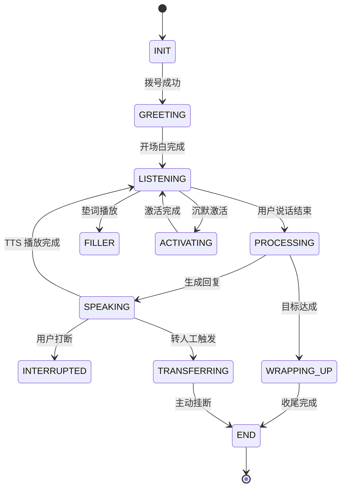

**图表来源**
- [call-state-machine/spec.md:46-109](file://openspec/specs/call-state-machine/spec.md#L46-L109)

**章节来源**
- [call-state-machine/spec.md:1-190](file://openspec/specs/call-state-machine/spec.md#L1-L190)

### AI 管线数据模型

#### 三层管线追踪

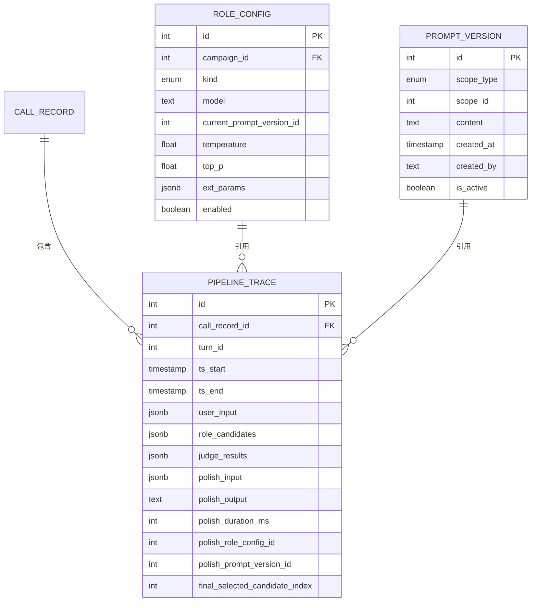

**图表来源**
- [ai-pipeline/spec.md:159-166](file://openspec/specs/ai-pipeline/spec.md#L159-L166)
- [role-prompt/spec.md:230-238](file://openspec/specs/role-prompt/spec.md#L230-L238)

**章节来源**
- [ai-pipeline/spec.md:1-166](file://openspec/specs/ai-pipeline/spec.md#L1-L166)
- [role-prompt/spec.md:1-238](file://openspec/specs/role-prompt/spec.md#L1-L238)

### 设备硬件数据模型

#### 硬件设备管理

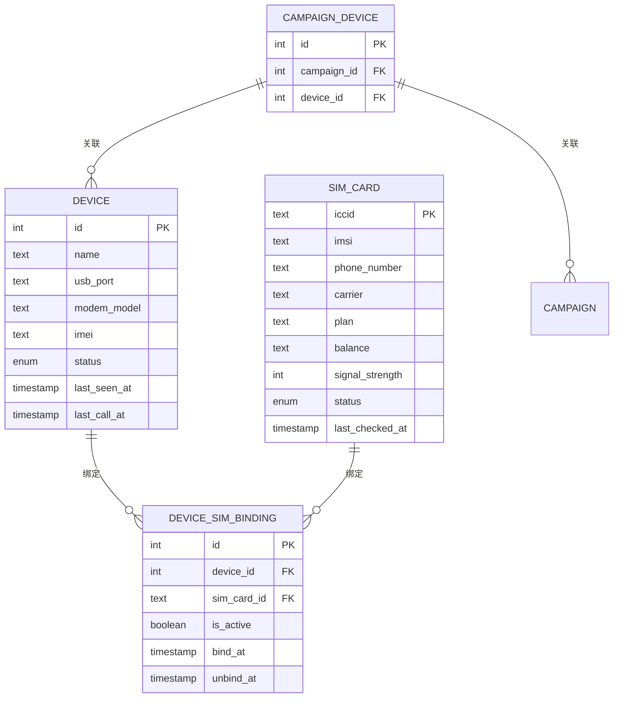

**图表来源**
- [device-hardware/spec.md:517-525](file://openspec/specs/device-hardware/spec.md#L517-L525)

**章节来源**
- [device-hardware/spec.md:1-525](file://openspec/specs/device-hardware/spec.md#L1-L525)

### 营销活动数据模型

#### 活动配置管理

| 表名 | 关键字段 | 归属服务 | 详细用途 |
|------|----------|----------|----------|
| `campaign` | name, voice_id, default_replies, time_windows, retry_intervals | api | 营销活动的完整配置信息 |
| `lead` | name, phone, status, retry_count, follow_up_count | api | 潜在客户信息和状态管理 |
| `appointment` | lead_id, appointment_time, status | api | 预约管理和状态跟踪 |

#### 活动配置字段详解

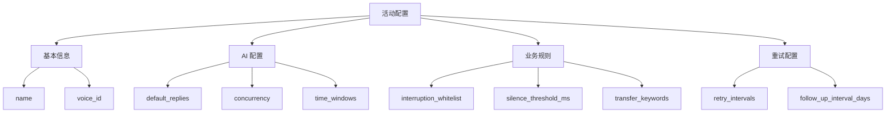

**图表来源**
- [data-model/spec.md:30-31](file://openspec/specs/data-model/spec.md#L30-L31)

**章节来源**
- [data-model/spec.md:28-51](file://openspec/specs/data-model/spec.md#L28-L51)

## 架构概览

### 服务间数据流

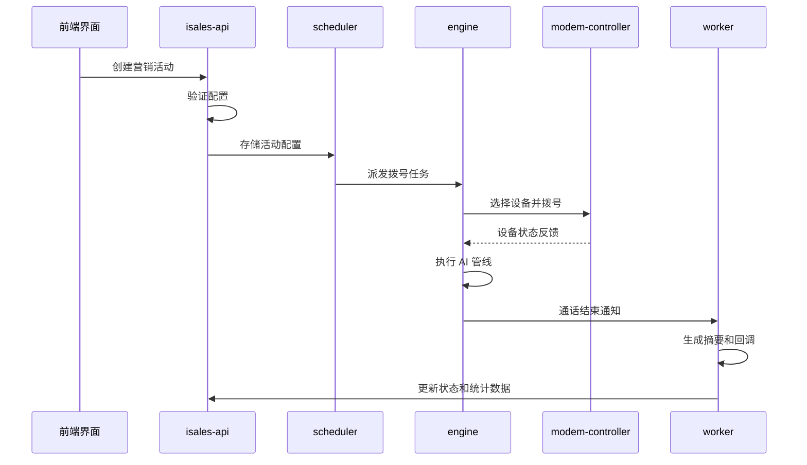

**图表来源**
- [architecture/spec.md:130-168](file://openspec/specs/architecture/spec.md#L130-L168)

### 数据一致性保障

系统通过以下机制确保数据一致性：

1. **统一数据源**：所有服务通过 isales-common 访问数据库
2. **事务管理**：跨服务操作使用 PG 事务
3. **版本控制**：通过 OpenSpec 流程管理数据模型变更
4. **数据验证**：在 API 层进行数据验证和业务规则检查

**章节来源**
- [architecture/spec.md:59-72](file://openspec/specs/architecture/spec.md#L59-L72)
- [data-model/spec.md:5-17](file://openspec/specs/data-model/spec.md#L5-L17)

## 详细组件分析

### 通话状态机数据模型

#### 状态转换规则

```mermaid
flowchart TD
INIT[INIT] --> |拨号成功| GREETING[GREETING]
GREETING --> |开场白完成| LISTENING[LISTENING]
LISTENING --> |用户说话结束| PROCESSING[PROCESSING]
PROCESSING --> |生成回复| SPEAKING[SPEAKING]
SPEAKING --> |TTS 完成| LISTENING
SPEAKING --> |被打断| INTERRUPTED[INTERRUPTED]
LISTENING --> |用户打断| INTERRUPTED
INTERRUPTED --> PROCESSING
LISTENING --> |垫词触发| FILLER[FILLER]
PROCESSING --> |目标达成| WRAPPING_UP[WRAPPING_UP]
LISTENING --> |沉默激活| ACTIVATING[ACTIVATING]
SPEAKING --> |转人工| TRANSFERRING[TRANSFERRING]
WRAPPING_UP --> END[END]
ACTIVATING --> LISTENING
TRANSFERRING --> END
END --> [*]
```

**图表来源**
- [call-state-machine/spec.md:46-109](file://openspec/specs/call-state-machine/spec.md#L46-L109)

#### 状态转换验证

系统通过 `LEGAL_TRANSITIONS` 集合确保状态转换的合法性，任何非法转换都会抛出 `IllegalTransition` 异常并在 transcript 中记录错误信息。

**章节来源**
- [call-state-machine/spec.md:21-44](file://openspec/specs/call-state-machine/spec.md#L21-L44)

### AI 三层管线数据模型

#### 管线执行流程

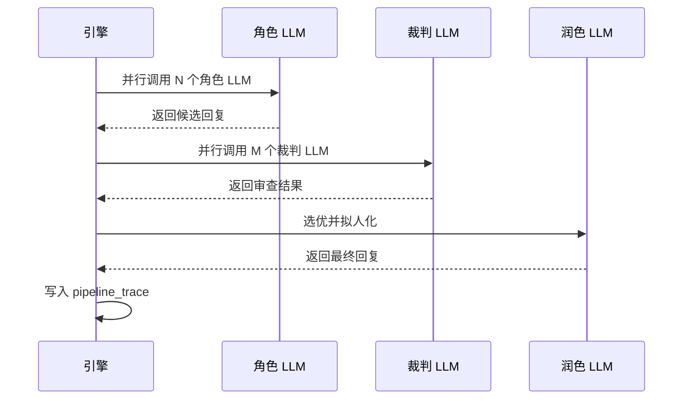

**图表来源**
- [ai-pipeline/spec.md:20-43](file://openspec/specs/ai-pipeline/spec.md#L20-L43)

#### 管线追踪数据结构

每个 AI 管线执行都会生成详细的追踪记录，包括：

- **角色候选**：所有角色 LLM 生成的候选回复
- **裁判结果**：M 个裁判 LLM 的审查结果
- **润色输出**：最终的拟人化回复
- **执行时间**：各阶段的开始和结束时间

**章节来源**
- [ai-pipeline/spec.md:40-68](file://openspec/specs/ai-pipeline/spec.md#L40-L68)

### 设备硬件数据模型

#### 设备状态管理

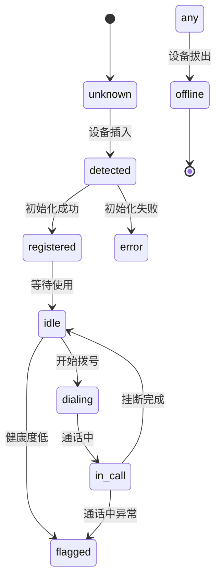

**图表来源**
- [device-hardware/spec.md:45-62](file://openspec/specs/device-hardware/spec.md#L45-L62)

#### SIM 卡管理

系统支持 SIM 卡的动态绑定和解绑，通过 `device_sim_binding` 表记录绑定历史：

- **唯一活跃约束**：同一设备同一时刻只能有一个活跃绑定
- **绑定历史**：记录每次绑定和解绑的时间点
- **自动切换**：SIM 卡热插拔时自动处理绑定变更

**章节来源**
- [device-hardware/spec.md:69-87](file://openspec/specs/device-hardware/spec.md#L69-L87)

### 重试跟进数据模型

#### 重试机制

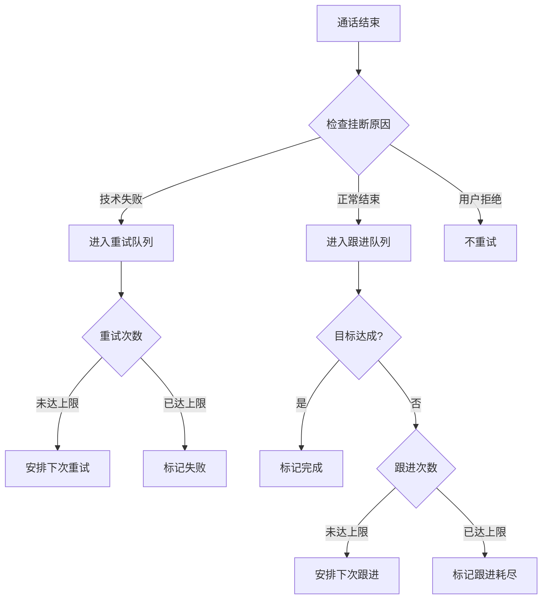

**图表来源**
- [retry-followup/spec.md:5-18](file://openspec/specs/retry-followup/spec.md#L5-L18)

#### 调度策略

系统采用灵活的调度策略：

- **重试策略**：指数退避 + 最大次数限制
- **跟进策略**：固定间隔 + 最大次数限制  
- **时间窗口**：基于配置的时间窗口过滤
- **并发控制**：全局并发计数器限制

**章节来源**
- [retry-followup/spec.md:24-51](file://openspec/specs/retry-followup/spec.md#L24-L51)

### Webhook 回调数据模型

#### 回调执行流程

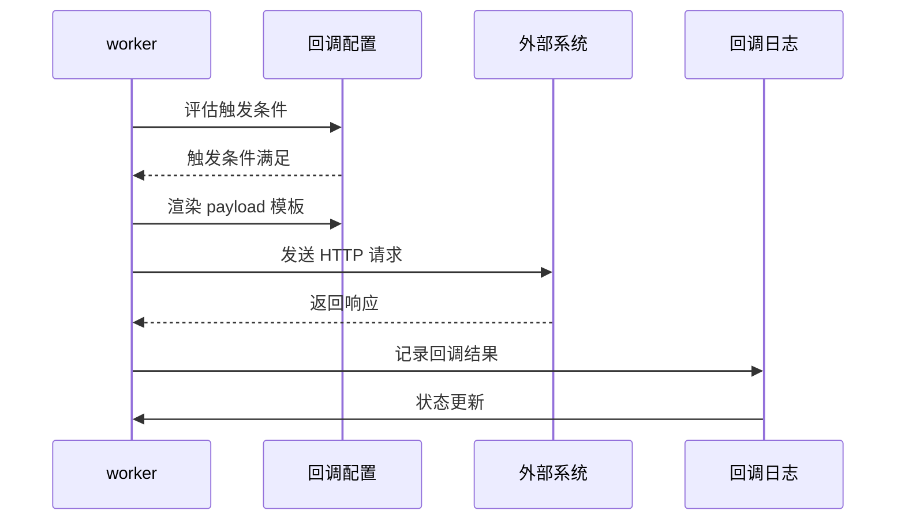

**图表来源**
- [webhook-callback/spec.md:5-18](file://openspec/specs/webhook-callback/spec.md#L5-L18)

#### 安全机制

系统采用多重安全机制确保回调的安全性：

- **HMAC 签名**：使用 Fernet 加密的密钥生成 HMAC-SHA256 签名
- **时间戳验证**：防止重放攻击
- **沙盒渲染**：Jinja2 沙盒环境防止代码注入
- **指数退避**：失败时自动重试，避免雪崩效应

**章节来源**
- [webhook-callback/spec.md:68-102](file://openspec/specs/webhook-callback/spec.md#L68-L102)

## 依赖分析

### 数据模型依赖关系

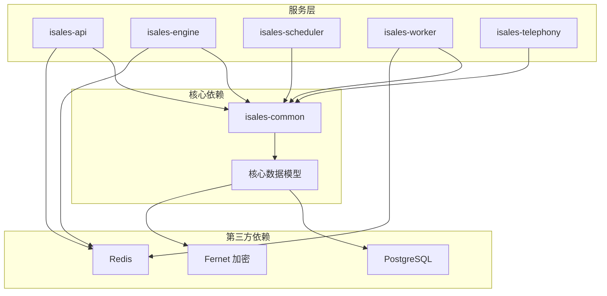

**图表来源**
- [architecture/spec.md:59-72](file://openspec/specs/architecture/spec.md#L59-L72)

### 服务间耦合度分析

系统通过以下方式降低服务间的耦合度：

1. **接口隔离**：每个服务只暴露必要的 API 接口
2. **消息队列**：通过 Redis 队列实现异步通信
3. **共享库**：通过 isales-common 提供统一的数据访问接口
4. **事件驱动**：通过 Pub/Sub 实现松耦合的事件通知

**章节来源**
- [architecture/spec.md:120-129](file://openspec/specs/architecture/spec.md#L120-L129)

## 性能考虑

### 数据库性能优化

系统采用以下策略优化数据库性能：

1. **索引策略**：为常用查询字段建立合适的索引
2. **查询优化**：避免 N+1 查询问题，使用批量查询
3. **连接池**：使用连接池减少连接开销
4. **缓存策略**：合理使用 Redis 缓存热点数据

### 并发控制

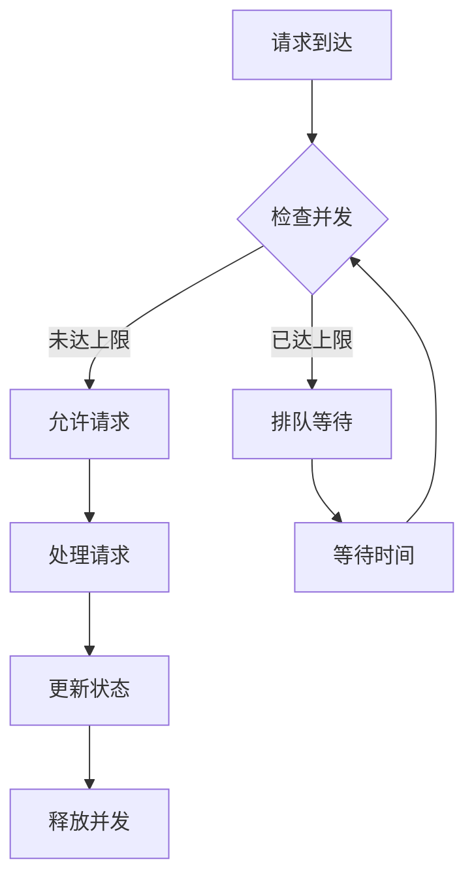

**图表来源**
- [retry-followup/spec.md:129-133](file://openspec/specs/retry-followup/spec.md#L129-L133)

### 缓存策略

系统通过多层缓存提高性能：

- **Redis 缓存**：热点数据缓存
- **进程内缓存**：频繁访问的数据缓存
- **数据库查询缓存**：重复查询结果缓存

## 故障排除指南

### 常见数据模型问题

#### 数据一致性问题

**问题症状**：
- 数据更新不同步
- 事务冲突
- 数据不一致

**解决方案**：
1. 检查事务边界
2. 验证外键约束
3. 确认数据同步机制

#### 性能问题

**问题症状**：
- 查询响应慢
- 数据库连接池耗尽
- 内存使用过高

**解决方案**：
1. 分析慢查询日志
2. 优化索引策略
3. 调整连接池配置

#### 数据迁移问题

**问题症状**：
- 迁移失败
- 数据丢失
- 版本不兼容

**解决方案**：
1. 使用 OpenSpec 流程管理变更
2. 备份数据库
3. 逐步迁移

**章节来源**
- [data-model/spec.md:5-17](file://openspec/specs/data-model/spec.md#L5-L17)
- [provider-credential/spec.md:35-50](file://openspec/specs/provider-credential/spec.md#L35-L50)

## 结论

iSales 系统的数据模型设计体现了现代分布式系统的最佳实践：

1. **统一管理**：通过 isales-common 统一管理所有数据模型，确保跨服务一致性
2. **模块化设计**：按照业务领域划分数据模型，提高可维护性
3. **安全性**：采用多层安全机制保护敏感数据
4. **可扩展性**：支持灵活的配置和扩展
5. **性能优化**：通过合理的索引和缓存策略优化性能

该数据模型设计为系统的稳定运行和未来发展奠定了坚实的基础，支持从单机部署到多主机扩展的演进路径。