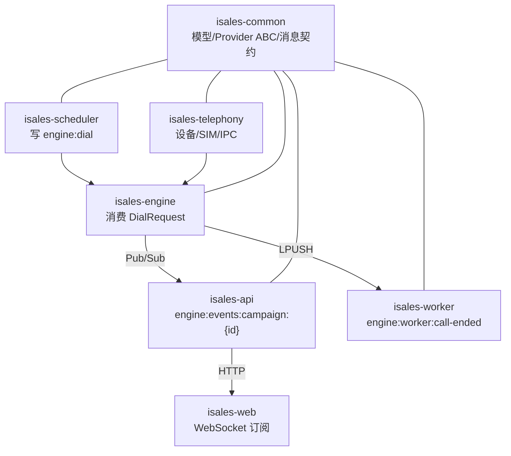
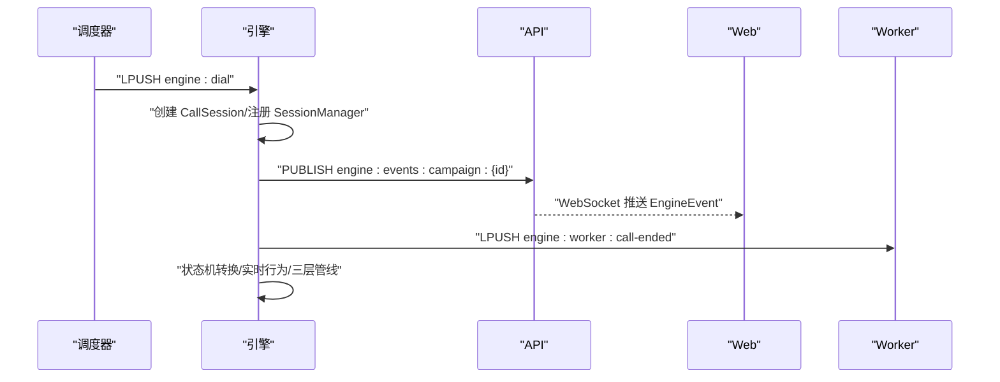
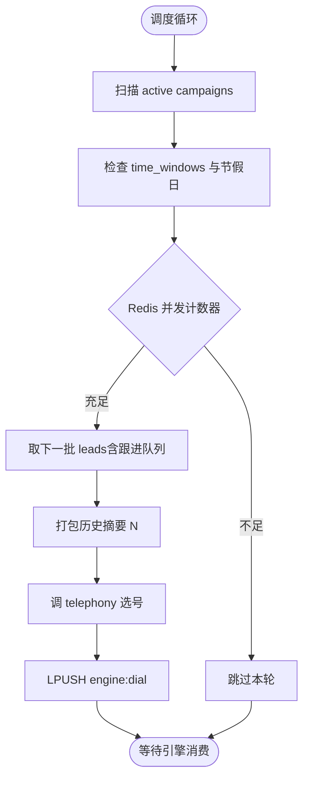
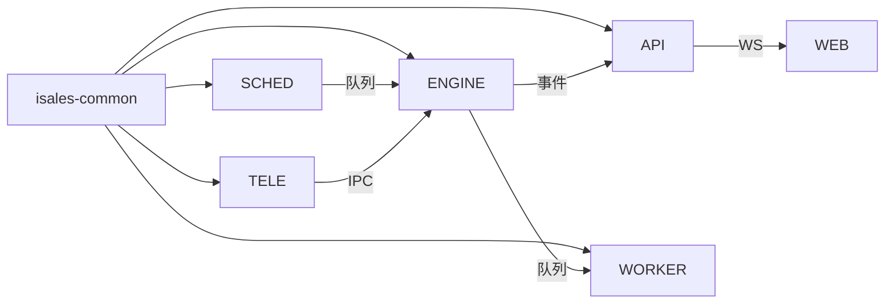

# 核心服务详解

<cite>
**本文引用的文件**
- [README.md](file://README.md)
- [DESIGN.md](file://DESIGN.md)
- [IMPLEMENTATION_PLAN.md](file://IMPLEMENTATION_PLAN.md)
- [openspec/specs/data-model/spec.md](file://openspec/specs/data-model/spec.md)
- [openspec/specs/provider-abc/spec.md](file://openspec/specs/provider-abc/spec.md)
- [openspec/specs/call-state-machine/spec.md](file://openspec/specs/call-state-machine/spec.md)
- [openspec/specs/ai-pipeline/spec.md](file://openspec/specs/ai-pipeline/spec.md)
- [openspec/specs/role-prompt/spec.md](file://openspec/specs/role-prompt/spec.md)
- [openspec/specs/goal-achievement/spec.md](file://openspec/specs/goal-achievement/spec.md)
- [openspec/specs/interruption-detection/spec.md](file://openspec/specs/interruption-detection/spec.md)
- [openspec/specs/silence-activation/spec.md](file://openspec/specs/silence-activation/spec.md)
- [openspec/specs/human-handoff/spec.md](file://openspec/specs/human-handoff/spec.md)
- [openspec/specs/transcript/spec.md](file://openspec/specs/transcript/spec.md)
- [openspec/specs/webhook-callback/spec.md](file://openspec/specs/webhook-callback/spec.md)
- [openspec/specs/retry-followup/spec.md](file://openspec/specs/retry-followup/spec.md)
- [openspec/specs/time-window/spec.md](file://openspec/specs/time-window/spec.md)
- [openspec/specs/architecture/spec.md](file://openspec/specs/architecture/spec.md)
- [openspec/specs/device-hardware/spec.md](file://openspec/specs/device-hardware/spec.md)
- [openspec/specs/service-communication/spec.md](file://openspec/specs/service-communication/spec.md)
- [openspec/specs/message-contract/spec.md](file://openspec/specs/message-contract/spec.md)
- [openspec/changes/archive/2026-05-01-init-isales-common/proposal.md](file://openspec/changes/archive/2026-05-01-init-isales-common/proposal.md)
- [openspec/changes/archive/2026-05-06-impl-api/tasks.md](file://openspec/changes/archive/2026-05-06-impl-api/tasks.md)
- [openspec/changes/archive/2026-05-06-impl-api/design.md](file://openspec/changes/archive/2026-05-06-impl-api/design.md)
- [openspec/changes/archive/2026-05-06-impl-scheduler/tasks.md](file://openspec/changes/archive/2026-05-06-impl-scheduler/tasks.md)
- [openspec/changes/archive/2026-05-06-impl-scheduler/proposal.md](file://openspec/changes/archive/2026-05-06-impl-scheduler/proposal.md)
- [openspec/changes/archive/2026-05-06-impl-scheduler/design.md](file://openspec/changes/archive/2026-05-06-impl-scheduler/design.md)
- [openspec/changes/archive/2026-05-06-impl-worker/tasks.md](file://openspec/changes/archive/2026-05-06-impl-worker/tasks.md)
- [openspec/changes/archive/2026-05-06-impl-worker/proposal.md](file://openspec/changes/archive/2026-05-06-impl-worker/proposal.md)
- [openspec/changes/archive/2026-05-07-impl-engine/tasks.md](file://openspec/changes/archive/2026-05-07-impl-engine/tasks.md)
- [openspec/changes/archive/2026-05-07-impl-engine/proposal.md](file://openspec/changes/archive/2026-05-07-impl-engine/proposal.md)
- [openspec/changes/archive/2026-05-08-impl-web/tasks.md](file://openspec/changes/archive/2026-05-08-impl-web/tasks.md)
- [openspec/changes/archive/2026-05-08-impl-web-polish/design.md](file://openspec/changes/archive/2026-05-08-impl-web-polish/design.md)
- [openspec/changes/archive/2026-05-09-impl-modem-controller/tasks.md](file://openspec/changes/archive/2026-05-09-impl-modem-controller/tasks.md)
- [openspec/changes/archive/2026-05-09-impl-modem-controller/design.md](file://openspec/changes/archive/2026-05-09-impl-modem-controller/design.md)
</cite>

## 目录
1. [简介](#简介)
2. [项目结构](#项目结构)
3. [核心组件](#核心组件)
4. [架构总览](#架构总览)
5. [详细组件分析](#详细组件分析)
6. [依赖分析](#依赖分析)
7. [性能考虑](#性能考虑)
8. [故障排查指南](#故障排查指南)
9. [结论](#结论)
10. [附录](#附录)

## 简介
本文件面向 iSales v1 核心服务的技术文档，系统梳理并解释以下 7 个微服务的职责、实现要点与使用模式：
- isales-common：共享库，统一数据模型、Provider 抽象与消息契约
- isales-api：管理后台，提供 JWT 认证、资源管理与事件推送
- isales-engine：实时通话引擎，状态机 + AI 三层管线 + 实时行为模块
- isales-scheduler：调度器，线索调度、时间窗口与并发控制
- isales-worker：异步处理器，后处理任务与回调机制
- isales-telephony：硬件控制，设备与 SIM 卡管理、调制解调器控制
- isales-web：前端管理界面，Vue 3 组件架构与实时监控

同时，结合 OpenSpec 规范，阐明数据模型设计、Provider 抽象接口、API 接口与认证机制、引擎状态机与 AI 管线、调度算法与时间窗口、工作流与回调、硬件设备与调制解调器控制，以及前端组件与监控。

## 项目结构
iSales v1 采用“7 仓”单主机部署模型，围绕 isales-common 提供统一的数据模型与契约，其余服务通过依赖与消息通道协同工作。核心目录与职责如下：
- isales-common：Pydantic/SQLAlchemy 模型、Provider ABC、消息契约
- isales-api：FastAPI 后台，JWT 认证、资源与事件推送
- isales-engine：状态机 + AI 三层管线 + 实时行为模块
- isales-scheduler：线索调度、时间窗口与并发控制
- isales-worker：后处理任务、回调与摘要
- isales-telephony：设备与 SIM 卡管理、调制解调器控制
- isales-web：Vue 3 管理界面

```mermaid
graph TB
subgraph "共享层"
COMMON["isales-common<br/>数据模型/Provider ABC/消息契约"]
end
subgraph "后端服务"
API["isales-api<br/>JWT/资源/事件推送"]
ENGINE["isales-engine<br/>状态机/三层AI/实时行为"]
SCHED["isales-scheduler<br/>调度/并发/时间窗"]
WORKER["isales-worker<br/>回调/摘要/重试"]
TELE["isales-telephony<br/>设备/SIM/调制解调器"]
end
subgraph "前端"
WEB["isales-web<br/>Vue3/实时监控"]
end
COMMON --> API
COMMON --> ENGINE
COMMON --> SCHED
COMMON --> WORKER
COMMON --> TELE
SCHED --> ENGINE
ENGINE --> WORKER
API <- --> WEB
ENGINE --> API
TELE --> ENGINE
```

图表来源
- [README.md:1-14](file://README.md#L1-L14)
- [openspec/specs/architecture/spec.md](file://openspec/specs/architecture/spec.md)

章节来源
- [README.md:1-14](file://README.md#L1-L14)
- [openspec/specs/architecture/spec.md](file://openspec/specs/architecture/spec.md)

## 核心组件
本节概述 7 个微服务的核心职责与关键实现点，便于快速定位到相应 OpenSpec 规范与实施文档。

- isales-common
  - 统一数据模型与 Alembic 迁移管理，确保跨服务一致性
  - Provider ABC（ASR/TTS/LLM）定义与 mock 实现，保障引擎与供应商解耦
  - 消息契约（Pydantic 模型 + 版本字段）统一 Redis 通道消息形状
  - 参考：[provider-abc/spec.md](file://openspec/specs/provider-abc/spec.md)，[data-model/spec.md](file://openspec/specs/data-model/spec.md)，[message-contract/spec.md](file://openspec/specs/message-contract/spec.md)

- isales-api
  - JWT 登录与用户认证，OAuth2PasswordBearer + HS256 签发
  - 资源管理（Campaigns/Leads/Calls/Appointments/Callbacks 等）
  - 事件推送：通过 Redis Pub/Sub 向前端广播 EngineEvent
  - 参考：[openspec/changes/archive/2026-05-06-impl-api/tasks.md](file://openspec/changes/archive/2026-05-06-impl-api/tasks.md)，[openspec/changes/archive/2026-05-06-impl-api/design.md](file://openspec/changes/archive/2026-05-06-impl-api/design.md)

- isales-engine
  - 状态机：11 个状态与合法转换，非法转移写 transcript 兜底
  - 三层 AI 管线：角色并行 → 裁判并行 → 润色选优，失败降级与兜底
  - 实时行为：打断检测、沉默激活、垫词管理、转人工、收尾管理
  - Mock Telephony 客户端与 Provider 工厂，支撑端到端验收
  - 参考：[openspec/changes/archive/2026-05-07-impl-engine/proposal.md](file://openspec/changes/archive/2026-05-07-impl-engine/proposal.md)，[call-state-machine/spec.md](file://openspec/specs/call-state-machine/spec.md)，[ai-pipeline/spec.md](file://openspec/specs/ai-pipeline/spec.md)

- isales-scheduler
  - 按时间窗口与节假日过滤，检查并发计数器，取下一批线索
  - 打包历史摘要，调用 telephony 选号，写入 engine:dial 队列
  - 重试与跟进策略，未接通按指数退避重试
  - 参考：[openspec/changes/archive/2026-05-06-impl-scheduler/proposal.md](file://openspec/changes/archive/2026-05-06-impl-scheduler/proposal.md)，[retry-followup/spec.md](file://openspec/specs/retry-followup/spec.md)，[time-window/spec.md](file://openspec/specs/time-window/spec.md)

- isales-worker
  - 消费 engine:worker:call-ended，生成摘要、执行回调、重试调度
  - 解密 webhook 签名密钥，Jinja2 渲染负载，JsonLogic 触发条件
  - Lead 状态推进与 handoff_task 创建（由 engine 标记）
  - 参考：[openspec/changes/archive/2026-05-06-impl-worker/proposal.md](file://openspec/changes/archive/2026-05-06-impl-worker/proposal.md)，[webhook-callback/spec.md](file://openspec/specs/webhook-callback/spec.md)

- isales-telephony
  - 设备与 SIM 卡管理，设备状态机与选号 API
  - 调制解调器控制：扩展 modem_controller 包，对齐 IPC 协议
  - 硬件接入文档与平台门控（Linux/pyserial 等）
  - 参考：[openspec/changes/archive/2026-05-09-impl-modem-controller/tasks.md](file://openspec/changes/archive/2026-05-09-impl-modem-controller/tasks.md)，[openspec/changes/archive/2026-05-09-impl-modem-controller/design.md](file://openspec/changes/archive/2026-05-09-impl-modem-controller/design.md)，[device-hardware/spec.md](file://openspec/specs/device-hardware/spec.md)

- isales-web
  - Vue 3 + Vite + TypeScript + Element Plus + ECharts
  - 实时监控与事件订阅，路由与状态管理，错误边界与加载骨架
  - 部署与回滚流程，CI/CD 与构建优化
  - 参考：[openspec/changes/archive/2026-05-08-impl-web/tasks.md](file://openspec/changes/archive/2026-05-08-impl-web/tasks.md)，[openspec/changes/archive/2026-05-08-impl-web-polish/design.md](file://openspec/changes/archive/2026-05-08-impl-web-polish/design.md)

章节来源
- [openspec/specs/provider-abc/spec.md](file://openspec/specs/provider-abc/spec.md)
- [openspec/specs/data-model/spec.md](file://openspec/specs/data-model/spec.md)
- [openspec/specs/message-contract/spec.md](file://openspec/specs/message-contract/spec.md)
- [openspec/changes/archive/2026-05-06-impl-api/tasks.md](file://openspec/changes/archive/2026-05-06-impl-api/tasks.md)
- [openspec/changes/archive/2026-05-06-impl-api/design.md](file://openspec/changes/archive/2026-05-06-impl-api/design.md)
- [openspec/changes/archive/2026-05-07-impl-engine/proposal.md](file://openspec/changes/archive/2026-05-07-impl-engine/proposal.md)
- [openspec/changes/archive/2026-05-06-impl-scheduler/proposal.md](file://openspec/changes/archive/2026-05-06-impl-scheduler/proposal.md)
- [openspec/changes/archive/2026-05-06-impl-worker/proposal.md](file://openspec/changes/archive/2026-05-06-impl-worker/proposal.md)
- [openspec/changes/archive/2026-05-09-impl-modem-controller/tasks.md](file://openspec/changes/archive/2026-05-09-impl-modem-controller/tasks.md)
- [openspec/changes/archive/2026-05-09-impl-modem-controller/design.md](file://openspec/changes/archive/2026-05-09-impl-modem-controller/design.md)
- [openspec/changes/archive/2026-05-08-impl-web/tasks.md](file://openspec/changes/archive/2026-05-08-impl-web/tasks.md)
- [openspec/changes/archive/2026-05-08-impl-web-polish/design.md](file://openspec/changes/archive/2026-05-08-impl-web-polish/design.md)

## 架构总览
下图展示服务间的通信与数据流，基于 OpenSpec 的 service-communication 与 message-contract 规范：



图表来源
- [openspec/specs/service-communication/spec.md](file://openspec/specs/service-communication/spec.md)
- [openspec/specs/message-contract/spec.md](file://openspec/specs/message-contract/spec.md)
- [openspec/changes/archive/2026-05-07-impl-engine/proposal.md](file://openspec/changes/archive/2026-05-07-impl-engine/proposal.md)
- [openspec/changes/archive/2026-05-06-impl-scheduler/proposal.md](file://openspec/changes/archive/2026-05-06-impl-scheduler/proposal.md)
- [openspec/changes/archive/2026-05-06-impl-worker/proposal.md](file://openspec/changes/archive/2026-05-06-impl-worker/proposal.md)

章节来源
- [openspec/specs/service-communication/spec.md](file://openspec/specs/service-communication/spec.md)
- [openspec/specs/message-contract/spec.md](file://openspec/specs/message-contract/spec.md)

## 详细组件分析

### isales-common 共享库
- 数据模型设计
  - 统一由 isales-common 管理 SQLAlchemy 模型与 Alembic 迁移，其他服务仅依赖访问
  - 表归属明确，跨服务读写权由 service-communication 与 data-model 规定
  - JSONB 字段需附 schema 描述，避免滥用
  - 参考：[data-model/spec.md](file://openspec/specs/data-model/spec.md)

- Provider 抽象接口
  - ASR/TTS/LLM 三类 Provider ABC 集中定义，实现类必须继承 ABC
  - 流式接口与 JSON Mode 强制启用，统一错误模型（ProviderError 子类）
  - 提供 mock 实现，便于引擎测试
  - 参考：[provider-abc/spec.md](file://openspec/specs/provider-abc/spec.md)，[2026-05-01-init-isales-common/proposal.md](file://openspec/changes/archive/2026-05-01-init-isales-common/proposal.md)

- 工具函数与消息契约
  - Redis 消息体统一使用 isales-common 的 Pydantic 模型，附版本字段
  - 禁止裸 dict/散落定义，确保跨服务一致性
  - 参考：[message-contract/spec.md](file://openspec/specs/message-contract/spec.md)

章节来源
- [openspec/specs/data-model/spec.md](file://openspec/specs/data-model/spec.md)
- [openspec/specs/provider-abc/spec.md](file://openspec/specs/provider-abc/spec.md)
- [openspec/changes/archive/2026-05-01-init-isales-common/proposal.md](file://openspec/changes/archive/2026-05-01-init-isales-common/proposal.md)
- [openspec/specs/message-contract/spec.md](file://openspec/specs/message-contract/spec.md)

### isales-api 管理后台
- API 接口与资源
  - 提供 Campaigns/Leads/Calls/Appointments/Callbacks 等资源的 CRUD
  - 事件推送：将 EngineEvent 通过 Redis Pub/Sub 发布到 engine:events:campaign:{id}
  - 参考：[openspec/changes/archive/2026-05-06-impl-api/tasks.md](file://openspec/changes/archive/2026-05-06-impl-api/tasks.md)

- 用户认证机制
  - JWT 登录：OAuth2PasswordRequestForm + HS256 签发
  - 令牌验证：OAuth2PasswordBearer + isales-common verify_jwt
  - 401/WWW-Authenticate 响应，覆盖多种错误路径
  - 参考：[openspec/changes/archive/2026-05-06-impl-api/design.md](file://openspec/changes/archive/2026-05-06-impl-api/design.md)

- 管理功能实现
  - 事件订阅：前端通过 WebSocket 订阅 engine:events:campaign:{id}
  - 与 isales-web 协同，提供实时监控与交互
  - 参考：[openspec/changes/archive/2026-05-06-impl-api/tasks.md](file://openspec/changes/archive/2026-05-06-impl-api/tasks.md)

章节来源
- [openspec/changes/archive/2026-05-06-impl-api/tasks.md](file://openspec/changes/archive/2026-05-06-impl-api/tasks.md)
- [openspec/changes/archive/2026-05-06-impl-api/design.md](file://openspec/changes/archive/2026-05-06-impl-api/design.md)

### isales-engine 实时通话引擎
- 状态机设计
  - 状态集合：INIT/GREETING/LISTENING/SPEAKING/INTERRUPTED/FILLER/PROCESSING/WRAPPING_UP/ACTIVATING/TRANSFERRING/END
  - 合法转移集合与非法转移兜底（state_error 事件）
  - 起始状态 INIT，终止状态 END 后不再转换
  - 参考：[call-state-machine/spec.md](file://openspec/specs/call-state-machine/spec.md)，[2026-05-07-impl-engine/proposal.md](file://openspec/changes/archive/2026-05-07-impl-engine/proposal.md)

- AI 三层管线
  - 角色并行（N 路）→ 裁判并行（N×M）→ 润色选优（1 路）
  - JSON Mode 强制启用，失败降级与兜底（default_replies）
  - pipeline_trace 记录每轮细节，transcript 写入事件
  - 参考：[ai-pipeline/spec.md](file://openspec/specs/ai-pipeline/spec.md)，[role-prompt/spec.md](file://openspec/specs/role-prompt/spec.md)，[transcript/spec.md](file://openspec/specs/transcript/spec.md)

- 实时处理模块
  - 打断检测：白名单 + 时长双条件，命中立即停止 TTS，不可撤销
  - 沉默激活：计时起点与上限控制，激活话术写 full_transcript
  - 垫词管理：多 set 轮询 + 集内不重复，与管线同时启动
  - 转人工：keyword/intent/rounds/llm 四种触发，播衔接话术后主动挂断
  - 收尾管理：goal_achieved=true 后双计数器（轮数+时长）收尾
  - 参考：[interruption-detection/spec.md](file://openspec/specs/interruption-detection/spec.md)，[silence-activation/spec.md](file://openspec/specs/silence-activation/spec.md)，[filler/spec.md](file://openspec/specs/filler/spec.md)，[human-handoff/spec.md](file://openspec/specs/human-handoff/spec.md)，[goal-achievement/spec.md](file://openspec/specs/goal-achievement/spec.md)

- Mock Providers 与 Telephony
  - MockLLM/MockASR/MockTTS 驱动端到端验收
  - MockTelephonyClient：connected/remote_hangup/PCM 帧模拟
  - 参考：[2026-05-07-impl-engine/proposal.md](file://openspec/changes/archive/2026-05-07-impl-engine/proposal.md)

- 事件与控制
  - EngineEvent 推送（call_started/state_changed/asr_partial/asr_final/ai_reply/hangup/pipeline_completed）
  - EngineControl 消费（ManualHangup/ForceTransfer）
  - 参考：[2026-05-07-impl-engine/proposal.md](file://openspec/changes/archive/2026-05-07-impl-engine/proposal.md)



图表来源
- [openspec/changes/archive/2026-05-07-impl-engine/proposal.md](file://openspec/changes/archive/2026-05-07-impl-engine/proposal.md)
- [openspec/specs/service-communication/spec.md](file://openspec/specs/service-communication/spec.md)

章节来源
- [openspec/specs/call-state-machine/spec.md](file://openspec/specs/call-state-machine/spec.md)
- [openspec/specs/ai-pipeline/spec.md](file://openspec/specs/ai-pipeline/spec.md)
- [openspec/specs/role-prompt/spec.md](file://openspec/specs/role-prompt/spec.md)
- [openspec/specs/transcript/spec.md](file://openspec/specs/transcript/spec.md)
- [openspec/specs/interruption-detection/spec.md](file://openspec/specs/interruption-detection/spec.md)
- [openspec/specs/silence-activation/spec.md](file://openspec/specs/silence-activation/spec.md)
- [openspec/specs/filler/spec.md](file://openspec/specs/filler/spec.md)
- [openspec/specs/human-handoff/spec.md](file://openspec/specs/human-handoff/spec.md)
- [openspec/specs/goal-achievement/spec.md](file://openspec/specs/goal-achievement/spec.md)
- [openspec/changes/archive/2026-05-07-impl-engine/proposal.md](file://openspec/changes/archive/2026-05-07-impl-engine/proposal.md)

### isales-scheduler 调度器
- 线索调度算法
  - 扫描 active campaigns，检查 time_windows 与节假日
  - 检查 Redis 全局并发计数器，取下一批 leads（含跟进队列）
  - 打包历史摘要（call_summary 近 N 次），调 telephony 选号
  - 写 engine:dial 队列，等待引擎消费
  - 参考：[2026-05-06-impl-scheduler/proposal.md](file://openspec/changes/archive/2026-05-06-impl-scheduler/proposal.md)，[time-window/spec.md](file://openspec/specs/time-window/spec.md)

- 时间窗口管理
  - Campaign 多窗口 + 节假日 + 窗外推迟策略
  - 历史摘要 N 可配置，token 占用与摘要长度平衡
  - 参考：[time-window/spec.md](file://openspec/specs/time-window/spec.md)，[2026-05-06-impl-scheduler/design.md](file://openspec/changes/archive/2026-05-06-impl-scheduler/design.md)

- 并发控制
  - Redis 全局并发计数器，派发前 INCR，引擎 END 时 DECR
  - 异常清理时也 DECR，防止泄漏
  - 参考：[2026-05-07-impl-engine/proposal.md](file://openspec/changes/archive/2026-05-07-impl-engine/proposal.md)



图表来源
- [openspec/changes/archive/2026-05-06-impl-scheduler/proposal.md](file://openspec/changes/archive/2026-05-06-impl-scheduler/proposal.md)
- [openspec/specs/time-window/spec.md](file://openspec/specs/time-window/spec.md)

章节来源
- [openspec/changes/archive/2026-05-06-impl-scheduler/tasks.md](file://openspec/changes/archive/2026-05-06-impl-scheduler/tasks.md)
- [openspec/changes/archive/2026-05-06-impl-scheduler/proposal.md](file://openspec/changes/archive/2026-05-06-impl-scheduler/proposal.md)
- [openspec/changes/archive/2026-05-06-impl-scheduler/design.md](file://openspec/changes/archive/2026-05-06-impl-scheduler/design.md)
- [openspec/specs/time-window/spec.md](file://openspec/specs/time-window/spec.md)

### isales-worker 异步处理器
- 后处理任务
  - 消费 engine:worker:call-ended，生成 call_summary 与 extracted_fields
  - 依据 callback_config 执行 webhook 回调，支持 JsonLogic 触发与 Jinja2 模板
  - 参考：[openspec/changes/archive/2026-05-06-impl-worker/proposal.md](file://openspec/changes/archive/2026-05-06-impl-worker/proposal.md)，[webhook-callback/spec.md](file://openspec/specs/webhook-callback/spec.md)

- 回调机制
  - HMAC 签名（Fernet cipher），默认超时与重试策略
  - callback_log 记录请求/响应与重试历史
  - 参考：[webhook-callback/spec.md](file://openspec/specs/webhook-callback/spec.md)

- Lead 状态推进
  - 通话结束后推进 lead.next_follow_up_at，配合 scheduler 的跟进策略
  - 参考：[retry-followup/spec.md](file://openspec/specs/retry-followup/spec.md)

章节来源
- [openspec/changes/archive/2026-05-06-impl-worker/tasks.md](file://openspec/changes/archive/2026-05-06-impl-worker/tasks.md)
- [openspec/changes/archive/2026-05-06-impl-worker/proposal.md](file://openspec/changes/archive/2026-05-06-impl-worker/proposal.md)
- [openspec/specs/webhook-callback/spec.md](file://openspec/specs/webhook-callback/spec.md)
- [openspec/specs/retry-followup/spec.md](file://openspec/specs/retry-followup/spec.md)

### isales-telephony 硬件控制
- 设备管理
  - 设备表 device：状态机（unknown/detected/registered/idle/dialing/in_call/offline/flagged/error）
  - 设备状态更新与 last_seen_at/last_call_at
  - 参考：[data-model/spec.md](file://openspec/specs/data-model/spec.md)，[device-hardware/spec.md](file://openspec/specs/device-hardware/spec.md)

- SIM 卡管理
  - SIM 表 sim_card：iccid/imsi/phone_number/carrier/plan/balance/signal_strength/status
  - device_sim_binding：设备与 SIM 绑定关系
  - 参考：[data-model/spec.md](file://openspec/specs/data-model/spec.md)，[device-hardware/spec.md](file://openspec/specs/device-hardware/spec.md)

- 调制解调器控制
  - 扩展现有 modem_controller 包，对齐 engine ↔ modem-controller IPC 协议
  - Linux 平台门控与硬件依赖（pyserial/alsaaudio 等）
  - 参考：[openspec/changes/archive/2026-05-09-impl-modem-controller/tasks.md](file://openspec/changes/archive/2026-05-09-impl-modem-controller/tasks.md)，[openspec/changes/archive/2026-05-09-impl-modem-controller/design.md](file://openspec/changes/archive/2026-05-09-impl-modem-controller/design.md)

章节来源
- [openspec/specs/data-model/spec.md](file://openspec/specs/data-model/spec.md)
- [openspec/specs/device-hardware/spec.md](file://openspec/specs/device-hardware/spec.md)
- [openspec/changes/archive/2026-05-09-impl-modem-controller/tasks.md](file://openspec/changes/archive/2026-05-09-impl-modem-controller/tasks.md)
- [openspec/changes/archive/2026-05-09-impl-modem-controller/design.md](file://openspec/changes/archive/2026-05-09-impl-modem-controller/design.md)

### isales-web 前端管理界面
- Vue 3 组件架构
  - 目录骨架：router/stores/api/components/views/types/utils/assets
  - Element Plus + Pinia + Vue Router + axios + ECharts
  - 参考：[openspec/changes/archive/2026-05-08-impl-web/tasks.md](file://openspec/changes/archive/2026-05-08-impl-web/tasks.md)

- 实时监控功能
  - WebSocket 订阅 engine:events:campaign:{id}，展示通话事件流
  - 仪表盘与图表（ECharts）展示关键指标
  - 参考：[openspec/changes/archive/2026-05-06-impl-api/tasks.md](file://openspec/changes/archive/2026-05-06-impl-api/tasks.md)，[openspec/changes/archive/2026-05-08-impl-web-polish/design.md](file://openspec/changes/archive/2026-05-08-impl-web-polish/design.md)

- 部署与回滚
  - CI/CD：ESLint + TypeScript + Vitest + Build
  - 构建产物小于 1MB，vendor 拆分优化加载
  - 参考：[openspec/changes/archive/2026-05-08-impl-web-polish/design.md](file://openspec/changes/archive/2026-05-08-impl-web-polish/design.md)

章节来源
- [openspec/changes/archive/2026-05-08-impl-web/tasks.md](file://openspec/changes/archive/2026-05-08-impl-web/tasks.md)
- [openspec/changes/archive/2026-05-08-impl-web-polish/design.md](file://openspec/changes/archive/2026-05-08-impl-web-polish/design.md)
- [openspec/changes/archive/2026-05-06-impl-api/tasks.md](file://openspec/changes/archive/2026-05-06-impl-api/tasks.md)

## 依赖分析
- 组件耦合与内聚
  - isales-common 作为唯一数据与契约来源，提升内聚、降低耦合
  - 各服务通过 Redis Pub/Sub 与队列进行松耦合通信
- 直接与间接依赖
  - isales-engine 依赖 isales-common 的 Provider ABC 与消息契约
  - isales-scheduler 依赖 isales-telephony 的选号 API
  - isales-worker 依赖 isales-common 的 CallEnded 与回调模型
- 外部依赖与集成点
  - PostgreSQL（统一存储）
  - Redis（队列/Pub/Sub）
  - HTTP(S) 与 WebSocket（API/Web）



图表来源
- [openspec/specs/service-communication/spec.md](file://openspec/specs/service-communication/spec.md)
- [openspec/specs/message-contract/spec.md](file://openspec/specs/message-contract/spec.md)

章节来源
- [openspec/specs/service-communication/spec.md](file://openspec/specs/service-communication/spec.md)
- [openspec/specs/message-contract/spec.md](file://openspec/specs/message-contract/spec.md)

## 性能考虑
- 端到端延迟与首包时间
  - TTS 首包 500ms 内开始返回，降低感知延迟
  - Mock ASR/ASR 流式中间结果驱动打断检测，减少等待
- 并发与资源控制
  - Redis 全局并发计数器，派发前 INCR，引擎 END 时 DECR，异常清理也 DECR
  - 10 路并发验收，确保计数器准确
- I/O 与序列化
  - Redis 消息体统一 Pydantic 模型 + 版本字段，减少解析歧义
  - JSONB 字段附 schema，避免额外校验开销
- 前端渲染与加载
  - vendor 拆分与构建优化，DashboardView 体积显著下降
  - WebSocket 事件流驱动实时更新，避免轮询

## 故障排查指南
- 认证与授权
  - JWT 401/WWW-Authenticate 响应，检查令牌格式、签名与过期
  - 参考：[openspec/changes/archive/2026-05-06-impl-api/design.md](file://openspec/changes/archive/2026-05-06-impl-api/design.md)

- 状态机异常
  - 非法状态转移写 state_error 事件，检查 transcript 与日志
  - 参考：[call-state-machine/spec.md](file://openspec/specs/call-state-machine/spec.md)

- Provider 错误分类
  - RateLimited/Server/Timeout/InvalidRequest 明确区分，指导降级与重试
  - 参考：[provider-abc/spec.md](file://openspec/specs/provider-abc/spec.md)

- 并发泄漏
  - 确认引擎 END 时 DECR，异常清理也 DECR
  - 参考：[2026-05-07-impl-engine/proposal.md](file://openspec/changes/archive/2026-05-07-impl-engine/proposal.md)

- 回调失败
  - 检查 JsonLogic 触发条件、Jinja2 模板、HMAC 签名与超时设置
  - 查看 callback_log 重试历史
  - 参考：[webhook-callback/spec.md](file://openspec/specs/webhook-callback/spec.md)

章节来源
- [openspec/changes/archive/2026-05-06-impl-api/design.md](file://openspec/changes/archive/2026-05-06-impl-api/design.md)
- [openspec/specs/call-state-machine/spec.md](file://openspec/specs/call-state-machine/spec.md)
- [openspec/specs/provider-abc/spec.md](file://openspec/specs/provider-abc/spec.md)
- [openspec/changes/archive/2026-05-07-impl-engine/proposal.md](file://openspec/changes/archive/2026-05-07-impl-engine/proposal.md)
- [openspec/specs/webhook-callback/spec.md](file://openspec/specs/webhook-callback/spec.md)

## 结论
iSales v1 通过 isales-common 统一数据与契约，结合 Redis/HTTP/WebSocket 构建松耦合的 7 仓架构。isales-engine 的状态机与三层 AI 管线、isales-scheduler 的时间窗口与并发控制、isales-worker 的回调与摘要、isales-telephony 的设备与调制解调器控制，以及 isales-web 的实时监控，共同组成完整的 AI 外呼销售系统。OpenSpec 规范与实施计划确保了设计可追溯、变更受控、验收完备。

## 附录
- OpenSpec 工作流
  - 提议变更：/opsx:propose <change-name>
  - 应用变更：/opsx:apply <change-name>
  - 归档：/opsx:archive <change-name>
- 运维与部署
  - Linux/macOS systemd/launchd 部署脚本与回滚流程
  - 运维手册：首次上线/日常发版/回滚/备份恢复/故障排查/上线前 gate

章节来源
- [DESIGN.md:49-55](file://DESIGN.md#L49-L55)
- [README.md:23-30](file://README.md#L23-L30)