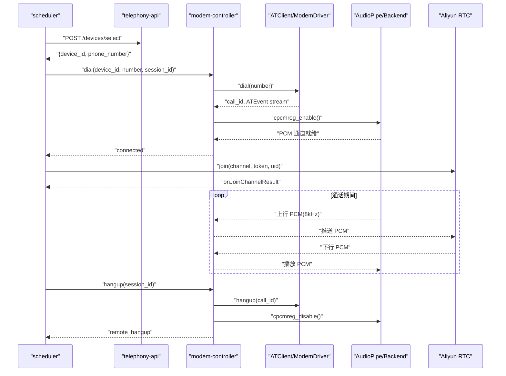
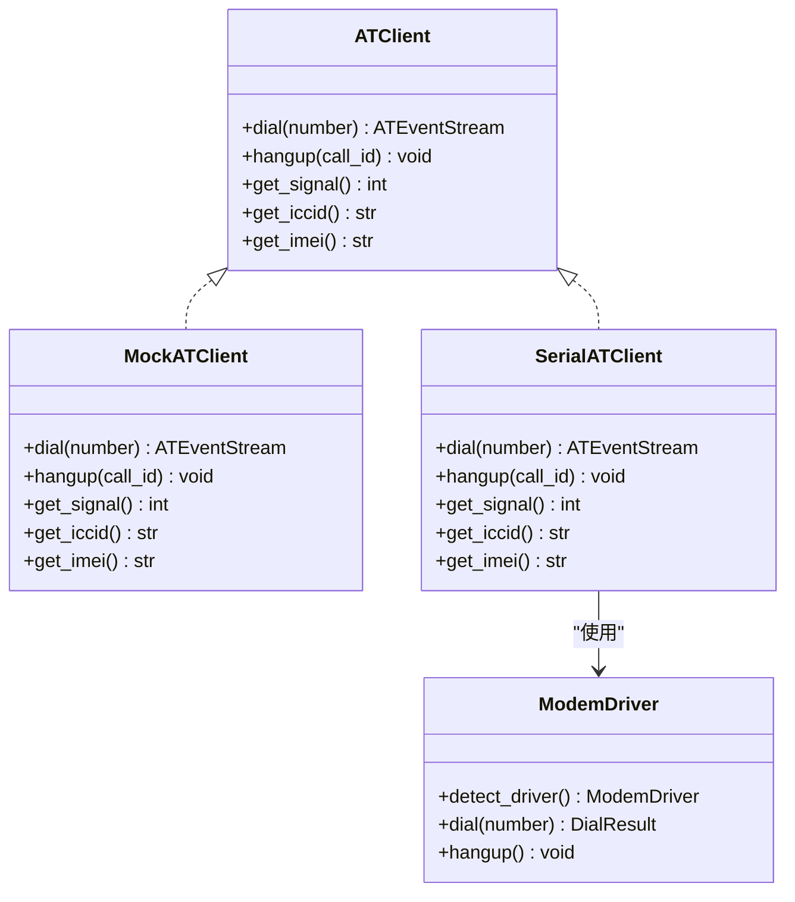
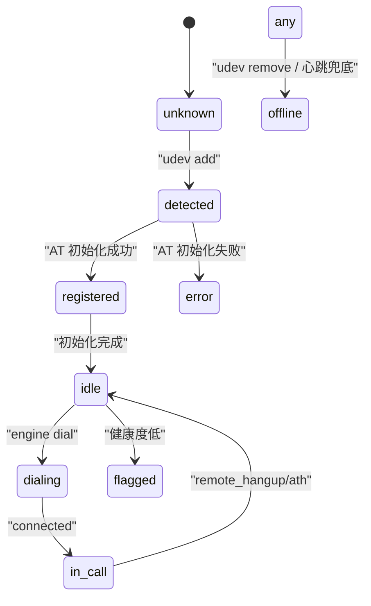
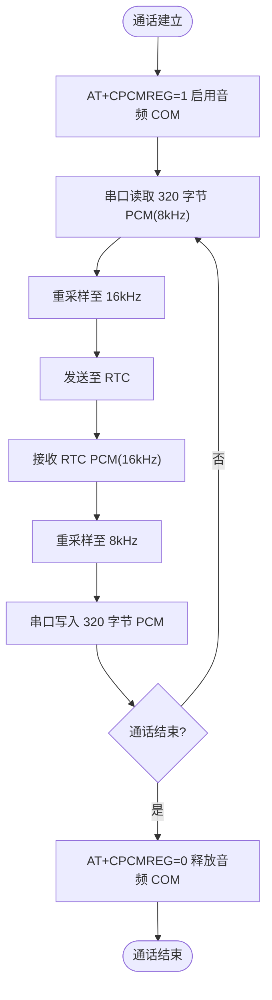
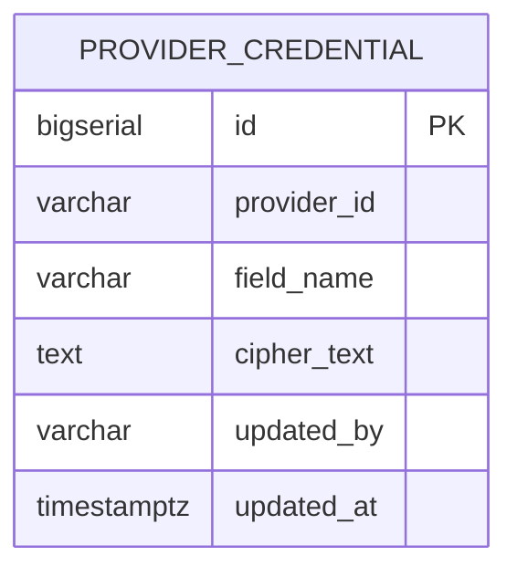
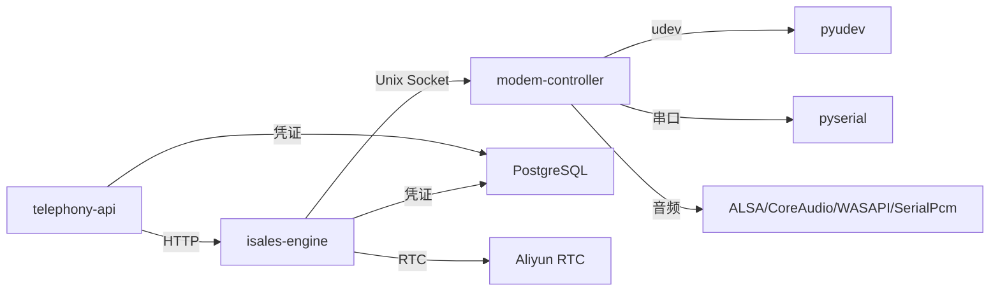

# 硬件集成系统

<cite>
**本文档引用的文件**
- [device-hardware 规范](file://openspec/specs/device-hardware/spec.md)
- [provider-credential 规范](file://openspec/specs/provider-credential/spec.md)
- [modem-controller 环境配置示例](file://deploy/env/modem-controller.env.example)
- [telephony-api 环境配置示例](file://deploy/env/telephony-api.env.example)
- [A1 实现 ATClient 设计说明](file://openspec/changes/archive/2026-05-17-impl-real-at/design.md)
- [A1 实现 ATClient 验收说明](file://openspec/changes/archive/2026-05-17-impl-real-at/acceptance.md)
- [Windows 客户端核心设计说明](file://openspec/changes/archive/2026-05-17-windows-client-core/design.md)
- [macOS 本地音频开发路径规范](file://openspec/changes/macos-local-audio-dev/specs/device-hardware/spec.md)
</cite>

## 目录
1. [简介](#简介)
2. [项目结构](#项目结构)
3. [核心组件](#核心组件)
4. [架构总览](#架构总览)
5. [详细组件分析](#详细组件分析)
6. [依赖关系分析](#依赖关系分析)
7. [性能考虑](#性能考虑)
8. [故障排查指南](#故障排查指南)
9. [结论](#结论)
10. [附录](#附录)

## 简介
本文件面向 iSales 硬件集成系统，围绕 USB GSM Modem 控制、设备管理与 SIM 卡绑定、音频处理、设备状态管理、硬件异常处理、硬件抽象层设计以及 Provider 凭证管理进行系统化技术说明。文档基于仓库中的 openspec 规范与部署示例，结合实际实现约束，为开发者提供可操作的集成指南、最佳实践与扩展建议。

## 项目结构
- openspec/specs/device-hardware/spec.md：定义硬件层职责、IPC 协议、设备状态机、SIM 管理与热插拔流程。
- openspec/specs/provider-credential/spec.md：定义 Provider 凭证的加密存储、SSOT（单一事实来源）与管理接口。
- deploy/env/modem-controller.env.example：modem-controller 进程的环境变量配置示例。
- deploy/env/telephony-api.env.example：telephony-api 进程的环境变量配置示例。
- openspec/changes/archive/2026-05-17-impl-real-at/design.md：ATClient 抽象与实现策略的设计说明。
- openspec/changes/archive/2026-05-17-impl-real-at/acceptance.md：A1 验收中关于 ATClient 生产路径的定位。
- openspec/changes/archive/2026-05-17-windows-client-core/design.md：Windows 平台音频 PCM 通道与驱动契约。
- openspec/changes/macos-local-audio-dev/specs/device-hardware/spec.md：macOS 开发态本地音频路径规范。

```mermaid
graph TB
subgraph "边缘进程"
API["telephony-api(HTTP)"]
MC["modem-controller(Daemon)"]
ENG["isales-engine"]
WRK["isales-worker"]
end
subgraph "硬件层"
UDEV["udev 监听器"]
AT["AT 命令通道"]
PCM["PCM 音频管道"]
MODEM["USB GSM Modem"]
end
subgraph "云侧"
CLOUD["Aliyun RTC Engine"]
end
API <- --> ENG
ENG <- --> MC
MC <- --> UDEV
MC <- --> AT
MC <- --> PCM
PCM <- --> MODEM
ENG <- --> CLOUD
WRK <- --> API
```

**图表来源**
- [device-hardware 规范:26-44](file://openspec/specs/device-hardware/spec.md#L26-L44)
- [device-hardware 规范:106-136](file://openspec/specs/device-hardware/spec.md#L106-L136)

**章节来源**
- [device-hardware 规范:1-525](file://openspec/specs/device-hardware/spec.md#L1-L525)
- [modem-controller 环境配置示例:1-15](file://deploy/env/modem-controller.env.example#L1-L15)
- [telephony-api 环境配置示例:1-12](file://deploy/env/telephony-api.env.example#L1-L12)

## 核心组件
- modem-controller：负责 udev 监听、AT 命令通道与 PCM 音频管道，通过本地 Unix Socket 与 engine 通信。
- ATClient 抽象与实现：定义统一 AT 命令接口，提供 MockATClient（开发/CI）与 SerialATClient（v1 生产）两种实现。
- ModemDriver：针对不同厂商（A7670 / SIM800C / Quectel UC20）的驱动抽象与适配。
- 设备与 SIM 管理：设备状态机、SIM 资料化、device_sim_binding 唯一活跃约束与热插拔绑定变更。
- Provider 凭证管理：Fernet 对称加密、SSOT、UI 管理端点与审计追踪。
- 音频处理：8kHz PCM 原生帧格式、上下行重采样、跨平台音频后端（ALSA/Linux、CoreAudio/macOS、SerialPcm-over-COM/Windows）。

**章节来源**
- [device-hardware 规范:26-44](file://openspec/specs/device-hardware/spec.md#L26-L44)
- [device-hardware 规范:69-87](file://openspec/specs/device-hardware/spec.md#L69-L87)
- [provider-credential 规范:6-15](file://openspec/specs/provider-credential/spec.md#L6-L15)
- [A1 实现 ATClient 设计说明:1-20](file://openspec/changes/archive/2026-05-17-impl-real-at/design.md#L1-L20)

## 架构总览
系统采用“边缘硬件控制 + 云端 RTC”双层架构。边缘进程（modem-controller）直连 USB GSM Modem，完成设备发现、AT 命令控制与 PCM 音频转发；engine 通过本地 IPC 与边缘交互，最终通过 Aliyun RTC 与云端引擎通信。



**图表来源**
- [device-hardware 规范:106-136](file://openspec/specs/device-hardware/spec.md#L106-L136)
- [device-hardware 规范:38-44](file://openspec/specs/device-hardware/spec.md#L38-L44)
- [Windows 客户端核心设计说明:132-165](file://openspec/changes/archive/2026-05-17-windows-client-core/design.md#L132-L165)

## 详细组件分析

### USB GSM Modem 控制与 AT 命令通道
- ATClient 抽象：定义 dial/hangup/get_signal/get_iccid/get_imei 等方法，确保上层 handlers/state machine 与底层硬件解耦。
- 实现策略：
  - SerialATClient：v1 生产实现，持有 pyserial 串口、serial_protocol.AtClient（URC 队列）与 ModemDriver 实例。
  - MockATClient：开发/CI 使用，返回固定 ICCID/IMEI 与 RSSI，模拟 5 秒通话。
- 环境调度：严格按 ISALES_MODEM_SERIAL_PATH/ISALES_ALLOW_MOCK_AT 决定实现，生产环境不允许静默回退到 Mock。
- 串口互斥：POSIX 使用 flock 独占锁，Windows 依赖 OS 级 exclusive open；冲突时抛 BusyDeviceError。
- URC → ATEvent 翻译：dial() 在 ATD 被接受后立即返回 call_id 与事件流；真正 CONNECT URC 到达后才 yield connected；远端挂断按 HANGUP_CAUSE_MAP 映射。



**图表来源**
- [A1 实现 ATClient 设计说明:6-11](file://openspec/changes/archive/2026-05-17-impl-real-at/design.md#L6-L11)
- [device-hardware 规范:270-300](file://openspec/specs/device-hardware/spec.md#L270-L300)

**章节来源**
- [device-hardware 规范:270-300](file://openspec/specs/device-hardware/spec.md#L270-L300)
- [device-hardware 规范:301-334](file://openspec/specs/device-hardware/spec.md#L301-L334)
- [A1 实现 ATClient 设计说明:1-20](file://openspec/changes/archive/2026-05-17-impl-real-at/design.md#L1-L20)

### 设备管理与 SIM 卡绑定机制
- 设备状态机：unknown → detected → registered → idle → dialing → in_call → idle；USB 拔出 → offline；idle/in_call → flagged（健康度低）；detected → error（AT 初始化失败）。
- SIM 资料化：sim_card 表含 iccid/imsi/phone_number/carrier/plan/balance/signal_strength/status/last_checked_at。
- device_sim_binding：同一 device 同一时刻最多 1 条 is_active=true；热插拔检测到 ICCID 变更时，关闭旧绑定并新建活跃绑定。
- udev 自动检测：add 事件时识别 GSM modem、查询 ICCID/厂商/IMEI、更新/创建 device 记录、检查并变更绑定；remove 事件时置 offline 并关闭 active binding。



**图表来源**
- [device-hardware 规范:45-67](file://openspec/specs/device-hardware/spec.md#L45-L67)
- [device-hardware 规范:88-105](file://openspec/specs/device-hardware/spec.md#L88-L105)

**章节来源**
- [device-hardware 规范:45-105](file://openspec/specs/device-hardware/spec.md#L45-L105)

### 音频处理流程与跨平台后端
- 帧格式与重采样：上行 8kHz/16-bit/LE/mono/20ms 帧（320 字节）→ 重采样 16kHz；下行 16kHz → 重采样 8kHz → ALSA/WASAPI/SerialPcm 输出。
- Linux/macOS：ALSA/CoreAudio 后端；Windows：SerialPcm-over-COM（SIMCom MI_04 音频接口暴露为 Class=Ports 的串口 COM）。
- PCM 生命周期：connected 后 AT+CPCMREG=1 启用音频 COM；teardown 后 AT+CPCMREG=0 释放；期间 read/write 以 320 字节帧为单位，timeout 约 20ms。
- 开发态 macOS 本地音频：dev-only 模式，使用系统默认麦克风/扬声器，不接入远端 RTC，仅用于策略与工程闭环演练。



**图表来源**
- [Windows 客户端核心设计说明:132-165](file://openspec/changes/archive/2026-05-17-windows-client-core/design.md#L132-L165)
- [device-hardware 规范:372-398](file://openspec/specs/device-hardware/spec.md#L372-L398)
- [macOS 本地音频开发路径规范:26-43](file://openspec/changes/macos-local-audio-dev/specs/device-hardware/spec.md#L26-L43)

**章节来源**
- [device-hardware 规范:372-398](file://openspec/specs/device-hardware/spec.md#L372-L398)
- [Windows 客户端核心设计说明:132-165](file://openspec/changes/archive/2026-05-17-windows-client-core/design.md#L132-L165)
- [macOS 本地音频开发路径规范:26-43](file://openspec/changes/macos-local-audio-dev/specs/device-hardware/spec.md#L26-L43)

### 硬件异常处理与心跳兜底
- 心跳与失联探测：modem-controller 每 30s 向 telephony-api 发送心跳（PATCH /devices/{id}/heartbeat，携带 signal_strength），isales-worker 每 30s 执行 watchdog，将 last_seen_at 超过 120s 的设备置 offline。
- 竞态保护：udev 拔出与 watchdog 同时检测时，udev 直接置 offline；watchdog 使用 WHERE status != 'offline' 幂等更新。
- 心跳恢复：进程崩溃后恢复，心跳仅更新 last_seen_at，status 恢复由 udev 注册路径或运维手动 PATCH 触发。

**章节来源**
- [device-hardware 规范:208-236](file://openspec/specs/device-hardware/spec.md#L208-L236)

### 硬件抽象层设计思路
- 平台后端共享协议：CaptureBackend/read_chunk()/close() 与 PlaybackBackend/write_chunk()/close()，统一于 audio_pipe.py，上层业务逻辑不因平台分支。
- 平台选择：边缘进程根据 sys.platform 自动选择后端，不通过环境变量强制覆盖。
- Windows 特例：SIMCom 在 Windows 无 USB Audio Class endpoint，采用 SerialPcm-over-COM；未来如引入显式注册 USB Audio Class endpoint 的 SKU，另行评估引入。

**章节来源**
- [device-hardware 规范:346-403](file://openspec/specs/device-hardware/spec.md#L346-L403)
- [Windows 客户端核心设计说明:132-165](file://openspec/changes/archive/2026-05-17-windows-client-core/design.md#L132-L165)

### Provider 凭证管理系统
- SSOT（单一事实来源）：provider_credential 表为运行时唯一事实来源，覆盖 api_key/app_key/app_token/endpoint/default_model/enabled。
- 加密与掩码：Fernet 对称加密，统一 CredentialStore 类封装 encrypt/decrypt/mask；UI 暴露始终掩码。
- 管理端点：/api/provider-credentials 暴露 JWT 鉴权 CRUD；写入触发审计（updated_by 为 JWT sub，updated_at 为 now）。
- 启动装载：isales-engine 在启动期一次性从 DB 装载并解密缓存；默认 required=true 时装载失败硬失败。
- 迁移工具：isales-cred-migrate 提供 import-env/export-env 子命令，支持 dry-run 与 idempotent 写入。



**图表来源**
- [provider-credential 规范:82-91](file://openspec/specs/provider-credential/spec.md#L82-L91)

**章节来源**
- [provider-credential 规范:6-50](file://openspec/specs/provider-credential/spec.md#L6-L50)
- [provider-credential 规范:107-139](file://openspec/specs/provider-credential/spec.md#L107-L139)
- [provider-credential 规范:170-196](file://openspec/specs/provider-credential/spec.md#L170-L196)

## 依赖关系分析
- 进程耦合：telephony-api 与 modem-controller 同仓库、不同可执行体；engine 通过本地 IPC 与 modem-controller 通信。
- 外部依赖：pyudev（udev 监听）、pyserial（串口通信）、Fernet（凭证加密）、Aliyun RTC SDK（跨平台绑定）。
- 环境一致性：各服务的 ISALES_DATABASE_URL/ISALES_REDIS_URL/ISALES_JWT_SECRET 必须一致。



**图表来源**
- [device-hardware 规范:14-24](file://openspec/specs/device-hardware/spec.md#L14-L24)
- [device-hardware 规范:106-136](file://openspec/specs/device-hardware/spec.md#L106-L136)
- [provider-credential 规范:10-15](file://openspec/specs/provider-credential/spec.md#L10-L15)

**章节来源**
- [device-hardware 规范:14-24](file://openspec/specs/device-hardware/spec.md#L14-L24)
- [telephony-api 环境配置示例:4-7](file://deploy/env/telephony-api.env.example#L4-L7)

## 性能考虑
- 音频延迟 SLA：Windows SerialPcm 路径端到端 P95 ≤ 50ms；如不达标，可调整 pyserial read timeout 或减小帧数，持续不达标上报 HardwareAlert 并触发挂断。
- 串口互斥与独占：POSIX 使用 flock，Windows 使用 exclusive open，避免串口竞争导致的抖动与失败。
- 重采样与帧格式：统一 8kHz/16kHz 重采样与 20ms 帧，减少跨层转换开销。
- 心跳与 watchdog：30s 心跳 + 120s watchdog，平衡实时性与容错性。

**章节来源**
- [device-hardware 规范:394-398](file://openspec/specs/device-hardware/spec.md#L394-L398)
- [device-hardware 规范:327-334](file://openspec/specs/device-hardware/spec.md#L327-L334)

## 故障排查指南
- 环境变量与实现选择
  - 确认 ISALES_MODEM_SERIAL_PATH 指向正确串口；若未设置且 ISALES_ALLOW_MOCK_AT=1，则使用 MockATClient；否则抛错并退出。
  - 生产环境不允许静默回退到 Mock。
- 串口占用与权限
  - 若串口被其他进程占用，POSIX 将抛 BusyDeviceError；Windows 将因 Access Denied 抛错；请释放占用或检查权限。
- 设备状态异常
  - detected → error：AT 初始化失败，检查波特率、AT 命令支持与 SIM 卡状态。
  - USB 拔出 → offline：udev 正常触发；若无响应，检查 udev 事件与驱动。
- 心跳与离线
  - last_seen_at 长时间未更新 → offline：检查 modem-controller 进程、网络与 watchdog。
- 凭证装载失败
  - 默认 credentials_required=true 时，DB 不可达或 Fernet 解密失败将硬失败；dev/CI 可设置 credentials_required=false 使用 mock 分支。
- 真硬件冒烟
  - 使用 scripts/at_smoke.py 验证 SerialATClient 是否打通真 modem，查看 ATEvent 序列与 hangup 行为。

**章节来源**
- [device-hardware 规范:282-290](file://openspec/specs/device-hardware/spec.md#L282-L290)
- [device-hardware 规范:327-334](file://openspec/specs/device-hardware/spec.md#L327-L334)
- [provider-credential 规范:35-50](file://openspec/specs/provider-credential/spec.md#L35-L50)

## 结论
iSales 硬件集成系统通过清晰的硬件抽象层、严格的 ATClient 实现策略与跨平台音频后端，实现了从设备发现、SIM 管理到通话控制与音频传输的完整链路。配合 Provider 凭证的 SSOT 与加密管理，系统在安全性与可维护性方面具备良好基础。生产部署建议遵循环境变量与实现选择约束，关注串口互斥、心跳兜底与音频延迟 SLA，确保稳定运行。

## 附录

### 硬件集成示例与配置参数
- modem-controller 环境变量
  - ISALES_DATABASE_URL：数据库连接串
  - ISALES_MODEM_SOCKET：与 engine 通信的 Unix Socket 路径
  - ISALES_MODEM_SERIAL_PATH：串口路径（Linux:/dev/ttyUSB*；macOS:/dev/cu.usbmodem*）
  - ISALES_ALLOW_MOCK_AT：允许使用 MockATClient（开发/CI）
- telephony-api 环境变量
  - ISALES_DATABASE_URL/ISALES_REDIS_URL/ISALES_JWT_SECRET：与各服务保持一致

**章节来源**
- [modem-controller 环境配置示例:7-14](file://deploy/env/modem-controller.env.example#L7-L14)
- [telephony-api 环境配置示例:9-11](file://deploy/env/telephony-api.env.example#L9-L11)

### 兼容性信息
- 平台支持：Linux/macOS（ALSA/CoreAudio）与 Windows（SerialPcm-over-COM）。
- 设备识别：Windows 通过 VID:PID 白名单 + AT 试探识别 GSM modem；macOS/Linux 通过 udev 与串口识别。
- RTC 集成：macOS 开发态可使用 PyObjC 绑定 Aliyun RTC SDK；生产路径仍为 Windows + 真 GSM modem + 真 Aliyun RTC。

**章节来源**
- [device-hardware 规范:344-403](file://openspec/specs/device-hardware/spec.md#L344-L403)
- [A1 实现 ATClient 验收说明:82-95](file://openspec/changes/archive/2026-05-17-impl-real-at/acceptance.md#L82-L95)

### 开发者扩展指南
- 新增 ModemDriver：在 drivers.py 中新增子类，实现 detect_driver/dial/hangup；在 SerialATClient 中通过 hint 参数启用自动检测或强制指定。
- 新增音频后端：实现 CaptureBackend/PlaybackBackend 协议，确保帧格式与重采样策略一致；在 audio_pipe.py 中复用重采样逻辑。
- 新增 Provider：通过 /api/provider-credentials 管理凭据，确保字段名与枚举对齐；使用 isales-cred-migrate 进行迁移与回滚。

**章节来源**
- [device-hardware 规范:291-295](file://openspec/specs/device-hardware/spec.md#L291-L295)
- [provider-credential 规范:82-91](file://openspec/specs/provider-credential/spec.md#L82-L91)