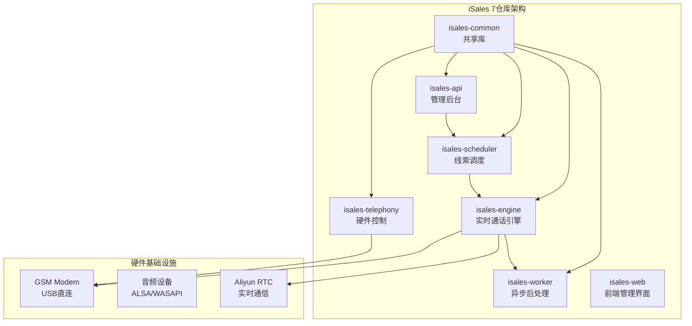
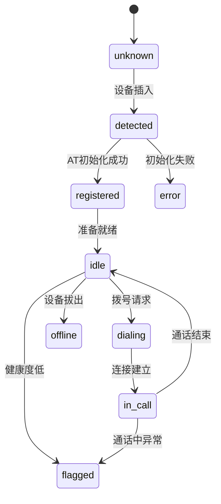
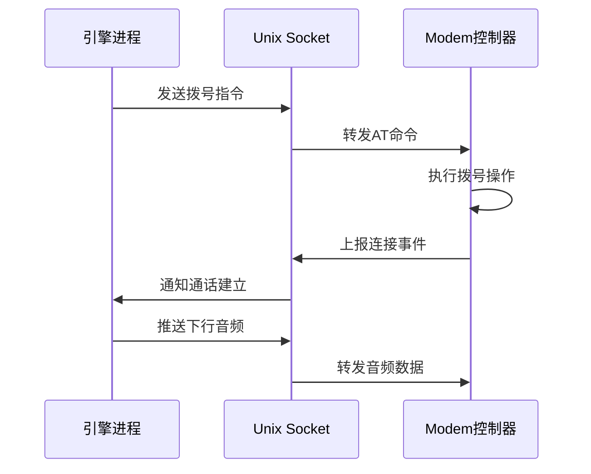
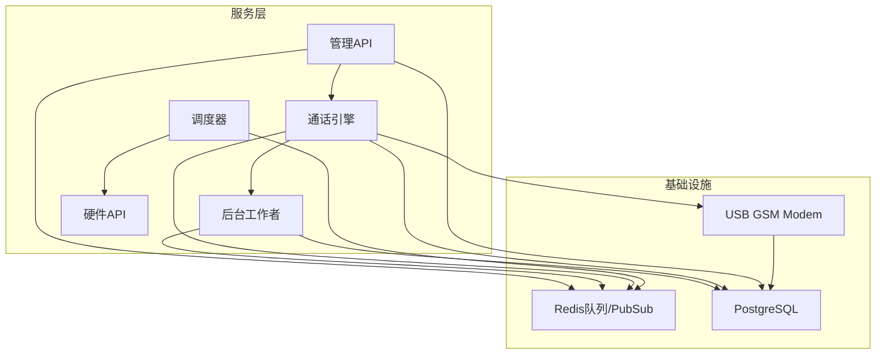
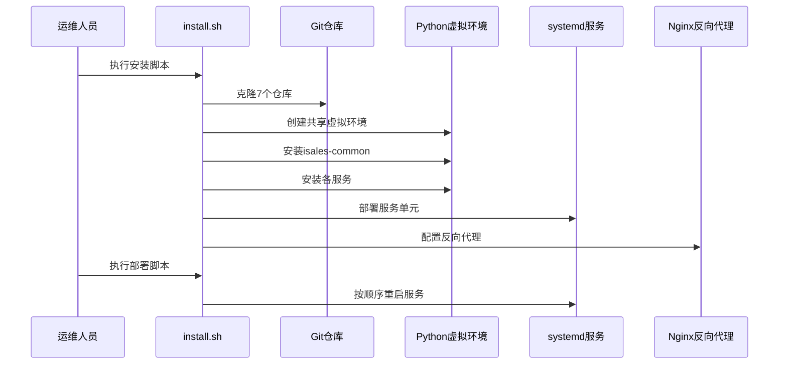
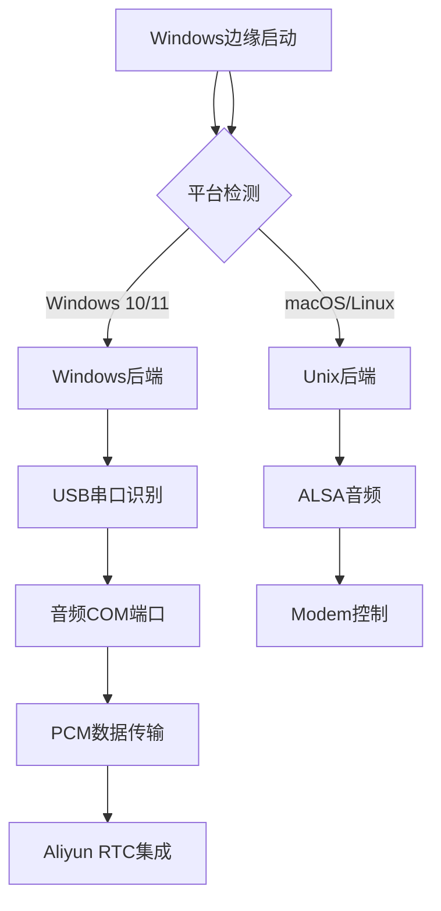
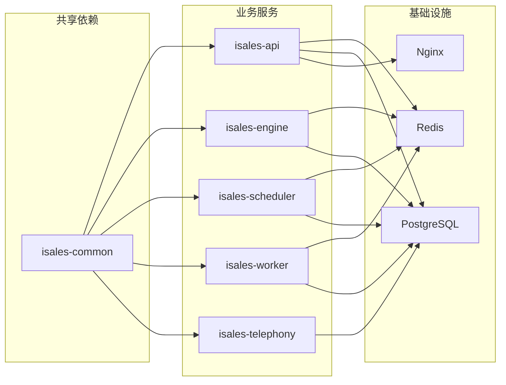
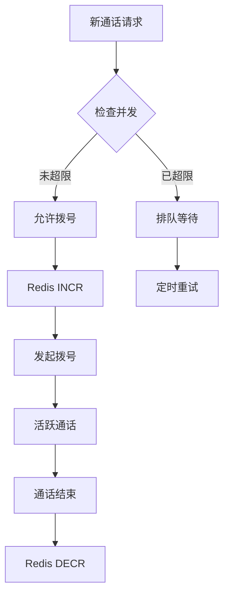

# 硬件集成系统设计

<cite>
**本文档引用的文件**
- [README.md](file://README.md)
- [DESIGN.md](file://DESIGN.md)
- [deploy/README.md](file://deploy/README.md)
- [openspec/specs/architecture/spec.md](file://openspec/specs/architecture/spec.md)
- [openspec/specs/deployment-topology/spec.md](file://openspec/specs/deployment-topology/spec.md)
- [openspec/specs/device-hardware/spec.md](file://openspec/specs/device-hardware/spec.md)
- [openspec/specs/service-communication/spec.md](file://openspec/specs/service-communication/spec.md)
- [openspec/specs/data-model/spec.md](file://openspec/specs/data-model/spec.md)
- [openspec/specs/call-state-machine/spec.md](file://openspec/specs/call-state-machine/spec.md)
- [openspec/specs/ai-pipeline/spec.md](file://openspec/specs/ai-pipeline/spec.md)
- [deploy/linux/scripts/install.sh](file://deploy/linux/scripts/install.sh)
- [deploy/linux/scripts/deploy.sh](file://deploy/linux/scripts/deploy.sh)
- [deploy/common/_lib.sh](file://deploy/common/_lib.sh)
- [deploy/env/api.env.example](file://deploy/env/api.env.example)
</cite>

## 目录
1. [简介](#简介)
2. [项目结构](#项目结构)
3. [核心组件](#核心组件)
4. [架构概览](#架构概览)
5. [详细组件分析](#详细组件分析)
6. [依赖分析](#依赖分析)
7. [性能考虑](#性能考虑)
8. [故障排除指南](#故障排除指南)
9. [结论](#结论)

## 简介

iSales是一个基于OpenSpec规范的AI外呼销售系统，专注于硬件集成和实时通话处理。该系统采用7个独立的Git仓库进行微服务架构设计，实现了从云端到边缘设备的完整硬件控制链路。

系统的核心特点包括：
- **单主机部署模型**：所有服务在同一台服务器上运行，支持≤8路并发
- **自研硬件控制层**：专为USB GSM Modem设计的modem-controller进程
- **实时通话引擎**：基于状态机的AI三层管线处理
- **统一JWT鉴权**：isales-api作为唯一JWT签发方
- **集中化环境管理**：通过/etc/isales/env/统一管理所有服务的环境变量

## 项目结构

iSales项目采用多仓库微服务架构，每个仓库负责特定的功能领域：



**图表来源**
- [openspec/specs/architecture/spec.md:1-168](file://openspec/specs/architecture/spec.md#L1-L168)
- [README.md:1-86](file://README.md#L1-L86)

**章节来源**
- [README.md:1-86](file://README.md#L1-L86)
- [DESIGN.md:1-75](file://DESIGN.md#L1-L75)

## 核心组件

### 硬件控制层 (modem-controller)

modem-controller是系统的核心硬件控制组件，负责管理USB GSM Modem的完整生命周期：

#### 主要职责
- **udev监听器**：自动检测USB设备的插入和拔出事件
- **AT命令通道**：通过串口发送AT命令控制Modem
- **PCM音频管道**：处理8kHz/16kHz音频重采样和双向传输

#### 设备状态机
系统定义了完整的设备状态转换流程：



**图表来源**
- [openspec/specs/device-hardware/spec.md:47-52](file://openspec/specs/device-hardware/spec.md#L47-L52)

#### IPC通信协议
engine与modem-controller之间使用本地Unix socket进行通信，采用JSON消息格式：



**图表来源**
- [openspec/specs/device-hardware/spec.md:106-136](file://openspec/specs/device-hardware/spec.md#L106-L136)

**章节来源**
- [openspec/specs/device-hardware/spec.md:1-525](file://openspec/specs/device-hardware/spec.md#L1-L525)

### 通话状态机

通话状态机是引擎的核心控制逻辑，定义了完整的通话生命周期：

#### 状态集合
- `INIT`：拨号尝试中
- `GREETING`：开场白播放
- `LISTENING`：等待用户说话
- `SPEAKING`：TTS播放AI回复
- `INTERRUPTED`：用户说话被打断
- `FILLER`：垫词播放
- `PROCESSING`：AI三层管线运行
- `WRAPPING_UP`：目标达成后的收尾
- `ACTIVATING`：沉默激活话术
- `TRANSFERRING`：转人工流程
- `END`：通话结束

#### 关键转换规则
状态转换严格遵循业务逻辑，每个转换都会记录到通话记录中：

```mermaid
flowchart TD
INIT --> GREETING : connected事件
GREETING --> LISTENING : 开场白完成
LISTENING --> PROCESSING : ASR speech_end
PROCESSING --> SPEAKING : 产出回复
SPEAKING --> LISTENING : TTS完成
LISTENING --> ACTIVATING : 沉默超时
PROCESSING --> WRAPPING_UP : goal_achieved=true
WRAPPING_UP --> END : 收尾完成
TRANSFERRING --> END : 主动挂断
END --> [*]
```

**图表来源**
- [openspec/specs/call-state-machine/spec.md:46-109](file://openspec/specs/call-state-machine/spec.md#L46-L109)

**章节来源**
- [openspec/specs/call-state-machine/spec.md:1-190](file://openspec/specs/call-state-machine/spec.md#L1-L190)

### AI三层管线

系统采用并行的AI三层处理架构：

#### 第一层：角色LLM并行生成
- N个角色LLM同时生成候选回复
- 强制JSON模式输出
- 每个角色使用独立的提示词和模型

#### 第二层：裁判LLM并行审查
- 每个候选经过M个裁判的并行审查
- 任一裁判否决即淘汰候选
- 审查基于预定义的合规性标准

#### 第三层：润色LLM选优
- 从通过裁判的候选中选择最优回复
- 进行拟人化改写
- 保持标记字段不变

**章节来源**
- [openspec/specs/ai-pipeline/spec.md:1-166](file://openspec/specs/ai-pipeline/spec.md#L1-L166)

## 架构概览

### 服务通信矩阵

系统采用多种通信方式实现服务间的协作：



**图表来源**
- [openspec/specs/service-communication/spec.md:7-25](file://openspec/specs/service-communication/spec.md#L7-L25)

### 数据模型设计

系统采用统一的SQLAlchemy模型管理所有数据：

| 表名 | 关键字段 | 归属服务 | 用途 |
|------|----------|----------|------|
| `device` | name, usb_port, status, last_seen_at | telephony | GSM Modem设备信息 |
| `sim_card` | iccid, phone_number, carrier, signal_strength | telephony | SIM卡资料 |
| `call_record` | lead_id, campaign_id, status, transcript | engine | 通话记录 |
| `pipeline_trace` | call_record_id, role_candidates, polish_output | engine | AI管线追踪 |
| `callback_config` | campaign_id, url, method, payload_template | api | Webhook配置 |

**章节来源**
- [openspec/specs/data-model/spec.md:1-83](file://openspec/specs/data-model/spec.md#L1-L83)

## 详细组件分析

### 部署架构

系统支持Linux和macOS两种部署模型，但v1版本主要针对Linux环境：

#### Linux部署流程



**图表来源**
- [deploy/linux/scripts/install.sh:15-275](file://deploy/linux/scripts/install.sh#L15-L275)
- [deploy/linux/scripts/deploy.sh:80-114](file://deploy/linux/scripts/deploy.sh#L80-L114)

#### 环境变量管理

所有服务通过集中化的环境文件进行管理：

| 服务 | 环境文件 | 关键变量 |
|------|----------|----------|
| isales-api | api.env | ISALES_DATABASE_URL, ISALES_REDIS_URL, ISALES_JWT_SECRET |
| isales-engine | engine.env | ISALES_ENGINE_CONFIG |
| isales-scheduler | scheduler.env | ISALES_SCHEDULER_CONFIG |
| isales-worker | worker.env | ISALES_WORKER_CONFIG |
| isales-telephony-api | telephony-api.env | ISALES_TELEPHONY_CONFIG |
| isales-modem-controller | modem-controller.env | ISALES_MODEM_SERIAL_PATH |

**章节来源**
- [deploy/README.md:1-112](file://deploy/README.md#L1-L112)
- [deploy/env/api.env.example:1-14](file://deploy/env/api.env.example#L1-L14)

### 硬件集成实现

#### Windows平台支持

系统为Windows边缘设备提供了专门的硬件集成方案：



**图表来源**
- [openspec/specs/device-hardware/spec.md:344-403](file://openspec/specs/device-hardware/spec.md#L344-L403)

#### 音频处理优化

系统针对不同平台进行了音频处理优化：

| 平台 | 音频后端 | 帧格式 | 延迟目标 |
|------|----------|--------|----------|
| Windows | SerialPcm-over-COM | 8kHz/16-bit/LE/20ms | ≤50ms |
| macOS | CoreAudio | 16kHz/16-bit/LE/20ms | ≤50ms |
| Linux | ALSA | 16kHz/16-bit/LE/20ms | ≤50ms |

**章节来源**
- [openspec/specs/device-hardware/spec.md:366-398](file://openspec/specs/device-hardware/spec.md#L366-L398)

## 依赖分析

### 服务间依赖关系



**图表来源**
- [openspec/specs/architecture/spec.md:26-58](file://openspec/specs/architecture/spec.md#L26-L58)

### 硬件依赖关系

系统对硬件有严格的依赖要求：

#### 硬件要求
- **USB GSM Modem**：支持AT命令的3G/4G USB调制解调器
- **音频设备**：支持8kHz采样的麦克风和扬声器
- **网络连接**：稳定的互联网连接用于RTC通信
- **存储空间**：≥200MB可用磁盘空间

#### 平台支持
- **Windows**：10 21H2+ / 11 (x64)，无需管理员权限
- **macOS**：14+ Apple Silicon，支持真Aliyun RTC
- **Linux**：Ubuntu 22.04 LTS (amd64)

**章节来源**
- [openspec/specs/deployment-topology/spec.md:10-16](file://openspec/specs/deployment-topology/spec.md#L10-L16)

## 性能考虑

### 延迟优化

系统针对通话延迟进行了专门优化：

#### 端到端延迟指标
- **麦克风到引擎**：≤20ms（Windows）/ ≤30ms（macOS/Linux）
- **引擎到扬声器**：≤20ms（Windows）/ ≤30ms（macOS/Linux）
- **总通话延迟**：≤50ms（P95）

#### 优化策略
1. **音频重采样**：在modem-controller中进行8kHz↔16kHz重采样
2. **缓冲区管理**：使用20ms固定帧长度减少抖动
3. **并发处理**：AI三层管线并行执行
4. **内存管理**：避免不必要的数据拷贝

### 并发控制

系统采用Redis原子计数器进行全局并发控制：



**图表来源**
- [openspec/specs/service-communication/spec.md:45-63](file://openspec/specs/service-communication/spec.md#L45-L63)

## 故障排除指南

### 常见硬件问题

#### Modem无法识别
1. **检查USB连接**：确认Modem正确插入
2. **权限问题**：确保用户在dialout组中
3. **驱动问题**：检查udev规则是否正确加载
4. **串口占用**：确认没有其他进程占用串口

#### 音频质量问题
1. **采样率不匹配**：检查Modem音频采样率设置
2. **缓冲区溢出**：调整音频缓冲区大小
3. **设备选择**：确认选择了正确的音频设备
4. **系统音频冲突**：检查是否有其他应用程序占用音频设备

### 系统监控

#### 关键监控指标
- **活跃通话数**：当前正在进行的通话数量
- **队列深度**：engine:dial队列中的待处理任务数
- **设备状态**：各Modem的在线状态和信号强度
- **错误率**：各服务的错误发生频率

#### 告警配置
系统提供基础的Prometheus监控配置，包括：
- engine:dial队列深度持续5分钟超阈值
- 设备flagged比例骤升
- callback失败率超过阈值
- PostgreSQL连接数超过最大连接数的80%

**章节来源**
- [deploy/README.md:95-112](file://deploy/README.md#L95-L112)

## 结论

iSales硬件集成系统通过精心设计的架构实现了从云端到边缘设备的完整控制链路。系统的主要优势包括：

1. **模块化设计**：7个独立仓库确保了良好的代码组织和职责分离
2. **硬件抽象**：通过modem-controller实现了硬件无关的抽象层
3. **实时性能**：针对通话延迟进行了专门优化，达到行业领先水平
4. **运维友好**：提供完整的部署脚本和监控配置
5. **扩展性**：为未来的多主机扩展预留了架构基础

该系统为AI外呼销售场景提供了可靠的硬件基础设施，支持≤8路并发的生产环境部署，为后续的功能扩展奠定了坚实的基础。