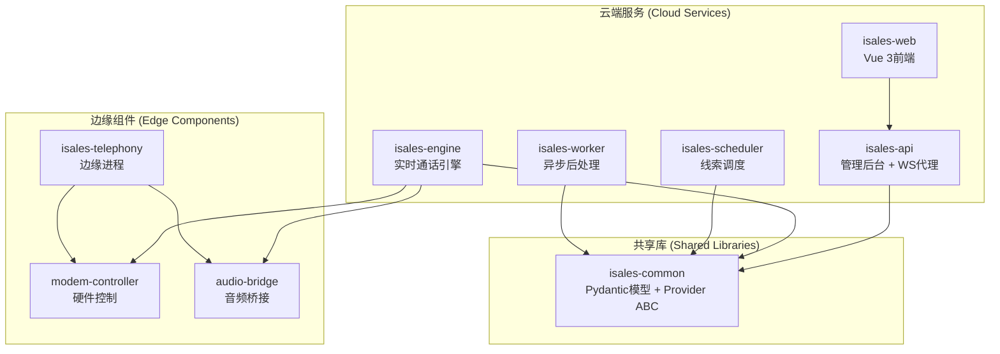
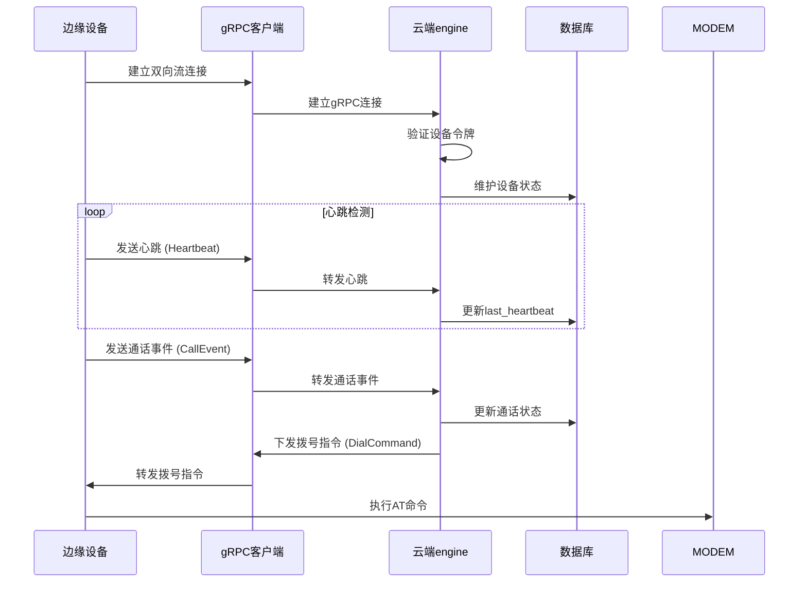
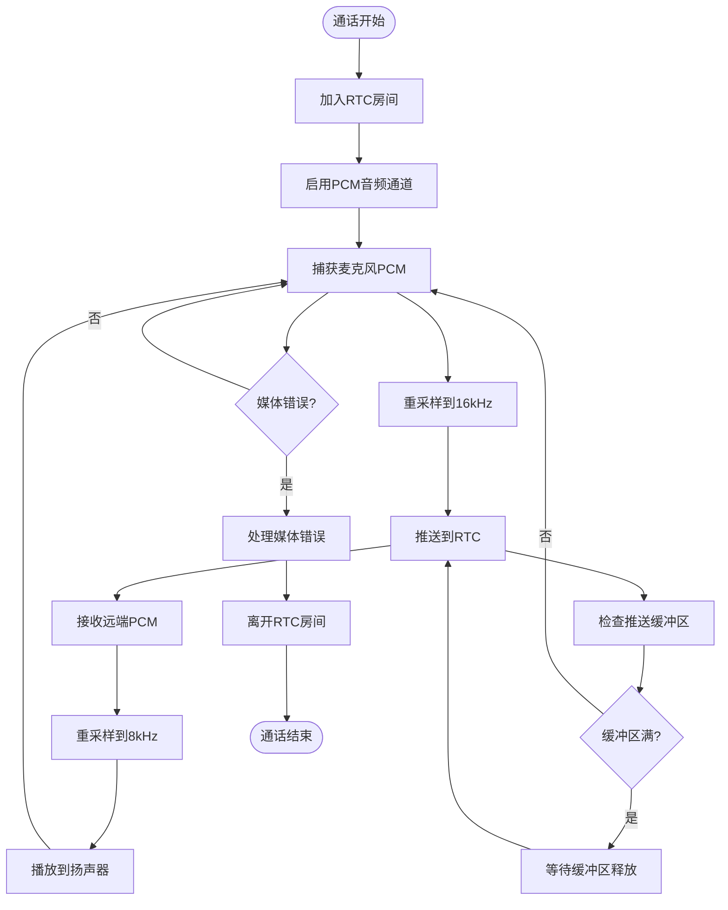
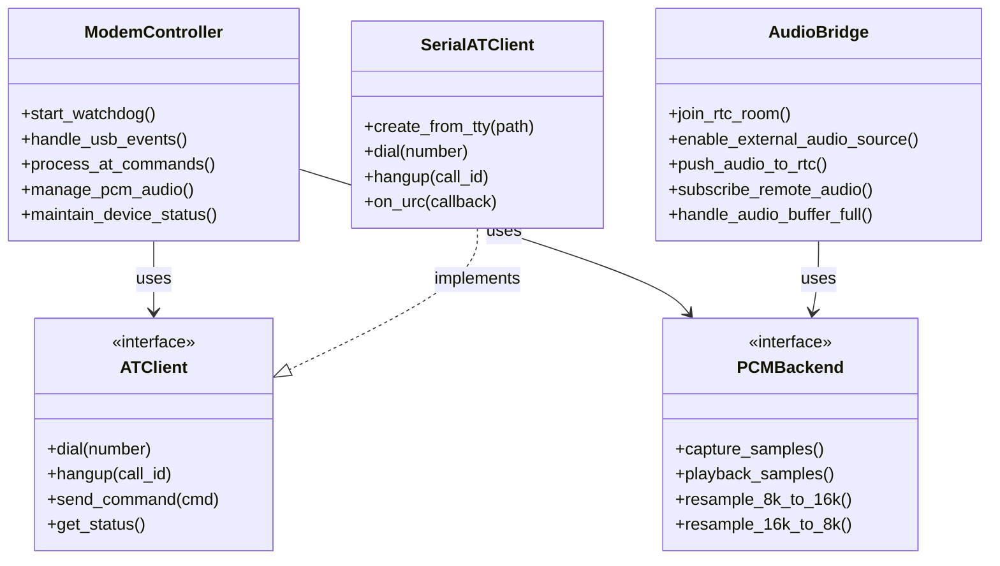
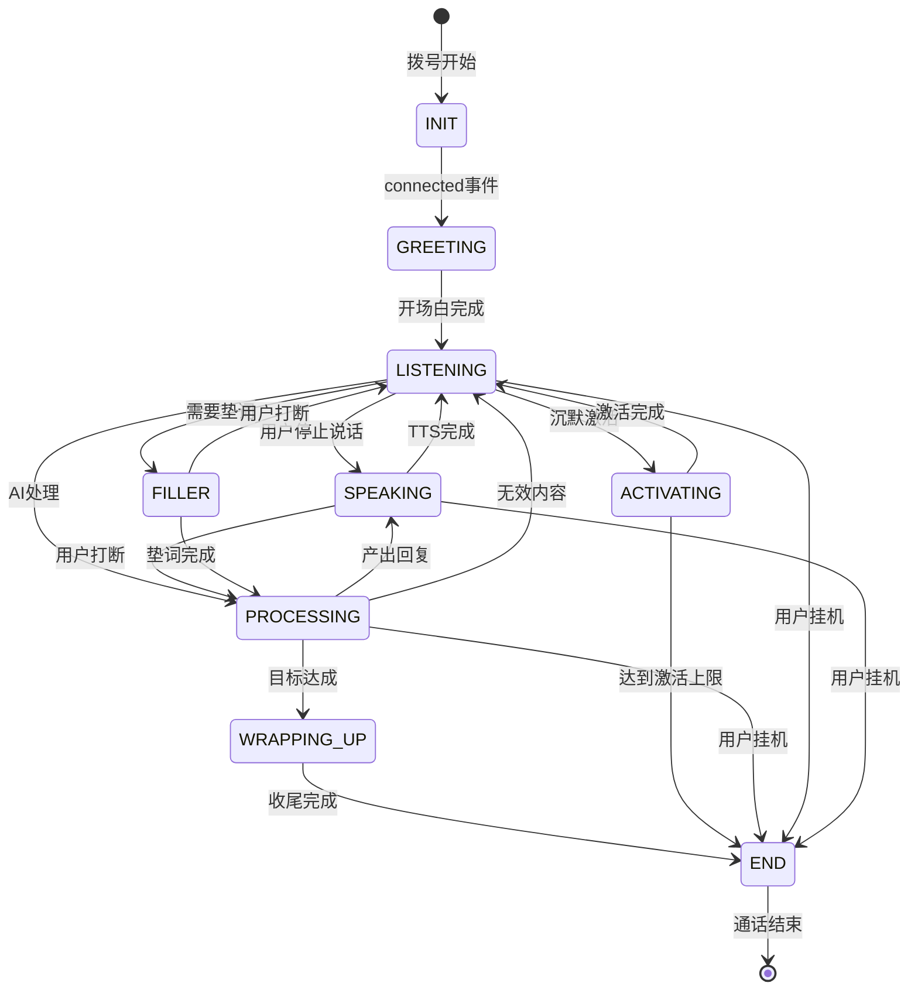
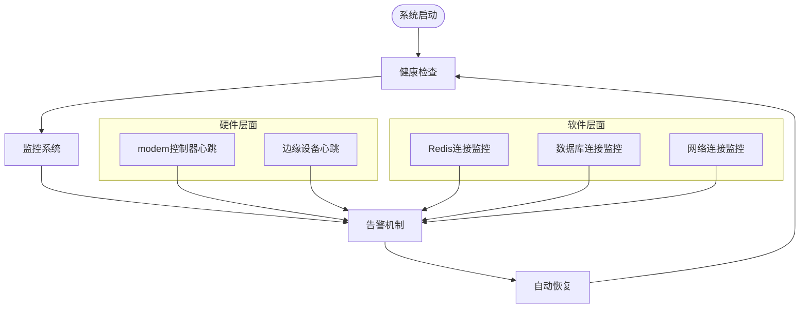

# 云-边分离架构

<cite>
**本文档引用的文件**
- [README.md](file://README.md)
- [DESIGN.md](file://DESIGN.md)
- [架构规范 - 总体架构](file://openspec/specs/architecture/spec.md)
- [部署拓扑规范](file://openspec/specs/deployment-topology/spec.md)
- [服务通信规范](file://openspec/specs/service-communication/spec.md)
- [设备硬件规范](file://openspec/specs/device-hardware/spec.md)
- [云边分离架构变更](file://openspec/changes/arch-cloud-edge-split/specs/architecture/spec.md)
- [云边分离通信规范](file://openspec/changes/arch-cloud-edge-split/specs/service-communication/spec.md)
- [云边分离设备硬件规范](file://openspec/changes/arch-cloud-edge-split/specs/device-hardware/spec.md)
- [云边 gRPC Keepalive 变更](file://openspec/changes/cloud-edge-grpc-keepalive/spec.md)
- [通话状态机规范](file://openspec/specs/call-state-machine/spec.md)
- [云侧运维手册](file://deploy/RUNBOOK-cloud.md)
- [边缘侧运维手册](file://deploy/RUNBOOK-edge.md)
</cite>

## 目录
1. [简介](#简介)
2. [项目结构](#项目结构)
3. [核心组件](#核心组件)
4. [架构概览](#架构概览)
5. [详细组件分析](#详细组件分析)
6. [依赖关系分析](#依赖关系分析)
7. [性能考量](#性能考量)
8. [故障排查指南](#故障排查指南)
9. [结论](#结论)

## 简介

iSales 系统采用先进的云-边分离架构，将传统的单体部署模式重构为云端服务与边缘设备的协同工作模式。该架构通过将AI编排、实时通话引擎等计算密集型任务集中在云端，将硬件控制、音频处理等实时性要求高的任务下沉到边缘，实现了更好的性能表现和可靠性保障。

这种设计理念的核心优势包括：
- **降低延迟**：边缘设备就近处理音频和硬件控制，减少网络传输时延
- **提高可靠性**：云端和边缘各自独立部署，避免单点故障影响整体系统
- **支持离线操作**：边缘设备具备本地缓存能力，可在网络中断时继续基本功能
- **增强扩展性**：支持水平扩展边缘节点，满足业务增长需求

## 项目结构

iSales系统采用7个独立的Git仓库进行模块化管理，每个仓库承担明确的职责边界：



**图表来源**
- [架构规范 - 总体架构:30-39](file://openspec/specs/architecture/spec.md#L30-L39)
- [云边分离架构变更:31-39](file://openspec/changes/arch-cloud-edge-split/specs/architecture/spec.md#L31-L39)

**章节来源**
- [README.md:8-14](file://README.md#L8-L14)
- [DESIGN.md:9-44](file://DESIGN.md#L9-L44)

## 核心组件

### 云端服务组件

云端部署包含5个核心服务，每个服务都有明确的职责分工：

| 服务名称 | 职责描述 | 规模 | 部署位置 |
|---------|----------|------|----------|
| isales-api | 管理后台CRUD操作，提供WS代理服务 | 中 | 云端 |
| isales-engine | 实时通话引擎，包含状态机和AI三层管线 | 大 | 云端 |
| isales-scheduler | 线索分发和时间窗口管理 | 小 | 云端 |
| isales-worker | 通话结束后的摘要处理和Webhook回调 | 中 | 云端 |
| isales-web | Vue 3前端管理界面 | 中 | 云端 |

### 边缘组件

边缘侧部署为单一进程，包含3个核心模块：

| 组件名称 | 职责描述 | 平台支持 |
|---------|----------|----------|
| modem-controller | USB GSM modem硬件控制，AT命令通道，PCM音频管道 | macOS / Windows |
| audio-bridge | 音频桥接模块，PCM重采样，阿里RTC SDK客户端 | macOS / Windows |
| cloud-edge gRPC client | 云端gRPC客户端，负责与云端engine通信 | macOS / Windows |

**章节来源**
- [架构规范 - 总体架构:30-39](file://openspec/specs/architecture/spec.md#L30-L39)
- [云边分离架构变更:31-39](file://openspec/changes/arch-cloud-edge-split/specs/architecture/spec.md#L31-L39)

## 架构概览

iSales系统的云-边分离架构通过两条主要通信通道实现云端和边缘的协同：

```mermaid
graph TB
subgraph "云端 (Cloud)"
subgraph "控制面 (Control Plane)"
API[isales-api]
ENGINE[isales-engine]
SCHEDULER[isales-scheduler]
WORKER[isales-worker]
REDIS[(Redis)]
POSTGRES[(PostgreSQL)]
end
subgraph "媒体面 (Media Plane)"
RTC[阿里RTC PaaS]
end
end
subgraph "边缘 (Edge)"
subgraph "控制面 (Control Plane)"
EDGE_CLIENT[cloud-edge gRPC client]
EDGE_BUFFER[(本地SQLite缓存)]
end
subgraph "媒体面 (Media Plane)"
MODEM[modem-controller]
AUDIO[audio-bridge]
RTC_CLIENT[RTC SDK客户端]
end
end
subgraph "物理连接"
NETWORK[公网网络]
MODEM_HW[USB GSM modem]
end
API <- --> REDIS
ENGINE <- --> REDIS
SCHEDULER <- --> REDIS
WORKER <- --> REDIS
ENGINE < --> API
SCHEDULER < --> ENGINE
WORKER < --> ENGINE
ENGINE < --> MODEM
ENGINE < --> RTC
EDGE_CLIENT < --> ENGINE
EDGE_CLIENT < --> EDGE_BUFFER
MODEM < --> MODEM_HW
AUDIO < --> RTC_CLIENT
RTC_CLIENT < --> RTC
NETWORK --- EDGE_CLIENT
NETWORK --- RTC
```

**图表来源**
- [服务通信规范:11-24](file://openspec/specs/service-communication/spec.md#L11-L24)
- [云边分离通信规范:7-22](file://openspec/changes/arch-cloud-edge-split/specs/service-communication/spec.md#L7-L22)

## 详细组件分析

### 云-边控制面通信协议

云-边控制面采用gRPC双向流式通信，确保实时性和可靠性：



**图表来源**
- [云边分离通信规范:147-160](file://openspec/changes/arch-cloud-edge-split/specs/service-communication/spec.md#L147-L160)

### 云-边媒体面通信协议

媒体面采用阿里RTC PaaS进行音频传输，确保高质量的通话体验：



**图表来源**
- [云边分离通信规范:167-195](file://openspec/changes/arch-cloud-edge-split/specs/service-communication/spec.md#L167-L195)

### 边缘设备硬件控制

边缘设备通过modem-controller实现对USB GSM modem的全面控制：



**图表来源**
- [设备硬件规范:26-44](file://openspec/specs/device-hardware/spec.md#L26-L44)
- [云边分离设备硬件规范:26-44](file://openspec/changes/arch-cloud-edge-split/specs/device-hardware/spec.md#L26-L44)

**章节来源**
- [云边分离通信规范:97-160](file://openspec/changes/arch-cloud-edge-split/specs/service-communication/spec.md#L97-L160)
- [设备硬件规范:106-131](file://openspec/specs/device-hardware/spec.md#L106-L131)

### 通话状态机管理

云端engine维护完整的通话状态机，确保通话流程的正确执行：



**图表来源**
- [通话状态机规范:5-21](file://openspec/specs/call-state-machine/spec.md#L5-L21)

**章节来源**
- [通话状态机规范:46-109](file://openspec/specs/call-state-machine/spec.md#L46-L109)

## 依赖关系分析

### 服务间通信依赖

云-边分离架构建立了清晰的服务间通信依赖关系：

```mermaid
graph LR
subgraph "云端服务依赖"
API[isales-api] --> REDIS[Redis]
API --> POSTGRES[PostgreSQL]
ENGINE[isales-engine] --> REDIS
ENGINE --> POSTGRES
SCHEDULER[isales-scheduler] --> REDIS
SCHEDULER --> POSTGRES
WORKER[isales-worker] --> REDIS
WORKER --> POSTGRES
WEB[isales-web] --> API
end
subgraph "边缘组件依赖"
TELEPHONY[isales-telephony] --> EDGE_DB[本地SQLite]
MODEM[modem-controller] --> MODEM_HW[USB GSM modem]
AUDIO[audio-bridge] --> RTC_SDK[阿里RTC SDK]
EDGE_CLIENT[cloud-edge gRPC client] --> ENGINE
end
subgraph "云-边通信"
ENGINE < --> EDGE_CLIENT
AUDIO < --> RTC_SDK
MODEM < --> EDGE_CLIENT
end
```

**图表来源**
- [服务通信规范:23-24](file://openspec/specs/service-communication/spec.md#L23-L24)
- [云边分离通信规范:14-21](file://openspec/changes/arch-cloud-edge-split/specs/service-communication/spec.md#L14-L21)

### 数据存储依赖

系统采用统一的数据存储策略，确保数据一致性和可靠性：

| 数据存储 | 用途 | 访问方式 | 备份策略 |
|---------|------|----------|----------|
| PostgreSQL (RDS) | 业务数据存储 | 通过ORM模型访问 | 每日增量备份，保留14天 |
| Redis (Tair) | 缓存和队列 | 直接连接 | AOF持久化，每日RDB快照 |
| 本地SQLite | 边缘离线缓存 | 直接文件访问 | 本地轮转，24小时容量 |

**章节来源**
- [部署拓扑规范:76-94](file://openspec/specs/deployment-topology/spec.md#L76-L94)
- [云边分离架构变更:51-69](file://openspec/changes/arch-cloud-edge-split/specs/architecture/spec.md#L51-L69)

## 性能考量

### 延迟优化策略

云-边分离架构通过多种策略优化系统延迟：

1. **边缘就近处理**：音频和硬件控制在边缘设备本地执行，减少网络传输
2. **专用通信通道**：控制面和媒体面分离，避免相互干扰
3. **异步处理机制**：使用Redis队列实现异步处理，提高系统吞吐量
4. **缓存策略**：Redis缓存热点数据，减少数据库访问

### 可靠性保障

系统采用多层次的可靠性保障机制：



**图表来源**
- [云边分离通信规范:85-94](file://openspec/changes/arch-cloud-edge-split/specs/service-communication/spec.md#L85-L94)

### 扩展性设计

系统支持水平扩展，满足业务增长需求：

| 扩展维度 | 当前状态 | 未来规划 |
|---------|----------|----------|
| 云端服务 | 单实例部署 | 多实例横向扩展 |
| 边缘设备 | 单机部署 | 多机水平扩展 |
| 数据库 | RDS托管 | 读写分离和分片 |
| 网络 | 单ECS | 负载均衡和CDN |

**章节来源**
- [部署拓扑规范:4-8](file://openspec/specs/deployment-topology/spec.md#L4-L8)
- [云边分离架构变更:22-25](file://openspec/changes/arch-cloud-edge-split/specs/architecture/spec.md#L22-L25)

## 故障排查指南

### 常见故障类型及处理

| 故障类型 | 症状 | 处理步骤 | 相关日志 |
|---------|------|----------|----------|
| gRPC连接失败 | 边缘设备离线 | 检查网络连通性和令牌有效性 | edge.log, engine.log |
| 音频质量问题 | 单向通话或延迟高 | 检查RTC SDK配置和网络质量 | audio.log, rtc.log |
| 硬件设备异常 | modem无法识别 | 检查USB连接和驱动程序 | modem.log |
| 数据库连接问题 | 服务无法访问数据库 | 检查连接池和网络策略 | db.log |

### 诊断工具和命令

```bash
# 检查边缘设备在线状态
curl -s http://127.0.0.1:8000/api/devices | jq

# 查看gRPC连接状态
journalctl -u isales-engine | grep -i "edge.*stream"

# 监控Redis队列深度
redis-cli --scan --pattern "engine:*" | xargs -I% redis-cli llen %

# 检查音频延迟
python3 -c "
import time
start = time.time()
# 音频处理逻辑
end = time.time()
print(f'音频处理耗时: {(end-start)*1000:.2f}ms')
"
```

### 紧急响应流程

```mermaid
flowchart TD
INCIDENT[故障发生] --> CLASSIFY[故障分类]
CLASSIFY --> CRITICAL{是否影响通话?}
CRITICAL --> |是| EMERGENCY[紧急响应]
CRITICAL --> |否| NORMAL[常规处理]
EMERGENCY --> NOTIFY[通知值班工程师]
NOTIFY --> ISOLATE[隔离故障影响]
ISOLATE --> RECOVER[快速恢复]
RECOVER --> VERIFY[验证恢复效果]
NORMAL --> ASSESS[评估影响范围]
ASSESS --> FIX[制定修复方案]
FIX --> TEST[测试修复方案]
TEST --> DEPLOY[部署修复]
VERIFY --> DOCUMENT[记录故障处理过程]
DEPLOY --> DOCUMENT
DOCUMENT --> [*]
```

**章节来源**
- [云侧运维手册:584-599](file://deploy/RUNBOOK-cloud.md#L584-L599)
- [边缘侧运维手册:241-254](file://deploy/RUNBOOK-edge.md#L241-L254)

## 结论

iSales系统的云-边分离架构通过精心设计的职责划分和通信协议，实现了高性能、高可靠性的外呼系统。该架构的核心优势体现在：

1. **技术架构优势**：云端专注AI编排和业务逻辑，边缘专注硬件控制和实时音频处理，充分发挥各自优势
2. **性能表现优异**：通过边缘就近处理和专用通信通道，显著降低了通话延迟
3. **可靠性保障完善**：多层次的心跳检测和自动恢复机制确保系统稳定运行
4. **扩展性强**：支持水平扩展，能够适应业务快速增长的需求

该架构为未来的功能扩展和技术演进奠定了坚实基础，是iSales系统成功的关键技术支撑。