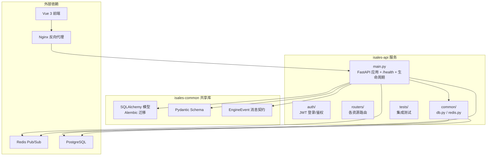
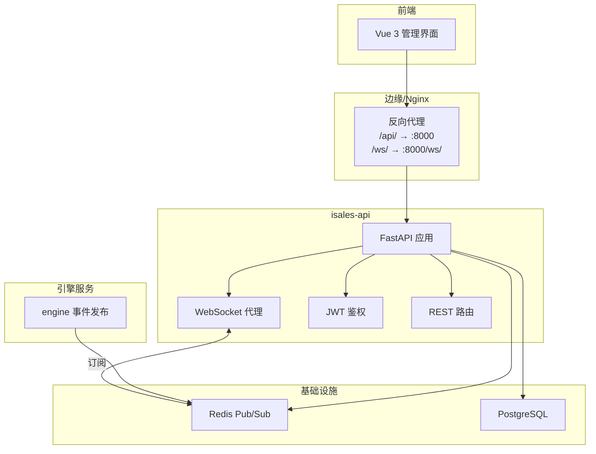
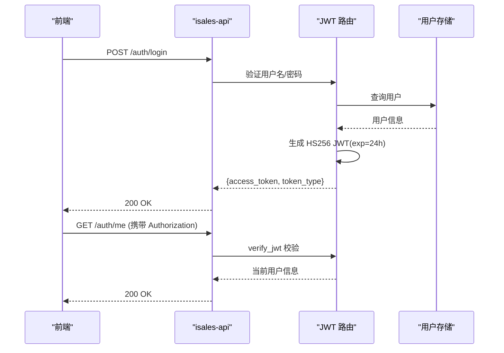
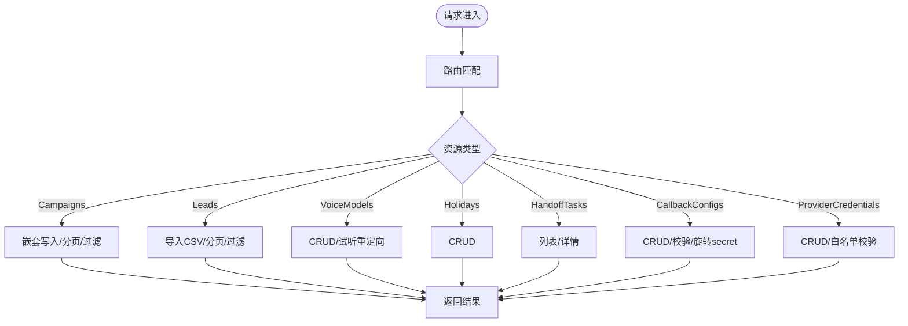
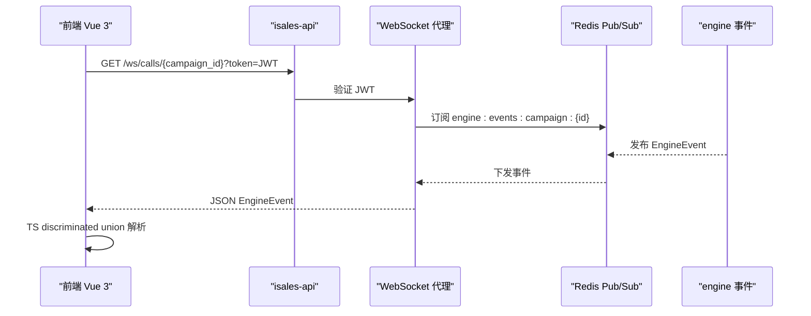
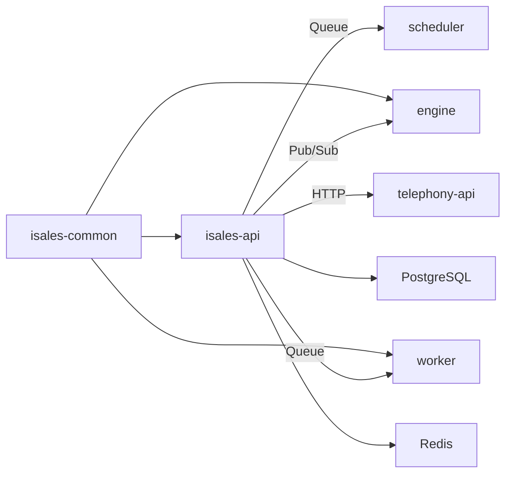

# API服务 isales-api

<cite>
**本文引用的文件**
- [README.md](file://README.md)
- [DESIGN.md](file://DESIGN.md)
- [service-communication 规范](file://openspec/specs/service-communication/spec.md)
- [data-model 规范](file://openspec/specs/data-model/spec.md)
- [impl-api 任务清单](file://openspec/changes/archive/2026-05-06-impl-api/tasks.md)
- [impl-api 设计说明](file://openspec/changes/archive/2026-05-06-impl-api/design.md)
- [webhook-callback 规范](file://openspec/changes/archive/2026-05-08-impl-web-polish/specs/webhook-callback/spec.md)
- [provider-credential 规范](file://openspec/changes/archive/2026-05-24-impl-provider-credential-db-ssot/specs/provider-credential/spec.md)
- [cloud 部署说明](file://deploy/cloud/README.md)
- [cloud 运维手册](file://deploy/cloud/RUNBOOK-cloud.md)
- [edge 运维手册](file://deploy/cloud/RUNBOOK-edge.md)
- [Linux 运维手册](file://deploy/RUNBOOK.md)
</cite>

## 目录
1. [简介](#简介)
2. [项目结构](#项目结构)
3. [核心组件](#核心组件)
4. [架构总览](#架构总览)
5. [详细组件分析](#详细组件分析)
6. [依赖关系分析](#依赖关系分析)
7. [性能考虑](#性能考虑)
8. [故障排查指南](#故障排查指南)
9. [结论](#结论)
10. [附录](#附录)

## 简介
isales-api 是基于 FastAPI 的管理后台服务，负责系统统一入口点的角色：提供 RESTful API 管理后台 CRUD（Campaign/Lead/Role/Voice/Analytics/Callback 等）、WebSocket 代理以实时推送通话事件，并与前端 Vue 3 界面交互。它通过 Redis Pub/Sub 与引擎服务解耦，实现高可靠、低耦合的实时事件分发。

- 作为统一入口点：前端通过 isales-api 访问后端资源与实时事件，避免直接访问引擎。
- 管理后台 CRUD：涵盖 Campaign、Lead、Voice、Holiday、HandoffTask、CallbackConfig、ProviderCredential 等资源。
- WebSocket 代理：将引擎事件通过 WebSocket 推送给前端，采用 JWT 鉴权与严格的事件契约。

**章节来源**
- [README.md: 7-14:7-14](file://README.md#L7-L14)
- [impl-api 设计说明: 13-27:13-27](file://openspec/changes/archive/2026-05-06-impl-api/design.md#L13-L27)

## 项目结构
isales-api 仓库包含 FastAPI 应用骨架、认证模块、路由模块、通用数据库与 Redis 封装，以及 OpenSpec 规范与部署运维文档。

**图表来源**
- [impl-api 任务清单: 10-13:10-13](file://openspec/changes/archive/2026-05-06-impl-api/tasks.md#L10-L13)
- [service-communication 规范: 106-135:106-135](file://openspec/specs/service-communication/spec.md#L106-L135)

**章节来源**
- [impl-api 任务清单: 4-13:4-13](file://openspec/changes/archive/2026-05-06-impl-api/tasks.md#L4-L13)

## 核心组件
- FastAPI 应用与健康检查：应用启动、生命周期管理、/health 健康端点。
- 认证与授权：JWT 登录、用户校验、依赖注入获取当前用户。
- 资源路由：Campaigns、Leads、VoiceModels、Holidays、HandoffTasks、CallbackConfigs、ProviderCredentials 等。
- WebSocket 代理：订阅引擎事件 Pub/Sub，按 campaign_id fan-out 推送。
- 通用组件：数据库会话封装、Redis 客户端封装。

**章节来源**
- [impl-api 任务清单: 12-13:12-13](file://openspec/changes/archive/2026-05-06-impl-api/tasks.md#L12-L13)
- [impl-api 任务清单: 23-39:23-39](file://openspec/changes/archive/2026-05-06-impl-api/tasks.md#L23-L39)
- [impl-api 设计说明: 41-53:41-53](file://openspec/changes/archive/2026-05-06-impl-api/design.md#L41-L53)

## 架构总览
isales-api 在系统中的定位是“统一入口 + 实时代理”。它通过 Redis Pub/Sub 与引擎解耦，将引擎事件透明地推送到前端；同时提供 REST API 供管理后台使用。

**图表来源**
- [service-communication 规范: 106-135:106-135](file://openspec/specs/service-communication/spec.md#L106-L135)
- [cloud 部署说明: 15, 21, 97:15-21](file://deploy/cloud/README.md#L15-L21)
- [cloud 运维手册: 594](file://deploy/cloud/RUNBOOK-cloud.md#L594)

## 详细组件分析

### 认证与授权（JWT）
- 登录接口：POST /auth/login，使用 OAuth2PasswordRequestForm 获取用户名密码，签发 HS256 JWT（24h 过期）。
- 当前用户：GET /auth/me，依赖注入 current_user，验证失败返回 401。
- 鉴权策略：JWT 作为唯一签发方，telephony-api 仅验证；isales-web 直连 telephony-api，不通过 isales-api。

**图表来源**
- [impl-api 任务清单: 17-21:17-21](file://openspec/changes/archive/2026-05-06-impl-api/tasks.md#L17-L21)
- [CLAUDE.md: 109](file://CLAUDE.md#L109)

**章节来源**
- [impl-api 任务清单: 17-21:17-21](file://openspec/changes/archive/2026-05-06-impl-api/tasks.md#L17-L21)
- [CLAUDE.md: 109](file://CLAUDE.md#L109)

### RESTful API 设计与路由组织
- 资源划分：Campaigns、Leads、VoiceModels、Holidays、HandoffTasks、CallbackConfigs、ProviderCredentials。
- 嵌套写入：Campaigns 支持嵌套子资源（如 FillerSet/Phrase、RoleConfig、CallbackConfig）跟随式 upsert。
- 导入能力：Leads 支持 CSV 导入，批量处理与部分成功返回。
- 设备绑定：提供 campaign 与 device 的直写接口。
- 辅助接口：CallbackConfigs 提供 trigger/payload 校验与 secret 旋转接口。

**图表来源**
- [impl-api 任务清单: 23-39:23-39](file://openspec/changes/archive/2026-05-06-impl-api/tasks.md#L23-L39)
- [webhook-callback 规范: 5-10:5-10](file://openspec/changes/archive/2026-05-08-impl-web-polish/specs/webhook-callback/spec.md#L5-L10)
- [provider-credential 规范: 137-165:137-165](file://openspec/changes/archive/2026-05-24-impl-provider-credential-db-ssot/specs/provider-credential/spec.md#L137-L165)

**章节来源**
- [impl-api 任务清单: 23-39:23-39](file://openspec/changes/archive/2026-05-06-impl-api/tasks.md#L23-L39)
- [webhook-callback 规范: 5-10:5-10](file://openspec/changes/archive/2026-05-08-impl-web-polish/specs/webhook-callback/spec.md#L5-L10)
- [provider-credential 规范: 137-165:137-165](file://openspec/changes/archive/2026-05-24-impl-provider-credential-db-ssot/specs/provider-credential/spec.md#L137-L165)

### WebSocket 代理与实时推送
- 端点：/ws/calls/{campaign_id}，查询参数 token=JWT。
- 订阅策略：按 campaign_id 共享 Redis Pub/Sub 订阅，fan-out 至所有连接。
- 消息契约：直接透传 EngineEvent JSON，前端按 type 字段解析。
- 鉴权：accept 前验证 JWT，失败返回 4401 关闭连接。
- 单实例限制：v1 单实例，多实例扩展需变更提案。

**图表来源**
- [service-communication 规范: 106-135:106-135](file://openspec/specs/service-communication/spec.md#L106-L135)
- [impl-api 设计说明: 41-53:41-53](file://openspec/changes/archive/2026-05-06-impl-api/design.md#L41-L53)

**章节来源**
- [service-communication 规范: 106-135:106-135](file://openspec/specs/service-communication/spec.md#L106-L135)
- [impl-api 设计说明: 41-53:41-53](file://openspec/changes/archive/2026-05-06-impl-api/design.md#L41-L53)

### 与前端 Vue 3 的交互模式
- 前端直接连接 telephony-api，不通过 isales-api；isales-api 仅承载管理后台与 WebSocket 代理。
- WebSocket 消息由 isales-api 透传，前端使用 TypeScript discriminated union 解析 EngineEvent，未知 type 仅警告跳过。
- 管理后台通过 REST API 与 isales-api 交互，使用 JWT 令牌进行鉴权。

**章节来源**
- [CLAUDE.md: 109](file://CLAUDE.md#L109)
- [service-communication 规范: 137-146:137-146](file://openspec/specs/service-communication/spec.md#L137-L146)

## 依赖关系分析
- 服务间通信：API 通过 Redis Pub/Sub 与引擎事件对接，通过 Redis Queue 与调度器、工作器协作。
- 数据持久化：所有服务直连 PostgreSQL（通过 isales-common 模型），统一迁移管理。
- 依赖耦合：API 依赖 isales-common 的模型与消息契约，确保前后端一致性。

**图表来源**
- [service-communication 规范: 11-24:11-24](file://openspec/specs/service-communication/spec.md#L11-L24)
- [data-model 规范: 5-17:5-17](file://openspec/specs/data-model/spec.md#L5-L17)

**章节来源**
- [service-communication 规范: 11-24:11-24](file://openspec/specs/service-communication/spec.md#L11-L24)
- [data-model 规范: 5-17:5-17](file://openspec/specs/data-model/spec.md#L5-L17)

## 性能考虑
- WebSocket 连接管理：单实例进程内维护 campaign_id → Set[WebSocket]，后台任务统一订阅 Redis Pub/Sub，避免每个连接独立订阅导致 Redis 连接膨胀。
- 队列与 Pub/Sub 边界：队列用于“必须送达”的工作派发，Pub/Sub 用于“实时可丢失”的事件广播，降低延迟与资源占用。
- 并发控制：全局并发使用 Redis 原子计数器，避免计数器泄漏与资源争用。

**章节来源**
- [service-communication 规范: 31-47:31-47](file://openspec/specs/service-communication/spec.md#L31-L47)
- [impl-api 设计说明: 47-53:47-53](file://openspec/changes/archive/2026-05-06-impl-api/design.md#L47-L53)

## 故障排查指南
- API 登录失败：检查环境变量 ISALES_ADMIN_PASSWORD_HASH 是否为 bcrypt 哈希，必要时重新生成并重启 isales-api。
- Nginx 502 from /api/：直接 curl http://127.0.0.1:8000/healthz 验证 isales-api 健在；检查 systemctl status isales-api。
- WebSocket 502：curl 直连检查；journalctl -u isales-api 查看日志；WebSocket 工作线程数为 1 为设计。
- 管理后台 401：JWT 过期/失效 → 重新登录；若无法登录，查看 isales-api 日志定位 authenticate 失败原因。

**章节来源**
- [Linux 运维手册: 173-175:173-175](file://deploy/RUNBOOK.md#L173-L175)
- [cloud 运维手册: 594-595:594-595](file://deploy/cloud/RUNBOOK-cloud.md#L594-L595)

## 结论
isales-api 通过清晰的 REST API 与 WebSocket 代理，成为系统统一入口点，协调管理后台 CRUD 与实时事件推送。其设计遵循 OpenSpec 规范，强调服务间通信边界、数据模型一致性与安全契约，确保在单实例部署下具备高可靠性与可维护性。

## 附录

### API 端点概览（按资源分类）
- 认证
  - POST /auth/login：登录获取 JWT
  - GET /auth/me：获取当前用户信息
- Campaigns
  - GET /campaigns：分页列表
  - GET /campaigns/{id}：详情
  - POST /campaigns：创建
  - PATCH /campaigns/{id}：更新
  - DELETE /campaigns/{id}：删除
  - POST /campaigns/{id}/devices：绑定设备
  - GET /campaigns/{id}/devices：查询设备
  - DELETE /campaigns/{id}/devices：解绑设备
- Leads
  - GET /leads：分页列表（支持 status/campaign_id 过滤）
  - GET /leads/{id}：详情
  - POST /leads：创建
  - PATCH /leads/{id}：更新
  - DELETE /leads/{id}：删除
  - POST /leads/import：CSV 导入（multipart/form-data）
- VoiceModels
  - GET /voice-models：列表
  - GET /voice-models/{id}：详情
  - POST /voice-models：创建
  - PATCH /voice-models/{id}：更新
  - DELETE /voice-models/{id}：删除
  - GET /voice-models/{id}/sample：307 重定向到 sample_url
- Holidays
  - GET /holidays：列表
  - GET /holidays/{id}：详情
  - POST /holidays：创建
  - PATCH /holidays/{id}：更新
  - DELETE /holidays/{id}：删除
- HandoffTasks
  - GET /handoff-tasks：列表（支持 status 过滤）
  - GET /handoff-tasks/{id}：详情
  - pick-up / complete：501（阶段 2 未实现）
- CallbackConfigs
  - GET /callback-configs：列表
  - GET /callback-configs/{id}：详情
  - POST /callback-configs：创建
  - PATCH /callback-configs/{id}：更新
  - DELETE /callback-configs/{id}：删除
  - POST /callback-configs/validate：Dry-run 校验 trigger/payload
  - POST /callback-configs/{id}/rotate-secret：一次性返回明文 secret 并加密落库
- ProviderCredentials
  - GET /provider-credentials：列表（掩码）
  - GET /provider-credentials/{provider_id}：详情
  - POST /provider-credentials：创建/更新（白名单字段校验）
  - DELETE /provider-credentials/{provider_id}：删除
  - POST /provider-credentials/reload-hint：提示服务端重新装载凭据
- WebSocket
  - GET /ws/calls/{campaign_id}：查询参数 token=JWT，订阅引擎事件

**章节来源**
- [impl-api 任务清单: 23-39:23-39](file://openspec/changes/archive/2026-05-06-impl-api/tasks.md#L23-L39)
- [webhook-callback 规范: 5-10:5-10](file://openspec/changes/archive/2026-05-08-impl-web-polish/specs/webhook-callback/spec.md#L5-L10)
- [provider-credential 规范: 137-165:137-165](file://openspec/changes/archive/2026-05-24-impl-provider-credential-db-ssot/specs/provider-credential/spec.md#L137-L165)

### 请求/响应与错误处理要点
- 认证
  - 401 未授权：缺少 token / 无效 token / 过期 token
  - 422 参数校验错误：用户名/密码格式不符
- CRUD
  - 200/201/204：成功
  - 400：参数错误/数据校验失败
  - 404：资源不存在
  - 500：服务器内部错误
- WebSocket
  - 4401：鉴权失败立即关闭连接
  - 未知事件类型：前端仅警告跳过，不中断连接

**章节来源**
- [impl-api 任务清单: 17-21:17-21](file://openspec/changes/archive/2026-05-06-impl-api/tasks.md#L17-L21)
- [service-communication 规范: 112-125:112-125](file://openspec/specs/service-communication/spec.md#L112-L125)