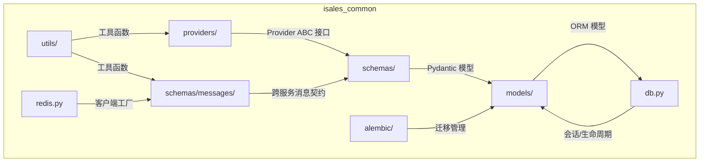
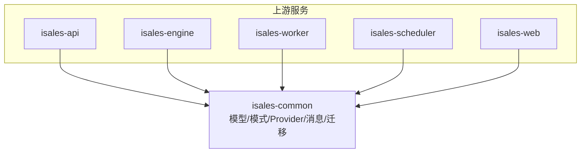
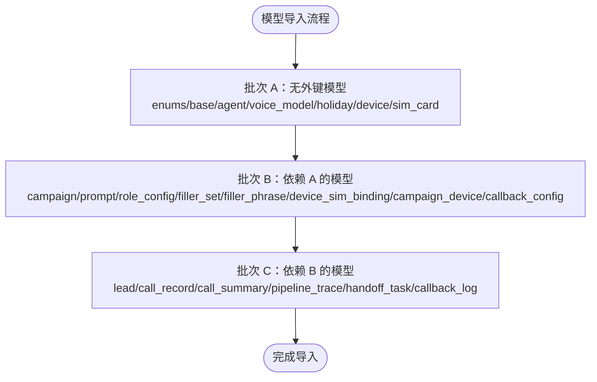
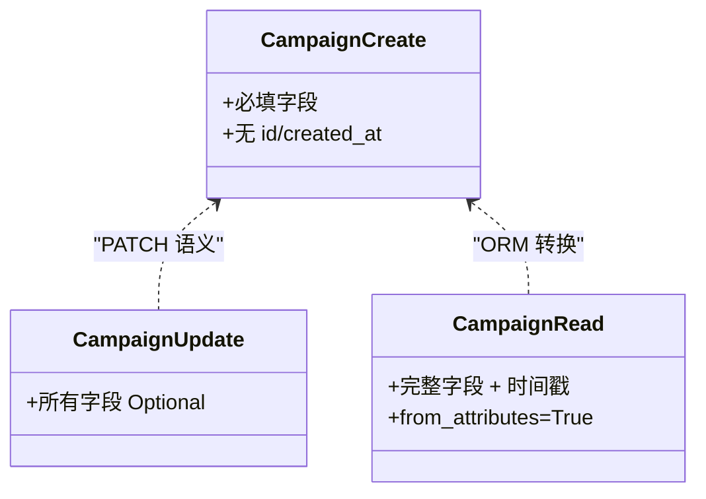
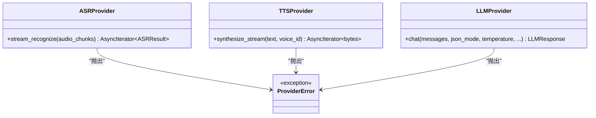
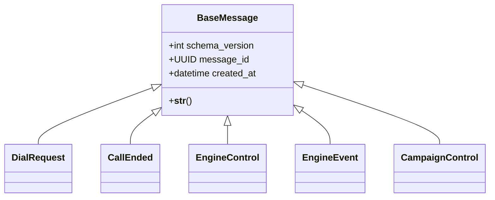
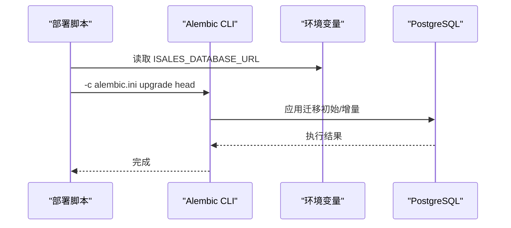
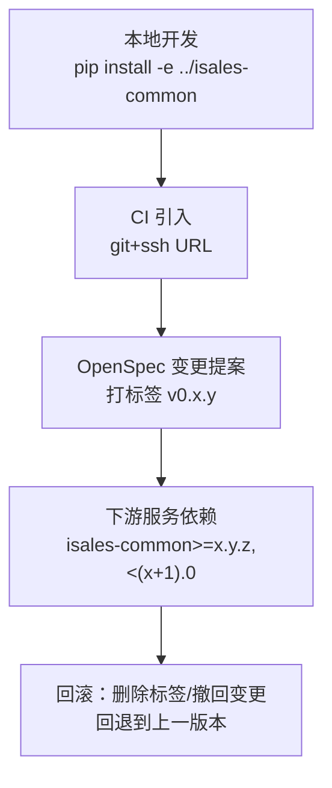
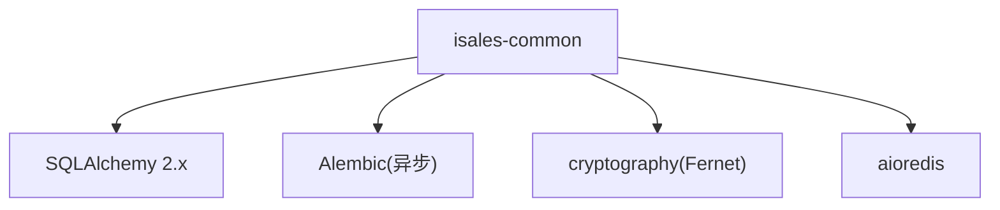

# 共享库 isales-common

<cite>
**本文引用的文件**
- [README.md](file://README.md)
- [design.md](file://openspec/changes/archive/2026-05-01-init-isales-common/design.md)
- [spec.md（Provider ABC）](file://openspec/changes/archive/2026-05-01-init-isales-common/specs/provider-abc/spec.md)
- [spec.md（消息契约）](file://openspec/changes/archive/2026-05-01-init-isales-common/specs/message-contract/spec.md)
- [tasks.md（初始化任务清单）](file://openspec/changes/archive/2026-05-01-init-isales-common/tasks.md)
- [tasks.md（凭据SSOT实施）](file://openspec/changes/archive/2026-05-24-impl-provider-credential-db-ssot/tasks.md)
- [migrate.sh（Linux）](file://deploy/linux/scripts/migrate.sh)
- [migrate.sh（macOS）](file://deploy/macos/scripts/migrate.sh)
- [_lib.sh（通用脚本库）](file://deploy/common/_lib.sh)
- [rollback.sh（云环境回滚）](file://deploy/cloud/scripts/rollback.sh)
</cite>

## 目录
1. [简介](#简介)
2. [项目结构](#项目结构)
3. [核心组件](#核心组件)
4. [架构总览](#架构总览)
5. [详细组件分析](#详细组件分析)
6. [依赖关系分析](#依赖关系分析)
7. [性能考虑](#性能考虑)
8. [故障排查指南](#故障排查指南)
9. [结论](#结论)
10. [附录](#附录)

## 简介
isales-common 是 iSales 架构中七个子仓库的共享基础设施库，承担以下职责：
- 提供 19 张核心业务表的 SQLAlchemy ORM 模型与 Alembic 初始迁移
- 提供与 ORM 一一对应的 Pydantic Schemas（Create/Update/Read）
- 定义 ASR/TTS/LLM 三类 Provider 的抽象接口（ABC），确保供应商无关与可替换性
- 定义跨服务 Redis 消息体的统一 Pydantic 模型，保障消息契约稳定
- 提供加解密工具、Redis 客户端工厂等通用能力
- 采用本地开发依赖方式（pip install -e ../isales-common），不发布至 PyPI

该库严格遵循“不包含业务逻辑”的边界，所有下游服务通过统一的接口与模型进行协作。

**章节来源**
- [README.md: 1-86:1-86](file://README.md#L1-L86)
- [design.md: 1-135:1-135](file://openspec/changes/archive/2026-05-01-init-isales-common/design.md#L1-L135)

## 项目结构
isales-common 的结构围绕“模型-模式-提供者-消息-迁移”五大维度组织，采用模块化文件布局以避免循环依赖并提升可维护性。

**图表来源**
- [design.md: 41-52:41-52](file://openspec/changes/archive/2026-05-01-init-isales-common/design.md#L41-L52)
- [tasks.md（初始化任务清单）: 68-86:68-86](file://openspec/changes/archive/2026-05-01-init-isales-common/tasks.md#L68-L86)

**章节来源**
- [design.md: 41-52:41-52](file://openspec/changes/archive/2026-05-01-init-isales-common/design.md#L41-L52)
- [tasks.md（初始化任务清单）: 68-86:68-86](file://openspec/changes/archive/2026-05-01-init-isales-common/tasks.md#L68-L86)

## 核心组件
- SQLAlchemy 模型层：按业务域拆分文件，统一 Base，批次化导入避免外键循环依赖
- Pydantic Schemas：与 ORM 一一对应，Create/Update/Read 三类模型，明确输入边界
- Provider ABC：ASR/TTS/LLM 三类异步流式接口，强制 JSON Mode，统一错误模型
- 跨服务消息契约：集中定义在 schemas/messages，统一基类与版本字段
- Alembic 迁移：初始一次性迁移，后续每次变更独立迁移
- 工具模块：加解密（Fernet）、Redis 客户端工厂、音频格式常量等

**章节来源**
- [design.md: 54-86:54-86](file://openspec/changes/archive/2026-05-01-init-isales-common/design.md#L54-L86)
- [design.md: 92-105:92-105](file://openspec/changes/archive/2026-05-01-init-isales-common/design.md#L92-L105)

## 架构总览
isales-common 作为共享库，向上游服务提供稳定的接口与数据契约，向下管理数据库与消息协议，形成“契约先行、模型驱动、迁移可控”的架构闭环。

**图表来源**
- [README.md: 7-14:7-14](file://README.md#L7-L14)
- [design.md: 13-26:13-26](file://openspec/changes/archive/2026-05-01-init-isales-common/design.md#L13-L26)

## 详细组件分析

### SQLAlchemy 模型设计与实现
- 单一 Base：所有模型继承统一 DeclarativeBase，确保 Alembic 能扫描全部元数据
- 模型分域：campaign、lead、call、device、agent、prompt、callback 等按业务域拆分文件
- 外键依赖批次：分为 A/B/C 三批，按外键依赖链导入，避免循环依赖
- JSONB 字段：ORM 使用 Mapped[dict/list]，Schema 用嵌套 Pydantic 模型显式描述

**图表来源**
- [design.md: 47-52:47-52](file://openspec/changes/archive/2026-05-01-init-isales-common/design.md#L47-L52)

**章节来源**
- [design.md: 41-52:41-52](file://openspec/changes/archive/2026-05-01-init-isales-common/design.md#L41-L52)

### Pydantic Schemas 设计与实现
- 一对一映射：每个 ORM 资源对应 Create/Update/Read 三类 Schema
- Create：必填字段，不含 id/created_at
- Update：所有字段 Optional（PATCH 语义）
- Read：完整字段 + 时间戳，from_attributes=True 直接由 ORM 转换
- JSONB 字段：用嵌套 Pydantic 模型描述，作为 JSONB 字段的“活文档”

**图表来源**
- [design.md: 54-61:54-61](file://openspec/changes/archive/2026-05-01-init-isales-common/design.md#L54-L61)

**章节来源**
- [design.md: 54-61:54-61](file://openspec/changes/archive/2026-05-01-init-isales-common/design.md#L54-L61)

### Provider ABC 接口设计与实现
- ASRProvider：异步流式识别，输入音频 chunk 流，输出识别结果流
- TTSProvider：异步流式合成，输入文本与音色，输出 PCM 音频字节流
- LLMProvider：chat 接口，强制 JSON Mode，返回合法 JSON 字符串
- 错误模型：统一 ProviderError 体系，便于上层统一处理超时/限流/无效请求/服务器错误
- 契约稳定性：方法签名视为公共 API，破坏性变更需 OpenSpec 变更提案

**图表来源**
- [spec.md（Provider ABC）: 17-77:17-77](file://openspec/changes/archive/2026-05-01-init-isales-common/specs/provider-abc/spec.md#L17-L77)

**章节来源**
- [spec.md（Provider ABC）: 17-77:17-77](file://openspec/changes/archive/2026-05-01-init-isales-common/specs/provider-abc/spec.md#L17-L77)

### 跨服务消息契约设计与实现
- 集中定义：所有跨服务 Redis 消息体在 schemas/messages 下定义为 Pydantic 模型
- 基类与版本：统一 BaseMessage，包含 schema_version/message_id/created_at
- 通道矩阵：覆盖 DialRequest/CallEnded/EngineControl/EngineEvent/CampaignControl 等
- 演进规则：非破坏性变更可直接合入；破坏性变更需升 schema_version 并经 OpenSpec 变更提案

**图表来源**
- [spec.md（消息契约）: 22-35:22-35](file://openspec/changes/archive/2026-05-01-init-isales-common/specs/message-contract/spec.md#L22-L35)
- [tasks.md（初始化任务清单）: 68-77:68-77](file://openspec/changes/archive/2026-05-01-init-isales-common/tasks.md#L68-L77)

**章节来源**
- [spec.md（消息契约）: 22-35:22-35](file://openspec/changes/archive/2026-05-01-init-isales-common/specs/message-contract/spec.md#L22-L35)
- [tasks.md（初始化任务清单）: 68-77:68-77](file://openspec/changes/archive/2026-05-01-init-isales-common/tasks.md#L68-L77)

### Alembic 数据库迁移管理机制
- 初始迁移：一次性迁移建好 19 张表，随后每次 schema 变更走独立迁移
- 环境变量：sqlalchemy.url 通过环境变量注入
- 升级流程：部署脚本中调用 alembic upgrade head
- CI 验证：CI 中跑 upgrade head 与 downgrade base 往返一次

**图表来源**
- [tasks.md（初始化任务清单）: 79-86:79-86](file://openspec/changes/archive/2026-05-01-init-isales-common/tasks.md#L79-L86)
- [migrate.sh（Linux）: 39-60:39-60](file://deploy/linux/scripts/migrate.sh#L39-L60)
- [migrate.sh（macOS）: 42-72:42-72](file://deploy/macos/scripts/migrate.sh#L42-L72)

**章节来源**
- [tasks.md（初始化任务清单）: 79-86:79-86](file://openspec/changes/archive/2026-05-01-init-isales-common/tasks.md#L79-L86)
- [migrate.sh（Linux）: 39-60:39-60](file://deploy/linux/scripts/migrate.sh#L39-L60)
- [migrate.sh（macOS）: 42-72:42-72](file://deploy/macos/scripts/migrate.sh#L42-L72)

### 版本管理与分发策略
- 包管理：hatchling + pyproject.toml（现代 PEP 621 标准）
- 依赖分发：本地 pip install -e ../isales-common，CI 通过 git+ssh URL 引入
- 版本策略：通过 OpenSpec 变更提案驱动版本号上升，如从 0.3.x 升至 0.4.0
- 回滚策略：云环境回滚脚本可列出 releases 目录下的版本并读取 isales-common 的 git 标签

**图表来源**
- [design.md: 29-39:29-39](file://openspec/changes/archive/2026-05-01-init-isales-common/design.md#L29-L39)
- [tasks.md（凭据SSOT实施）: 19-21:19-21](file://openspec/changes/archive/2026-05-24-impl-provider-credential-db-ssot/tasks.md#L19-L21)
- [rollback.sh: 42-74:42-74](file://deploy/cloud/scripts/rollback.sh#L42-L74)

**章节来源**
- [design.md: 29-39:29-39](file://openspec/changes/archive/2026-05-01-init-isales-common/design.md#L29-L39)
- [tasks.md（凭据SSOT实施）: 19-21:19-21](file://openspec/changes/archive/2026-05-24-impl-provider-credential-db-ssot/tasks.md#L19-L21)
- [rollback.sh: 42-74:42-74](file://deploy/cloud/scripts/rollback.sh#L42-L74)

## 依赖关系分析
- 组件耦合：Provider ABC 与 Pydantic Schemas 强耦合，确保输入输出约束一致
- 外部依赖：SQLAlchemy 2.x、asyncpg、Alembic（异步）、cryptography（Fernet）
- 部署脚本：Linux/macOS 部署脚本统一通过环境变量注入数据库连接，调用 Alembic 执行迁移

**图表来源**
- [design.md: 7-8:7-8](file://openspec/changes/archive/2026-05-01-init-isales-common/design.md#L7-L8)
- [tasks.md（凭据SSOT实施）: 3-4:3-4](file://openspec/changes/archive/2026-05-24-impl-provider-credential-db-ssot/tasks.md#L3-L4)

**章节来源**
- [design.md: 7-8:7-8](file://openspec/changes/archive/2026-05-01-init-isales-common/design.md#L7-L8)
- [tasks.md（凭据SSOT实施）: 3-4:3-4](file://openspec/changes/archive/2026-05-24-impl-provider-credential-db-ssot/tasks.md#L3-L4)

## 性能考虑
- 异步流式接口：Provider ABC 采用异步流式，降低端到端延迟，满足实时通话场景
- JSON Mode：强制启用 JSON Mode，减少后处理开销，提高结构化输出质量
- 消息序列化：统一使用 Pydantic 的 model_dump_json，默认 JSON，兼顾调试与性能
- 迁移策略：初始一次性迁移，减少历史噪音与评审成本，后续增量迁移保证演进可控

**章节来源**
- [spec.md（Provider ABC）: 31-47:31-47](file://openspec/changes/archive/2026-05-01-init-isales-common/specs/provider-abc/spec.md#L31-L47)
- [spec.md（Provider ABC）: 45-57:45-57](file://openspec/changes/archive/2026-05-01-init-isales-common/specs/provider-abc/spec.md#L45-L57)
- [spec.md（消息契约）: 73-81:73-81](file://openspec/changes/archive/2026-05-01-init-isales-common/specs/message-contract/spec.md#L73-L81)
- [design.md: 92-96:92-96](file://openspec/changes/archive/2026-05-01-init-isales-common/design.md#L92-L96)

## 故障排查指南
- 迁移失败：检查环境变量 ISALES_DATABASE_URL 是否正确，确认 alembic.ini 存在且可执行
- 升级/降级往返：在 CI 中验证 alembic upgrade head 与 downgrade base 的往返一致性
- 消息版本不匹配：consumer 侧需校验 schema_version，不支持的版本应记录告警并按死信处理
- Provider 错误：统一捕获 ProviderError 子类，区分超时/限流/无效请求/服务器错误并采取相应降级策略

**章节来源**
- [migrate.sh（Linux）: 39-60:39-60](file://deploy/linux/scripts/migrate.sh#L39-L60)
- [migrate.sh（macOS）: 42-72:42-72](file://deploy/macos/scripts/migrate.sh#L42-L72)
- [spec.md（消息契约）: 31-35:31-35](file://openspec/changes/archive/2026-05-01-init-isales-common/specs/message-contract/spec.md#L31-L35)
- [spec.md（Provider ABC）: 64-77:64-77](file://openspec/changes/archive/2026-05-01-init-isales-common/specs/provider-abc/spec.md#L64-L77)

## 结论
isales-common 通过“契约先行、模型驱动、迁移可控”的设计，为 iSales 七仓提供了稳定、可演进的共享基础设施。其边界清晰、职责明确，既保证了跨服务的一致性，又为后续的供应商替换与功能扩展预留了充足空间。配合严格的 OpenSpec 变更流程与自动化迁移验证，确保了系统的长期可维护性与可靠性。

## 附录
- 使用场景示例（路径参考）
  - Provider ABC 契约测试：从 isales_common.providers.testing 导入 MockASRProvider/MockTTSProvider/MockLLMProvider
  - 消息序列化：使用 schemas/messages 下的消息类，调用 model_dump_json() 序列化，model_validate_json() 反序列化
  - 数据库迁移：在部署脚本中设置 ISALES_DATABASE_URL，调用 alembic upgrade head
  - 凭据管理：使用 isales-cred-migrate CLI 进行 import-env/export-env，配合 Fernet 加密存储

**章节来源**
- [tasks.md（初始化任务清单）: 80-86:80-86](file://openspec/changes/archive/2026-05-01-init-isales-common/tasks.md#L80-L86)
- [tasks.md（凭据SSOT实施）: 15-16:15-16](file://openspec/changes/archive/2026-05-24-impl-provider-credential-db-ssot/tasks.md#L15-L16)
- [migrate.sh（Linux）: 39-60:39-60](file://deploy/linux/scripts/migrate.sh#L39-L60)
- [migrate.sh（macOS）: 42-72:42-72](file://deploy/macos/scripts/migrate.sh#L42-L72)