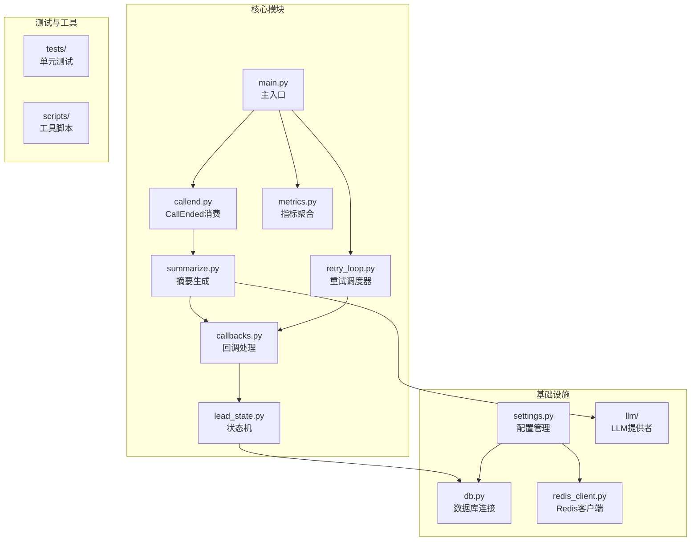
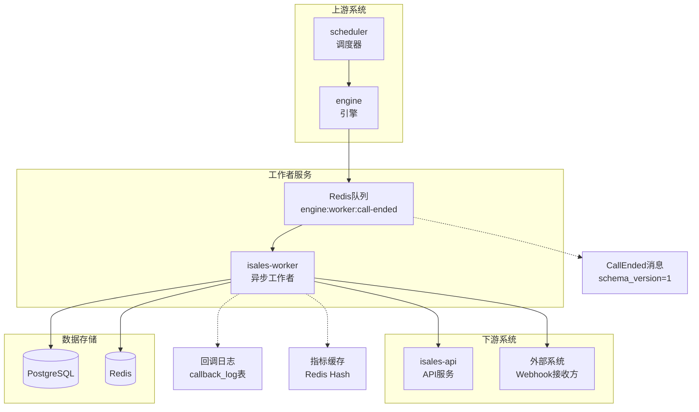
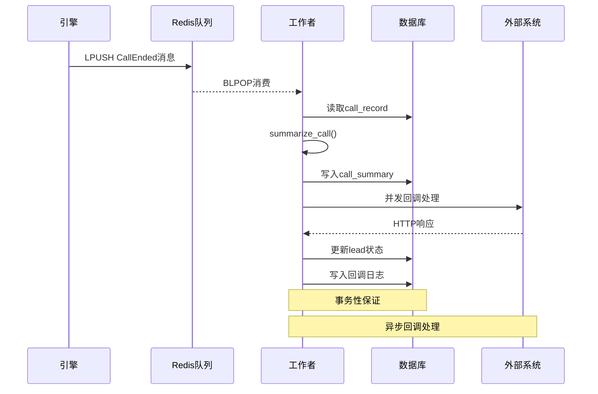
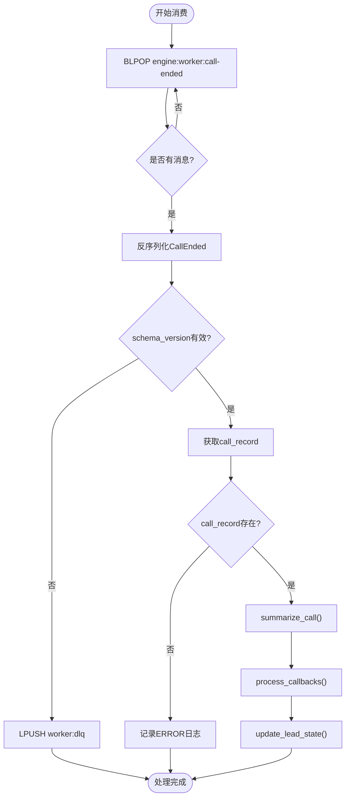
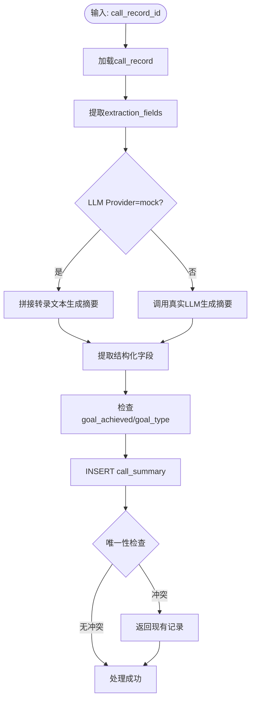
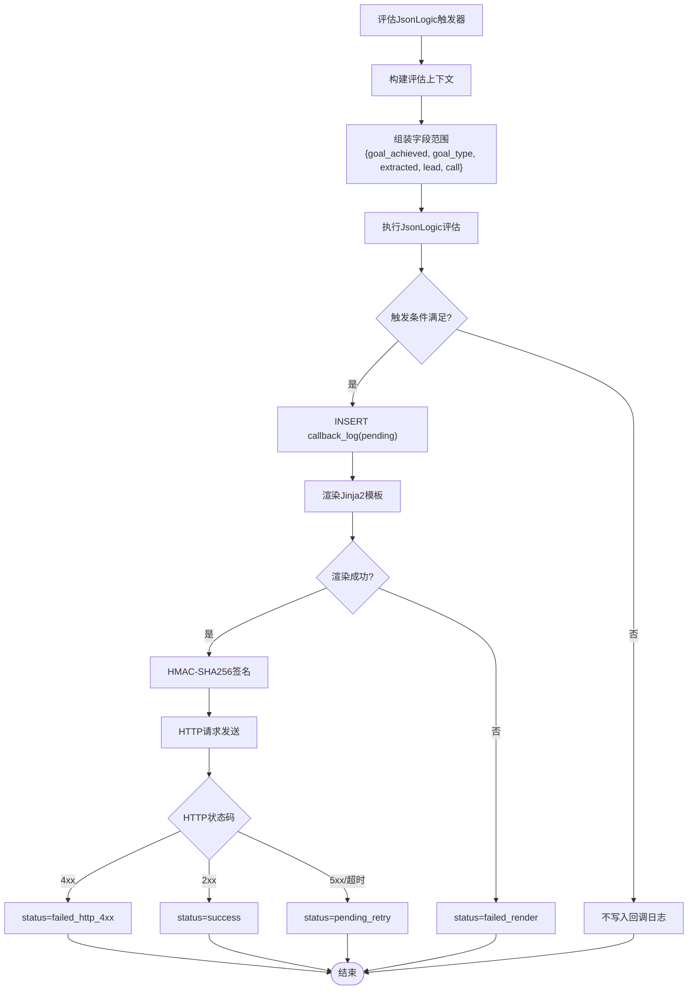
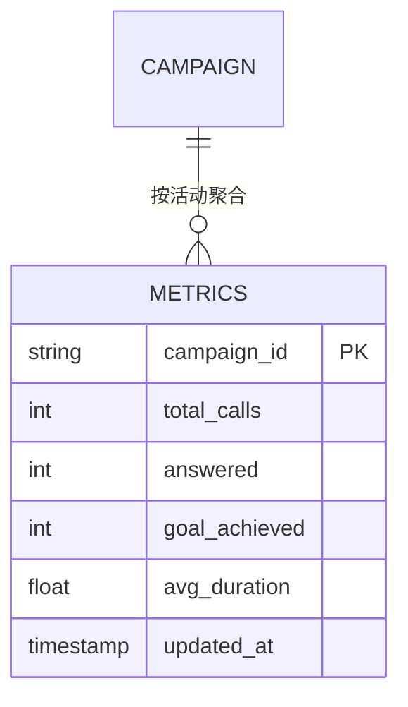
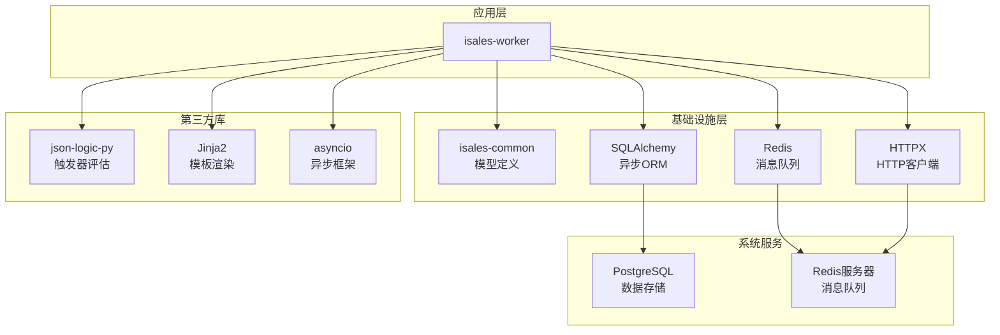

# 工作者服务 isales-worker

<cite>
**本文引用的文件**
- [设计文档](file://openspec/changes/archive/2026-05-06-impl-worker/design.md)
- [提案文档](file://openspec/changes/archive/2026-05-06-impl-worker/proposal.md)
- [任务清单](file://openspec/changes/archive/2026-05-06-impl-worker/tasks.md)
- [回调规范](file://openspec/changes/archive/2026-05-06-impl-worker/specs/webhook-callback/spec.md)
- [重试跟进规范](file://openspec/specs/retry-followup/spec.md)
- [目标达成规范](file://openspec/specs/goal-achievement/spec.md)
- [转录规范](file://openspec/specs/transcript/spec.md)
- [服务通信规范](file://openspec/specs/service-communication/spec.md)
- [系统服务单元](file://deploy/cloud/systemd/isales-worker.service)
- [环境配置示例](file://deploy/env/worker.env.example)
- [云环境配置示例](file://deploy/cloud/env/worker.env.example)
</cite>

## 目录
1. [简介](#简介)
2. [项目结构](#项目结构)
3. [核心组件](#核心组件)
4. [架构总览](#架构总览)
5. [详细组件分析](#详细组件分析)
6. [依赖关系分析](#依赖关系分析)
7. [性能考虑](#性能考虑)
8. [故障排除指南](#故障排除指南)
9. [结论](#结论)

## 简介
isales-worker 是 isales 通话生命周期中的异步工作者服务，负责在通话结束后进行数据处理、摘要生成、字段提取、Webhook 回调以及数据聚合。它采用 asyncio 全栈实现，使用 Redis 队列进行消息传递，并通过独立的后台任务实现回调重试调度和指标聚合。该服务在阶段 3B 实施，与 isales-scheduler 和 isales-engine 形成完整的数据流闭环。

## 项目结构
isales-worker 采用模块化设计，按照功能职责划分为多个核心模块：

**图表来源**
- [任务清单:9-13](file://openspec/changes/archive/2026-05-06-impl-worker/tasks.md#L9-L13)

**章节来源**
- [任务清单:4-14](file://openspec/changes/archive/2026-05-06-impl-worker/tasks.md#L4-L14)

## 核心组件
isales-worker 的核心组件围绕异步消息处理和数据流转展开，主要包括：

### 异步消息处理框架
- **CallEnded 消费器**：基于 Redis BLPOP 的阻塞式消息消费
- **任务串行执行**：确保处理步骤的正确顺序和原子性
- **错误处理机制**：防止重复处理和无限循环

### 数据处理管道
- **摘要生成**：基于转录文本的智能摘要和字段提取
- **回调处理**：Webhook 触发、模板渲染、签名验证
- **状态更新**：根据通话结果更新潜在客户状态

### 后台服务
- **重试调度器**：独立的回调重试任务
- **指标聚合器**：定期统计数据并写入 Redis
- **配置管理**：环境变量驱动的灵活配置

**章节来源**
- [设计文档:14-33](file://openspec/changes/archive/2026-05-06-impl-worker/design.md#L14-L33)
- [提案文档:12-56](file://openspec/changes/archive/2026-05-06-impl-worker/proposal.md#L12-L56)

## 架构总览
isales-worker 在整体系统架构中扮演着关键的数据处理角色，与上下游组件形成清晰的职责边界：

**图表来源**
- [服务通信规范](file://openspec/specs/service-communication/spec.md)
- [设计文档:149-154](file://openspec/changes/archive/2026-05-06-impl-worker/design.md#L149-L154)

### 数据流处理机制
工作者服务采用严格的异步处理机制，确保数据流转的可靠性和一致性：

**图表来源**
- [提案文档:18-51](file://openspec/changes/archive/2026-05-06-impl-worker/proposal.md#L18-L51)

## 详细组件分析

### CallEnded 消费器组件
CallEnded 消费器是工作者服务的消息入口，负责从 Redis 队列中获取通话结束事件并进行处理。

#### 核心功能特性
- **阻塞式消费**：使用 Redis BLPOP 实现高效的阻塞式消息获取
- **消息验证**：检查 schema_version 和消息格式的有效性
- **错误处理**：对无效消息进行死信队列处理
- **单消息串行**：确保每条消息的完整处理链路

#### 消费流程

**图表来源**
- [任务清单:16-22](file://openspec/changes/archive/2026-05-06-impl-worker/tasks.md#L16-L22)

**章节来源**
- [任务清单:16-22](file://openspec/changes/archive/2026-05-06-impl-worker/tasks.md#L16-L22)

### 摘要生成组件
摘要生成组件负责将通话转录文本转换为结构化的摘要信息和提取字段。

#### 处理流程

**图表来源**
- [设计文档:57-64](file://openspec/changes/archive/2026-05-06-impl-worker/design.md#L57-L64)

#### 字段提取逻辑
摘要生成过程重点关注以下字段的提取和处理：
- **summary_text**：通话摘要文本
- **extracted_fields**：从转录中提取的关键字段
- **goal_achieved**：目标是否达成
- **goal_type**：目标类型标识

**章节来源**
- [设计文档:57-64](file://openspec/changes/archive/2026-05-06-impl-worker/design.md#L57-L64)
- [任务清单:24-29](file://openspec/changes/archive/2026-05-06-impl-worker/tasks.md#L24-L29)

### 回调处理组件
回调处理组件实现了完整的 Webhook 回调机制，包括触发条件评估、模板渲染、签名验证和重试调度。

#### 触发条件评估

**图表来源**
- [设计文档:66-89](file://openspec/changes/archive/2026-05-06-impl-worker/design.md#L66-L89)

#### 回调重试机制
回调重试调度器采用独立的后台任务实现，具有以下特点：
- **独立任务**：与消息消费任务分离，互不干扰
- **指数退避**：基于配置的重试间隔数组实现指数增长
- **请求体复用**：重试时复用原始请求体，保持触发时刻的一致性
- **最大重试次数**：达到上限后标记为 exhausted 终态

**章节来源**
- [设计文档:98-104](file://openspec/changes/archive/2026-05-06-impl-worker/design.md#L98-L104)
- [回调规范:3-36](file://openspec/changes/archive/2026-05-06-impl-worker/specs/webhook-callback/spec.md#L3-L36)

### 状态机组件
状态机组件实现了复杂的潜在客户状态转换逻辑，遵循 retry-followup 规范的要求。

#### 决策矩阵
| 输入条件 | 输出状态 | 字段更新 |
|---------|---------|---------|
| `hangup_cause ∈ {no_answer, user_busy, network_out_of_order, temporary_failure}` 且 `retry_count + 1 < retry_max_count` | `retrying` | `retry_count++`, `next_call_at = now + retry_intervals[min(retry_count, len-1)] * 60` |
| 同上但 `retry_count + 1 >= retry_max_count` | `failed` | `retry_count++` |
| `hangup_cause = call_rejected` | `failed` | — |
| `hangup_cause ∈ {normal_clearing, wrap_up_completed, silence_max_reached, user_hangup}` 且 `goal_achieved=true` | `completed` | — |
| 同上但 `goal_achieved=false` 且 `follow_up_count + 1 < follow_up_max_count`（且 `follow_up_max_count > 0`） | `following_up` | `follow_up_count++`, `next_call_at = ended_at + follow_up_interval_days * 86400` |
| 同上但 `follow_up_max_count == 0` 或 `follow_up_count + 1 >= follow_up_max_count` | `follow_up_exhausted` | — |
| `hangup_cause = marked_for_handoff` | `transferred` | — |
| `goal_type = "do_not_call"` 或 transcript 含 `do_not_call_marked` 事件 | `do_not_call` | `next_call_at = NULL` |

#### 状态更新保护
状态更新采用行级守卫机制防止竞态条件：
- 使用 `UPDATE lead SET ... WHERE id=:id AND status='calling'` 确保只更新属于当前工作者的记录
- 当 rowcount=0 时记录 WARN 日志而非抛出异常
- 支持与调度器的竞态场景处理

**章节来源**
- [设计文档:106-135](file://openspec/changes/archive/2026-05-06-impl-worker/design.md#L106-L135)
- [重试跟进规范](file://openspec/specs/retry-followup/spec.md)

### 指标聚合组件
指标聚合组件提供实时的通话质量统计信息，采用 Redis Hash 结构进行高效存储。

#### 聚合策略
- **时间窗口**：聚合最近 7 天的数据
- **统计指标**：接通率、目标达成率、平均通话时长
- **存储格式**：Redis Hash `isales:metrics:7d:{campaign_id}`
- **更新频率**：每 60 秒执行一次

#### 数据结构

**图表来源**
- [设计文档:137-142](file://openspec/changes/archive/2026-05-06-impl-worker/design.md#L137-L142)

**章节来源**
- [设计文档:137-142](file://openspec/changes/archive/2026-05-06-impl-worker/design.md#L137-L142)

## 依赖关系分析
isales-worker 的依赖关系体现了清晰的分层架构和模块化设计：

**图表来源**
- [任务清单:7-8](file://openspec/changes/archive/2026-05-06-impl-worker/tasks.md#L7-L8)

### 外部依赖管理
- **isales-common**：提供数据模型、加密工具和消息契约
- **SQLAlchemy[asyncio]**：异步数据库访问层
- **Redis 客户端**：高性能键值存储和消息队列
- **HTTPX**：现代异步 HTTP 客户端
- **模板引擎**：Jinja2 用于回调负载渲染

**章节来源**
- [任务清单:7-8](file://openspec/changes/archive/2026-05-06-impl-worker/tasks.md#L7-L8)

## 性能考虑
isales-worker 在设计时充分考虑了性能优化和资源利用效率：

### 异步处理优势
- **事件驱动**：基于 asyncio 的非阻塞 I/O 模型
- **并发控制**：合理限制并发数量避免资源争用
- **内存效率**：及时释放处理完成的资源

### 缓存策略
- **Redis 缓存**：热点数据的快速访问
- **连接池**：数据库和 Redis 连接的复用
- **批量操作**：减少网络往返次数

### 监控指标
- **处理延迟**：从消息到达到底层处理完成的时间
- **队列深度**：当前待处理消息数量
- **错误率**：回调失败和数据库写入失败的比例

## 故障排除指南

### 常见问题诊断
1. **消息积压**：检查 Redis 队列深度和工作者处理能力
2. **回调失败**：验证外部系统的可达性和响应时间
3. **数据库连接**：确认连接池配置和超时设置
4. **配置错误**：检查环境变量和密钥配置

### 错误处理机制
- **单消息失败**：当前消息处理失败不影响后续消息
- **重试策略**：5xx 错误自动重试，4xx 错误直接失败
- **死信队列**：无法处理的消息进入死信队列等待人工干预

### 调试工具
- **日志分析**：详细的处理日志和错误信息
- **指标监控**：实时的性能指标和健康状态
- **手动注入**：使用 `scripts/fake_call_end.py` 进行测试

**章节来源**
- [设计文档:155-166](file://openspec/changes/archive/2026-05-06-impl-worker/design.md#L155-L166)

## 结论
isales-worker 作为 isales 系统的核心异步处理组件，通过精心设计的架构和严格的实现规范，为整个通话生命周期管理提供了可靠的技术支撑。其采用的异步消息处理模式、完善的错误处理机制和灵活的配置管理，使其能够在高并发场景下保持稳定的性能表现。

该服务的价值体现在：
- **解耦架构**：通过消息队列实现系统组件间的松耦合
- **可靠性保障**：完善的错误处理和重试机制确保数据一致性
- **扩展性设计**：模块化架构支持功能的平滑扩展
- **可观测性**：全面的日志记录和指标监控便于运维管理

随着 isales 系统的不断发展，isales-worker 将继续发挥关键作用，为业务的持续增长提供坚实的技术基础。