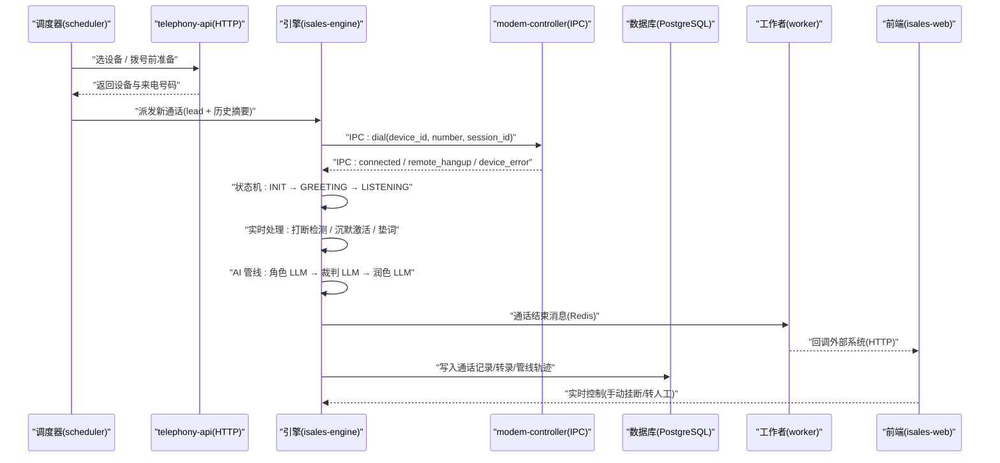
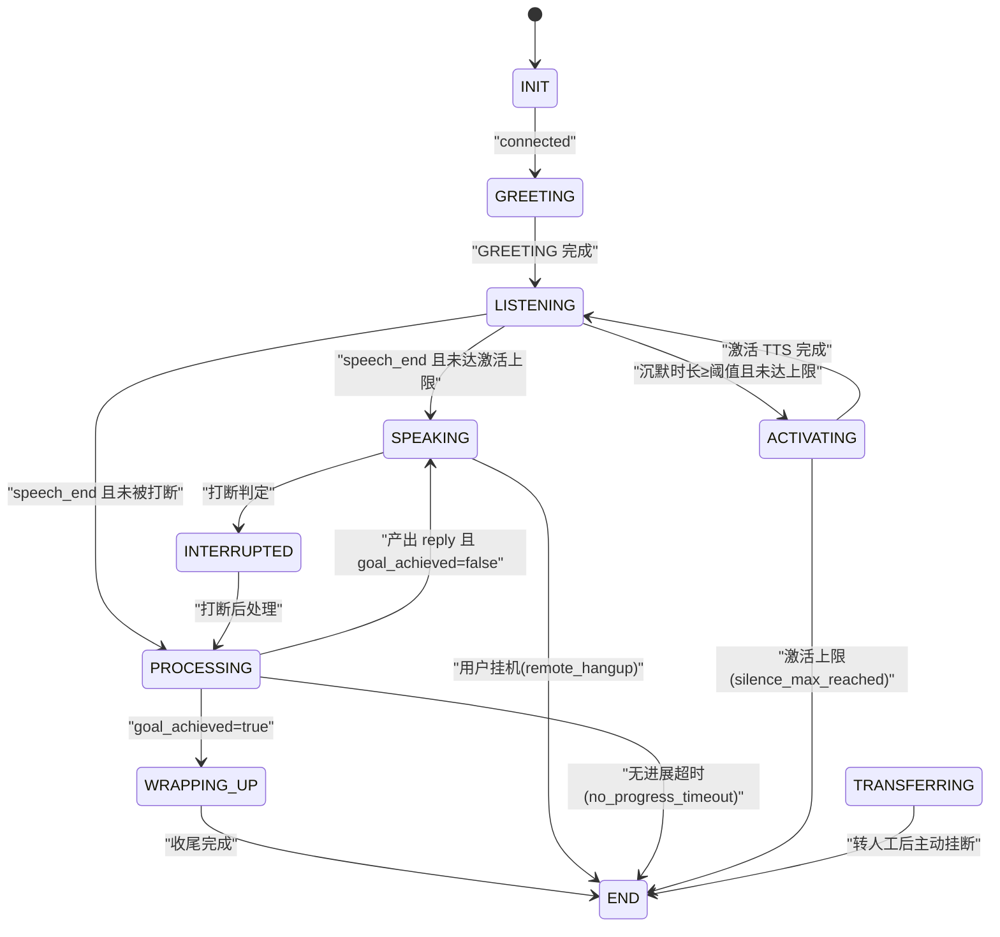
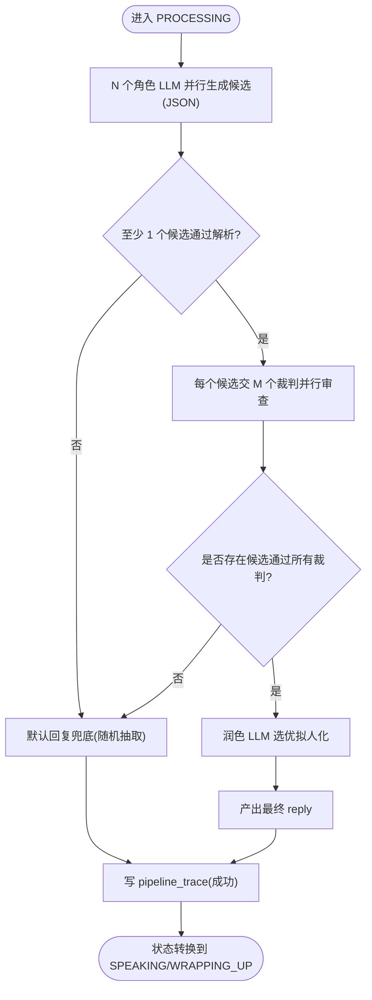
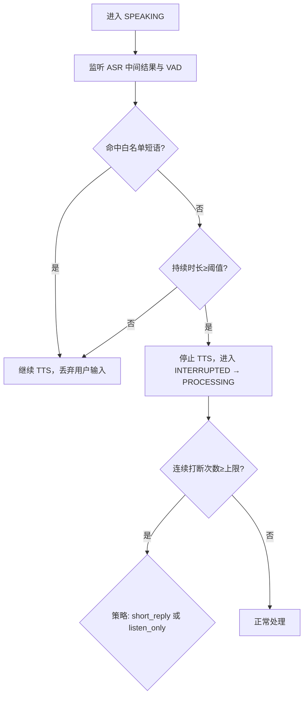
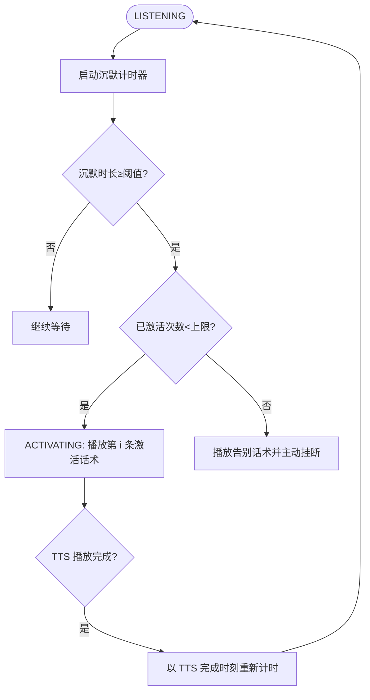
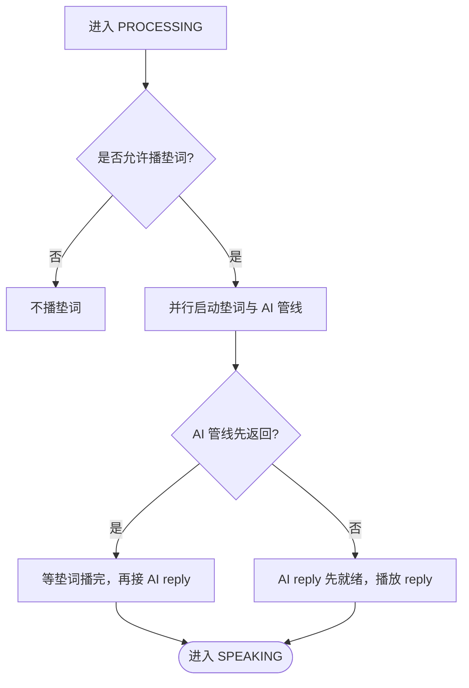
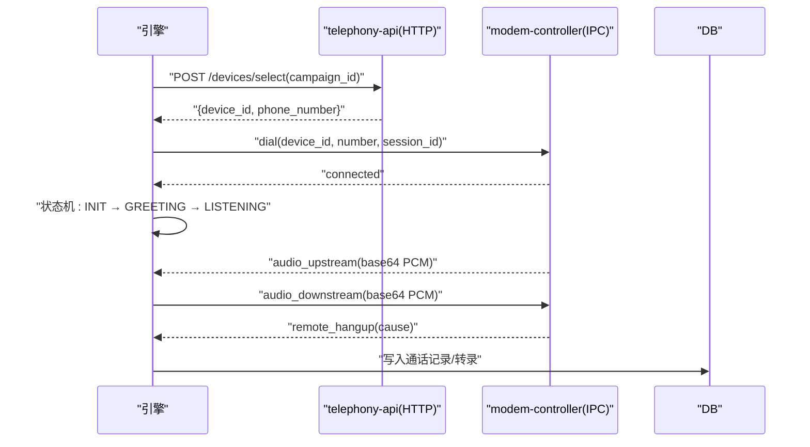

# 引擎服务 isales-engine

<cite>
**本文引用的文件**
- [call-state-machine/spec.md](file://openspec/specs/call-state-machine/spec.md)
- [ai-pipeline/spec.md](file://openspec/specs/ai-pipeline/spec.md)
- [interruption-detection/spec.md](file://openspec/specs/interruption-detection/spec.md)
- [silence-activation/spec.md](file://openspec/specs/silence-activation/spec.md)
- [filler/spec.md](file://openspec/specs/filler/spec.md)
- [device-hardware/spec.md](file://openspec/specs/device-hardware/spec.md)
- [service-communication/spec.md](file://openspec/specs/service-communication/spec.md)
- [engine.env.example](file://deploy/env/engine.env.example)
- [isales-engine.service](file://deploy/cloud/systemd/isales-engine.service)
</cite>

## 目录
1. [简介](#简介)
2. [项目结构](#项目结构)
3. [核心组件](#核心组件)
4. [架构总览](#架构总览)
5. [详细组件分析](#详细组件分析)
6. [依赖分析](#依赖分析)
7. [性能考虑](#性能考虑)
8. [故障排查指南](#故障排查指南)
9. [结论](#结论)
10. [附录](#附录)

## 简介
isales-engine 是 isales 系统的实时通话引擎服务，负责单通电话的生命周期编排与实时行为控制。其核心职责包括：
- 实时通话状态机驱动：统一管理 INIT/GREETING/LISTENING/SPEAKING/INTERRUPTED/FILLER/PROCESSING/WRAPPING_UP/ACTIVATING/TRANSFERRING/END 等状态及其转换。
- AI 三层管线：角色 LLM 并行候选、裁判 LLM 并行审查、润色 LLM 选优拟人化，覆盖常规对话与收尾阶段的简化管线。
- 实时处理能力：打断检测、沉默激活、垫词管理、目标达成、转人工、无进展超时挂断等。
- 与 telephony 服务及 modem-controller 的交互：通过本地 IPC 与 HTTP 通道协同完成拨号、挂断、音频流与设备状态管理。

## 项目结构
引擎服务位于 isales 仓库的引擎子域，主要由以下部分组成：
- openspec/specs：定义引擎行为的规范文件，涵盖状态机、AI 管线、打断检测、沉默激活、垫词、设备硬件与服务通信。
- deploy：部署与运行时配置，包含 systemd 服务单元与环境变量示例。
- 代码实现：引擎服务进程负责解析规范、驱动状态机、调度 AI 管线、处理实时事件、与 telephony/worker/api 等服务通信。

```mermaid
graph TB
subgraph "引擎服务"
ENGINE["isales-engine"]
STATE["通话状态机"]
PIPE["AI 三层管线"]
INTERR["打断检测"]
SILENCE["沉默激活"]
FILL["垫词管理"]
end
subgraph "telephony 服务"
API["telephony-api(HTTP)"]
MODCTL["modem-controller(Unix socket)"]
end
subgraph "外部系统"
DB["PostgreSQL"]
REDIS["Redis"]
RTC["Aliyun RTC"]
WEB["isales-web(WS)"]
end
ENGINE --> STATE
ENGINE --> PIPE
ENGINE --> INTERR
ENGINE --> SILENCE
ENGINE --> FILL
ENGINE <- --> API
ENGINE <- --> MODCTL
ENGINE --> DB
ENGINE --> REDIS
ENGINE --> RTC
WEB --> API
```

**图表来源**
- [service-communication/spec.md:11-24](file://openspec/specs/service-communication/spec.md#L11-L24)
- [device-hardware/spec.md:106-146](file://openspec/specs/device-hardware/spec.md#L106-L146)

**章节来源**
- [service-communication/spec.md:11-24](file://openspec/specs/service-communication/spec.md#L11-L24)
- [device-hardware/spec.md:106-146](file://openspec/specs/device-hardware/spec.md#L106-L146)

## 核心组件
- 通话状态机：定义状态集合、合法转移、事件驱动与错误处理契约，确保引擎内部行为可追踪、可观测。
- AI 三层管线：角色 LLM 并行候选、裁判 LLM 并行审查、润色 LLM 选优拟人化，覆盖默认兜底、降级与简化管线。
- 实时处理模块：打断检测（双条件判定）、沉默激活（阈值与上限）、垫词管理（并行播放与去重）。
- 交互与集成：通过 Redis 队列/Pub/Sub 与 API/scheduler/worker 通信；通过本地 IPC 与 modem-controller 交互；通过 HTTP 与 telephony-api 协作。

**章节来源**
- [call-state-machine/spec.md:7-19](file://openspec/specs/call-state-machine/spec.md#L7-L19)
- [ai-pipeline/spec.md:7-11](file://openspec/specs/ai-pipeline/spec.md#L7-L11)
- [interruption-detection/spec.md:7-28](file://openspec/specs/interruption-detection/spec.md#L7-L28)
- [silence-activation/spec.md:7-28](file://openspec/specs/silence-activation/spec.md#L7-L28)
- [filler/spec.md:7-29](file://openspec/specs/filler/spec.md#L7-L29)
- [service-communication/spec.md:31-44](file://openspec/specs/service-communication/spec.md#L31-L44)

## 架构总览
引擎服务采用“状态机驱动 + AI 管线编排 + 实时事件处理”的架构，结合 telephony 服务与 modem-controller 完成端到端通话链路。



**图表来源**
- [service-communication/spec.md:13-19](file://openspec/specs/service-communication/spec.md#L13-L19)
- [device-hardware/spec.md:106-146](file://openspec/specs/device-hardware/spec.md#L106-L146)
- [call-state-machine/spec.md:50-108](file://openspec/specs/call-state-machine/spec.md#L50-L108)

## 详细组件分析

### 通话状态机设计与实现
状态机定义了完整的通话生命周期与状态转换规则，所有实时行为均通过事件驱动的状态转换接入，确保行为可追溯与可审计。

- 状态集合与合法转移：包含 INIT、GREETING、LISTENING、SPEAKING、INTERRUPTED、FILLER、PROCESSING、WRAPPING_UP、ACTIVATING、TRANSFERRING、END。
- 事件驱动与 transcript：每次状态转换都会记录事件到 full_transcript，便于前端与运维调试。
- 非法转移处理：对不属于当前状态合法转移集合的事件抛出异常并写入 state_error，支持可恢复与不可恢复两类策略。
- 真硬件 URC 驱动：状态转换仅由 SerialATClient 翻译出的 ATEvent 触发，避免 ATD 命令 ACK/中间 URC 单独触发转换。
- hangup_cause 单一来源：统一使用 HangupCause 枚举，确保跨模块一致。



**图表来源**
- [call-state-machine/spec.md:46-108](file://openspec/specs/call-state-machine/spec.md#L46-L108)

**章节来源**
- [call-state-machine/spec.md:7-19](file://openspec/specs/call-state-machine/spec.md#L7-L19)
- [call-state-machine/spec.md:46-108](file://openspec/specs/call-state-machine/spec.md#L46-L108)
- [call-state-machine/spec.md:146-172](file://openspec/specs/call-state-machine/spec.md#L146-L172)

### AI 三层管线架构
引擎的 AI 管线采用“角色 LLM 并行候选 → 裁判 LLM 并行审查 → 润色 LLM 选优拟人化”的三层并行编排，覆盖常规对话与收尾阶段的简化管线。

- 三层并行与并行覆盖：Layer 1 与垫词同时启动，覆盖管线延迟；每轮 PROCESSING 完成后写 pipeline_trace。
- 连续打断保护：当连续打断次数达到上限，可触发 short_reply 或 listen_only 策略。
- 兜底与降级：全部角色失败、全部裁判否决、润色失败等均有明确兜底与降级路径，且均写 pipeline_trace。
- 简化管线：WRAPPING_UP 阶段走单角色 + 润色，不启用 PK 与裁判。
- 开场白：固定模板开场白不经裁判/润色；LLM 生成开场白仅调用单角色 LLM。



**图表来源**
- [ai-pipeline/spec.md:20-68](file://openspec/specs/ai-pipeline/spec.md#L20-L68)

**章节来源**
- [ai-pipeline/spec.md:7-11](file://openspec/specs/ai-pipeline/spec.md#L7-L11)
- [ai-pipeline/spec.md:13-18](file://openspec/specs/ai-pipeline/spec.md#L13-L18)
- [ai-pipeline/spec.md:40-68](file://openspec/specs/ai-pipeline/spec.md#L40-L68)
- [ai-pipeline/spec.md:150-158](file://openspec/specs/ai-pipeline/spec.md#L150-L158)

### 打断检测机制
打断检测在 SPEAKING 状态下基于两个独立条件进行判定：白名单短语命中或说话时长低于阈值时不视为打断；任一条件满足时维持 TTS 不停止。一旦判定为打断，立即停止 TTS 并切换状态，不可回退。

- 双条件判定：白名单短语完全匹配或持续时长低于阈值则不打断。
- 不可撤销策略：已判定打断后，即使后续中间结果显示为白名单也不恢复 TTS。
- 连续打断保护：当连续 INTERRUPTED → PROCESSING → SPEAKING → INTERRUPTED 超过上限，触发 short_reply 或 listen_only 策略。
- 与 FILLER/WRAPPING_UP 交互：打断判定逻辑在 FILLER 与 WRAPPING_UP 下保持一致，后续 PROCESSING 路径调整。



**图表来源**
- [interruption-detection/spec.md:7-47](file://openspec/specs/interruption-detection/spec.md#L7-L47)

**章节来源**
- [interruption-detection/spec.md:7-28](file://openspec/specs/interruption-detection/spec.md#L7-L28)
- [interruption-detection/spec.md:35-52](file://openspec/specs/interruption-detection/spec.md#L35-L52)

### 沉默激活机制
沉默激活在 LISTENING 状态下检测用户沉默时长，超过阈值且未达激活上限时触发 ACTIVATING，播放顺序话术；达到上限后播放告别话术并主动挂断。

- 沉默检测与计时：计时起点取「max(用户最后一次 speech_end, AI 上一轮 TTS 播完时刻)」。
- 话术顺序与上限：按 silence_phrases 顺序使用，不足时复用最后一条，超出时仅使用前 max_silence_activations 条。
- 与转人工优先级：同时达到沉默阈值与转人工条件时，优先进入 TRANSFERRING。
- 上下文隔离：激活话术写入 full_transcript，但不进入角色 LLM 的 dialog_history。



**图表来源**
- [silence-activation/spec.md:7-28](file://openspec/specs/silence-activation/spec.md#L7-L28)

**章节来源**
- [silence-activation/spec.md:7-28](file://openspec/specs/silence-activation/spec.md#L7-L28)
- [silence-activation/spec.md:35-52](file://openspec/specs/silence-activation/spec.md#L35-L52)
- [silence-activation/spec.md:68-80](file://openspec/specs/silence-activation/spec.md#L68-L80)

### 垫词管理
垫词在常规对话 PROCESSING 期间与 AI 管线并行播放，覆盖 LLM/TTS 延迟，确保对话节拍稳定。

- 触发场景：常规对话 PROCESSING；开场白后首轮、WRAPPING_UP、转人工/沉默激活/告别阶段不播。
- 启动与衔接：与 AI 管线同时启动，AI 先返回时等垫词播完再接 reply；即便快响应也播完整段垫词。
- 垫词期间被打断：立即停止垫词、丢弃当前 PROCESSING，把用户输入作为新一轮处理。
- 多集合轮询与去重：按 sort_order 轮询多个 filler_set，同一通电话内集合内不重复使用，用尽后清空记录。
- 预生成与失败兜底：垫词音频需预生成并存储到 OSS；失败场景跳过垫词，允许“无声延迟”。



**图表来源**
- [filler/spec.md:31-48](file://openspec/specs/filler/spec.md#L31-L48)

**章节来源**
- [filler/spec.md:7-29](file://openspec/specs/filler/spec.md#L7-L29)
- [filler/spec.md:50-76](file://openspec/specs/filler/spec.md#L50-L76)
- [filler/spec.md:78-110](file://openspec/specs/filler/spec.md#L78-L110)

### 与 telephony 服务及 modem-controller 的交互
引擎通过多种通道与 telephony 服务及 modem-controller 协作：

- 与 telephony-api 的 HTTP 交互：调度器在拨号前调用 /devices/select 获取设备与来电号码。
- 与 modem-controller 的本地 IPC：引擎通过 Unix socket 发送 dial/hangup/audio_downstream 指令，接收 connected/remote_hangup/audio_upstream 等事件。
- 通道与一致性：通信通道矩阵与 Pub/Sub/Queue 边界明确，确保可靠投递与实时事件广播。
- 设备状态与 SIM 管理：modem-controller 维护 device 状态机与 SIM 卡资料化管理，通过 cloud-edge gRPC 上报硬件事件。



**图表来源**
- [service-communication/spec.md:17-19](file://openspec/specs/service-communication/spec.md#L17-L19)
- [device-hardware/spec.md:106-146](file://openspec/specs/device-hardware/spec.md#L106-L146)

**章节来源**
- [service-communication/spec.md:11-24](file://openspec/specs/service-communication/spec.md#L11-L24)
- [device-hardware/spec.md:106-146](file://openspec/specs/device-hardware/spec.md#L106-L146)

## 依赖分析
引擎服务的关键依赖与耦合关系如下：
- 与 telephony-api：通过 HTTP 选设备，获取设备与来电号码，支撑拨号前准备。
- 与 modem-controller：通过本地 IPC 通道拨号、挂断与音频流双向传输，状态机转换严格由 ATEvent 驱动。
- 与 API/Worker：通过 Redis 队列与 Pub/Sub 通信，前者派发/接收消息，后者推送实时事件。
- 与数据库/缓存：通过直连 PostgreSQL 与 Redis 完成数据持久化与并发控制。

```mermaid
graph TB
ENGINE["isales-engine"]
API["telephony-api(HTTP)"]
MODCTL["modem-controller(IPC)"]
REDIS["Redis"]
DB["PostgreSQL"]
ENGINE --> API
ENGINE <- --> MODCTL
ENGINE --> REDIS
ENGINE --> DB
```

**图表来源**
- [service-communication/spec.md:11-24](file://openspec/specs/service-communication/spec.md#L11-L24)
- [device-hardware/spec.md:106-146](file://openspec/specs/device-hardware/spec.md#L106-L146)

**章节来源**
- [service-communication/spec.md:31-44](file://openspec/specs/service-communication/spec.md#L31-L44)
- [device-hardware/spec.md:106-146](file://openspec/specs/device-hardware/spec.md#L106-L146)

## 性能考虑
- 管线并行覆盖：角色 LLM 与垫词并行启动，缩短感知延迟，提升用户体验。
- 快响应兜底：即便 AI 管线快速返回，仍播放完整垫词，保持对话节拍一致。
- 并发控制：全局并发通过 Redis 原子计数器控制，避免资源争用与过载。
- 通信优化：Redis 队列用于必须送达的任务派发，Pub/Sub 用于实时事件广播，降低延迟与丢包风险。
- 音频路径：音频流与控制消息在同一 IPC 通道，v1 简化实现；后期可拆分为独立流通道以减少 JSON 编解码开销。

## 故障排查指南
- 非法状态转移：检查 LEGAL_TRANSITIONS 与事件驱动是否符合规范，关注 transcript 中 state_error 事件。
- IPC 中断：modem-controller 不可用时，受影响的 call_session 需要优雅清理并记录 hangup 事件；调度器可暂停派发直至恢复。
- Redis 不可用：服务需具备重连与退避策略；正在通话中的引擎需将状态缓存至 Redis（v2 优化），v1 按异常通话处理。
- DB 不可用：服务需重连与退避；DB 不可用时按异常通话处理，避免影响主路径。
- hangup_cause 一致性：确保 hangup_cause 来源于统一枚举，避免各模块自定义平行词汇表。

**章节来源**
- [call-state-machine/spec.md:33-44](file://openspec/specs/call-state-machine/spec.md#L33-L44)
- [service-communication/spec.md:87-104](file://openspec/specs/service-communication/spec.md#L87-L104)

## 结论
isales-engine 通过状态机驱动与 AI 三层管线编排，实现了高实时性与高可靠性的通话处理能力。结合 telephony 服务与 modem-controller 的紧密协作，引擎在打断检测、沉默激活、垫词管理等实时功能上提供了稳健的实现路径。规范层面的统一契约（如 hangup_cause、IPC 帧格式、通道矩阵）为系统的可维护性与可扩展性奠定了坚实基础。

## 附录
- 部署与运行时配置：引擎服务通过 systemd 单元运行，环境变量集中于 engine.env，包含数据库/缓存连接、LLM/ASR/TTS 提供商选择、超时与模拟参数等。
- 服务单元：isales-engine.service 定义了用户、工作目录、重启策略与超时设置，确保优雅停机与资源回收。

**章节来源**
- [engine.env.example:8-18](file://deploy/env/engine.env.example#L8-L18)
- [isales-engine.service:8-25](file://deploy/cloud/systemd/isales-engine.service#L8-L25)