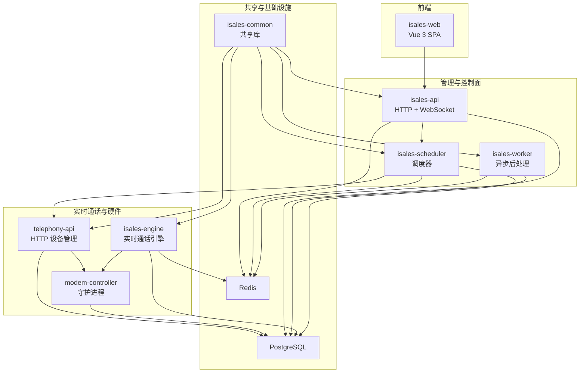
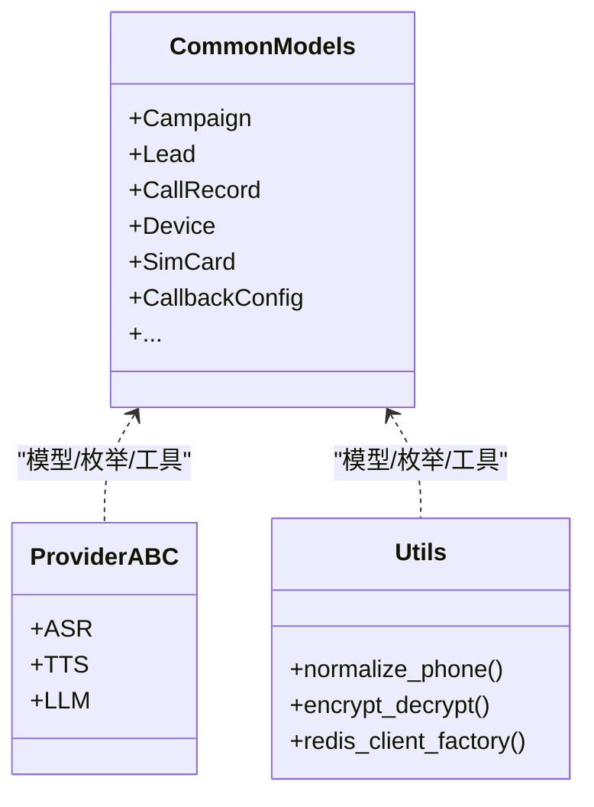
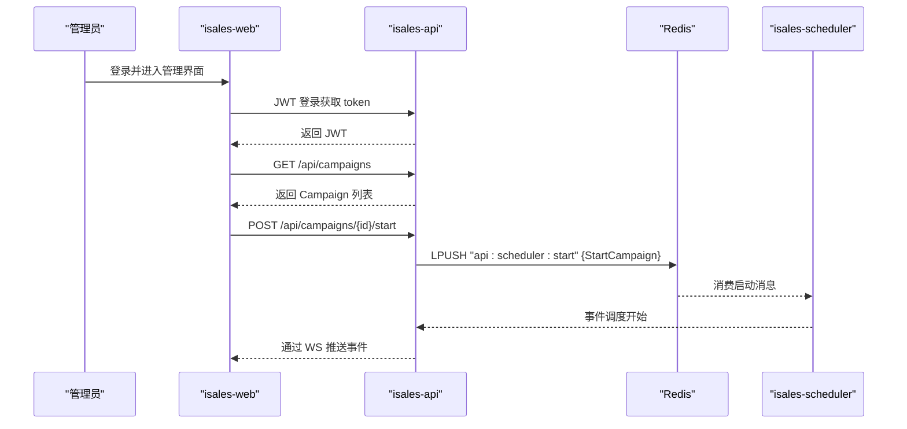
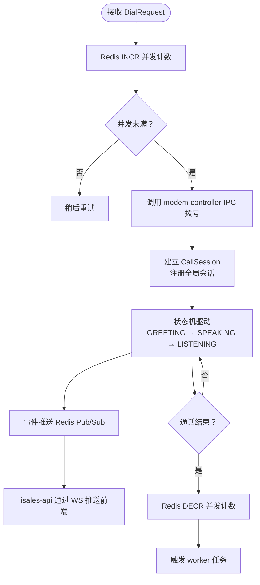
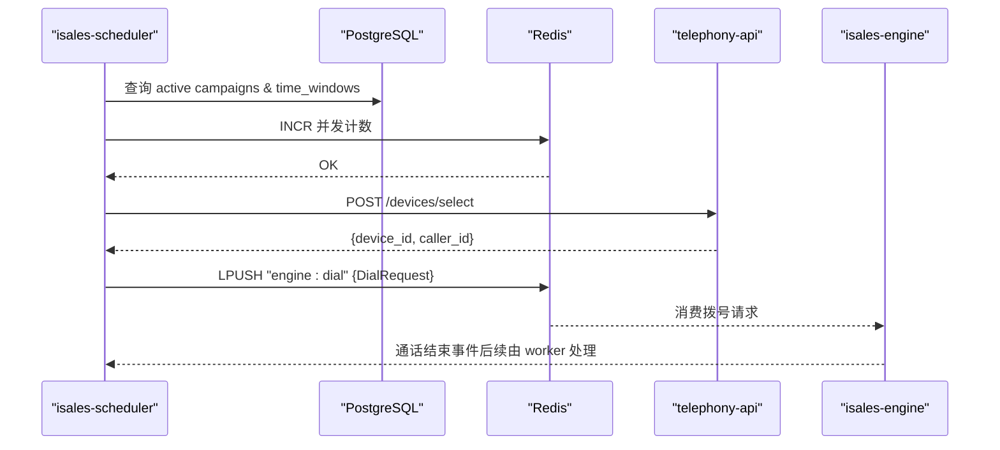
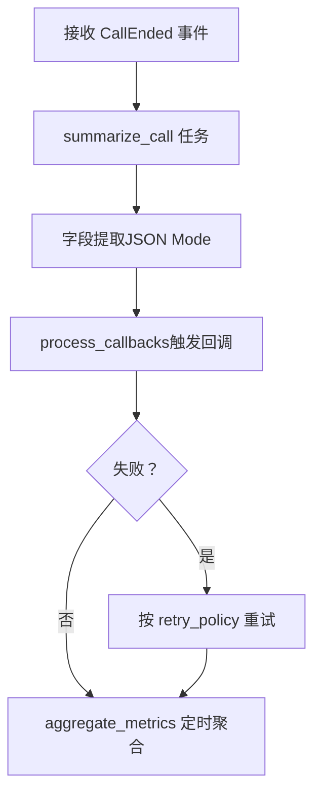
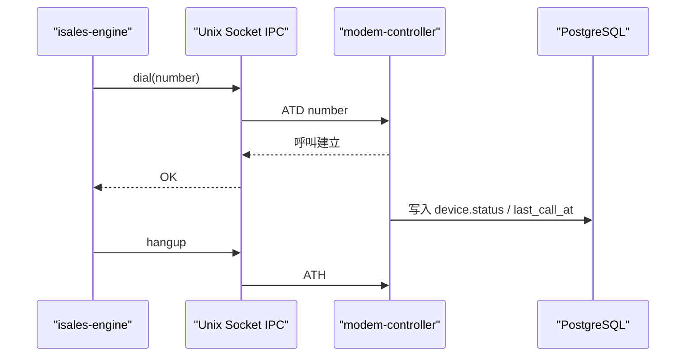
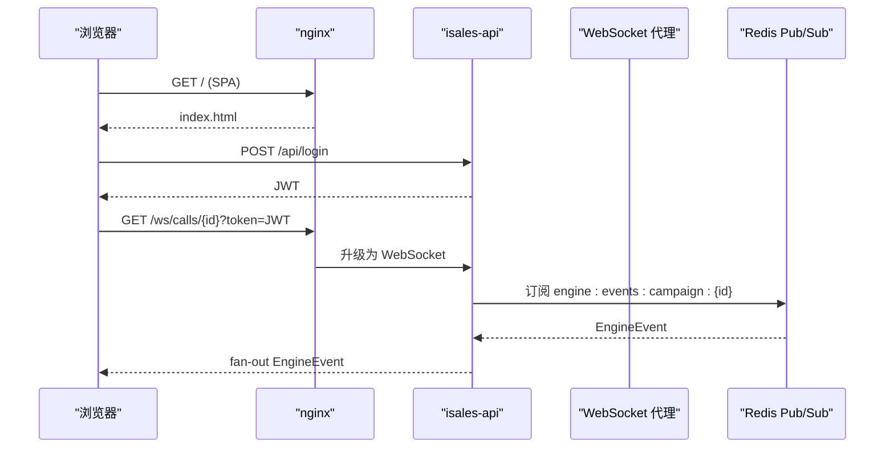
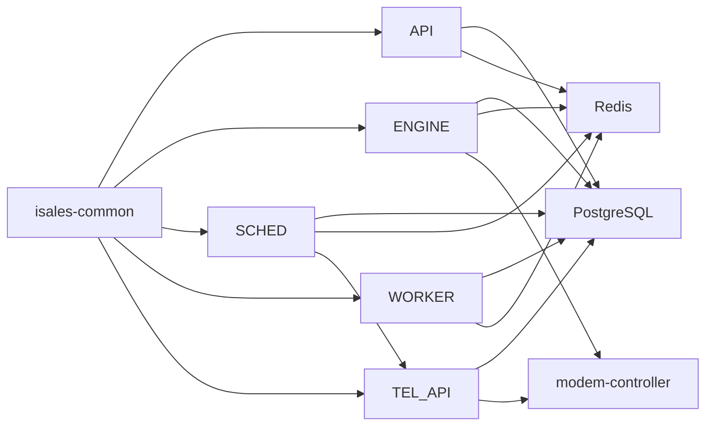

# 微服务架构设计

<cite>
**本文引用的文件**
- [README.md](file://README.md)
- [DESIGN.md](file://DESIGN.md)
- [IMPLEMENTATION_PLAN.md](file://IMPLEMENTATION_PLAN.md)
- [openspec/specs/architecture/spec.md](file://openspec/specs/architecture/spec.md)
- [openspec/specs/service-communication/spec.md](file://openspec/specs/service-communication/spec.md)
- [openspec/specs/deployment-topology/spec.md](file://openspec/specs/deployment-topology/spec.md)
- [openspec/specs/data-model/spec.md](file://openspec/specs/data-model/spec.md)
- [deploy/cloud/systemd/isales-api.service](file://deploy/cloud/systemd/isales-api.service)
- [deploy/cloud/systemd/isales-engine.service](file://deploy/cloud/systemd/isales-engine.service)
- [deploy/cloud/systemd/isales-scheduler.service](file://deploy/cloud/systemd/isales-scheduler.service)
- [deploy/cloud/systemd/isales-worker.service](file://deploy/cloud/systemd/isales-worker.service)
- [deploy/cloud/env/api.env.example](file://deploy/cloud/env/api.env.example)
- [deploy/cloud/env/engine.env.example](file://deploy/cloud/env/engine.env.example)
- [deploy/cloud/env/scheduler.env.example](file://deploy/cloud/env/scheduler.env.example)
- [deploy/cloud/env/worker.env.example](file://deploy/cloud/env/worker.env.example)
- [deploy/env/telephony-api.env.example](file://deploy/env/telephony-api.env.example)
- [deploy/env/modem-controller.env.example](file://deploy/env/modem-controller.env.example)
</cite>

## 目录
1. [简介](#简介)
2. [项目结构](#项目结构)
3. [核心组件](#核心组件)
4. [架构总览](#架构总览)
5. [详细组件分析](#详细组件分析)
6. [依赖关系分析](#依赖关系分析)
7. [性能考虑](#性能考虑)
8. [故障排查指南](#故障排查指南)
9. [结论](#结论)
10. [附录](#附录)

## 简介
本文件面向 iSales 系统的微服务架构设计，围绕 7 个独立服务进行系统化阐述：isales-common（共享库）、isales-api（管理后台）、isales-engine（实时通话引擎）、isales-scheduler（线索调度）、isales-worker（异步处理）、isales-telephony（硬件控制）、isales-web（前端界面）。文档从设计理念、职责边界、接口设计、依赖关系、部署拓扑、数据模型、通信通道、以及跨仓库职责重叠处理策略等方面展开，并结合 OpenSpec 规范与实施计划，形成可落地、可演进的架构蓝图。

## 项目结构
iSales 采用“7 仓库”微服务架构，isales-common 作为共享库被其余 6 个服务依赖；各服务职责边界清晰，v1 单主机部署在同一台服务器上，通过 systemd 管理进程，PostgreSQL 与 Redis 作为共享数据层。



图表来源
- [openspec/specs/architecture/spec.md:130-168](file://openspec/specs/architecture/spec.md#L130-L168)
- [openspec/specs/deployment-topology/spec.md:6-42](file://openspec/specs/deployment-topology/spec.md#L6-L42)
- [openspec/specs/service-communication/spec.md:11-24](file://openspec/specs/service-communication/spec.md#L11-L24)

章节来源
- [README.md:1-86](file://README.md#L1-L86)
- [DESIGN.md:1-75](file://DESIGN.md#L1-L75)
- [openspec/specs/architecture/spec.md:1-168](file://openspec/specs/architecture/spec.md#L1-L168)
- [openspec/specs/deployment-topology/spec.md:1-414](file://openspec/specs/deployment-topology/spec.md#L1-L414)

## 核心组件
本节概述 7 个服务的职责与实现原则，强调“共享库先行、职责边界清晰、通信通道统一”的设计思想。

- isales-common（共享库）
  - 职责：Pydantic/SQLAlchemy 模型、Provider ABC（ASR/TTS/LLM）、Alembic 迁移、工具函数（加密、号码归一化、Redis 客户端工厂）。
  - 原则：仅包含跨服务共享的稳定接口，避免过早抽取特定服务的业务逻辑；所有服务通过依赖该共享库访问数据库模型与公共能力。
  
- isales-api（管理后台）
  - 职责：Campaign/Lead/Role/Voice/Analytics/Callback 等 CRUD；WebSocket 代理；JWT 鉴权；向 Redis 发布 Campaign 启停事件。
  - 原则：作为唯一 JWT 签发方；前端直连 telephony-api 获取设备/卡资源；内部 HTTP 调用严格限制（v1 仅 scheduler → telephony-api）。
  
- isales-engine（实时通话引擎）
  - 职责：通话状态机、AI 三层管线（角色 LLM/裁判 LLM/润色）、打断/沉默/垫词、转人工、WRAPPING_UP 收尾、事件推送、与 modem-controller 本地 IPC 交互。
  - 原则：全局并发计数器基于 Redis 原子计数；异常中断时优雅清理；支持 mock 与真实 Provider 切换。
  
- isales-scheduler（线索调度）
  - 职责：扫描活动 Campaign、时间窗口校验、全局并发控制、历史摘要打包、调用 telephony-api 选号、写入 engine:dial 队列。
  - 原则：队列用于“必须送达”的工作派发；重试与跟进策略由调度器负责，不依赖 engine 单测。
  
- isales-worker（异步处理）
  - 职责：通话结束后的摘要生成、字段提取（JSON Mode）、Webhook 回调（JsonLogic 触发 + Jinja2 模板 + HMAC 签名）、指标聚合。
  - 原则：失败按 retry_policy 重试；与回调配置解耦；数据聚合定时任务。
  
- isales-telephony（硬件控制）
  - 职责：telephony-api（HTTP）提供设备/卡 CRUD 与选号；modem-controller（守护进程）负责 udev 监听、AT 命令、PCM 音频、Unix socket IPC、设备状态回写。
  - 原则：v1 阶段 2 仅提供骨架与 mock 实现，真实硬件接入留到阶段 6；单主机部署下内部 HTTP 仅用于设备选择。
  
- isales-web（前端界面）
  - 职责：任务/线索/音色/设备/数据看板/通话监控/通话记录/回调配置等管理页面；通过 WebSocket 订阅 engine 事件。
  - 原则：SPA 由 nginx 反代；与 telephony-api 直连获取设备/卡资源；EngineEvent 解析遵循 message-contract 规约。

章节来源
- [openspec/specs/architecture/spec.md:26-44](file://openspec/specs/architecture/spec.md#L26-L44)
- [openspec/specs/service-communication/spec.md:11-24](file://openspec/specs/service-communication/spec.md#L11-L24)
- [openspec/specs/data-model/spec.md:19-51](file://openspec/specs/data-model/spec.md#L19-L51)
- [openspec/specs/deployment-topology/spec.md:6-42](file://openspec/specs/deployment-topology/spec.md#L6-L42)

## 架构总览
下图展示了服务间的整体交互：API 作为控制面协调调度与事件；Scheduler 与 Worker 通过 Redis 队列/发布订阅协同；Engine 与 Telephony 通过 IPC 与 HTTP 协作；所有服务共享 isales-common 的模型与迁移；数据库与 Redis 为统一数据面。

```mermaid
graph TB
WEB["isales-web"]
API["isales-api"]
SCHED["isales-scheduler"]
WORKER["isales-worker"]
ENGINE["isales-engine"]
TEL_API["telephony-api"]
MODEM["modem-controller"]
COMMON["isales-common"]
DB["PostgreSQL"]
REDIS["Redis"]
WEB --> API
API --> SCHED
API < --> REDIS
SCHED --> REDIS
SCHED --> TEL_API
TEL_API --> DB
TEL_API --> MODEM
MODEM --> DB
ENGINE --> REDIS
ENGINE --> MODEM
ENGINE --> DB
WORKER --> REDIS
WORKER --> DB
API --> DB
COMMON --> API
COMMON --> ENGINE
COMMON --> SCHED
COMMON --> WORKER
COMMON --> TEL_API
```

图表来源
- [openspec/specs/architecture/spec.md:130-168](file://openspec/specs/architecture/spec.md#L130-L168)
- [openspec/specs/service-communication/spec.md:11-24](file://openspec/specs/service-communication/spec.md#L11-L24)

## 详细组件分析

### isales-common（共享库）
- 设计要点
  - 以 isales-common 为核心，沉淀跨服务共享的数据模型、Pydantic Schema、Provider ABC、迁移脚本与工具函数。
  - 严格限制“仅共享、不绑定特定业务流程”，避免跨仓库耦合。
- 数据模型与迁移
  - 12 张核心表由 isales-common 管理，其他服务通过依赖访问 ORM 模型，禁止绕过 ORM 直接 DDL。
- 依赖关系
  - isales-api、isales-engine、isales-scheduler、isales-worker、isales-telephony 均依赖该共享库。



图表来源
- [openspec/specs/data-model/spec.md:28-51](file://openspec/specs/data-model/spec.md#L28-L51)
- [openspec/specs/architecture/spec.md:73-86](file://openspec/specs/architecture/spec.md#L73-L86)

章节来源
- [openspec/specs/architecture/spec.md:73-86](file://openspec/specs/architecture/spec.md#L73-L86)
- [openspec/specs/data-model/spec.md:5-18](file://openspec/specs/data-model/spec.md#L5-L18)

### isales-api（管理后台）
- 职责边界
  - Campaign/Lead/Role/Voice/Analytics/Callback CRUD；WebSocket /ws/calls/{campaign_id} 订阅 Redis Pub/Sub 事件；JWT 鉴权；向 Redis 发布 Campaign 启停消息。
- 通信与鉴权
  - 唯一 JWT 签发方；telephony-api 仅验证；HMAC 密钥通过环境变量注入；前端直连 telephony-api 获取设备/卡资源。
- 部署与进程
  - systemd 单实例运行；监听 0.0.0.0:8000；nginx 反代 /api 与 /ws。



图表来源
- [openspec/specs/service-communication/spec.md:106-131](file://openspec/specs/service-communication/spec.md#L106-L131)
- [openspec/specs/deployment-topology/spec.md:317-395](file://openspec/specs/deployment-topology/spec.md#L317-L395)

章节来源
- [openspec/specs/architecture/spec.md:96-129](file://openspec/specs/architecture/spec.md#L96-L129)
- [openspec/specs/service-communication/spec.md:106-131](file://openspec/specs/service-communication/spec.md#L106-L131)
- [deploy/cloud/systemd/isales-api.service:1-35](file://deploy/cloud/systemd/isales-api.service#L1-L35)

### isales-engine（实时通话引擎）
- 职责边界
  - 通话状态机、AI 三层管线（角色/裁判/润色）、打断/沉默/垫词、转人工、WRAPPING_UP 收尾、事件推送、与 modem-controller 本地 IPC 交互。
- 并发与容错
  - 全局并发计数器基于 Redis 原子计数；异常中断时清理受影响的 call_session；支持 mock 与真实 Provider 切换。
- 通信通道
  - 通过 Redis Pub/Sub 向 API 推送事件；通过 Redis 队列接收调度器拨号请求；通过 Unix socket/WS 与 modem-controller 交互。



图表来源
- [openspec/specs/service-communication/spec.md:45-63](file://openspec/specs/service-communication/spec.md#L45-L63)
- [openspec/specs/architecture/spec.md:130-168](file://openspec/specs/architecture/spec.md#L130-L168)

章节来源
- [openspec/specs/service-communication/spec.md:45-63](file://openspec/specs/service-communication/spec.md#L45-L63)
- [openspec/specs/architecture/spec.md:130-168](file://openspec/specs/architecture/spec.md#L130-L168)

### isales-scheduler（线索调度）
- 职责边界
  - 扫描活动 Campaign、时间窗口校验、全局并发控制、历史摘要打包、调用 telephony-api 选号、写入 engine:dial 队列。
- 重试与跟进
  - 未接通的 lead 按 Campaign 的 retry_policy 重排；跟进策略由调度器负责，不依赖 engine 单测。
- 通信通道
  - Redis 队列用于“必须送达”的工作派发；内部 HTTP 仅用于设备选择。



图表来源
- [openspec/specs/service-communication/spec.md:11-19](file://openspec/specs/service-communication/spec.md#L11-L19)
- [openspec/specs/deployment-topology/spec.md:62-75](file://openspec/specs/deployment-topology/spec.md#L62-L75)

章节来源
- [openspec/specs/service-communication/spec.md:11-19](file://openspec/specs/service-communication/spec.md#L11-L19)
- [openspec/specs/deployment-topology/spec.md:62-75](file://openspec/specs/deployment-topology/spec.md#L62-L75)

### isales-worker（异步处理）
- 职责边界
  - 摘要生成（LLM JSON Mode）、字段提取、Webhook 回调（JsonLogic 触发 + Jinja2 模板 + HMAC 签名）、指标聚合。
- 重试与幂等
  - 失败按 retry_policy 重试；回调日志与重试时间戳保证幂等。
- 数据面
  - 通过 Redis 队列接收 engine 事件；写回数据库与外部系统。



图表来源
- [openspec/specs/service-communication/spec.md:11-24](file://openspec/specs/service-communication/spec.md#L11-L24)
- [openspec/specs/data-model/spec.md:39-45](file://openspec/specs/data-model/spec.md#L39-L45)

章节来源
- [openspec/specs/service-communication/spec.md:11-24](file://openspec/specs/service-communication/spec.md#L11-L24)
- [openspec/specs/data-model/spec.md:39-45](file://openspec/specs/data-model/spec.md#L39-L45)

### isales-telephony（硬件控制）
- 职责边界
  - telephony-api：设备/卡 CRUD、选号 API；modem-controller：udev 监听、AT 命令、PCM 音频、Unix socket IPC、设备状态回写。
- v1 阶段
  - 阶段 2 仅提供骨架与 mock 实现；真实硬件接入留到阶段 6；单主机部署下内部 HTTP 仅用于设备选择。
- 通信通道
  - 与 engine 通过本地 IPC 交互；与数据库直连写回设备/卡状态。



图表来源
- [openspec/specs/service-communication/spec.md:18-21](file://openspec/specs/service-communication/spec.md#L18-L21)
- [openspec/specs/architecture/spec.md:130-168](file://openspec/specs/architecture/spec.md#L130-L168)

章节来源
- [openspec/specs/service-communication/spec.md:18-21](file://openspec/specs/service-communication/spec.md#L18-L21)
- [openspec/specs/architecture/spec.md:130-168](file://openspec/specs/architecture/spec.md#L130-L168)

### isales-web（前端界面）
- 职责边界
  - 管理页面：任务/线索/音色/设备/数据看板/通话监控/通话记录/回调配置；通过 WebSocket 订阅 engine 事件。
- 通信与鉴权
  - 通过 isales-api 获取 JWT；直连 telephony-api 获取设备/卡资源；EngineEvent 解析遵循 message-contract 规约。
- 部署形态
  - SPA 由 nginx 反代；静态资源与 /api、/ws 通过反代统一入口。



图表来源
- [openspec/specs/service-communication/spec.md:106-146](file://openspec/specs/service-communication/spec.md#L106-L146)
- [openspec/specs/deployment-topology/spec.md:317-395](file://openspec/specs/deployment-topology/spec.md#L317-L395)

章节来源
- [openspec/specs/service-communication/spec.md:106-146](file://openspec/specs/service-communication/spec.md#L106-L146)
- [openspec/specs/deployment-topology/spec.md:317-395](file://openspec/specs/deployment-topology/spec.md#L317-L395)

## 依赖关系分析
- 服务间依赖
  - isales-common 为 6 个服务的依赖；API 与 telephony-api 共享 JWT 鉴权体系；engine 依赖 modem-controller 与 telephony-api；scheduler 依赖 telephony-api 选号；worker 依赖 engine 事件。
- 数据依赖
  - 所有服务通过 isales-common 的 SQLAlchemy 模型访问 PostgreSQL；Redis 用于队列、Pub/Sub、全局并发计数与缓存。
- 环境变量契约
  - /etc/isales/env/ 下集中化注入，跨服务一致性变量包括数据库 URL、Redis URL、JWT 密钥。



图表来源
- [openspec/specs/architecture/spec.md:59-72](file://openspec/specs/architecture/spec.md#L59-L72)
- [openspec/specs/deployment-topology/spec.md:40-61](file://openspec/specs/deployment-topology/spec.md#L40-L61)

章节来源
- [openspec/specs/architecture/spec.md:59-72](file://openspec/specs/architecture/spec.md#L59-L72)
- [openspec/specs/deployment-topology/spec.md:40-61](file://openspec/specs/deployment-topology/spec.md#L40-L61)

## 性能考虑
- 并发控制
  - 全局并发计数器基于 Redis 原子计数，避免计数器泄漏；engine 启动时清理孤儿计数。
- 队列与 Pub/Sub 边界
  - 队列用于“必须送达”的工作派发；Pub/Sub 用于“实时、可丢失”的事件广播，降低延迟与资源占用。
- 通信通道一致性
  - 通道选型与协议风格统一，避免引入未列通道；消息序列化建议 v1 全部用 JSON，后续按需优化。
- 数据库与 Redis 容错
  - 短暂不可用时重连重试；engine 中断重连期间不接受新拨号但可完成当前通话；modem-controller 不可用时优雅清理受影响的 call_session。

章节来源
- [openspec/specs/service-communication/spec.md:31-90](file://openspec/specs/service-communication/spec.md#L31-L90)

## 故障排查指南
- systemd 与进程重启顺序
  - 重启顺序：telephony-api → scheduler → worker → engine → api；engine 重启须在低峰期或维护窗口执行。
- 环境变量一致性校验
  - 通过 meta-repo 的 deploy-check 校验 deploy/env/*.env.example 与各服务 README 环境变量列表一致。
- 备份与恢复
  - PostgreSQL 日级别备份与 Redis AOF/RDB 持久化；提供从 pg_dump 恢复到全新 PG 实例的演练步骤。
- 监控与告警
  - Prometheus 指标暴露契约；最小告警集覆盖队列深度、设备 flagged 比例、回调失败率、PG 连接数等。

章节来源
- [openspec/specs/deployment-topology/spec.md:62-132](file://openspec/specs/deployment-topology/spec.md#L62-L132)
- [openspec/specs/deployment-topology/spec.md:95-113](file://openspec/specs/deployment-topology/spec.md#L95-L113)

## 结论
iSales 的微服务架构以 isales-common 为基石，围绕“共享库先行、职责边界清晰、通信通道统一、单主机部署”的原则，实现了从管理后台到实时通话引擎的完整闭环。通过 OpenSpec 的变更提案流程与实施计划，确保了架构演进的可追溯性与可落地性。v1 的设计兼顾工程效率与可运维性，为后续多实例扩展与能力增强奠定了坚实基础。

## 附录
- 环境变量示例与集中化注入
  - API/Engine/Scheduler/Worker 的环境变量示例位于 deploy/cloud/env 与 deploy/env；通过 systemd EnvironmentFile 注入。
- 部署脚本与回滚策略
  - install.sh/migrate.sh/deploy.sh/rollback.sh 幂等实现；原子发布与 schema 回滚分离。

章节来源
- [deploy/cloud/env/api.env.example](file://deploy/cloud/env/api.env.example)
- [deploy/cloud/env/engine.env.example](file://deploy/cloud/env/engine.env.example)
- [deploy/cloud/env/scheduler.env.example](file://deploy/cloud/env/scheduler.env.example)
- [deploy/cloud/env/worker.env.example](file://deploy/cloud/env/worker.env.example)
- [deploy/env/telephony-api.env.example](file://deploy/env/telephony-api.env.example)
- [deploy/env/modem-controller.env.example](file://deploy/env/modem-controller.env.example)
- [openspec/specs/deployment-topology/spec.md:114-132](file://openspec/specs/deployment-topology/spec.md#L114-L132)