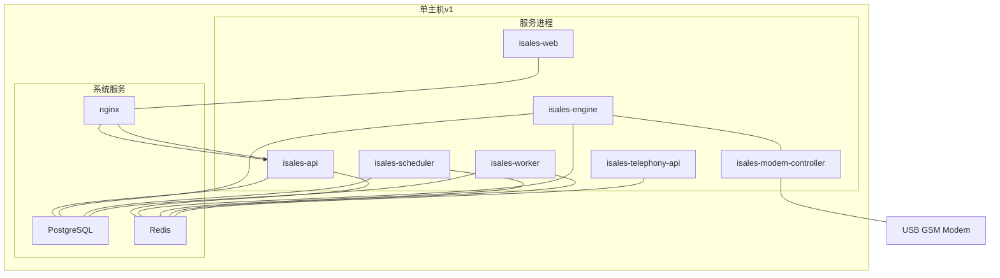
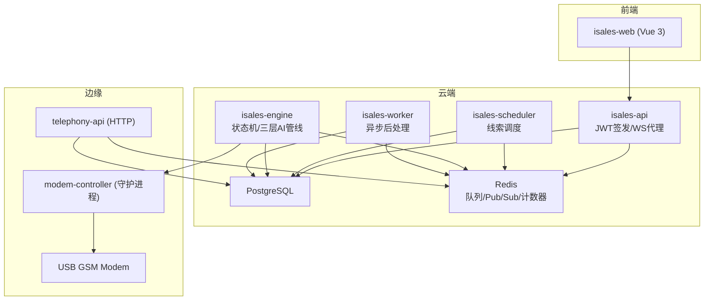
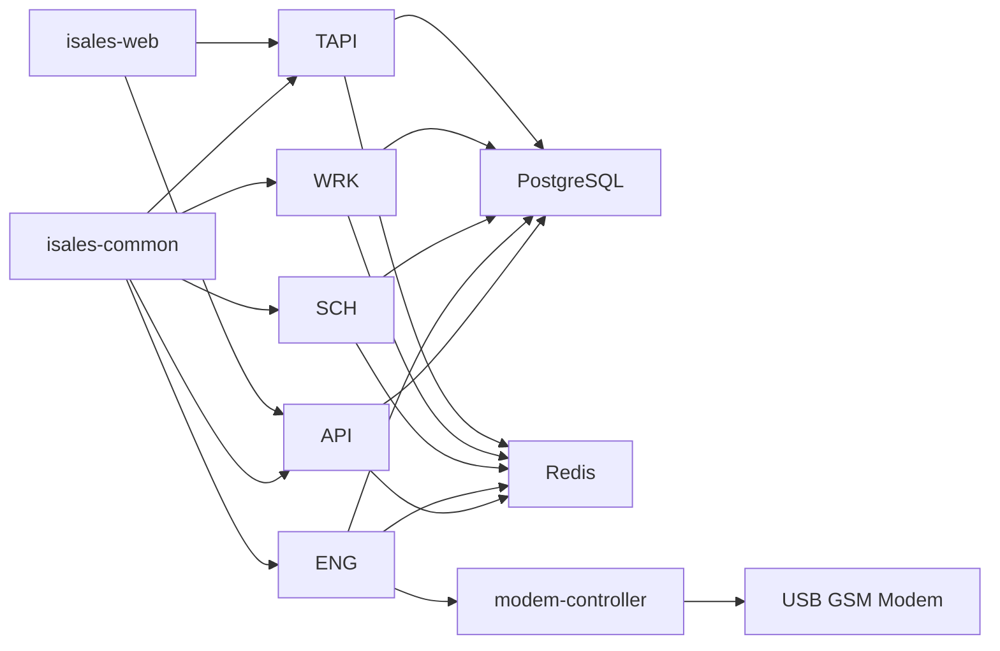

# 服务架构概览

<cite>
**本文引用的文件**
- [README.md](file://README.md)
- [DESIGN.md](file://DESIGN.md)
- [openspec/specs/architecture/spec.md](file://openspec/specs/architecture/spec.md)
- [openspec/specs/deployment-topology/spec.md](file://openspec/specs/deployment-topology/spec.md)
- [openspec/specs/service-communication/spec.md](file://openspec/specs/service-communication/spec.md)
- [openspec/specs/data-model/spec.md](file://openspec/specs/data-model/spec.md)
- [openspec/specs/message-contract/spec.md](file://openspec/specs/message-contract/spec.md)
- [deploy/README.md](file://deploy/README.md)
- [deploy/env/api.env.example](file://deploy/env/api.env.example)
- [deploy/env/engine.env.example](file://deploy/env/engine.env.example)
- [deploy/env/telephony-api.env.example](file://deploy/env/telephony-api.env.example)
- [openspec/v1-roadmap.md](file://openspec/v1-roadmap.md)
</cite>

## 目录
1. [简介](#简介)
2. [项目结构](#项目结构)
3. [核心组件](#核心组件)
4. [架构总览](#架构总览)
5. [详细组件分析](#详细组件分析)
6. [依赖关系分析](#依赖关系分析)
7. [性能考量](#性能考量)
8. [故障排查指南](#故障排查指南)
9. [结论](#结论)
10. [附录](#附录)

## 简介
本文件面向 iSales 系统 v1 的服务架构，系统采用“7 仓库微服务 + 单主机部署”的设计，围绕统一的共享库、统一的数据库与 Redis、以及统一的 JWT 鉴权体系，构建从云端到边缘的完整外呼销售自动化平台。本文重点解释：
- 为什么选择 7 个独立 Git 仓库而非 monorepo
- v1 单主机部署模型与拓扑
- 服务间通信模式：Redis 队列、Pub/Sub、Unix socket 本地 IPC
- 统一 JWT 鉴权体系的设计原理与实现方式
- 架构图解读与各服务在整体架构中的位置关系

## 项目结构
iSales 由 7 个独立仓库组成，其中 isales-common 作为共享库被其余 6 个服务依赖。v1 部署采用单主机模型，所有服务进程通过 systemd（Linux）或 launchd（macOS）管理，PostgreSQL 与 Redis 作为系统服务运行，nginx 作为 isales-web 的静态资源与反向代理。

图表来源
- [openspec/specs/architecture/spec.md:130-168](file://openspec/specs/architecture/spec.md#L130-L168)
- [openspec/specs/deployment-topology/spec.md:1-414](file://openspec/specs/deployment-topology/spec.md#L1-L414)
- [deploy/README.md:1-112](file://deploy/README.md#L1-L112)

章节来源
- [README.md:1-86](file://README.md#L1-L86)
- [DESIGN.md:1-75](file://DESIGN.md#L1-L75)
- [openspec/specs/architecture/spec.md:1-168](file://openspec/specs/architecture/spec.md#L1-L168)
- [openspec/specs/deployment-topology/spec.md:1-414](file://openspec/specs/deployment-topology/spec.md#L1-L414)
- [deploy/README.md:1-112](file://deploy/README.md#L1-L112)

## 核心组件
- isales-common：Pydantic/SQLAlchemy 模型、Provider ABC、Alembic 迁移、跨服务共享 schema，作为 7 个服务的依赖库。
- isales-api：管理后台 + WebSocket 代理，负责签发 JWT、接收前端请求、与 engine 通过 Redis Pub/Sub 实时交互。
- isales-engine：实时通话引擎，包含状态机、AI 三层管线、打断/沉默/垫词、ASR/TTS/LLM Provider 实现，并与 modem-controller 通过本地 IPC 通信。
- isales-scheduler：线索调度，负责 Campaign 启停、拨号队列、时间窗口与重试跟进。
- isales-worker：异步后处理，负责通话结束后摘要、字段提取、Webhook 回调与数据聚合。
- isales-telephony：包含 telephony-api（HTTP）与 modem-controller（守护进程），前者提供设备/卡 CRUD 与选择，后者负责 AT 命令、音频桥接与硬件状态回写。
- isales-web：Vue 3 管理后台，通过 nginx 反代访问 isales-api，并可直连 telephony-api 获取设备/卡资源。

章节来源
- [openspec/specs/architecture/spec.md:26-58](file://openspec/specs/architecture/spec.md#L26-L58)
- [openspec/specs/data-model/spec.md:1-83](file://openspec/specs/data-model/spec.md#L1-L83)

## 架构总览
下图展示了 v1 的整体架构：7 个服务进程、共享的 isales-common、统一的 PostgreSQL 与 Redis，以及服务间通过 Redis 队列/Pub/Sub 与本地 IPC 通信。nginx 作为 isales-web 的静态资源与反向代理，前端通过 WebSocket 订阅 engine 事件。

图表来源
- [openspec/specs/architecture/spec.md:130-168](file://openspec/specs/architecture/spec.md#L130-L168)
- [openspec/specs/service-communication/spec.md:1-150](file://openspec/specs/service-communication/spec.md#L1-L150)
- [openspec/specs/deployment-topology/spec.md:1-414](file://openspec/specs/deployment-topology/spec.md#L1-L414)

## 详细组件分析

### 1) 7 仓库微服务架构与 monorepo 选型
- 7 仓库划分：isales-common、isales-api、isales-engine、isales-scheduler、isales-worker、isales-telephony、isales-web。
- isales-common 作为共享库，仅包含跨服务稳定接口与模型，不包含特定服务的业务逻辑。
- 不引入 monorepo：单仓库代码量在 Claude Code 单会话上下文中难以高效迭代；isales-common 通过 pip 包分发可清晰隔离边界。

章节来源
- [openspec/specs/architecture/spec.md:5-25](file://openspec/specs/architecture/spec.md#L5-L25)

### 2) v1 单主机部署模型与拓扑
- 部署模型：Linux + systemd（主线）与 macOS + launchd（门店/现场）两种单主机部署。
- 目录骨架：/opt/isales/releases/<ts>/（每次 install 落新目录）+ /etc/isales/env/（集中化 env 文件）。
- 服务启停顺序：按依赖顺序重启，避免下游在上游未就绪时启动产生连接风暴。
- 数据持久化：PostgreSQL 与 Redis 启用至少日级别的备份与持久化。
- 监控：Prometheus / Grafana 配置模板，最小告警集覆盖关键指标。
- 回滚：原子发布 + rollback.sh 切回历史 release 软链，不动 schema。

章节来源
- [openspec/specs/deployment-topology/spec.md:6-132](file://openspec/specs/deployment-topology/spec.md#L6-L132)
- [deploy/README.md:1-112](file://deploy/README.md#L1-L112)

### 3) 服务间通信模式
- Redis 队列：用于“必须送达，可异步处理”的工作派发，如 scheduler→engine、engine→worker、api→scheduler。
- Redis Pub/Sub：用于“实时、可丢失”的事件广播，如 api↔engine 的实时控制与事件推送。
- 本地 IPC（Unix socket / WebSocket）：engine 与 modem-controller 之间的拨号、挂断、PCM 音频流双向通信。
- HTTP：v1 仅 scheduler→telephony-api 的同步调用（设备选择），其他通信走 Redis。
- 数据库直连：所有服务通过 isales-common 的 SQLAlchemy 模型直连 PostgreSQL，不引入数据网关层。

章节来源
- [openspec/specs/service-communication/spec.md:7-105](file://openspec/specs/service-communication/spec.md#L7-L105)
- [openspec/specs/data-model/spec.md:5-18](file://openspec/specs/data-model/spec.md#L5-L18)

### 4) 统一 JWT 鉴权体系
- 签发方：isales-api 为唯一 JWT 签发方；telephony-api 仅验证。
- HMAC 密钥：通过环境变量（命名约定 ISALES_JWT_SECRET）注入两个服务，不写死在代码或库中。
- 前端直连：isales-web 可直连 telephony-api，使用从 isales-api 拿到的 JWT；避免引入无收益的 BFF 层。
- 内部调用：v1 单主机部署下，scheduler 调用 telephony-api 的 POST /devices/select 可免 JWT，但网络层需限制 telephony-api 仅监听 loopback 或内部网段；多主机扩展（v2）需引入服务账号 JWT 或 mTLS。
- isales-common：不提供 JWT 签发函数；可提供 JWT 验证工具函数（如解码与签名校验），前提是不绑定特定密钥来源。

章节来源
- [openspec/specs/architecture/spec.md:96-129](file://openspec/specs/architecture/spec.md#L96-L129)
- [deploy/env/api.env.example:1-14](file://deploy/env/api.env.example#L1-L14)
- [deploy/env/telephony-api.env.example:1-12](file://deploy/env/telephony-api.env.example#L1-L12)

### 5) WebSocket 代理与前端订阅
- isales-api 提供 /ws/calls/{campaign_id} WebSocket endpoint，订阅 Redis Pub/Sub channel，fan-out 给所有该 campaign 的连接客户端。
- 前端（isales-web）订阅 WebSocket 后，通过 EngineEvent discriminated union 解析消息；未知类型仅 console.warn 并跳过，不整连接断开。
- v1 单实例限制：isales-api 单实例运行，不假设跨实例消息广播；多实例扩展（v2）需经 OpenSpec change proposal。

章节来源
- [openspec/specs/service-communication/spec.md:106-146](file://openspec/specs/service-communication/spec.md#L106-L146)

### 6) 数据模型与迁移管理
- isales-common 统一管理 SQLAlchemy 模型与 Alembic 迁移；其他服务通过依赖 isales-common 间接访问。
- 表归属：每张表标记其主要业务归属，归属决定 schema 演进与 PR 主导权；多个服务可读写但归属仅一个。
- JSONB 字段：用于半结构化的配置或事件流，任何新引入的 JSONB 字段附带 schema 描述。

章节来源
- [openspec/specs/data-model/spec.md:5-83](file://openspec/specs/data-model/spec.md#L5-L83)

### 7) 消息契约与序列化
- 跨服务消息体集中定义在 isales-common，所有服务的 producer/consumer 引用同一 Pydantic 模型。
- 消息基类包含 schema_version、message_id、created_at；consumer 校验 schema_version 并按 dead letter 处理不支持版本。
- v1 必有的消息类：DialRequest、CallEnded、EngineControl、EngineEvent、CampaignControl。

章节来源
- [openspec/specs/message-contract/spec.md:1-85](file://openspec/specs/message-contract/spec.md#L1-L85)

### 8) 云-边拆分（v1 路线图）
- 边缘：modem-controller + 新增 audio-bridge（阿里 RTC PaaS 客户端），控制面长连接（gRPC bidi stream over TLS）。
- 云端：api/engine/scheduler/worker/web/db/redis 直接搬；engine 新增 SFU-side 消费者，把入站 PCM 喂 streaming ASR，TTS 流式回 PCM 喂 SFU。
- Windows 客户端：边缘以 Windows 客户端形态交付到客户 PC，登录即启 tray app，激活码注册流程。

章节来源
- [openspec/v1-roadmap.md:1-576](file://openspec/v1-roadmap.md#L1-L576)

## 依赖关系分析
- 依赖方向：isales-common 被 6 个服务依赖；各服务依赖 Redis 与 PostgreSQL；engine 依赖 modem-controller；telephony-api 依赖数据库。
- 耦合与内聚：isales-common 仅承载跨服务稳定接口，避免过早抽到 common 的内容被限定在特定服务业务流程中。
- 外部依赖：PostgreSQL、Redis、nginx、systemd/launchd、阿里 RTC PaaS（云-边拆分后）。

图表来源
- [openspec/specs/architecture/spec.md:130-168](file://openspec/specs/architecture/spec.md#L130-L168)
- [openspec/specs/service-communication/spec.md:1-150](file://openspec/specs/service-communication/spec.md#L1-L150)
- [openspec/specs/data-model/spec.md:1-83](file://openspec/specs/data-model/spec.md#L1-L83)

章节来源
- [openspec/specs/architecture/spec.md:73-86](file://openspec/specs/architecture/spec.md#L73-L86)
- [openspec/specs/service-communication/spec.md:78-105](file://openspec/specs/service-communication/spec.md#L78-L105)

## 性能考量
- 队列与 Pub/Sub 边界：队列保证“必须送达”，Pub/Sub 保证“实时可丢失”。引擎拨号前并发计数器使用 Redis 原子计数器（INCR/DECR），避免计数器泄漏。
- 通信故障容错：Redis 短暂不可用时各服务重连重试；DB 不可用时引擎将通话状态缓存至 Redis（v2 优化），v1 则按异常通话处理；modem-controller 不可用时优雅清理受影响的 call_session。
- WebSocket 代理：共享 Redis Pub/Sub 订阅 fan-out 给所有连接，避免重复订阅成本；未知事件类型仅 warn 并跳过，不整连接断开。
- 云-边拆分：流式全链路（streaming everything）、barge-in（用户随时打断）、预缓存开场白与高频追问句，降低端到端响应时间。

章节来源
- [openspec/specs/service-communication/spec.md:31-105](file://openspec/specs/service-communication/spec.md#L31-L105)
- [openspec/v1-roadmap.md:26-105](file://openspec/v1-roadmap.md#L26-L105)

## 故障排查指南
- 首次部署：参考 RUNBOOK，按 provision → edit env → install → migrate → deploy 的顺序执行。
- 服务启停顺序：deploy.sh 按依赖顺序重启服务，避免连接风暴；engine restart 不属于 zero-downtime，需在低峰期执行。
- 备份恢复：每日备份 PG 与 Redis，备份恢复演练义务明确；回滚不动 schema，仅切回历史 release 软链 + 重启服务。
- 监控告警：Prometheus 抓取 jobs 与最小告警集覆盖；Grafana overview dashboard 展示关键指标。
- JWT 验证：telephony-api 仅验证 JWT，验证失败返回 401；isales-web 直连 telephony-api 使用从 isales-api 拿到的 JWT。

章节来源
- [openspec/specs/deployment-topology/spec.md:62-132](file://openspec/specs/deployment-topology/spec.md#L62-L132)
- [openspec/specs/architecture/spec.md:96-129](file://openspec/specs/architecture/spec.md#L96-L129)

## 结论
iSales v1 的架构通过“7 仓库微服务 + 单主机部署”实现了清晰的职责边界与可运维性，借助统一的 isales-common、统一的数据库与 Redis、以及统一的 JWT 鉴权体系，构建了从前端到边缘的完整链路。服务间通信采用 Redis 队列/Pub/Sub 与本地 IPC，既保证了可靠性又兼顾了实时性。v1 路线图进一步规划了云-边拆分与流式全链路，为后续扩展奠定基础。

## 附录
- 环境变量示例：isales-api、isales-engine、isales-telephony 的 env 示例文件展示了跨服务一致性约束（如 ISALES_DATABASE_URL、ISALES_REDIS_URL、ISALES_JWT_SECRET）。
- 云-边通信拓扑：控制面 gRPC bidi stream over TLS + 媒体面阿里 RTC PaaS，Engine session co-location，断线重连与本地 SQLite WAL buffer。

章节来源
- [deploy/env/api.env.example:1-14](file://deploy/env/api.env.example#L1-L14)
- [deploy/env/engine.env.example:1-21](file://deploy/env/engine.env.example#L1-L21)
- [deploy/env/telephony-api.env.example:1-12](file://deploy/env/telephony-api.env.example#L1-L12)
- [openspec/v1-roadmap.md:456-491](file://openspec/v1-roadmap.md#L456-L491)