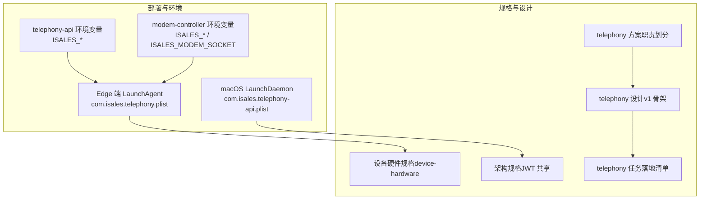
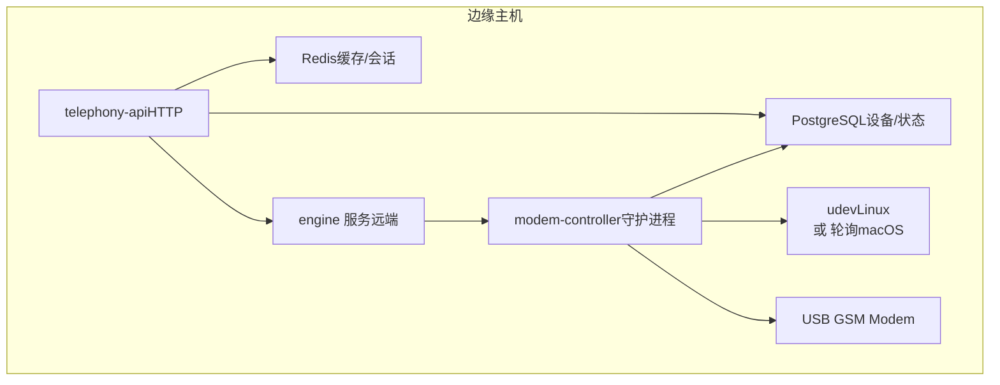
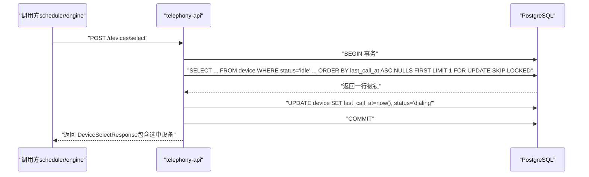
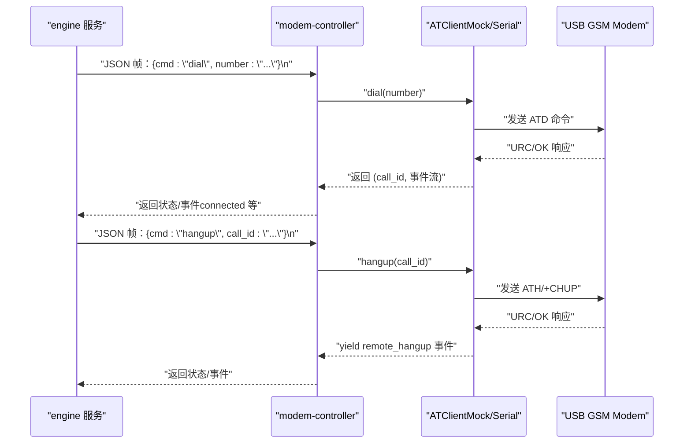
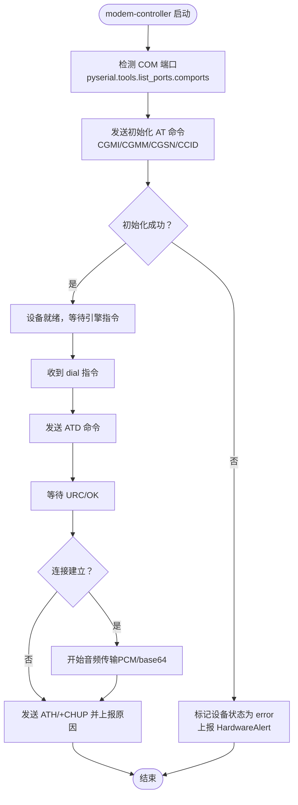
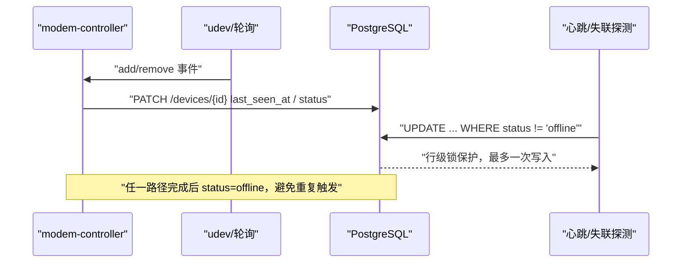
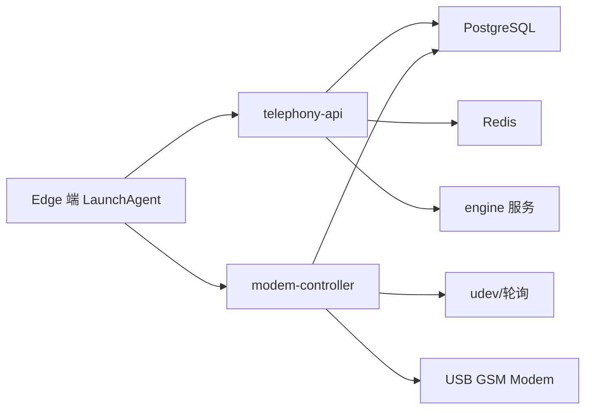

# 电话服务 isales-telephony

<cite>
**本文引用的文件**
- [device-hardware 规格（2026-05-06 归档）](file://openspec/changes/archive/2026-05-06-impl-telephony/specs/device-hardware/spec.md)
- [telephony 设计（2026-05-06 归档）](file://openspec/changes/archive/2026-05-06-impl-telephony/design.md)
- [telephony 方案（2026-05-06 归档）](file://openspec/changes/archive/2026-05-06-impl-telephony/proposal.md)
- [telephony 任务（2026-05-06 归档）](file://openspec/changes/archive/2026-05-06-impl-telephony/tasks.md)
- [设备硬件规格（2026-05-12 实施 macOS）](file://openspec/changes/archive/2026-05-12-impl-deploy-macos/specs/device-hardware/spec.md)
- [设备硬件规格（2026-05-17 实现真实 AT）](file://openspec/changes/archive/2026-05-17-impl-real-at/specs/device-hardware/spec.md)
- [设备硬件规格（2026-05-17 Windows 客户端）](file://openspec/changes/archive/2026-05-17-windows-client-core/specs/device-hardware/spec.md)
- [telephony-api 环境变量示例](file://deploy/env/telephony-api.env.example)
- [modem-controller 环境变量示例](file://deploy/env/modem-controller.env.example)
- [Edge 端 telephony LaunchAgent（macOS）](file://deploy/edge/launchd/com.isales.telephony.plist)
- [macOS telephony-api LaunchDaemon](file://deploy/macos/plist/com.isales.telephony-api.plist)
- [架构规格（JWT 共享体系）](file://openspec/changes/archive/2026-05-01-clarify-stage2-boundaries/specs/architecture/spec.md)
</cite>

## 目录
1. [简介](#简介)
2. [项目结构](#项目结构)
3. [核心组件](#核心组件)
4. [架构总览](#架构总览)
5. [详细组件分析](#详细组件分析)
6. [依赖关系分析](#依赖关系分析)
7. [性能考虑](#性能考虑)
8. [故障排查指南](#故障排查指南)
9. [结论](#结论)
10. [附录](#附录)

## 简介
本文件面向 isales-telephony 硬件控制服务，系统性阐述其双重职责：
- telephony-api：基于 FastAPI 的 HTTP 服务，提供设备与 SIM 卡资源管理、设备选择算法等接口。
- modem-controller：守护进程，负责与 USB GSM Modem 的 AT 命令交互、PCM 音频处理、udev 设备管理，并通过 Unix Socket 与 engine 服务进行 IPC 通信。

文档重点覆盖：
- telephony-api 的 HTTP 接口设计与实现要点（设备管理、SIM 卡管理、设备选择并发安全）。
- modem-controller 的实现原理（AT 命令处理、PCM 音频处理、udev 设备管理）。
- USB GSM Modem 的控制机制与音频处理流程。
- 与 engine 服务的状态同步与 IPC 通信机制。
- 具体的 API 端点示例与硬件交互流程。

## 项目结构
isales-telephony 仓库采用“规格先行、落地实施”的方式组织内容。本仓库不包含实际代码，而是通过规格文档、方案与任务清单描述服务的职责、协议与实现策略。相关部署与环境变量位于 deploy 目录，规格文档位于 openspec 目录。

图表来源
- [telephony-api 环境变量示例:1-12](file://deploy/env/telephony-api.env.example#L1-L12)
- [modem-controller 环境变量示例:1-15](file://deploy/env/modem-controller.env.example#L1-L15)
- [Edge 端 telephony LaunchAgent（macOS）:1-75](file://deploy/edge/launchd/com.isales.telephony.plist#L1-L75)
- [macOS telephony-api LaunchDaemon:1-37](file://deploy/macos/plist/com.isales.telephony-api.plist#L1-L37)
- [设备硬件规格（2026-05-06 归档）:1-26](file://openspec/changes/archive/2026-05-06-impl-telephony/specs/device-hardware/spec.md#L1-L26)
- [telephony 设计（2026-05-06 归档）:1-118](file://openspec/changes/archive/2026-05-06-impl-telephony/design.md#L1-L118)
- [telephony 方案（2026-05-06 归档）:1-61](file://openspec/changes/archive/2026-05-06-impl-telephony/proposal.md#L1-L61)
- [telephony 任务（2026-05-06 归档）:42-55](file://openspec/changes/archive/2026-05-06-impl-telephony/tasks.md#L42-L55)

章节来源
- [telephony-api 环境变量示例:1-12](file://deploy/env/telephony-api.env.example#L1-L12)
- [modem-controller 环境变量示例:1-15](file://deploy/env/modem-controller.env.example#L1-L15)
- [Edge 端 telephony LaunchAgent（macOS）:1-75](file://deploy/edge/launchd/com.isales.telephony.plist#L1-L75)
- [macOS telephony-api LaunchDaemon:1-37](file://deploy/macos/plist/com.isales.telephony-api.plist#L1-L37)
- [telephony 设计（2026-05-06 归档）:1-118](file://openspec/changes/archive/2026-05-06-impl-telephony/design.md#L1-L118)

## 核心组件
- telephony-api（HTTP 服务）
  - 基于 FastAPI，提供设备、SIM 卡与绑定关系的 CRUD 接口。
  - 提供 POST /devices/select，使用 PostgreSQL 行级锁实现并发安全的设备选择。
  - 提供设备健康监控定时任务（v1 阶段 2 使用 stub 数据）。
  - JWT 验证中间件（仅验证，不签发），密钥来自环境变量。
- modem-controller（守护进程）
  - Unix Socket IPC 服务，使用行分隔 JSON 帧格式。
  - 暴露 dial/hangup/status/audio_downstream 等指令（v1 骨架阶段为 mock 实现）。
  - udev 监听器（Linux）或轮询（macOS）监听 USB GSM Modem 插拔事件。
  - AT 命令客户端抽象（ATClient Protocol），v1 骨架阶段提供 Mock 实现，阶段 6 将接入真实串口驱动。

章节来源
- [telephony 方案（2026-05-06 归档）:18-34](file://openspec/changes/archive/2026-05-06-impl-telephony/proposal.md#L18-L34)
- [telephony 设计（2026-05-06 归档）:12-27](file://openspec/changes/archive/2026-05-06-impl-telephony/design.md#L12-L27)
- [telephony 任务（2026-05-06 归档）:42-55](file://openspec/changes/archive/2026-05-06-impl-telephony/tasks.md#L42-L55)

## 架构总览
telephony 服务在单主机部署场景下由两个 systemd/launchd 单元运行：
- telephony-api：HTTP 服务，监听环回或内部网段，提供设备与 SIM 管理接口。
- modem-controller：守护进程，监听 Unix Socket，负责与 USB GSM Modem 的 AT 命令交互与设备状态同步。

图表来源
- [telephony 设计（2026-05-06 归档）:88-92](file://openspec/changes/archive/2026-05-06-impl-telephony/design.md#L88-L92)
- [设备硬件规格（2026-05-12 实施 macOS）:44-51](file://openspec/changes/archive/2026-05-12-impl-deploy-macos/specs/device-hardware/spec.md#L44-L51)
- [设备硬件规格（2026-05-17 实现真实 AT）:1-73](file://openspec/changes/archive/2026-05-17-impl-real-at/specs/device-hardware/spec.md#L1-L73)

## 详细组件分析

### telephony-api：HTTP 接口设计与实现
- 职责与范围
  - 设备管理：/devices 的 CRUD（列表、详情、创建、更新、删除）。
  - SIM 卡管理：/sim-cards 的 CRUD。
  - 设备与 SIM 绑定：/device-sim-bindings 获取绑定列表（含历史 unbind_at）。
  - 设备选择：POST /devices/select，使用 PostgreSQL 行级锁 SELECT ... FOR UPDATE SKIP LOCKED，确保并发安全与“认领”语义。
  - 设备健康监控：定时任务扫描设备，计算健康状态（v1 阶段 2 使用 stub 数据）。
  - OpenAPI 文档自动生成。
  - JWT 验证中间件（HS256），密钥来自环境变量 ISALES_JWT_SECRET；服务间内部调用可免 JWT（v1 单主机部署限制在环回/内部网段）。

- 并发选号与事务模型
  - /devices/select 在单事务内执行：先查询 idle 设备并加锁（SKIP LOCKED），再更新 last_call_at 与状态为 dialing，最后提交事务。
  - 该模型避免了应用层分布式锁的复杂性，利用数据库原生能力保证并发一致性。

- JWT 共享体系
  - isales-api 为唯一 JWT 签发方，telephony-api 仅验证；密钥通过环境变量分发，避免在代码或库中硬编码。

图表来源
- [telephony 设计（2026-05-06 归档）:31-42](file://openspec/changes/archive/2026-05-06-impl-telephony/design.md#L31-L42)
- [架构规格（JWT 共享体系）:3-25](file://openspec/changes/archive/2026-05-01-clarify-stage2-boundaries/specs/architecture/spec.md#L3-L25)

章节来源
- [telephony 方案（2026-05-06 归档）:18-26](file://openspec/changes/archive/2026-05-06-impl-telephony/proposal.md#L18-L26)
- [telephony 设计（2026-05-06 归档）:12-27](file://openspec/changes/archive/2026-05-06-impl-telephony/design.md#L12-L27)
- [架构规格（JWT 共享体系）:3-25](file://openspec/changes/archive/2026-05-01-clarify-stage2-boundaries/specs/architecture/spec.md#L3-L25)

### modem-controller：守护进程与硬件交互
- IPC 通信协议
  - Unix Socket + 行分隔 JSON 帧格式（newline-delimited），每条消息以 \n 结尾，单条消息 ≤ 1 MiB。
  - 双向独立异步流，消息不互相阻塞；控制指令与音频流可交错在同一 socket。
  - 与 engine 服务的通信路径：engine 作为客户端连接 /var/run/isales/modem.sock，发送 newline-delimited JSON 消息。

- AT 命令处理
  - ATClient Protocol 抽象：dial(number) -> CallId、hangup(call_id)、get_signal()、get_iccid()、get_imei()。
  - v1 骨架阶段提供 MockATClient（返回固定值 + 模拟延迟），阶段 6 将接入 SerialATClient（pyserial）。
  - 真实实现将通过串口发送 AT 命令（ATD 拨号、ATH 挂断、AT+CSQ 信号、AT+CCID 卡号、AT+CGSN IMEI 等），路径抽象为 pyserial.tools.list_ports.comports()。

- PCM 音频处理
  - v1 阶段 2：音频处理为 mock；阶段 6 将实现 PCM 音频的采集/播放与 base64 编解码。
  - 音频通道与控制消息在同一 socket 流中传输（v1 简化）。

- udev 设备管理
  - Linux：使用 pyudev 监听 subsystem='tty' 的 udev 事件（实时内核 netlink）。
  - macOS：使用轮询（1 Hz）比较设备集合差集推导 add/remove 事件。
  - 事件处理：add 事件记录 ICCID 并写 device.last_seen_at；remove 事件置 device.status=offline。

图表来源
- [设备硬件规格（2026-05-06 归档）:3-25](file://openspec/changes/archive/2026-05-06-impl-telephony/specs/device-hardware/spec.md#L3-L25)
- [telephony 设计（2026-05-06 归档）:44-62](file://openspec/changes/archive/2026-05-06-impl-telephony/design.md#L44-L62)
- [设备硬件规格（2026-05-17 实现真实 AT）:1-73](file://openspec/changes/archive/2026-05-17-impl-real-at/specs/device-hardware/spec.md#L1-L73)

章节来源
- [设备硬件规格（2026-05-06 归档）:3-25](file://openspec/changes/archive/2026-05-06-impl-telephony/specs/device-hardware/spec.md#L3-L25)
- [telephony 设计（2026-05-06 归档）:44-74](file://openspec/changes/archive/2026-05-06-impl-telephony/design.md#L44-L74)
- [telephony 任务（2026-05-06 归档）:49-55](file://openspec/changes/archive/2026-05-06-impl-telephony/tasks.md#L49-L55)

### USB GSM Modem 控制机制与音频处理流程
- 控制机制
  - 串口路径抽象：Linux 为 /dev/ttyUSB*，macOS 为 /dev/cu.usbmodem* / /dev/cu.usbserial-*。
  - 初始化序列：识别到 COM 端口后，顺序发送 AT+CGMI（厂商）/ AT+CGMM（型号）/ AT+CGSN（IMEI）/ AT+CCID（ICCID）等命令完成设备元数据登记。
  - 竞争互斥：构造 SerialATClient 时使用 fcntl.flock(LOCK_EX | LOCK_NB) 获取独占锁，避免多进程竞争串口。

- 音频处理流程（v1 阶段 2）
  - PCM 音频通过同一 socket 通道传输，采用 base64 编码（v1 简化）。
  - 阶段 6 将实现真实的 ALSA/ARTC 音频采集与播放。

图表来源
- [设备硬件规格（2026-05-17 实现真实 AT）:77-92](file://openspec/changes/archive/2026-05-17-impl-real-at/specs/device-hardware/spec.md#L77-L92)
- [设备硬件规格（2026-05-17 Windows 客户端）:77-92](file://openspec/changes/archive/2026-05-17-windows-client-core/specs/device-hardware/spec.md#L77-L92)

章节来源
- [设备硬件规格（2026-05-17 实现真实 AT）:15-21](file://openspec/changes/archive/2026-05-17-impl-real-at/specs/device-hardware/spec.md#L15-L21)
- [设备硬件规格（2026-05-17 Windows 客户端）:77-92](file://openspec/changes/archive/2026-05-17-windows-client-core/specs/device-hardware/spec.md#L77-L92)

### 与 engine 服务的状态同步与 IPC 通信
- IPC 协议
  - Unix Socket 路径默认 /var/run/isales/modem.sock，可通过环境变量 ISALES_MODEM_SOCKET 覆盖。
  - 消息格式：newline-delimited JSON，单条消息 ≤ 1 MiB；EOF 且未遇 \n 视为协议错误，关闭连接并告警。
  - 双向独立异步流，消息不互相阻塞；控制指令与音频流可交错。

- 状态同步
  - udev 拔出与 watchdog 失联探测可能同时发生：udev 路径直接 PATCH /devices/{id} 置 status=offline；watchdog 通过 UPDATE WHERE status != 'offline' 守卫，DB 行级锁保证最多一次写入。
  - 心跳恢复：心跳仅更新 last_seen_at，不隐式翻转 status；恢复 status=idle 由 udev 注册路径或运维显式操作触发。

图表来源
- [设备硬件规格（2026-05-06 归档）:22-25](file://openspec/changes/archive/2026-05-06-impl-telephony/specs/device-hardware/spec.md#L22-L25)
- [telephony 设计（2026-05-06 归档）:70-74](file://openspec/changes/archive/2026-05-06-impl-telephony/design.md#L70-L74)

章节来源
- [设备硬件规格（2026-05-06 归档）:22-25](file://openspec/changes/archive/2026-05-06-impl-telephony/specs/device-hardware/spec.md#L22-L25)
- [telephony 设计（2026-05-06 归档）:70-74](file://openspec/changes/archive/2026-05-06-impl-telephony/design.md#L70-L74)

## 依赖关系分析
- 运行时依赖
  - 数据库：PostgreSQL（asyncpg），用于设备与状态持久化。
  - 缓存：Redis，用于会话与临时状态。
  - 串口：pyserial（阶段 6），用于真实 AT 命令通道。
  - 设备监听：Linux 使用 pyudev，macOS 使用轮询。
- 进程边界
  - telephony-api 与 modem-controller 为独立进程，通过 Unix Socket 通信。
  - edge 端（macOS）通过单一 LaunchAgent 聚合四个组件：modem-controller、audio-bridge、cloud-edge gRPC 客户端、telephony-api loopback。

图表来源
- [telephony 设计（2026-05-06 归档）:8-10](file://openspec/changes/archive/2026-05-06-impl-telephony/design.md#L8-L10)
- [Edge 端 telephony LaunchAgent（macOS）:6-13](file://deploy/edge/launchd/com.isales.telephony.plist#L6-L13)

章节来源
- [telephony 设计（2026-05-06 归档）:8-10](file://openspec/changes/archive/2026-05-06-impl-telephony/design.md#L8-L10)
- [Edge 端 telephony LaunchAgent（macOS）:6-13](file://deploy/edge/launchd/com.isales.telephony.plist#L6-L13)

## 性能考虑
- 选号并发：使用 PostgreSQL 行级锁 SELECT ... FOR UPDATE SKIP LOCKED，避免应用层锁带来的额外复杂性与性能损耗。
- IPC 简化：Unix Socket + 行分隔 JSON，实现简单、调试友好，适合本地进程间通信。
- 音频简化：v1 阶段 2 采用 base64 编码与同一通道传输，降低实现复杂度；阶段 6 将引入更高效的音频编解码与传输策略。
- 设备监听：Linux 使用实时 udev，macOS 使用 1 Hz 轮询，平衡精度与开销。

## 故障排查指南
- IPC 连接问题
  - 检查 /var/run/isales/modem.sock 是否存在且权限正确。
  - 确认消息帧格式：每条消息以 \n 结尾，单条 ≤ 1 MiB；不完整帧将导致连接关闭。
- 设备选择冲突
  - 并发请求应通过 /devices/select 的事务模型保证不撞车；若出现异常，检查数据库连接与事务提交逻辑。
- udev/轮询异常
  - Linux：确认 pyudev 安装与权限；macOS：确认轮询任务正常运行。
- AT 命令通道
  - 串口被占用：检查 fcntl.flock 是否获取独占锁；串口路径是否正确。
  - 真实硬件：使用 scripts/at_smoke.py 进行端到端冒烟测试，验证拨号、连接与挂断流程。

章节来源
- [设备硬件规格（2026-05-06 归档）:3-25](file://openspec/changes/archive/2026-05-06-impl-telephony/specs/device-hardware/spec.md#L3-L25)
- [telephony 设计（2026-05-06 归档）:94-104](file://openspec/changes/archive/2026-05-06-impl-telephony/design.md#L94-L104)
- [设备硬件规格（2026-05-17 实现真实 AT）:60-67](file://openspec/changes/archive/2026-05-17-impl-real-at/specs/device-hardware/spec.md#L60-L67)

## 结论
isales-telephony 通过清晰的双进程架构实现了电话服务的两大职责：telephony-api 提供稳定的 HTTP 接口与设备管理能力，modem-controller 负责与硬件的深度交互与 IPC 通信。v1 阶段以 mock 实现快速落地，为后续阶段（真实 AT、音频处理、多平台支持）奠定了坚实基础。通过规范化的 IPC 协议、并发安全的设备选择算法与健壮的设备监听机制，系统在单主机部署场景下具备良好的可维护性与可扩展性。

## 附录
- 环境变量参考
  - telephony-api：ISALES_DATABASE_URL、ISALES_REDIS_URL、ISALES_JWT_SECRET。
  - modem-controller：ISALES_DATABASE_URL、ISALES_MODEM_SOCKET、ISALES_SKIP_UDEV、MOCK_DIAL_DELAY_MS、MOCK_CALL_DURATION_MS。
- 部署参考
  - Edge 端（macOS）：com.isales.telephony.plist（LaunchAgent）。
  - macOS：com.isales.telephony-api.plist（LaunchDaemon）。

章节来源
- [telephony-api 环境变量示例:1-12](file://deploy/env/telephony-api.env.example#L1-L12)
- [modem-controller 环境变量示例:1-15](file://deploy/env/modem-controller.env.example#L1-L15)
- [Edge 端 telephony LaunchAgent（macOS）:1-75](file://deploy/edge/launchd/com.isales.telephony.plist#L1-L75)
- [macOS telephony-api LaunchDaemon:1-37](file://deploy/macos/plist/com.isales.telephony-api.plist#L1-L37)