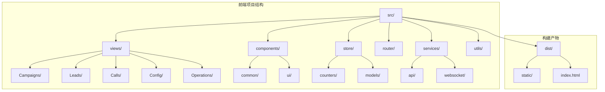
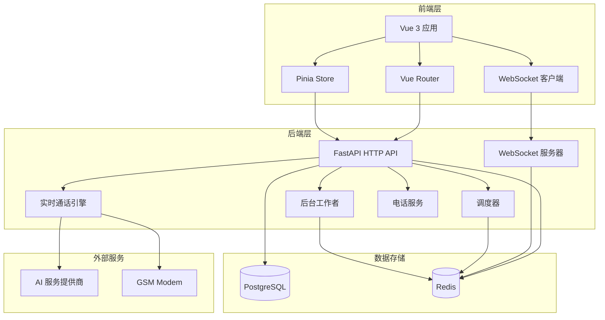
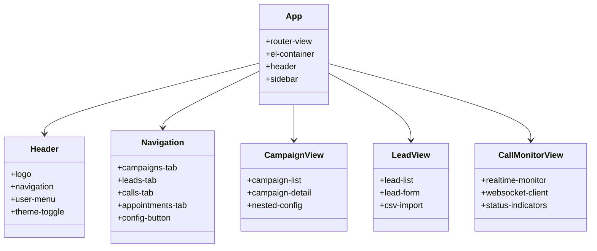
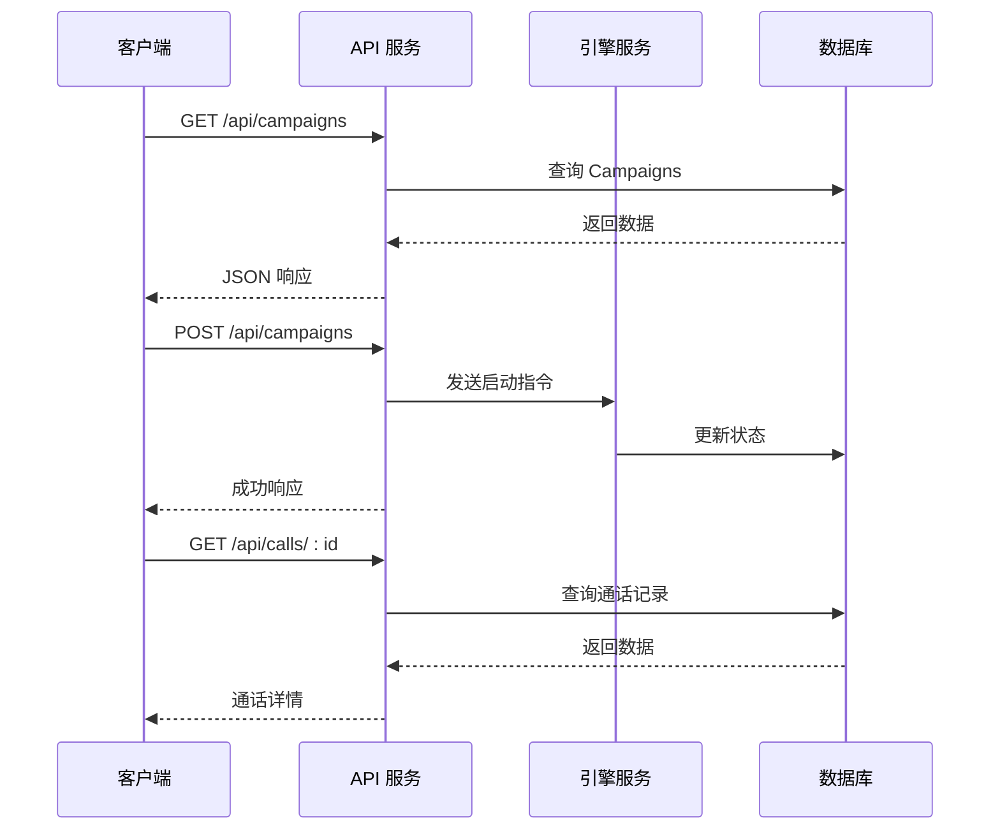
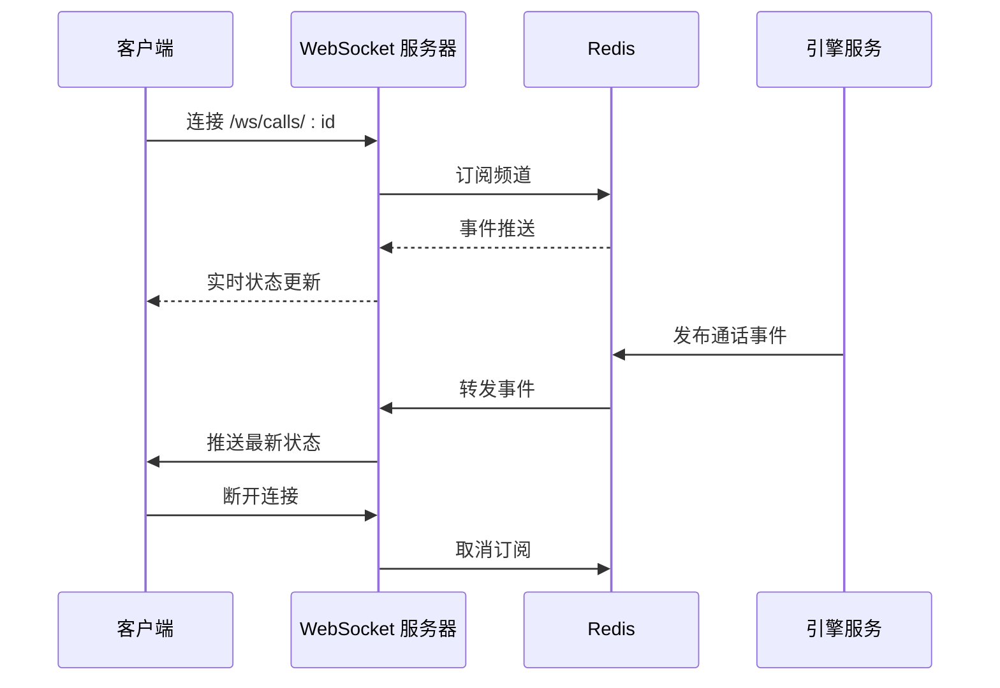
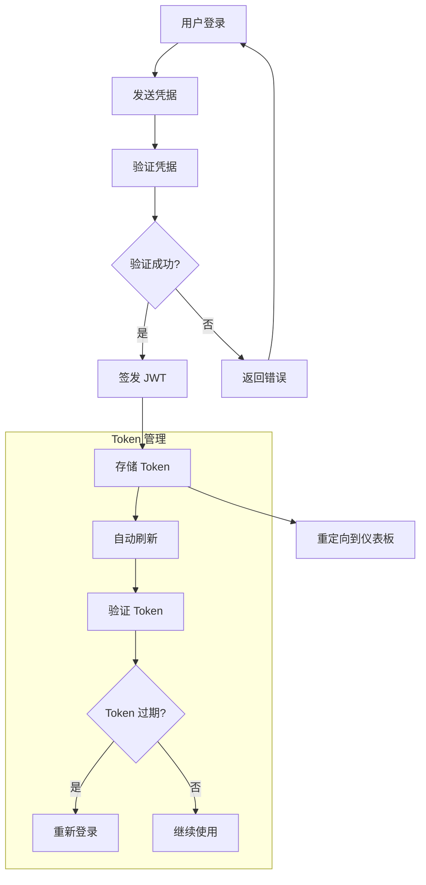
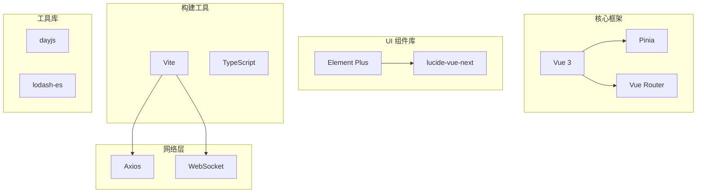

# 网页服务 isales-web

<cite>
**本文档引用的文件**
- [README.md](file://README.md)
- [openspec/specs/web-admin-ui/spec.md](file://openspec/specs/web-admin-ui/spec.md)
- [deploy/README.md](file://deploy/README.md)
- [DESIGN.md](file://DESIGN.md)
- [IMPLEMENTATION_PLAN.md](file://IMPLEMENTATION_PLAN.md)
</cite>

## 目录
1. [简介](#简介)
2. [项目结构](#项目结构)
3. [核心组件](#核心组件)
4. [架构概览](#架构概览)
5. [详细组件分析](#详细组件分析)
6. [依赖分析](#依赖分析)
7. [性能考虑](#性能考虑)
8. [故障排除指南](#故障排除指南)
9. [结论](#结论)

## 简介

isales-web 是基于 Vue 3 的管理面前端界面服务，负责提供 iSales AI 外呼销售系统的用户界面。该系统支持多种业务功能，包括任务管理、线索展示、角色配置、音色管理、设备监控、数据看板、实时通话监控等。

根据实施计划，isales-web 采用现代前端技术栈：Vue 3 + Vite + Element Plus + Pinia + Vue Router，为用户提供直观易用的管理界面。

## 项目结构

基于现有文档，isales-web 项目遵循清晰的功能模块化组织：



**图表来源**
- [deploy/README.md:35](file://deploy/README.md#L35)
- [IMPLEMENTATION_PLAN.md:264](file://IMPLEMENTATION_PLAN.md#L264)

**章节来源**
- [README.md:13](file://README.md#L13)
- [deploy/README.md:35](file://deploy/README.md#L35)
- [IMPLEMENTATION_PLAN.md:264](file://IMPLEMENTATION_PLAN.md#L264)

## 核心组件

### 任务管理系统

任务管理是 isales-web 的核心功能之一，主要负责 Campaign（场景/任务）的创建、配置和管理：

- **Campaign 列表视图**：展示所有 Campaign 的基本信息，包括名称、状态、线索数量、外呼进度等
- **Campaign 详情视图**：提供详细的配置界面，包括角色配置、垫词设置、可拨时段、音色选择等
- **嵌套配置管理**：支持多层级的 Prompt 配置（对话策略、质量判别、润色、垫词）

### 线索管理系统

线索管理提供完整的线索生命周期管理：

- **线索列表**：支持筛选、排序、分页显示
- **线索详情**：展示详细信息和关联数据
- **批量导入**：支持 CSV 格式批量导入
- **状态跟踪**：实时显示线索状态变化

### 音色管理系统

音色管理专注于语音合成配置：

- **音色库管理**：展示和管理可用的音色模型
- **试听功能**：提供音色试听能力
- **音色选择**：在 Campaign 配置中选择合适的音色

### 设备监控系统

设备监控负责硬件设备的状态管理：

- **设备列表**：显示所有可用的 GSM Modem 设备
- **SIM 卡管理**：管理 SIM 卡绑定和状态
- **设备健康监控**：监控设备使用情况和异常状态

### 数据看板系统

数据看板提供关键业务指标的可视化：

- **接通率统计**：实时显示通话接通情况
- **目标达成率**：展示销售目标完成情况
- **通话时长分布**：分析通话时长特征
- **趋势分析**：提供时间维度的数据趋势

### 实时通话监控系统

实时通话监控是 isales-web 的重要特色功能：

- **WebSocket 实时推送**：通过 WebSocket 实时接收通话状态
- **ASR 文本流**：显示实时语音识别结果
- **通话状态可视化**：展示通话各个阶段的状态
- **交互式监控**：支持用户参与通话监控

**章节来源**
- [openspec/specs/web-admin-ui/spec.md:8](file://openspec/specs/web-admin-ui/spec.md#L8)
- [openspec/specs/web-admin-ui/spec.md:35](file://openspec/specs/web-admin-ui/spec.md#L35)
- [IMPLEMENTATION_PLAN.md:268](file://IMPLEMENTATION_PLAN.md#L268)

## 架构概览

isales-web 采用前后端分离的架构设计，与后端服务通过 HTTP API 和 WebSocket 进行通信：



**图表来源**
- [deploy/README.md:18](file://deploy/README.md#L18)
- [deploy/README.md:22](file://deploy/README.md#L22)
- [IMPLEMENTATION_PLAN.md:138](file://IMPLEMENTATION_PLAN.md#L138)

## 详细组件分析

### Vue 3 组件架构

isales-web 采用现代化的 Vue 3 组件架构，具有以下特点：

#### 组件层次结构



**图表来源**
- [openspec/specs/web-admin-ui/spec.md:157](file://openspec/specs/web-admin-ui/spec.md#L157)
- [openspec/specs/web-admin-ui/spec.md:186](file://openspec/specs/web-admin-ui/spec.md#L186)

#### 状态管理模式

应用使用 Pinia 作为状态管理解决方案，提供以下功能：

- **全局状态管理**：用户认证状态、应用配置、主题设置
- **模块化 Store**：按功能划分不同的 Store 模块
- **响应式数据**：自动响应数据变化，更新 UI
- **持久化存储**：支持关键状态的本地持久化

### 路由设计与页面导航

isales-web 采用 Vue Router 实现页面导航，具有清晰的路由结构：

#### 路由配置

```mermaid
flowchart TD
ROOT[/] --> CAMPAIGNS[/campaigns]
ROOT --> LEADS[/leads]
ROOT --> CALLS[/calls]
ROOT --> APPOINTMENTS[/appointments]
ROOT --> CONFIG[/config]
CAMPAIGNS --> CAMPAIGN_LIST[/campaigns]
CAMPAIGNS --> CAMPAIGN_DETAIL[/campaigns/:id]
LEADS --> LEAD_LIST[/leads]
LEADS --> LEAD_DETAIL[/leads/:id]
CALLS --> CALL_LIST[/calls]
CALLS --> CALL_DETAIL[/calls/:id]
CONFIG --> MODEL_PROVIDERS[/config/model-providers]
ROOT --> OPERATIONS[/operations]
OPERATIONS --> DASHBOARD[/operations/dashboard]
OPERATIONS --> MONITOR[/operations/monitor/:id]
OPERATIONS --> DEVICES[/operations/devices]
OPERATIONS --> SIM_CARDS[/operations/sim-cards]
OPERATIONS --> VOICE_MODELS[/operations/voice-models]
OPERATIONS --> CALLBACK_CONFIGS[/operations/callback-configs]
OPERATIONS --> HANDOFF_TASKS[/operations/handoff-tasks]
OPERATIONS --> HOLIDAYS[/operations/holidays]
```

**图表来源**
- [openspec/specs/web-admin-ui/spec.md:10](file://openspec/specs/web-admin-ui/spec.md#L10)
- [openspec/specs/web-admin-ui/spec.md:37](file://openspec/specs/web-admin-ui/spec.md#L37)

#### 导航设计原则

- **业务导向**：导航结构围绕客户外呼工作流组织
- **响应式设计**：移动端适配，导航自动折叠
- **状态反馈**：当前激活的导航项有明确的视觉反馈
- **配置入口**：模型厂商配置作为独立入口

### 与后端服务的交互机制

#### HTTP 请求处理

isales-web 通过 Axios 发送 HTTP 请求与后端 API 交互：



**图表来源**
- [IMPLEMENTATION_PLAN.md:132](file://IMPLEMENTATION_PLAN.md#L132)
- [IMPLEMENTATION_PLAN.md:138](file://IMPLEMENTATION_PLAN.md#L138)

#### WebSocket 连接实现

实时通话监控通过 WebSocket 实现实时数据推送：



**图表来源**
- [IMPLEMENTATION_PLAN.md:138](file://IMPLEMENTATION_PLAN.md#L138)
- [deploy/README.md:138](file://deploy/README.md#L138)

### 实时监控功能实现

#### 实时数据流处理

实时监控功能通过以下机制实现：

- **事件驱动架构**：基于 Redis Pub/Sub 的事件发布订阅
- **状态机管理**：维护通话状态的完整生命周期
- **增量更新**：只推送变化的数据，减少网络传输
- **错误恢复**：自动重连和状态同步

#### 用户体验设计

- **状态指示器**：清晰显示通话各个阶段的状态
- **实时文本流**：ASR 文本的实时显示和高亮
- **交互控制**：支持用户参与通话监控
- **性能优化**：虚拟滚动和数据分页

### JWT 认证实现

#### 认证流程



**图表来源**
- [IMPLEMENTATION_PLAN.md:139](file://IMPLEMENTATION_PLAN.md#L139)

#### 安全考虑

- **Token 存储**：使用 HttpOnly Cookie 存储，防止 XSS 攻击
- **自动刷新**：实现 Refresh Token 机制，提升用户体验
- **权限控制**：基于角色的访问控制（RBAC）
- **安全头**：启用 CSP、HSTS 等安全头部

### 设计系统与主题

#### 设计令牌系统

应用采用独立的设计令牌系统：

- **色彩系统**：定义主色、状态色、辅助色
- **字体系统**：中文字体的字号和字重规范
- **间距系统**：统一的间距和边距规范
- **圆角系统**：组件的圆角半径规范

#### 主题切换

- **暗色主题预留**：为未来的暗色主题切换做准备
- **CSS 变量**：使用 CSS 变量实现主题切换
- **组件适配**：Element Plus 组件的主题适配

**章节来源**
- [openspec/specs/web-admin-ui/spec.md:124](file://openspec/specs/web-admin-ui/spec.md#L124)
- [openspec/specs/web-admin-ui/spec.md:143](file://openspec/specs/web-admin-ui/spec.md#L143)

## 依赖分析

### 技术栈依赖

isales-web 采用现代化的前端技术栈：



**图表来源**
- [IMPLEMENTATION_PLAN.md:278](file://IMPLEMENTATION_PLAN.md#L278)

### 外部依赖关系

- **后端 API**：依赖 isales-api 提供的 RESTful API
- **实时服务**：依赖 Redis 和 WebSocket 服务器
- **AI 服务**：通过后端代理访问第三方 AI 服务
- **音频服务**：通过 modem-controller 提供的音频处理

**章节来源**
- [deploy/README.md:18](file://deploy/README.md#L18)
- [deploy/README.md:22](file://deploy/README.md#L22)

## 性能考虑

### 前端性能优化

- **代码分割**：按路由进行懒加载，减少初始包大小
- **组件缓存**：使用 keep-alive 缓存不经常变化的组件
- **虚拟滚动**：大数据列表使用虚拟滚动提升性能
- **图片优化**：使用 WebP 格式和适当的尺寸

### 网络性能优化

- **HTTP 缓存**：合理设置缓存策略
- **请求合并**：减少不必要的 API 调用
- **WebSocket 复用**：复用 WebSocket 连接
- **增量更新**：只传输变化的数据

### 实时性能优化

- **事件去抖**：对频繁触发的事件进行去抖处理
- **数据分页**：大量数据采用分页加载
- **状态压缩**：压缩传输的数据包大小
- **连接池**：管理 WebSocket 连接池

## 故障排除指南

### 常见问题诊断

#### 登录问题

- **Token 过期**：检查 JWT 过期时间和自动刷新机制
- **权限不足**：验证用户角色和权限配置
- **网络问题**：检查 API 服务的可用性和响应时间

#### 实时监控问题

- **WebSocket 连接失败**：检查网络连接和服务器状态
- **数据不同步**：验证 Redis 服务和事件发布机制
- **状态显示异常**：检查状态机的转换逻辑

#### 性能问题

- **页面加载慢**：分析代码分割和资源加载
- **内存泄漏**：检查组件的生命周期管理和事件监听
- **渲染卡顿**：优化大列表和复杂组件的渲染

### 调试工具

- **Vue DevTools**：调试 Vue 组件和状态
- **浏览器开发者工具**：网络请求和性能分析
- **WebSocket 调试**：实时监控 WebSocket 通信
- **Redux DevTools**：状态管理调试

**章节来源**
- [IMPLEMENTATION_PLAN.md:365](file://IMPLEMENTATION_PLAN.md#L365)

## 结论

isales-web 作为 iSales 系统的前端界面服务，展现了现代前端开发的最佳实践。通过清晰的功能模块划分、合理的架构设计和完善的用户体验，为用户提供了一个强大而易用的管理界面。

该系统的主要优势包括：

- **功能完整性**：涵盖了销售外呼系统的所有核心功能
- **技术先进性**：采用最新的前端技术和最佳实践
- **用户体验优秀**：直观的界面设计和流畅的交互体验
- **可扩展性强**：模块化的架构便于功能扩展和维护

随着系统的不断完善和优化，isales-web 将为 iSales 系统的成功部署和运营提供强有力的支持。