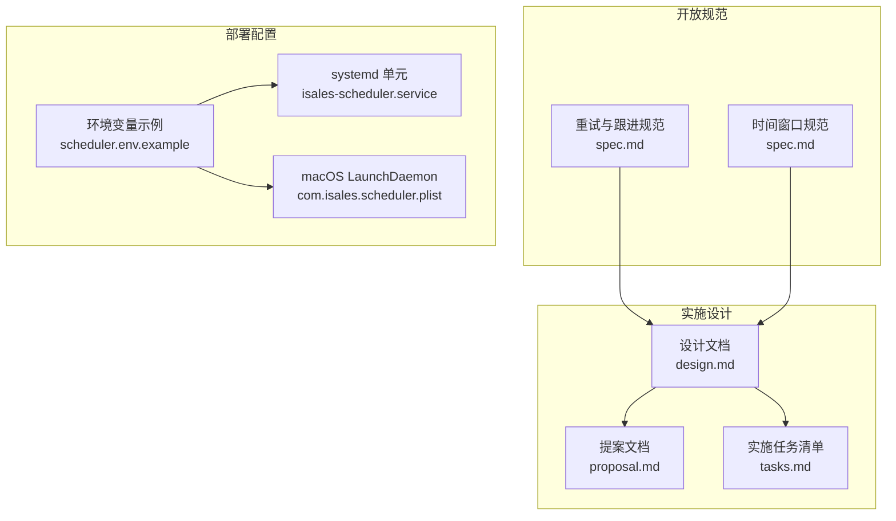
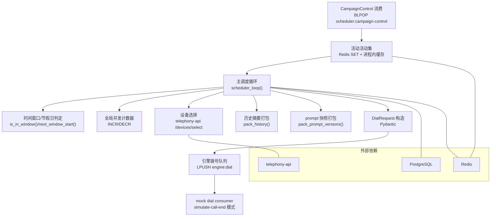
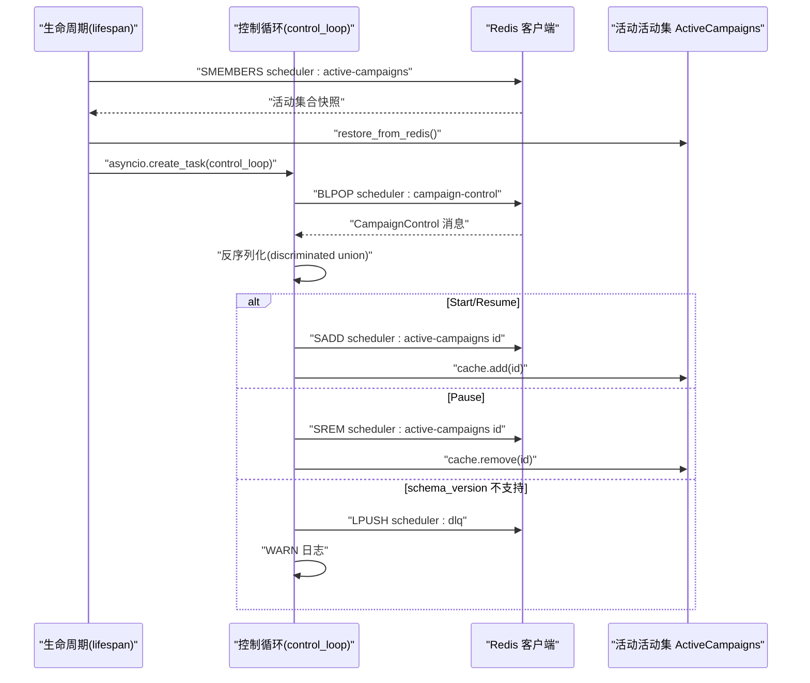
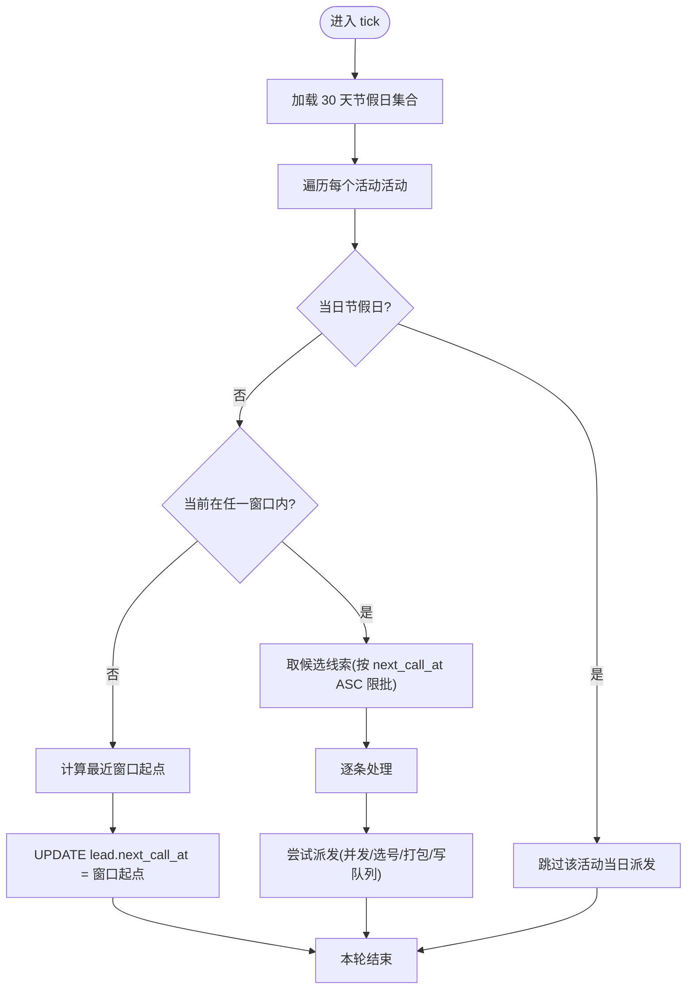
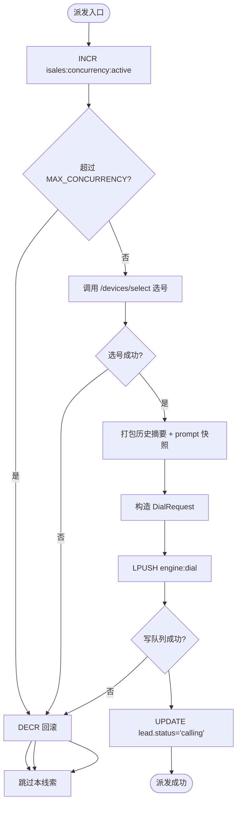
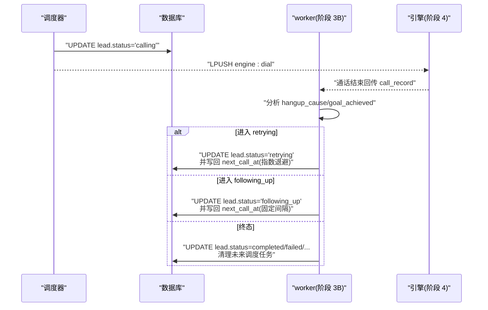
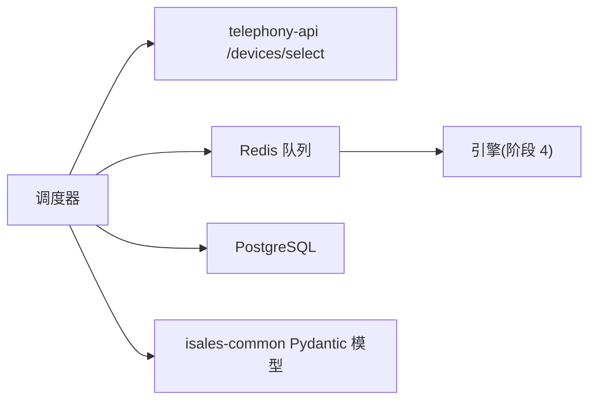

# 调度服务 isales-scheduler

<cite>
**本文引用的文件**
- [proposal.md](file://openspec/changes/archive/2026-05-06-impl-scheduler/proposal.md)
- [design.md](file://openspec/changes/archive/2026-05-06-impl-scheduler/design.md)
- [tasks.md](file://openspec/changes/archive/2026-05-06-impl-scheduler/tasks.md)
- [spec.md（重试与跟进）](file://openspec/specs/retry-followup/spec.md)
- [spec.md（时间窗口）](file://openspec/specs/time-window/spec.md)
- [scheduler.env.example](file://deploy/cloud/env/scheduler.env.example)
- [isales-scheduler.service](file://deploy/cloud/systemd/isales-scheduler.service)
- [com.isales.scheduler.plist](file://deploy/macos/plist/com.isales.scheduler.plist)
</cite>

## 目录
1. [简介](#简介)
2. [项目结构](#项目结构)
3. [核心组件](#核心组件)
4. [架构总览](#架构总览)
5. [详细组件分析](#详细组件分析)
6. [依赖关系分析](#依赖关系分析)
7. [性能考量](#性能考量)
8. [故障排查指南](#故障排查指南)
9. [结论](#结论)
10. [附录](#附录)

## 简介
isales-scheduler 是阶段 3A 的“线索分发”归宿，负责将线索（lead）按时间窗口、节假日、并发上限以及重试/跟进策略派发至引擎（engine）。它是一个可独立运行的 asyncio 服务，消费 campaign 控制消息、维护活动活动集合并按规则主循环派发，最终写入引擎拨号队列。在引擎尚未上线的阶段，通过 mock dial consumer 脚本模拟通话结束回写，保障调度器在阶段 3 即可独立验收。

## 项目结构
- 开放规范（openspec）：定义了调度器的职责边界、时间窗口、重试/跟进策略、消息契约等规范
- 部署配置（deploy）：包含环境变量示例、systemd 单元文件、macOS LaunchDaemon 配置
- 实施任务清单（tasks.md）：描述了各模块的实现要点与测试覆盖

**图表来源**
- [design.md:1-190](file://openspec/changes/archive/2026-05-06-impl-scheduler/design.md#L1-L190)
- [proposal.md:1-68](file://openspec/changes/archive/2026-05-06-impl-scheduler/proposal.md#L1-L68)
- [tasks.md:1-83](file://openspec/changes/archive/2026-05-06-impl-scheduler/tasks.md#L1-L83)
- [scheduler.env.example:1-25](file://deploy/cloud/env/scheduler.env.example#L1-L25)
- [isales-scheduler.service](file://deploy/cloud/systemd/isales-scheduler.service)
- [com.isales.scheduler.plist](file://deploy/macos/plist/com.isales.scheduler.plist)

**章节来源**
- [proposal.md:1-68](file://openspec/changes/archive/2026-05-06-impl-scheduler/proposal.md#L1-L68)
- [design.md:1-190](file://openspec/changes/archive/2026-05-06-impl-scheduler/design.md#L1-L190)
- [tasks.md:1-83](file://openspec/changes/archive/2026-05-06-impl-scheduler/tasks.md#L1-L83)
- [scheduler.env.example:1-25](file://deploy/cloud/env/scheduler.env.example#L1-L25)

## 核心组件
- 活动活动集维护：消费 campaign 控制消息，维护 Redis SET + 进程内缓存，启动时从 Redis 恢复
- 主调度循环：每 tick 扫描活动活动，按时间窗口/节假日过滤，按批次取候选线索，执行并发检查、设备选择、历史摘要与 prompt 快照打包、构造 DialRequest 并写入引擎拨号队列
- 时间窗口与节假日：判定当前是否在窗口内、计算下一个窗口起点、节假日跳过
- 全局并发控制：派发前原子性 INCR，失败即回滚，避免配额泄漏
- 重试/跟进策略：派发成功仅写入 calling 状态，重试/跟进的 next_call_at 由后续 worker 写回；仅在“窗外重排”场景写回 next_call_at

**章节来源**
- [design.md:45-78](file://openspec/changes/archive/2026-05-06-impl-scheduler/design.md#L45-L78)
- [design.md:79-102](file://openspec/changes/archive/2026-05-06-impl-scheduler/design.md#L79-L102)
- [design.md:104-138](file://openspec/changes/archive/2026-05-06-impl-scheduler/design.md#L104-L138)
- [proposal.md:12-34](file://openspec/changes/archive/2026-05-06-impl-scheduler/proposal.md#L12-L34)
- [spec.md（重试与跟进）:119-158](file://openspec/specs/retry-followup/spec.md#L119-L158)
- [spec.md（时间窗口）:51-78](file://openspec/specs/time-window/spec.md#L51-L78)

## 架构总览
调度器通过消费 campaign 控制消息维护活动活动集，主循环按时间窗口/节假日过滤线索，执行并发检查与设备选择，打包历史摘要与 prompt 快照，构造 DialRequest 并写入引擎拨号队列。mock dial consumer 用于阶段 3 的独立验收，模拟通话结束回写以推动调度循环持续运转。

**图表来源**
- [proposal.md:18-34](file://openspec/changes/archive/2026-05-06-impl-scheduler/proposal.md#L18-L34)
- [design.md:37-138](file://openspec/changes/archive/2026-05-06-impl-scheduler/design.md#L37-L138)
- [tasks.md:16-71](file://openspec/changes/archive/2026-05-06-impl-scheduler/tasks.md#L16-L71)

## 详细组件分析

### 组件A：活动活动集维护（CampaignControl 消费）
- 职责：后台协程 BLPOP campaign 控制队列，反序列化为 discriminated union，维护 Redis SET 与进程内缓存，异常消息写入 DLQ
- 并发安全：使用 asyncio.Lock 保护对活动集合的修改
- 启动恢复：lifespan 启动时从 Redis SMEMBERS 恢复缓存
- 类型映射：Start/Resume → 加入活动集合；Pause → 移出活动集合

**图表来源**
- [tasks.md:16-24](file://openspec/changes/archive/2026-05-06-impl-scheduler/tasks.md#L16-L24)
- [design.md:54-61](file://openspec/changes/archive/2026-05-06-impl-scheduler/design.md#L54-L61)
- [proposal.md:12-17](file://openspec/changes/archive/2026-05-06-impl-scheduler/proposal.md#L12-L17)

**章节来源**
- [tasks.md:16-24](file://openspec/changes/archive/2026-05-06-impl-scheduler/tasks.md#L16-L24)
- [design.md:54-61](file://openspec/changes/archive/2026-05-06-impl-scheduler/design.md#L54-L61)
- [proposal.md:12-17](file://openspec/changes/archive/2026-05-06-impl-scheduler/proposal.md#L12-L17)

### 组件B：时间窗口与节假日判定
- 职责：判定当前是否在任一窗口内、计算下一个窗口起点、节假日跳过
- 窗口配置：campaign.time_windows（JSONB 数组，支持多窗口）
- 节假日：campaign.respect_holidays 选择是否遵循全局 holiday 表
- 窗外处理：将 lead.next_call_at 推迟到最近窗口起点，不派发

**图表来源**
- [tasks.md:25-32](file://openspec/changes/archive/2026-05-06-impl-scheduler/tasks.md#L25-L32)
- [design.md:79-94](file://openspec/changes/archive/2026-05-06-impl-scheduler/design.md#L79-L94)
- [spec.md（时间窗口）:51-78](file://openspec/specs/time-window/spec.md#L51-L78)

**章节来源**
- [tasks.md:25-32](file://openspec/changes/archive/2026-05-06-impl-scheduler/tasks.md#L25-L32)
- [design.md:79-94](file://openspec/changes/archive/2026-05-06-impl-scheduler/design.md#L79-L94)
- [spec.md（时间窗口）:51-78](file://openspec/specs/time-window/spec.md#L51-L78)

### 组件C：全局并发控制
- 职责：派发前原子性 INCR，超过上限立即 DECR 回滚；任何一步失败（选号/DialRequest/LPUSH）均 DECR 回滚
- 计数器键：isales:concurrency:active
- 风险缓解：泄漏时通过日志告警，阶段 4 引入 call_session TTL 兜底

**图表来源**
- [tasks.md:33-46](file://openspec/changes/archive/2026-05-06-impl-scheduler/tasks.md#L33-L46)
- [design.md:95-102](file://openspec/changes/archive/2026-05-06-impl-scheduler/design.md#L95-L102)
- [design.md:104-112](file://openspec/changes/archive/2026-05-06-impl-scheduler/design.md#L104-L112)

**章节来源**
- [tasks.md:33-46](file://openspec/changes/archive/2026-05-06-impl-scheduler/tasks.md#L33-L46)
- [design.md:95-102](file://openspec/changes/archive/2026-05-06-impl-scheduler/design.md#L95-L102)
- [design.md:104-112](file://openspec/changes/archive/2026-05-06-impl-scheduler/design.md#L104-L112)

### 组件D：重试与跟进策略（派发边界与回写职责）
- 调度职责：仅将 new/retrying/following_up → calling；不写终态、不计算重试/跟进 next_call_at
- worker 职责：根据 hangup_cause/goal_achieved 写回状态与 next_call_at；达到上限进入终态
- 窗外重排：仅在“窗外重排”场景写回 next_call_at（推到最近窗口起点）

**图表来源**
- [spec.md（重试与跟进）:119-158](file://openspec/specs/retry-followup/spec.md#L119-L158)
- [design.md:130-138](file://openspec/changes/archive/2026-05-06-impl-scheduler/design.md#L130-L138)

**章节来源**
- [spec.md（重试与跟进）:119-158](file://openspec/specs/retry-followup/spec.md#L119-L158)
- [design.md:130-138](file://openspec/changes/archive/2026-05-06-impl-scheduler/design.md#L130-L138)

### 组件E：历史摘要与 prompt 快照
- 跟进通话才打包历史摘要（call_summary 最近 N 条），字段裁剪为必要字段
- prompt 快照在派发时刻冻结，避免运行中版本变更带来的歧义
- 限制历史条数以控制 DialRequest 体积，避免 token 超限

**章节来源**
- [tasks.md:47-52](file://openspec/changes/archive/2026-05-06-impl-scheduler/tasks.md#L47-L52)
- [design.md:113-129](file://openspec/changes/archive/2026-05-06-impl-scheduler/design.md#L113-L129)

### 组件F：主调度循环与派发流程
- 循环策略：单 asyncio task + tick 间隔配置项；每 tick snapshot 活动集合、加载节假日、按活动扫描
- 限批与失败保护：对每个活动独立检查，限批 N 条；任一步失败 break 该活动本轮，避免空转
- 派发步骤：时间窗口/节假日 → 窗外重排 → 并发检查 → 选号 → 历史摘要 → prompt 快照 → 构造 DialRequest → 写队列 → 更新状态

**章节来源**
- [tasks.md:53-62](file://openspec/changes/archive/2026-05-06-impl-scheduler/tasks.md#L53-L62)
- [design.md:37-78](file://openspec/changes/archive/2026-05-06-impl-scheduler/design.md#L37-L78)
- [proposal.md:18-30](file://openspec/changes/archive/2026-05-06-impl-scheduler/proposal.md#L18-L30)

## 依赖关系分析
- 服务间依赖：调度器依赖 telephony-api 的 /devices/select 接口进行设备选择；依赖 Redis 队列与 PostgreSQL 数据库
- 消息契约：使用 isales-common 的 Pydantic 模型进行序列化/反序列化，保证 schema 版本兼容性
- 部署一致性：数据库与 Redis 连接字符串需与 api/engine/worker 保持一致

**图表来源**
- [design.md:104-112](file://openspec/changes/archive/2026-05-06-impl-scheduler/design.md#L104-L112)
- [tasks.md:11-12](file://openspec/changes/archive/2026-05-06-impl-scheduler/tasks.md#L11-L12)
- [scheduler.env.example:6-7](file://deploy/cloud/env/scheduler.env.example#L6-L7)

**章节来源**
- [design.md:104-112](file://openspec/changes/archive/2026-05-06-impl-scheduler/design.md#L104-L112)
- [tasks.md:11-12](file://openspec/changes/archive/2026-05-06-impl-scheduler/tasks.md#L11-L12)
- [scheduler.env.example:6-7](file://deploy/cloud/env/scheduler.env.example#L6-L7)

## 性能考量
- tick 间隔：每分钟启动，满足外呼场景延迟需求；可通过配置项调整
- 限批与失败保护：对每个活动限批，避免单活动耗尽 tick；失败即 break 该活动本轮，防止空转
- 并发控制：原子 INCR/DECR，失败回滚，避免配额泄漏
- 选号超时：短超时（<1s），避免阻塞批次派发
- 历史摘要限制：限制历史条数，控制 DialRequest 体积，降低 token 风险

**章节来源**
- [design.md:37-44](file://openspec/changes/archive/2026-05-06-impl-scheduler/design.md#L37-L44)
- [design.md:71-78](file://openspec/changes/archive/2026-05-06-impl-scheduler/design.md#L71-L78)
- [design.md:104-112](file://openspec/changes/archive/2026-05-06-impl-scheduler/design.md#L104-L112)
- [design.md:113-129](file://openspec/changes/archive/2026-05-06-impl-scheduler/design.md#L113-L129)

## 故障排查指南
- 并发计数器泄漏：关注日志中的并发回滚告警；阶段 4 引入 call_session TTL 兜底
- 窗外 lead 未派发：检查时间窗口配置与节假日表；确认 next_call_at 是否被正确推迟
- 选号失败：检查 telephony-api 可用性与网络状况；确认超时与错误码
- DLQ 积压：定期巡检 scheduler:dlq 列表，定位 schema_version 不兼容消息
- mock dial consumer：使用 simulate-call-end 模式进行 1 小时压测，观察并发计数器与 DialRequest 合法性

**章节来源**
- [design.md:160-171](file://openspec/changes/archive/2026-05-06-impl-scheduler/design.md#L160-L171)
- [tasks.md:63-70](file://openspec/changes/archive/2026-05-06-impl-scheduler/tasks.md#L63-L70)
- [proposal.md:35-40](file://openspec/changes/archive/2026-05-06-impl-scheduler/proposal.md#L35-L40)

## 结论
isales-scheduler 将线索分发职责清晰地限定在“派发成功仅写 calling 状态、不计算重试/跟进 next_call_at”，并通过时间窗口、节假日、并发上限与设备选择等机制保障派发质量与稳定性。借助 mock dial consumer，调度器可在引擎上线前完成独立验收。随着 worker 与引擎的逐步上线，调度器与后续组件将形成稳定的端到端外呼流水线。

## 附录
- 部署与运行
  - 环境变量：数据库与 Redis 连接字符串、tick 间隔、批次大小、历史摘要条数、最大并发、时区
  - systemd 单元：isales-scheduler.service
  - macOS LaunchDaemon：com.isales.scheduler.plist
- 验收流程：通过 api 启动 campaign，配合 mock dial consumer 的 simulate-call-end 模式进行 1 小时压测，验证并发计数器稳定与 DialRequest 合法性

**章节来源**
- [scheduler.env.example:19-25](file://deploy/cloud/env/scheduler.env.example#L19-L25)
- [isales-scheduler.service](file://deploy/cloud/systemd/isales-scheduler.service)
- [com.isales.scheduler.plist](file://deploy/macos/plist/com.isales.scheduler.plist)
- [proposal.md:35-40](file://openspec/changes/archive/2026-05-06-impl-scheduler/proposal.md#L35-L40)