# 数据库设计原则

<cite>
**本文引用的文件**
- [DESIGN.md](file://DESIGN.md)
- [openspec/specs/architecture/spec.md](file://openspec/specs/architecture/spec.md)
- [openspec/specs/data-model/spec.md](file://openspec/specs/data-model/spec.md)
- [openspec/specs/service-communication/spec.md](file://openspec/specs/service-communication/spec.md)
- [openspec/changes/archive/2026-05-01-init-isales-common/tasks.md](file://openspec/changes/archive/2026-05-01-init-isales-common/tasks.md)
- [openspec/changes/archive/2026-05-24-impl-provider-credential-db-ssot/tasks.md](file://openspec/changes/archive/2026-05-24-impl-provider-credential-db-ssot/tasks.md)
- [deploy/linux/scripts/migrate.sh](file://deploy/linux/scripts/migrate.sh)
- [deploy/macos/scripts/migrate.sh](file://deploy/macos/scripts/migrate.sh)
- [reset_call.sql](file://reset_call.sql)
- [trigger_call.sh](file://trigger_call.sh)
- [deploy/linux/scripts/backup_pg.sh](file://deploy/linux/scripts/backup_pg.sh)
- [deploy/linux/scripts/backup_redis.sh](file://deploy/linux/scripts/backup_redis.sh)
- [deploy/cron/isales-backup.cron](file://deploy/cron/isales-backup.cron)
</cite>

## 更新摘要
**所做更改**
- 新增数据库管理工具链章节，详细介绍reset_call.sql等数据库操作脚本的使用规范
- 完善数据库运维工具链，包括迁移脚本、备份脚本和监控脚本的标准化管理
- 增强数据库故障排查指南，涵盖操作脚本的使用方法和最佳实践
- 更新数据库设计原则，确保与实际运维工具链保持一致

## 目录
1. [引言](#引言)
2. [项目结构](#项目结构)
3. [核心组件](#核心组件)
4. [架构总览](#架构总览)
5. [详细组件分析](#详细组件分析)
6. [数据库管理工具链](#数据库管理工具链)
7. [依赖分析](#依赖分析)
8. [性能考虑](#性能考虑)
9. [故障排查指南](#故障排查指南)
10. [结论](#结论)
11. [附录](#附录)

## 引言
本文件系统化阐述 iSales 系统的数据库设计原则，围绕"统一数据库设计""PostgreSQL 单实例架构""isales-common 共享库统一管理 SQLAlchemy 模型与 Alembic 迁移""表归属与跨服务读写权限""JSONB 字段使用规范""数据模型演进与向后兼容"以及"数据库管理工具链"等主题展开，旨在为开发与运维提供一致、可追溯、可演进且实用的数据库设计与治理准则。

## 项目结构
- 顶层设计文档将多文件 OpenSpec 规范作为权威来源，其中数据模型与架构是数据库设计原则的直接依据。
- 数据模型规范明确了表清单、归属服务与字段语义来源，是数据库表设计与演进的"目录视图"。
- 架构规范明确了"统一 PostgreSQL 实例""统一 Alembic 迁移来源""通过 isales-common 模型访问数据库"的强制要求。
- 服务通信规范进一步细化了"数据库直连""跨服务读 vs 写"的边界与约束。
- 迁移脚本展示了 isales-common 的 Alembic 迁移在部署时的执行方式与环境变量注入。
- **新增** 数据库管理工具链涵盖了操作脚本、备份脚本和监控脚本的标准化管理。

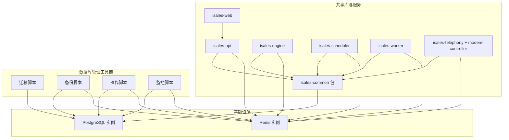

**图表来源**
- [openspec/specs/architecture/spec.md](file://openspec/specs/architecture/spec.md)
- [openspec/specs/service-communication/spec.md](file://openspec/specs/service-communication/spec.md)

**章节来源**
- [DESIGN.md](file://DESIGN.md)
- [openspec/specs/architecture/spec.md](file://openspec/specs/architecture/spec.md)
- [openspec/specs/service-communication/spec.md](file://openspec/specs/service-communication/spec.md)

## 核心组件
- 统一数据库设计核心理念
  - 所有服务共享一个 PostgreSQL 实例与一个 Redis 实例，数据库迁移由 isales-common/alembic 管理，禁止绕过 ORM 模型直接写 SQL（除性能必要场景外）。
  - 数据库直连：各服务通过 isales-common 的 SQLAlchemy 模型直接访问数据库，不引入"数据网关"层在服务间转发数据库读写。
- isales-common 共享库
  - 仅包含跨服务共享的稳定接口与模型，不包含特定服务的业务逻辑。
  - 所有 SQLAlchemy 模型与 Alembic 迁移由 isales-common 管理；其他服务通过依赖 isales-common 间接访问。
- 表归属与跨服务读写权限
  - 每张表标记其主要业务归属，归属决定 schema 演进与 PR 主导权；多个服务可读写，但归属仅一个。
  - 跨服务读写由"数据库直连""跨服务读 vs 写"两条约束决定：多个服务读同一表各自直读，写操作由表的归属服务承担。
- JSONB 字段使用规范
  - JSONB 用于半结构化的配置或事件流；任何新引入的 JSONB 字段必须附带 schema 描述并放置在对应 capability spec。
  - 强结构与外键关系的数据必须用独立表 + 外键，不得用 JSONB 简化。
- 数据模型演进与向后兼容
  - 迁移由 isales-common 统一生成与执行，部署时通过 Alembic 升级 head；每次变更均需通过 OpenSpec change proposal 流程，确保可追溯与可审计。
  - 采用"单一迁移来源 + 严格演进约束"，避免多源迁移导致的不一致与回滚困难。
- **新增** 数据库管理工具链
  - 标准化管理各类数据库操作脚本，包括迁移脚本、备份脚本、操作脚本和监控脚本。
  - 统一环境变量注入和错误处理机制，确保脚本执行的一致性和可靠性。

**章节来源**
- [openspec/specs/architecture/spec.md](file://openspec/specs/architecture/spec.md)
- [openspec/specs/data-model/spec.md](file://openspec/specs/data-model/spec.md)
- [openspec/specs/service-communication/spec.md](file://openspec/specs/service-communication/spec.md)

## 架构总览
下图展示数据库与服务间的交互关系，强调"统一 PostgreSQL 实例""统一 Alembic 迁移来源""通过 isales-common 模型直连数据库"以及"标准化数据库管理工具链"的设计约束。

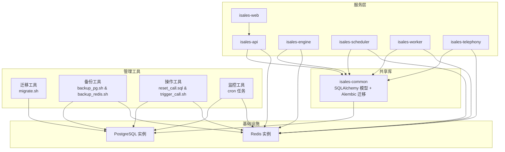

**图表来源**
- [openspec/specs/architecture/spec.md](file://openspec/specs/architecture/spec.md)
- [openspec/specs/service-communication/spec.md](file://openspec/specs/service-communication/spec.md)

## 详细组件分析

### 组件一：统一数据库设计与 PostgreSQL 单实例
- 设计决策
  - 单实例统一：所有服务共享一个 PostgreSQL 实例，避免分布式事务与跨库一致性问题。
  - 单一迁移来源：所有数据库迁移由 isales-common/alembic 管理，确保迁移的唯一性与可追溯性。
  - 直连约束：服务间不通过"数据网关"转发数据库读写，所有读写通过 isales-common 模型直连数据库。
- 优势
  - 简化运维：统一实例、统一迁移、统一模型，降低部署与维护复杂度。
  - 一致性保障：PG 事务支持跨服务事务，减少数据不一致风险。
  - 可观测性：统一入口便于审计、备份与监控。

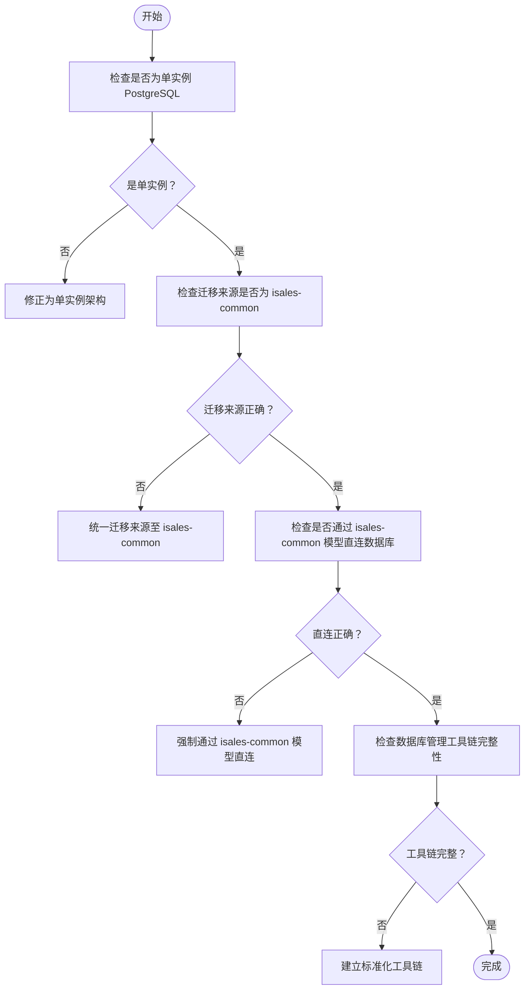

**图表来源**
- [openspec/specs/architecture/spec.md](file://openspec/specs/architecture/spec.md)
- [openspec/specs/service-communication/spec.md](file://openspec/specs/service-communication/spec.md)

**章节来源**
- [openspec/specs/architecture/spec.md](file://openspec/specs/architecture/spec.md)
- [openspec/specs/service-communication/spec.md](file://openspec/specs/service-communication/spec.md)

### 组件二：isales-common 共享库与迁移管理
- 统一管理
  - SQLAlchemy 模型与 Alembic 迁移由 isales-common 管理；其他服务通过依赖 isales-common 间接访问数据库。
  - 迁移生成与执行：通过 Alembic 升级 head，部署脚本在执行迁移时注入数据库连接字符串与用户。
- 实施要点
  - 迁移初始化：使用异步引擎，从 isales-common.models 导入 Base.metadata。
  - 环境变量：sqlalchemy.url 通过环境变量注入，避免硬编码。
  - 可逆性验证：在本地空数据库上执行升级与降级，确保迁移可逆。

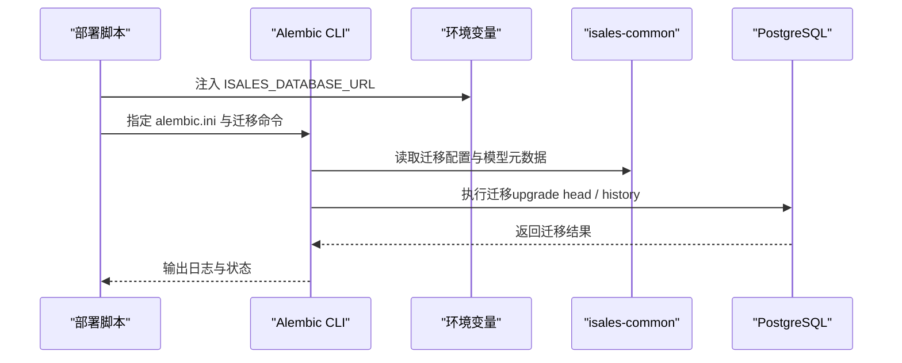

**图表来源**
- [openspec/changes/archive/2026-05-01-init-isales-common/tasks.md](file://openspec/changes/archive/2026-05-01-init-isales-common/tasks.md)
- [deploy/linux/scripts/migrate.sh](file://deploy/linux/scripts/migrate.sh)
- [deploy/macos/scripts/migrate.sh](file://deploy/macos/scripts/migrate.sh)

**章节来源**
- [openspec/changes/archive/2026-05-01-init-isales-common/tasks.md](file://openspec/changes/archive/2026-05-01-init-isales-common/tasks.md)
- [deploy/linux/scripts/migrate.sh](file://deploy/linux/scripts/migrate.sh)
- [deploy/macos/scripts/migrate.sh](file://deploy/macos/scripts/migrate.sh)

### 组件三：表归属与跨服务读写权限
- 表归属原则
  - 每张表标记其主要业务归属，归属决定 schema 演进与 PR 主导权；多个服务可读写，但归属仅一个。
  - 关联表生命周期跟随归属 A 而非归属 B 的情况，归属设为 A。
- 跨服务读写约束
  - 多个服务读同一表：各自直读即可。
  - 写操作：由表的归属服务承担，其他服务不得直接写入。
- 权限与一致性
  - 通过"数据库直连 + 归属约束"确保读写边界清晰，避免脏写与竞态。

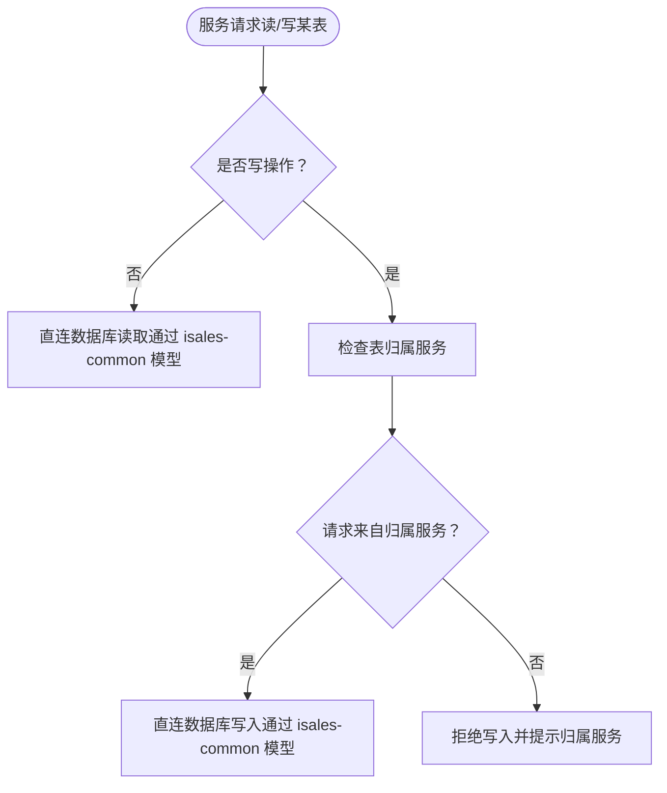

**图表来源**
- [openspec/specs/data-model/spec.md](file://openspec/specs/data-model/spec.md)
- [openspec/specs/service-communication/spec.md](file://openspec/specs/service-communication/spec.md)

**章节来源**
- [openspec/specs/data-model/spec.md](file://openspec/specs/data-model/spec.md)
- [openspec/specs/service-communication/spec.md](file://openspec/specs/service-communication/spec.md)

### 组件四：JSONB 字段使用规范
- 使用场景
  - JSONB 用于半结构化的配置或事件流，如时间窗口、提示词扩展参数、回调触发逻辑、转人工关键词等。
- 规范要求
  - 新引入的 JSONB 字段必须附带 JSON schema 描述，并在对应 capability spec 中明确键、值类型、必填可选。
  - 强结构与外键关系的数据必须用独立表 + 外键，不得用 JSONB 简化（如回调日志不应塞进配置表的 JSONB）。
- 演进与兼容
  - JSONB 字段的 schema 变更需遵循 OpenSpec change proposal，确保前后兼容与可审计。

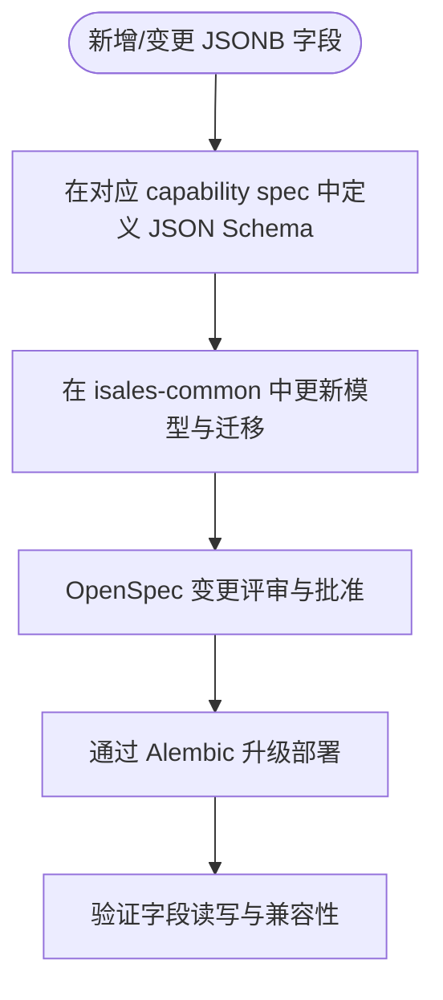

**图表来源**
- [openspec/specs/data-model/spec.md](file://openspec/specs/data-model/spec.md)

**章节来源**
- [openspec/specs/data-model/spec.md](file://openspec/specs/data-model/spec.md)

### 组件五：数据模型演进与向后兼容
- 演进流程
  - 所有模型与迁移变更必须在 isales-common 中完成，通过 Alembic 生成与执行。
  - 变更需经 OpenSpec change proposal 流程，确保可追溯与可审计。
- 兼容性保障
  - 采用"单一迁移来源 + 严格演进约束"，避免多源迁移导致的不一致与回滚困难。
  - 对强结构字段优先使用外键与独立表，避免 JSONB 简化带来的未来迁移成本。

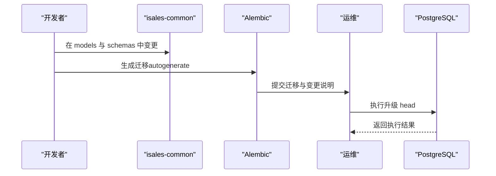

**图表来源**
- [openspec/changes/archive/2026-05-01-init-isales-common/tasks.md](file://openspec/changes/archive/2026-05-01-init-isales-common/tasks.md)
- [openspec/specs/data-model/spec.md](file://openspec/specs/data-model/spec.md)

**章节来源**
- [openspec/changes/archive/2026-05-01-init-isales-common/tasks.md](file://openspec/changes/archive/2026-05-01-init-isales-common/tasks.md)
- [openspec/specs/data-model/spec.md](file://openspec/specs/data-model/spec.md)

## 数据库管理工具链

### 迁移管理工具
- 功能概述
  - 标准化 Alembic 迁移执行流程，支持 dry-run 预检和正式执行两种模式。
  - 统一环境变量注入机制，确保迁移执行的一致性。
- Linux 迁移脚本
  - 位置：`deploy/linux/scripts/migrate.sh`
  - 特性：支持 --dry-run 参数进行迁移历史预检，自动读取环境变量配置。
- macOS 迁移脚本  
  - 位置：`deploy/macos/scripts/migrate.sh`
  - 特性：兼容旧版 bash 环境，支持相同的迁移执行模式。

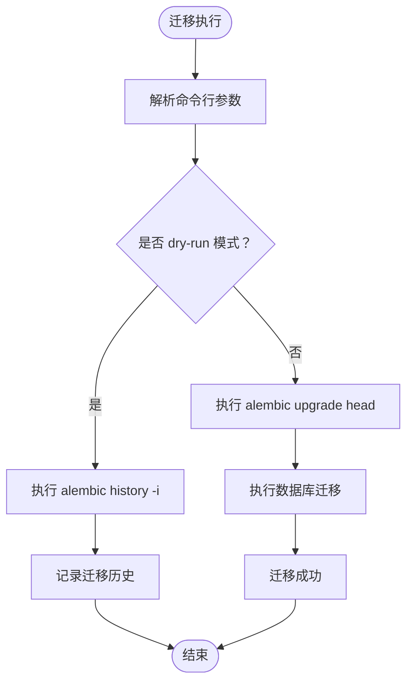

**图表来源**
- [deploy/linux/scripts/migrate.sh](file://deploy/linux/scripts/migrate.sh)
- [deploy/macos/scripts/migrate.sh](file://deploy/macos/scripts/migrate.sh)

### 备份管理工具
- PostgreSQL 备份脚本
  - 位置：`deploy/linux/scripts/backup_pg.sh`
  - 功能：每日自动备份，支持自定义保留天数，默认14天。
  - 输出：`/opt/isales/backups/pg/YYYY-MM-DD.sql.gz`
- Redis 备份脚本
  - 位置：`deploy/linux/scripts/backup_redis.sh`
  - 功能：通过 redis-cli --rdb 远程获取 RDB 快照，无需访问本地文件。
  - 输出：`/opt/isales/backups/redis/YYYY-MM-DD.rdb.gz`
- 备份调度
  - 位置：`deploy/cron/isales-backup.cron`
  - 配置：每天凌晨2:30执行 PostgreSQL 和 Redis 备份任务。

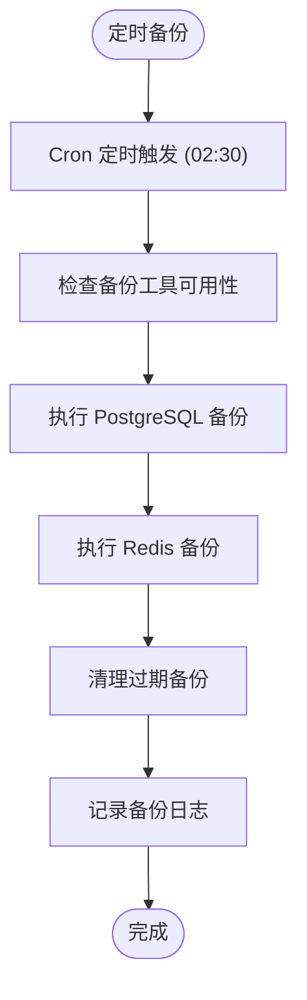

**图表来源**
- [deploy/linux/scripts/backup_pg.sh](file://deploy/linux/scripts/backup_pg.sh)
- [deploy/linux/scripts/backup_redis.sh](file://deploy/linux/scripts/backup_redis.sh)
- [deploy/cron/isales-backup.cron](file://deploy/cron/isales-backup.cron)

### 数据库操作脚本
- reset_call.sql
  - 功能：重置通话相关状态，将设备状态设置为空闲，将线索状态重置为新建并更新下次呼叫时间。
  - 使用场景：测试环境清理、故障恢复、数据重置等。
- trigger_call.sh
  - 功能：触发一次完整的通话流程，包括数据库状态更新和 API 调用。
  - 组成：数据库更新 + HTTP POST 请求到 /campaigns/1/start。

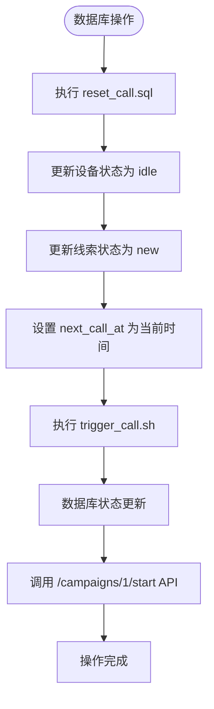

**图表来源**
- [reset_call.sql](file://reset_call.sql)
- [trigger_call.sh](file://trigger_call.sh)

### 监控与告警工具
- 日志监控
  - 备份脚本使用 syslog 记录备份状态，标签为 `isales-backup`。
  - 可通过 `journalctl -t isales-backup` 查看备份日志。
- 错误处理
  - 所有脚本都包含完善的错误检测和处理机制。
  - 失败时记录详细错误信息到标准错误输出。

**章节来源**
- [deploy/linux/scripts/migrate.sh](file://deploy/linux/scripts/migrate.sh)
- [deploy/macos/scripts/migrate.sh](file://deploy/macos/scripts/migrate.sh)
- [deploy/linux/scripts/backup_pg.sh](file://deploy/linux/scripts/backup_pg.sh)
- [deploy/linux/scripts/backup_redis.sh](file://deploy/linux/scripts/backup_redis.sh)
- [deploy/cron/isales-backup.cron](file://deploy/cron/isales-backup.cron)
- [reset_call.sql](file://reset_call.sql)
- [trigger_call.sh](file://trigger_call.sh)

## 依赖分析
- 组件耦合与内聚
  - isales-common 作为共享库，内聚了数据库模型与迁移；各服务通过依赖该库实现数据库访问，降低服务间耦合。
  - **新增** 数据库管理工具链标准化了各类操作脚本，形成统一的运维工具体系。
- 外部依赖与集成点
  - PostgreSQL 与 Redis 作为统一基础设施，所有服务直连；服务间通信通过 Redis 队列与 Pub/Sub，不引入额外数据网关。
  - **新增** 备份工具通过 cron 定时任务集成，实现自动化运维。
- 潜在循环依赖
  - 通过"单一迁移来源 + 直连约束"避免循环依赖；isales-common 不依赖具体服务，仅提供通用接口。
  - **新增** 操作脚本遵循最小权限原则，避免相互依赖。

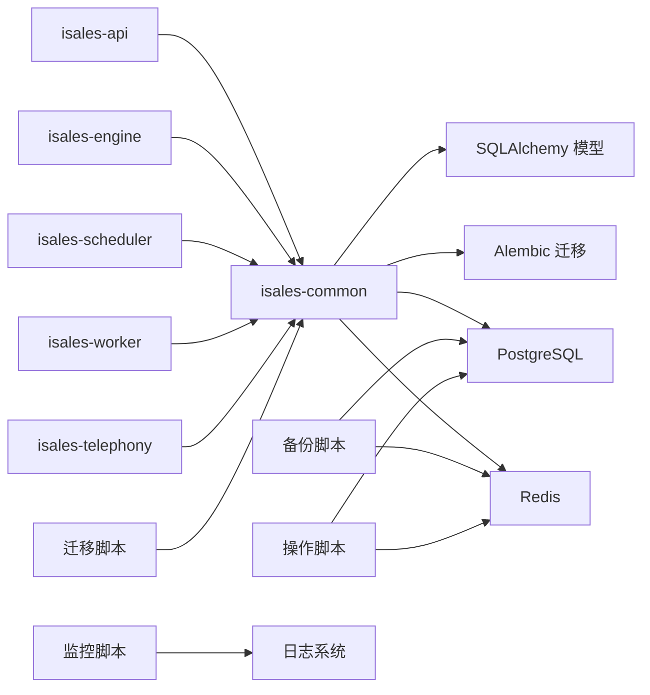

**图表来源**
- [openspec/specs/architecture/spec.md](file://openspec/specs/architecture/spec.md)
- [openspec/specs/service-communication/spec.md](file://openspec/specs/service-communication/spec.md)

**章节来源**
- [openspec/specs/architecture/spec.md](file://openspec/specs/architecture/spec.md)
- [openspec/specs/service-communication/spec.md](file://openspec/specs/service-communication/spec.md)

## 性能考虑
- 单实例优势
  - 统一实例简化运维与监控，降低跨实例一致性成本。
- 迁移与部署
  - 通过 Alembic 升级 head，结合 dry-run 检查，减少生产事故风险。
- 读写分离与并发
  - 通过数据库直连与归属约束，避免跨服务写放大；Redis 原子计数器用于全局并发控制，防止计数器泄漏。
- **新增** 工具链性能优化
  - 备份脚本支持异步执行，避免阻塞主业务流程。
  - 操作脚本采用批量更新，减少数据库往返次数。

## 故障排查指南
- 迁移失败
  - 检查环境变量 ISALES_DATABASE_URL 是否正确注入。
  - 使用 dry-run 查看迁移历史与差异，定位失败步骤。
  - 在本地空数据库上执行升级/降级，验证迁移可逆性。
- 权限与归属问题
  - 确认写操作来自表的归属服务；非归属服务写入会被拒绝。
  - 核对"数据库直连 + 跨服务读 vs 写"约束，避免越权访问。
- JSONB 字段异常
  - 核对 capability spec 中的 JSON Schema 描述，确保字段结构与类型一致。
  - 避免将强结构数据放入 JSONB，必要时改为独立表与外键。
- **新增** 数据库操作脚本故障排查
  - reset_call.sql 执行失败：检查数据库连接权限和表存在性。
  - trigger_call.sh 调用失败：验证 API 服务状态和认证令牌有效性。
  - 备份失败：检查磁盘空间、网络连接和目标服务器状态。
- **新增** 工具链监控
  - 查看备份日志：`journalctl -t isales-backup`
  - 检查 cron 任务状态：`crontab -l`
  - 验证脚本执行权限：`ls -la /opt/isales/current/deploy/scripts/`

**章节来源**
- [deploy/linux/scripts/migrate.sh](file://deploy/linux/scripts/migrate.sh)
- [deploy/macos/scripts/migrate.sh](file://deploy/macos/scripts/migrate.sh)
- [openspec/specs/data-model/spec.md](file://openspec/specs/data-model/spec.md)
- [openspec/specs/service-communication/spec.md](file://openspec/specs/service-communication/spec.md)
- [reset_call.sql](file://reset_call.sql)
- [trigger_call.sh](file://trigger_call.sh)
- [deploy/linux/scripts/backup_pg.sh](file://deploy/linux/scripts/backup_pg.sh)
- [deploy/linux/scripts/backup_redis.sh](file://deploy/linux/scripts/backup_redis.sh)

## 结论
iSales 系统的数据库设计以"统一数据库设计"为核心，依托 PostgreSQL 单实例与 isales-common 共享库，实现了"统一模型、统一迁移、统一直连"的工程化约束。通过明确的表归属与跨服务读写权限、严格的 JSONB 使用规范、以及 OpenSpec 变更流程，系统在保证可演进性的同时，兼顾了可维护性与可审计性。

**新增** 的数据库管理工具链进一步完善了系统的运维能力，包括标准化的迁移管理、自动化的备份策略、实用的操作脚本和完善的监控告警机制。这些工具链确保了数据库操作的规范化、自动化和可追溯性，为系统的稳定运行提供了强有力的支撑。

上述原则与工具链为后续数据库演进建立了稳固基础，既保证了技术架构的先进性，又确保了运维实践的可行性。

## 附录
- 相关文件与来源
  - 数据模型规范：明确了表清单、归属服务与字段语义来源。
  - 架构规范：明确了统一 PostgreSQL 实例、统一 Alembic 迁移来源与数据库直连约束。
  - 服务通信规范：明确了通道矩阵、队列与 Pub/Sub 边界、HTTP 调用规范与数据库直连。
  - 迁移脚本：展示了 Alembic 在部署时的执行方式与环境变量注入。
  - **新增** 操作脚本：reset_call.sql 和 trigger_call.sh 提供了实用的数据库操作工具。
  - **新增** 备份脚本：自动化备份策略确保数据安全与可恢复性。
  - **新增** 监控脚本：cron 任务和日志系统提供完整的运维监控能力。

**章节来源**
- [openspec/specs/data-model/spec.md](file://openspec/specs/data-model/spec.md)
- [openspec/specs/architecture/spec.md](file://openspec/specs/architecture/spec.md)
- [openspec/specs/service-communication/spec.md](file://openspec/specs/service-communication/spec.md)
- [openspec/changes/archive/2026-05-01-init-isales-common/tasks.md](file://openspec/changes/archive/2026-05-01-init-isales-common/tasks.md)
- [openspec/changes/archive/2026-05-24-impl-provider-credential-db-ssot/tasks.md](file://openspec/changes/archive/2026-05-24-impl-provider-credential-db-ssot/tasks.md)
- [deploy/linux/scripts/migrate.sh](file://deploy/linux/scripts/migrate.sh)
- [deploy/macos/scripts/migrate.sh](file://deploy/macos/scripts/migrate.sh)
- [reset_call.sql](file://reset_call.sql)
- [trigger_call.sh](file://trigger_call.sh)
- [deploy/linux/scripts/backup_pg.sh](file://deploy/linux/scripts/backup_pg.sh)
- [deploy/linux/scripts/backup_redis.sh](file://deploy/linux/scripts/backup_redis.sh)
- [deploy/cron/isales-backup.cron](file://deploy/cron/isales-backup.cron)