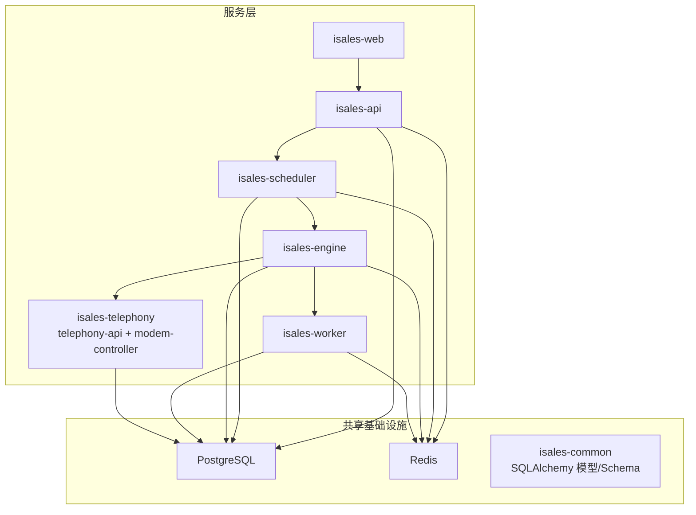
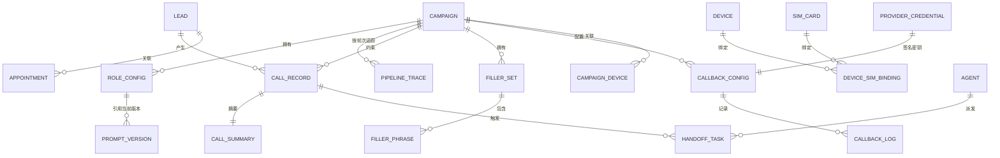
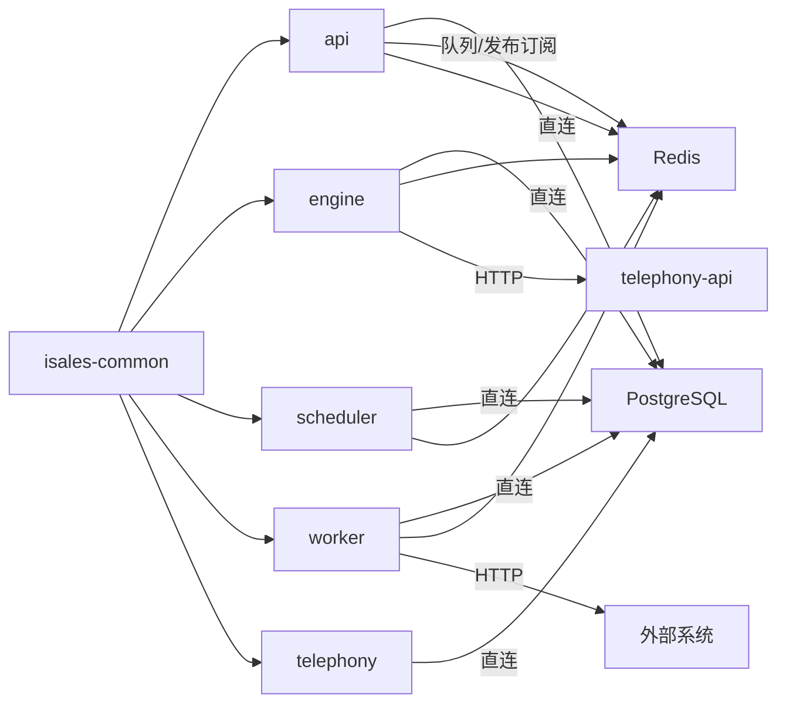

# 核心数据模型

<cite>
**本文引用的文件**
- [data-model/spec.md](file://openspec/specs/data-model/spec.md)
- [ai-pipeline/spec.md](file://openspec/specs/ai-pipeline/spec.md)
- [role-prompt/spec.md](file://openspec/specs/role-prompt/spec.md)
- [transcript/spec.md](file://openspec/specs/transcript/spec.md)
- [human-handoff/spec.md](file://openspec/specs/human-handoff/spec.md)
- [retry-followup/spec.md](file://openspec/specs/retry-followup/spec.md)
- [goal-achievement/spec.md](file://openspec/specs/goal-achievement/spec.md)
- [appointment/spec.md](file://openspec/specs/appointment/spec.md)
- [filler/spec.md](file://openspec/specs/filler/spec.md)
- [device-hardware/spec.md](file://openspec/specs/device-hardware/spec.md)
- [provider-credential/spec.md](file://openspec/specs/provider-credential/spec.md)
- [webhook-callback/spec.md](file://openspec/specs/webhook-callback/spec.md)
- [time-window/spec.md](file://openspec/specs/time-window/spec.md)
- [architecture/spec.md](file://openspec/specs/architecture/spec.md)
- [service-communication/spec.md](file://openspec/specs/service-communication/spec.md)
- [pipeline-stream-and-referee/specs/data-model/spec.md](file://openspec/changes/pipeline-stream-and-referee/specs/data-model/spec.md)
- [pipeline-stream-and-referee/specs/transcript/spec.md](file://openspec/changes/pipeline-stream-and-referee/specs/transcript/spec.md)
- [pipeline-stream-and-referee/specs/goal-achievement/spec.md](file://openspec/changes/pipeline-stream-and-referee/specs/goal-achievement/spec.md)
- [pipeline-stream-and-referee/specs/role-prompt/spec.md](file://openspec/changes/pipeline-stream-and-referee/specs/role-prompt/spec.md)
</cite>

## 更新摘要
**所做更改**
- 更新了 pipeline_trace 数据模型的重大重构，删除 judge_results、polish_* 相关字段
- 新增 main_reply_text、referee_decision、referee_goal_type、referee_confidence 等字段
- 新增 extract_status、extract_error 等提取器状态字段
- 更新 role_config.kind 枚举值从 {role/judge/polish} 改为 {main/referee/extractor}
- 更新 prompt_version.scope_type 枚举值从 {role/judge/polish} 改为 {main/referee/extractor}
- 更新 call_record 表结构，新增 extracted、extract_status 字段

## 目录
1. [简介](#简介)
2. [项目结构](#项目结构)
3. [核心组件](#核心组件)
4. [架构总览](#架构总览)
5. [详细组件分析](#详细组件分析)
6. [依赖分析](#依赖分析)
7. [性能考虑](#性能考虑)
8. [故障排查指南](#故障排查指南)
9. [结论](#结论)
10. [附录](#附录)

## 简介
本文件面向 iSales 系统，基于 openspec 的数据模型规范，系统化梳理 12 张核心表的结构、字段语义、业务归属与服务边界、表间关系与外键约束、典型使用场景与查询模式、JSONB 字段结构与示例、数据验证规则、索引策略与性能优化建议。目标是帮助开发者与运维人员快速理解并正确使用数据模型，支撑 API、引擎、调度器、工作者、电话控制等服务的协同。

**更新** 本版本反映了 pipeline_trace 数据模型的重大重构，从三层管线架构转变为双 LLM 架构，删除了 judge 和 polish 相关字段，新增了 referee 决策和提取器状态管理功能。

## 项目结构
- 数据模型由 isales-common 统一管理，其他服务通过依赖访问。
- 所有服务共享同一 PostgreSQL 实例与 Redis 实例，采用统一的数据库直连与队列/发布订阅通信模式。
- 服务边界与通信通道在架构与服务通信规范中有明确约定。

**图表来源**
- [architecture/spec.md:130-168](file://openspec/specs/architecture/spec.md#L130-L168)
- [service-communication/spec.md:7-30](file://openspec/specs/service-communication/spec.md#L7-L30)

**章节来源**
- [architecture/spec.md:5-168](file://openspec/specs/architecture/spec.md#L5-L168)
- [service-communication/spec.md:1-150](file://openspec/specs/service-communication/spec.md#L1-L150)

## 核心组件
本节概述 12 张核心表的业务归属与关键字段概览，详见"详细组件分析"逐表展开。

- campaign：外呼活动配置，包含默认话术池、并发、时间窗口、字段抽取、沉默/打断策略、转人工/转接配置、重试/跟进策略、节假日尊重等。
- holiday：全局节假日表，支持按地区筛选。
- agent：坐席信息与在线状态，用于转人工派发。
- handoff_task：转人工任务，记录触发类型与状态流转。
- role_config：角色/裁判/润色配置，引用 prompt_version。
- prompt_version：prompt 历史版本，记录内容与激活状态。
- pipeline_trace：AI 双层管线的候选、裁判、润色追踪。
- lead：潜在客户，状态机驱动重试/跟进/勿打/转人工等。
- call_record：通话记录，包含转人工状态、录音 URL、转写与提取。
- call_summary：通话摘要与目标达成标记。
- appointment：到店预约，关联 lead，状态机与 lead 状态联动。
- voice_model：音色元数据。
- filler_set/filler_phrase：垫词集合与短语，音频预生成。
- callback_config/callback_log：外部回调配置与日志。
- device/sim_card/device_sim_binding/campaign_device：设备与 SIM 管理。
- provider_credential：第三方凭据加密存储。

**章节来源**
- [data-model/spec.md:28-51](file://openspec/specs/data-model/spec.md#L28-L51)

## 架构总览
- 数据库统一为 PostgreSQL，所有服务通过 isales-common 模型直连。
- 服务间通信：Redis 队列用于可靠投递，Pub/Sub 用于实时事件广播；HTTP 仅用于必要的同步调用（如选号）。
- JSONB 字段用于半结构化配置与事件流，字段需附 schema 文档并在相应 capability spec 中定义。

**图表来源**
- [data-model/spec.md:28-51](file://openspec/specs/data-model/spec.md#L28-L51)
- [filler/spec.md:111-132](file://openspec/specs/filler/spec.md#L111-L132)
- [webhook-callback/spec.md:210-231](file://openspec/specs/webhook-callback/spec.md#L210-L231)
- [device-hardware/spec.md:517-525](file://openspec/specs/device-hardware/spec.md#L517-L525)
- [provider-credential/spec.md:82-92](file://openspec/specs/provider-credential/spec.md#L82-L92)

## 详细组件分析

### 表：campaign
- 归属服务：api
- 关键字段（节选）：name、voice_id、default_replies(JSONB)、concurrency、time_windows(JSONB)、extraction_fields(JSONB)、max_silence_activations、silence_threshold_ms、silence_phrases(JSONB)、silence_hangup_phrase、max_no_progress_seconds、wrap_up_max_rounds、wrap_up_max_seconds、wrap_up_closing_phrases(JSONB)、interruption_whitelist(JSONB)、interruption_min_duration_ms、max_continuous_interruptions、continuous_interruption_strategy、transfer_keyword_enabled、transfer_keywords(JSONB)、transfer_intent_enabled、transfer_intent_threshold、transfer_round_enabled、transfer_round_threshold、transfer_llm_enabled、transfer_llm_prompt_version_id、transfer_phrases(JSONB)、retry_intervals(JSONB)、retry_max_count、follow_up_interval_days、follow_up_max_count、do_not_call_keywords(JSONB)、do_not_call_llm_enabled、do_not_call_llm_prompt_version_id、respect_holidays
- 业务含义：外呼活动的全局配置，驱动沉默激活、打断检测、转人工、收尾、重试/跟进、节假日尊重等。
- 读写边界：api 服务读写；engine 在运行时读取部分字段（如转人工、沉默、打断、收尾）。
- 典型查询：按时间窗口与节假日过滤、并发控制、转人工/沉默/打断阈值读取。
- JSONB 字段：default_replies、time_windows、extraction_fields、silence_phrases、wrap_up_closing_phrases、interruption_whitelist、transfer_keywords、transfer_phrases、retry_intervals、do_not_call_keywords。

**章节来源**
- [data-model/spec.md:30](file://openspec/specs/data-model/spec.md#L30)
- [time-window/spec.md:79-86](file://openspec/specs/time-window/spec.md#L79-L86)
- [retry-followup/spec.md:160-176](file://openspec/specs/retry-followup/spec.md#L160-L176)
- [goal-achievement/spec.md:110-122](file://openspec/specs/goal-achievement/spec.md#L110-L122)
- [human-handoff/spec.md:111-128](file://openspec/specs/human-handoff/spec.md#L111-L128)
- [ai-pipeline/spec.md:159-166](file://openspec/specs/ai-pipeline/spec.md#L159-L166)

### 表：holiday
- 归属服务：api
- 关键字段：date、name、region
- 业务含义：全局节假日表，支持按地区筛选。
- 读写边界：api 服务读写；scheduler 在派发前按 campaign.respect_holidays 与 holiday 表判定窗外。
- 典型查询：按日期与地区查询节假日。

**章节来源**
- [data-model/spec.md:31](file://openspec/specs/data-model/spec.md#L31)
- [time-window/spec.md:37-50](file://openspec/specs/time-window/spec.md#L37-L50)

### 表：agent
- 归属服务：telephony
- 关键字段：name、login_user、status(online/offline)
- 业务含义：坐席基本信息与在线状态，用于转人工派发。
- 读写边界：telephony 服务读写；api 提供查询与状态变更；engine 在转人工触发后由 worker 创建 handoff_task。
- 典型查询：按在线状态查询可用坐席。

**章节来源**
- [data-model/spec.md:32](file://openspec/specs/data-model/spec.md#L32)
- [human-handoff/spec.md:126-128](file://openspec/specs/human-handoff/spec.md#L126-L128)

### 表：handoff_task
- 归属服务：api（创建由 worker，api 提供查询/状态变更）
- 关键字段：call_record_id、agent_id（nullable）、trigger_type、trigger_detail、status、created_at、picked_up_at、completed_at
- 业务含义：转人工任务，记录触发类型与状态流转。
- 读写边界：worker 创建；api 提供查询与状态变更（pending → in_progress → completed）。
- 典型查询：按状态与时间窗口查询待回拨任务。

**章节来源**
- [data-model/spec.md:33](file://openspec/specs/data-model/spec.md#L33)
- [human-handoff/spec.md:78-87](file://openspec/specs/human-handoff/spec.md#L78-L87)

### 表：role_config
- 归属服务：api
- 关键字段：campaign_id、kind(main/referee/extractor)、model、current_prompt_version_id、temperature、top_p、ext_params(JSONB)、enabled
- 业务含义：角色/裁判/润色的配置，引用 prompt_version。
- 读写边界：api 服务读写；engine 在运行时按配置调用 LLM。
- 典型查询：按 campaign_id 与 kind 查询配置。

**更新** kind 枚举值从 {role/judge/polish} 改为 {main/referee/extractor}

**章节来源**
- [data-model/spec.md:34](file://openspec/specs/data-model/spec.md#L34)
- [role-prompt/spec.md:150-185](file://openspec/specs/role-prompt/spec.md#L150-L185)
- [pipeline-stream-and-referee/specs/data-model/spec.md:38-42](file://openspec/changes/pipeline-stream-and-referee/specs/data-model/spec.md#L38-L42)

### 表：prompt_version
- 归属服务：api
- 关键字段：scope_type(main/referee/extractor)、scope_id、content、created_at、created_by、is_active
- 业务含义：prompt 历史版本，通话开始时快照写入 call_record.prompt_versions。
- 读写边界：api 服务读写；engine 在会话初始化时写入快照。
- 典型查询：按 scope_type/scope_id 查询当前生效版本。

**更新** scope_type 枚举值从 {role/judge/polish} 改为 {main/referee/extractor}

**章节来源**
- [data-model/spec.md:35](file://openspec/specs/data-model/spec.md#L35)
- [role-prompt/spec.md:150-185](file://openspec/specs/role-prompt/spec.md#L150-L185)
- [pipeline-stream-and-referee/specs/data-model/spec.md:111-114](file://openspec/changes/pipeline-stream-and-referee/specs/data-model/spec.md#L111-L114)

### 表：pipeline_trace
- 归属服务：engine
- 关键字段：call_record_id、turn_id、ts_start、ts_end、user_input、main_reply_text、main_duration_ms、main_tokens_in、main_tokens_out、main_fallback_used、referee_decision、referee_goal_type、referee_confidence、referee_duration_ms、first_audio_ms、error
- 业务含义：AI 双层管线的候选、裁判、润色追踪，用于调试与优化。
- 读写边界：engine 写入；api 不直接展示，仅在高级调试视图可见。
- 典型查询：按 call_record_id + turn_id 查询轮次 trace。

**更新** 重大重构：删除 judge_results、polish_* 相关字段，新增 main_reply_text、referee_decision、referee_goal_type、referee_confidence 等字段

**章节来源**
- [data-model/spec.md:36](file://openspec/specs/data-model/spec.md#L36)
- [transcript/spec.md:77-96](file://openspec/specs/transcript/spec.md#L77-L96)
- [ai-pipeline/spec.md:11-18](file://openspec/specs/ai-pipeline/spec.md#L11-L18)
- [pipeline-stream-and-referee/specs/data-model/spec.md:22](file://openspec/changes/pipeline-stream-and-referee/specs/data-model/spec.md#L22)
- [pipeline-stream-and-referee/specs/transcript/spec.md:7-22](file://openspec/changes/pipeline-stream-and-referee/specs/transcript/spec.md#L7-L22)

### 表：lead
- 归属服务：api
- 关键字段：name、phone、source、custom_data(JSONB)、status、retry_count、follow_up_count、next_call_at、last_hangup_cause
- 业务含义：潜在客户，驱动重试/跟进/勿打/转人工等状态机。
- 读写边界：api 服务读写；scheduler 按状态与时间窗口派发；worker 写回状态与 next_call_at。
- 典型查询：按状态与 next_call_at 过滤候选；按重试/跟进计数统计。

**章节来源**
- [data-model/spec.md:37](file://openspec/specs/data-model/spec.md#L37)
- [retry-followup/spec.md:90-112](file://openspec/specs/retry-followup/spec.md#L90-L112)

### 表：call_record
- 归属服务：engine
- 关键字段：lead_id、campaign_id、caller_id、status、started_at、ended_at、duration、transcript(JSONB)、recording_url、transfer_status、transfer_reason、wrap_up_started_at、prompt_versions(JSONB)、extracted(JSONB)、extract_status、extract_error
- 业务含义：通话记录，包含转人工状态、录音 URL、转写与提取。
- 读写边界：engine 写入；api 提供查询；worker 生成摘要并写 call_summary。
- 典型查询：按 lead_id/campaign_id 查询通话；按转人工状态过滤。

**更新** 新增 extract_status、extract_error 字段，用于跟踪提取器状态

**章节来源**
- [data-model/spec.md:38](file://openspec/specs/data-model/spec.md#L38)
- [transcript/spec.md:7-23](file://openspec/specs/transcript/spec.md#L7-L23)
- [pipeline-stream-and-referee/specs/data-model/spec.md:24](file://openspec/changes/pipeline-stream-and-referee/specs/data-model/spec.md#L24)

### 表：call_summary
- 归属服务：worker
- 关键字段：call_record_id、summary_text、goal_achieved、goal_type
- 业务含义：通话摘要与目标达成标记，供回调与后续流程使用。
- 读写边界：worker 写入；api 提供查询。
- 典型查询：按 call_record_id 查询摘要。

**更新** extracted_fields 字段弃用，迁移到 call_record.extracted

**章节来源**
- [data-model/spec.md:39](file://openspec/specs/data-model/spec.md#L39)
- [goal-achievement/spec.md:16-20](file://openspec/specs/goal-achievement/spec.md#L16-L20)
- [pipeline-stream-and-referee/specs/goal-achievement/spec.md:74-76](file://openspec/changes/pipeline-stream-and-referee/specs/goal-achievement/spec.md#L74-L76)

### 表：appointment
- 归属服务：api
- 关键字段：lead_id、created_from_call_id（nullable）、appointment_time、status（pending/confirmed/completed/cancelled）、store_address、directions、notes
- 业务含义：到店预约，关联 lead，状态机与 lead 状态联动。
- 读写边界：api 服务 CRUD；创建/完成时推进 lead 状态。
- 典型查询：按 status、appointment_time 范围与 lead_id 查询。

**章节来源**
- [data-model/spec.md:40](file://openspec/specs/data-model/spec.md#L40)
- [appointment/spec.md:6-119](file://openspec/specs/appointment/spec.md#L6-L119)

### 表：voice_model
- 归属服务：api
- 关键字段：name、provider、voice_id、sample_url
- 业务含义：音色元数据，用于垫词与 TTS。
- 读写边界：api 服务读写。
- 典型查询：按 voice_id 查询音色。

**章节来源**
- [data-model/spec.md:41](file://openspec/specs/data-model/spec.md#L41)

### 表：filler_set
- 归属服务：api
- 关键字段：campaign_id、name、sort_order
- 业务含义：垫词集合，按 sort_order 轮询。
- 读写边界：api 服务读写。
- 典型查询：按 campaign_id 查询集合。

**章节来源**
- [data-model/spec.md:42](file://openspec/specs/data-model/spec.md#L42)
- [filler/spec.md:111-132](file://openspec/specs/filler/spec.md#L111-L132)

### 表：filler_phrase
- 归属服务：api
- 关键字段：filler_set_id、phrase、audio_url、generation_status
- 业务含义：垫词短语，音频预生成。
- 读写边界：api 服务读写；worker 后台任务生成音频。
- 典型查询：按 filler_set_id 查询短语。

**章节来源**
- [data-model/spec.md:43](file://openspec/specs/data-model/spec.md#L43)
- [filler/spec.md:111-132](file://openspec/specs/filler/spec.md#L111-L132)

### 表：callback_config
- 归属服务：api
- 关键字段：campaign_id、name、trigger(JSONB, JsonLogic)、url、method、headers(JSONB)、payload_template(text, Jinja2)、retry_policy(JSONB)、signing_secret(Text, Fernet)、timeout_seconds、enabled
- 业务含义：外部回调配置，支持 JsonLogic 触发、Jinja2 模板、HMAC-SHA256 签名、指数退避重试。
- 读写边界：api 服务读写；worker 异步派发。
- 典型查询：按 campaign_id 查询启用的配置。

**章节来源**
- [data-model/spec.md:44](file://openspec/specs/data-model/spec.md#L44)
- [webhook-callback/spec.md:210-231](file://openspec/specs/webhook-callback/spec.md#L210-L231)
- [provider-credential/spec.md:140-169](file://openspec/specs/provider-credential/spec.md#L140-L169)

### 表：callback_log
- 归属服务：worker
- 关键字段：callback_config_id、call_record_id、status、request_body、response_code、response_body、retry_count、attempt_at、next_retry_at、error_message
- 业务含义：回调日志，记录重试与错误。
- 读写边界：worker 写入；api 提供查询。
- 典型查询：按 status/pending_retry 查询重试队列。

**章节来源**
- [data-model/spec.md:45](file://openspec/specs/data-model/spec.md#L45)
- [webhook-callback/spec.md:210-231](file://openspec/specs/webhook-callback/spec.md#L210-L231)

### 表：device
- 归属服务：telephony
- 关键字段：name、usb_port、modem_model、imei、status、last_seen_at、last_call_at
- 业务含义：USB GSM Modem 设备，状态机驱动。
- 读写边界：telephony 服务读写；modem-controller 回写状态。
- 典型查询：按状态与 last_call_at 选择空闲设备。

**章节来源**
- [data-model/spec.md:46](file://openspec/specs/data-model/spec.md#L46)
- [device-hardware/spec.md:517-525](file://openspec/specs/device-hardware/spec.md#L517-L525)

### 表：sim_card
- 归属服务：telephony
- 关键字段：iccid、imsi、phone_number、carrier、plan、balance、signal_strength、status、last_checked_at
- 业务含义：SIM 卡资料化管理。
- 读写边界：telephony 服务读写。
- 典型查询：按 iccid/imsi 查询。

**章节来源**
- [data-model/spec.md:47](file://openspec/specs/data-model/spec.md#L47)
- [device-hardware/spec.md:517-525](file://openspec/specs/device-hardware/spec.md#L517-L525)

### 表：device_sim_binding
- 归属服务：telephony
- 关键字段：device_id、sim_card_id、is_active、bind_at、unbind_at
- 业务含义：设备与 SIM 绑定历史，唯一活跃约束。
- 读写边界：telephony 服务读写。
- 典型查询：按 device_id 查询活跃绑定。

**章节来源**
- [data-model/spec.md:48](file://openspec/specs/data-model/spec.md#L48)
- [device-hardware/spec.md:517-525](file://openspec/specs/device-hardware/spec.md#L517-L525)

### 表：campaign_device
- 归属服务：api
- 关键字段：campaign_id、device_id
- 业务含义：活动与设备关联，选号时过滤。
- 读写边界：api 服务读写。
- 典型查询：按 campaign_id 查询关联设备。

**章节来源**
- [data-model/spec.md:49](file://openspec/specs/data-model/spec.md#L49)
- [device-hardware/spec.md:517-525](file://openspec/specs/device-hardware/spec.md#L517-L525)

### 表：provider_credential
- 归属服务：api
- 关键字段：provider_id、field_name、cipher_text(Fernet)、updated_by、updated_at；UNIQUE(provider_id, field_name)
- 业务含义：第三方凭据加密存储，统一事实来源。
- 读写边界：api 服务读写；engine 启动时从 DB 装载。
- 典型查询：按 provider_id 查询字段。

**章节来源**
- [data-model/spec.md:50](file://openspec/specs/data-model/spec.md#L50)
- [provider-credential/spec.md:82-92](file://openspec/specs/provider-credential/spec.md#L82-L92)

## 依赖分析
- 服务间依赖：engine 依赖 telephony-api 获取设备；worker 依赖回调配置；api 统一管理模型与凭据；scheduler 依赖时间窗口与节假日。
- 数据库依赖：所有服务通过 isales-common 模型直连；engine 与 worker 依赖 Redis 队列/发布订阅。
- JSONB 依赖：AI 管线、提示词版本、垫词、回调配置等广泛使用 JSONB，需配套 schema 文档。

**图表来源**
- [service-communication/spec.md:7-30](file://openspec/specs/service-communication/spec.md#L7-L30)
- [architecture/spec.md:59-72](file://openspec/specs/architecture/spec.md#L59-L72)

**章节来源**
- [service-communication/spec.md:78-105](file://openspec/specs/service-communication/spec.md#L78-L105)
- [architecture/spec.md:59-72](file://openspec/specs/architecture/spec.md#L59-L72)

## 性能考虑
- JSONB 查询：对频繁查询的 JSONB 字段（如 campaign.time_windows、lead.custom_data）建议在业务层做索引策略或物化字段，避免深度路径扫描。
- 并发控制：全局并发通过 Redis 原子计数器控制，engine 通话结束必须及时 DECR，避免泄漏。
- 索引建议：
  - lead(next_call_at, status)
  - call_record(campaign_id, started_at)
  - pipeline_trace(call_record_id, turn_id)
  - callback_log(status, next_retry_at)
  - device(last_call_at)
  - provider_credential(provider_id)
- 缓存：热点配置（如 campaign 配置）可在服务进程内缓存，结合变更通知失效。
- I/O：录音与垫词音频走对象存储，数据库仅存 URL；避免大字段膨胀。

## 故障排查指南
- 转人工未派发：检查 campaign.transfer_* 配置与 engine 触发逻辑；确认 worker 已创建 handoff_task。
- 回调失败：检查 callback_config.retry_policy 与 callback_log 状态；核对 signing_secret 加密与签名头。
- 设备不可用：检查 device 状态机与 last_seen_at；确认 modem-controller 心跳与 watchdog。
- 通话摘要缺失：确认 worker 已执行 summarize_call 并写入 call_summary。
- 重试/跟进异常：核对 campaign.retry_intervals/follow_up_interval_days 与 lead.next_call_at 计算。
- 提取器状态异常：检查 call_record.extract_status 字段，确认是否为 pending/done/failed 状态。

**章节来源**
- [human-handoff/spec.md:59-63](file://openspec/specs/human-handoff/spec.md#L59-L63)
- [webhook-callback/spec.md:100-133](file://openspec/specs/webhook-callback/spec.md#L100-L133)
- [device-hardware/spec.md:208-236](file://openspec/specs/device-hardware/spec.md#L208-L236)
- [retry-followup/spec.md:155-159](file://openspec/specs/retry-followup/spec.md#L155-L159)
- [pipeline-stream-and-referee/specs/goal-achievement/spec.md:62-65](file://openspec/changes/pipeline-stream-and-referee/specs/goal-achievement/spec.md#L62-L65)

## 结论
本文基于 openspec 的数据模型规范，系统化梳理了 iSales 的 12 张核心表，明确了归属服务、字段语义、表间关系、JSONB 结构与使用方式、典型查询与权限边界，并提供了性能与故障排查建议。本次更新反映了 pipeline_trace 数据模型的重大重构，从三层管线架构转变为双 LLM 架构，删除了 judge 和 polish 相关字段，新增了 referee 决策和提取器状态管理功能，建议在实现与运维中严格遵循"模型与迁移由 isales-common 统一管理"的原则，确保跨服务一致性与演进可控。

## 附录

### JSONB 字段结构与示例（示例为概念性说明）
- campaign.default_replies(JSONB)：数组，元素为话术字符串。
- campaign.time_windows(JSONB)：数组，元素为 {days:[], start:"HH:mm", end:"HH:mm"}。
- call_record.transcript(JSONB)：数组，元素为事件对象（如 greeting、user_speech、ai_reply 等）。
- pipeline_trace.main_reply_text/referee_decision(JSONB)：结构化 JSON，包含 main LLM 输出文本、referee 决策结果。
- lead.custom_data(JSONB)：键值对，业务自定义字段。
- callback_config.trigger(JSONB)：JsonLogic 表达式。
- callback_config.retry_policy(JSONB)：{intervals_seconds:[], max_attempts:int}。
- provider_credential.cipher_text：Fernet 加密的密文（存储时）。
- call_record.extracted(JSONB)：提取器抽取的结构化字段。

**章节来源**
- [ai-pipeline/spec.md:80-90](file://openspec/specs/ai-pipeline/spec.md#L80-L90)
- [transcript/spec.md:24-57](file://openspec/specs/transcript/spec.md#L24-L57)
- [retry-followup/spec.md:164-170](file://openspec/specs/retry-followup/spec.md#L164-L170)
- [webhook-callback/spec.md:214-219](file://openspec/specs/webhook-callback/spec.md#L214-L219)
- [provider-credential/spec.md:84-91](file://openspec/specs/provider-credential/spec.md#L84-L91)
- [pipeline-stream-and-referee/specs/data-model/spec.md:24](file://openspec/changes/pipeline-stream-and-referee/specs/data-model/spec.md#L24)
- [pipeline-stream-and-referee/specs/role-prompt/spec.md:169-190](file://openspec/changes/pipeline-stream-and-referee/specs/role-prompt/spec.md#L169-L190)