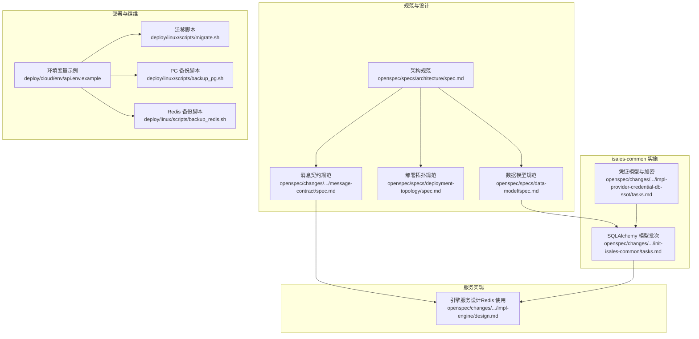
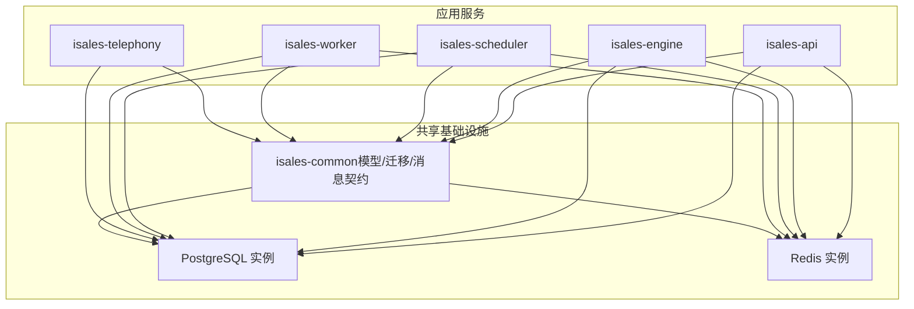
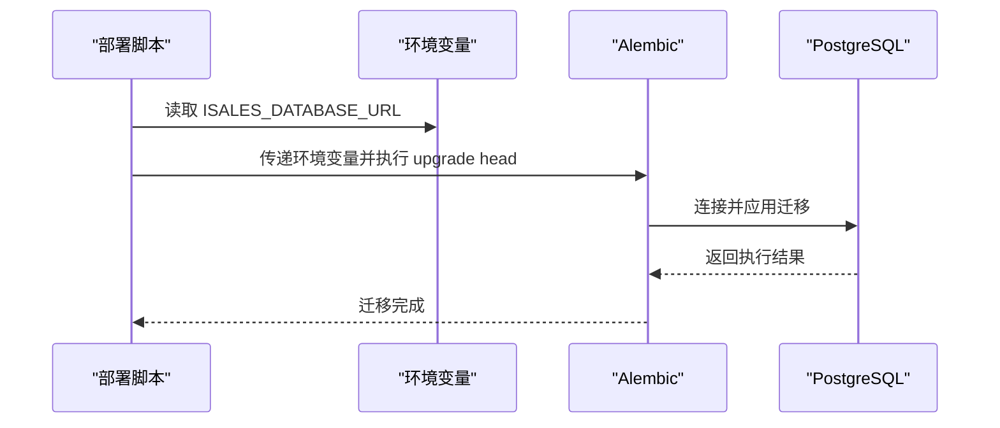
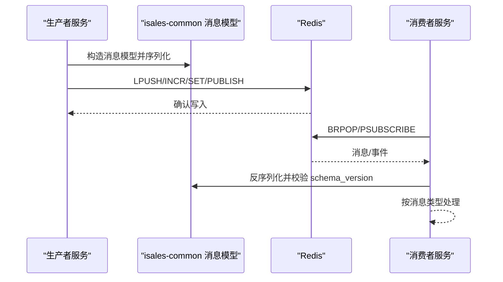
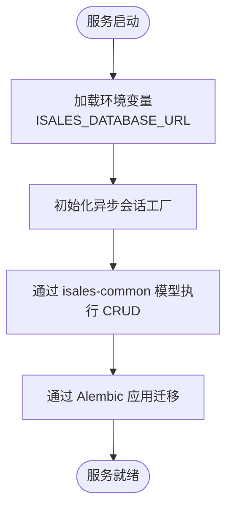
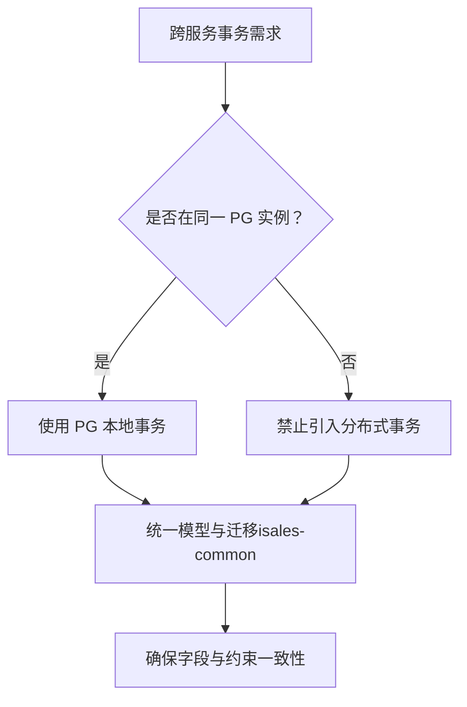
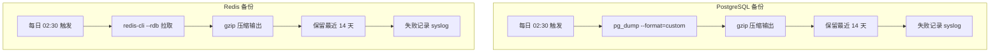
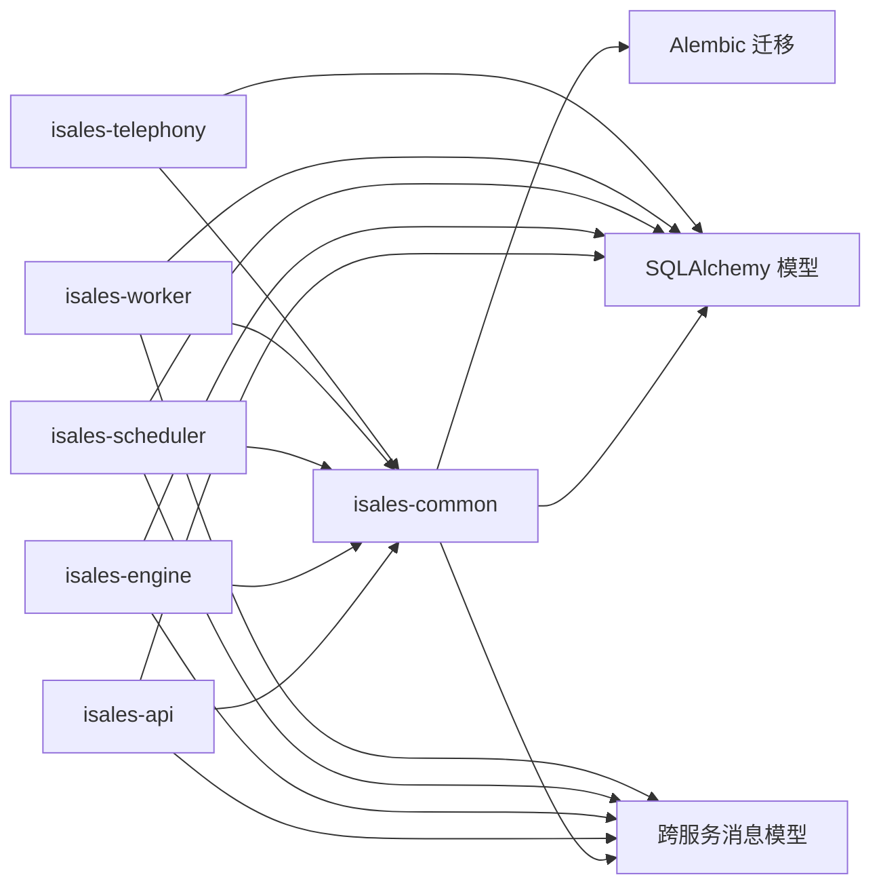

# 数据存储设计

<cite>
**本文引用的文件**
- [DESIGN.md](file://DESIGN.md)
- [openspec/specs/data-model/spec.md](file://openspec/specs/data-model/spec.md)
- [openspec/specs/architecture/spec.md](file://openspec/specs/architecture/spec.md)
- [openspec/specs/deployment-topology/spec.md](file://openspec/specs/deployment-topology/spec.md)
- [openspec/changes/archive/2026-05-01-init-isales-common/tasks.md](file://openspec/changes/archive/2026-05-01-init-isales-common/tasks.md)
- [openspec/changes/archive/2026-05-01-init-isales-common/specs/message-contract/spec.md](file://openspec/changes/archive/2026-05-01-init-isales-common/specs/message-contract/spec.md)
- [openspec/changes/archive/2026-05-07-impl-engine/design.md](file://openspec/changes/archive/2026-05-07-impl-engine/design.md)
- [openspec/changes/archive/2026-05-24-impl-provider-credential-db-ssot/tasks.md](file://openspec/changes/archive/2026-05-24-impl-provider-credential-db-ssot/tasks.md)
- [deploy/cloud/env/api.env.example](file://deploy/cloud/env/api.env.example)
- [deploy/linux/scripts/migrate.sh](file://deploy/linux/scripts/migrate.sh)
- [deploy/linux/scripts/backup_pg.sh](file://deploy/linux/scripts/backup_pg.sh)
- [deploy/linux/scripts/backup_redis.sh](file://deploy/linux/scripts/backup_redis.sh)
</cite>

## 目录
1. [简介](#简介)
2. [项目结构](#项目结构)
3. [核心组件](#核心组件)
4. [架构总览](#架构总览)
5. [详细组件分析](#详细组件分析)
6. [依赖分析](#依赖分析)
7. [性能考量](#性能考量)
8. [故障排查指南](#故障排查指南)
9. [结论](#结论)
10. [附录](#附录)

## 简介
本文件面向 iSales 系统的数据存储设计，聚焦统一数据存储架构的决策与落地，包括：
- 共享 PostgreSQL 实例与 Redis 实例的使用策略
- isales-common 中 SQLAlchemy 模型与 Alembic 迁移的集中管理机制
- 数据访问模式与 ORM 使用规范
- Redis 的多种用途：队列、Pub/Sub、全局并发计数器、缓存
- 数据一致性保证与事务处理策略
- 数据库设计原则与性能优化考虑
- 数据迁移指南与备份恢复策略

## 项目结构
围绕数据存储的相关文件分布如下：
- 架构与数据模型规范：openspec/specs/architecture/spec.md、openspec/specs/data-model/spec.md、openspec/specs/deployment-topology/spec.md
- isales-common 实施任务与消息契约：openspec/changes/archive/2026-05-01-init-isales-common/tasks.md、openspec/changes/archive/2026-05-01-init-isales-common/specs/message-contract/spec.md
- 引擎服务设计与 Redis 使用：openspec/changes/archive/2026-05-07-impl-engine/design.md
- 凭证模型与加密：openspec/changes/archive/2026-05-24-impl-provider-credential-db-ssot/tasks.md
- 环境变量与部署脚本：deploy/cloud/env/api.env.example、deploy/linux/scripts/migrate.sh、deploy/linux/scripts/backup_pg.sh、deploy/linux/scripts/backup_redis.sh

**图表来源**
- [openspec/specs/architecture/spec.md:1-168](file://openspec/specs/architecture/spec.md#L1-L168)
- [openspec/specs/data-model/spec.md:1-83](file://openspec/specs/data-model/spec.md#L1-L83)
- [openspec/specs/deployment-topology/spec.md:1-414](file://openspec/specs/deployment-topology/spec.md#L1-L414)
- [openspec/changes/archive/2026-05-01-init-isales-common/tasks.md:20-86](file://openspec/changes/archive/2026-05-01-init-isales-common/tasks.md#L20-L86)
- [openspec/changes/archive/2026-05-01-init-isales-common/specs/message-contract/spec.md:1-34](file://openspec/changes/archive/2026-05-01-init-isales-common/specs/message-contract/spec.md#L1-L34)
- [openspec/changes/archive/2026-05-07-impl-engine/design.md:168-178](file://openspec/changes/archive/2026-05-07-impl-engine/design.md#L168-L178)
- [openspec/changes/archive/2026-05-24-impl-provider-credential-db-ssot/tasks.md:1-12](file://openspec/changes/archive/2026-05-24-impl-provider-credential-db-ssot/tasks.md#L1-L12)
- [deploy/cloud/env/api.env.example:1-24](file://deploy/cloud/env/api.env.example#L1-L24)
- [deploy/linux/scripts/migrate.sh:39-60](file://deploy/linux/scripts/migrate.sh#L39-L60)
- [deploy/linux/scripts/backup_pg.sh:1-50](file://deploy/linux/scripts/backup_pg.sh#L1-L50)
- [deploy/linux/scripts/backup_redis.sh:1-61](file://deploy/linux/scripts/backup_redis.sh#L1-L61)

**章节来源**
- [openspec/specs/architecture/spec.md:59-71](file://openspec/specs/architecture/spec.md#L59-L71)
- [openspec/specs/data-model/spec.md:52-74](file://openspec/specs/data-model/spec.md#L52-L74)
- [openspec/specs/deployment-topology/spec.md:76-89](file://openspec/specs/deployment-topology/spec.md#L76-L89)

## 核心组件
- 统一 PostgreSQL 实例：所有服务共享同一实例与同一 schema，禁止引入其他关系型数据库；跨服务事务采用 PG 事务，不引入分布式事务。
- 统一 Redis 实例：所有服务共享同一实例，用于队列、Pub/Sub、全局并发计数器与缓存。
- isales-common 集中管理：SQLAlchemy 模型与 Alembic 迁移由 isales-common 统一维护，其他服务通过依赖间接访问。
- 数据模型与字段约束：JSONB 字段用于半结构化配置或事件流，需附带 schema 描述；强结构与外键关系使用独立表与外键，不使用 JSONB 简化。

**章节来源**
- [openspec/specs/architecture/spec.md:59-71](file://openspec/specs/architecture/spec.md#L59-L71)
- [openspec/specs/data-model/spec.md:52-74](file://openspec/specs/data-model/spec.md#L52-L74)
- [openspec/specs/data-model/spec.md:75-83](file://openspec/specs/data-model/spec.md#L75-L83)

## 架构总览
统一数据存储架构强调“单一事实源”和“集中治理”。PostgreSQL 作为权威数据源，承载所有业务表；Redis 作为服务间通信与缓存的基础设施。isales-common 作为共享库，提供统一的模型与迁移，确保跨服务一致性。

**图表来源**
- [openspec/specs/architecture/spec.md:59-71](file://openspec/specs/architecture/spec.md#L59-L71)
- [openspec/specs/data-model/spec.md:7-17](file://openspec/specs/data-model/spec.md#L7-L17)

## 详细组件分析

### 统一 PostgreSQL 实例与 Alembic 迁移
- 集中式模型与迁移：isales-common 统一维护 SQLAlchemy 模型与 Alembic 迁移，其他服务通过依赖间接访问，避免各自维护迁移导致的分裂。
- 迁移执行：部署脚本通过环境变量注入数据库连接，调用 Alembic 升级至最新版本，并支持 dry-run 检查。
- 数据库连接：环境变量 ISALES_DATABASE_URL 由 isales-common 提供，服务侧通过该变量建立连接。

**图表来源**
- [deploy/linux/scripts/migrate.sh:39-60](file://deploy/linux/scripts/migrate.sh#L39-L60)
- [openspec/specs/data-model/spec.md:7-17](file://openspec/specs/data-model/spec.md#L7-L17)

**章节来源**
- [openspec/specs/data-model/spec.md:7-17](file://openspec/specs/data-model/spec.md#L7-L17)
- [deploy/linux/scripts/migrate.sh:39-60](file://deploy/linux/scripts/migrate.sh#L39-L60)

### Redis 的多种用途与使用规范
- 用途定义：队列（调度器→引擎、引擎→工作者、API→调度器）、Pub/Sub（API↔引擎 实时控制与事件推送）、全局并发计数器（INCR/DECR）、缓存。
- 消息契约：跨服务消息体集中定义在 isales-common，Producer 使用 Pydantic 序列化，Consumer 使用 Pydantic 反序列化；消息包含 schema_version、message_id、created_at 等基础字段。
- 发布与订阅：引擎服务采用 fire-and-forget 的发布策略，避免阻塞通话主路径；订阅采用单任务模式，按 call_id 分发控制指令。

**图表来源**
- [openspec/changes/archive/2026-05-01-init-isales-common/specs/message-contract/spec.md:1-34](file://openspec/changes/archive/2026-05-01-init-isales-common/specs/message-contract/spec.md#L1-L34)
- [openspec/changes/archive/2026-05-07-impl-engine/design.md:168-178](file://openspec/changes/archive/2026-05-07-impl-engine/design.md#L168-L178)
- [openspec/specs/architecture/spec.md:68-71](file://openspec/specs/architecture/spec.md#L68-L71)

**章节来源**
- [openspec/specs/architecture/spec.md:68-71](file://openspec/specs/architecture/spec.md#L68-L71)
- [openspec/changes/archive/2026-05-01-init-isales-common/specs/message-contract/spec.md:1-34](file://openspec/changes/archive/2026-05-01-init-isales-common/specs/message-contract/spec.md#L1-L34)
- [openspec/changes/archive/2026-05-07-impl-engine/design.md:168-178](file://openspec/changes/archive/2026-05-07-impl-engine/design.md#L168-L178)

### 数据访问模式与 ORM 使用规范
- ORM 使用：所有服务必须通过 isales-common 的 SQLAlchemy 模型进行数据访问，禁止绕过 ORM 直接写 SQL（性能必要场景除外）。
- 异步访问：isales-common 提供异步引擎与会话工厂，服务侧通过依赖注入获取会话并执行 CRUD。
- 模型与迁移：模型与迁移由 isales-common 维护，服务侧仅依赖，避免各自维护迁移导致的分裂。

**图表来源**
- [openspec/specs/data-model/spec.md:7-17](file://openspec/specs/data-model/spec.md#L7-L17)
- [deploy/linux/scripts/migrate.sh:39-60](file://deploy/linux/scripts/migrate.sh#L39-L60)

**章节来源**
- [openspec/specs/data-model/spec.md:7-17](file://openspec/specs/data-model/spec.md#L7-L17)

### 数据一致性保证与事务处理策略
- 单库事务：所有表位于同一 PostgreSQL 实例与同一 schema，跨服务事务使用 PG 事务，不引入分布式事务。
- JSONB 字段约束：半结构化配置使用 JSONB，需在相应能力规范中提供 JSON schema；强结构与外键关系使用独立表与外键，不使用 JSONB 简化。
- 一致性治理：isales-common 统一模型与迁移，确保跨服务读写一致性与演进一致性。

**图表来源**
- [openspec/specs/architecture/spec.md:59-61](file://openspec/specs/architecture/spec.md#L59-L61)
- [openspec/specs/data-model/spec.md:70-74](file://openspec/specs/data-model/spec.md#L70-L74)

**章节来源**
- [openspec/specs/architecture/spec.md:59-61](file://openspec/specs/architecture/spec.md#L59-L61)
- [openspec/specs/data-model/spec.md:70-74](file://openspec/specs/data-model/spec.md#L70-L74)

### 数据库设计原则与性能优化
- 设计原则
  - 单一事实源：所有持久化数据位于同一 PostgreSQL 实例与同一 schema。
  - 结构化优先：强结构与外键关系使用独立表与外键，JSONB 仅用于半结构化配置。
  - 集中治理：isales-common 统一模型与迁移，避免分裂。
- 性能优化
  - 异步访问：使用异步 SQLAlchemy 与 asyncpg，降低 I/O 阻塞。
  - Redis 缓存：热点数据与临时状态使用 Redis 缓存，减轻 PG 压力。
  - 队列与 Pub/Sub：通过 Redis 队列与 Pub/Sub 解耦服务，提升吞吐与弹性。

**章节来源**
- [openspec/specs/data-model/spec.md:52-74](file://openspec/specs/data-model/spec.md#L52-L74)
- [openspec/specs/architecture/spec.md:68-71](file://openspec/specs/architecture/spec.md#L68-L71)

### 数据迁移指南与备份恢复策略
- 迁移指南
  - 通过 isales-common 的 Alembic 执行迁移，服务侧仅依赖该迁移源。
  - 部署脚本支持 dry-run 检查与实际升级，确保迁移安全。
- 备份与恢复
  - PostgreSQL：每日定时备份至 /opt/isales/backups/pg，保留最近 14 天；备份脚本在失败时记录 syslog。
  - Redis：每日定时通过 redis-cli --rdb 拉取一致快照至 /opt/isales/backups/redis，保留最近 14 天。
  - 恢复演练：提供从 pg_dump 文件恢复到全新 PG 实例的步骤，确保恢复后 alembic current 可执行且数据计数一致。

**图表来源**
- [openspec/specs/deployment-topology/spec.md:80-89](file://openspec/specs/deployment-topology/spec.md#L80-L89)
- [deploy/linux/scripts/backup_pg.sh:1-50](file://deploy/linux/scripts/backup_pg.sh#L1-L50)
- [deploy/linux/scripts/backup_redis.sh:1-61](file://deploy/linux/scripts/backup_redis.sh#L1-L61)

**章节来源**
- [openspec/specs/deployment-topology/spec.md:76-89](file://openspec/specs/deployment-topology/spec.md#L76-L89)
- [deploy/linux/scripts/backup_pg.sh:1-50](file://deploy/linux/scripts/backup_pg.sh#L1-L50)
- [deploy/linux/scripts/backup_redis.sh:1-61](file://deploy/linux/scripts/backup_redis.sh#L1-L61)

## 依赖分析
- 服务依赖 isales-common：所有服务通过依赖 isales-common 获取 SQLAlchemy 模型与 Alembic 迁移。
- 环境变量契约：ISALES_DATABASE_URL、ISALES_REDIS_URL、ISALES_JWT_SECRET 等在多个服务的 env 文件中保持一致。
- 消息契约：跨服务消息体集中定义在 isales-common，Producer/Consumer 引用同一模型类，避免结构分歧。

**图表来源**
- [openspec/specs/architecture/spec.md:59-71](file://openspec/specs/architecture/spec.md#L59-L71)
- [openspec/changes/archive/2026-05-01-init-isales-common/specs/message-contract/spec.md:1-34](file://openspec/changes/archive/2026-05-01-init-isales-common/specs/message-contract/spec.md#L1-L34)

**章节来源**
- [openspec/specs/architecture/spec.md:59-71](file://openspec/specs/architecture/spec.md#L59-L71)
- [openspec/changes/archive/2026-05-01-init-isales-common/specs/message-contract/spec.md:1-34](file://openspec/changes/archive/2026-05-01-init-isales-common/specs/message-contract/spec.md#L1-L34)

## 性能考量
- 异步 I/O：使用 SQLAlchemy AsyncIO 与 asyncpg，减少阻塞，提升高并发下的吞吐。
- Redis 缓存与队列：热点数据与临时状态放入 Redis，降低 PG 查询压力；队列与 Pub/Sub 解耦服务，提高弹性与扩展性。
- 事务与一致性：单库事务避免分布式事务带来的复杂性与性能损耗。
- 监控与告警：Prometheus 指标与 Grafana 仪表盘帮助识别性能瓶颈与异常。

## 故障排查指南
- 迁移失败
  - 检查 ISALES_DATABASE_URL 是否正确，确认 Alembic 可执行且 alembic.ini 存在。
  - 使用 dry-run 检查迁移历史，定位具体失败迁移。
- 备份失败
  - 检查备份脚本依赖（pg_dump、redis-cli）是否安装，确认输出目录权限。
  - 查看 syslog 中的错误日志，定位失败原因。
- Redis 连接问题
  - 校验 ISALES_REDIS_URL 格式与可达性，确认订阅/发布通道名称一致。
  - 检查 Redis AOF/RDB 配置与持久化策略。

**章节来源**
- [deploy/linux/scripts/migrate.sh:39-60](file://deploy/linux/scripts/migrate.sh#L39-L60)
- [deploy/linux/scripts/backup_pg.sh:17-41](file://deploy/linux/scripts/backup_pg.sh#L17-L41)
- [deploy/linux/scripts/backup_redis.sh:21-47](file://deploy/linux/scripts/backup_redis.sh#L21-L47)

## 结论
iSales 系统通过统一 PostgreSQL 实例与 Redis 实例，结合 isales-common 的集中式模型与迁移管理，实现了跨服务的一致性与可维护性。Redis 在队列、Pub/Sub、并发控制与缓存方面的多用途设计，配合严格的 ORM 使用规范与事务策略，保障了系统的稳定性与性能。完善的迁移与备份恢复策略进一步提升了运维可靠性。

## 附录
- 环境变量示例：参考 deploy/cloud/env/api.env.example，确保 ISALES_DATABASE_URL、ISALES_REDIS_URL、ISALES_JWT_SECRET 等在各服务中一致。
- 消息契约：跨服务消息体集中定义在 isales-common，Producer 使用 Pydantic 序列化，Consumer 使用 Pydantic 反序列化并校验 schema_version。

**章节来源**
- [deploy/cloud/env/api.env.example:1-24](file://deploy/cloud/env/api.env.example#L1-L24)
- [openspec/changes/archive/2026-05-01-init-isales-common/specs/message-contract/spec.md:1-34](file://openspec/changes/archive/2026-05-01-init-isales-common/specs/message-contract/spec.md#L1-L34)