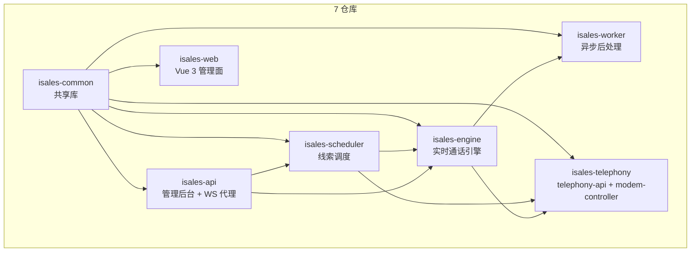
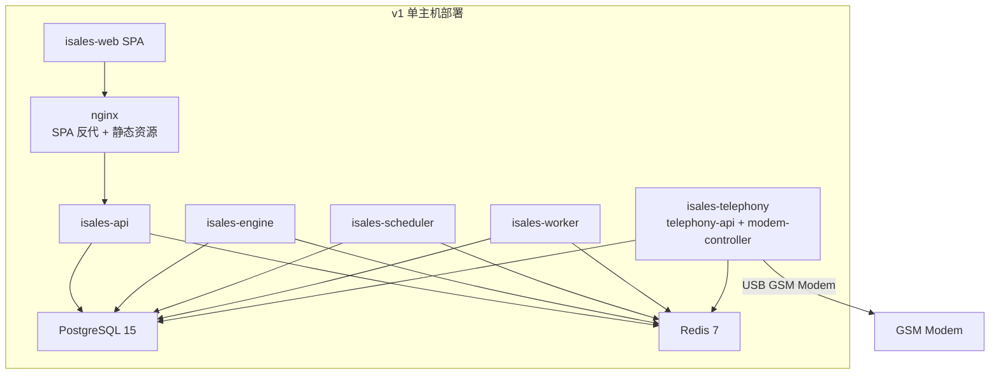
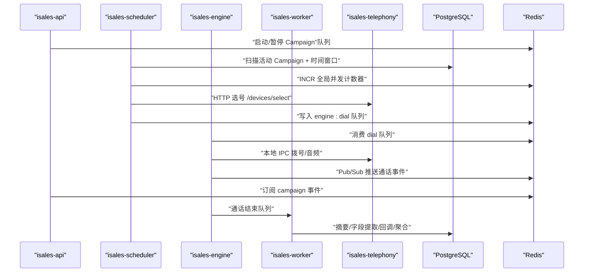
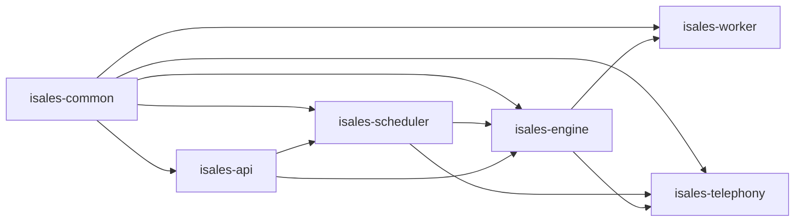

# 整体架构概览

<cite>
**本文引用的文件**
- [README.md](file://README.md)
- [DESIGN.md](file://DESIGN.md)
- [IMPLEMENTATION_PLAN.md](file://IMPLEMENTATION_PLAN.md)
- [openspec/specs/architecture/spec.md](file://openspec/specs/architecture/spec.md)
- [openspec/specs/deployment-topology/spec.md](file://openspec/specs/deployment-topology/spec.md)
- [openspec/specs/service-communication/spec.md](file://openspec/specs/service-communication/spec.md)
- [openspec/specs/data-model/spec.md](file://openspec/specs/data-model/spec.md)
- [deploy/README.md](file://deploy/README.md)
- [deploy/env/api.env.example](file://deploy/env/api.env.example)
- [deploy/env/engine.env.example](file://deploy/env/engine.env.example)
- [deploy/env/scheduler.env.example](file://deploy/env/scheduler.env.example)
- [deploy/env/worker.env.example](file://deploy/env/worker.env.example)
- [deploy/env/telephony-api.env.example](file://deploy/env/telephony-api.env.example)
</cite>

## 目录
1. [简介](#简介)
2. [项目结构](#项目结构)
3. [核心组件](#核心组件)
4. [架构总览](#架构总览)
5. [详细组件分析](#详细组件分析)
6. [依赖关系分析](#依赖关系分析)
7. [性能考量](#性能考量)
8. [故障排查指南](#故障排查指南)
9. [结论](#结论)
10. [附录](#附录)

## 简介
本文件面向 iSales 系统的整体架构，聚焦“7 仓库微服务架构”与“单主机部署模型”的设计与约束，并解释 isales-common 共享库的作用与依赖关系。文档还总结了架构选型的关键权衡，特别是选择多仓库而非 monorepo 的原因；并提供系统上下文图，展示 7 个服务之间的关系与数据流向。

## 项目结构
- 顶层仓库作为“多仓协调与规范中心”，7 个子仓库各自独立开发与发布：
  - isales-common：Pydantic/SQLAlchemy 模型 + 跨仓共享 schema + Provider ABC + Alembic 迁移
  - isales-api：管理后台 + WebSocket 代理
  - isales-engine：实时通话引擎（状态机 + 三层 AI 管线）
  - isales-scheduler：线索调度（时间窗口 + 并发 + 历史摘要打包）
  - isales-worker：异步后处理（摘要/字段提取/回调/聚合）
  - isales-telephony：含 telephony-api（HTTP）与 modem-controller（守护进程）
  - isales-web：Vue 3 管理面
- isales-common 通过 pip 包形式被其余 6 个服务依赖，不单独运行进程。

**图表来源**
- [openspec/specs/architecture/spec.md:130-167](file://openspec/specs/architecture/spec.md#L130-L167)

**章节来源**
- [README.md:1-86](file://README.md#L1-L86)
- [openspec/specs/architecture/spec.md:1-168](file://openspec/specs/architecture/spec.md#L1-L168)

## 核心组件
- isales-common
  - 职责：统一数据模型、Pydantic Schema、Provider ABC（ASR/TTS/LLM）、Alembic 迁移、工具函数
  - 规模：小
  - 依赖：被 6 个服务依赖，无独立进程
- isales-api
  - 职责：管理后台 CRUD（Campaign/Lead/Role/Voice/Analytics/Callback）、WebSocket 代理
  - 规模：中
- isales-engine
  - 职责：实时通话引擎（状态机/三层管线/打断/沉默/垫词/ASR/TTS/LLM Provider 实现/调 modem-controller）
  - 规模：大
- isales-scheduler
  - 职责：线索分发/时间窗口/重试与跟进/拨号前打包历史摘要
  - 规模：小
- isales-worker
  - 职责：通话结束后的摘要/字段提取/Webhook 回调/数据聚合
  - 规模：中
- isales-telephony
  - 职责：telephony-api（HTTP）+ modem-controller（守护，AT 命令/PCM 音频/udev）
  - 规模：中
- isales-web
  - 职责：Vue 3 管理面（任务/线索/角色/音色/设备/数据看板/通话监控）
  - 规模：中

**章节来源**
- [openspec/specs/architecture/spec.md:26-38](file://openspec/specs/architecture/spec.md#L26-L38)
- [DESIGN.md:9-75](file://DESIGN.md#L9-L75)

## 架构总览
- 7 仓库微服务架构
  - 7 个独立 Git 仓库，isales-common 作为共享库通过 pip 包分发
  - 不引入 monorepo；isales-common 仅包含跨服务稳定接口与模型
- 单主机部署模型（v1）
  - 7 个服务进程同主机部署（engine + telephony + scheduler + worker + USB GSM modem）
  - PostgreSQL 与 Redis 作为同主机系统服务
  - 不引入容器化（Docker/K8s）
- 数据存储统一
  - 所有服务共享同一 PostgreSQL 实例与 Redis 实例
  - 所有数据库迁移由 isales-common/alembic 管理
- isales-common 共享库
  - 仅包含跨服务共享的稳定接口与模型，不包含特定服务的业务逻辑
  - 不放在 isales-common 的内容：只服务于一个特定服务的功能

**图表来源**
- [openspec/specs/deployment-topology/spec.md:1-414](file://openspec/specs/deployment-topology/spec.md#L1-L414)
- [openspec/specs/architecture/spec.md:45-72](file://openspec/specs/architecture/spec.md#L45-L72)

**章节来源**
- [openspec/specs/architecture/spec.md:1-168](file://openspec/specs/architecture/spec.md#L1-L168)
- [openspec/specs/deployment-topology/spec.md:1-414](file://openspec/specs/deployment-topology/spec.md#L1-L414)

## 详细组件分析

### 服务职责边界与规模分配
- isales-common：小规模，提供稳定接口与模型，不参与业务流程
- isales-api：中规模，管理后台与 WS 代理
- isales-engine：大规模，实时通话引擎核心
- isales-scheduler：小规模，线索调度
- isales-worker：中规模，异步后处理
- isales-telephony：中规模，telephony-api + modem-controller
- isales-web：中规模，管理面 SPA

**章节来源**
- [openspec/specs/architecture/spec.md:26-38](file://openspec/specs/architecture/spec.md#L26-L38)

### 通信通道与数据流
- 队列与 Pub/Sub
  - Redis Queue：必须送达的工作派发（调度器→引擎、引擎→工作者、API→调度器）
  - Redis Pub/Sub：实时事件广播（引擎→API、API→前端）
- HTTP 调用
  - v1 仅调度器→telephony-api 的同步 HTTP（拨号前选号）
- 数据库直连
  - 所有服务通过 isales-common 的 SQLAlchemy 模型直连 PostgreSQL
- Redis 用途
  - 队列（工作派发）、Pub/Sub（事件广播）、全局并发计数器、缓存

**图表来源**
- [openspec/specs/service-communication/spec.md:11-24](file://openspec/specs/service-communication/spec.md#L11-L24)

**章节来源**
- [openspec/specs/service-communication/spec.md:1-150](file://openspec/specs/service-communication/spec.md#L1-L150)

### 数据模型与归属
- 所有 SQLAlchemy 模型与 Alembic 迁移由 isales-common 统一管理
- 表归属决定 schema 演进与 PR 主导权；跨服务读写由“数据库直连”与“跨服务读 vs 写”两条约束约束
- JSONB 字段用于半结构化配置或事件流，需附 schema 描述

**章节来源**
- [openspec/specs/data-model/spec.md:1-83](file://openspec/specs/data-model/spec.md#L1-L83)

### 单主机部署模型设计决策与约束
- 主机模型
  - Ubuntu 22.04 LTS（amd64），系统包：postgresql-15、redis-server、nginx、python3.12、nodejs>=20、libudev-dev、libasound2-dev
  - 用户/组：isales:isales（无 shell）
  - 目录骨架：/opt/isales/releases/<ts>/、current、backups、logs；/etc/isales/env/
- 环境变量契约
  - 每个服务通过 systemd EnvironmentFile 注入；明文 secret 仅落于 /etc/isales/env/，权限 0640 root:isales
  - 跨服务一致性：ISALES_DATABASE_URL、ISALES_REDIS_URL、ISALES_JWT_SECRET
- 启停顺序
  - install + migrate 完成后按依赖顺序重启服务，避免连接风暴
  - engine restart 不属于 zero-downtime，需在低峰期执行
- 备份与监控
  - PostgreSQL 日级别备份；Redis AOF 持久化 + RDB 快照
  - Prometheus 指标端点与 Grafana 仪表盘模板（TODO 清单）

**章节来源**
- [openspec/specs/deployment-topology/spec.md:1-414](file://openspec/specs/deployment-topology/spec.md#L1-L414)
- [deploy/README.md:1-112](file://deploy/README.md#L1-L112)
- [deploy/env/api.env.example:1-14](file://deploy/env/api.env.example#L1-L14)
- [deploy/env/engine.env.example:1-21](file://deploy/env/engine.env.example#L1-L21)
- [deploy/env/scheduler.env.example:1-21](file://deploy/env/scheduler.env.example#L1-L21)
- [deploy/env/worker.env.example:1-20](file://deploy/env/worker.env.example#L1-L20)
- [deploy/env/telephony-api.env.example:1-12](file://deploy/env/telephony-api.env.example#L1-L12)

### 架构选型的关键权衡与决策记录
- 选择多仓库而非 monorepo 的原因
  - 单仓库代码量在 Claude Code 单会话上下文中难以高效迭代
  - isales-common 通过 pip 包分发可清晰隔离边界
- 决策记录
  - 任何重大调整必须经过 OpenSpec change proposal 流程
  - 7 仓库微服务架构与单主机部署模型作为 v1 顶层选择

**章节来源**
- [openspec/specs/architecture/spec.md:87-95](file://openspec/specs/architecture/spec.md#L87-L95)

## 依赖关系分析
- 组件耦合与内聚
  - isales-common 为高内聚的共享库，其余服务低耦合依赖
  - 服务间通过 Redis 队列/Pub/Sub 与数据库直连进行松耦合交互
- 直接与间接依赖
  - isales-common 为 6 个服务的直接依赖
  - 通信通道矩阵明确了各服务间的消息传递路径
- 外部依赖与集成点
  - PostgreSQL 与 Redis 作为统一外部依赖
  - telephony-api 与 modem-controller 通过本地 IPC 与 USB 设备交互
- 接口契约与实现细节
  - Provider ABC（ASR/TTS/LLM）在 isales-common 中定义，具体实现由各服务在 engine 中接入
  - WebSocket 事件通过 isales-common 的 EngineEvent 联合类型约束

**图表来源**
- [openspec/specs/architecture/spec.md:130-167](file://openspec/specs/architecture/spec.md#L130-L167)
- [openspec/specs/service-communication/spec.md:11-24](file://openspec/specs/service-communication/spec.md#L11-L24)

**章节来源**
- [openspec/specs/architecture/spec.md:1-168](file://openspec/specs/architecture/spec.md#L1-L168)
- [openspec/specs/service-communication/spec.md:1-150](file://openspec/specs/service-communication/spec.md#L1-L150)

## 性能考量
- 并发控制
  - 全局并发用 Redis 原子计数器（INCR/DECR），避免本地内存计数器替代
  - 异常崩溃时需定期对账（systemd 重启清理 + Redis 健康检查）
- 队列与 Pub/Sub 边界
  - 队列用于“必须送达”的工作派发；Pub/Sub 用于“实时可丢失”的事件广播
- 数据库与缓存
  - 所有服务直连 PostgreSQL（通过 isales-common 模型），避免数据网关层
  - Redis 用于队列、缓存与全局计数器
- 通信故障容错
  - Redis/PostgreSQL/modem-controller 短暂不可用时具备重连与优雅清理策略

**章节来源**
- [openspec/specs/service-communication/spec.md:31-105](file://openspec/specs/service-communication/spec.md#L31-L105)

## 故障排查指南
- 首次上线与常规发版
  - Linux 主机：provision → edit env → install → migrate → deploy
  - macOS 主机：provision → edit env → install → migrate → deploy
- 回滚
  - 切回历史 release 软链 + 重启服务；数据库回滚需手工执行 RUNBOOK 中的“schema 回滚”
- 备份恢复演练
  - 每日备份：PostgreSQL pg_dump + Redis AOF/RDB
  - 恢复演练：从备份恢复到全新 PG 实例，验证 alembic current 与表计数
- 监控告警
  - Prometheus 抓取目标：各服务 /metrics（TODO 清单）
  - 最小告警集：队列堆积、设备 flagged 比例骤升、callback 失败率、PG 连接数

**章节来源**
- [deploy/README.md:61-112](file://deploy/README.md#L61-L112)
- [openspec/specs/deployment-topology/spec.md:76-132](file://openspec/specs/deployment-topology/spec.md#L76-L132)

## 结论
iSales v1 采用“7 仓库微服务架构 + 单主机部署模型”，通过 isales-common 统一共享接口与数据模型，结合 Redis 队列/Pub/Sub 与数据库直连实现松耦合协作。该架构在可维护性、演进灵活性与部署简单性之间取得平衡；monorepo 与容器化在 v1 范围外，为后续扩展预留空间。通信通道、数据模型与部署拓扑均通过 OpenSpec 规范固化，确保跨团队协作的一致性与可追溯性。

## 附录
- 环境变量示例（跨服务一致性）
  - ISALES_DATABASE_URL：api/engine/scheduler/worker/telephony-api
  - ISALES_REDIS_URL：api/engine/scheduler/worker
  - ISALES_JWT_SECRET：api 与 telephony-api（HS256 签发/验证）
  - ISALES_FERNET_KEY：api 与 worker（回调签名密钥）

**章节来源**
- [deploy/env/api.env.example:1-14](file://deploy/env/api.env.example#L1-L14)
- [deploy/env/engine.env.example:1-21](file://deploy/env/engine.env.example#L1-L21)
- [deploy/env/scheduler.env.example:1-21](file://deploy/env/scheduler.env.example#L1-L21)
- [deploy/env/worker.env.example:1-20](file://deploy/env/worker.env.example#L1-L20)
- [deploy/env/telephony-api.env.example:1-12](file://deploy/env/telephony-api.env.example#L1-L12)