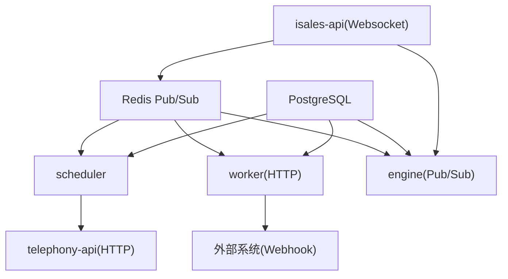
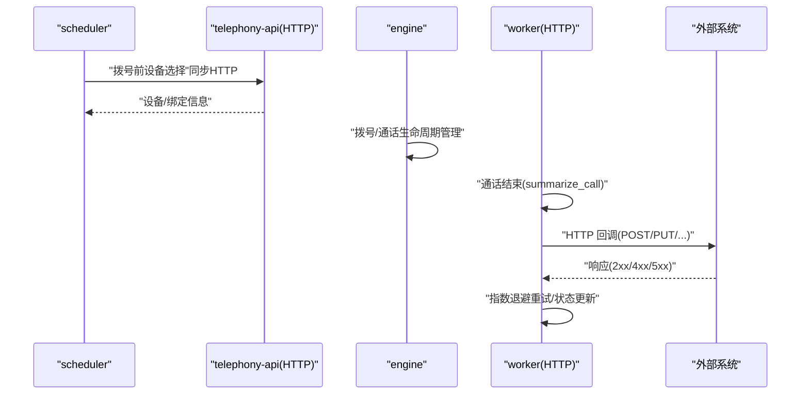
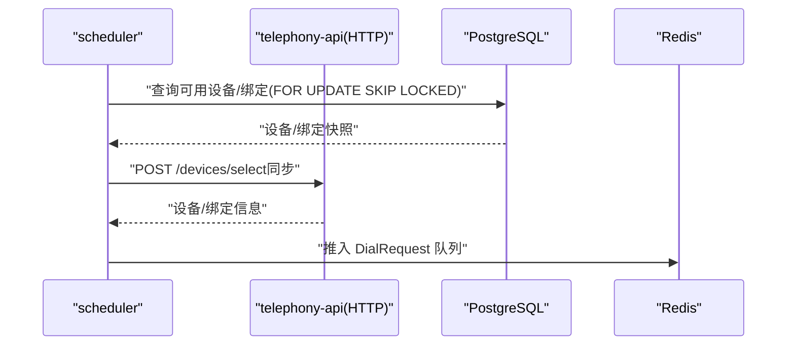
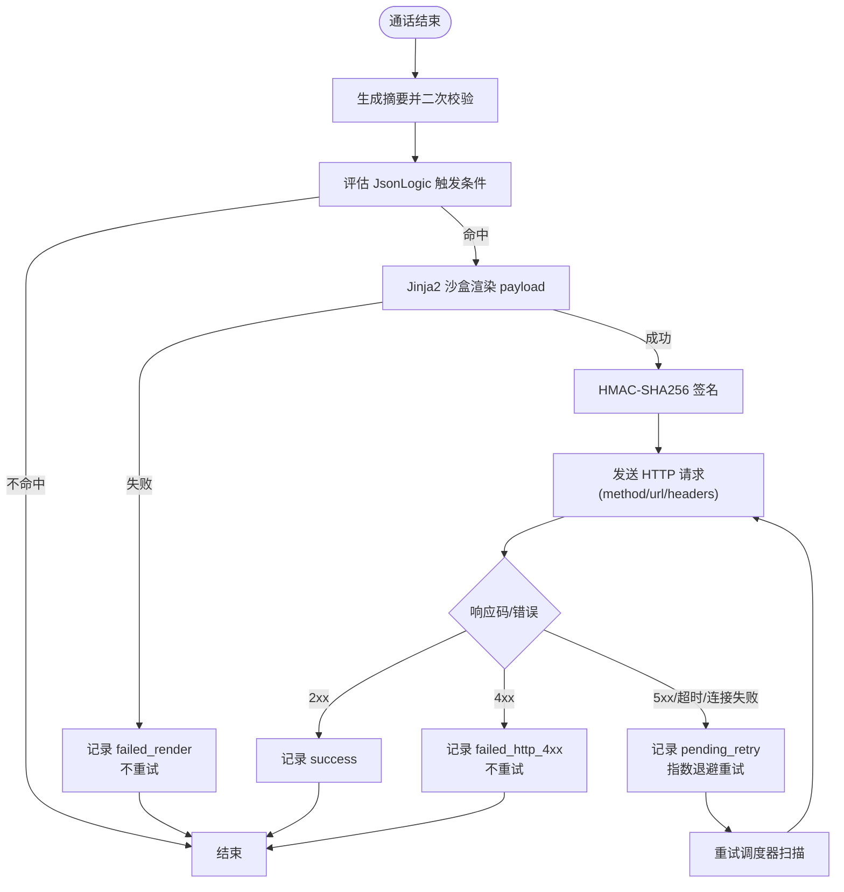
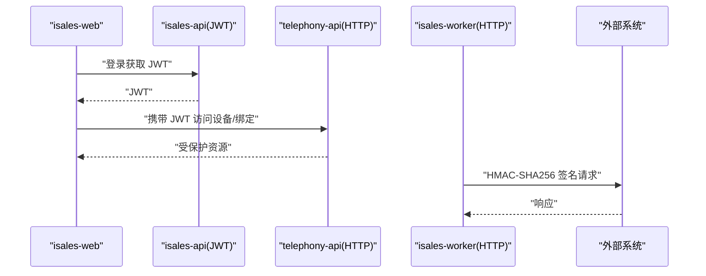
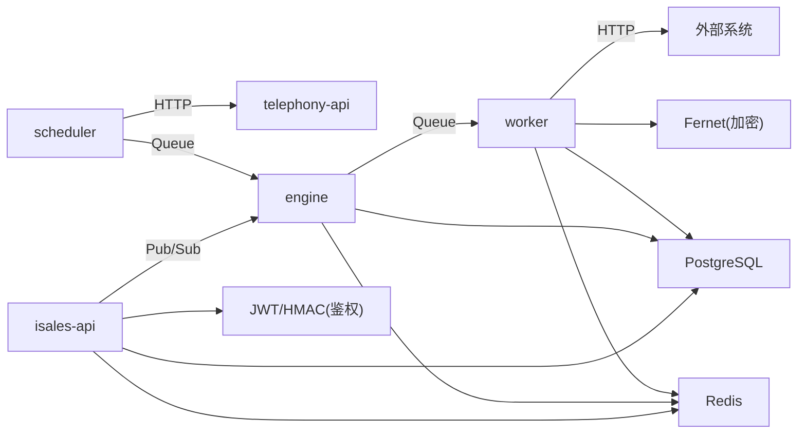

# HTTP API 通信

<cite>
**本文引用的文件**
- [service-communication/spec.md](file://openspec/specs/service-communication/spec.md)
- [webhook-callback/spec.md](file://openspec/specs/webhook-callback/spec.md)
- [service-communication/spec.md（变更记录）](file://openspec/changes/archive/2026-05-06-impl-api/specs/service-communication/spec.md)
- [webhook-callback/spec.md（变更记录）](file://openspec/changes/archive/2026-05-06-impl-worker/specs/webhook-callback/spec.md)
- [webhook-callback/spec.md（变更记录）](file://openspec/changes/archive/2026-05-08-impl-web-polish/specs/webhook-callback/spec.md)
- [provider-credential/spec.md（变更记录）](file://openspec/changes/archive/2026-05-24-impl-provider-credential-db-ssot/specs/provider-credential/spec.md)
- [webhook-callback/spec.md（变更记录）](file://openspec/changes/archive/2026-05-24-impl-provider-credential-db-ssot/specs/webhook-callback/spec.md)
- [telephony-api 环境示例](file://deploy/env/telephony-api.env.example)
- [scheduler 环境示例](file://deploy/cloud/env/scheduler.env.example)
- [worker 环境示例](file://deploy/env/worker.env.example)
- [架构变更（JWT 鉴权）](file://openspec/changes/archive/2026-05-01-clarify-stage2-boundaries/specs/architecture/spec.md)
</cite>

## 目录
1. [引言](#引言)
2. [项目结构](#项目结构)
3. [核心组件](#核心组件)
4. [架构总览](#架构总览)
5. [详细组件分析](#详细组件分析)
6. [依赖分析](#依赖分析)
7. [性能考量](#性能考量)
8. [故障排查指南](#故障排查指南)
9. [结论](#结论)
10. [附录](#附录)

## 引言
本文件聚焦 iSales 系统的 HTTP API 通信，围绕服务间同步 HTTP 调用的限制与使用场景展开，重点解释 scheduler → telephony-api 的拨号前设备选择调用，以及 worker → 外部系统的 webhook 回调实现。文档涵盖错误处理、重试机制、超时设置、安全考虑（JWT/JWE、HMAC 签名）、性能优化策略，并提供调用示例与调试方法。

## 项目结构
- 通信规范集中在 openspec/specs 下的服务通信与 webhook-callback 规范中，定义了服务间通信通道、HTTP 调用边界、重试与超时策略等。
- 配置文件位于 deploy/env 与 deploy/cloud/env，提供各服务的数据库、Redis、Fernet 密钥、默认超时等关键参数。
- 架构层面明确了 isales-api 为唯一 JWT 签发方，telephony-api 仅验证；同时规定了 v1 下 scheduler → telephony-api 的 HTTP 调用边界。

图示来源
- [service-communication/spec.md](file://openspec/specs/service-communication/spec.md)
- [webhook-callback/spec.md](file://openspec/specs/webhook-callback/spec.md)

章节来源
- [service-communication/spec.md](file://openspec/specs/service-communication/spec.md)
- [webhook-callback/spec.md](file://openspec/specs/webhook-callback/spec.md)

## 核心组件
- 服务间通信通道矩阵：定义了 scheduler → engine、engine → worker、api ↔ engine 的 Pub/Sub 与队列通信，以及 scheduler → telephony-api 的 HTTP 调用边界。
- HTTP 调用限制：v1 仅允许 scheduler → telephony-api 的同步 HTTP 调用；其他服务间通信必须走 Redis 队列或 Pub/Sub。
- 外部 webhook：worker 在通话结束后基于 JsonLogic 触发条件与 Jinja2 模板渲染，使用 HMAC-SHA256 签名与指数退避重试，通过 HTTP POST/PUT 等方法回调外部系统。
- 安全与鉴权：isales-api 为唯一 JWT 签发方，telephony-api 仅验证；HMAC 密钥通过环境变量分发；webhook 签名采用 Fernet 加密存储的 signing_secret。
- 性能与可靠性：Redis 原子计数器控制全局并发；HTTP 超时可按回调配置覆盖；重试调度器周期扫描 pending_retry 记录，避免阻塞主流程。

章节来源
- [service-communication/spec.md](file://openspec/specs/service-communication/spec.md)
- [webhook-callback/spec.md](file://openspec/specs/webhook-callback/spec.md)
- [架构变更（JWT 鉴权）](file://openspec/changes/archive/2026-05-01-clarify-stage2-boundaries/specs/architecture/spec.md)

## 架构总览
下图展示 HTTP 通信在整体架构中的位置与交互关系，突出 scheduler → telephony-api 的拨号前设备选择调用，以及 worker → 外部 webhook 的回调链路。

图示来源
- [service-communication/spec.md](file://openspec/specs/service-communication/spec.md)
- [webhook-callback/spec.md](file://openspec/specs/webhook-callback/spec.md)

## 详细组件分析

### 组件A：scheduler → telephony-api 的拨号前设备选择调用
- 调用目的：在拨号前确定可用设备与主被叫号码绑定，确保后续拨号的设备与 SIM 状态一致。
- 通信模式：同步 HTTP 调用，仅限 scheduler → telephony-api。
- 鉴权与安全：v1 单主机部署下可免 JWT；多主机扩展需引入服务账号 JWT 或 mTLS。
- 数据与状态：调用成功后，scheduler 将 DialRequest 推送到 Redis 队列，engine 消费并完成拨号。

图示来源
- [service-communication/spec.md](file://openspec/specs/service-communication/spec.md)
- [scheduler 环境示例](file://deploy/cloud/env/scheduler.env.example)

章节来源
- [service-communication/spec.md](file://openspec/specs/service-communication/spec.md)
- [scheduler 环境示例](file://deploy/cloud/env/scheduler.env.example)

### 组件B：worker → 外部 webhook 回调
- 触发时机：通话结束后，先执行 call 摘要生成与二次校验，再评估触发条件并派发回调。
- 触发条件：JsonLogic 表达式，可引用 call_summary、lead、call_record 等字段。
- 请求构建：Jinja2 沙盒模板渲染 payload，HMAC-SHA256 签名，附加时间戳与 Content-Type。
- HTTP 方法：由 callback_config.method 指定（POST/PUT/PATCH 等）。
- 重试策略：指数退避 + 最大次数；失败分类与状态机见下图。

图示来源
- [webhook-callback/spec.md](file://openspec/specs/webhook-callback/spec.md)
- [webhook-callback/spec.md（变更记录）](file://openspec/changes/archive/2026-05-06-impl-worker/specs/webhook-callback/spec.md)
- [webhook-callback/spec.md（变更记录）](file://openspec/changes/archive/2026-05-08-impl-web-polish/specs/webhook-callback/spec.md)
- [webhook-callback/spec.md（变更记录）](file://openspec/changes/archive/2026-05-24-impl-provider-credential-db-ssot/specs/webhook-callback/spec.md)

章节来源
- [webhook-callback/spec.md](file://openspec/specs/webhook-callback/spec.md)
- [webhook-callback/spec.md（变更记录）](file://openspec/changes/archive/2026-05-06-impl-worker/specs/webhook-callback/spec.md)
- [webhook-callback/spec.md（变更记录）](file://openspec/changes/archive/2026-05-08-impl-web-polish/specs/webhook-callback/spec.md)
- [webhook-callback/spec.md（变更记录）](file://openspec/changes/archive/2026-05-24-impl-provider-credential-db-ssot/specs/webhook-callback/spec.md)

### 组件C：安全与鉴权
- JWT 鉴权：isales-api 为唯一签发方，telephony-api 仅验证；HMAC 密钥通过环境变量注入。
- webhook 签名：signing_secret 通过 Fernet 加密存储；发送时解密后对 “timestamp.body” 计算 HMAC-SHA256，附加请求头。
- 前端直连：isales-web 可直连 telephony-api 获取设备/绑定信息，避免不必要的 BFF 层。

图示来源
- [架构变更（JWT 鉴权）](file://openspec/changes/archive/2026-05-01-clarify-stage2-boundaries/specs/architecture/spec.md)
- [provider-credential/spec.md（变更记录）](file://openspec/changes/archive/2026-05-24-impl-provider-credential-db-ssot/specs/provider-credential/spec.md)
- [webhook-callback/spec.md（变更记录）](file://openspec/changes/archive/2026-05-24-impl-provider-credential-db-ssot/specs/webhook-callback/spec.md)

章节来源
- [架构变更（JWT 鉴权）](file://openspec/changes/archive/2026-05-01-clarify-stage2-boundaries/specs/architecture/spec.md)
- [provider-credential/spec.md（变更记录）](file://openspec/changes/archive/2026-05-24-impl-provider-credential-db-ssot/specs/provider-credential/spec.md)
- [webhook-callback/spec.md（变更记录）](file://openspec/changes/archive/2026-05-24-impl-provider-credential-db-ssot/specs/webhook-callback/spec.md)

## 依赖分析
- 服务间依赖
  - scheduler → telephony-api：HTTP（拨号前设备选择）
  - worker → 外部：HTTP（webhook 回调）
  - api ↔ engine：Redis Pub/Sub（事件推送）
  - engine → worker：Redis 队列（通话结束处理）
  - scheduler → engine：Redis 队列（拨号派发）
- 外部依赖
  - PostgreSQL：数据持久化
  - Redis：队列、Pub/Sub、计数器
  - Fernet：webhook signing_secret 加密存储
  - JWT/HMAC：鉴权与签名

图示来源
- [service-communication/spec.md](file://openspec/specs/service-communication/spec.md)
- [webhook-callback/spec.md](file://openspec/specs/webhook-callback/spec.md)
- [telephony-api 环境示例](file://deploy/env/telephony-api.env.example)
- [worker 环境示例](file://deploy/env/worker.env.example)

章节来源
- [service-communication/spec.md](file://openspec/specs/service-communication/spec.md)
- [webhook-callback/spec.md](file://openspec/specs/webhook-callback/spec.md)
- [telephony-api 环境示例](file://deploy/env/telephony-api.env.example)
- [worker 环境示例](file://deploy/env/worker.env.example)

## 性能考量
- 全局并发控制：使用 Redis 原子计数器（INCR/DECR）跨 engine 实例控制并发，避免计数器泄漏。
- 队列与 Pub/Sub 边界：队列用于“必须送达”的工作派发，Pub/Sub 用于“实时可丢失”的事件广播，降低延迟与资源占用。
- HTTP 超时：worker 环境提供默认超时；回调配置可覆盖单条超时，避免长耗时外部系统拖慢整体。
- 重试调度：独立后台任务周期扫描 pending_retry，批量处理，减少主流程阻塞。
- 前端 WebSocket：isales-api 单实例运行，共享 Redis 订阅，避免连接膨胀。

章节来源
- [service-communication/spec.md](file://openspec/specs/service-communication/spec.md)
- [worker 环境示例](file://deploy/env/worker.env.example)

## 故障排查指南
- HTTP 5xx/超时/连接失败
  - 现象：callback_log.status 置 pending_retry，retry_count 自增，按 retry_policy 间隔重试。
  - 排查：检查外部系统可用性、网络连通性、超时配置与重试上限。
- HTTP 4xx
  - 现象：不重试，status 置 failed_http_4xx。
  - 排查：核对请求方法、URL、头部与签名；修正 payload 或触发条件。
- 渲染失败（failed_render）
  - 现象：trigger 语法错误或 payload 引用不存在字段。
  - 排查：使用 /callback-configs/validate 进行干跑校验；修复 JsonLogic 与 Jinja2 模板。
- 签名与鉴权
  - 现象：401/403 或签名头缺失。
  - 排查：确认 JWT 来源与密钥一致；HMAC 密钥通过环境变量注入；检查 X-Isales-Timestamp 与 body 拼接。
- 超时问题
  - 现象：回调请求超时。
  - 排查：调整 callback_config.timeout_seconds 或全局默认值；优化外部系统响应时间。
- 并发与计数器
  - 现象：拨号失败或积压。
  - 排查：检查 Redis 原子计数器状态与调度器重试任务是否正常。

章节来源
- [webhook-callback/spec.md](file://openspec/specs/webhook-callback/spec.md)
- [webhook-callback/spec.md（变更记录）](file://openspec/changes/archive/2026-05-06-impl-worker/specs/webhook-callback/spec.md)
- [webhook-callback/spec.md（变更记录）](file://openspec/changes/archive/2026-05-08-impl-web-polish/specs/webhook-callback/spec.md)
- [service-communication/spec.md](file://openspec/specs/service-communication/spec.md)

## 结论
iSales 的 HTTP API 通信遵循严格的边界与安全策略：v1 仅在 scheduler → telephony-api 场景使用同步 HTTP，其余通信通过 Redis 队列与 Pub/Sub 实现；worker → 外部 webhook 采用 JsonLogic 触发、Jinja2 渲染、HMAC-SHA256 签名与指数退避重试，确保高可靠与可审计。配合 Redis 原子计数器与合理的超时/重试策略，系统在性能与稳定性之间取得平衡。

## 附录
- 调用示例与调试方法
  - 拨号前设备选择（scheduler → telephony-api）
    - 方法：POST /devices/select
    - 鉴权：v1 单主机可免 JWT；多主机需服务账号 JWT 或 mTLS
    - 调试：检查 scheduler 环境变量与 telephony-api 日志；确认 Redis 队列 DialRequest 推送成功
  - 外部 webhook 回调（worker → 外部）
    - 触发：summarize_call 完成后评估 JsonLogic
    - 渲染：Jinja2 沙盒模板；使用 /callback-configs/validate 进行干跑校验
    - 签名：HMAC-SHA256（timestamp.body），附加 X-Isales-Signature 与 X-Isales-Timestamp
    - 重试：查看 callback_log 状态与重试时间；核对 retry_policy 与超时配置
    - 调试：启用 worker 日志与回调日志；使用 /callback-configs/{id}/rotate-secret 一次性回显明文密钥进行联调

章节来源
- [service-communication/spec.md](file://openspec/specs/service-communication/spec.md)
- [webhook-callback/spec.md](file://openspec/specs/webhook-callback/spec.md)
- [webhook-callback/spec.md（变更记录）](file://openspec/changes/archive/2026-05-08-impl-web-polish/specs/webhook-callback/spec.md)
- [worker 环境示例](file://deploy/env/worker.env.example)