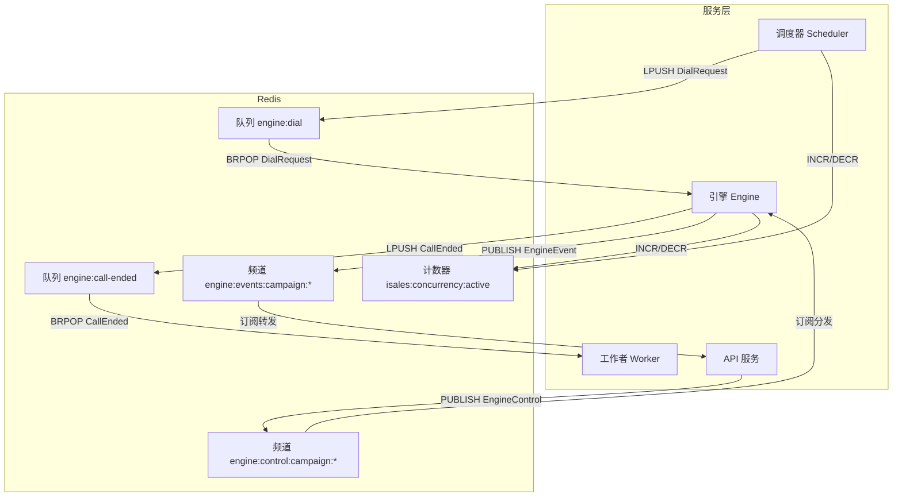
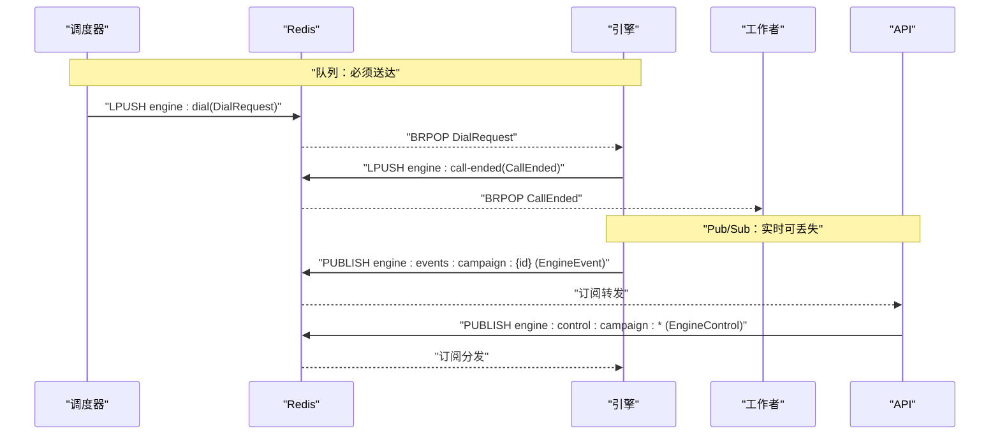
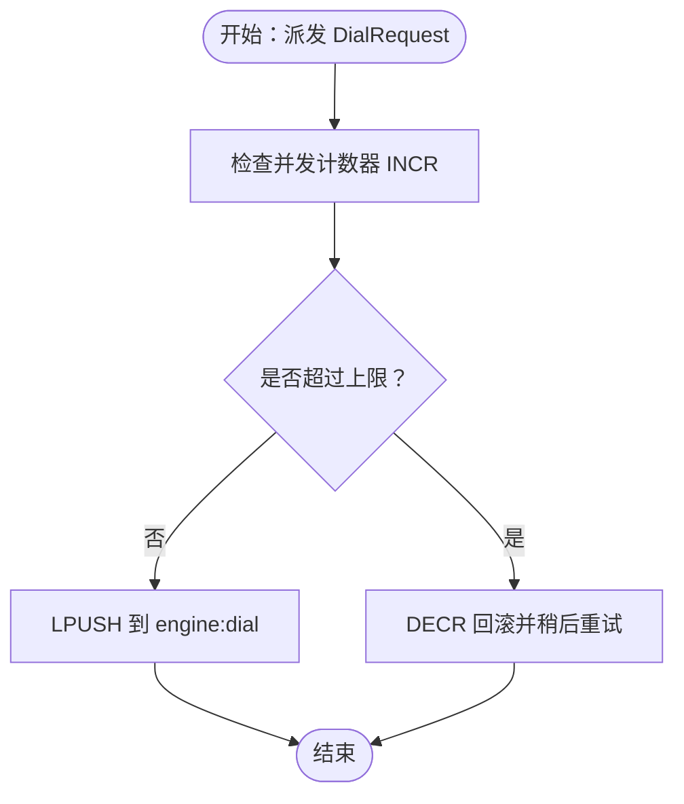
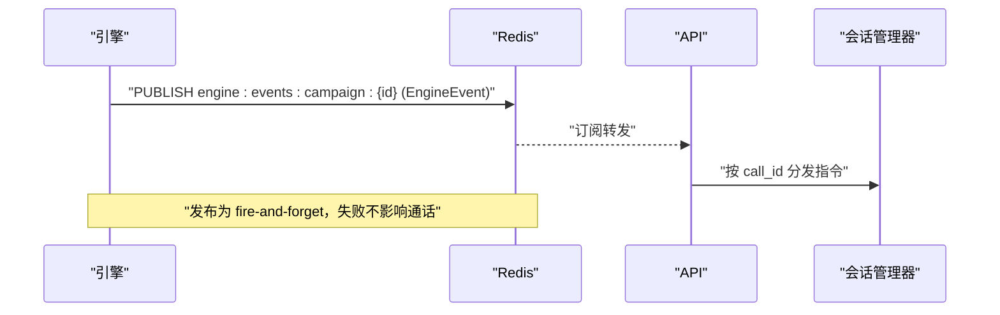
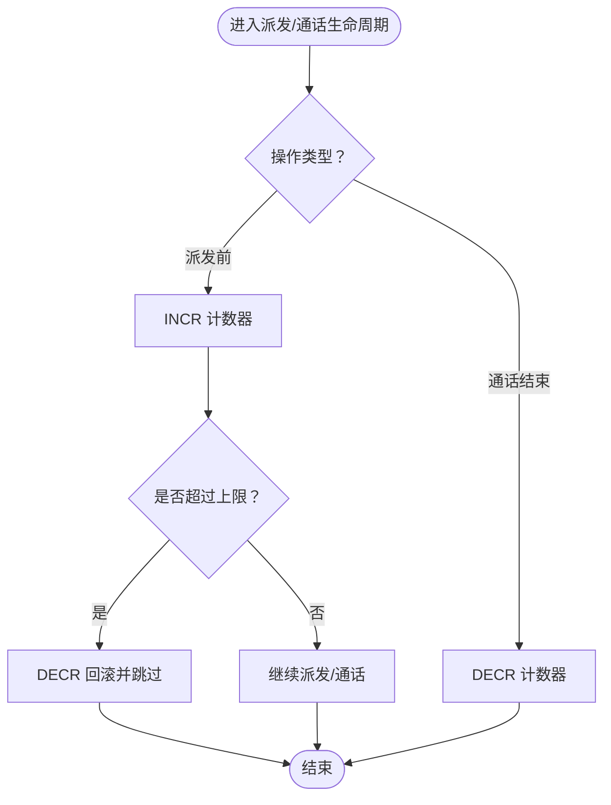
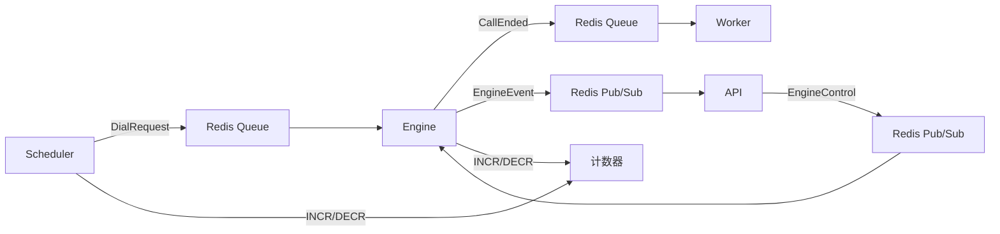

# Redis 队列与发布订阅

<cite>
**本文引用的文件**
- [service-communication/spec.md](file://openspec/specs/service-communication/spec.md)
- [message-contract/spec.md](file://openspec/specs/message-contract/spec.md)
- [2026-05-06-impl-scheduler/design.md](file://openspec/changes/archive/2026-05-06-impl-scheduler/design.md)
- [2026-05-06-impl-scheduler/tasks.md](file://openspec/changes/archive/2026-05-06-impl-scheduler/tasks.md)
- [2026-05-07-impl-engine/design.md](file://openspec/changes/archive/2026-05-07-impl-engine/design.md)
- [2026-05-07-impl-engine/tasks.md](file://openspec/changes/archive/2026-05-07-impl-engine/tasks.md)
- [2026-05-06-impl-api/design.md](file://openspec/changes/archive/2026-05-06-impl-api/design.md)
- [retry-followup/spec.md](file://openspec/specs/retry-followup/spec.md)
</cite>

## 目录
1. [简介](#简介)
2. [项目结构](#项目结构)
3. [核心组件](#核心组件)
4. [架构总览](#架构总览)
5. [详细组件分析](#详细组件分析)
6. [依赖分析](#依赖分析)
7. [性能考虑](#性能考虑)
8. [故障排查指南](#故障排查指南)
9. [结论](#结论)
10. [附录](#附录)

## 简介
本文件面向 iSales 系统的 Redis 通信机制，系统性阐述 Redis 队列与发布订阅（Pub/Sub）的职责边界、消息结构、并发控制、配置要点、错误处理与性能优化建议。重点覆盖：
- 队列（Queue）用于“必须送达”的工作派发（如 scheduler → engine 的拨号请求、engine → worker 的通话结束通知）
- 发布订阅（Pub/Sub）用于“实时、可丢失”的事件广播（如 engine → api 的通话事件、api → engine 的控制指令）
- 全局并发控制：基于 Redis 原子计数器的跨实例限流
- 消息契约：统一的 Pydantic 模型与序列化规范，确保跨服务一致性

## 项目结构
围绕 Redis 的关键规范与实现分布在如下位置：
- 通信通道与边界：service-communication/spec.md
- 消息契约与序列化：message-contract/spec.md
- 调度器（Scheduler）并发与队列派发：2026-05-06-impl-scheduler/*
- 引擎（Engine）事件发布与控制订阅：2026-05-07-impl-engine/*
- API（Web）事件订阅与 WebSocket 转发：2026-05-06-impl-api/*
- 重试与跟进状态机约束：retry-followup/spec.md

图示来源
- [service-communication/spec.md:11-24](file://openspec/specs/service-communication/spec.md#L11-L24)
- [service-communication/spec.md:31-47](file://openspec/specs/service-communication/spec.md#L31-L47)
- [2026-05-06-impl-scheduler/design.md:95-101](file://openspec/changes/archive/2026-05-06-impl-scheduler/design.md#L95-L101)
- [2026-05-07-impl-engine/tasks.md:101-107](file://openspec/changes/archive/2026-05-07-impl-engine/tasks.md#L101-L107)
- [2026-05-06-impl-api/design.md:47-52](file://openspec/changes/archive/2026-05-06-impl-api/design.md#L47-L52)

章节来源
- [service-communication/spec.md:11-24](file://openspec/specs/service-communication/spec.md#L11-L24)
- [service-communication/spec.md:31-47](file://openspec/specs/service-communication/spec.md#L31-L47)
- [message-contract/spec.md:43-51](file://openspec/specs/message-contract/spec.md#L43-L51)

## 核心组件
- 队列通道
  - scheduler → engine：engine:dial（拨号请求）
  - engine → worker：engine:call-ended（通话结束）
  - api → scheduler：启动/暂停 campaign（CampaignControl）
- 发布订阅通道
  - engine → api：engine:events:campaign:{id}（EngineEvent）
  - api → engine：engine:control:campaign:*（EngineControl）
- 全局并发控制
  - 键名：isales:concurrency:active
  - 操作：派发前 INCR，通话结束 DECR；失败回滚 DECR
- 消息契约
  - 统一基类与版本字段（schema_version、message_id、created_at）
  - 生产者使用 Pydantic 序列化，消费者使用 model_validate_json 反序列化

章节来源
- [service-communication/spec.md:11-24](file://openspec/specs/service-communication/spec.md#L11-L24)
- [service-communication/spec.md:45-62](file://openspec/specs/service-communication/spec.md#L45-L62)
- [message-contract/spec.md:25-37](file://openspec/specs/message-contract/spec.md#L25-L37)
- [message-contract/spec.md:76-84](file://openspec/specs/message-contract/spec.md#L76-L84)

## 架构总览
iSales 的 Redis 通信遵循“队列负责可靠工作派发，Pub/Sub 负责实时事件广播”的边界。生产者与消费者严格使用 isales-common 的消息模型，确保跨服务一致性与可观测性。

图示来源
- [service-communication/spec.md:11-24](file://openspec/specs/service-communication/spec.md#L11-L24)
- [2026-05-07-impl-engine/tasks.md:101-107](file://openspec/changes/archive/2026-05-07-impl-engine/tasks.md#L101-L107)
- [2026-05-06-impl-api/design.md:47-52](file://openspec/changes/archive/2026-05-06-impl-api/design.md#L47-L52)

## 详细组件分析

### 队列：工作派发与可靠性保障
- 通道与用途
  - scheduler → engine：engine:dial（携带 lead 信息、历史摘要、prompt 快照、caller_id）
  - engine → worker：engine:call-ended（call_record_id、终止原因）
  - api → scheduler：CampaignControl（启动/暂停 campaign）
- 消息内容结构
  - DialRequest：含拨号所需上下文（见消息契约 v1 必备项）
  - CallEnded：通话结束后的记录标识与原因
  - CampaignControl：启动/暂停指令
- 处理流程
  - 生产者：使用 isales-common 的 Pydantic 模型构造消息，调用序列化方法写入 Redis
  - 消费者：使用对应模型反序列化，执行业务逻辑
- 错误处理
  - 消息反序列化失败或 schema_version 不兼容：记录告警并按死信处理
  - 队列消费失败：利用 Redis 队列的确认与重试特性（由具体实现保证）

图示来源
- [service-communication/spec.md:49-57](file://openspec/specs/service-communication/spec.md#L49-L57)
- [2026-05-06-impl-scheduler/design.md:95-101](file://openspec/changes/archive/2026-05-06-impl-scheduler/design.md#L95-L101)

章节来源
- [service-communication/spec.md:11-24](file://openspec/specs/service-communication/spec.md#L11-L24)
- [message-contract/spec.md:43-51](file://openspec/specs/message-contract/spec.md#L43-L51)
- [2026-05-06-impl-scheduler/tasks.md:63-68](file://openspec/changes/archive/2026-05-06-impl-scheduler/tasks.md#L63-L68)

### 发布订阅：实时事件广播与控制
- 通道与用途
  - engine → api：engine:events:campaign:{id}（EngineEvent：状态变更、ASR 文本、转写增量等）
  - api → engine：engine:control:campaign:*（EngineControl：手动挂断、转人工等）
- 消息内容结构
  - EngineEvent：按消息契约定义的判别联合类型
  - EngineControl：按消息契约定义的判别联合类型
- 处理流程
  - 发布：fire-and-forget，内部异步任务执行，失败仅记录警告，不阻塞主流程
  - 订阅：单任务 PSUBSCRIBE，按 call_id 分发到会话管理器；未知 call_id 静默丢弃
- 错误处理
  - 发布超时/异常：记录警告日志，不阻塞通话主路径
  - 订阅负载：共享订阅，避免多客户端导致 Redis 连接膨胀

图示来源
- [service-communication/spec.md:15-16](file://openspec/specs/service-communication/spec.md#L15-L16)
- [2026-05-07-impl-engine/design.md:168-178](file://openspec/changes/archive/2026-05-07-impl-engine/design.md#L168-L178)
- [2026-05-07-impl-engine/tasks.md:101-107](file://openspec/changes/archive/2026-05-07-impl-engine/tasks.md#L101-L107)
- [2026-05-06-impl-api/design.md:47-52](file://openspec/changes/archive/2026-05-06-impl-api/design.md#L47-L52)

章节来源
- [service-communication/spec.md:15-16](file://openspec/specs/service-communication/spec.md#L15-L16)
- [2026-05-07-impl-engine/design.md:168-178](file://openspec/changes/archive/2026-05-07-impl-engine/design.md#L168-L178)
- [2026-05-07-impl-engine/tasks.md:101-107](file://openspec/changes/archive/2026-05-07-impl-engine/tasks.md#L101-L107)
- [2026-05-06-impl-api/design.md:47-52](file://openspec/changes/archive/2026-05-06-impl-api/design.md#L47-L52)

### 全局并发控制：Redis 原子计数器
- 目标
  - 保证跨引擎实例的全局并发上限一致，避免资源争用与超卖
- 实现
  - 键名：isales:concurrency:active
  - 派发前：INCR 检查是否超过 MAX_CONCURRENCY，超限则 DECR 并跳过
  - 通话结束：DECR；异常/崩溃：通过定期对账与心跳兜底
- 与服务边界的契合
  - scheduler 在派发前 INCR，engine 在通话结束 DECR，形成闭环
  - engine 进程内不再做本地并发计数，完全依赖 Redis 计数器

图示来源
- [service-communication/spec.md:45-62](file://openspec/specs/service-communication/spec.md#L45-L62)
- [2026-05-06-impl-scheduler/design.md:95-101](file://openspec/changes/archive/2026-05-06-impl-scheduler/design.md#L95-L101)
- [2026-05-07-impl-engine/design.md:265-269](file://openspec/changes/archive/2026-05-07-impl-engine/design.md#L265-L269)

章节来源
- [service-communication/spec.md:45-62](file://openspec/specs/service-communication/spec.md#L45-L62)
- [2026-05-06-impl-scheduler/design.md:95-101](file://openspec/changes/archive/2026-05-06-impl-scheduler/design.md#L95-L101)
- [2026-05-07-impl-engine/design.md:265-269](file://openspec/changes/archive/2026-05-07-impl-engine/design.md#L265-L269)

### WebSocket 与前端事件对接
- API 服务订阅 Redis Pub/Sub（engine:events:campaign:{id}），将 EngineEvent 直接转发给前端 WebSocket 客户端
- 前端使用 TypeScript 的判别联合类型解析消息，未知类型仅告警跳过，避免破坏性升级
- 多客户端订阅同一 campaign 时，共享一个 Redis 订阅，避免连接膨胀

章节来源
- [service-communication/spec.md:106-131](file://openspec/specs/service-communication/spec.md#L106-L131)
- [2026-05-06-impl-api/design.md:47-52](file://openspec/changes/archive/2026-05-06-impl-api/design.md#L47-L52)

### 状态机与重试跟进约束
- scheduler 派发成功后仅写 lead.status='calling'，不得写终态或计算 next_call_at
- scheduler 仅在“窗外重排”场景写 next_call_at；其他（重试/跟进）由 worker 写回
- worker 根据挂断原因与目标达成情况决定后续状态与 next_call_at

章节来源
- [retry-followup/spec.md:140-158](file://openspec/specs/retry-followup/spec.md#L140-L158)

## 依赖分析
- 服务间依赖
  - scheduler 依赖 Redis 队列与 isales-common 消息模型
  - engine 依赖 Redis 队列与 Pub/Sub、isales-common 消息模型
  - worker 依赖 Redis 队列与 isales-common 消息模型
  - API 依赖 Redis Pub/Sub 与 WebSocket，将事件转发给前端
- 依赖耦合
  - 通过统一的消息契约降低耦合
  - Redis 作为共享基础设施，避免服务间直接耦合

图示来源
- [service-communication/spec.md:11-24](file://openspec/specs/service-communication/spec.md#L11-L24)
- [service-communication/spec.md:45-62](file://openspec/specs/service-communication/spec.md#L45-L62)

## 性能考虑
- 队列与 Pub/Sub 的选择
  - 队列用于“必须送达”，具备确认与重试能力，适合拨号与通话结束处理
  - Pub/Sub 用于“实时可丢失”，避免阻塞主路径，提高前端交互体验
- 订阅与转发
  - API 侧采用单订阅任务 + fan-out，避免多客户端导致 Redis 连接膨胀
  - 发布采用 fire-and-forget，避免网络抖动影响通话主路径
- 序列化与可观测性
  - 统一使用 Pydantic 序列化，便于调试与跨服务追踪
  - 日志包含 message_id，便于端到端排查

章节来源
- [service-communication/spec.md:31-47](file://openspec/specs/service-communication/spec.md#L31-L47)
- [2026-05-06-impl-api/design.md:47-52](file://openspec/changes/archive/2026-05-06-impl-api/design.md#L47-L52)
- [2026-05-07-impl-engine/design.md:168-178](file://openspec/changes/archive/2026-05-07-impl-engine/design.md#L168-L178)
- [message-contract/spec.md:76-84](file://openspec/specs/message-contract/spec.md#L76-L84)

## 故障排查指南
- 队列消息反序列化失败
  - 现象：消费者日志出现 schema_version 不兼容或字段缺失
  - 处理：按消息契约进行版本校验，不支持的版本按死信处理，记录告警
- 发布失败或超时
  - 现象：EngineEvent 发布警告日志
  - 处理：确认 Redis 连接与网络状况，发布为 fire-and-forget，不影响通话主路径
- 订阅异常或消息丢失
  - 现象：前端 WebSocket 未收到事件或收到未知类型
  - 处理：确认订阅频道与模式匹配，前端对未知类型仅告警跳过
- 并发计数器泄漏
  - 现象：计数器长期不降或异常升高
  - 处理：检查 engine 通话结束是否正确 DECR；关注定期对账与心跳兜底机制

章节来源
- [message-contract/spec.md:34-37](file://openspec/specs/message-contract/spec.md#L34-L37)
- [2026-05-07-impl-engine/design.md:168-178](file://openspec/changes/archive/2026-05-07-impl-engine/design.md#L168-L178)
- [service-communication/spec.md:87-105](file://openspec/specs/service-communication/spec.md#L87-L105)

## 结论
iSales 的 Redis 通信以“队列可靠派发 + Pub/Sub 实时广播”为核心，配合统一的消息契约与全局并发控制，实现了跨服务的一致性与高可用。通过 fire-and-forget 的发布策略与单订阅任务的转发机制，既保证了前端体验，又避免了阻塞主业务路径。建议在生产环境中持续监控并发计数器与发布/订阅健康度，确保系统稳定运行。

## 附录
- 配置示例（环境变量与键名）
  - Redis 计数器键名：isales:concurrency:active
  - 队列名称：
    - engine:dial（拨号请求）
    - engine:call-ended（通话结束）
    - api → scheduler：启动/暂停 campaign（CampaignControl）
  - Pub/Sub 频道：
    - engine:events:campaign:{id}（EngineEvent）
    - engine:control:campaign:*（EngineControl）
- 最佳实践
  - 严格使用 isales-common 的消息模型进行序列化与反序列化
  - 队列消息必须具备 schema_version、message_id、created_at
  - 发布采用 fire-and-forget，订阅采用单任务共享模式
  - 定期对账与心跳机制用于兜底并发计数器泄漏

章节来源
- [service-communication/spec.md:11-24](file://openspec/specs/service-communication/spec.md#L11-L24)
- [service-communication/spec.md:45-62](file://openspec/specs/service-communication/spec.md#L45-L62)
- [message-contract/spec.md:25-37](file://openspec/specs/message-contract/spec.md#L25-L37)
- [2026-05-06-impl-api/design.md:47-52](file://openspec/changes/archive/2026-05-06-impl-api/design.md#L47-L52)
- [2026-05-07-impl-engine/tasks.md:101-107](file://openspec/changes/archive/2026-05-07-impl-engine/tasks.md#L101-L107)