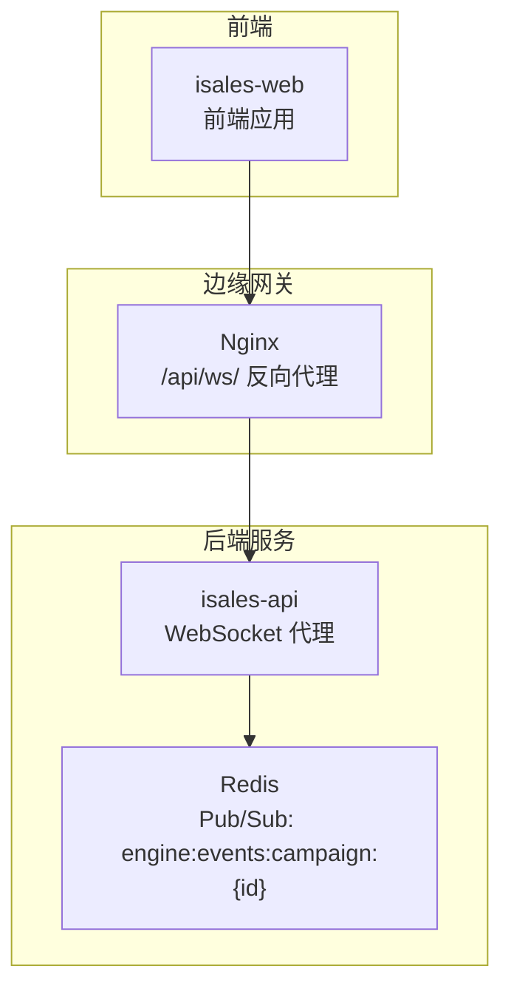
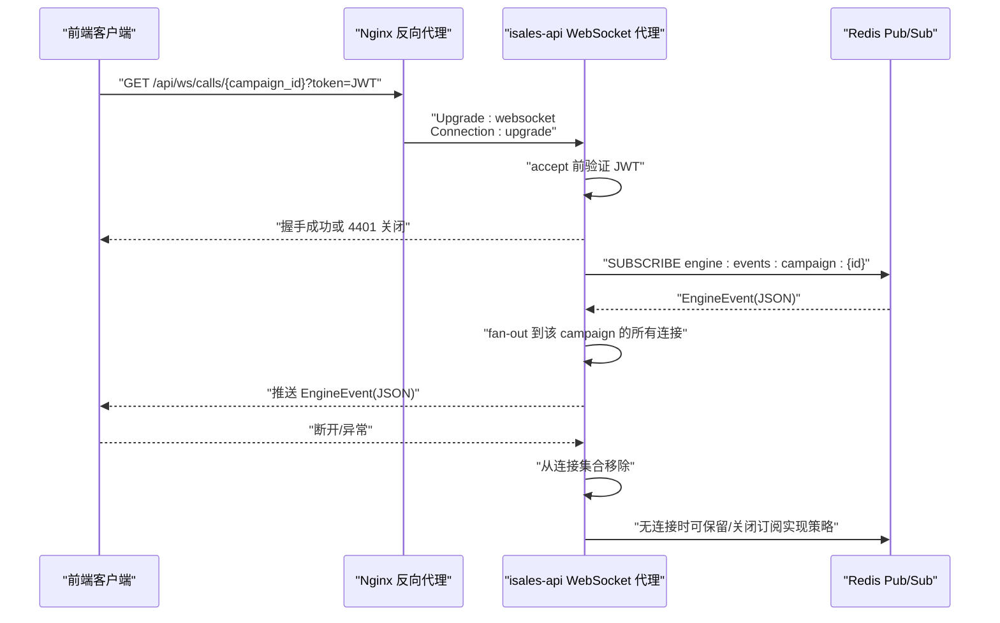
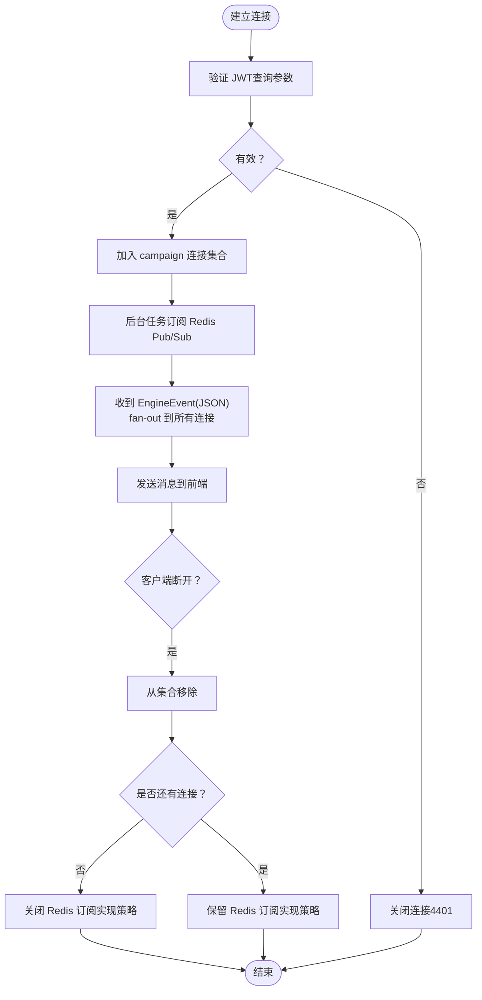
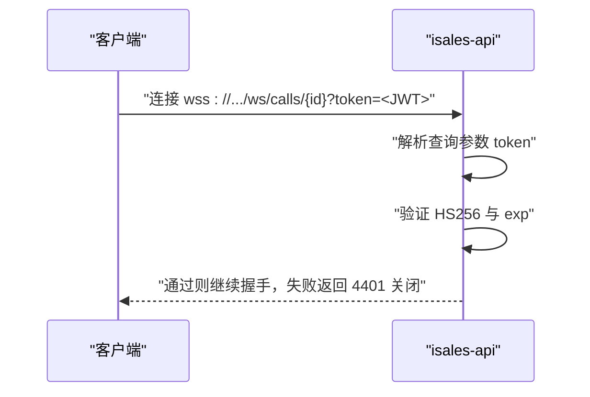
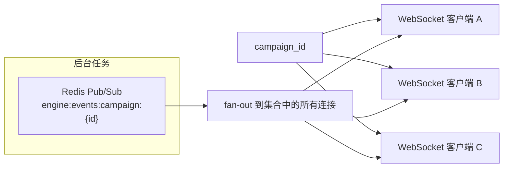
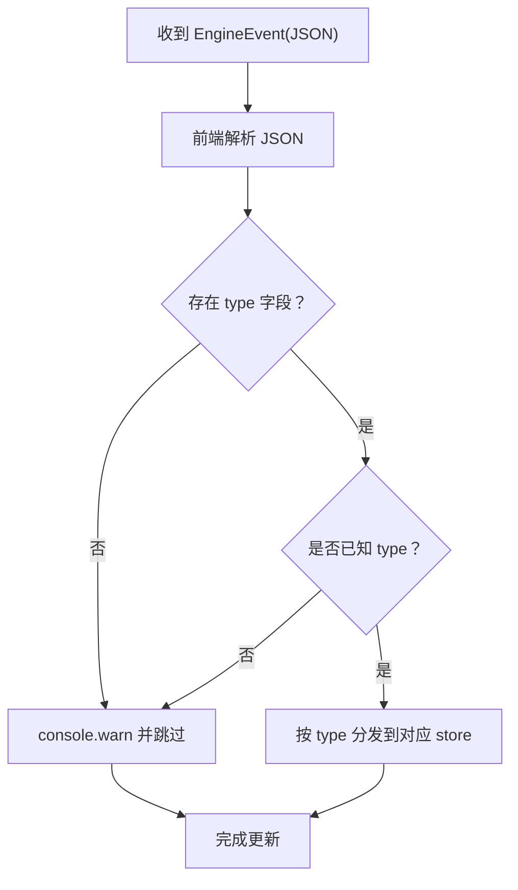
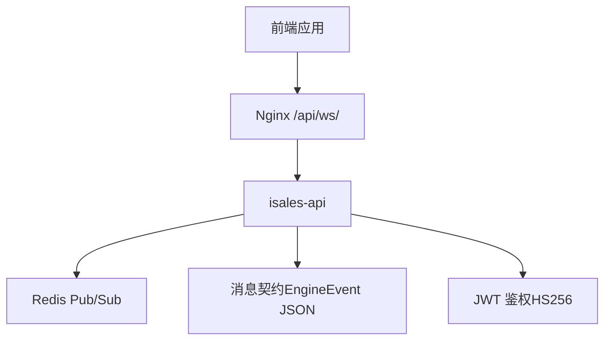

# WebSocket 代理机制

<cite>
**本文引用的文件**
- [service-communication 规格（归档 2026-05-06）](file://openspec/changes/archive/2026-05-06-impl-api/specs/service-communication/spec.md)
- [service-communication 规格（归档 2026-05-08）](file://openspec/changes/archive/2026-05-08-impl-web/specs/service-communication/spec.md)
- [service-communication 规格（架构拆分）](file://openspec/changes/arch-cloud-edge-split/specs/service-communication/spec.md)
- [消息契约规格](file://openspec/specs/message-contract/spec.md)
- [Nginx 配置（云环境）](file://deploy/cloud/nginx/isales.conf)
- [JWT 决策与设计（归档 2026-05-06）](file://openspec/changes/archive/2026-05-06-impl-api/design.md)
</cite>

## 目录
1. [简介](#简介)
2. [项目结构](#项目结构)
3. [核心组件](#核心组件)
4. [架构总览](#架构总览)
5. [详细组件分析](#详细组件分析)
6. [依赖关系分析](#依赖关系分析)
7. [性能考量](#性能考量)
8. [故障排除指南](#故障排除指南)
9. [结论](#结论)
10. [附录](#附录)

## 简介
本文面向 iSales 系统的 WebSocket 代理机制，系统性阐述 isales-api 如何作为 WebSocket 代理，将 Redis Pub/Sub 事件转换为前端可订阅的实时流。重点覆盖以下方面：
- /ws/calls/{campaign_id} 端点的实现原理与控制流
- JWT 鉴权机制与连接管理策略
- EngineEvent discriminated union 的结构与解析过程
- 多客户端订阅与资源管理策略
- WebSocket 连接示例、错误处理与断线重连机制
- 前端集成指南与最佳实践

## 项目结构
围绕 WebSocket 代理的关键文档与配置如下：
- 服务通信规格：定义 WebSocket 代理端点、鉴权、Fan-out、消息形状约束与前端解析契约
- 消息契约规格：定义 EngineEvent 与消息基类、版本字段、序列化与可观测性
- Nginx 配置：将 /api/ws/ 请求升级为 WebSocket，并透传头部
- JWT 决策：HS256、24 小时过期、查询参数传递 token 的实践

图表来源
- [Nginx 配置（云环境）:54-63](file://deploy/cloud/nginx/isales.conf#L54-L63)
- [service-communication 规格（归档 2026-05-06）:3-5](file://openspec/changes/archive/2026-05-06-impl-api/specs/service-communication/spec.md#L3-L5)

章节来源
- [Nginx 配置（云环境）:54-63](file://deploy/cloud/nginx/isales.conf#L54-L63)
- [service-communication 规格（归档 2026-05-06）:3-5](file://openspec/changes/archive/2026-05-06-impl-api/specs/service-communication/spec.md#L3-L5)

## 核心组件
- WebSocket 代理端点：/ws/calls/{campaign_id}
- 鉴权机制：JWT（HS256，24 小时过期），通过查询参数传递
- 连接管理：进程内按 campaign_id 维护连接集合，后台任务订阅 Redis Pub/Sub
- 消息契约：EngineEvent discriminated union，直接透传 JSON
- 前端解析：TypeScript discriminated union，按 type 分发到 reactive store

章节来源
- [service-communication 规格（归档 2026-05-06）:7-10](file://openspec/changes/archive/2026-05-06-impl-api/specs/service-communication/spec.md#L7-L10)
- [service-communication 规格（归档 2026-05-08）:34-37](file://openspec/changes/archive/2026-05-08-impl-web/specs/service-communication/spec.md#L34-L37)
- [JWT 决策与设计（归档 2026-05-06）:32-45](file://openspec/changes/archive/2026-05-06-impl-api/design.md#L32-L45)

## 架构总览
WebSocket 代理的整体交互流程如下：

图表来源
- [Nginx 配置（云环境）:54-63](file://deploy/cloud/nginx/isales.conf#L54-L63)
- [service-communication 规格（归档 2026-05-06）:7-20](file://openspec/changes/archive/2026-05-06-impl-api/specs/service-communication/spec.md#L7-L20)
- [JWT 决策与设计（归档 2026-05-06）:41-45](file://openspec/changes/archive/2026-05-06-impl-api/design.md#L41-L45)

## 详细组件分析

### 端点与控制流：/ws/calls/{campaign_id}
- 端点路径：/ws/calls/{campaign_id}
- 升级请求：由 Nginx 将 /api/ws/ 的请求升级为 WebSocket
- 控制流要点：
  - 接受连接前进行 JWT 验证，失败立即关闭并返回 4401
  - 为每个 campaign_id 维护连接集合
  - 后台任务订阅 Redis Pub/Sub channel：engine:events:campaign:{id}
  - 收到消息后 fan-out 给该 campaign 的所有连接
  - 客户端断开时从集合移除；无连接时可保留或关闭订阅（实现策略）

图表来源
- [service-communication 规格（归档 2026-05-06）:7-20](file://openspec/changes/archive/2026-05-06-impl-api/specs/service-communication/spec.md#L7-L20)
- [JWT 决策与设计（归档 2026-05-06）:41-45](file://openspec/changes/archive/2026-05-06-impl-api/design.md#L41-L45)

章节来源
- [service-communication 规格（归档 2026-05-06）:3-20](file://openspec/changes/archive/2026-05-06-impl-api/specs/service-communication/spec.md#L3-L20)
- [Nginx 配置（云环境）:54-63](file://deploy/cloud/nginx/isales.conf#L54-L63)

### JWT 鉴权机制
- 签发算法：HS256
- 过期时间：24 小时
- 传递方式：查询参数 token
- 失效处理：握手阶段验证失败返回 4401 关闭码，拒绝未鉴权连接

图表来源
- [JWT 决策与设计（归档 2026-05-06）:32-45](file://openspec/changes/archive/2026-05-06-impl-api/design.md#L32-L45)
- [service-communication 规格（归档 2026-05-06）:9-10](file://openspec/changes/archive/2026-05-06-impl-api/specs/service-communication/spec.md#L9-L10)

章节来源
- [JWT 决策与设计（归档 2026-05-06）:32-45](file://openspec/changes/archive/2026-05-06-impl-api/design.md#L32-L45)
- [service-communication 规格（归档 2026-05-06）:9-10](file://openspec/changes/archive/2026-05-06-impl-api/specs/service-communication/spec.md#L9-L10)

### 连接管理与资源策略
- 连接集合：按 campaign_id 维护 Set[WebSocket]
- 订阅策略：后台单任务订阅 Redis Pub/Sub，避免每个 WS 连接独立订阅导致 Redis 连接膨胀
- 断开处理：移除连接；无连接时可保留或关闭订阅（实现策略由实现决定）
- 单实例限制：v1 部署为单实例，不假设跨实例广播；多实例扩展需 OpenSpec 变更提案

图表来源
- [service-communication 规格（归档 2026-05-06）:12-19](file://openspec/changes/archive/2026-05-06-impl-api/specs/service-communication/spec.md#L12-L19)
- [service-communication 规格（架构拆分）:231-234](file://openspec/changes/arch-cloud-edge-split/specs/service-communication/spec.md#L231-L234)

章节来源
- [service-communication 规格（归档 2026-05-06）:12-19](file://openspec/changes/archive/2026-05-06-impl-api/specs/service-communication/spec.md#L12-L19)
- [service-communication 规格（架构拆分）:231-234](file://openspec/changes/arch-cloud-edge-split/specs/service-communication/spec.md#L231-L234)

### EngineEvent discriminated union 结构与解析
- 消息形状：直接透传 EngineEvent JSON，不重新包装
- 前端解析：使用 TypeScript discriminated union，按 type 字段分发到对应 reactive store 更新
- 兼容性：遇到未知 type 仅 console.warn 并跳过，不中断整个连接
- 新类型流程：后端引入新 EngineEvent 子类型必须经 OpenSpec 变更同步，前端在变更实施时新增对应 handler

图表来源
- [service-communication 规格（归档 2026-05-08）:34-42](file://openspec/changes/archive/2026-05-08-impl-web/specs/service-communication/spec.md#L34-L42)
- [service-communication 规格（架构拆分）:241-249](file://openspec/changes/arch-cloud-edge-split/specs/service-communication/spec.md#L241-L249)

章节来源
- [service-communication 规格（归档 2026-05-08）:34-42](file://openspec/changes/archive/2026-05-08-impl-web/specs/service-communication/spec.md#L34-L42)
- [service-communication 规格（架构拆分）:241-249](file://openspec/changes/arch-cloud-edge-split/specs/service-communication/spec.md#L241-L249)

### 多客户端订阅与资源管理
- 共享订阅：多个前端客户端订阅同一 campaign_id 时，共享一个 Redis Pub/Sub 订阅
- Fan-out：后台任务 fan-out 给该 campaign 的所有连接
- 资源策略：避免每个 WS 连接独立订阅，防止 Redis 连接膨胀；实现层可选择“保留订阅”或“关闭订阅”

章节来源
- [service-communication 规格（归档 2026-05-06）:12-19](file://openspec/changes/archive/2026-05-06-impl-api/specs/service-communication/spec.md#L12-L19)

### 前端集成指南与最佳实践
- 连接地址：wss://.../api/ws/calls/{campaign_id}?token=<JWT>
- 鉴权：确保在连接时携带有效的 HS256 JWT（24 小时过期）
- 解析策略：使用 TypeScript discriminated union，严格按 type 分发；未知 type 仅警告跳过
- 错误处理：监听 4401 关闭码（JWT 失效），触发重新登录获取新 token
- 断线重连：指数退避重连，重连时携带最新 token；避免频繁重连导致压力

章节来源
- [Nginx 配置（云环境）:54-63](file://deploy/cloud/nginx/isales.conf#L54-L63)
- [JWT 决策与设计（归档 2026-05-06）:32-45](file://openspec/changes/archive/2026-05-06-impl-api/design.md#L32-L45)
- [service-communication 规格（归档 2026-05-08）:34-42](file://openspec/changes/archive/2026-05-08-impl-web/specs/service-communication/spec.md#L34-L42)

## 依赖关系分析
- 前端依赖：Nginx 反向代理将 /api/ws/ 升级为 WebSocket
- 后端依赖：Redis Pub/Sub 提供事件通道
- 消息契约：EngineEvent JSON 形状由消息契约规范约束
- 鉴权依赖：JWT HS256 与过期时间

图表来源
- [Nginx 配置（云环境）:54-63](file://deploy/cloud/nginx/isales.conf#L54-L63)
- [service-communication 规格（归档 2026-05-06）:3-5](file://openspec/changes/archive/2026-05-06-impl-api/specs/service-communication/spec.md#L3-L5)
- [消息契约规格:43-51](file://openspec/specs/message-contract/spec.md#L43-L51)
- [JWT 决策与设计（归档 2026-05-06）:32-39](file://openspec/changes/archive/2026-05-06-impl-api/design.md#L32-L39)

章节来源
- [Nginx 配置（云环境）:54-63](file://deploy/cloud/nginx/isales.conf#L54-L63)
- [service-communication 规格（归档 2026-05-06）:3-5](file://openspec/changes/archive/2026-05-06-impl-api/specs/service-communication/spec.md#L3-L5)
- [消息契约规格:43-51](file://openspec/specs/message-contract/spec.md#L43-L51)
- [JWT 决策与设计（归档 2026-05-06）:32-39](file://openspec/changes/archive/2026-05-06-impl-api/design.md#L32-L39)

## 性能考量
- 订阅解耦：后台任务统一订阅 Redis，使用队列解耦订阅者与转发者，避免断线阻塞订阅
- Fan-out 策略：共享订阅减少 Redis 连接数，降低订阅成本
- 单实例限制：v1 单实例部署，避免跨实例广播带来的额外复杂度
- 超时设置：Nginx 对 WebSocket 设置较长读写超时，适配前端实时更新场景

章节来源
- [service-communication 规格（归档 2026-05-06）:47-53](file://openspec/changes/archive/2026-05-06-impl-api/specs/service-communication/spec.md#L47-L53)
- [Nginx 配置（云环境）:54-63](file://deploy/cloud/nginx/isales.conf#L54-L63)

## 故障排除指南
- 握手失败（4401）：检查 token 是否有效（HS256、未过期），确认查询参数正确传递
- 无消息到达：确认 Redis Pub/Sub channel 正确，后台任务是否正常运行，fan-out 是否生效
- 客户端断开：确认连接集合移除逻辑，无连接时订阅是否按策略关闭或保留
- 多实例扩展：当前为单实例，若计划多实例需经 OpenSpec 变更提案，考虑粘性会话或 Redis Streams

章节来源
- [service-communication 规格（归档 2026-05-06）:9-20](file://openspec/changes/archive/2026-05-06-impl-api/specs/service-communication/spec.md#L9-L20)
- [service-communication 规格（架构拆分）:231-234](file://openspec/changes/arch-cloud-edge-split/specs/service-communication/spec.md#L231-L234)

## 结论
iSales 的 WebSocket 代理以简洁可靠的模式实现了从 Redis Pub/Sub 到前端的实时事件推送：通过查询参数 JWT 鉴权、进程内连接集合与后台统一订阅的 Fan-out 机制，确保在单实例环境下高效稳定地支撑前端实时 UI 更新。消息契约与前端解析的强约束保证了演进的可控性与兼容性。

## 附录
- 前端连接示例（概念性说明）
  - 地址：wss://your-domain/api/ws/calls/{campaign_id}?token=<JWT>
  - 重连策略：指数退避，携带最新 token
  - 错误处理：监听 4401 关闭码，触发重新登录
- 后端实现建议（基于规范）
  - 鉴权：在 accept 前验证 HS256 与 exp
  - 订阅：后台任务统一订阅 Redis Pub/Sub
  - Fan-out：遍历连接集合发送 EngineEvent(JSON)
  - 资源：无连接时可选择保留/关闭订阅