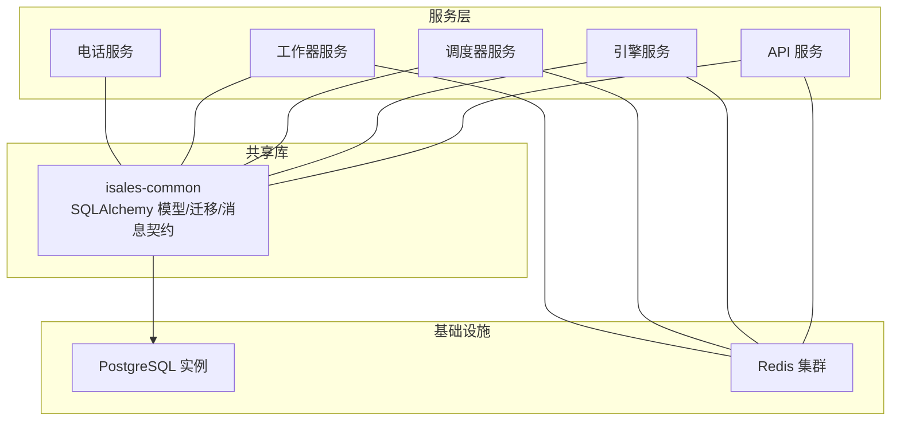
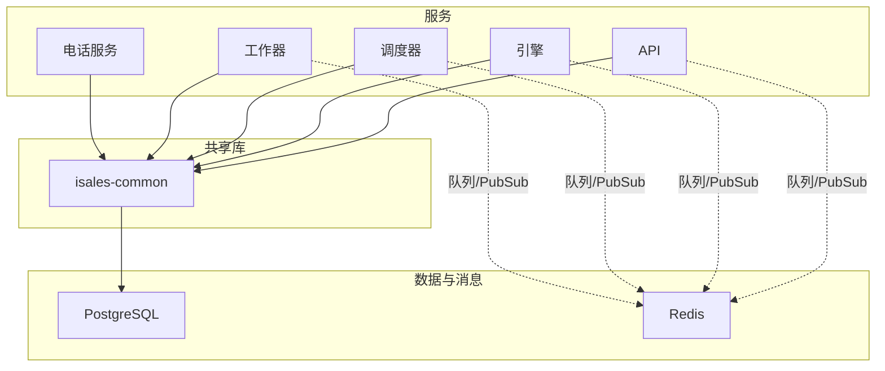
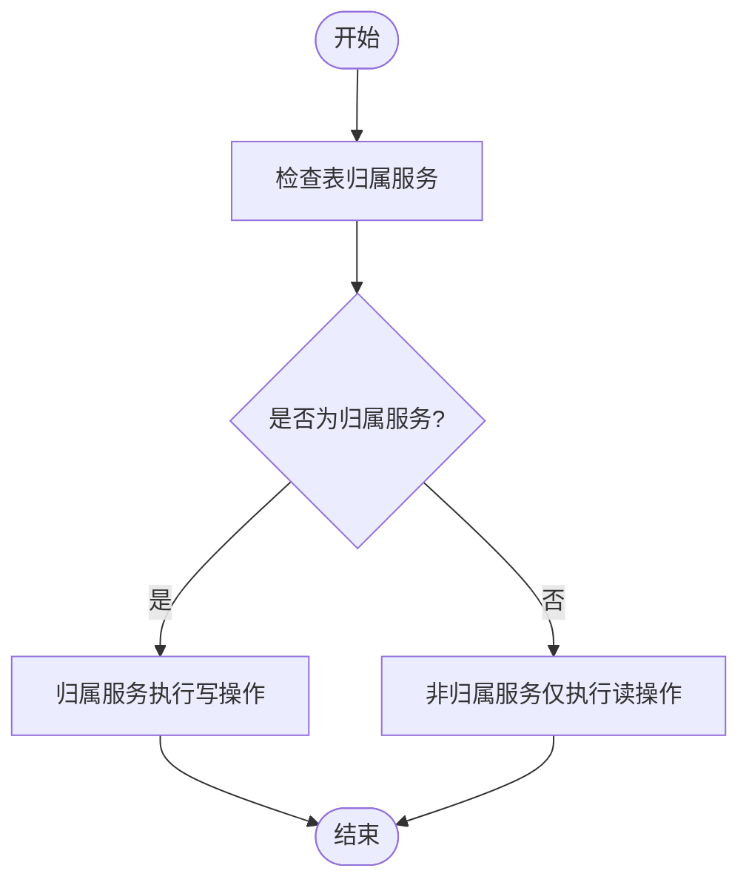
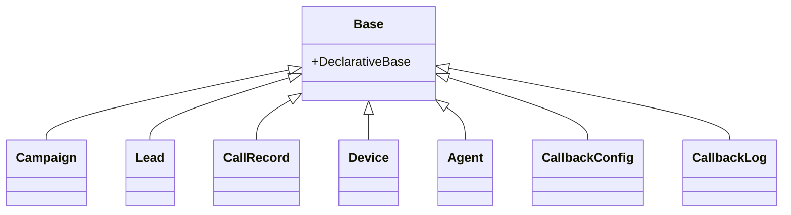
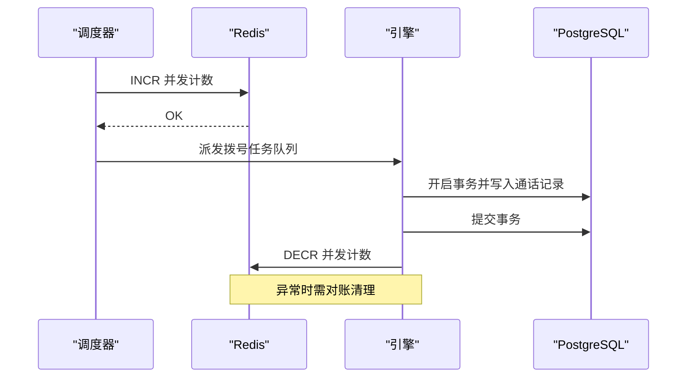
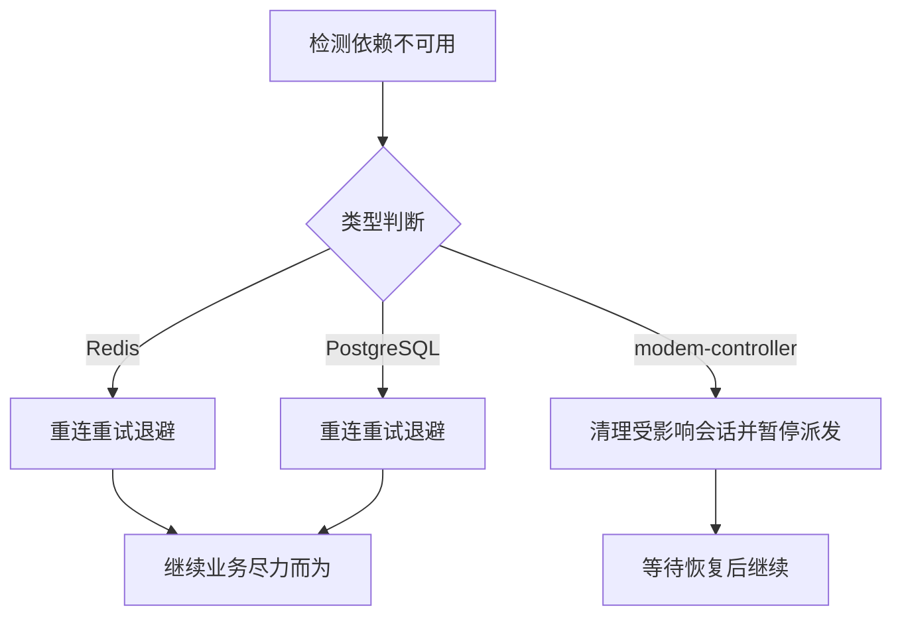
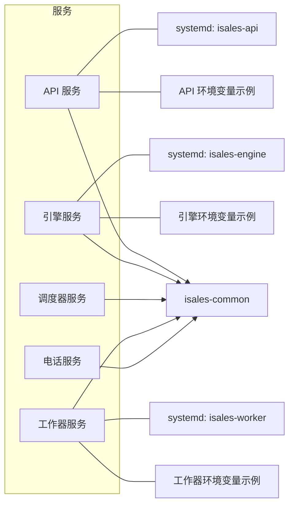

# 数据库通信

<cite>
**本文引用的文件**
- [数据模型规范（主版本）](file://openspec/specs/data-model/spec.md)
- [服务通信规范](file://openspec/specs/service-communication/spec.md)
- [初始化 isales-common 设计](file://openspec/changes/archive/2026-05-01-init-isales-common/design.md)
- [初始化 isales-common 提案](file://openspec/changes/archive/2026-05-01-init-isales-common/proposal.md)
- [数据模型规范（阶段二边界澄清）](file://openspec/changes/archive/2026-05-01-clarify-stage2-boundaries/specs/data-model/spec.md)
- [数据模型规范（凭证表加入）](file://openspec/changes/archive/2026-05-24-impl-provider-credential-db-ssot/specs/data-model/spec.md)
- [API 服务环境变量示例](file://deploy/env/api.env.example)
- [引擎服务环境变量示例](file://deploy/env/engine.env.example)
- [工作器服务环境变量示例](file://deploy/env/worker.env.example)
- [云环境 API 服务示例](file://deploy/cloud/env/api.env)
- [云环境 引擎服务示例](file://deploy/cloud/env/engine.env)
- [云环境 工作器服务示例](file://deploy/cloud/env/worker.env)
- [系统服务单元（API）](file://deploy/cloud/systemd/isales-api.service)
- [系统服务单元（引擎）](file://deploy/cloud/systemd/isales-engine.service)
- [系统服务单元（工作器）](file://deploy/cloud/systemd/isales-worker.service)
</cite>

## 目录
1. [引言](#引言)
2. [项目结构](#项目结构)
3. [核心组件](#核心组件)
4. [架构总览](#架构总览)
5. [详细组件分析](#详细组件分析)
6. [依赖分析](#依赖分析)
7. [性能考虑](#性能考虑)
8. [故障排查指南](#故障排查指南)
9. [结论](#结论)
10. [附录](#附录)

## 引言
本文件聚焦 iSales 系统的数据库通信机制，围绕以下目标展开：
- 说明各服务如何直接访问 PostgreSQL 数据库，并通过 isales-common 模型进行数据操作；
- 解释跨服务读写的数据所有权原则，以及写操作归属服务的确定方式；
- 描述数据库连接管理、事务处理与并发控制机制；
- 说明数据库通信的容错策略与故障恢复机制；
- 提供数据库交互的最佳实践与性能优化建议；
- 说明数据模型的一致性保证与版本管理策略。

## 项目结构
- 数据模型与数据库契约由 OpenSpec 的 data-model 与 service-communication 规范定义；
- isales-common 作为共享库，提供 SQLAlchemy ORM 模型、Pydantic Schema、Provider ABC、Redis 消息体契约与 Alembic 迁移；
- 各服务通过依赖 isales-common，以“直连 PostgreSQL”的方式访问数据库；
- 服务间通信采用 Redis 队列/Pub/Sub，数据库层面保持“单一 PostgreSQL 实例”与“单一迁移来源”。

图表来源
- [服务通信规范: 第23行](file://openspec/specs/service-communication/spec.md#L23)
- [服务通信规范: 第78-86行:78-86](file://openspec/specs/service-communication/spec.md#L78-L86)
- [初始化 isales-common 设计: 第7行](file://openspec/changes/archive/2026-05-01-init-isales-common/design.md#L7)

章节来源
- [服务通信规范: 第1-150行:1-150](file://openspec/specs/service-communication/spec.md#L1-L150)
- [数据模型规范（主版本）: 第1-83行:1-83](file://openspec/specs/data-model/spec.md#L1-L83)
- [初始化 isales-common 设计: 第1-135行:1-135](file://openspec/changes/archive/2026-05-01-init-isales-common/design.md#L1-L135)

## 核心组件
- 数据模型与归属
  - 19 张核心表及 JSONB 字段约束由 data-model 规范定义，明确每张表的“归属服务”，写操作由归属服务承担；
  - 新增/修改模型与迁移由 isales-common 统一管理，其他服务不得自行写模型或迁移。
- 通信与直连
  - 服务间通信通过 Redis 队列/Pub/Sub；数据库访问通过 isales-common 模型直连 PostgreSQL；
  - 跨服务读取允许各服务直读，写操作由归属服务负责。
- 连接与事务
  - 使用 SQLAlchemy 2.x + asyncpg 的异步会话；事务边界由各服务自行管理，common 不提供会话上下文；
  - 单库统一，跨服务事务使用 PG 事务，不引入分布式事务。
- 并发控制
  - 全局并发控制使用 Redis 原子计数器（INCR/DECR）；本地内存计数器不可替代。

章节来源
- [数据模型规范（主版本）: 第52-69行:52-69](file://openspec/specs/data-model/spec.md#L52-L69)
- [数据模型规范（主版本）: 第19-21行:19-21](file://openspec/specs/data-model/spec.md#L19-L21)
- [服务通信规范: 第78-86行:78-86](file://openspec/specs/service-communication/spec.md#L78-L86)
- [服务通信规范: 第45-62行:45-62](file://openspec/specs/service-communication/spec.md#L45-L62)
- [初始化 isales-common 设计: 第7行](file://openspec/changes/archive/2026-05-01-init-isales-common/design.md#L7)
- [初始化 isales-common 设计: 第115行](file://openspec/changes/archive/2026-05-01-init-isales-common/design.md#L115)

## 架构总览
下图展示数据库通信在系统中的位置与交互关系：各服务通过 isales-common 模型直连 PostgreSQL；服务间事件通过 Redis 传递，避免跨服务数据库耦合。

图表来源
- [服务通信规范: 第23行](file://openspec/specs/service-communication/spec.md#L23)
- [服务通信规范: 第78-86行:78-86](file://openspec/specs/service-communication/spec.md#L78-L86)

## 详细组件分析

### 数据所有权与跨服务读写原则
- 表归属决定 schema 演进与 PR 主导权，多个服务可读写但归属仅一个；
- 当关联表生命周期跟随归属 A 而非归属 B（如 campaign_device 跟随 campaign 的启停），归属设为 A；
- 跨服务读：多个服务读取同一表时各自直读；
- 跨服务写：写操作由表的归属服务承担。

图表来源
- [数据模型规范（主版本）: 第19-21行:19-21](file://openspec/specs/data-model/spec.md#L19-L21)
- [数据模型规范（主版本）: 第8-17行:8-17](file://openspec/specs/data-model/spec.md#L8-L17)

章节来源
- [数据模型规范（主版本）: 第8-17行:8-17](file://openspec/specs/data-model/spec.md#L8-L17)
- [数据模型规范（主版本）: 第19-21行:19-21](file://openspec/specs/data-model/spec.md#L19-L21)

### 数据库直连与模型访问
- 各服务通过 isales-common 的 SQLAlchemy 模型直连 PostgreSQL；
- 模型文件按业务域拆分，避免循环依赖，批次加载顺序明确；
- JSONB 字段使用 Pydantic 嵌套模型进行结构约束；
- Provider ABC 与消息契约集中于 isales-common，确保跨服务一致性。

图表来源
- [初始化 isales-common 设计: 第41-52行:41-52](file://openspec/changes/archive/2026-05-01-init-isales-common/design.md#L41-L52)
- [初始化 isales-common 设计: 第63-67行:63-67](file://openspec/changes/archive/2026-05-01-init-isales-common/design.md#L63-L67)

章节来源
- [初始化 isales-common 设计: 第41-52行:41-52](file://openspec/changes/archive/2026-05-01-init-isales-common/design.md#L41-L52)
- [初始化 isales-common 设计: 第63-67行:63-67](file://openspec/changes/archive/2026-05-01-init-isales-common/design.md#L63-L67)

### 事务处理与并发控制
- 事务边界由各服务自行管理，isales-common 不提供会话上下文；
- 全局并发控制使用 Redis 原子计数器（INCR/DECR），避免本地内存计数器；
- 引擎通话结束应立即 DECR，异常崩溃需有对账清理机制。

图表来源
- [服务通信规范: 第45-62行:45-62](file://openspec/specs/service-communication/spec.md#L45-L62)
- [服务通信规范: 第96-99行:96-99](file://openspec/specs/service-communication/spec.md#L96-L99)

章节来源
- [服务通信规范: 第45-62行:45-62](file://openspec/specs/service-communication/spec.md#L45-L62)
- [服务通信规范: 第96-99行:96-99](file://openspec/specs/service-communication/spec.md#L96-L99)

### 容错策略与故障恢复
- Redis 短暂不可用：各服务重连重试（带退避）；引擎中断期间不接受新拨号但可完成当前通话；
- PostgreSQL 短暂不可用：各服务重连重试；通话中引擎将状态缓存至 Redis（v2 优化），v1 按异常处理；
- modem-controller 不可用：优雅清理受影响的 call_session，调度器可暂停派发直至恢复。

图表来源
- [服务通信规范: 第87-105行:87-105](file://openspec/specs/service-communication/spec.md#L87-L105)

章节来源
- [服务通信规范: 第87-105行:87-105](file://openspec/specs/service-communication/spec.md#L87-L105)

### 数据一致性与版本管理
- 单一 PostgreSQL 实例，所有表位于同一 schema；
- 所有 SQLAlchemy 模型与 Alembic 迁移由 isales-common 统一管理，其他服务不得自行写模型或迁移；
- 新增/修改模型与迁移需通过 isales-common 的迁移来源，确保演进一致性；
- JSONB 字段需附 schema 描述，Pydantic 嵌套模型作为约束事实来源。

章节来源
- [数据模型规范（主版本）: 第52-59行:52-59](file://openspec/specs/data-model/spec.md#L52-L59)
- [数据模型规范（主版本）: 第8-17行:8-17](file://openspec/specs/data-model/spec.md#L8-L17)
- [数据模型规范（主版本）: 第61-74行:61-74](file://openspec/specs/data-model/spec.md#L61-L74)
- [初始化 isales-common 设计: 第92-96行:92-96](file://openspec/changes/archive/2026-05-01-init-isales-common/design.md#L92-L96)

## 依赖分析
- 服务对 isales-common 的依赖：所有服务均通过 pip 安装依赖（本地开发通过相对路径安装），确保模型与迁移一致；
- 部署与环境：各服务提供环境变量示例文件，包含数据库连接字符串、Redis 地址等关键配置；
- systemd 服务单元：云环境提供各服务 systemd 单元文件，便于进程管理与健康检查。

图表来源
- [初始化 isales-common 设计: 第35-39行:35-39](file://openspec/changes/archive/2026-05-01-init-isales-common/design.md#L35-L39)
- [API 服务环境变量示例](file://deploy/env/api.env.example)
- [引擎服务环境变量示例](file://deploy/env/engine.env.example)
- [工作器服务环境变量示例](file://deploy/env/worker.env.example)
- [系统服务单元（API）](file://deploy/cloud/systemd/isales-api.service)
- [系统服务单元（引擎）](file://deploy/cloud/systemd/isales-engine.service)
- [系统服务单元（工作器）](file://deploy/cloud/systemd/isales-worker.service)

章节来源
- [初始化 isales-common 设计: 第35-39行:35-39](file://openspec/changes/archive/2026-05-01-init-isales-common/design.md#L35-L39)
- [API 服务环境变量示例](file://deploy/env/api.env.example)
- [引擎服务环境变量示例](file://deploy/env/engine.env.example)
- [工作器服务环境变量示例](file://deploy/env/worker.env.example)
- [系统服务单元（API）](file://deploy/cloud/systemd/isales-api.service)
- [系统服务单元（引擎）](file://deploy/cloud/systemd/isales-engine.service)
- [系统服务单元（工作器）](file://deploy/cloud/systemd/isales-worker.service)

## 性能考虑
- 连接与会话
  - 使用 SQLAlchemy 2.x + asyncpg 的异步会话，减少阻塞；
  - 会话工厂与连接池参数需结合服务负载与 DB 资源合理配置。
- 事务与批量
  - 尽量缩短事务时间，批量写入时注意 PostgreSQL 的 WAL 与索引压力；
  - 对高频写入的表，评估分区或物化视图策略（需遵循 data-model 规范演进流程）。
- 并发与限流
  - 严格使用 Redis 原子计数器控制全局并发，避免 DB 过载；
  - 对热点表的读写分离与缓存策略需谨慎评估，确保一致性。
- JSONB 与模式
  - JSONB 字段需附 schema 文档，避免无约束的结构漂移；
  - 复杂 JSONB 查询建议配合 GIN 索引与应用层校验，降低 DB 压力。

## 故障排查指南
- 连接失败
  - 检查数据库连接字符串与凭据（参考各服务环境变量示例）；
  - 确认 isales-common 的 Alembic 迁移已成功升级至最新版本。
- 事务异常
  - 确认各服务正确开启/回滚/提交事务，避免长时间持有锁；
  - 对死锁与超时错误，启用自动重试与指数退避。
- 并发溢出
  - 检查 Redis 并发计数器是否正确 INCR/DECR；
  - 异常退出时需有对账清理，防止计数器泄漏。
- 模型漂移
  - 任何模型/迁移变更需通过 isales-common 的迁移来源；
  - CI 中执行迁移升级/降级往返，确保 schema 一致性。

章节来源
- [服务通信规范: 第87-105行:87-105](file://openspec/specs/service-communication/spec.md#L87-L105)
- [初始化 isales-common 设计: 第115行](file://openspec/changes/archive/2026-05-01-init-isales-common/design.md#L115)
- [初始化 isales-common 设计: 第98-104行:98-104](file://openspec/changes/archive/2026-05-01-init-isales-common/design.md#L98-L104)

## 结论
iSales 系统通过 isales-common 统一数据模型与迁移，各服务以“直连 PostgreSQL + Redis 事件”的方式实现高内聚、低耦合的数据库通信。数据所有权清晰、迁移来源单一、并发控制可靠、容错策略完备，为系统的可维护性与扩展性提供了坚实基础。后续版本可在此基础上进一步优化性能与可靠性。

## 附录
- 数据模型表清单（归属服务与关键字段）
  - campaign、lead、call_record、call_summary、handoff_task、role_config、prompt_version、pipeline_trace、agent、device、sim_card、device_sim_binding、campaign_device、callback_config、callback_log、holiday、voice_model、filler_set、filler_phrase、provider_credential
- 服务间数据库直连与读写边界
  - 跨服务读：允许各服务直读；
  - 跨服务写：由表归属服务承担；
  - 所有服务均通过 isales-common 模型直连 PostgreSQL。

章节来源
- [数据模型规范（主版本）: 第28-51行:28-51](file://openspec/specs/data-model/spec.md#L28-L51)
- [服务通信规范: 第82-86行:82-86](file://openspec/specs/service-communication/spec.md#L82-L86)