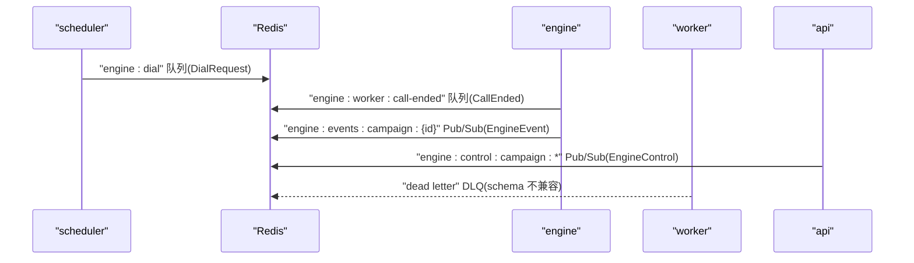
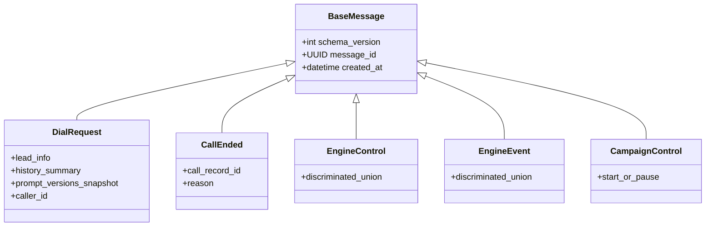
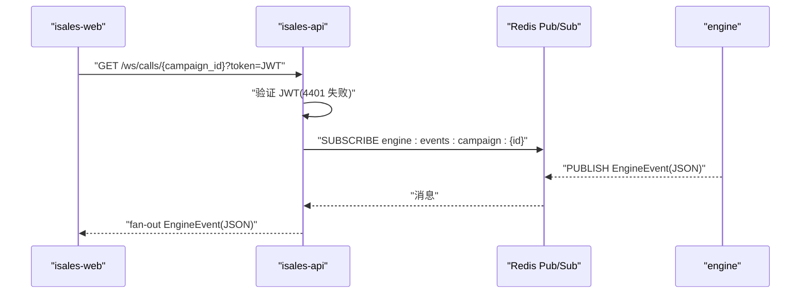
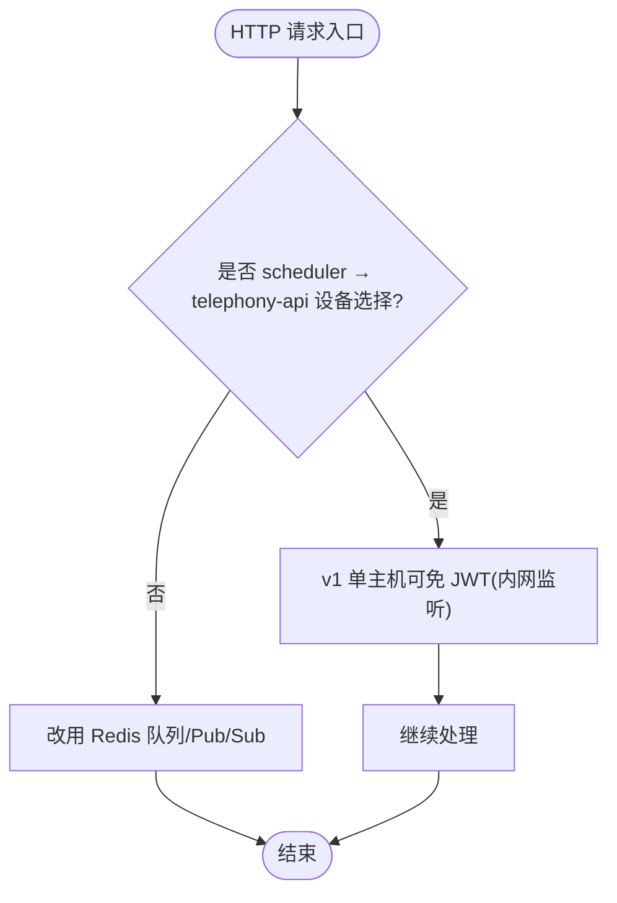
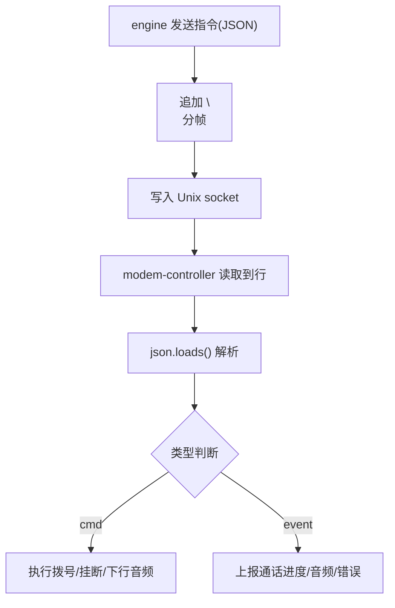
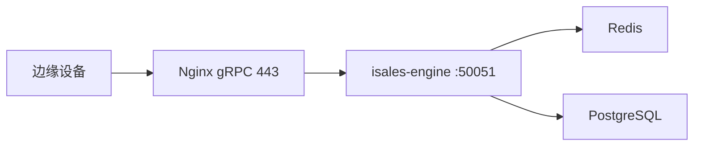
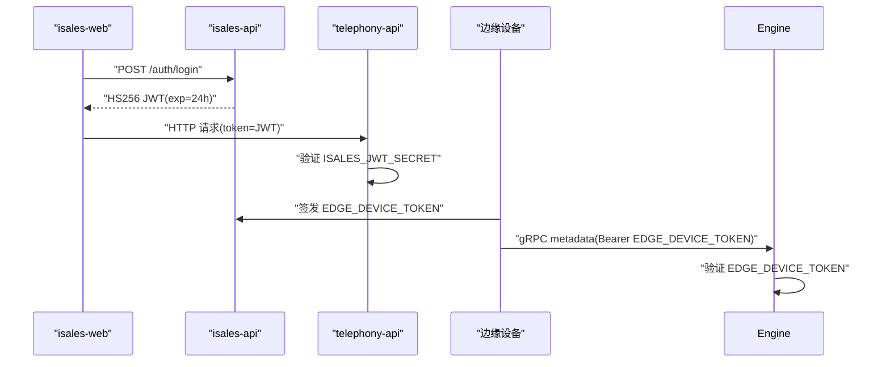
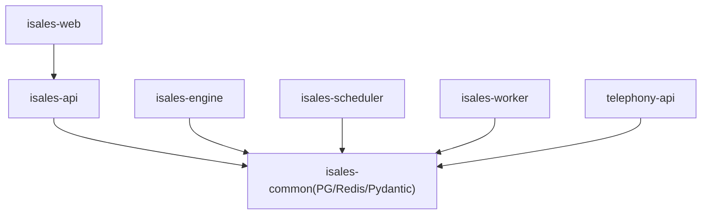

# 服务通信协议

<cite>
**本文引用的文件**
- [service-communication/spec.md](file://openspec/specs/service-communication/spec.md)
- [message-contract/spec.md](file://openspec/specs/message-contract/spec.md)
- [architecture/spec.md](file://openspec/specs/architecture/spec.md)
- [deployment-topology/spec.md](file://openspec/specs/deployment-topology/spec.md)
- [device-hardware/spec.md](file://openspec/specs/device-hardware/spec.md)
- [isales.conf](file://deploy/cloud/nginx/isales.conf)
- [prometheus.yml.example](file://deploy/monitoring/prometheus.yml.example)
- [api.env](file://deploy/cloud/env/api.env)
- [engine.env](file://deploy/cloud/env/engine.env)
- [telephony-api.env.example](file://deploy/env/telephony-api.env.example)
- [api.env.example](file://deploy/env/api.env.example)
- [SECRETS.md.example](file://deploy/cloud/env/SECRETS.md.example)
- [_lib.sh](file://deploy/common/_lib.sh)
- [RUNBOOK.md](file://deploy/RUNBOOK.md)
- [STATE.md](file://deploy/cloud/STATE.md)
- [tasks.md（impl-api）](file://openspec/changes/archive/2026-05-06-impl-api/tasks.md)
- [design.md（impl-api）](file://openspec/changes/archive/2026-05-06-impl-api/design.md)
- [spec.md（arch-cloud-edge-split/service-communication）](file://openspec/changes/arch-cloud-edge-split/specs/service-communication/spec.md)
- [spec.md（arch-cloud-edge-split/architecture）](file://openspec/changes/arch-cloud-edge-split/specs/architecture/spec.md)
- [tasks.md（arch-cloud-edge-split）](file://openspec/changes/arch-cloud-edge-split/tasks.md)
</cite>

## 目录
1. [引言](#引言)
2. [项目结构](#项目结构)
3. [核心组件](#核心组件)
4. [架构总览](#架构总览)
5. [详细组件分析](#详细组件分析)
6. [依赖分析](#依赖分析)
7. [性能考量](#性能考量)
8. [故障排查指南](#故障排查指南)
9. [结论](#结论)
10. [附录](#附录)

## 引言
本文件系统化阐述 iSales 系统的服务间通信协议，覆盖 Redis 队列/发布订阅、WebSocket、HTTP API、Unix socket 本地 IPC 等多种方式，明确消息格式与数据契约、服务发现与负载均衡策略、JWT 鉴权体系（以 isales-api 为唯一签发方）、安全与性能优化要点，并提供通信示例与调试方法。

## 项目结构
- 通信规范与契约集中在 openspec/specs 与 changes 中，涵盖服务通信矩阵、消息契约、架构与部署拓扑等。
- 部署与运维模板位于 deploy 目录，包含 Nginx 反向代理、Prometheus 监控、环境变量与密钥管理等。
- 设备与硬件 IPC 协议在 device-hardware 规范中定义，明确 Unix socket 帧格式与消息结构。

```mermaid
graph TB
subgraph "前端"
WEB["isales-web (Vue 3 SPA)"]
end
subgraph "云-边拓扑"
NGINX["Nginx 反向代理"]
API["isales-api (管理 + WS 代理)"]
ENGINE["isales-engine (实时通话引擎)"]
SCHED["isales-scheduler (线索调度)"]
WORKER["isales-worker (异步后处理)"]
TELE_API["telephony-api (HTTP)"]
MODEM["modem-controller (守护)"]
DB["PostgreSQL"]
REDIS["Redis"]
end
WEB --> NGINX
NGINX --> API
API --> REDIS
API --> DB
SCHED --> REDIS
SCHED --> TELE_API
ENGINE --> REDIS
ENGINE --> MODEM
WORKER --> REDIS
MODEM --> DB
MODEM --> "/dev/ttyUSB*"
```

图表来源
- [architecture/spec.md:130-168](file://openspec/specs/architecture/spec.md#L130-L168)
- [deployment-topology/spec.md:317-395](file://openspec/specs/deployment-topology/spec.md#L317-L395)

章节来源
- [architecture/spec.md:1-168](file://openspec/specs/architecture/spec.md#L1-L168)
- [deployment-topology/spec.md:1-414](file://openspec/specs/deployment-topology/spec.md#L1-L414)

## 核心组件
- 通信通道矩阵：定义 7 个服务之间使用 Redis 队列、Redis Pub/Sub、HTTP、Unix socket 的具体场景与边界。
- 消息契约：统一使用 isales-common 的 Pydantic 模型，确保跨服务消息体一致、可演进、可观测。
- 事件与控制通道：engine → api 的 Pub/Sub 事件推送，api → engine 的 Pub/Sub 控制通道，api → scheduler 的队列控制。
- 本地 IPC：engine ↔ modem-controller 使用 Unix socket，采用 newline-delimited JSON 帧格式。
- HTTP 服务：telephony-api 仅在 v1 单主机下可免 JWT（仅内网监听），其余内部调用遵循统一 JWT 策略。
- WebSocket 代理：isales-api 提供 /ws/calls/{campaign_id}，订阅 Redis Pub/Sub 并 fan-out EngineEvent。

章节来源
- [service-communication/spec.md:11-24](file://openspec/specs/service-communication/spec.md#L11-L24)
- [message-contract/spec.md:6-27](file://openspec/specs/message-contract/spec.md#L6-L27)
- [device-hardware/spec.md:110-140](file://openspec/specs/device-hardware/spec.md#L110-L140)
- [architecture/spec.md:96-129](file://openspec/specs/architecture/spec.md#L96-L129)

## 架构总览
下图展示 v1 单主机部署下的服务通信路径与鉴权边界，突出 Redis 作为队列/事件总线、WebSocket 代理、HTTP 反向代理与本地 IPC 的角色。

```mermaid
graph TB
WEB["isales-web"] --> NGINX["Nginx 反代 /api,/ws"]
NGINX --> API["isales-api"]
API --> REDIS["Redis"]
API --> DB["PostgreSQL"]
SCHED["scheduler"] --> REDIS
ENGINE["engine"] --> REDIS
WORKER["worker"] --> REDIS
API --> SCHED
API --> ENGINE
API --> TELE_API["telephony-api(HTTP)"]
ENGINE --> MODEM["modem-controller(Unix socket)"]
MODEM --> DB
MODEM --> "/dev/ttyUSB*"
subgraph "云-边 gRPC"
NGINX --> GRPC["gRPC 50051"]
GRPC --> ENGINE
end
```

图表来源
- [deployment-topology/spec.md:317-395](file://openspec/specs/deployment-topology/spec.md#L317-L395)
- [isales.conf:1-102](file://deploy/cloud/nginx/isales.conf#L1-L102)
- [architecture/spec.md:130-168](file://openspec/specs/architecture/spec.md#L130-L168)

## 详细组件分析

### Redis 队列与 Pub/Sub 通道
- 队列通道用于“必须送达、可异步处理”的工作派发，如 scheduler → engine 的拨号请求、engine → worker 的通话结束事件。
- Pub/Sub 通道用于“实时、可丢失”的事件广播，如 api ↔ engine 的控制与事件推送。
- 全局并发控制通过 Redis 原子计数器实现，避免泄漏与风暴。



图表来源
- [service-communication/spec.md:31-47](file://openspec/specs/service-communication/spec.md#L31-L47)
- [service-communication/spec.md:107-136](file://openspec/specs/service-communication/spec.md#L107-L136)
- [tasks.md（impl-api）:67-101](file://openspec/changes/archive/2026-05-06-impl-api/tasks.md#L67-L101)

章节来源
- [service-communication/spec.md:11-24](file://openspec/specs/service-communication/spec.md#L11-L24)
- [service-communication/spec.md:31-47](file://openspec/specs/service-communication/spec.md#L31-L47)
- [service-communication/spec.md:107-136](file://openspec/specs/service-communication/spec.md#L107-L136)

### 消息格式与数据契约
- 所有跨服务消息体在 isales-common 的 Pydantic 模型中集中定义，Producer 使用 .model_dump_json() 序列化，Consumer 使用 model_validate_json() 反序列化。
- 消息基类包含 schema_version、message_id、created_at，支持非破坏性与破坏性演进。
- v1 必备消息类：DialRequest、CallEnded、EngineControl、EngineEvent、CampaignControl。



图表来源
- [message-contract/spec.md:25-37](file://openspec/specs/message-contract/spec.md#L25-L37)
- [message-contract/spec.md:43-51](file://openspec/specs/message-contract/spec.md#L43-L51)

章节来源
- [message-contract/spec.md:6-27](file://openspec/specs/message-contract/spec.md#L6-L27)
- [message-contract/spec.md:25-37](file://openspec/specs/message-contract/spec.md#L25-L37)
- [message-contract/spec.md:43-51](file://openspec/specs/message-contract/spec.md#L43-L51)

### WebSocket 代理与前端订阅
- isales-api 提供 /ws/calls/{campaign_id}，在 accept 前验证 JWT，验证失败立即关闭并返回 4401。
- 服务端共享一个 Redis Pub/Sub 订阅，将 EngineEvent fan-out 给所有该 campaign 的连接。
- 前端使用 TypeScript discriminated union 解析 EngineEvent，未知 type 仅告警跳过，不中断连接。



图表来源
- [service-communication/spec.md:107-136](file://openspec/specs/service-communication/spec.md#L107-L136)
- [design.md（impl-api）:41-53](file://openspec/changes/archive/2026-05-06-impl-api/design.md#L41-L53)

章节来源
- [service-communication/spec.md:107-136](file://openspec/specs/service-communication/spec.md#L107-L136)
- [design.md（impl-api）:41-53](file://openspec/changes/archive/2026-05-06-impl-api/design.md#L41-L53)

### HTTP API 与服务间调用
- v1 仅 scheduler → telephony-api 的设备选择使用同步 HTTP，其它通信均走 Redis。
- telephony-api 在 v1 单主机下可免 JWT（仅监听 loopback/内网），多主机扩展需引入服务账号 JWT 或 mTLS。
- isales-web 建议直连 telephony-api 获取设备资源，避免经 isales-api 转发。



图表来源
- [service-communication/spec.md:64-76](file://openspec/specs/service-communication/spec.md#L64-L76)
- [architecture/spec.md:96-129](file://openspec/specs/architecture/spec.md#L96-L129)

章节来源
- [service-communication/spec.md:64-76](file://openspec/specs/service-communication/spec.md#L64-L76)
- [architecture/spec.md:96-129](file://openspec/specs/architecture/spec.md#L96-L129)

### Unix socket 本地 IPC（engine ↔ modem-controller）
- 本地单主机部署，engine 与 modem-controller 通过 Unix socket 通信。
- 帧格式为 newline-delimited JSON，单条消息 ≤ 1 MiB，双向独立异步流。
- 指令与事件严格区分，事件帧仅暴露 session_id，不暴露内部 UUID。



图表来源
- [device-hardware/spec.md:3-27](file://openspec/specs/device-hardware/spec.md#L3-L27)
- [device-hardware/spec.md:110-140](file://openspec/specs/device-hardware/spec.md#L110-L140)

章节来源
- [device-hardware/spec.md:3-27](file://openspec/specs/device-hardware/spec.md#L3-L27)
- [device-hardware/spec.md:110-140](file://openspec/specs/device-hardware/spec.md#L110-L140)

### 服务发现与负载均衡策略
- v1 单实例限制：isales-api 单实例运行，不假设跨实例广播；多实例扩展需 OpenSpec 变更提案，候选方案为 sticky session 或 Redis Streams + 跨实例转发。
- 云-边 gRPC：Nginx 作为 TLS 终结与反向代理，转发到 isales-engine 的 50051 端口；边缘设备通过 Bearer token 鉴别身份。



图表来源
- [isales.conf:1-102](file://deploy/cloud/nginx/isales.conf#L1-L102)
- [architecture/spec.md:96-102](file://openspec/specs/architecture/spec.md#L96-L102)

章节来源
- [service-communication/spec.md:127-131](file://openspec/specs/service-communication/spec.md#L127-L131)
- [isales.conf:1-102](file://deploy/cloud/nginx/isales.conf#L1-L102)

### JWT 鉴权体系（唯一签发方）
- isales-api 为唯一签发方，telephony-api 仅验证；HMAC 密钥通过环境变量 ISALES_JWT_SECRET 注入。
- 前端登录由 isales-api 签发 HS256 JWT，过期后需重新登录；WebSocket 连接在 accept 前验证 JWT。
- 云-边 gRPC 使用独立 EDGE_DEVICE_TOKEN（与前端 JWT 来源/用途隔离），由 isales-api 签发并验证。



图表来源
- [architecture/spec.md:96-129](file://openspec/specs/architecture/spec.md#L96-L129)
- [design.md（impl-api）:30-45](file://openspec/changes/archive/2026-05-06-impl-api/design.md#L30-L45)
- [tasks.md（arch-cloud-edge-split）:98-101](file://openspec/changes/arch-cloud-edge-split/tasks.md#L98-L101)

章节来源
- [architecture/spec.md:96-129](file://openspec/specs/architecture/spec.md#L96-L129)
- [design.md（impl-api）:30-45](file://openspec/changes/archive/2026-05-06-impl-api/design.md#L30-L45)
- [tasks.md（arch-cloud-edge-split）:98-101](file://openspec/changes/arch-cloud-edge-split/tasks.md#L98-L101)

## 依赖分析
- 服务间依赖：所有服务直接访问 PostgreSQL（isales-common 模型）与 Redis（队列/缓存/计数器）。
- 共享库：isales-common 作为 6 个服务的共享库，提供模型与工具，不包含特定服务业务逻辑。
- 部署契约：集中化环境变量，跨服务一致性约束（数据库 URL、Redis URL、JWT 密钥）。



图表来源
- [architecture/spec.md:73-86](file://openspec/specs/architecture/spec.md#L73-L86)
- [deployment-topology/spec.md:40-61](file://openspec/specs/deployment-topology/spec.md#L40-L61)

章节来源
- [architecture/spec.md:73-86](file://openspec/specs/architecture/spec.md#L73-L86)
- [deployment-topology/spec.md:40-61](file://openspec/specs/deployment-topology/spec.md#L40-L61)

## 性能考量
- 序列化：v1 建议统一使用 JSON（便于调试），后续可按需优化。
- 队列深度与并发：通过 Redis 队列与原子计数器控制并发，避免风暴与泄漏。
- 监控：Prometheus 模板提供最小告警集（拨号队列积压、设备标记比例、回调失败率、PG 连接压力）。
- WebSocket fan-out：共享 Redis 订阅，避免每个 WS 连接独立订阅导致 Redis 连接膨胀。

章节来源
- [service-communication/spec.md:147-150](file://openspec/specs/service-communication/spec.md#L147-L150)
- [deployment-topology/spec.md:95-113](file://openspec/specs/deployment-topology/spec.md#L95-L113)
- [service-communication/spec.md:117-121](file://openspec/specs/service-communication/spec.md#L117-L121)

## 故障排查指南
- JWT 密钥不一致：核对 api/engine/telephony-api 的 ISALES_JWT_SECRET 是否一致，不一致需重新部署并重启服务。
- WebSocket 鉴权失败：确认 token 参数与 HS256 签发一致，4401 表示鉴权失败。
- Redis 不可用：各服务应具备重连与退避策略；engine 中断重连期间不应接受新拨号。
- DB 不可用：在 v1 下按异常通话处理；DB 不可用时 engine 应将状态缓存至 Redis（v2 优化）。
- modem-controller 不可用：优雅清理受影响的 call_session，scheduler 可暂停派发直至恢复。
- gRPC/反代问题：检查 Nginx 配置与证书、超时设置，确认 engine 监听与健康状态。

章节来源
- [RUNBOOK.md:176-176](file://deploy/RUNBOOK.md#L176-L176)
- [service-communication/spec.md:87-105](file://openspec/specs/service-communication/spec.md#L87-L105)
- [deployment-topology/spec.md:317-395](file://openspec/specs/deployment-topology/spec.md#L317-L395)
- [STATE.md:208-208](file://deploy/cloud/STATE.md#L208-L208)

## 结论
iSales v1 采用“Redis 队列/Pub/Sub + WebSocket + HTTP + Unix socket”混合通信模式，结合统一的消息契约与 JWT 鉴权体系，确保跨服务一致性、可观测性与安全性。v2 将引入多实例扩展与更细粒度的监控与优化策略。

## 附录

### 环境变量与密钥管理
- 共享密钥：ISALES_JWT_SECRET（isales-api 与 telephony-api 共用）
- 边缘设备令牌：ISALES_EDGE_DEVICE_TOKEN（isales-api 签发，独立于前端 JWT）

章节来源
- [api.env:1-20](file://deploy/cloud/env/api.env#L1-L20)
- [engine.env:1-60](file://deploy/cloud/env/engine.env#L1-L60)
- [telephony-api.env.example:1-20](file://deploy/env/telephony-api.env.example#L1-L20)
- [api.env.example:1-15](file://deploy/env/api.env.example#L1-L15)
- [SECRETS.md.example:1-40](file://deploy/cloud/env/SECRETS.md.example#L1-L40)
- [_lib.sh:170-180](file://deploy/common/_lib.sh#L170-L180)

### 监控与告警
- Prometheus 抓取目标：isales-api、isales-engine、isales-scheduler、isales-worker、isales-telephony-api、node_exporter、postgres_exporter。
- 最小告警集：engine:dial 队列积压、设备标记比例骤升、回调失败率、PG 连接压力。

章节来源
- [prometheus.yml.example:1-62](file://deploy/monitoring/prometheus.yml.example#L1-L62)
- [deployment-topology/spec.md:95-113](file://openspec/specs/deployment-topology/spec.md#L95-L113)