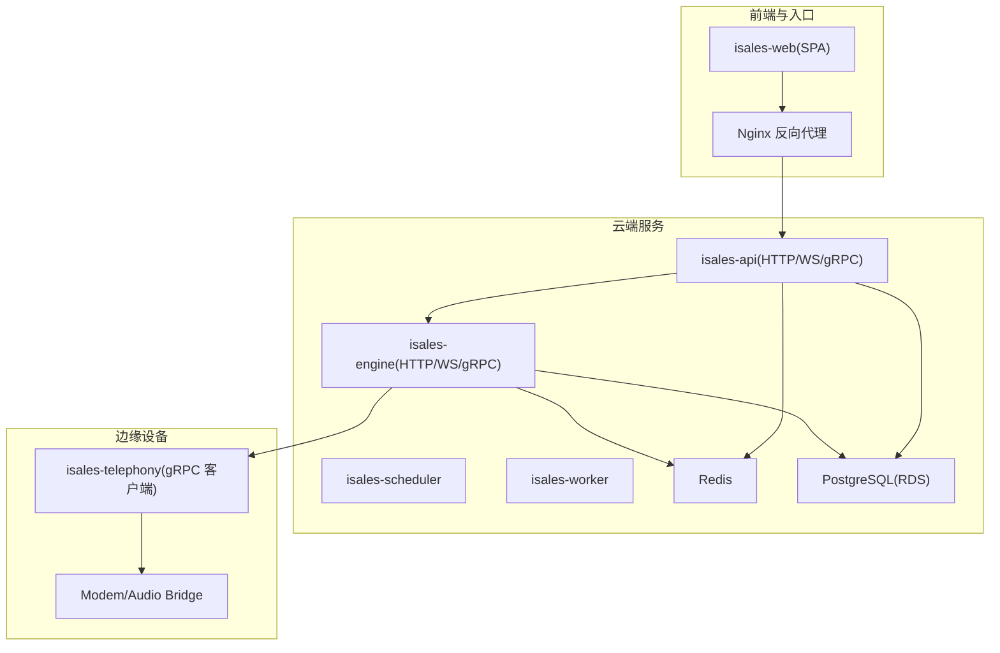
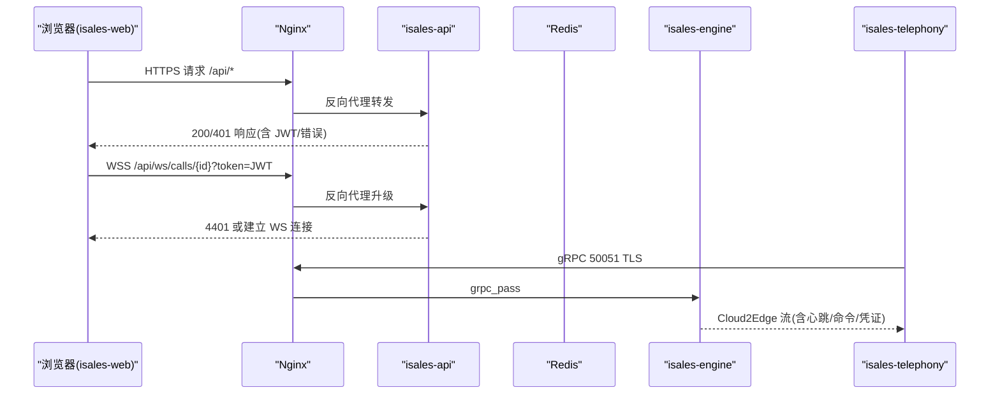
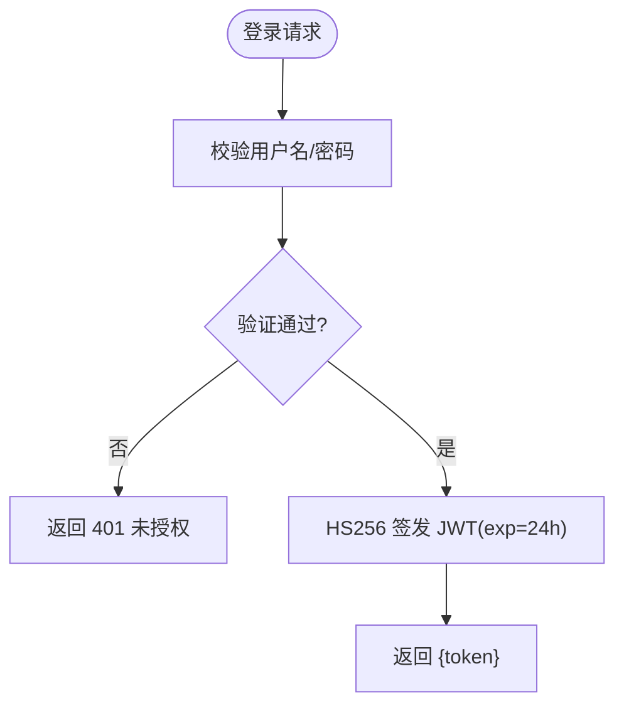
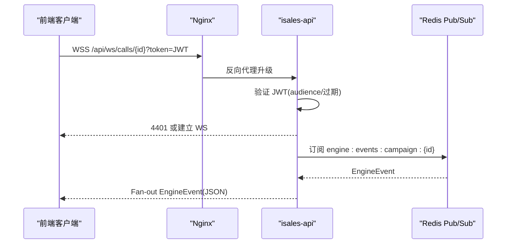
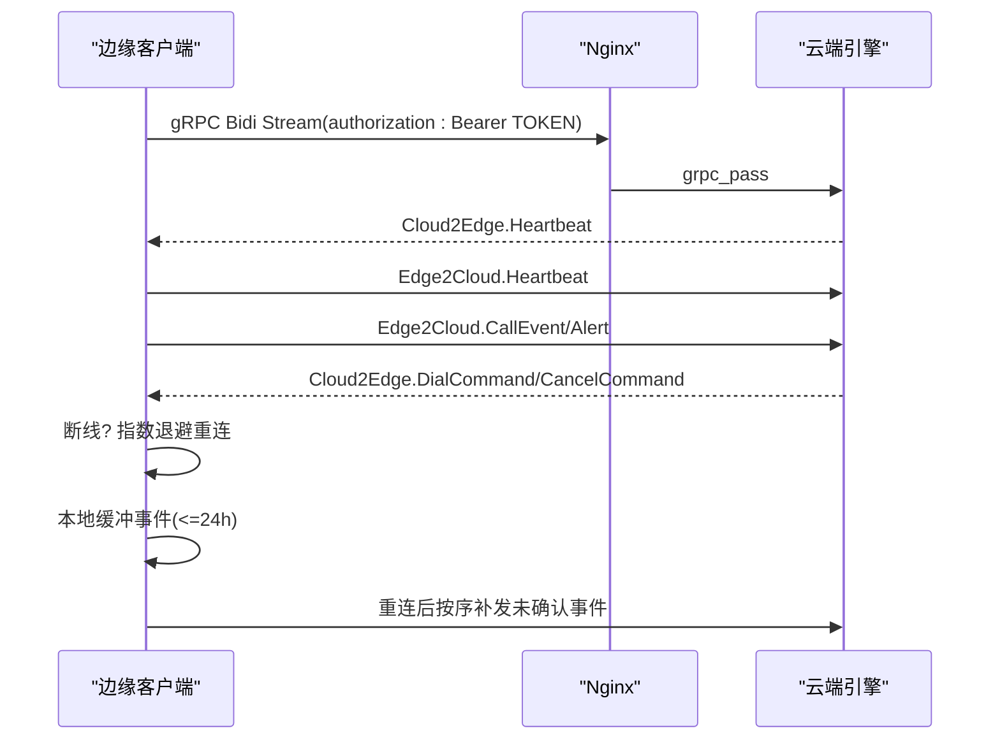
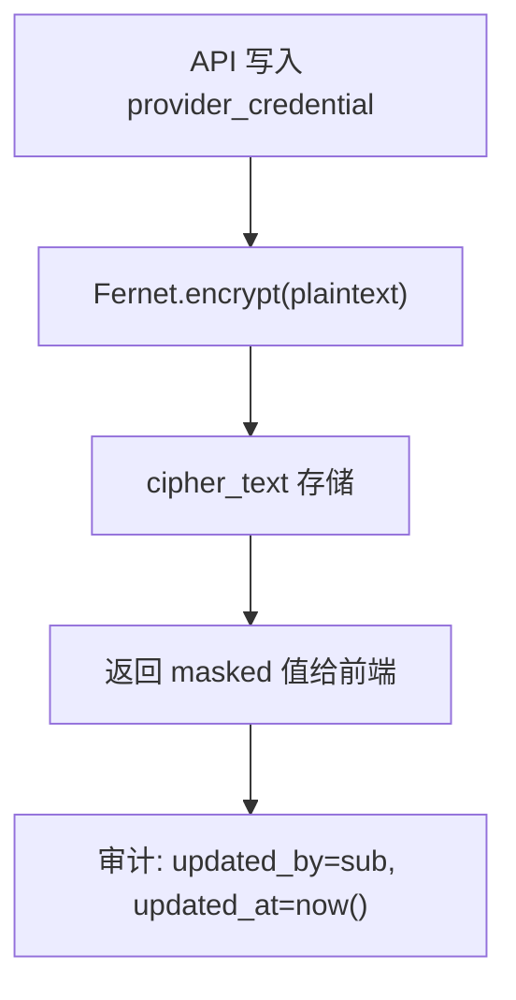
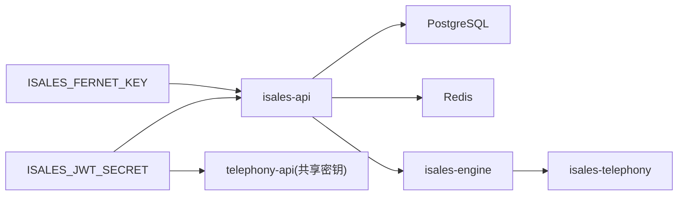

# 认证与安全机制

<cite>
**本文引用的文件**
- [api.env.example](file://deploy/cloud/env/api.env.example)
- [api.env](file://deploy/cloud/env/api.env)
- [SECRETS.md.example](file://deploy/cloud/env/SECRETS.md.example)
- [isales.conf](file://deploy/cloud/nginx/isales.conf)
- [设计文档（实现API）](file://openspec/changes/archive/2026-05-06-impl-api/design.md)
- [服务通信规范（云-边拆分）](file://openspec/changes/arch-cloud-edge-split/specs/service-communication/spec.md)
- [提供者凭据规范](file://openspec/specs/provider-credential/spec.md)
- [云运行手册](file://deploy/RUNBOOK-cloud.md)
- [边缘运行手册](file://deploy/RUNBOOK-edge.md)
- [监控说明](file://deploy/monitoring/README.md)
</cite>

## 目录
1. [简介](#简介)
2. [项目结构](#项目结构)
3. [核心组件](#核心组件)
4. [架构总览](#架构总览)
5. [详细组件分析](#详细组件分析)
6. [依赖关系分析](#依赖关系分析)
7. [性能考量](#性能考量)
8. [故障排查指南](#故障排查指南)
9. [结论](#结论)
10. [附录](#附录)

## 简介
本文件面向 iSales 系统的认证与安全机制，聚焦以下主题：
- JWT 鉴权体系的设计与实现，强调 isales-api 作为唯一签发方的角色
- WebSocket 连接的 JWT 验证流程与错误处理
- 服务间通信的安全考虑，包括消息加密、身份验证与授权
- 通信故障的容错策略与安全防护措施
- 安全配置示例与最佳实践
- 安全审计与监控建议

## 项目结构
围绕认证与安全的关键文件分布如下：
- 环境与密钥
  - 云端 API 环境变量示例与实际配置
  - 密钥轮换与灾难恢复说明
- 网关与传输层
  - Nginx 配置：HTTPS、WebSocket、gRPC 云-边双向流的 TLS 终止与转发
- 规范与设计
  - API 实现的 JWT 与 WebSocket 鉴权决策
  - 云-边 gRPC 鉴权与心跳、断线重连、缓冲区策略
  - 提供者凭据的对称加密与审计追踪
- 运行手册
  - 云-边 gRPC 连接验收与边缘设备令牌签发流程
- 监控
  - Prometheus/Grafana 监控模板与最小告警集

**图表来源**
- [isales.conf:1-103](file://deploy/cloud/nginx/isales.conf#L1-L103)
- [服务通信规范（云-边拆分）:1-250](file://openspec/changes/arch-cloud-edge-split/specs/service-communication/spec.md#L1-L250)

**章节来源**
- [api.env.example:1-24](file://deploy/cloud/env/api.env.example#L1-L24)
- [api.env:1-18](file://deploy/cloud/env/api.env#L1-L18)
- [SECRETS.md.example:1-86](file://deploy/cloud/env/SECRETS.md.example#L1-L86)
- [isales.conf:1-103](file://deploy/cloud/nginx/isales.conf#L1-L103)

## 核心组件
- JWT 鉴权体系
  - isales-api 作为唯一签发方，使用 HS256 签发前端用户会话令牌，有效期 24 小时，无刷新端点
  - 云端与边缘设备共享同一 JWT 密钥（ISALES_JWT_SECRET），但 audience 隔离
- WebSocket 鉴权
  - 客户端通过查询参数携带 JWT 连接 /ws/calls/{campaign_id}?token=<JWT>
  - 服务端在握手阶段验证 JWT，失败立即关闭并返回 4401
- 云-边 gRPC 鉴权
  - 边缘客户端在 gRPC 元数据中携带 authorization: Bearer <EDGE_DEVICE_TOKEN>
  - 云端验证失败返回 UNAUTHENTICATED，边缘自动指数退避重连
- 消息加密与凭据保护
  - 使用 Fernet 对称加密（ISALES_FERNET_KEY）保护 provider_credential 等敏感字段
  - API 暴露受 JWT 保护的凭据 CRUD 端点，返回掩码值，写入触发审计
- 传输层安全
  - Nginx 终止 TLS，HTTPS/HTTP/2，WebSocket 与 gRPC 分离监听端口
  - gRPC 云-边双向流仅在内网/受信网络使用，边缘令牌静态分发或未来多租户动态签发

**章节来源**
- [设计文档（实现API）:32-46](file://openspec/changes/archive/2026-05-06-impl-api/design.md#L32-L46)
- [服务通信规范（云-边拆分）:147-150](file://openspec/changes/arch-cloud-edge-split/specs/service-communication/spec.md#L147-L150)
- [提供者凭据规范:51-59](file://openspec/specs/provider-credential/spec.md#L51-L59)
- [isales.conf:27-102](file://deploy/cloud/nginx/isales.conf#L27-L102)

## 架构总览
下图展示了认证与安全相关的关键交互：前端登录获取 JWT，订阅 WebSocket，边缘通过 gRPC 云-边双向流携带设备令牌接入。

**图表来源**
- [isales.conf:27-102](file://deploy/cloud/nginx/isales.conf#L27-L102)
- [服务通信规范（云-边拆分）:147-150](file://openspec/changes/arch-cloud-edge-split/specs/service-communication/spec.md#L147-L150)
- [设计文档（实现API）:41-45](file://openspec/changes/archive/2026-05-06-impl-api/design.md#L41-L45)

## 详细组件分析

### JWT 鉴权体系（isales-api 为唯一签发方）
- 签发与验证
  - HS256 签发，exp=now+24h，无刷新端点
  - telephony-api 与 isales-api 共享同一 ISALES_JWT_SECRET，但 audience 隔离
- 前端集成
  - axios 请求拦截器自动附加 Authorization: Bearer
  - 401 统一处理：清理状态并跳转登录页
- 管理员账户
  - ISALES_ADMIN_USER 与 ISALES_ADMIN_PASSWORD_HASH（bcrypt）

**图表来源**
- [设计文档（实现API）:32-39](file://openspec/changes/archive/2026-05-06-impl-api/design.md#L32-L39)
- [api.env.example:11-13](file://deploy/cloud/env/api.env.example#L11-L13)

**章节来源**
- [设计文档（实现API）:32-39](file://openspec/changes/archive/2026-05-06-impl-api/design.md#L32-L39)
- [api.env.example:11-13](file://deploy/cloud/env/api.env.example#L11-L13)
- [api.env:8-10](file://deploy/cloud/env/api.env#L8-L10)

### WebSocket 连接的 JWT 验证与错误处理
- 连接方式
  - wss://.../api/ws/calls/{campaign_id}?token=<JWT>
- 验证时机
  - 握手阶段（Upgrade 前）验证 JWT
  - 失败立即关闭，返回 4401
- 连接管理
  - v1.0 单实例：进程内字典 + asyncio.Queue
  - 每 campaign_id 一个集合，共享一个 Redis Pub/Sub 订阅 fan-out

**图表来源**
- [isales.conf:54-63](file://deploy/cloud/nginx/isales.conf#L54-L63)
- [设计文档（实现API）:41-53](file://openspec/changes/archive/2026-05-06-impl-api/design.md#L41-L53)
- [服务通信规范（云-边拆分）:215-235](file://openspec/changes/arch-cloud-edge-split/specs/service-communication/spec.md#L215-L235)

**章节来源**
- [设计文档（实现API）:41-53](file://openspec/changes/archive/2026-05-06-impl-api/design.md#L41-L53)
- [服务通信规范（云-边拆分）:221-235](file://openspec/changes/arch-cloud-edge-split/specs/service-communication/spec.md#L221-L235)

### 云-边 gRPC 鉴权与心跳、断线重连
- 鉴权
  - gRPC 元数据 authorization: Bearer <EDGE_DEVICE_TOKEN>
  - 云端验证失败返回 UNAUTHENTICATED
- 心跳与离线策略
  - 边缘每 30s 发送 Heartbeat；云端 watchdog 超过 120s 无心跳标记 offline
  - 断线指数退避（1s~30s），边缘本地 SQLite 缓冲 24h 事件，重连后顺序补发
- 命令丢失语义
  - Dial/Cancel 命令丢失由调度器重试兜底；取消命令失败不重试，允许自然超时挂断

**图表来源**
- [isales.conf:71-102](file://deploy/cloud/nginx/isales.conf#L71-L102)
- [服务通信规范（云-边拆分）:147-166](file://openspec/changes/arch-cloud-edge-split/specs/service-communication/spec.md#L147-L166)
- [云运行手册:394-403](file://deploy/RUNBOOK-cloud.md#L394-L403)

**章节来源**
- [服务通信规范（云-边拆分）:147-166](file://openspec/changes/arch-cloud-edge-split/specs/service-communication/spec.md#L147-L166)
- [云运行手册:394-403](file://deploy/RUNBOOK-cloud.md#L394-L403)

### 服务间通信的安全考虑（消息加密、身份验证与授权）
- 身份验证与授权
  - isales-api 为 JWT 唯一签发方，前端与边缘设备令牌共享密钥但 audience 隔离
  - gRPC 云-边鉴权基于 Bearer 边缘设备令牌，边缘静态令牌或未来多租户动态令牌
- 消息与数据加密
  - provider_credential 等敏感字段采用 Fernet 对称加密（ISALES_FERNET_KEY）
  - API 暴露受 JWT 保护的 CRUD 端点，返回掩码值，写入触发审计（updated_by/updated_at）
- 通道与边界
  - Redis 队列用于“必须送达”的工作派发；Pub/Sub 用于“实时可丢失”的事件广播
  - 云-边通信仅走 cloud-edge gRPC 与阿里 RTC PaaS，禁止在云-边之间引入 HTTP/Redis 直连

**图表来源**
- [提供者凭据规范:108-138](file://openspec/specs/provider-credential/spec.md#L108-L138)
- [SECRETS.md.example:12-24](file://deploy/cloud/env/SECRETS.md.example#L12-L24)

**章节来源**
- [提供者凭据规范:51-59](file://openspec/specs/provider-credential/spec.md#L51-L59)
- [提供者凭据规范:108-138](file://openspec/specs/provider-credential/spec.md#L108-L138)
- [SECRETS.md.example:12-24](file://deploy/cloud/env/SECRETS.md.example#L12-L24)

### 通信故障的容错策略与安全防护
- Redis 短暂不可用：各云端服务重连重试（带退避）；engine 中断期间不接受新拨号但可完成当前通话
- PostgreSQL 短暂不可用：各云端服务重连重试；DB 不可用时按异常通话处理
- 云-边 gRPC 中断：边缘自动指数退避重连；本地缓冲事件，重连后顺序补发；云端 watchdog 标记 offline
- 阿里 RTC 媒体会面中断：SDK 内部重连；超时触发 OnConnectionLost，engine/audio-bridge 标记 media_lost 并触发挂断
- Nginx 安全与限流
  - TLSv1.2/1.3，禁用弱密码套件，HTTP/2，WebSocket 与 gRPC 分离监听
  - gRPC 502 映射为 grpc-status 14（UNAVAILABLE）错误响应

**章节来源**
- [服务通信规范（云-边拆分）:71-94](file://openspec/changes/arch-cloud-edge-split/specs/service-communication/spec.md#L71-L94)
- [isales.conf:27-102](file://deploy/cloud/nginx/isales.conf#L27-L102)

## 依赖关系分析
- 环境变量与密钥
  - ISALES_JWT_SECRET：前端用户会话与边缘设备令牌共享密钥
  - ISALES_FERNET_KEY：provider_credential 等敏感字段加密
  - ISALES_ADMIN_USER/PASSWORD_HASH：管理员账户
- 服务依赖
  - isales-api 依赖 Redis 与 PostgreSQL
  - isales-engine 依赖 Redis、PostgreSQL、gRPC 云-边通道
  - 边缘设备依赖 isales-api 签发的 EDGE_DEVICE_TOKEN

**图表来源**
- [api.env.example:7-11](file://deploy/cloud/env/api.env.example#L7-L11)
- [SECRETS.md.example:26-32](file://deploy/cloud/env/SECRETS.md.example#L26-L32)

**章节来源**
- [api.env.example:7-11](file://deploy/cloud/env/api.env.example#L7-L11)
- [SECRETS.md.example:26-32](file://deploy/cloud/env/SECRETS.md.example#L26-L32)

## 性能考量
- WebSocket 连接管理
  - v1 单实例进程内字典 + asyncio.Queue，避免每个 WS 独立订阅 Redis，降低连接数与延迟
- gRPC 心跳与缓冲
  - 30s 心跳与 120s watchdog，兼顾健康检测与抖动容忍
  - 本地 SQLite 缓冲 24h 事件，保障断线期间数据不丢失
- 传输层优化
  - HTTP/2、TLS 会话缓存与超时设置，减少握手开销

**章节来源**
- [设计文档（实现API）:47-53](file://openspec/changes/archive/2026-05-06-impl-api/design.md#L47-L53)
- [服务通信规范（云-边拆分）:152-160](file://openspec/changes/arch-cloud-edge-split/specs/service-communication/spec.md#L152-L160)
- [isales.conf:27-102](file://deploy/cloud/nginx/isales.conf#L27-L102)

## 故障排查指南
- gRPC 云-边连接失败
  - 检查边缘设备令牌是否正确（静态或动态），确认 isales-api 已签发且未过期
  - 查看 Nginx 错误页映射 grpc-status 14（UNAVAILABLE）
  - 使用验收脚本评估连接寿命与稳定性
- WebSocket 鉴权失败
  - 确认查询参数 token 有效且未过期
  - 前端 4401 应提示重新登录
- 凭据写入失败
  - 检查 ISALES_FERNET_KEY 是否一致且合法
  - 查看 updated_by/updated_at 审计字段是否正确写入
- 数据库/Redis 不可用
  - 观察服务重连与退避行为；DB 不可用时通话按异常处理

**章节来源**
- [云运行手册:380-403](file://deploy/RUNBOOK-cloud.md#L380-L403)
- [isales.conf:95-101](file://deploy/cloud/nginx/isales.conf#L95-L101)
- [提供者凭据规范:134-138](file://openspec/specs/provider-credential/spec.md#L134-L138)

## 结论
iSales 的认证与安全机制以 isales-api 为 JWT 唯一签发方为核心，结合 Nginx 传输层安全、gRPC 云-边鉴权与心跳、以及 Fernet 对称加密，构建了端到端的安全闭环。v1.0 通过单实例部署与进程内连接管理简化实现，同时为多实例扩展与多租户动态令牌预留演进空间。建议持续完善指标与告警，强化密钥轮换与灾难恢复演练。

## 附录

### 安全配置示例与最佳实践
- 环境变量与密钥
  - 生成并同步 ISALES_JWT_SECRET 与 ISALES_FERNET_KEY 至 api/engine/worker/scheduler 的环境文件
  - 管理员账户：设置 ISALES_ADMIN_USER 与 ISALES_ADMIN_PASSWORD_HASH（bcrypt）
- 传输层
  - 使用 Nginx 终止 TLS，启用 HTTP/2，分离 WebSocket 与 gRPC 监听端口
  - gRPC 502 映射为 grpc-status 14（UNAVAILABLE），便于客户端识别
- 边缘设备令牌
  - A2 阶段使用静态长 token；C2 阶段引入多租户动态令牌
  - 使用 isales-edge-token-mint 签发并安装到边缘设备环境
- 凭据保护
  - 仅通过受 JWT 保护的 API 端点写入 provider_credential
  - 返回前端的值始终为掩码格式，审计字段 updated_by/updated_at 必须正确写入

**章节来源**
- [api.env.example:7-13](file://deploy/cloud/env/api.env.example#L7-L13)
- [SECRETS.md.example:26-45](file://deploy/cloud/env/SECRETS.md.example#L26-L45)
- [isales.conf:27-102](file://deploy/cloud/nginx/isales.conf#L27-L102)
- [云运行手册:394-403](file://deploy/RUNBOOK-cloud.md#L394-L403)
- [提供者凭据规范:108-138](file://openspec/specs/provider-credential/spec.md#L108-L138)

### 安全审计与监控建议
- 审计
  - 记录 JWT 登录/401、凭据 CRUD 的 updated_by/updated_at
  - gRPC 连接失败、UNAUTHENTICATED、断线重连次数与缓冲事件数量
- 监控
  - Prometheus 抓取 isales-api/engine/scheduler/worker 的健康与错误日志
  - 最小告警集：队列积压、设备 flagged 比例、回调失败率、PG 连接压力、云-边断连边缘机数
  - Grafana 仪表板展示在播通话数、队列深度、接通率、错误日志计数、边缘机健康率

**章节来源**
- [监控说明:1-65](file://deploy/monitoring/README.md#L1-L65)
- [服务通信规范（云-边拆分）:204-213](file://openspec/changes/arch-cloud-edge-split/specs/service-communication/spec.md#L204-L213)