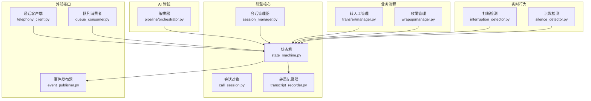
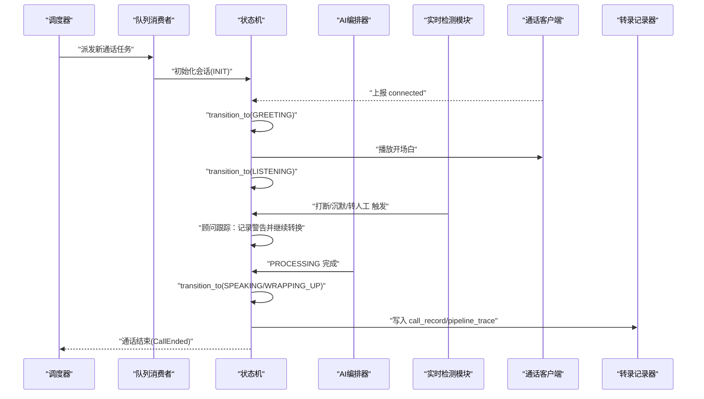
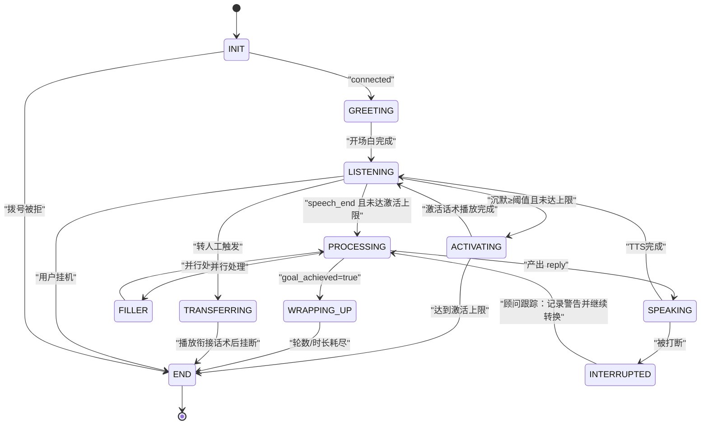
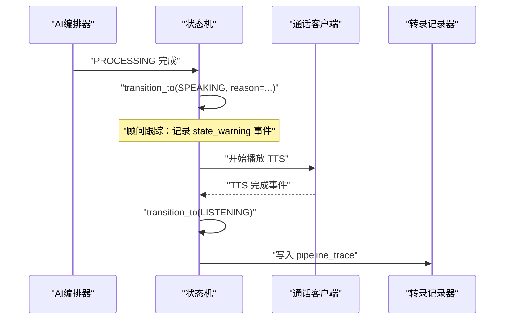
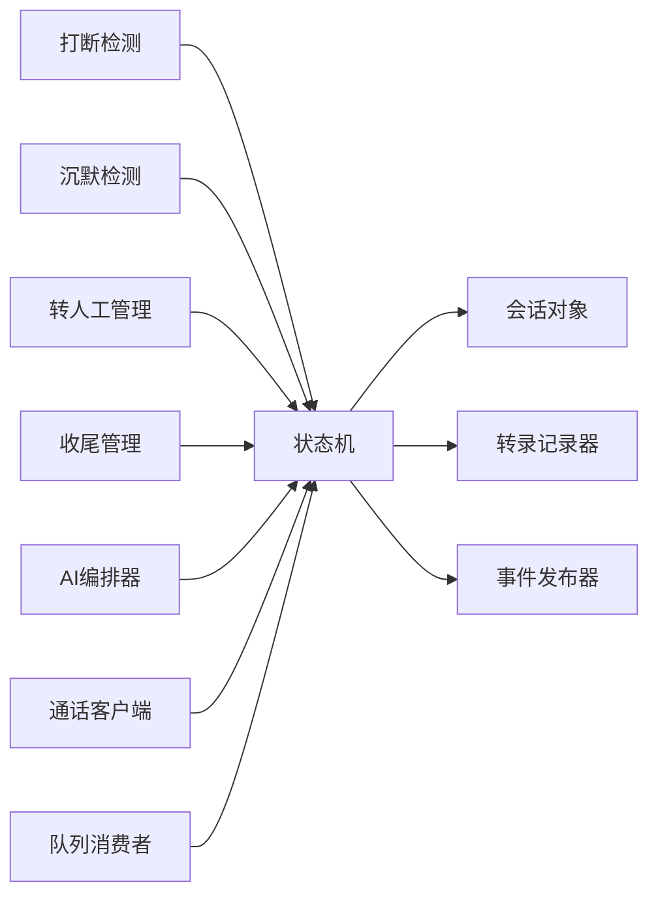

# 状态机设计架构

<cite>
**本文引用的文件**
- [call-state-machine/spec.md](file://openspec/specs/call-state-machine/spec.md)
- [call-state-machine-soften-guard/design.md](file://openspec/changes/call-state-machine-soften-guard/design.md)
- [call-state-machine-soften-guard/proposal.md](file://openspec/changes/call-state-machine-soften-guard/proposal.md)
- [state_machine.py](file://isales-engine/isales_engine/state_machine.py)
- [test_state_machine.py](file://isales-engine/tests/test_state_machine.py)
- [call_session.py](file://engine/call_session.py)
- [session_manager.py](file://engine/session_manager.py)
- [transcript_recorder.py](file://engine/transcript_recorder.py)
- [interruption_detector.py](file://engine/realtime/interruption_detector.py)
- [silence_detector.py](file://engine/realtime/silence_detector.py)
- [transfer/manager.py](file://engine/transfer/manager.py)
- [wrapup/manager.py](file://engine/wrapup/manager.py)
- [pipeline/orchestrator.py](file://engine/pipeline/orchestrator.py)
- [telephony_client.py](file://engine/telephony_client.py)
- [queue_consumer.py](file://engine/queue_consumer.py)
- [event_publisher.py](file://engine/event_publisher.py)
- [enums.py](file://isales-common/isales_common/enums.py)
</cite>

## 更新摘要
**所做更改**
- 更新了状态机核心行为：从严格的非法转移阻止机制转变为顾问跟踪模式
- 新增了顾问警告机制的架构说明和实现细节
- 更新了事件命名约定：state_error → state_warning
- 修订了异常处理流程和状态转换规则
- 增强了状态机的鲁棒性和可观察性设计

## 目录
1. [引言](#引言)
2. [项目结构](#项目结构)
3. [核心组件](#核心组件)
4. [架构总览](#架构总览)
5. [详细组件分析](#详细组件分析)
6. [依赖关系分析](#依赖关系分析)
7. [性能考量](#性能考量)
8. [故障排查指南](#故障排查指南)
9. [结论](#结论)
10. [附录](#附录)

## 引言
本文件面向 iSales 系统的实时通话引擎，系统化阐述"单通通话状态机"的设计与实现，覆盖 11 种通话状态的全生命周期管理、状态转换规则、触发条件与顾问跟踪机制。本次更新反映了最新的顾问跟踪模式变更，包括 transition_to 方法行为变更、事件命名约定更新，以及新的 advisory 警告机制对整体架构的影响。

## 项目结构
围绕状态机的关键实现分布在以下模块：
- 状态机与会话：isales-engine/isales_engine/state_machine.py、engine/call_session.py、engine/session_manager.py
- 事件记录与持久化：engine/transcript_recorder.py
- 实时行为模块：engine/realtime/interruption_detector.py、engine/realtime/silence_detector.py
- 业务流程模块：engine/transfer/manager.py、engine/wrapup/manager.py
- AI 管线：engine/pipeline/orchestrator.py
- 通话控制与事件发布：engine/telephony_client.py、engine/queue_consumer.py、engine/event_publisher.py
- 枚举与规范：isales-common/enums.py、openspec/specs/call-state-machine/spec.md

**图表来源**
- [state_machine.py](file://isales-engine/isales_engine/state_machine.py)
- [call_session.py](file://engine/call_session.py)
- [session_manager.py](file://engine/session_manager.py)
- [transcript_recorder.py](file://engine/transcript_recorder.py)
- [interruption_detector.py](file://engine/realtime/interruption_detector.py)
- [silence_detector.py](file://engine/realtime/silence_detector.py)
- [transfer/manager.py](file://engine/transfer/manager.py)
- [wrapup/manager.py](file://engine/wrapup/manager.py)
- [pipeline/orchestrator.py](file://engine/pipeline/orchestrator.py)
- [telephony_client.py](file://engine/telephony_client.py)
- [queue_consumer.py](file://engine/queue_consumer.py)
- [event_publisher.py](file://engine/event_publisher.py)

## 核心组件
- 状态机（StateMachine）：维护状态集合、合法转移图、统一的 transition_to 接口。**更新**：现在采用顾问跟踪模式，默认不抛异常，改为记录警告并继续执行状态转换。
- 会话对象（CallSession）：承载单通通话的上下文，包括对话历史、完整转录、管道追踪记录、计数器、收尾配置、时间锚点等。
- 会话管理器（SessionManager）：全局注册表，提供注册/注销/获取/并发控制等能力。
- 转录记录器（TranscriptRecorder）：负责将 call_record 与 pipeline_trace 批量持久化，具备幂等与重试策略。
- 实时行为模块：打断检测、沉默检测，分别驱动 SPEAKING/LISTENING 等状态的转换。
- 业务流程模块：转人工（TRANSFERRING）、收尾（WRAPPING_UP），在特定条件下触发状态转换。
- AI 管线（Orchestrator）：在 PROCESSING 状态产出回复，驱动 SPEAKING 或 WRAPPING_UP。
- 通话控制与事件发布：TelephonyClient 与 QueueConsumer、EventPublisher 分别负责底层通话控制与事件分发。

**章节来源**
- [state_machine.py](file://isales-engine/isales_engine/state_machine.py)
- [call_session.py](file://engine/call_session.py)
- [session_manager.py](file://engine/session_manager.py)
- [transcript_recorder.py](file://engine/transcript_recorder.py)
- [interruption_detector.py](file://engine/realtime/interruption_detector.py)
- [silence_detector.py](file://engine/realtime/silence_detector.py)
- [transfer/manager.py](file://engine/transfer/manager.py)
- [wrapup/manager.py](file://engine/wrapup/manager.py)
- [pipeline/orchestrator.py](file://engine/pipeline/orchestrator.py)
- [telephony_client.py](file://engine/telephony_client.py)
- [queue_consumer.py](file://engine/queue_consumer.py)
- [event_publisher.py](file://engine/event_publisher.py)

## 架构总览
状态机作为引擎的核心，统一调度所有实时行为模块与业务流程模块，确保状态转换的确定性与可观测性。**更新**：顾问跟踪模式下，所有事件均通过统一的 transition_to 接口进行，即使遇到非法转移也会记录警告并继续执行，保证系统的鲁棒性。

**图表来源**
- [queue_consumer.py](file://engine/queue_consumer.py)
- [state_machine.py](file://isales-engine/isales_engine/state_machine.py)
- [pipeline/orchestrator.py](file://engine/pipeline/orchestrator.py)
- [interruption_detector.py](file://engine/realtime/interruption_detector.py)
- [silence_detector.py](file://engine/realtime/silence_detector.py)
- [transfer/manager.py](file://engine/transfer/manager.py)
- [wrapup/manager.py](file://engine/wrapup/manager.py)
- [transcript_recorder.py](file://engine/transcript_recorder.py)
- [telephony_client.py](file://engine/telephony_client.py)

## 详细组件分析

### 状态集合与合法转移图
- 状态集合（共 11 种）：INIT、GREETING、LISTENING、SPEAKING、INTERRUPTED、FILLER、PROCESSING、WRAPPING_UP、ACTIVATING、TRANSFERRING、END。
- **更新**：合法转移图（LEGAL_TRANSITIONS）现在作为顾问参考文档，不再做强制执行约束，但仍用于区分"unusual（不在表里）"vs"expected（在表里）"的转换。
- 终止条件：进入 END 后不再发生状态转换，引擎落库 call_record 并向 worker 派发"通话结束"消息。

**章节来源**
- [call-state-machine/spec.md](file://openspec/specs/call-state-machine/spec.md)
- [state_machine.py](file://isales-engine/isales_engine/state_machine.py)

### 状态转换规则与触发条件
- 拨号成功进入开场白：modem-controller 上报 connected → INIT → GREETING。
- 开场白完成进入监听：GREETING → LISTENING。
- **更新**：顾问跟踪模式下的转换处理：SPEAKING 期间被打断 → 记录顾问警告 → 转换到 INTERRUPTED → PROCESSING，立即停止 TTS。
- LISTENING 正常结束：ASR 上报 speech_end 且未达激活上限 → LISTENING → PROCESSING，并启动 FILLER。
- PROCESSING 完成：产出 reply（goal_achieved=false）→ PROCESSING → SPEAKING；若 goal_achieved=true → PROCESSING → SPEAKING（播放当前轮 reply）→ WRAPPING_UP。
- WRAPPING_UP 结束：轮数或时长计数器耗尽 → 播放挂断话术 → END（reason=wrap_up_completed）。
- 沉默激活：LISTENING 沉默时长≥阈值且未达上限 → LISTENING → ACTIVATING；达到上限则播放 silence_hangup_phrase → END（reason=silence_max_reached）。
- 转人工：任一转人工触发条件命中 → 状态 → TRANSFERRING；播放衔接话术→主动挂断→END（reason=marked_for_handoff）。
- 长时间无进展：用户一直说话但被判定为非打断/无效内容超过阈值 → 主动挂断→END（reason=no_progress_timeout）。
- 用户挂机：modem-controller 上报 remote_hangup → END（reason=user_hangup 或具体 GSM-side cause）。

**章节来源**
- [call-state-machine/spec.md](file://openspec/specs/call-state-machine/spec.md)
- [state_machine.py](file://isales-engine/isales_engine/state_machine.py)

### 顾问跟踪机制
**新增**：顾问跟踪模式的核心特性，替代了原有的严格状态机约束。

- **顾问跟踪模式**：transition_to 方法默认不抛异常，改为记录顾问警告并继续执行状态转换。
- **顾问警告事件**：非法转移时记录 `state_warning` 事件，而非之前的 `state_error`。
- **强制参数保留**：`force=True` 参数保留但已无实际意义，内部逻辑变为无论 force=True/False，都先 warn-if-unusual 然后无条件 transition。
- **异常类保留**：`IllegalTransition` 异常类保留但不再被 `transition_to` 抛出，4 处现有 handler 变成 dead code，将在后续清理。

**章节来源**
- [call-state-machine-soften-guard/design.md](file://openspec/changes/call-state-machine-soften-guard/design.md)
- [call-state-machine-soften-guard/proposal.md](file://openspec/changes/call-state-machine-soften-guard/proposal.md)
- [state_machine.py](file://isales-engine/isales_engine/state_machine.py)

### 真硬件 URC 驱动状态转换
- 仅由 SerialATClient 翻译出的 ATEvent（经 IPC 上抛）触发状态转换，不因 ATD 命令 ACK/中间 URC 单独触发。
- ATD ACK 后状态停留在 INIT；第一条事件即 remote_hangup 时从 INIT 直接 → END，并在 transcript 记录顾问警告以便分析。
- 远端 hangup_cause 透传至 END.reason；本端主动挂断的 cause 不用于 END.reason（END.reason 由业务触发原因决定）。

**章节来源**
- [call-state-machine/spec.md](file://openspec/specs/call-state-machine/spec.md)
- [telephony_client.py](file://engine/telephony_client.py)

### 状态持久化策略与恢复机制
- call_record 与 pipeline_trace 的持久化：TranscriptRecorder 使用事务批量写入，具备指数退避与错误日志，失败不影响通话继续。
- 会话注册与并发控制：SessionManager 提供注册/注销/获取/并发计数，支持取消等待最终态。
- 状态恢复：通过会话对象的完整上下文（计数器、时间锚点、收尾配置等）在异常后重建状态机，确保恢复点一致。

**章节来源**
- [transcript_recorder.py](file://engine/transcript_recorder.py)
- [session_manager.py](file://engine/session_manager.py)
- [call_session.py](file://engine/call_session.py)

### 异常处理流程
**更新**：顾问跟踪模式下的异常处理机制。

- **顾问警告处理**：非法转移时不再抛出 `IllegalTransition`，而是记录顾问警告（`state_warning` 事件）并继续执行转换。
- **异常类保留**：`IllegalTransition` 异常类仍保留，但不再被 `transition_to` 抛出，4 处现有 handler 变成 dead code。
- **事件命名更新**：transcript 事件名从 `state_error` 改为 `state_warning`，语义从"业务错误"降级为"顾问警告"。
- **hangup_cause 单一来源**：统一使用 HangupCause 枚举，避免各模块自定义平行词汇表；manual_hangup 不进入重试逻辑。

**章节来源**
- [call-state-machine-soften-guard/design.md](file://openspec/changes/call-state-machine-soften-guard/design.md)
- [call-state-machine-soften-guard/proposal.md](file://openspec/changes/call-state-machine-soften-guard/proposal.md)
- [state_machine.py](file://isales-engine/isales_engine/state_machine.py)
- [enums.py](file://isales-common/isales_common/enums.py)

### 状态转换图

**图表来源**
- [call-state-machine/spec.md](file://openspec/specs/call-state-machine/spec.md)
- [state_machine.py](file://isales-engine/isales_engine/state_machine.py)

### 状态机实现示例（序列图）
**更新**：顾问跟踪模式下的状态机实现示例。

**图表来源**
- [pipeline/orchestrator.py](file://engine/pipeline/orchestrator.py)
- [state_machine.py](file://isales-engine/isales_engine/state_machine.py)
- [telephony_client.py](file://engine/telephony_client.py)
- [transcript_recorder.py](file://engine/transcript_recorder.py)

### 状态机扩展性设计
**更新**：顾问跟踪模式下的扩展性设计。

- **顾问跟踪原则**：新状态添加时，即使暂时不在 LEGAL_TRANSITIONS 中也允许转换，通过顾问警告机制进行监控。
- **触发源统一**：所有状态转换通过 transition_to 接口，保证 transcript 一致性与测试覆盖。
- **事件驱动**：实时行为模块与业务流程模块仅负责产生事件，不直接修改状态，降低耦合度。
- **枚举与契约**：hangup_cause 统一使用 HangupCause 枚举，避免跨模块语义漂移。
- **顾问警告监控**：新增的顾问警告事件为系统监控和调试提供了更好的可见性。

**章节来源**
- [call-state-machine/spec.md](file://openspec/specs/call-state-machine/spec.md)
- [state_machine.py](file://isales-engine/isales_engine/state_machine.py)
- [enums.py](file://isales-common/isales_common/enums.py)

## 依赖关系分析
- 状态机依赖：CallSession（上下文）、TranscriptRecorder（持久化）、EventPublisher（事件分发）。
- 实时行为模块依赖：状态机（触发转换）、TelephonyClient（上报事件）。
- 业务流程模块依赖：状态机（触发 TRANSFERRING/WRAPPING_UP）、TelephonyClient（播放衔接话术/挂断）。
- AI 管线依赖：状态机（驱动 SPEAKING/WRAPPING_UP）、TranscriptRecorder（写 pipeline_trace）。

**图表来源**
- [state_machine.py](file://isales-engine/isales_engine/state_machine.py)
- [call_session.py](file://engine/call_session.py)
- [transcript_recorder.py](file://engine/transcript_recorder.py)
- [event_publisher.py](file://engine/event_publisher.py)
- [interruption_detector.py](file://engine/realtime/interruption_detector.py)
- [silence_detector.py](file://engine/realtime/silence_detector.py)
- [transfer/manager.py](file://engine/transfer/manager.py)
- [wrapup/manager.py](file://engine/wrapup/manager.py)
- [pipeline/orchestrator.py](file://engine/pipeline/orchestrator.py)
- [telephony_client.py](file://engine/telephony_client.py)
- [queue_consumer.py](file://engine/queue_consumer.py)

## 性能考量
- 状态转换最小化：通过统一 transition_to 接口减少状态变更开销，避免模块间直接改状态导致的重复计算。
- 并行处理：FILLER 与 PROCESSING 并行，缩短整体响应时间；AI 管线采用多角色/裁判并行，失败路径快速降级。
- 持久化异步化：TranscriptRecorder 使用事务批量写入与指数退避，避免阻塞状态机主流程。
- 并发控制：SessionManager 通过 Redis 计数器限制并发，防止资源争用。
- **顾问跟踪优化**：顾问警告机制减少了异常处理开销，提高了系统的整体吞吐量。

## 故障排查指南
**更新**：顾问跟踪模式下的故障排查指南。

- **顾问警告排查**：检查顾问警告日志（`state_warning` 事件）和 transcript 中的异常转换记录；查看顾问警告频率和模式。
- **异常处理排查**：顾问跟踪模式下不再有 `IllegalTransition` 异常，相关异常处理代码已变为 dead code。
- **事件命名排查**：确认 transcript 中使用的是 `state_warning` 而非 `state_error` 事件。
- **持久化失败**：确认 TranscriptRecorder 的重试与日志级别；核对数据库连接与权限。
- **通话异常结束**：核对 hangup_cause 是否来自枚举；区分 user_hangup 与 manual_hangup 的不同业务含义。
- **实时行为异常**：检查打断/沉默检测模块的阈值与计数器；确认 ASR/TTS 事件流是否正确上报。

**章节来源**
- [state_machine.py](file://isales-engine/isales_engine/state_machine.py)
- [transcript_recorder.py](file://engine/transcript_recorder.py)
- [call-state-machine/spec.md](file://openspec/specs/call-state-machine/spec.md)
- [enums.py](file://isales-common/isales_common/enums.py)

## 结论
iSales 状态机通过顾问跟踪模式实现了从严格约束到智能监控的演进，既保持了系统的稳定性，又增强了可观测性和鲁棒性。顾问警告机制为开发者提供了更好的调试体验，同时通过统一的事件驱动模型与合法转移参考，确保了复杂通话控制逻辑的确定性与可维护性。未来新增状态应遵循顾问跟踪原则，在保证系统稳定性的前提下，通过顾问警告机制进行监控和优化。

## 附录
- 状态机实现要点参考：[state_machine.py](file://isales-engine/isales_engine/state_machine.py)
- 顾问跟踪设计参考：[call-state-machine-soften-guard/design.md](file://openspec/changes/call-state-machine-soften-guard/design.md)
- 顾问跟踪提案参考：[call-state-machine-soften-guard/proposal.md](file://openspec/changes/call-state-machine-soften-guard/proposal.md)
- 会话上下文参考：[call_session.py](file://engine/call_session.py)
- 会话管理参考：[session_manager.py](file://engine/session_manager.py)
- 转录持久化参考：[transcript_recorder.py](file://engine/transcript_recorder.py)
- 实时行为模块参考：[interruption_detector.py](file://engine/realtime/interruption_detector.py)、[silence_detector.py](file://engine/realtime/silence_detector.py)
- 业务流程模块参考：[transfer/manager.py](file://engine/transfer/manager.py)、[wrapup/manager.py](file://engine/wrapup/manager.py)
- AI 管线参考：[pipeline/orchestrator.py](file://engine/pipeline/orchestrator.py)
- 通话控制与事件发布参考：[telephony_client.py](file://engine/telephony_client.py)、[queue_consumer.py](file://engine/queue_consumer.py)、[event_publisher.py](file://engine/event_publisher.py)
- 规范与枚举参考：[call-state-machine/spec.md](file://openspec/specs/call-state-machine/spec.md)、[enums.py](file://isales-common/isales_common/enums.py)