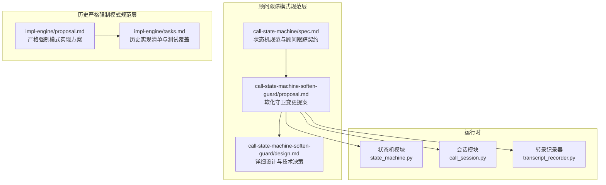
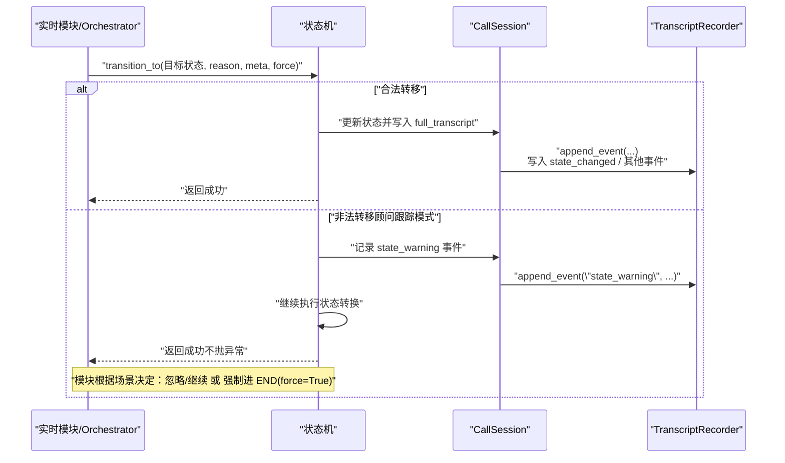
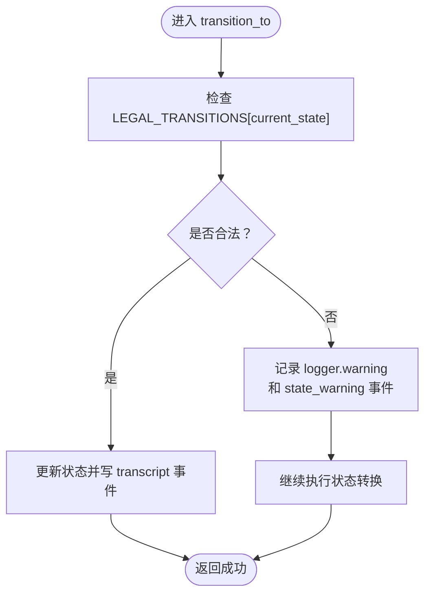
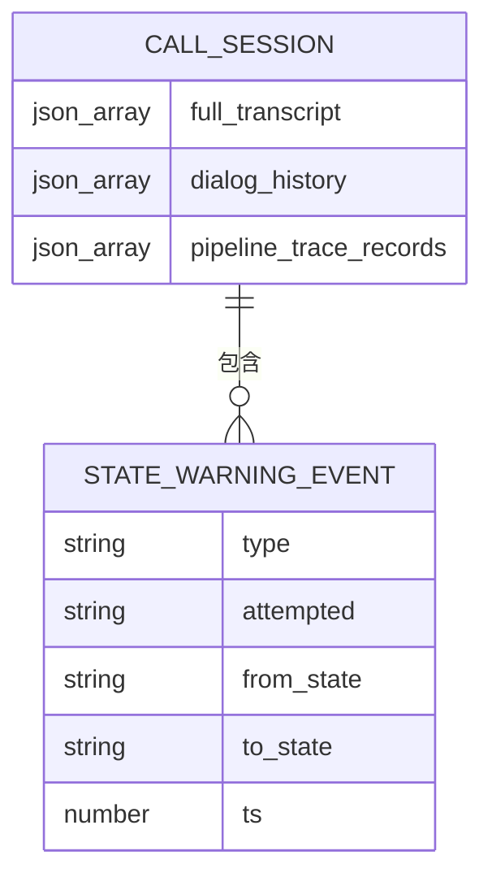
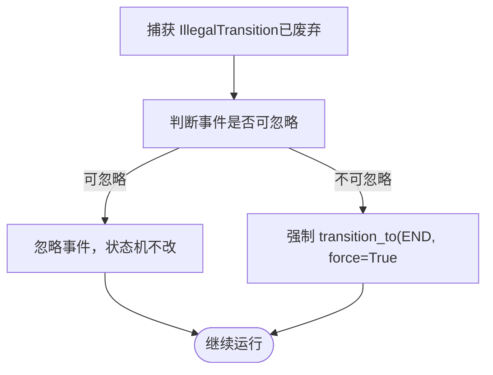
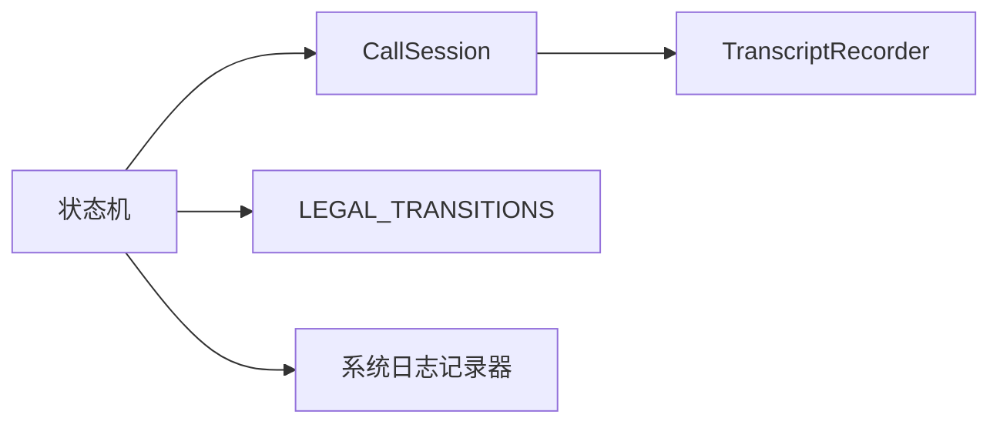

# 非法转换处理机制

<cite>
**本文引用的文件**
- [call-state-machine/spec.md](file://openspec/specs/call-state-machine/spec.md)
- [call-state-machine-soften-guard/proposal.md](file://openspec/changes/call-state-machine-soften-guard/proposal.md)
- [call-state-machine-soften-guard/design.md](file://openspec/changes/call-state-machine-soften-guard/design.md)
- [impl-engine/proposal.md](file://openspec/changes/archive/2026-05-07-impl-engine/proposal.md)
- [impl-engine/tasks.md](file://openspec/changes/archive/2026-05-07-impl-engine/tasks.md)
</cite>

## 更新摘要
**所做更改**
- 更新了非法转换处理机制，从严格强制模式转变为顾问跟踪模式
- 新增了 state_warning 事件的生成机制和处理流程
- 更新了强制转换机制的设计决策和 backward-compatibility 考虑
- 修正了事件命名变更和异常类保留策略

## 目录
1. [引言](#引言)
2. [项目结构](#项目结构)
3. [核心组件](#核心组件)
4. [架构总览](#架构总览)
5. [详细组件分析](#详细组件分析)
6. [依赖分析](#依赖分析)
7. [性能考量](#性能考量)
8. [故障排查指南](#故障排查指南)
9. [结论](#结论)
10. [附录](#附录)

## 引言
本文件面向 iSales 系统的引擎侧（isales-engine），系统化阐述"非法转换处理机制"。经过状态机软化守卫（soften-guard）变更后，非法转换处理机制已从严格强制模式转变为顾问跟踪模式。重点覆盖：
- state_warning 事件的触发条件与处理流程
- 顾问跟踪模式下的状态转换机制
- state_error 事件命名变更和 backward-compatibility 设计决策
- 强制转换机制（force=True）的保留策略与安全考虑
- 非法转换检测与恢复的实现示例（模块级异常捕获与状态机级错误处理策略）

## 项目结构
围绕非法转换处理机制的相关规范与实现要点主要分布在以下位置：
- call-state-machine/spec.md：定义状态集合、合法转移、顾问跟踪模式下的 state_warning 事件格式
- call-state-machine-soften-guard/proposal.md：状态机软化守卫变更提案，定义顾问跟踪模式的核心设计
- call-state-machine-soften-guard/design.md：详细设计文档，阐述顾问跟踪模式的技术决策
- impl-engine/proposal.md：历史状态机实现方案（严格强制模式）
- impl-engine/tasks.md：历史状态机实现清单（含 IllegalTransition、transition_to(force)、transcript 写入等）

**图表来源**
- [call-state-machine/spec.md:1-190](file://openspec/specs/call-state-machine/spec.md#L1-L190)
- [call-state-machine-soften-guard/proposal.md:1-64](file://openspec/changes/call-state-machine-soften-guard/proposal.md#L1-L64)
- [call-state-machine-soften-guard/design.md:1-133](file://openspec/changes/call-state-machine-soften-guard/design.md#L1-L133)
- [impl-engine/proposal.md:18-22](file://openspec/changes/archive/2026-05-07-impl-engine/proposal.md#L18-L22)
- [impl-engine/tasks.md:16-26](file://openspec/changes/archive/2026-05-07-impl-engine/tasks.md#L16-L26)

## 核心组件
- 状态机（StateMachine）
  - 维护合法转移集合 LEGAL_TRANSITIONS
  - 统一事件驱动 API：session.transition_to(NEW_STATE, reason, meta, force=False)
  - **顾问跟踪模式**：非法转移时记录 state_warning 事件并继续执行，不再抛出异常
- CallSession
  - 承载单通通话上下文（dialog_history、full_transcript、pipeline_trace_records 等）
  - 提供 append_event(type, **fields) 自动写入相对时间戳与类型校验
- TranscriptRecorder
  - 负责 call_record 与 pipeline_trace 的持久化，保证事务性与可观测性

**章节来源**
- [call-state-machine-soften-guard/design.md:34-55](file://openspec/changes/call-state-machine-soften-guard/design.md#L34-L55)
- [call-state-machine-soften-guard/proposal.md:9-16](file://openspec/changes/call-state-machine-soften-guard/proposal.md#L9-L16)

## 架构总览
顾问跟踪模式下的非法转换处理贯穿"状态机 → 会话 → 转录记录器"的链路，确保每次状态转换均通过统一入口进行合法性检查与事件记录，但不再阻塞业务流程。

**图表来源**
- [call-state-machine-soften-guard/design.md:34-55](file://openspec/changes/call-state-machine-soften-guard/design.md#L34-L55)
- [call-state-machine-soften-guard/proposal.md:11-12](file://openspec/changes/call-state-machine-soften-guard/proposal.md#L11-L12)

## 详细组件分析

### 顾问跟踪模式下的 state_warning 事件与触发条件
- **触发条件**
  - 任何模块（filler / silence / transfer / orchestrator 等）尝试将状态转移到当前状态的 LEGAL_TRANSITIONS 集合之外
  - **顾问跟踪模式**：不再抛出异常，而是记录警告信息并继续执行
- **事件记录与处理**
  - 状态机在非法转移时，在 full_transcript 中追加 state_warning 事件
  - 事件字段包含 attempted（事件名）、from_state（当前状态）、to_state（意图目标状态）、ts（相对通话开始的毫秒时间戳）
  - 同时记录 logger.warning 日志，便于系统日志监控

**图表来源**
- [call-state-machine-soften-guard/design.md:34-55](file://openspec/changes/call-state-machine-soften-guard/design.md#L34-L55)

**章节来源**
- [call-state-machine-soften-guard/design.md:34-55](file://openspec/changes/call-state-machine-soften-guard/design.md#L34-L55)
- [call-state-machine-soften-guard/proposal.md:11-12](file://openspec/changes/call-state-machine-soften-guard/proposal.md#L11-L12)

### state_warning 事件生成机制与 transcript 记录格式
- **生成机制**
  - 非法转移发生时，状态机在 CallSession.full_transcript 中追加一条 state_warning 事件
  - 事件自动携带相对时间戳 ts（相对于通话开始）
  - 同时记录系统日志 warning，便于运维监控
- **记录格式**
  - 字段：type（固定为 "state_warning"）、attempted（事件名）、from_state（当前状态）、to_state（意图目标状态）、ts（相对毫秒）
  - 该事件属于 full_transcript，用于调试与审计

**图表来源**
- [call-state-machine-soften-guard/design.md:47-52](file://openspec/changes/call-state-machine-soften-guard/design.md#L47-L52)

**章节来源**
- [call-state-machine-soften-guard/design.md:47-52](file://openspec/changes/call-state-machine-soften-guard/design.md#L47-L52)

### 强制转换机制（force=True）的保留策略与安全考虑
- **保留策略**
  - force=True 参数在顾问跟踪模式下不再具有强制跳过校验的功能，因为所有转换都会被执行
  - 保留参数是为了避免 22 处现有调用方的代码改动，确保 backward-compatibility
- **使用场景**
  - 顾问跟踪模式下，force=True 的实际效果与 force=False 相同
  - 保留参数主要是为了维护现有 API 的稳定性
- **安全考虑**
  - 顾问跟踪模式消除了业务流程阻塞的风险，但仍保留了诊断信号
  - 通过 state_warning 事件和系统日志提供可观测性
  - LEGAL_TRANSITIONS 表仍作为业务流程参考文档

**章节来源**
- [call-state-machine-soften-guard/design.md:84-89](file://openspec/changes/call-state-machine-soften-guard/design.md#L84-L89)
- [call-state-machine-soften-guard/proposal.md:13-14](file://openspec/changes/call-state-machine-soften-guard/proposal.md#L13-L14)

### 顾问跟踪模式下的可恢复与不可恢复区分标准
- **顾问跟踪模式特点**
  - 所有状态转换都会被执行，不再抛出异常阻塞业务流程
  - 通过 state_warning 事件提供诊断信号，便于监控和审计
- **处理策略**
  - 顾问跟踪模式下，非法转换被视为 advisory warning 而非错误
  - 模块无需处理 IllegalTransition 异常，因为异常类不再被抛出
  - 通过 state_warning 事件和系统日志进行监控和告警

**图表来源**
- [call-state-machine-soften-guard/design.md:76-82](file://openspec/changes/call-state-machine-soften-guard/design.md#L76-L82)

**章节来源**
- [call-state-machine-soften-guard/design.md:76-82](file://openspec/changes/call-state-machine-soften-guard/design.md#L76-L82)

### 非法转换检测与恢复的实现示例
以下示例以"顾问跟踪模式"的形式展示模块级异常捕获与状态机级错误处理策略，便于对照实现：

- **顾问跟踪模式下的模块级处理**
  - 不再需要捕获 IllegalTransition 异常，因为异常类不再被抛出
  - 通过监控 state_warning 事件和系统日志进行异常检测
  - 可以选择忽略或处理 state_warning 事件，但不会阻塞业务流程
- **顾问跟踪模式下的状态机级处理策略**
  - transition_to 统一入口：负责合法性检查、记录 state_warning 事件、继续执行状态转换
  - 不再抛出异常，所有转换都会被执行
  - 通过 logger.warning 和 state_warning 事件提供诊断信号

**章节来源**
- [call-state-machine-soften-guard/design.md:34-55](file://openspec/changes/call-state-machine-soften-guard/design.md#L34-L55)
- [call-state-machine-soften-guard/proposal.md:11-12](file://openspec/changes/call-state-machine-soften-guard/proposal.md#L11-L12)

## 依赖分析
- **顾问跟踪模式依赖**
  - 状态机依赖 LEGAL_TRANSITIONS 与 CallSession 的 full_transcript
  - CallSession 依赖 TranscriptRecorder 的持久化能力
  - 系统日志记录器用于记录 warning 信息
- **事件契约**
  - 所有状态转换事件（含 state_warning）均遵循 transcript 规范，确保跨模块一致性
  - state_error 事件名已变更为 state_warning，保持 backward-compatibility

**图表来源**
- [call-state-machine-soften-guard/design.md:34-55](file://openspec/changes/call-state-machine-soften-guard/design.md#L34-L55)

**章节来源**
- [call-state-machine-soften-guard/design.md:34-55](file://openspec/changes/call-state-machine-soften-guard/design.md#L34-L55)

## 性能考量
- **顾问跟踪模式性能优势**
  - 非法转移检测为 O(1) 查表（基于 LEGAL_TRANSITIONS），开销极低
  - 不再需要异常抛出和捕获的性能开销
  - 事件写入采用 append_event 自动 ts 与类型校验，避免重复计算
- **可观测性开销**
  - 顾问跟踪模式增加了 logger.warning 和 state_warning 事件的记录开销
  - pipeline_trace 的写入采用独立 try/except 包裹，失败不影响通话主路径

**章节来源**
- [call-state-machine-soften-guard/design.md:57-58](file://openspec/changes/call-state-machine-soften-guard/design.md#L57-L58)

## 故障排查指南
- **顾问跟踪模式下的故障排查**
  - 监控系统日志中的 state_transition_unusual 警告信息
  - 检查 full_transcript 中是否存在 type="state_warning" 的事件
  - 关注 attempted、from_state、to_state、ts 字段，结合业务逻辑判断是否合理
- **顾问跟踪模式与严格强制模式的区别**
  - 顾问跟踪模式下不再有 IllegalTransition 异常
  - 通过 state_warning 事件和系统日志进行监控
  - 业务流程不会被非法转换阻塞

**章节来源**
- [call-state-machine-soften-guard/design.md:94-95](file://openspec/changes/call-state-machine-soften-guard/design.md#L94-L95)
- [call-state-machine-soften-guard/design.md:70-71](file://openspec/changes/call-state-machine-soften-guard/design.md#L70-L71)

## 结论
顾问跟踪模式下的非法转换处理机制通过"统一状态转换入口 + 合法性检查 + 顾问跟踪警告 + 继续执行"形成闭环，既保障了业务流程的连续性，又提供了丰富的诊断信号。建议在实现中遵循：
- 所有状态转换必须通过 transition_to
- 非法转移记录 state_warning 事件并继续执行，不再抛出异常
- 通过 state_warning 事件和系统日志进行监控和告警
- 事件与数据落库必须可靠，确保审计与回溯能力

顾问跟踪模式消除了业务流程阻塞的风险，同时保留了足够的可观测性，是一个平衡稳定性和可维护性的合理设计。

## 附录
- **顾问跟踪模式相关规范与实现清单**
  - call-state-machine/spec.md：状态机规范与顾问跟踪契约
  - call-state-machine-soften-guard/proposal.md：软化守卫变更提案
  - call-state-machine-soften-guard/design.md：详细设计与技术决策
  - impl-engine/proposal.md：历史严格强制模式实现方案
  - impl-engine/tasks.md：历史实现清单与测试覆盖

**章节来源**
- [call-state-machine/spec.md:1-190](file://openspec/specs/call-state-machine/spec.md#L1-L190)
- [call-state-machine-soften-guard/proposal.md:1-64](file://openspec/changes/call-state-machine-soften-guard/proposal.md#L1-L64)
- [call-state-machine-soften-guard/design.md:1-133](file://openspec/changes/call-state-machine-soften-guard/design.md#L1-L133)
- [impl-engine/proposal.md:18-22](file://openspec/changes/archive/2026-05-07-impl-engine/proposal.md#L18-L22)
- [impl-engine/tasks.md:16-26](file://openspec/changes/archive/2026-05-07-impl-engine/tasks.md#L16-L26)