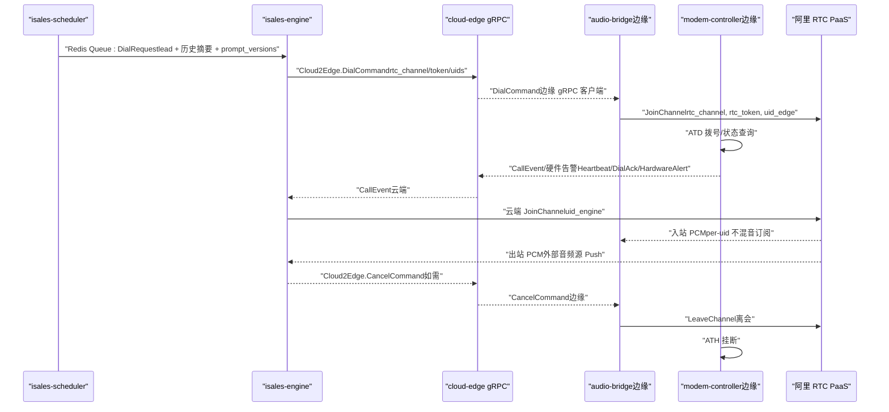
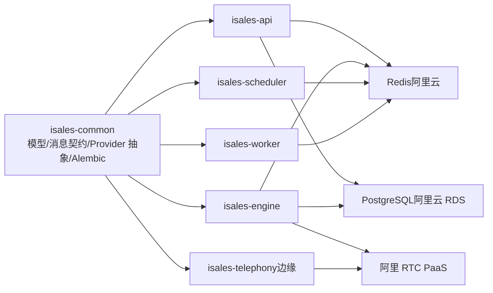
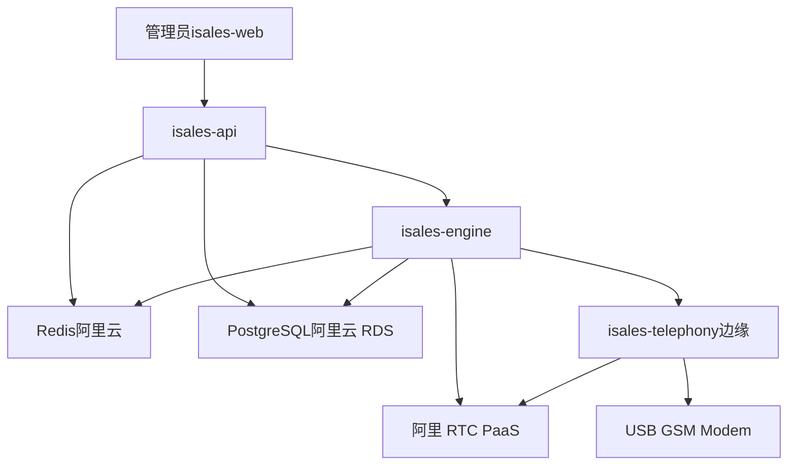

# 系统架构设计

<cite>
**本文引用的文件**
- [README.md](file://README.md)
- [DESIGN.md](file://DESIGN.md)
- [架构规范（architecture）](file://openspec/specs/architecture/spec.md)
- [部署拓扑（deployment-topology）](file://openspec/specs/deployment-topology/spec.md)
- [服务通信（service-communication）](file://openspec/specs/service-communication/spec.md)
- [数据模型（data-model）](file://openspec/specs/data-model/spec.md)
- [消息契约（message-contract）](file://openspec/specs/message-contract/spec.md)
- [设备硬件（device-hardware）](file://openspec/specs/device-hardware/spec.md)
- [云-边分离架构（architecture）](file://openspec/changes/arch-cloud-edge-split/specs/architecture/spec.md)
- [云-边分离部署拓扑（deployment-topology）](file://openspec/changes/arch-cloud-edge-split/specs/deployment-topology/spec.md)
- [云-边分离服务通信（service-communication）](file://openspec/changes/arch-cloud-edge-split/specs/service-communication/spec.md)
- [云端部署说明（cloud/README.md）](file://deploy/cloud/README.md)
- [边缘端部署说明（edge/README.md）](file://deploy/edge/README.md)
- [运维手册（RUNBOOK.md）](file://deploy/RUNBOOK.md)
- [运维手册（云端）（RUNBOOK-cloud.md）](file://deploy/RUNBOOK-cloud.md)
</cite>

## 目录
1. [简介](#简介)
2. [项目结构](#项目结构)
3. [核心组件](#核心组件)
4. [架构总览](#架构总览)
5. [详细组件分析](#详细组件分析)
6. [依赖关系分析](#依赖关系分析)
7. [性能考量](#性能考量)
8. [故障排查指南](#故障排查指南)
9. [结论](#结论)
10. [附录](#附录)

## 简介
本架构文档面向 iSales 系统 v1 的云-边分离设计，阐述 7 个微服务的职责边界、交互关系、数据流与集成模式，解释云-边分离的架构决策、技术权衡与约束条件，并给出基础设施需求、可扩展性考虑、部署拓扑与运维实践。系统通过“云端服务 + 边缘进程”的双栈部署，将 AI 编排与控制面置于云端，将硬件控制与媒体桥接置于边缘，实现低延迟音频与高可靠控制的协同。

## 项目结构
- 仓库组织：7 个独立 Git 仓库，isales-common 作为共享库被 6 个服务依赖。
- 服务职责：
  - isales-common：Pydantic/SQLAlchemy 模型、Provider ABC、Alembic 迁移、跨仓共享 schema
  - isales-api：管理后台 + WS 代理
  - isales-engine：实时通话引擎（状态机 + 三层 AI 管线）
  - isales-scheduler：线索调度（时间窗口/重试/跟进）
  - isales-worker：后处理（摘要/字段提取/Webhook 回调）
  - isales-telephony：边缘进程（modem-controller + audio-bridge + cloud-edge gRPC client + 本地 SQLite buffer）
  - isales-web：Vue 3 管理端
- 部署形态：v1 支持单主机（Linux systemd / macOS launchd）与云-边分离（阿里云 ECS + Mac mini/Windows 边缘）两种形态。

章节来源
- [README.md:1-86](file://README.md#L1-L86)
- [DESIGN.md:1-75](file://DESIGN.md#L1-L75)

## 核心组件
- 云端 5 服务
  - isales-api：HTTP/WS 管理后台，负责 JWT 签发与前端鉴权、Campaign/Lead/Role/Voice/Analytics/Callback 管理、WebSocket 事件代理。
  - isales-engine：实时通话引擎，负责状态机、AI 三层管线、ASR/TTS/LLM Provider 实现、云-边 gRPC 控制面与阿里 RTC 媒体面编排。
  - isales-scheduler：线索分发与时间窗口控制，通过 Redis Queue 向 engine 下发 dial 指令。
  - isales-worker：通话结束后摘要/字段提取/Webhook 回调/数据聚合。
  - isales-web：Vue 3 SPA，通过 nginx 反代提供静态资源与 /api、/ws 代理。
- 边缘 1 进程
  - isales-telephony：单进程内含 modem-controller（AT 命令/PCM 音频/udev）、audio-bridge（阿里 RTC SDK 客户端/PCM 重采样/环形缓冲桥接）、cloud-edge gRPC client、本地 SQLite 离线 buffer、边缘 telephony-api（本地查询）。
- 共享库
  - isales-common：统一数据模型、消息契约、Provider 抽象、Alembic 迁移、跨仓共享 schema。

章节来源
- [架构规范（architecture）:1-168](file://openspec/specs/architecture/spec.md#L1-L168)
- [云-边分离架构（architecture）:1-143](file://openspec/changes/arch-cloud-edge-split/specs/architecture/spec.md#L1-L143)

## 架构总览
云-边分离架构将“控制面”与“媒体面”与“硬件控制面”解耦：
- 控制面（云内）：Redis 队列/发布订阅、engine 的 cloud-edge gRPC 控制面、API 的 WebSocket 代理。
- 媒体面（云-边）：阿里 RTC PaaS，云端 engine 与边缘 audio-bridge 双向 PCM 推送/订阅。
- 硬件控制面（边缘）：modem-controller 通过 AT 命令与 PCM 音频控制 GSM modem，audio-bridge 与 modem-controller 同进程桥接。

```mermaid
graph TB
subgraph "云端阿里云 ECS"
API["isales-api<br/>HTTP/WS 管理后台"]
ENGINE["isales-engine<br/>实时通话引擎 + cloud-edge gRPC 服务"]
SCHED["isales-scheduler<br/>线索调度"]
WORKER["isales-worker<br/>后处理"]
WEB["isales-web + nginx<br/>SPA 静态资源 + /api /ws 代理"]
REDIS["Redis阿里云托管"]
PG["PostgreSQL阿里云 RDS"]
end
subgraph "边缘Mac mini/Windows"
TELEPHONY["isales-telephony<br/>modem-controller + audio-bridge + gRPC client + 本地 SQLite"]
MODEM["USB GSM Modem"]
RTC["阿里 RTC PaaS"]
end
WEB --> API
API <- --> REDIS
SCHED --> ENGINE
ENGINE --> WORKER
ENGINE --> REDIS
SCHED --> REDIS
WORKER --> REDIS
ENGINE --> PG
API --> PG
ENGINE < --> TELEPHONY
TELEPHONY --> MODEM
ENGINE --> RTC
TELEPHONY --> RTC
```

图表来源
- [云-边分离部署拓扑（deployment-topology）:1-213](file://openspec/changes/arch-cloud-edge-split/specs/deployment-topology/spec.md#L1-L213)
- [云-边分离服务通信（service-communication）:1-250](file://openspec/changes/arch-cloud-edge-split/specs/service-communication/spec.md#L1-L250)

章节来源
- [云-边分离部署拓扑（deployment-topology）:1-213](file://openspec/changes/arch-cloud-edge-split/specs/deployment-topology/spec.md#L1-L213)
- [云-边分离服务通信（service-communication）:1-250](file://openspec/changes/arch-cloud-edge-split/specs/service-communication/spec.md#L1-L250)

## 详细组件分析

### 1) 服务通信与数据流
- 云内通信
  - Redis Queue：scheduler→engine（dial）、engine→worker（call-ended）、api→scheduler（启动/暂停 campaign）
  - Redis Pub/Sub：api↔engine（实时控制/事件推送）
  - 数据库直连：所有服务通过 isales-common 的 SQLAlchemy 模型访问阿里云 RDS
- 云-边通信
  - cloud-edge gRPC 双向流：拨号/挂断/通话事件/硬件告警/心跳/配置更新/RTC 凭证
  - 阿里 RTC PaaS：PCM 双向音频流（upstream/downstream）
- 消息契约
  - 跨服务消息体集中定义在 isales-common，Producer/Consumer 引用同一 Pydantic 模型，统一 schema_version、message_id、created_at。



图表来源
- [服务通信（service-communication）:1-150](file://openspec/specs/service-communication/spec.md#L1-L150)
- [云-边分离服务通信（service-communication）:1-250](file://openspec/changes/arch-cloud-edge-split/specs/service-communication/spec.md#L1-L250)

章节来源
- [服务通信（service-communication）:1-150](file://openspec/specs/service-communication/spec.md#L1-L150)
- [云-边分离服务通信（service-communication）:1-250](file://openspec/changes/arch-cloud-edge-split/specs/service-communication/spec.md#L1-L250)

### 2) 数据模型与一致性
- 数据库统一为 PostgreSQL，迁移由 isales-common 管理；所有服务通过 isales-common 模型访问，避免直写 SQL。
- 表归属明确：每张表标注主要业务归属，跨服务读写权由“数据库直连”与“跨服务读 vs 写”约束。
- JSONB 字段用于半结构化配置，需附 schema 描述。

章节来源
- [数据模型（data-model）:1-83](file://openspec/specs/data-model/spec.md#L1-L83)

### 3) 设备与硬件控制（边缘）
- modem-controller：udev 监听、AT 命令通道、PCM 音频管道；设备状态机（unknown/detected/registered/idle/dialing/in_call/offline/flagged/error）。
- audio-bridge：阿里 RTC SDK 客户端，PCM 重采样与环形缓冲桥接；边缘进程内与 modem-controller 同步。
- 本地 SQLite：离线事件 buffer 与边缘本地设备状态缓存（非权威数据源）。
- Windows/macOS 平台后端：Windows 通过 pybind11 绑定 ARTC SDK，macOS 通过 PyObjC 绑定（dev/QA 形态）。

章节来源
- [设备硬件（device-hardware）:1-525](file://openspec/specs/device-hardware/spec.md#L1-L525)

### 4) 云端 API 与 WebSocket 代理
- isales-api 提供 /ws/calls/{campaign_id} WebSocket，订阅 Redis Pub/Sub channel，fan-out 给前端客户端；JWT 鉴权，未知事件类型仅跳过不中断。
- 前端通过 discriminated union 解析 EngineEvent，避免破坏性升级。

章节来源
- [服务通信（service-communication）:106-150](file://openspec/specs/service-communication/spec.md#L106-L150)

### 5) 云-边 gRPC 控制面
- 单一 gRPC 服务 CloudEdge，HTTP/2 over TLS；边缘以 Bearer token（EDGE_DEVICE_TOKEN）鉴权，绑定到具体 edge_device。
- 心跳 30s，云端 watchdog 120s 无心跳置 offline；断线指数退避重连，本地 buffer 顺序补发事件。
- Dial/Cancel 命令丢失语义：Dial 失败由 scheduler 重试兜底；Cancel 失败不重试，允许边缘自然超时挂断。

章节来源
- [云-边分离服务通信（service-communication）:97-250](file://openspec/changes/arch-cloud-edge-split/specs/service-communication/spec.md#L97-L250)

### 6) 阿里 RTC 媒体面
- 一通通话一个 RTC 房间，engine 与 edge 各自入会；入站订阅 per-uid PCM，出站启用外部音频源推送 PCM；处理反压回调。
- 通话结束双方离会，避免“僵尸”参会者计费。

章节来源
- [云-边分离服务通信（service-communication）:167-195](file://openspec/changes/arch-cloud-edge-split/specs/service-communication/spec.md#L167-L195)

## 依赖关系分析
- 组件耦合
  - 云内：scheduler/engine/worker/api 通过 Redis 与数据库协作；engine 与 worker 通过队列解耦。
  - 云-边：engine 与 telephony 通过 gRPC 控制面解耦；audio-bridge 与 modem-controller 同进程耦合以降低 IPC 复杂度。
- 外部依赖
  - 阿里云托管：RDS PostgreSQL、Redis、OSS、RTC 应用。
  - ARTC SDK：云端 DingRTC、边缘 macOS ARTC、Windows ARTC（通过绑定）。
- 通信协议
  - 云内：Redis（队列/发布订阅）、HTTP/WS、gRPC（云-边控制面）、阿里 RTC（媒体面）。



图表来源
- [架构规范（architecture）:130-168](file://openspec/specs/architecture/spec.md#L130-L168)
- [云-边分离架构（architecture）:27-50](file://openspec/changes/arch-cloud-edge-split/specs/architecture/spec.md#L27-L50)

章节来源
- [架构规范（architecture）:130-168](file://openspec/specs/architecture/spec.md#L130-L168)
- [云-边分离架构（architecture）:27-50](file://openspec/changes/arch-cloud-edge-split/specs/architecture/spec.md#L27-L50)

## 性能考量
- 云-边分离优势
  - 控制面与媒体面解耦：engine 专注 AI 编排，边缘专注硬件与音频桥接，降低跨主机调度复杂度。
  - 媒体面走 RTC PaaS，避免自建媒体服务器带来的复杂性与成本。
- 性能瓶颈与优化
  - RTC 推送反压：处理 OnPushAudioFrameBufferFull，暂停 TTS chunk 拉取或 PCM 上行拉取。
  - 队列深度与并发：engine:dial 队列深度超阈值告警；全局并发计数器 INCR/DECR 防泄漏。
  - 延迟测量：macOS dev/QA 形态提供延迟测量参考，Windows 商用形态需独立验证。
- 可扩展性
  - v1 单 cloud instance，engine restart 会中断活跃通话；多实例扩展（v2）需通过 Redis Streams/一致性哈希/粘性会话等方案。

章节来源
- [云-边分离服务通信（service-communication）:196-214](file://openspec/changes/arch-cloud-edge-split/specs/service-communication/spec.md#L196-L214)
- [设备硬件（device-hardware）:394-398](file://openspec/specs/device-hardware/spec.md#L394-L398)

## 故障排查指南
- 常见症状与处置
  - Redis OOM：检查内存使用，调整 maxmemory 或策略；核对队列深度。
  - modem-controller 设备断开：检查 udev 事件、USB 重插、串口占用（macOS usbmuxd/commcenter）。
  - engine:dial 队列堆积：检查 engine 重启/日志，确认 active calls 数量。
  - nginx 502：检查 isales-api 健康、代理配置、proxy_read_timeout。
  - gRPC 断连：边缘自动重连，检查安全组/SLB HTTP/2 keepalive 配置。
  - RTC 房间断连：SDK 内部重连，超时触发挂断；确认 token 与房间参数。
- 回滚与 schema 回滚
  - 云端回滚仅切换 current 软链 + 重启服务；schema 回滚需手工执行 RUNBOOK 中的“schema 回滚”步骤。
- 备份恢复演练
  - 每季度执行 RDS/Redis 备份恢复演练；验证 alembic 版本与关键表计数。

章节来源
- [运维手册（RUNBOOK.md）:163-197](file://deploy/RUNBOOK.md#L163-L197)
- [运维手册（云端）（RUNBOOK-cloud.md）:584-599](file://deploy/RUNBOOK-cloud.md#L584-L599)

## 结论
iSales v1 的云-边分离架构通过“控制面云内、媒体面云-边、硬件面边缘”的分工，实现了高可靠与低延迟的协同。云内以 Redis/数据库为核心，边缘以硬件与媒体桥接为核心，二者通过 gRPC 控制面与 RTC 媒体面紧密协作。该设计在 v1 单实例下具备确定性与可运维性，为 v2 多实例扩展预留了接口抽象与演进路径。

## 附录

### A. 系统上下文图


图表来源
- [云-边分离部署拓扑（deployment-topology）:1-213](file://openspec/changes/arch-cloud-edge-split/specs/deployment-topology/spec.md#L1-L213)

### B. 组件分解图（代码级）
```mermaid
classDiagram
class IsalesCommon {
+SQLAlchemy 模型
+Pydantic 消息模型
+Provider ABC
+Alembic 迁移
}
class Api {
+HTTP/WS 管理后台
+JWT 签发/验证
+/ws/calls/{id}
}
class Engine {
+实时通话引擎
+AI 三层管线
+cloud-edge gRPC 服务
+RTC 媒体面编排
}
class Scheduler {
+线索调度
+时间窗口/重试/跟进
+Redis Queue
}
class Worker {
+摘要/字段提取
+Webhook 回调
+数据聚合
}
class Telephony {
+modem-controller
+audio-bridge
+cloud-edge gRPC client
+本地 SQLite buffer
}
IsalesCommon <.. Api
IsalesCommon <.. Engine
IsalesCommon <.. Scheduler
IsalesCommon <.. Worker
IsalesCommon <.. Telephony
```

图表来源
- [架构规范（architecture）:130-168](file://openspec/specs/architecture/spec.md#L130-L168)
- [云-边分离架构（architecture）:27-50](file://openspec/changes/arch-cloud-edge-split/specs/architecture/spec.md#L27-L50)

### C. 基础设施与部署拓扑
- 云端（阿里云 ECS）
  - 4-8 核/16-32G RAM，Ubuntu 22.04 LTS，systemd 管理 5 服务；RDS PostgreSQL 16、Redis Tair/标准版、OSS、RTC 应用。
  - nginx 反代 isales-web 静态资源与 /api、/ws；安全组仅开放 80/443/50051/22。
- 边缘（Mac mini/Windows）
  - 单进程 isales-telephony，进程内含 modem-controller + audio-bridge + gRPC client + 本地 SQLite；USB GSM modem 直插边缘机。
  - 不暴露公网端口，仅出向访问云端 gRPC TLS 与阿里 RTC。

章节来源
- [云端部署说明（cloud/README.md）:1-118](file://deploy/cloud/README.md#L1-L118)
- [边缘端部署说明（edge/README.md）:1-99](file://deploy/edge/README.md#L1-L99)
- [云-边分离部署拓扑（deployment-topology）:1-213](file://openspec/changes/arch-cloud-edge-split/specs/deployment-topology/spec.md#L1-L213)

### D. 安全、监控与灾难恢复
- 安全
  - 前端 JWT 与边缘 gRPC 使用独立密钥（ISALES_JWT_SECRET 与 EDGE_DEVICE_TOKEN），鉴权隔离。
  - 边缘不直连云端数据库，通过 gRPC 控制面读写。
- 监控
  - Prometheus 基础指标与 Grafana 仪表盘；最小告警集覆盖队列深度、设备 flagged 比例、回调失败率、PG 连接数、边缘断连数。
- 灾难恢复
  - RDS/Redis 云控台备份；定期恢复演练；schema 回滚需手工执行 RUNBOOK。

章节来源
- [云-边分离服务通信（service-communication）:70-103](file://openspec/changes/arch-cloud-edge-split/specs/service-communication/spec.md#L70-L103)
- [运维手册（云端）（RUNBOOK-cloud.md）:446-476](file://deploy/RUNBOOK-cloud.md#L446-L476)