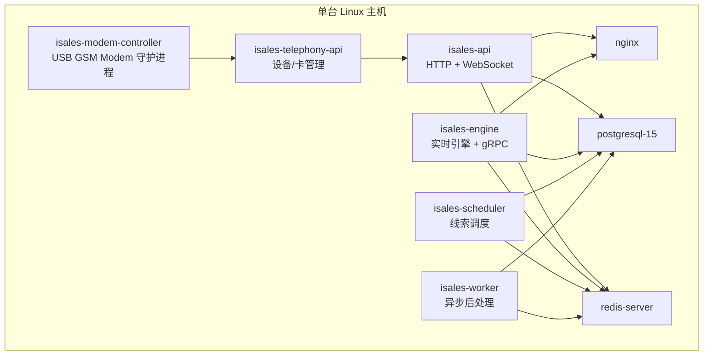
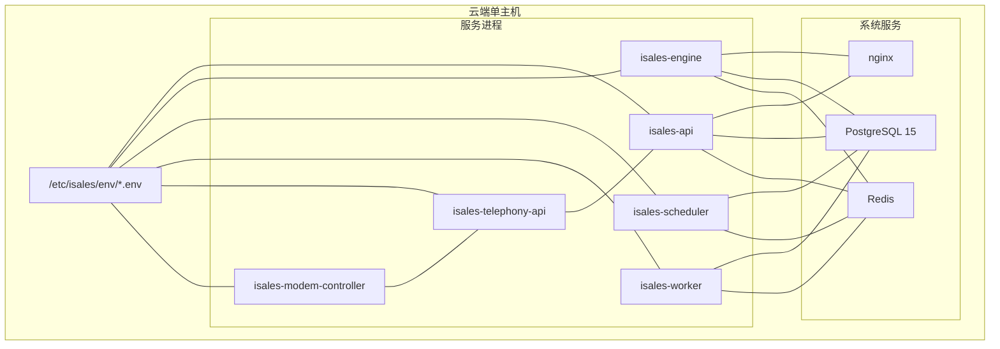
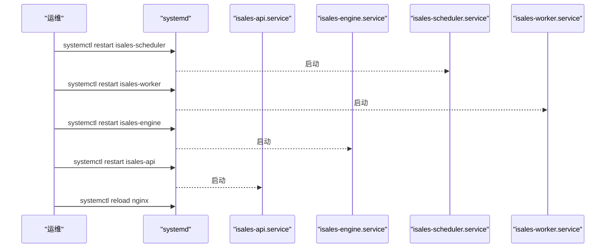
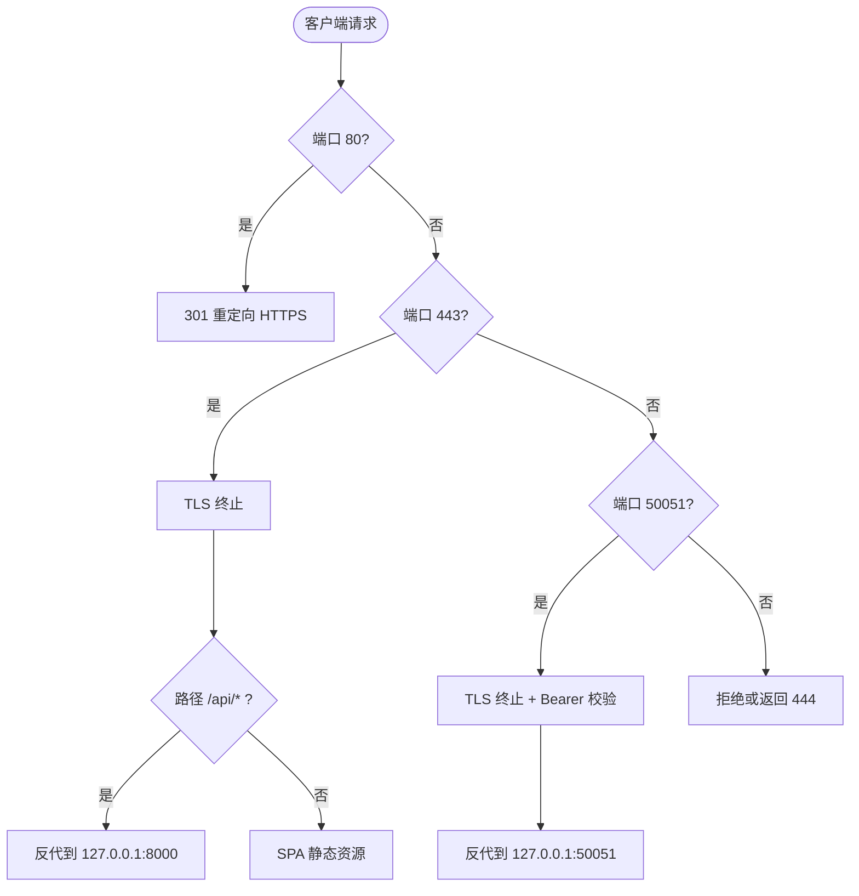
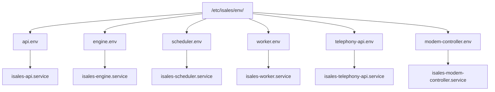
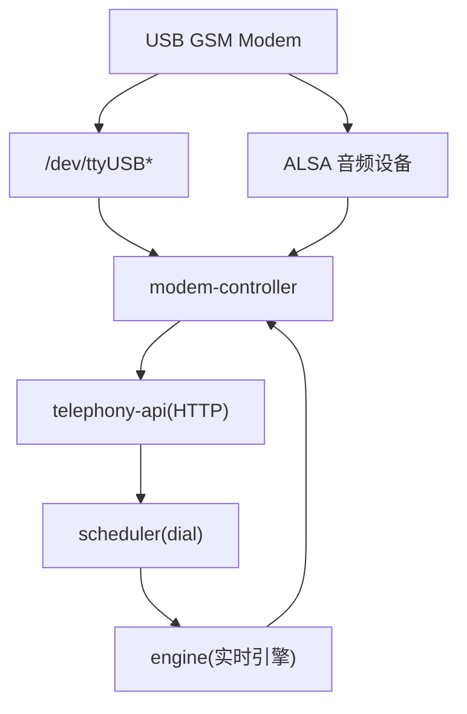
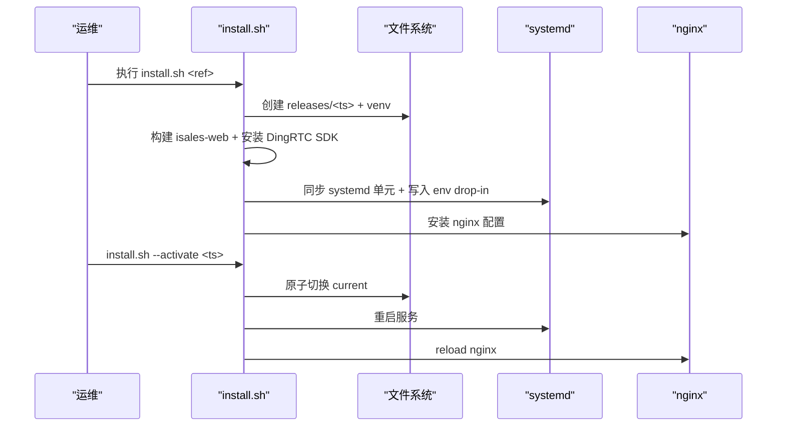
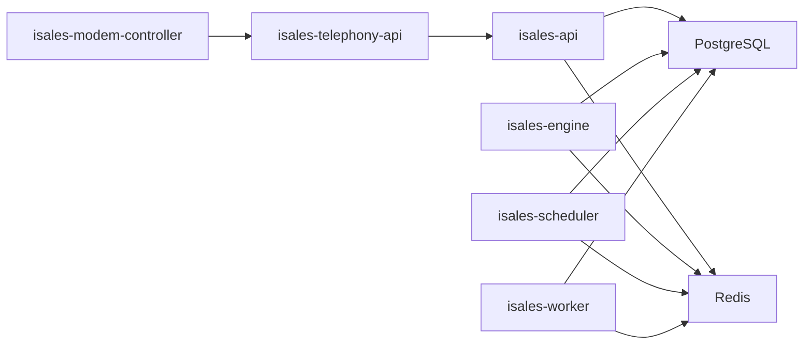
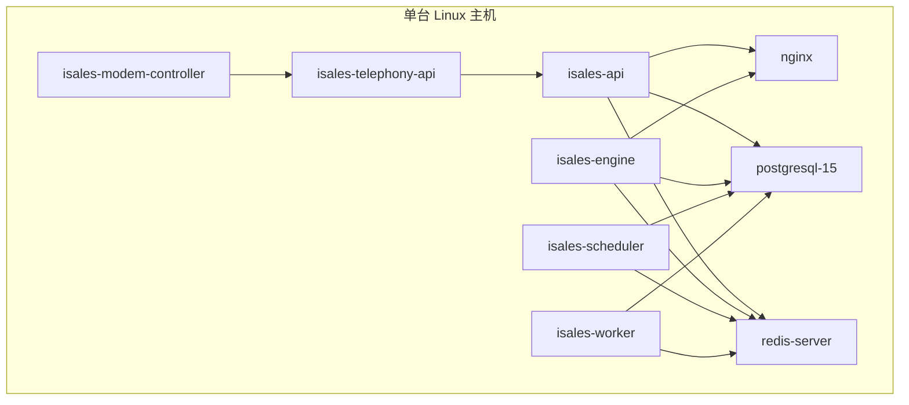

# 部署拓扑设计

<cite>
**本文引用的文件**
- [openspec/specs/deployment-topology/spec.md](file://openspec/specs/deployment-topology/spec.md)
- [openspec/specs/device-hardware/spec.md](file://openspec/specs/device-hardware/spec.md)
- [deploy/README.md](file://deploy/README.md)
- [deploy/cloud/README.md](file://deploy/cloud/README.md)
- [deploy/edge/README.md](file://deploy/edge/README.md)
- [deploy/cloud/systemd/isales-api.service](file://deploy/cloud/systemd/isales-api.service)
- [deploy/cloud/systemd/isales-engine.service](file://deploy/cloud/systemd/isales-engine.service)
- [deploy/cloud/systemd/isales-scheduler.service](file://deploy/cloud/systemd/isales-scheduler.service)
- [deploy/cloud/systemd/isales-worker.service](file://deploy/cloud/systemd/isales-worker.service)
- [deploy/cloud/nginx/isales.conf](file://deploy/cloud/nginx/isales.conf)
- [deploy/cloud/scripts/install.sh](file://deploy/cloud/scripts/install.sh)
- [deploy/env/api.env.example](file://deploy/env/api.env.example)
- [deploy/env/engine.env.example](file://deploy/env/engine.env.example)
- [deploy/env/scheduler.env.example](file://deploy/env/scheduler.env.example)
- [deploy/env/worker.env.example](file://deploy/env/worker.env.example)
</cite>

## 目录
1. [简介](#简介)
2. [项目结构](#项目结构)
3. [核心组件](#核心组件)
4. [架构总览](#架构总览)
5. [详细组件分析](#详细组件分析)
6. [依赖分析](#依赖分析)
7. [性能考量](#性能考量)
8. [故障排查指南](#故障排查指南)
9. [结论](#结论)
10. [附录](#附录)

## 简介
本文件面向 iSales v1 单主机部署模型，系统化阐述 7 个服务在同一台 Linux 主机上的部署拓扑、进程隔离与资源分配策略、USB GSM Modem 的物理部署与连接方式、systemd 单元文件配置与管理、以及从 v1 向 v2 多主机扩展的规划与设计考虑。文档同时提供部署拓扑图、实际部署示例与部署检查清单，帮助运维与工程团队安全、可重复地完成上线与日常维护。

## 项目结构
v1 部署采用“单主机 + systemd”模型，7 个服务通过 systemd 管理，PostgreSQL 与 Redis 作为系统服务运行，nginx 作为 isales-web 静态资源与 isales-api 的反向代理。集中化环境变量通过 systemd EnvironmentFile 注入，确保跨服务一致性与安全性。

**图表来源**
- [deploy/README.md:14-49](file://deploy/README.md#L14-L49)

**章节来源**
- [deploy/README.md:1-112](file://deploy/README.md#L1-L112)
- [openspec/specs/deployment-topology/spec.md:3-42](file://openspec/specs/deployment-topology/spec.md#L3-L42)

## 核心组件
- 服务进程与职责
  - isales-api：HTTP + WebSocket，提供 Web 管理端与实时推送。
  - isales-engine：实时通话引擎、cloud-edge gRPC 服务端、音视频桥接。
  - isales-scheduler：线索调度器，定时批处理与并发控制。
  - isales-worker：异步后处理（回调重试、指标采集等）。
  - isales-telephony-api：设备/卡管理的 HTTP 服务。
  - isales-modem-controller：USB GSM Modem 守护进程，负责 AT 命令、音频与设备状态。
- 系统服务
  - PostgreSQL 15：应用数据库。
  - Redis：缓存与队列。
  - nginx：SPA 静态资源与 API/gRPC 反向代理。
- 集中化环境变量
  - 每个服务通过 /etc/isales/env/<service>.env 注入，权限 0640 root:isales，避免明文密钥进入版本库。

**章节来源**
- [openspec/specs/deployment-topology/spec.md:62-70](file://openspec/specs/deployment-topology/spec.md#L62-L70)
- [openspec/specs/deployment-topology/spec.md:40-61](file://openspec/specs/deployment-topology/spec.md#L40-L61)
- [deploy/README.md:41-48](file://deploy/README.md#L41-L48)

## 架构总览
v1 单主机部署采用“集中式服务 + 本地硬件”的架构。7 个服务在同一主机上运行，通过 systemd 管理生命周期与资源隔离；数据库与缓存作为系统服务提供；nginx 作为统一入口承载 Web SPA 与 API/gRPC 流量。

**图表来源**
- [deploy/README.md:14-49](file://deploy/README.md#L14-L49)
- [deploy/cloud/nginx/isales.conf:1-103](file://deploy/cloud/nginx/isales.conf#L1-L103)

**章节来源**
- [deploy/README.md:12-49](file://deploy/README.md#L12-L49)
- [deploy/cloud/nginx/isales.conf:1-103](file://deploy/cloud/nginx/isales.conf#L1-L103)

## 详细组件分析

### systemd 单元文件与进程隔离
- 进程隔离策略
  - 每个服务运行在独立 systemd 单元中，拥有独立 User/Group、WorkingDirectory、Restart 策略与 TimeoutStopSec。
  - 通过 NoNewPrivileges、ProtectSystem、ProtectHome、PrivateTmp、RestrictAddressFamilies 等字段强化安全边界。
  - isales-engine 需要访问 DingRTC SDK 共享库，通过环境变量注入 LD_LIBRARY_PATH 与 PYTHONPATH。
- 环境变量注入
  - 通过 EnvironmentFile=/etc/isales/env/<service>.env 注入，避免在单元文件中硬编码敏感信息。
- 启停顺序
  - 重启顺序：isales-telephony-api → isales-scheduler → isales-worker → isales-engine → isales-api；nginx 采用 reload 而非 restart。

**图表来源**
- [openspec/specs/deployment-topology/spec.md:66-69](file://openspec/specs/deployment-topology/spec.md#L66-L69)
- [deploy/cloud/systemd/isales-api.service:1-35](file://deploy/cloud/systemd/isales-api.service#L1-L35)
- [deploy/cloud/systemd/isales-engine.service:1-42](file://deploy/cloud/systemd/isales-engine.service#L1-L42)
- [deploy/cloud/systemd/isales-scheduler.service:1-31](file://deploy/cloud/systemd/isales-scheduler.service#L1-L31)
- [deploy/cloud/systemd/isales-worker.service:1-31](file://deploy/cloud/systemd/isales-worker.service#L1-L31)

**章节来源**
- [openspec/specs/deployment-topology/spec.md:62-75](file://openspec/specs/deployment-topology/spec.md#L62-L75)
- [deploy/cloud/systemd/isales-api.service:6-35](file://deploy/cloud/systemd/isales-api.service#L6-L35)
- [deploy/cloud/systemd/isales-engine.service:8-42](file://deploy/cloud/systemd/isales-engine.service#L8-L42)
- [deploy/cloud/systemd/isales-scheduler.service:6-31](file://deploy/cloud/systemd/isales-scheduler.service#L6-L31)
- [deploy/cloud/systemd/isales-worker.service:6-31](file://deploy/cloud/systemd/isales-worker.service#L6-L31)

### nginx 反向代理与入口流量
- 监听与分流
  - 443 HTTPS：反代 isales-web 静态资源与 /api 前缀到 isales-api :8000。
  - 50051 gRPC：TLS 终止后转发到 isales-engine :50051，Bearer Token 由 engine 校验。
  - 80 HTTP：301 重定向至 HTTPS。
- WebSocket 支持
  - /api/ws/ 透传 Upgrade/Connection 头，支持实时 UI 更新。
- 配置模板与域名替换
  - 通过 install.sh 将 __ISALES_DOMAIN__ 替换为实际域名并启用站点。

**图表来源**
- [deploy/cloud/nginx/isales.conf:1-103](file://deploy/cloud/nginx/isales.conf#L1-L103)

**章节来源**
- [deploy/cloud/nginx/isales.conf:1-103](file://deploy/cloud/nginx/isales.conf#L1-L103)

### 集中化环境变量与一致性约束
- 环境文件覆盖范围
  - 每个服务的 EnvironmentFile 列出该服务所需全部变量，确保无默认值时也能启动。
- 跨服务一致性
  - ISALES_DATABASE_URL、ISALES_REDIS_URL、ISALES_JWT_SECRET（api 与 telephony-api）需在多服务中保持一致。
- 示例模板
  - api.env、engine.env、scheduler.env、worker.env 提供默认值与注释，便于运维编辑。

**图表来源**
- [openspec/specs/deployment-topology/spec.md:40-61](file://openspec/specs/deployment-topology/spec.md#L40-L61)
- [deploy/env/api.env.example:1-14](file://deploy/env/api.env.example#L1-L14)
- [deploy/env/engine.env.example:1-21](file://deploy/env/engine.env.example#L1-L21)
- [deploy/env/scheduler.env.example:1-21](file://deploy/env/scheduler.env.example#L1-L21)
- [deploy/env/worker.env.example:1-20](file://deploy/env/worker.env.example#L1-L20)

**章节来源**
- [openspec/specs/deployment-topology/spec.md:40-61](file://openspec/specs/deployment-topology/spec.md#L40-L61)
- [deploy/env/api.env.example:1-14](file://deploy/env/api.env.example#L1-L14)
- [deploy/env/engine.env.example:1-21](file://deploy/env/engine.env.example#L1-L21)
- [deploy/env/scheduler.env.example:1-21](file://deploy/env/scheduler.env.example#L1-L21)
- [deploy/env/worker.env.example:1-20](file://deploy/env/worker.env.example#L1-L20)

### USB GSM Modem 的物理部署与连接
- 物理位置与连接
  - USB GSM Modem 通过 USB 接口直连主机，设备在 Linux 下通常出现在 /dev/ttyUSB*。
  - 音频路径：Modem Speaker/Mic 通过 ALSA 与系统声音设备交互。
- 进程职责
  - modem-controller 负责 udev 监听、AT 命令通道与 PCM 音频管道，向上游 engine 提供设备状态与事件。
- 选号与状态机
  - telephony-api 暴露 /devices/select，按 idle 且绑定激活的 SIM 的设备进行负载均衡选择。
  - 设备状态机覆盖 unknown/detected/registered/idle/dialing/in_call/offline/flagged/error 等状态。

**图表来源**
- [openspec/specs/device-hardware/spec.md:26-68](file://openspec/specs/device-hardware/spec.md#L26-L68)
- [openspec/specs/device-hardware/spec.md:171-193](file://openspec/specs/device-hardware/spec.md#L171-L193)

**章节来源**
- [openspec/specs/device-hardware/spec.md:3-525](file://openspec/specs/device-hardware/spec.md#L3-L525)

### 部署脚本与原子发布
- install.sh 流程
  - 创建 release 目录 → 克隆/检出代码 → 创建共享 venv → 构建 isales-web → 安装 DingRTC SDK 与绑定 → 同步 systemd 单元 → 写入环境变量 drop-in → 可选激活 current。
- 原子发布与回滚
  - 通过 ln -sfn 原子切换 /opt/isales/current，失败不影响当前运行；rollback.sh 仅切回历史 release 并重启服务，不自动降级数据库 schema。

**图表来源**
- [deploy/cloud/scripts/install.sh:1-300](file://deploy/cloud/scripts/install.sh#L1-L300)

**章节来源**
- [deploy/cloud/scripts/install.sh:20-300](file://deploy/cloud/scripts/install.sh#L20-L300)
- [openspec/specs/deployment-topology/spec.md:114-132](file://openspec/specs/deployment-topology/spec.md#L114-L132)

### 多主机扩展到 v2 的规划与设计考虑
- v1 限制
  - 单主机 ≤8 路并发，不引入开源 PBX；多主机扩展列入 v2。
- v2 规划要点
  - 服务拆分：将 telephony-api 与 modem-controller 从单主机迁移到边缘节点（macOS/Windows），云端仅保留 api/engine/scheduler/worker。
  - 通信：cloud-edge gRPC 双向流，边缘设备通过 mTLS 风格的 Bearer Token 认证。
  - 资源：边缘设备仅保留必要的音频桥接与本地缓存，云端集中化数据库与缓存。
  - 可观测性：完善 /metrics 端点与告警规则，dashboard 展示关键指标。

**章节来源**
- [openspec/specs/deployment-topology/spec.md:21-25](file://openspec/specs/deployment-topology/spec.md#L21-L25)
- [openspec/specs/deployment-topology/spec.md:133-150](file://openspec/specs/deployment-topology/spec.md#L133-L150)
- [openspec/specs/deployment-topology/spec.md:95-113](file://openspec/specs/deployment-topology/spec.md#L95-L113)

## 依赖分析
- 服务间依赖
  - isales-api 依赖 PostgreSQL 与 Redis；isales-engine 同时依赖数据库与缓存，并通过 gRPC 与边缘设备通信。
  - isales-scheduler 与 isales-worker 依赖数据库与缓存，用于任务调度与异步处理。
- 系统依赖
  - Ubuntu 22.04 LTS（amd64），系统包包括 postgresql-15、redis-server、nginx、python3.12、nodejs、libudev-dev、libasound2-dev 等。
- 环境变量一致性
  - 跨服务的数据库 URL、缓存 URL、JWT Secret 等必须保持一致，防止连接风暴与鉴权失败。

**图表来源**
- [openspec/specs/deployment-topology/spec.md:49-56](file://openspec/specs/deployment-topology/spec.md#L49-L56)
- [deploy/README.md:51-60](file://deploy/README.md#L51-L60)

**章节来源**
- [openspec/specs/deployment-topology/spec.md:49-56](file://openspec/specs/deployment-topology/spec.md#L49-L56)
- [deploy/README.md:51-60](file://deploy/README.md#L51-L60)

## 性能考量
- 进程隔离与资源限制
  - 通过 systemd 的 RestartSec、TimeoutStopSec、RestrictAddressFamilies 等字段降低资源争用与启动风暴风险。
- 网络与 I/O
  - nginx 代理层优化超时与连接参数，避免 API 重启导致的长时间阻塞。
- 音频与实时性
  - modem-controller 的 PCM 音频路径与 ALSA 交互，需关注延迟与吞吐；engine 的 gRPC 流与 WebSocket 保持低延迟。

[本节为通用指导，无需特定文件来源]

## 故障排查指南
- systemd 服务状态
  - 使用 journalctl -u <service>.service 查看日志；systemctl status <service> 检查运行状态。
- 环境变量校验
  - 确认 /etc/isales/env/*.env 权限为 0640 root:isales，变量值与服务 README 一致。
- 数据库与缓存
  - 检查 PostgreSQL 与 Redis 是否正常监听；确认 alembic 迁移状态。
- nginx 代理
  - 使用 nginx -t 检查配置语法；查看 /var/log/nginx/error.log 与 access.log。
- 回滚操作
  - 使用 rollback.sh 切回历史 release，确保 schema 不被自动降级。

**章节来源**
- [openspec/specs/deployment-topology/spec.md:114-132](file://openspec/specs/deployment-topology/spec.md#L114-L132)

## 结论
v1 单主机部署通过 systemd 管理 7 个核心服务，结合集中化环境变量与 nginx 代理，形成高内聚、低耦合的本地化架构。USB GSM Modem 与本地硬件紧密集成，满足实时通话场景的低延迟需求。随着业务增长，v2 将采用云-边分离的多主机模型，进一步提升可扩展性与可靠性。

[本节为总结，无需特定文件来源]

## 附录

### 部署拓扑图（v1 单主机）

**图表来源**
- [deploy/README.md:14-49](file://deploy/README.md#L14-L49)

### 实际部署示例（最小命令序列）
- 准备主机与依赖
  - sudo bash deploy/linux/scripts/provision.sh
- 编辑集中化环境变量
  - sudoedit /etc/isales/env/api.env
  - sudoedit /etc/isales/env/engine.env
  - sudoedit /etc/isales/env/scheduler.env
  - sudoedit /etc/isales/env/worker.env
- 安装新发布版本
  - sudo -u isales bash deploy/linux/scripts/install.sh v0.1.0
- 数据库迁移
  - sudo -u isales bash deploy/linux/scripts/migrate.sh
- 切换 current 并重启服务
  - sudo bash deploy/linux/scripts/deploy.sh <release-ts>

**章节来源**
- [deploy/README.md:61-81](file://deploy/README.md#L61-L81)

### 部署检查清单
- 主机与依赖
  - Ubuntu 22.04 LTS（amd64），安装 postgresql-15、redis-server、nginx、python3.12、nodejs、libudev-dev、libasound2-dev。
  - 创建系统用户 isales:isales（无 shell）。
- 环境变量
  - /etc/isales/env/*.env 权限 0640 root:isales，变量值一致。
- 服务状态
  - systemctl is-active/--failed 检查 7 个服务与 nginx。
- 数据库与缓存
  - psql 与 redis-cli 连接测试；确认 alembic 迁移状态。
- nginx 配置
  - nginx -t；检查站点启用与日志。
- 回滚路径
  - rollback.sh 可用且可回滚至历史版本。

**章节来源**
- [deploy/README.md:51-60](file://deploy/README.md#L51-L60)
- [openspec/specs/deployment-topology/spec.md:114-132](file://openspec/specs/deployment-topology/spec.md#L114-L132)