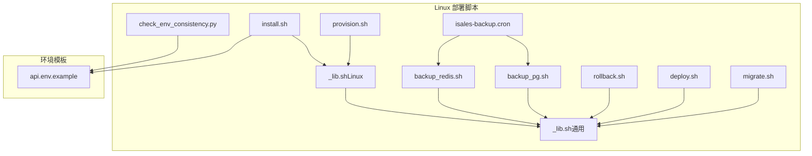
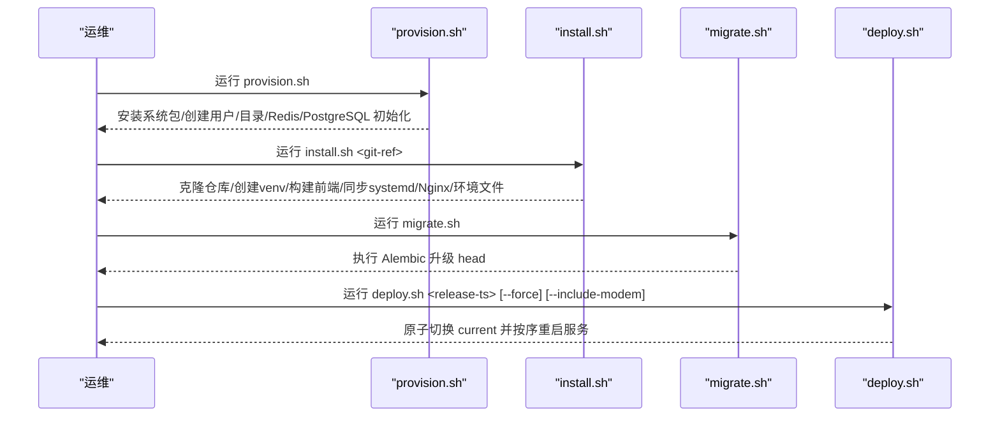
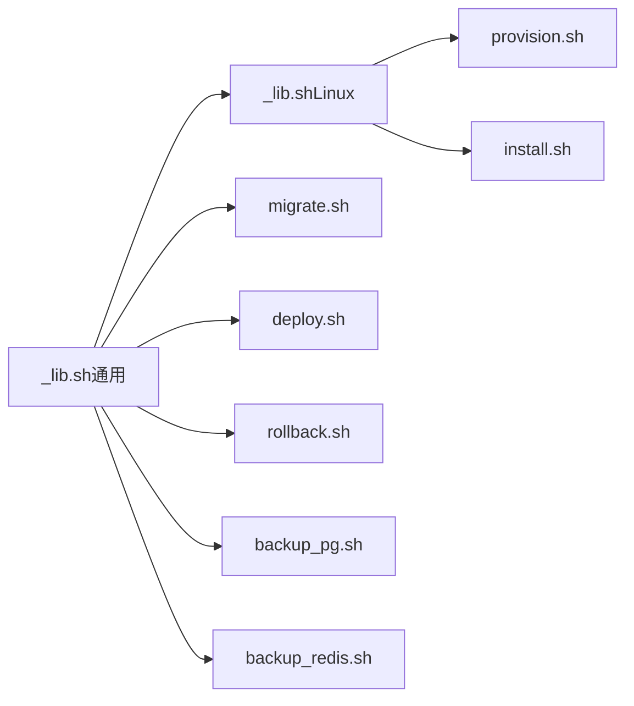

# Linux 部署

<cite>
**本文引用的文件**
- [provision.sh](file://deploy/linux/scripts/provision.sh)
- [_lib.sh（Linux）](file://deploy/linux/scripts/_lib.sh)
- [_lib.sh（通用）](file://deploy/common/_lib.sh)
- [install.sh](file://deploy/linux/scripts/install.sh)
- [deploy.sh](file://deploy/linux/scripts/deploy.sh)
- [migrate.sh](file://deploy/linux/scripts/migrate.sh)
- [rollback.sh](file://deploy/linux/scripts/rollback.sh)
- [backup_pg.sh](file://deploy/linux/scripts/backup_pg.sh)
- [backup_redis.sh](file://deploy/linux/scripts/backup_redis.sh)
- [isales-backup.cron](file://deploy/cron/isales-backup.cron)
- [check_env_consistency.py](file://deploy/linux/scripts/check_env_consistency.py)
- [api.env.example](file://deploy/env/api.env.example)
</cite>

## 目录
1. [简介](#简介)
2. [项目结构](#项目结构)
3. [核心组件](#核心组件)
4. [架构总览](#架构总览)
5. [详细组件分析](#详细组件分析)
6. [依赖分析](#依赖分析)
7. [性能考虑](#性能考虑)
8. [故障排查指南](#故障排查指南)
9. [结论](#结论)
10. [附录](#附录)

## 简介
本指南面向在 Ubuntu 22.04 LTS 上部署 iSales v1 的运维与开发人员，提供从一次性主机准备到七项服务安装、数据库迁移与部署切换的完整流程说明。文档覆盖以下关键主题：
- 一次性 provision 步骤：系统包、用户与目录结构、Redis AOF、PostgreSQL 角色/库与初始密钥生成
- 七项服务安装：构建发布、虚拟环境、前端构建、systemd 单元与环境文件、Nginx 配置、备份计划
- 数据库迁移与部署切换：Alembic 迁移、原子性切换 current 符号链接、按依赖顺序重启服务
- 部署脚本功能、参数与使用方法
- 系统依赖、Python 环境与 Node.js 构建流程
- 目录结构、符号链接管理与版本控制机制
- 环境变量配置、服务启动顺序与故障排查
- 完整部署命令序列与最佳实践建议

## 项目结构
Linux 部署相关脚本位于 deploy/linux/scripts，配套的通用逻辑位于 deploy/common/_lib.sh；环境模板位于 deploy/env；备份计划位于 deploy/cron。

图表来源
- [provision.sh:1-224](file://deploy/linux/scripts/provision.sh#L1-L224)
- [install.sh:1-275](file://deploy/linux/scripts/install.sh#L1-L275)
- [migrate.sh:1-61](file://deploy/linux/scripts/migrate.sh#L1-L61)
- [deploy.sh:1-139](file://deploy/linux/scripts/deploy.sh#L1-L139)
- [rollback.sh:1-114](file://deploy/linux/scripts/rollback.sh#L1-L114)
- [backup_pg.sh:1-50](file://deploy/linux/scripts/backup_pg.sh#L1-L50)
- [backup_redis.sh:1-61](file://deploy/linux/scripts/backup_redis.sh#L1-L61)
- [isales-backup.cron:1-14](file://deploy/cron/isales-backup.cron#L1-L14)
- [_lib.sh（Linux）:1-47](file://deploy/linux/scripts/_lib.sh#L1-L47)
- [_lib.sh（通用）:1-181](file://deploy/common/_lib.sh#L1-L181)
- [check_env_consistency.py:1-161](file://deploy/linux/scripts/check_env_consistency.py#L1-L161)
- [api.env.example:1-14](file://deploy/env/api.env.example#L1-L14)

章节来源
- [provision.sh:1-224](file://deploy/linux/scripts/provision.sh#L1-L224)
- [install.sh:1-275](file://deploy/linux/scripts/install.sh#L1-L275)
- [deploy.sh:1-139](file://deploy/linux/scripts/deploy.sh#L1-L139)
- [migrate.sh:1-61](file://deploy/linux/scripts/migrate.sh#L1-L61)
- [rollback.sh:1-114](file://deploy/linux/scripts/rollback.sh#L1-L114)
- [backup_pg.sh:1-50](file://deploy/linux/scripts/backup_pg.sh#L1-L50)
- [backup_redis.sh:1-61](file://deploy/linux/scripts/backup_redis.sh#L1-L61)
- [isales-backup.cron:1-14](file://deploy/cron/isales-backup.cron#L1-L14)
- [_lib.sh（Linux）:1-47](file://deploy/linux/scripts/_lib.sh#L1-L47)
- [_lib.sh（通用）:1-181](file://deploy/common/_lib.sh#L1-L181)
- [check_env_consistency.py:1-161](file://deploy/linux/scripts/check_env_consistency.py#L1-L161)
- [api.env.example:1-14](file://deploy/env/api.env.example#L1-L14)

## 核心组件
- provision.sh：一次性主机准备，安装系统包、创建系统用户与目录、启用 Redis AOF、初始化 PostgreSQL 角色/库与密钥，并可选安装 udev 规则
- install.sh：构建新发布版本，克隆/更新七个仓库、创建共享 venv、安装 Python 包、构建前端、同步 systemd 单元与 Nginx 配置、写入环境文件 drop-in、安装备份计划
- migrate.sh：对当前发布运行 Alembic 升级 head
- deploy.sh：原子切换 current 符号链接并按依赖顺序重启服务，支持低峰窗口与强制模式
- rollback.sh：回滚到指定发布版本，不触碰数据库模式
- 备份脚本与计划：每日定时备份 PostgreSQL 与 Redis，保留 14 天
- 通用与 Linux 脚本库：日志、参数解析、权限校验、执行器、环境模板引导等

章节来源
- [provision.sh:1-224](file://deploy/linux/scripts/provision.sh#L1-L224)
- [install.sh:1-275](file://deploy/linux/scripts/install.sh#L1-L275)
- [migrate.sh:1-61](file://deploy/linux/scripts/migrate.sh#L1-L61)
- [deploy.sh:1-139](file://deploy/linux/scripts/deploy.sh#L1-L139)
- [rollback.sh:1-114](file://deploy/linux/scripts/rollback.sh#L1-L114)
- [backup_pg.sh:1-50](file://deploy/linux/scripts/backup_pg.sh#L1-L50)
- [backup_redis.sh:1-61](file://deploy/linux/scripts/backup_redis.sh#L1-L61)
- [isales-backup.cron:1-14](file://deploy/cron/isales-backup.cron#L1-L14)
- [_lib.sh（Linux）:1-47](file://deploy/linux/scripts/_lib.sh#L1-L47)
- [_lib.sh（通用）:1-181](file://deploy/common/_lib.sh#L1-L181)

## 架构总览
下图展示一次完整部署的端到端流程：从主机准备、构建发布、数据库迁移，到部署切换与服务重启。

图表来源
- [provision.sh:1-224](file://deploy/linux/scripts/provision.sh#L1-L224)
- [install.sh:1-275](file://deploy/linux/scripts/install.sh#L1-L275)
- [migrate.sh:1-61](file://deploy/linux/scripts/migrate.sh#L1-L61)
- [deploy.sh:1-139](file://deploy/linux/scripts/deploy.sh#L1-L139)

## 详细组件分析

### provision.sh（一次性主机准备）
- 功能要点
  - 系统包安装：PostgreSQL 15、Redis、Nginx、Git、pkg-config、libudev-dev、libasound2-dev、Python 3.12、Node.js、npm、curl、ca-certificates
  - 创建系统用户 isales（无登录 shell），用于隔离服务运行
  - 创建目录骨架：/opt/isales/releases、/opt/isales/backups、/opt/isales/logs、/etc/isales/env、/var/run/isales
  - 配置 Redis AOF：写入 include 指令与 isales.conf，启用 AOF 并按需 reload/restart
  - 初始化 PostgreSQL：创建角色 isales 与数据库 isales；生成随机密钥（JWT、Fernet）并写入各服务的环境模板
  - 可选安装 udev 规则（--with-modem），需要先完成 install.sh 以生成规则源
- 关键行为
  - 幂等：重复运行不会重置已有密钥或重新安装包
  - dry-run：仅打印将要执行的操作
  - 权限：必须以 root 或 sudo 运行
- 使用示例
  - 基础：sudo bash deploy/linux/scripts/provision.sh
  - 同时安装调制解调器 udev 规则：sudo bash deploy/linux/scripts/provision.sh --with-modem
  - 仅预览变更：sudo bash deploy/linux/scripts/provision.sh --dry-run

章节来源
- [provision.sh:1-224](file://deploy/linux/scripts/provision.sh#L1-L224)
- [_lib.sh（Linux）:17-33](file://deploy/linux/scripts/_lib.sh#L17-L33)
- [_lib.sh（通用）:145-180](file://deploy/common/_lib.sh#L145-L180)

### install.sh（构建与安装发布）
- 功能要点
  - 解析参数：git-ref 必填；支持 --dry-run
  - 创建发布目录 /opt/isales/releases/<timestamp>，并设置 isales 用户权限
  - 克隆/更新七个仓库至指定 git-ref（默认来自环境变量，可覆盖）
  - 创建共享 venv 并安装 isales-common 与五个服务（按约定顺序）
  - 构建前端：npm ci 与 npm run build，产出 dist/
  - 同步 systemd 单元：重写 ExecStart 与 WorkingDirectory，指向 current/，并执行 daemon-reload
  - 同步 Nginx 配置：安装 sites-available 并建立 /var/www/isales-web 符号链接，启用站点
  - 写入 EnvironmentFile drop-in：统一从 /etc/isales/env/ 加载环境变量
  - 安装备份计划：复制 /etc/cron.d/isales-backup
- 关键行为
  - 不修改 current 符号链接，交由 deploy.sh 执行
  - 失败清理：捕获退出码并在创建目录后清理不完整发布目录
  - dry-run：仅打印将要执行的操作
  - 权限：必须以 root 或 sudo 运行
- 使用示例
  - sudo bash deploy/linux/scripts/install.sh v0.1.0
  - sudo bash deploy/linux/scripts/install.sh main --dry-run
- 环境变量
  - ISALES_GIT_BASE：默认 https://github.com/tommax-bai
  - ISALES_REPOS：空格分隔的仓库列表，默认七个标准仓库

章节来源
- [install.sh:1-275](file://deploy/linux/scripts/install.sh#L1-L275)
- [_lib.sh（Linux）:35-38](file://deploy/linux/scripts/_lib.sh#L35-L38)
- [_lib.sh（通用）:107-115](file://deploy/common/_lib.sh#L107-L115)

### migrate.sh（数据库迁移）
- 功能要点
  - 读取 /etc/isales/env/api.env 中的 ISALES_DATABASE_URL
  - 在 /opt/isales/current/venv/bin/ 下执行 alembic -c isales-common/alembic.ini upgrade head
  - 支持 --dry-run：打印历史记录（history -i）
- 关键行为
  - 仅对当前发布执行迁移
  - 依赖已安装的 venv 与 alembic.ini
  - 权限：必须以 root 或 sudo 运行
- 使用示例
  - sudo bash deploy/linux/scripts/migrate.sh
  - sudo bash deploy/linux/scripts/migrate.sh --dry-run

章节来源
- [migrate.sh:1-61](file://deploy/linux/scripts/migrate.sh#L1-L61)

### deploy.sh（部署切换与重启）
- 功能要点
  - 原子切换 /opt/isales/current 指向目标发布
  - 低峰窗口检查：默认 22:00–08:00，非低峰需 --force
  - 重启顺序（按依赖）：isales-telephony-api → isales-scheduler → isales-worker → isales-engine → isales-api
  - Nginx：验证配置并 reload
  - 可选重启 isales-modem-controller（--include-modem）
- 关键行为
  - 通过 systemctl is-active 检查重启结果，失败时输出最近日志
  - 支持 --dry-run 与 --force
  - 权限：必须以 root 或 sudo 运行
- 使用示例
  - sudo bash deploy/linux/scripts/deploy.sh <release-ts>
  - sudo bash deploy/linux/scripts/deploy.sh <release-ts> --force --dry-run
  - sudo bash deploy/linux/scripts/deploy.sh <release-ts> --include-modem

章节来源
- [deploy.sh:1-139](file://deploy/linux/scripts/deploy.sh#L1-L139)

### rollback.sh（回滚）
- 功能要点
  - 列出可用发布：--list
  - 回滚到指定发布：切换 current 并按顺序重启服务
  - 可选重启 isales-modem-controller（--include-modem）
  - 不触碰数据库模式（如需降级请参考 RUNBOOK）
- 关键行为
  - 交互确认（除非 --force）
  - 权限：必须以 root 或 sudo 运行
- 使用示例
  - sudo bash deploy/linux/scripts/rollback.sh --list
  - sudo bash deploy/linux/scripts/rollback.sh <release-ts>
  - sudo bash deploy/linux/scripts/rollback.sh <release-ts> --force --dry-run

章节来源
- [rollback.sh:1-114](file://deploy/linux/scripts/rollback.sh#L1-L114)

### 备份脚本与计划
- backup_pg.sh
  - 通过 pg_dump 导出自定义格式，gzip 压缩，输出到 /opt/isales/backups/pg/YYYY-MM-DD.sql.gz
  - 从 /etc/isales/env/api.env 读取 ISALES_DATABASE_URL（剥离 asyncpg 前缀）
  - 默认保留 14 天，可通过 ISALES_PG_BACKUP_RETAIN 覆盖
- backup_redis.sh
  - 通过 redis-cli --rdb 远程拉取 RDB，gzip 压缩，输出到 /opt/isales/backups/redis/YYYY-MM-DD.rdb.gz
  - 从 /etc/isales/env/api.env 读取 ISALES_REDIS_URL，解析 host/port
  - 默认保留 14 天，可通过 ISALES_REDIS_BACKUP_RETAIN 覆盖
- isales-backup.cron
  - 每日 02:30 执行备份脚本，日志标签 isales-backup

章节来源
- [backup_pg.sh:1-50](file://deploy/linux/scripts/backup_pg.sh#L1-L50)
- [backup_redis.sh:1-61](file://deploy/linux/scripts/backup_redis.sh#L1-L61)
- [isales-backup.cron:1-14](file://deploy/cron/isales-backup.cron#L1-L14)

### 环境变量与一致性检查
- 环境模板位置：/etc/isales/env/*.env（由 provision.sh 与 install.sh 写入）
- api.env.example 展示了跨服务共享的关键变量（数据库 URL、Redis URL、JWT 密钥、管理员凭据）
- check_env_consistency.py：校验 deploy/env/<service>.env.example 与各服务 README 中声明的环境变量是否一致，允许少量额外变量

章节来源
- [api.env.example:1-14](file://deploy/env/api.env.example#L1-L14)
- [check_env_consistency.py:1-161](file://deploy/linux/scripts/check_env_consistency.py#L1-L161)

## 依赖分析
- 组件内聚与耦合
  - Linux 脚本库（_lib.sh（Linux））依赖通用脚本库（_lib.sh（通用）），提供日志、参数解析、执行器、环境模板引导等
  - install.sh 依赖 Linux 脚本库中的包列表与模板目录常量
  - provision.sh 依赖 Linux 脚本库中的包列表与模板目录常量
  - 备份脚本依赖 /etc/isales/env/* 读取数据库与缓存连接信息
- 外部依赖
  - PostgreSQL 15、Redis、Nginx、Git、Python 3.12、Node.js、npm、curl、ca-certificates
  - systemd、systemctl、nginx、pg_dump、redis-cli
- 循环依赖
  - 无直接循环依赖；脚本间通过共享库与文件系统交互

图表来源
- [_lib.sh（通用）:1-181](file://deploy/common/_lib.sh#L1-L181)
- [_lib.sh（Linux）:1-47](file://deploy/linux/scripts/_lib.sh#L1-L47)
- [provision.sh:1-224](file://deploy/linux/scripts/provision.sh#L1-L224)
- [install.sh:1-275](file://deploy/linux/scripts/install.sh#L1-L275)
- [migrate.sh:1-61](file://deploy/linux/scripts/migrate.sh#L1-L61)
- [deploy.sh:1-139](file://deploy/linux/scripts/deploy.sh#L1-L139)
- [rollback.sh:1-114](file://deploy/linux/scripts/rollback.sh#L1-L114)
- [backup_pg.sh:1-50](file://deploy/linux/scripts/backup_pg.sh#L1-L50)
- [backup_redis.sh:1-61](file://deploy/linux/scripts/backup_redis.sh#L1-L61)

章节来源
- [_lib.sh（通用）:1-181](file://deploy/common/_lib.sh#L1-L181)
- [_lib.sh（Linux）:1-47](file://deploy/linux/scripts/_lib.sh#L1-L47)
- [provision.sh:1-224](file://deploy/linux/scripts/provision.sh#L1-L224)
- [install.sh:1-275](file://deploy/linux/scripts/install.sh#L1-L275)
- [migrate.sh:1-61](file://deploy/linux/scripts/migrate.sh#L1-L61)
- [deploy.sh:1-139](file://deploy/linux/scripts/deploy.sh#L1-L139)
- [rollback.sh:1-114](file://deploy/linux/scripts/rollback.sh#L1-L114)
- [backup_pg.sh:1-50](file://deploy/linux/scripts/backup_pg.sh#L1-L50)
- [backup_redis.sh:1-61](file://deploy/linux/scripts/backup_redis.sh#L1-L61)

## 性能考虑
- 发布构建阶段
  - 使用深度克隆（--depth 50）减少网络与磁盘占用
  - 共享 venv 减少重复安装开销
  - 前端构建使用 npm ci 保证依赖锁定
- 运行时重启
  - 严格的服务重启顺序避免相互等待导致的启动时间延长
  - Nginx reload 而非 restart，降低中断时间
- 备份策略
  - 异步导出与压缩，结合保留策略控制磁盘占用

## 故障排查指南
- 权限问题
  - 所有部署脚本均需 root 或 sudo 权限；若提示缺少命令，请检查 provision 步骤是否完成
- 低峰窗口拒绝
  - 非低峰时间部署引擎会因重启丢话务而被拒绝；如确需在高峰部署，使用 --force 明确风险
- 服务未启动
  - deploy.sh 会在重启后检查状态，失败时输出最近日志；使用 journalctl -u <service> 查看详细错误
- 数据库迁移失败
  - 确认 /etc/isales/env/api.env 存在且包含 ISALES_DATABASE_URL；检查 Alembic 配置路径
- 回滚后数据库模式不匹配
  - 回滚脚本不触碰数据库模式；如旧版本需要更早修订，请参考 RUNBOOK 进行手动降级
- 备份失败
  - 检查备份脚本依赖的命令是否存在，以及 /etc/isales/env/* 是否可读；查看 syslog 标签 isales-backup 获取错误详情

章节来源
- [deploy.sh:51-103](file://deploy/linux/scripts/deploy.sh#L51-L103)
- [migrate.sh:34-47](file://deploy/linux/scripts/migrate.sh#L34-L47)
- [rollback.sh:10-13](file://deploy/linux/scripts/rollback.sh#L10-L13)
- [backup_pg.sh:17-49](file://deploy/linux/scripts/backup_pg.sh#L17-L49)
- [backup_redis.sh:21-60](file://deploy/linux/scripts/backup_redis.sh#L21-L60)

## 结论
本文档提供了在 Ubuntu 22.04 LTS 上部署 iSales v1 的完整操作手册，涵盖一次性主机准备、七项服务安装、数据库迁移与部署切换的全流程。通过幂等的 provision、可重复的 install、原子性的 deploy 与安全的 rollback，配合完善的备份与日志监控，可实现稳定可靠的生产级部署与运维。

## 附录

### 目录结构与符号链接管理
- /opt/isales
  - releases/<timestamp>/：存放每次发布的完整代码与产物
  - current：指向当前生效的发布（原子切换）
  - backups/pg、backups/redis：备份存储
  - logs：服务日志目录
  - /var/run/isales：运行时 socket/锁文件
- /etc/isales
  - env/：集中存放各服务的环境文件 *.env
  - systemd units：由 install.sh 同步到 /etc/systemd/system/
  - nginx sites-available/sites-enabled：由 install.sh 同步并启用

章节来源
- [provision.sh:84-95](file://deploy/linux/scripts/provision.sh#L84-L95)
- [install.sh:175-194](file://deploy/linux/scripts/install.sh#L175-L194)
- [deploy.sh:70-78](file://deploy/linux/scripts/deploy.sh#L70-L78)

### 系统依赖与环境要求
- 操作系统：Ubuntu 22.04 LTS
- 系统包：PostgreSQL 15、Redis、Nginx、Git、pkg-config、libudev-dev、libasound2-dev、Python 3.12、python3.12-venv、Node.js、npm、curl、ca-certificates
- Python：使用 venv 创建隔离环境，安装 isales-common 与各服务
- Node.js：前端构建使用 npm ci 与 npm run build

章节来源
- [_lib.sh（Linux）:17-33](file://deploy/linux/scripts/_lib.sh#L17-L33)
- [install.sh:104-126](file://deploy/linux/scripts/install.sh#L104-L126)

### 服务启动顺序与依赖
- 重启顺序（按依赖）：isales-telephony-api → isales-scheduler → isales-worker → isales-engine → isales-api
- Nginx：reload（非 restart）
- 调制解调器控制器：默认跳过，需 --include-modem 显式重启

章节来源
- [deploy.sh:10-16](file://deploy/linux/scripts/deploy.sh#L10-L16)
- [deploy.sh:82-114](file://deploy/linux/scripts/deploy.sh#L82-L114)

### 版本控制与发布管理
- 发布命名：YYYYMMDD-HHMMSS
- 发布目录：/opt/isales/releases/<timestamp>，包含七个仓库与构建产物
- 当前发布：/opt/isales/current，通过 ln -sfn 原子切换
- 回滚：列出可用发布后选择目标版本进行切换

章节来源
- [install.sh:57-89](file://deploy/linux/scripts/install.sh#L57-L89)
- [deploy.sh:45-78](file://deploy/linux/scripts/deploy.sh#L45-L78)
- [rollback.sh:42-76](file://deploy/linux/scripts/rollback.sh#L42-L76)

### 环境变量配置
- 位置：/etc/isales/env/*.env（由 provision 与 install 自动生成）
- 关键变量（示例）：ISALES_DATABASE_URL、ISALES_REDIS_URL、ISALES_JWT_SECRET、ISALES_ADMIN_USER、ISALES_ADMIN_PASSWORD_HASH
- 一致性检查：通过 check_env_consistency.py 校验模板与 README 的变量一致性

章节来源
- [api.env.example:1-14](file://deploy/env/api.env.example#L1-L14)
- [check_env_consistency.py:1-161](file://deploy/linux/scripts/check_env_consistency.py#L1-L161)

### 完整部署命令序列与最佳实践
- 一次性准备
  - sudo bash deploy/linux/scripts/provision.sh [--with-modem] [--dry-run]
- 构建与安装
  - sudo bash deploy/linux/scripts/install.sh <git-ref> [--dry-run]
- 数据库迁移
  - sudo bash deploy/linux/scripts/migrate.sh [--dry-run]
- 部署切换
  - sudo bash deploy/linux/scripts/deploy.sh <release-ts> [--force] [--include-modem]
- 回滚（如需）
  - sudo bash deploy/linux/scripts/rollback.sh <release-ts> [--force] [--include-modem]
- 最佳实践
  - 在低峰窗口（默认 22:00–08:00）进行引擎重启
  - 使用 --dry-run 预演关键步骤
  - 保持 /etc/isales/env/* 的只读权限，避免误改
  - 定期检查备份与保留策略，确保数据安全

章节来源
- [provision.sh:8-11](file://deploy/linux/scripts/provision.sh#L8-L11)
- [install.sh:7-14](file://deploy/linux/scripts/install.sh#L7-L14)
- [migrate.sh:9-14](file://deploy/linux/scripts/migrate.sh#L9-L14)
- [deploy.sh:5-16](file://deploy/linux/scripts/deploy.sh#L5-L16)
- [rollback.sh:5-13](file://deploy/linux/scripts/rollback.sh#L5-L13)