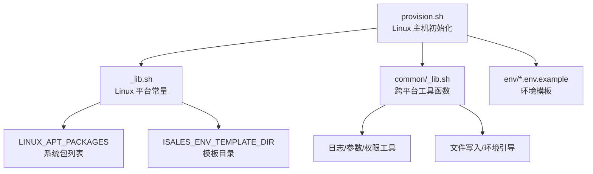
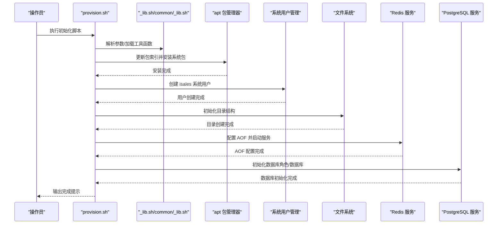
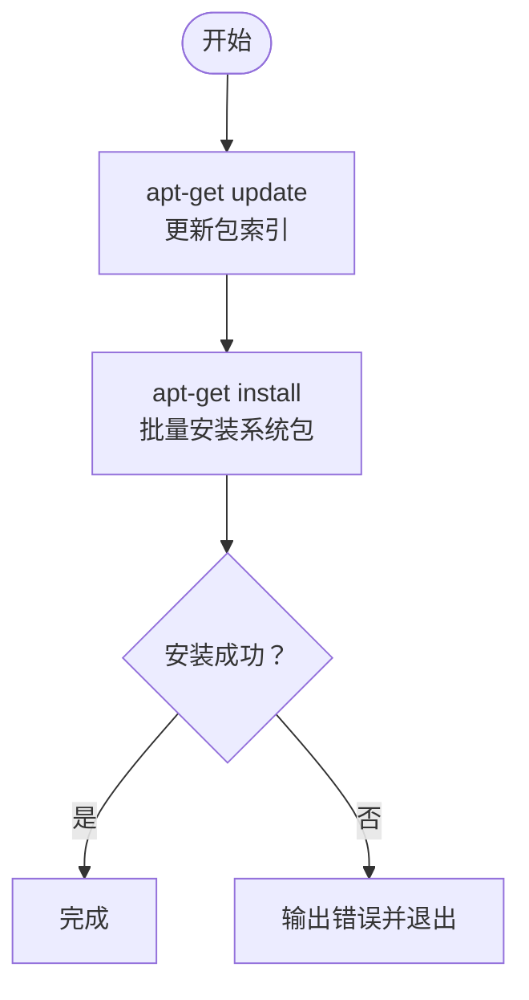
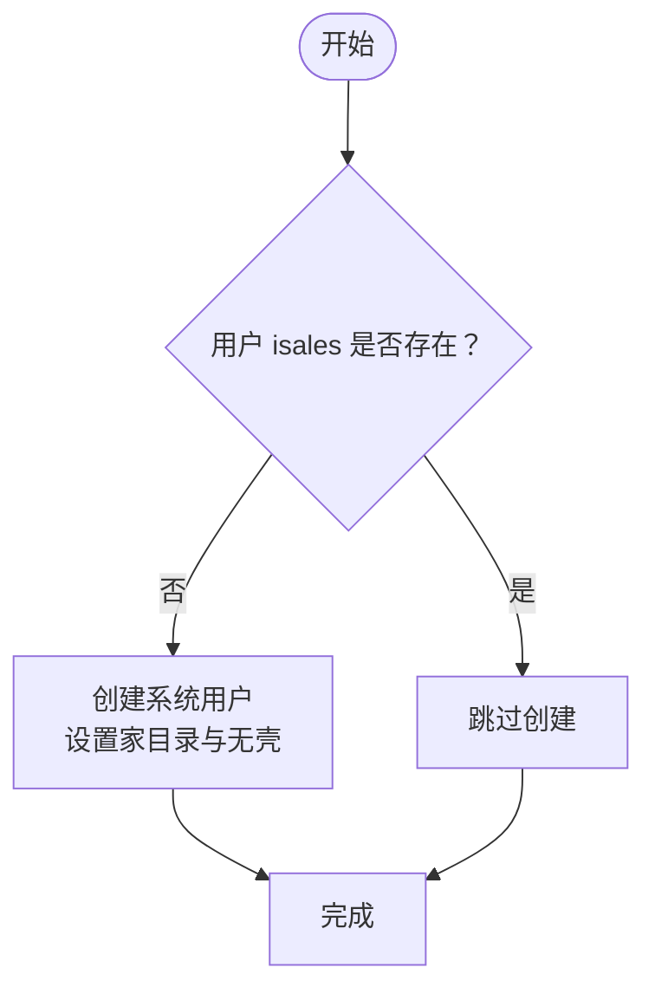
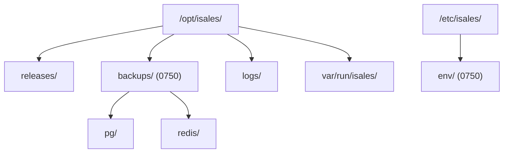
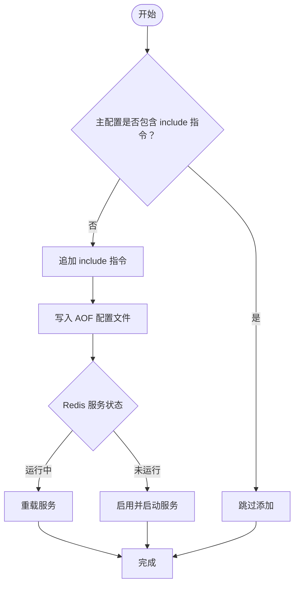
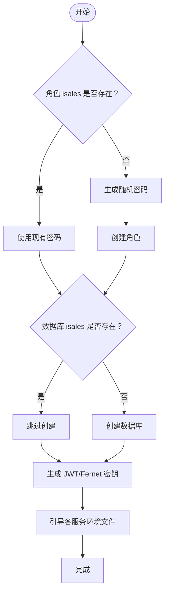
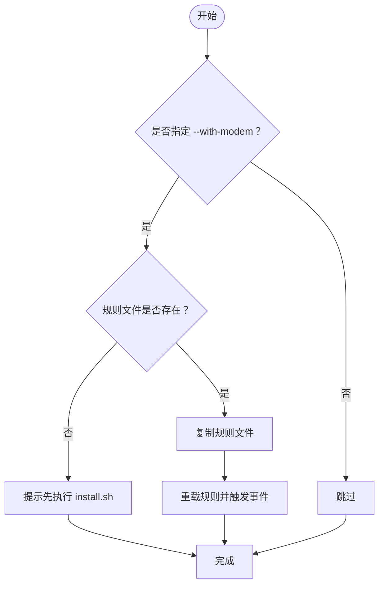
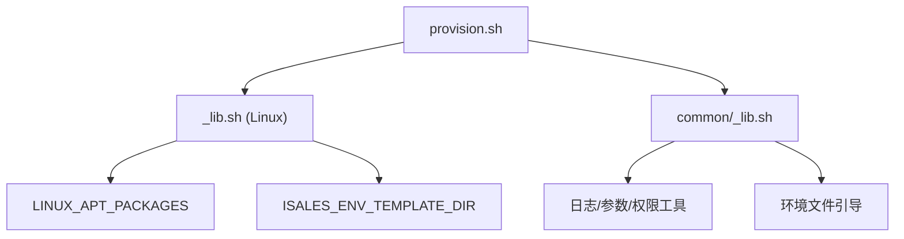

# 主机初始化脚本 (provision.sh)

<cite>
**本文档引用的文件**
- [provision.sh](file://deploy/linux/scripts/provision.sh)
- [_lib.sh](file://deploy/linux/scripts/_lib.sh)
- [common/_lib.sh](file://deploy/common/_lib.sh)
- [api.env.example](file://deploy/env/api.env.example)
- [engine.env.example](file://deploy/env/engine.env.example)
- [deploy/README.md](file://deploy/README.md)
- [deploy/RUNBOOK.md](file://deploy/RUNBOOK.md)
- [backup_redis.sh](file://deploy/linux/scripts/backup_redis.sh)
- [isales-api.service](file://deploy/cloud/systemd/isales-api.service)
</cite>

## 目录
1. [简介](#简介)
2. [项目结构](#项目结构)
3. [核心组件](#核心组件)
4. [架构概览](#架构概览)
5. [详细组件分析](#详细组件分析)
6. [依赖关系分析](#依赖关系分析)
7. [性能考虑](#性能考虑)
8. [故障排查指南](#故障排查指南)
9. [结论](#结论)
10. [附录](#附录)

## 简介
本文档深入解析 iSales 主机初始化脚本 provision.sh 的功能与实现原理，涵盖系统包安装、用户创建、目录结构初始化以及 Redis AOF 配置等关键步骤。文档特别说明 Ubuntu 22.04 LTS 的特定要求，阐述系统用户的权限设置、目录权限管理与安全配置策略，并提供完整的命令使用示例、错误处理机制与故障排查方法。同时给出最佳实践建议与常见问题解决方案。

## 项目结构
provision.sh 位于 Linux 部署目录下，采用分层设计：
- 顶层脚本：负责参数解析、步骤编排与平台适配
- 平台库：定义系统包列表、环境模板目录等平台特定常量
- 通用库：提供日志、参数解析、权限校验、文件写入等跨平台工具函数
- 环境模板：各服务的环境变量模板文件，用于生成最终的运行时配置



**图表来源**
- [provision.sh:1-224](file://deploy/linux/scripts/provision.sh#L1-L224)
- [_lib.sh:1-47](file://deploy/linux/scripts/_lib.sh#L1-L47)
- [common/_lib.sh:1-181](file://deploy/common/_lib.sh#L1-L181)

**章节来源**
- [provision.sh:1-224](file://deploy/linux/scripts/provision.sh#L1-L224)
- [_lib.sh:1-47](file://deploy/linux/scripts/_lib.sh#L1-L47)
- [common/_lib.sh:1-181](file://deploy/common/_lib.sh#L1-L181)

## 核心组件
provision.sh 将主机初始化分为六个主要步骤，确保幂等性与安全性：

1. **系统包安装**：通过 apt 安装 PostgreSQL 15、Redis、Nginx、Git、Node.js、Python 3.12 等必需组件
2. **系统用户创建**：创建 `isales:isales` 系统用户（无 shell），用于隔离服务运行
3. **目录结构初始化**：在 `/opt/isales/` 和 `/etc/isales/` 下建立标准化目录骨架
4. **Redis AOF 配置**：启用 AOF 持久化并确保服务可用
5. **PostgreSQL 初始化**：创建数据库角色与数据库，生成随机密钥并引导环境文件
6. **可选：USB 调制解调器支持**：安装 udev 规则并重载规则

每个步骤均具备幂等性，重复执行不会重置现有凭据或重新安装已存在的包。

**章节来源**
- [provision.sh:48-224](file://deploy/linux/scripts/provision.sh#L48-L224)
- [_lib.sh:17-38](file://deploy/linux/scripts/_lib.sh#L17-L38)
- [common/_lib.sh:143-181](file://deploy/common/_lib.sh#L143-L181)

## 架构概览
provision.sh 的整体执行流程如下：



**图表来源**
- [provision.sh:212-224](file://deploy/linux/scripts/provision.sh#L212-L224)
- [_lib.sh:17-38](file://deploy/linux/scripts/_lib.sh#L17-L38)
- [common/_lib.sh:105-141](file://deploy/common/_lib.sh#L105-L141)

## 详细组件分析

### 系统包安装组件
- **目标**：确保主机具备运行 iSales 所需的基础软件栈
- **关键依赖项及其作用**：
  - PostgreSQL 15：核心数据存储，支持异步驱动连接
  - Redis：缓存与消息队列，配合 AOF 提升持久化可靠性
  - Nginx：反向代理与静态资源服务
  - Git：代码仓库访问与版本控制
  - Node.js：前端构建工具链支持
  - Python 3.12 + venv：Python 服务运行时
  - pkg-config + 开发头文件：编译原生扩展所需
- **安装过程**：先执行包索引更新，再批量安装指定包，避免推荐包干扰
- **Ubuntu 22.04 LTS 特定要求**：脚本明确要求 amd64 架构与 22.04 LTS 版本，确保兼容性与稳定性



**图表来源**
- [provision.sh:48-52](file://deploy/linux/scripts/provision.sh#L48-L52)
- [_lib.sh:17-33](file://deploy/linux/scripts/_lib.sh#L17-L33)

**章节来源**
- [provision.sh:48-52](file://deploy/linux/scripts/provision.sh#L48-L52)
- [_lib.sh:17-33](file://deploy/linux/scripts/_lib.sh#L17-L33)
- [deploy/README.md:51-59](file://deploy/README.md#L51-L59)

### 系统用户创建组件
- **目标**：创建专用系统用户 `isales:isales`，用于隔离服务运行
- **权限设置**：
  - 无登录 shell（`/usr/sbin/nologin`），防止交互式登录
  - 属主目录指向 `/opt/isales`，便于服务定位
  - 使用系统账户标识，避免与普通用户冲突
- **幂等性**：通过用户存在性检测，避免重复创建



**图表来源**
- [provision.sh:56-67](file://deploy/linux/scripts/provision.sh#L56-L67)

**章节来源**
- [provision.sh:56-67](file://deploy/linux/scripts/provision.sh#L56-L67)

### 目录结构初始化组件
- **目标**：在标准路径下建立目录骨架，统一服务运行环境
- **关键目录及权限**：
  - `/opt/isales/`：服务根目录，权限 0755，属主 `isales:isales`
  - `/opt/isales/releases/`：发布版本存放目录
  - `/opt/isales/backups/`：备份根目录，权限 0750，限制访问
  - `/opt/isales/logs/`：日志目录
  - `/etc/isales/`：集中化环境配置目录，权限 0750，属主 `root:isales`
  - `/etc/isales/env/`：环境变量模板与运行时配置
  - `/var/run/isales/`：运行时状态目录
- **权限管理**：通过 `install -d -m` 与 `chown/chmod` 确保目录权限与属主正确



**图表来源**
- [provision.sh:84-95](file://deploy/linux/scripts/provision.sh#L84-L95)

**章节来源**
- [provision.sh:84-95](file://deploy/linux/scripts/provision.sh#L84-L95)

### Redis AOF 配置组件
- **目标**：启用 Redis AOF（Append Only File）持久化，提升数据可靠性
- **配置步骤**：
  - 在主配置文件中添加包含指令，指向独立配置目录
  - 写入 AOF 配置块（开启 AOF、每秒同步）
  - 根据服务状态选择重启或重载
- **安全与可靠性**：AOF 提供更可靠的持久化保证，适合生产环境



**图表来源**
- [provision.sh:99-127](file://deploy/linux/scripts/provision.sh#L99-L127)

**章节来源**
- [provision.sh:99-127](file://deploy/linux/scripts/provision.sh#L99-L127)

### PostgreSQL 初始化组件
- **目标**：创建数据库角色与数据库，生成随机密钥并引导环境文件
- **关键步骤**：
  - 检测角色与数据库是否存在，避免重复创建
  - 生成随机密码、JWT 密钥与 Fernet 密钥
  - 为各服务生成对应的环境文件，保持幂等性
- **安全考虑**：密钥生成使用安全随机源，避免硬编码



**图表来源**
- [provision.sh:143-186](file://deploy/linux/scripts/provision.sh#L143-L186)
- [common/_lib.sh:143-181](file://deploy/common/_lib.sh#L143-L181)

**章节来源**
- [provision.sh:143-186](file://deploy/linux/scripts/provision.sh#L143-L186)
- [common/_lib.sh:143-181](file://deploy/common/_lib.sh#L143-L181)

### 可选：USB 调制解调器支持组件
- **目标**：为需要 USB 调制解调器的部署场景安装 udev 规则
- **触发条件**：使用 `--with-modem` 参数启用
- **实现逻辑**：
  - 检查当前发布版本中的规则文件是否存在
  - 复制规则文件至系统规则目录
  - 重载规则并触发设备事件



**图表来源**
- [provision.sh:190-208](file://deploy/linux/scripts/provision.sh#L190-L208)

**章节来源**
- [provision.sh:190-208](file://deploy/linux/scripts/provision.sh#L190-L208)

## 依赖关系分析
provision.sh 的依赖关系清晰且模块化：



**图表来源**
- [provision.sh:24-26](file://deploy/linux/scripts/provision.sh#L24-L26)
- [_lib.sh:14-15](file://deploy/linux/scripts/_lib.sh#L14-L15)
- [common/_lib.sh:13-18](file://deploy/common/_lib.sh#L13-L18)

**章节来源**
- [provision.sh:24-26](file://deploy/linux/scripts/provision.sh#L24-L26)
- [_lib.sh:14-15](file://deploy/linux/scripts/_lib.sh#L14-L15)
- [common/_lib.sh:13-18](file://deploy/common/_lib.sh#L13-L18)

## 性能考虑
- **包安装优化**：使用 `--no-install-recommends` 减少额外依赖，缩短安装时间
- **幂等性设计**：每一步都进行存在性检查，避免重复操作带来的性能损耗
- **服务启动策略**：优先重载而非重启，减少服务中断时间
- **备份策略**：Redis AOF 配合每日快照，确保数据恢复效率

## 故障排查指南
以下为常见问题与解决方法：

- **Redis OOM（内存溢出）**：
  - 现象：出现 `OOM command not allowed` 错误
  - 处理：调整 `/etc/redis/redis.conf.d/isales.conf` 中的 `maxmemory` 或修改淘汰策略
  - 验证：使用 `redis-cli info memory` 查看内存使用情况

- **modem-controller 设备断开**：
  - 现象：服务提示设备断开
  - 处理：检查 USB 事件是否正常，重新插拔设备，查看服务日志
  - 验证：使用 `udevadm monitor --kernel` 观察内核事件

- **API 登录失败**：
  - 现象：认证失败
  - 处理：确认 `/etc/isales/env/api.env` 中的 `ISALES_ADMIN_PASSWORD_HASH` 设置正确
  - 验证：重新生成哈希值并重启 `isales-api` 服务

- **JWT 认证失效**：
  - 现象：API 与 telephony-api 间认证失败
  - 处理：确保两个服务的 `ISALES_JWT_SECRET` 一致
  - 验证：检查环境文件内容并重新部署

- **备份任务未执行**：
  - 现象：定时备份未触发
  - 处理：检查 `cron` 服务状态与 `/etc/cron.d/isales-backup` 权限
  - 验证：查看 `journalctl -t isales-backup` 日志

- **系统包安装失败**：
  - 现象：apt 安装报错
  - 处理：确认网络连通性，清理缓存后重试
  - 验证：手动执行 `apt-get update` 与 `apt-get install`

**章节来源**
- [deploy/RUNBOOK.md:163-196](file://deploy/RUNBOOK.md#L163-L196)

## 结论
provision.sh 通过模块化设计与严格的幂等性保障，为 iSales 在 Ubuntu 22.04 LTS 上的单主机部署提供了可靠的一次性初始化能力。其标准化的目录结构、完善的权限管理与安全配置，为后续的服务部署、监控与维护奠定了坚实基础。遵循本文档的最佳实践与故障排查指南，可有效降低部署风险并提升系统稳定性。

## 附录

### 命令使用示例
- **基础初始化**：
  ```bash
  sudo bash deploy/linux/scripts/provision.sh
  ```
- **启用 USB 调制解调器支持**：
  ```bash
  sudo bash deploy/linux/scripts/provision.sh --with-modem
  ```
- **仅预览变更（不实际执行）**：
  ```bash
  sudo bash deploy/linux/scripts/provision.sh --dry-run
  ```

### 环境变量模板说明
- **api.env 示例**：包含数据库连接、Redis 连接、JWT 密钥与管理员账户配置
- **engine.env 示例**：包含数据库连接、Redis 连接与引擎相关配置项

**章节来源**
- [api.env.example:1-14](file://deploy/env/api.env.example#L1-L14)
- [engine.env.example:1-21](file://deploy/env/engine.env.example#L1-L21)

### 系统服务参考
- **isales-api 服务配置**：展示如何通过 EnvironmentFile 加载集中化环境变量，体现 provision.sh 初始化的配置落地效果

**章节来源**
- [isales-api.service:1-35](file://deploy/cloud/systemd/isales-api.service#L1-L35)