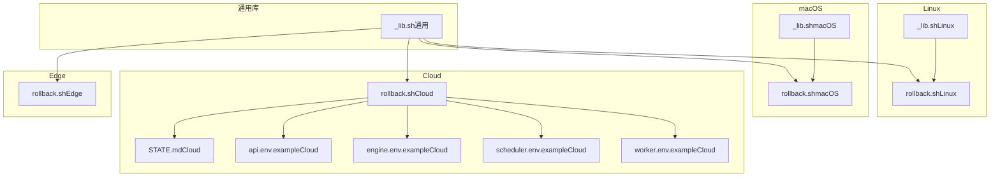
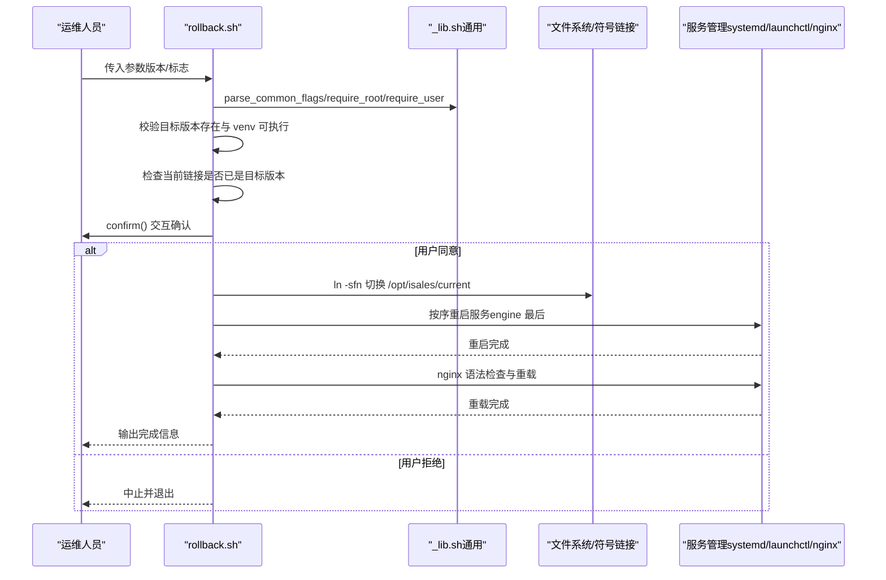
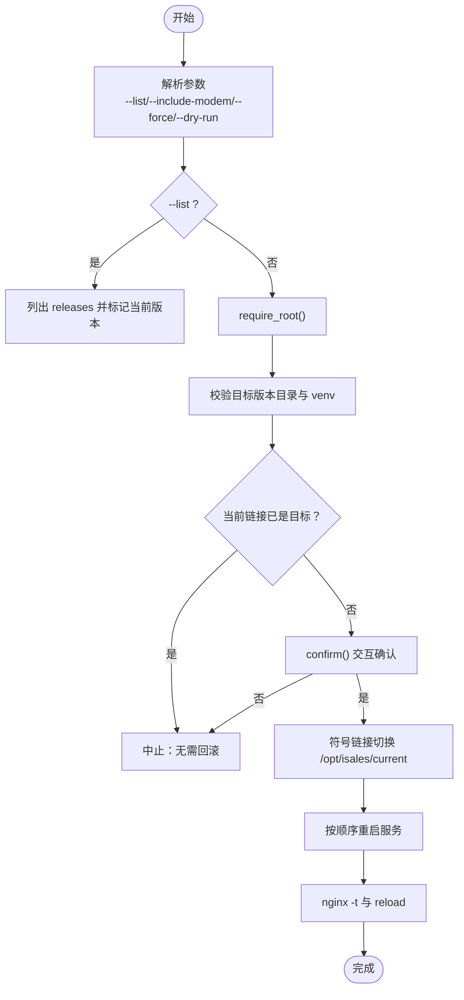
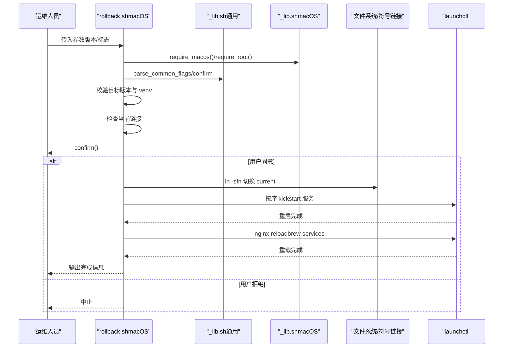
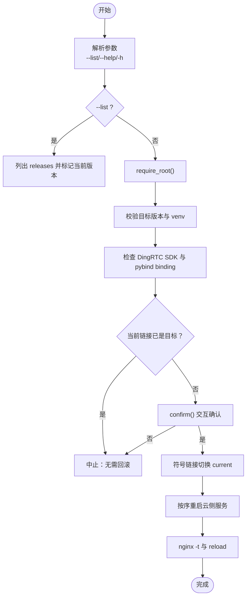
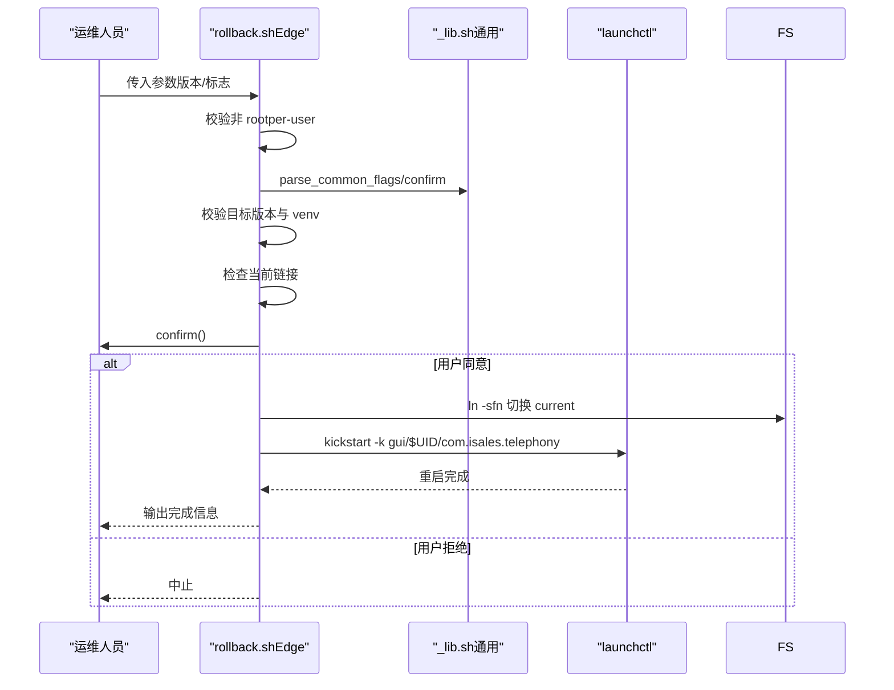
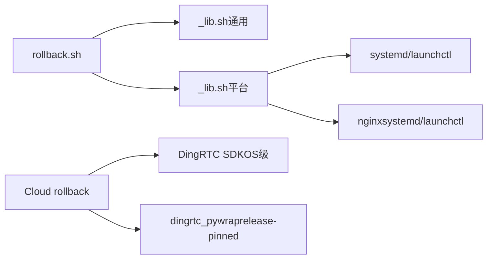

# 回滚脚本 (rollback.sh)

<cite>
**本文档引用的文件**
- [rollback.sh（Linux）](file://deploy/linux/scripts/rollback.sh)
- [_lib.sh（Linux）](file://deploy/linux/scripts/_lib.sh)
- [rollback.sh（macOS）](file://deploy/macos/scripts/rollback.sh)
- [_lib.sh（macOS）](file://deploy/macos/scripts/_lib.sh)
- [rollback.sh（Cloud）](file://deploy/cloud/scripts/rollback.sh)
- [rollback.sh（Edge）](file://deploy/edge/scripts/rollback.sh)
- [_lib.sh（通用）](file://deploy/common/_lib.sh)
- [RUNBOOK.md](file://deploy/RUNBOOK.md)
- [RUNBOOK-cloud.md](file://deploy/RUNBOOK-cloud.md)
- [STATE.md（Cloud）](file://deploy/cloud/STATE.md)
- [api.env.example（Cloud）](file://deploy/cloud/env/api.env.example)
- [engine.env.example（Cloud）](file://deploy/cloud/env/engine.env.example)
- [scheduler.env.example（Cloud）](file://deploy/cloud/env/scheduler.env.example)
- [worker.env.example（Cloud）](file://deploy/cloud/env/worker.env.example)
</cite>

## 目录
1. [简介](#简介)
2. [项目结构](#项目结构)
3. [核心组件](#核心组件)
4. [架构总览](#架构总览)
5. [详细组件分析](#详细组件分析)
6. [依赖关系分析](#依赖关系分析)
7. [性能考量](#性能考量)
8. [故障排查指南](#故障排查指南)
9. [结论](#结论)
10. [附录](#附录)

## 简介
本文件面向 iSales 平台的回滚脚本（rollback.sh）进行系统化技术文档整理，覆盖 Linux、macOS、Cloud（云）与 Edge（边缘）四种平台的回滚实现差异，重点阐述：
- 历史版本查找与列表展示
- 符号链接切换与服务重启顺序
- 数据完整性保护策略（数据库 schema 不降级）
- 回滚前状态检查、回滚过程中的备份与验证
- 版本管理策略、回滚风险评估与应急处置
- 回滚失败的补救措施、数据恢复与系统修复
- 完整命令示例、使用场景与注意事项

## 项目结构
iSales 在不同平台提供独立的 rollback.sh 实现，并共享一套通用的辅助库（_lib.sh 与 common/_lib.sh）。Cloud 与 Edge 场景下的回滚职责边界清晰：
- Linux/macOS：完整回滚，涉及 systemd/launchd 服务与 nginx
- Cloud：仅回滚云侧服务，不触达 Edge 设备与数据库 schema
- Edge：仅回滚用户态 Edge 服务，保留本地 SQLite 缓冲区

图表来源
- [rollback.sh（Linux）:1-114](file://deploy/linux/scripts/rollback.sh#L1-L114)
- [_lib.sh（Linux）:1-47](file://deploy/linux/scripts/_lib.sh#L1-L47)
- [rollback.sh（macOS）:1-129](file://deploy/macos/scripts/rollback.sh#L1-L129)
- [_lib.sh（macOS）:1-69](file://deploy/macos/scripts/_lib.sh#L1-L69)
- [rollback.sh（Cloud）:1-114](file://deploy/cloud/scripts/rollback.sh#L1-L114)
- [STATE.md（Cloud）:1-817](file://deploy/cloud/STATE.md#L1-L817)
- [api.env.example（Cloud）:1-24](file://deploy/cloud/env/api.env.example#L1-L24)
- [engine.env.example（Cloud）:1-76](file://deploy/cloud/env/engine.env.example#L1-L76)
- [scheduler.env.example（Cloud）:1-25](file://deploy/cloud/env/scheduler.env.example#L1-L25)
- [worker.env.example（Cloud）:1-28](file://deploy/cloud/env/worker.env.example#L1-L28)

章节来源
- [rollback.sh（Linux）:1-114](file://deploy/linux/scripts/rollback.sh#L1-L114)
- [rollback.sh（macOS）:1-129](file://deploy/macos/scripts/rollback.sh#L1-L129)
- [rollback.sh（Cloud）:1-114](file://deploy/cloud/scripts/rollback.sh#L1-L114)
- [rollback.sh（Edge）:1-95](file://deploy/edge/scripts/rollback.sh#L1-L95)
- [_lib.sh（通用）:1-181](file://deploy/common/_lib.sh#L1-L181)

## 核心组件
- 通用库（common/_lib.sh）
  - 提供日志、参数解析、交互确认、执行包装、文件写入、随机密钥生成等通用能力
  - 为各平台 rollback.sh 提供统一的错误处理与安全检查
- 平台特定库
  - Linux/macOS：补充平台常量、环境模板目录、平台检测与依赖
- 平台回滚脚本
  - Linux：完整回滚，重启顺序为 telephony-api → scheduler → worker → engine → api，可选重启 modem-controller
  - macOS：与 Linux 相同的服务重启顺序，但使用 launchctl 与 Homebrew nginx
  - Cloud：仅回滚云侧服务（api/engine/scheduler/worker），不降级数据库 schema，不重启 Edge
  - Edge：仅回滚用户态 Edge 服务，保留用户态 SQLite 缓冲区

章节来源
- [_lib.sh（通用）:1-181](file://deploy/common/_lib.sh#L1-L181)
- [_lib.sh（Linux）:1-47](file://deploy/linux/scripts/_lib.sh#L1-L47)
- [_lib.sh（macOS）:1-69](file://deploy/macos/scripts/_lib.sh#L1-L69)
- [rollback.sh（Linux）:1-114](file://deploy/linux/scripts/rollback.sh#L1-L114)
- [rollback.sh（macOS）:1-129](file://deploy/macos/scripts/rollback.sh#L1-L129)
- [rollback.sh（Cloud）:1-114](file://deploy/cloud/scripts/rollback.sh#L1-L114)
- [rollback.sh（Edge）:1-95](file://deploy/edge/scripts/rollback.sh#L1-L95)

## 架构总览
回滚流程在各平台遵循“检查 → 交互确认 → 符号链接切换 → 服务重启 → 验证”的通用模式，差异在于服务管理方式与职责范围。

图表来源
- [rollback.sh（Linux）:70-114](file://deploy/linux/scripts/rollback.sh#L70-L114)
- [rollback.sh（macOS）:70-129](file://deploy/macos/scripts/rollback.sh#L70-L129)
- [rollback.sh（Cloud）:60-114](file://deploy/cloud/scripts/rollback.sh#L60-L114)
- [rollback.sh（Edge）:60-95](file://deploy/edge/scripts/rollback.sh#L60-L95)
- [_lib.sh（通用）:50-115](file://deploy/common/_lib.sh#L50-L115)

## 详细组件分析

### Linux 回滚脚本（deploy/linux/scripts/rollback.sh）
- 功能要点
  - 列表模式：列出 /opt/isales/releases 下的版本，标记当前版本与 Git 标签
  - 参数解析：支持 --list、--include-modem、--force、--dry-run
  - 安全校验：要求 root 权限，校验目标版本目录与 venv 可执行
  - 交互确认：通过 confirm() 询问是否继续
  - 切换与重启：符号链接切换后按顺序重启服务，最后重启 nginx
  - 可选重启 modem-controller（硬件耦合，谨慎使用）
- 服务重启顺序
  - telephony-api → scheduler → worker → engine → api
- 数据完整性
  - 不触碰数据库 schema，默认保持向前迁移

图表来源
- [rollback.sh（Linux）:20-114](file://deploy/linux/scripts/rollback.sh#L20-L114)

章节来源
- [rollback.sh（Linux）:1-114](file://deploy/linux/scripts/rollback.sh#L1-L114)
- [_lib.sh（Linux）:1-47](file://deploy/linux/scripts/_lib.sh#L1-L47)

### macOS 回滚脚本（deploy/macos/scripts/rollback.sh）
- 功能要点
  - 与 Linux 相同的回滚流程，但使用 launchctl 重启服务
  - 使用 Homebrew nginx，reload 时通过 launchctl 直接 kickstart
  - 可选重启 modem-controller（硬件耦合）
- 服务重启顺序
  - com.isales.telephony-api → com.isales.scheduler → com.isales.worker → com.isales.engine → com.isales.api
- 数据完整性
  - 不触碰数据库 schema，默认保持向前迁移

图表来源
- [rollback.sh（macOS）:20-129](file://deploy/macos/scripts/rollback.sh#L20-L129)
- [_lib.sh（macOS）:57-69](file://deploy/macos/scripts/_lib.sh#L57-L69)

章节来源
- [rollback.sh（macOS）:1-129](file://deploy/macos/scripts/rollback.sh#L1-L129)
- [_lib.sh（macOS）:1-69](file://deploy/macos/scripts/_lib.sh#L1-L69)

### Cloud 回滚脚本（deploy/cloud/scripts/rollback.sh）
- 功能要点
  - 仅回滚云侧服务（api/engine/scheduler/worker），不降级数据库 schema
  - 不重启 Edge 设备，不触碰数据库
  - 重启顺序与 Linux 相同，但不包含 modem-controller
  - 重启后 reload nginx
- 特殊注意
  - DingRTC SDK 位于 OS 级 vendor 目录，不随 release 变化；回滚到旧 release 时需确保其 venv 中的 pybind binding 存在
- 数据完整性
  - schema 保持不变；如旧 release 需要旧 schema，参考 RUNBOOK-cloud 的 schema 降级流程

图表来源
- [rollback.sh（Cloud）:20-114](file://deploy/cloud/scripts/rollback.sh#L20-L114)

章节来源
- [rollback.sh（Cloud）:1-114](file://deploy/cloud/scripts/rollback.sh#L1-L114)
- [RUNBOOK-cloud.md:280-298](file://deploy/RUNBOOK-cloud.md#L280-L298)
- [STATE.md（Cloud）:597-681](file://deploy/cloud/STATE.md#L597-L681)

### Edge 回滚脚本（deploy/edge/scripts/rollback.sh）
- 功能要点
  - 仅回滚用户态 Edge 服务，不重启系统服务
  - 保留用户态 SQLite 缓冲区（~/Library/Application Support/isales/sqlite/edge_buffer.db）
  - 通过 launchctl kickstart 重启 LaunchAgent
- 注意事项
  - 不能以 root 运行，必须以登录用户身份执行
  - Edge 侧状态在回滚后仍保留，有利于数据连续性

图表来源
- [rollback.sh（Edge）:12-95](file://deploy/edge/scripts/rollback.sh#L12-L95)

章节来源
- [rollback.sh（Edge）:1-95](file://deploy/edge/scripts/rollback.sh#L1-L95)

## 依赖关系分析
- 通用依赖
  - rollback.sh 依赖 common/_lib.sh 提供的日志、参数解析、确认与执行包装
  - Linux/macOS 的平台库进一步封装平台特定行为
- 服务管理
  - Linux：systemd
  - macOS：launchctl + Homebrew nginx
  - Cloud：systemd（云侧服务）+ nginx
  - Edge：launchctl（用户态 LaunchAgent）
- 外部依赖
  - Cloud：DingRTC SDK（OS 级 vendor）、pybind binding（release-pinned）
  - 数据库：schema 默认不降级，必要时参考 RUNBOOK-cloud 的 schema 降级流程

图表来源
- [_lib.sh（通用）:1-181](file://deploy/common/_lib.sh#L1-L181)
- [_lib.sh（Linux）:1-47](file://deploy/linux/scripts/_lib.sh#L1-L47)
- [_lib.sh（macOS）:1-69](file://deploy/macos/scripts/_lib.sh#L1-L69)
- [rollback.sh（Cloud）:70-80](file://deploy/cloud/scripts/rollback.sh#L70-L80)
- [STATE.md（Cloud）:597-681](file://deploy/cloud/STATE.md#L597-L681)

章节来源
- [_lib.sh（通用）:1-181](file://deploy/common/_lib.sh#L1-L181)
- [_lib.sh（Linux）:1-47](file://deploy/linux/scripts/_lib.sh#L1-L47)
- [_lib.sh（macOS）:1-69](file://deploy/macos/scripts/_lib.sh#L1-L69)
- [rollback.sh（Cloud）:1-114](file://deploy/cloud/scripts/rollback.sh#L1-L114)

## 性能考量
- 服务重启顺序
  - 将 engine 放在最后重启，减少边缘设备在回滚过程中的断连时间
- nginx 重载
  - 通过语法检查后再重载，避免因配置错误导致服务不可用
- 并发与队列
  - 回滚期间 Redis 队列可能短暂停滞，但不会造成数据丢失（队列在内存中）

## 故障排查指南
- 常见症状与处理
  - 数据库连接失败：检查 PostgreSQL 服务状态与磁盘空间
  - Redis OOM：调整 maxmemory 或替换策略
  - modem-controller 设备断开：检查 USB 事件与日志
  - nginx 502：检查后端健康与代理配置
- 回滚失败补救
  - 立即回切到上一个稳定版本（再次运行 rollback.sh 指向上次版本）
  - 如需数据库 schema 降级，参考 RUNBOOK-cloud 的 schema 降级流程（先备份）
  - 检查 DingRTC SDK 与 pybind binding 是否匹配目标 release
- 验证步骤
  - 回滚完成后，验证服务状态、日志与关键指标（如活跃通话数）

章节来源
- [RUNBOOK.md（故障速查）:163-196](file://deploy/RUNBOOK.md#L163-L196)
- [RUNBOOK-cloud.md（应急速查）:584-599](file://deploy/RUNBOOK-cloud.md#L584-L599)

## 结论
iSales 的回滚脚本在不同平台上实现了统一的安全与一致性：通过符号链接切换与有序服务重启，最小化回滚对业务的影响；Cloud 场景明确不降级数据库 schema，Edge 场景保留用户态缓冲区，确保数据连续性。配合 RUNBOOK 的 schema 降级流程与备份恢复演练，形成完整的回滚与应急体系。

## 附录

### 命令示例与使用场景
- Linux
  - 列出可回滚版本：sudo bash deploy/linux/scripts/rollback.sh --list
  - 回滚到指定版本：sudo bash deploy/linux/scripts/rollback.sh <release-ts>
  - 包含 modem-controller：sudo bash deploy/linux/scripts/rollback.sh <release-ts> --include-modem
- macOS
  - 列出可回滚版本：sudo bash deploy/macos/scripts/rollback.sh --list
  - 回滚到指定版本：sudo bash deploy/macos/scripts/rollback.sh <release-ts>
  - 包含 modem-controller：sudo bash deploy/macos/scripts/rollback.sh <release-ts> --include-modem
- Cloud
  - 列出可回滚版本：sudo bash deploy/cloud/scripts/rollback.sh --list
  - 回滚到指定版本：sudo bash deploy/cloud/scripts/rollback.sh <release-ts>
- Edge
  - 列出可回滚版本：bash deploy/edge/scripts/rollback.sh --list
  - 回滚到指定版本：bash deploy/edge/scripts/rollback.sh <release-ts>

章节来源
- [RUNBOOK.md（回滚章节）:84-116](file://deploy/RUNBOOK.md#L84-L116)
- [RUNBOOK-cloud.md（回滚章节）:280-298](file://deploy/RUNBOOK-cloud.md#L280-L298)
- [rollback.sh（Linux）:5-14](file://deploy/linux/scripts/rollback.sh#L5-L14)
- [rollback.sh（macOS）:10-15](file://deploy/macos/scripts/rollback.sh#L10-L15)
- [rollback.sh（Cloud）:8-14](file://deploy/cloud/scripts/rollback.sh#L8-L14)
- [rollback.sh（Edge）:8-12](file://deploy/edge/scripts/rollback.sh#L8-L12)

### 版本管理策略与风险评估
- 版本管理
  - 使用 /opt/isales/releases 下的时间戳目录作为版本标识
  - current 符号链接指向当前版本，回滚即切换该链接
- 风险评估
  - 服务重启窗口：engine 放在最后，降低边缘断连风险
  - schema 风险：默认不降级，如旧版本需要旧 schema，需手动降级并备份
  - Edge 风险：Edge 缓冲区保留，但需确保 Edge 侧服务正确重启
- 应急处置
  - 回滚失败立即回切至上一个稳定版本
  - 如需降级 schema，先执行 pg_dump，再执行 alembic downgrade
  - 检查 DingRTC SDK 与 pybind binding 的匹配性

章节来源
- [RUNBOOK.md（回滚章节）:84-116](file://deploy/RUNBOOK.md#L84-L116)
- [RUNBOOK-cloud.md（Schema 降级）:459-476](file://deploy/RUNBOOK-cloud.md#L459-L476)
- [STATE.md（Cloud）:597-681](file://deploy/cloud/STATE.md#L597-L681)