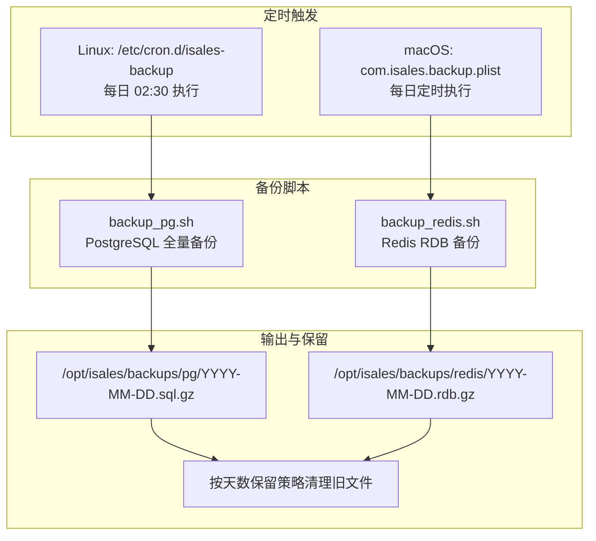
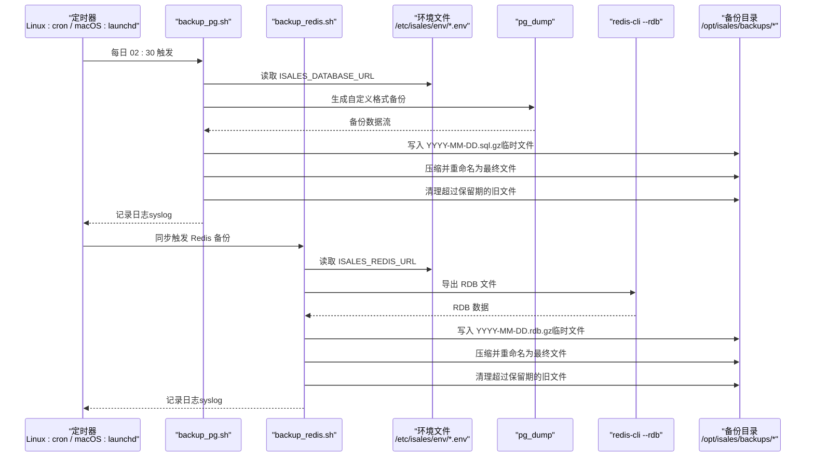
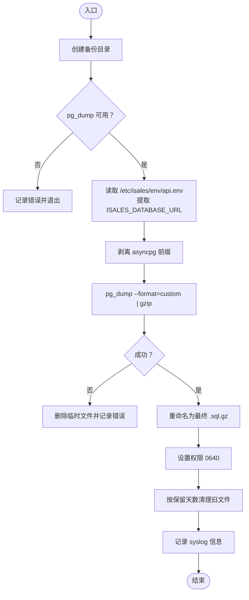
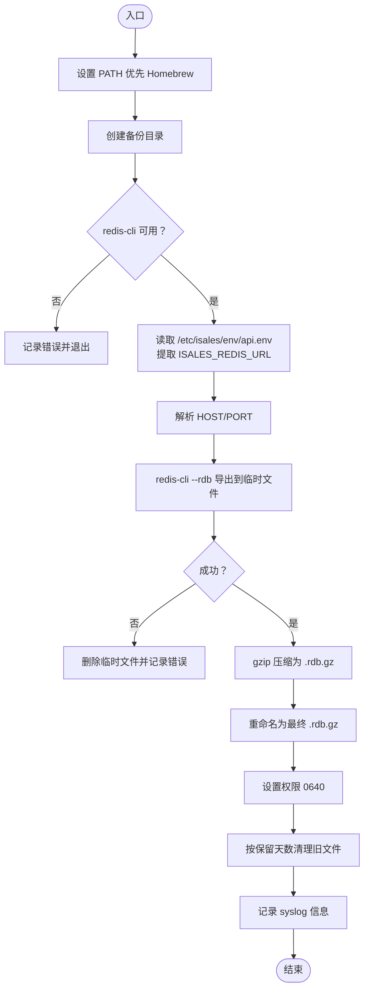
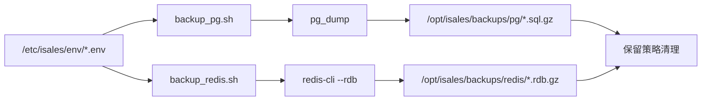

# 备份脚本集（backup_pg.sh 与 backup_redis.sh）

<cite>
**本文引用的文件**
- [backup_pg.sh](file://deploy/linux/scripts/backup_pg.sh)
- [backup_redis.sh](file://deploy/macos/scripts/backup_redis.sh)
- [isales-backup.cron](file://deploy/cron/isales-backup.cron)
- [_lib.sh（通用）](file://deploy/common/_lib.sh)
- [_lib.sh（Linux）](file://deploy/linux/_lib.sh)
- [_lib.sh（macOS）](file://deploy/macos/_lib.sh)
- [install.sh（Linux）](file://deploy/linux/scripts/install.sh)
- [install.sh（macOS）](file://deploy/macos/scripts/install.sh)
- [api.env.example（通用）](file://deploy/env/api.env.example)
- [api.env.example（云边拓扑）](file://deploy/cloud/env/api.env.example)
</cite>

## 目录
1. [简介](#简介)
2. [项目结构](#项目结构)
3. [核心组件](#核心组件)
4. [架构总览](#架构总览)
5. [详细组件分析](#详细组件分析)
6. [依赖关系分析](#依赖关系分析)
7. [性能与容量考量](#性能与容量考量)
8. [故障排查指南](#故障排查指南)
9. [结论](#结论)
10. [附录：配置示例与最佳实践](#附录配置示例与最佳实践)

## 简介
本技术文档面向 iSales 备份脚本集，系统性说明 PostgreSQL 与 Redis 的自动化备份机制，覆盖备份策略、存储与归档周期、执行逻辑、压缩与传输、每日备份计划、增量/全量安排、备份验证与恢复测试、存储空间管理、监控告警与故障恢复流程。文档同时给出可直接参考的配置示例与运维建议。

## 项目结构
备份相关文件分布于 Linux/macOS 部署脚本与通用库中，并通过 cron 或 launchd 定时触发。关键位置如下：
- Linux：/opt/isales/current/deploy/linux/scripts/backup_pg.sh
- macOS：/opt/isales/current/deploy/macos/scripts/backup_redis.sh
- 定时任务：/etc/cron.d/isales-backup（Linux）；macOS 使用 launchd 作业（由安装脚本集成）
- 通用库：deploy/common/_lib.sh 提供日志、参数解析、命令检查等基础能力
- 环境变量：/etc/isales/env/*.env（api.env 等），备份脚本从其中读取数据库与 Redis 连接信息

图表来源
- [isales-backup.cron:1-14](file://deploy/cron/isales-backup.cron#L1-L14)
- [backup_pg.sh:1-50](file://deploy/linux/scripts/backup_pg.sh#L1-L50)
- [backup_redis.sh:1-66](file://deploy/macos/scripts/backup_redis.sh#L1-L66)

章节来源
- [isales-backup.cron:1-14](file://deploy/cron/isales-backup.cron#L1-L14)
- [backup_pg.sh:1-50](file://deploy/linux/scripts/backup_pg.sh#L1-L50)
- [backup_redis.sh:1-66](file://deploy/macos/scripts/backup_redis.sh#L1-L66)

## 核心组件
- PostgreSQL 备份脚本（backup_pg.sh）
  - 使用 pg_dump 生成自定义格式（.dump）并压缩为 .sql.gz
  - 输出路径：/opt/isales/backups/pg/YYYY-MM-DD.sql.gz
  - 保留策略：默认保留最近 14 天
  - 日志：syslog 标签 isales-backup
  - 环境来源：/etc/isales/env/api.env 中的 ISALES_DATABASE_URL（剥离 asyncpg 前缀后供 libpq 使用）
- Redis 备份脚本（backup_redis.sh）
  - 使用 redis-cli --rdb 导出 RDB 文件，再 gzip 压缩
  - 输出路径：/opt/isales/backups/redis/YYYY-MM-DD.rdb.gz
  - 保留策略：默认保留最近 14 天
  - 日志：syslog 标签 isales-backup
  - 环境来源：/etc/isales/env/api.env 中的 ISALES_REDIS_URL（解析主机与端口）
- 定时调度
  - Linux：cron 每日 02:30 触发 PostgreSQL 与 Redis 备份
  - macOS：通过 launchd 作业每日定时执行 Redis 备份（Linux 的 PostgreSQL 备份由独立 cron 管理）

章节来源
- [backup_pg.sh:1-50](file://deploy/linux/scripts/backup_pg.sh#L1-L50)
- [backup_redis.sh:1-66](file://deploy/macos/scripts/backup_redis.sh#L1-L66)
- [isales-backup.cron:1-14](file://deploy/cron/isales-backup.cron#L1-L14)

## 架构总览
下图展示备份系统的整体交互：定时器触发脚本，脚本读取环境变量，调用数据库客户端工具生成备份文件，并进行压缩与权限设置，最后按保留策略清理旧文件。

图表来源
- [isales-backup.cron:1-14](file://deploy/cron/isales-backup.cron#L1-L14)
- [backup_pg.sh:1-50](file://deploy/linux/scripts/backup_pg.sh#L1-L50)
- [backup_redis.sh:1-66](file://deploy/macos/scripts/backup_redis.sh#L1-L66)

## 详细组件分析

### PostgreSQL 备份组件（backup_pg.sh）
- 执行逻辑
  - 创建备份目录（如不存在）
  - 校验 pg_dump 可用性
  - 从 /etc/isales/env/api.env 读取 ISALES_DATABASE_URL，剥离 asyncpg 前缀后交给 libpq
  - 调用 pg_dump --format=custom 并通过管道压缩为 .sql.gz
  - 成功后原子性重命名临时文件，设置权限
  - 清理超出保留天数的旧文件
  - 记录 syslog（用户信息级别）
- 压缩与传输
  - 使用 gzip 对 pg_dump 输出进行压缩
  - 未实现远传或加密（仅本地压缩）
- 保留策略
  - 默认保留 14 天，可通过环境变量 ISALES_PG_BACKUP_RETAIN 覆盖
- 错误处理
  - 无法读取环境文件、pg_dump 缺失、pg_dump 失败均记录错误并退出非零

图表来源
- [backup_pg.sh:1-50](file://deploy/linux/scripts/backup_pg.sh#L1-L50)

章节来源
- [backup_pg.sh:1-50](file://deploy/linux/scripts/backup_pg.sh#L1-L50)

### Redis 备份组件（backup_redis.sh）
- 执行逻辑
  - 设置 PATH 优先使用 Homebrew 工具链（macOS）
  - 创建备份目录（如不存在）
  - 校验 redis-cli 可用性
  - 从 /etc/isales/env/api.env 读取 ISALES_REDIS_URL，解析主机与端口
  - 调用 redis-cli --rdb 导出 RDB 至临时文件，再用 gzip 压缩为 .rdb.gz
  - 成功后原子性重命名临时文件，设置权限
  - 清理超出保留天数的旧文件
  - 记录 syslog（用户信息级别）
- 压缩与传输
  - 使用 gzip 对 RDB 文件进行压缩
  - 未实现远传或加密（仅本地压缩）
- 保留策略
  - 默认保留 14 天，可通过环境变量 ISALES_REDIS_BACKUP_RETAIN 覆盖
- 错误处理
  - 无法读取环境文件、redis-cli 缺失、导出失败均记录错误并退出非零

图表来源
- [backup_redis.sh:1-66](file://deploy/macos/scripts/backup_redis.sh#L1-L66)

章节来源
- [backup_redis.sh:1-66](file://deploy/macos/scripts/backup_redis.sh#L1-L66)

### 定时调度与平台差异
- Linux
  - 通过 /etc/cron.d/isales-backup 在每日 02:30 同时触发 PostgreSQL 与 Redis 备份
  - 安装脚本负责将该 cron 条目写入系统
- macOS
  - 通过 launchd 作业每日定时执行 Redis 备份（由安装脚本集成）
  - PostgreSQL 备份在 macOS 上通常由独立 cron 或其他机制管理（仓库未提供 macOS 的 PostgreSQL 备份 cron）

章节来源
- [isales-backup.cron:1-14](file://deploy/cron/isales-backup.cron#L1-L14)
- [install.sh（Linux）:238-255](file://deploy/linux/scripts/install.sh#L238-L255)
- [install.sh（macOS）:298-320](file://deploy/macos/scripts/install.sh#L298-L320)

### 环境变量与连接信息
- PostgreSQL
  - 读取 /etc/isales/env/api.env 中的 ISALES_DATABASE_URL
  - 脚本会剥离 asyncpg 前缀，转换为 libpq 可识别的 postgresql:// URL
- Redis
  - 读取 /etc/isales/env/api.env 中的 ISALES_REDIS_URL
  - 解析出 HOST 与 PORT，默认值分别为 127.0.0.1 与 6379

章节来源
- [backup_pg.sh:23-33](file://deploy/linux/scripts/backup_pg.sh#L23-L33)
- [backup_redis.sh:34-45](file://deploy/macos/scripts/backup_redis.sh#L34-L45)
- [api.env.example（通用）:9-10](file://deploy/env/api.env.example#L9-L10)
- [api.env.example（云边拓扑）:8-9](file://deploy/cloud/env/api.env.example#L8-L9)

## 依赖关系分析
- 组件内聚与耦合
  - backup_pg.sh 与 backup_redis.sh 分别独立运行，耦合度低
  - 两者均依赖 /etc/isales/env/*.env 提供连接信息
  - 两者均依赖系统工具（pg_dump、redis-cli）与 gzip
- 外部依赖
  - PostgreSQL 服务（Linux 包含 postgresql-15；macOS 包含 postgresql@16）
  - Redis 服务（Linux/macOS 均包含 redis）
  - cron/launchd 定时器
- 可能的循环依赖
  - 无直接循环依赖；备份脚本不依赖服务单元，仅读取环境文件

图表来源
- [backup_pg.sh:1-50](file://deploy/linux/scripts/backup_pg.sh#L1-L50)
- [backup_redis.sh:1-66](file://deploy/macos/scripts/backup_redis.sh#L1-L66)

章节来源
- [backup_pg.sh:1-50](file://deploy/linux/scripts/backup_pg.sh#L1-L50)
- [backup_redis.sh:1-66](file://deploy/macos/scripts/backup_redis.sh#L1-L66)

## 性能与容量考量
- 备份类型与频率
  - PostgreSQL：全量备份（--format=custom），适合每日全量策略
  - Redis：RDB 快照，适合每日快照策略
- 压缩与 I/O
  - 两者均采用本地 gzip 压缩，减少磁盘占用
  - 建议确保备份目录所在磁盘具备足够空间，避免因 I/O 抖动影响业务
- 保留策略
  - 默认保留 14 天，可根据数据增长趋势调整保留天数（通过环境变量）
- 并发与资源
  - 备份在每日固定时间执行，避免与高峰时段冲突
  - 如需更长保留期，建议结合外部归档系统（见“监控告警与故障恢复”）

## 故障排查指南
- 常见问题与定位步骤
  - 环境文件不可读或缺失
    - 检查 /etc/isales/env/api.env 是否存在且可读
    - 确认 ISALES_DATABASE_URL/ISALES_REDIS_URL 是否正确
  - 工具缺失
    - Linux：确认已安装 postgresql-15 与 redis-server
    - macOS：确认已安装 postgresql@16 与 redis
  - pg_dump/redis-cli 失败
    - 查看 syslog 标签 isales-backup 获取错误详情
    - 检查数据库/Redis 连接状态与认证信息
  - 权限与路径
    - 确保备份目录 /opt/isales/backups 存在且可写
    - 检查输出文件权限是否为 0640
- 日志与审计
  - 使用 journalctl -t isales-backup 查看备份日志
  - 备份成功会记录包含输出文件与保留天数的信息

章节来源
- [backup_pg.sh:17-48](file://deploy/linux/scripts/backup_pg.sh#L17-L48)
- [backup_redis.sh:28-64](file://deploy/macos/scripts/backup_redis.sh#L28-L64)
- [isales-backup.cron:8-8](file://deploy/cron/isales-backup.cron#L8-L8)

## 结论
iSales 备份脚本集提供了简单可靠的每日全量备份方案：PostgreSQL 使用 pg_dump 自定义格式并压缩，Redis 使用 rdb 快照并压缩。脚本具备完善的错误处理与保留策略，日志统一记录至 syslog。建议结合外部归档与监控告警体系，进一步完善长期保留与恢复演练流程。

## 附录：配置示例与最佳实践
- 环境变量配置要点
  - PostgreSQL 连接：ISALES_DATABASE_URL（剥离 asyncpg 前缀后供 libpq 使用）
  - Redis 连接：ISALES_REDIS_URL（支持 redis://host:port/db）
- 保留天数配置
  - PostgreSQL：ISALES_PG_BACKUP_RETAIN（默认 14）
  - Redis：ISALES_REDIS_BACKUP_RETAIN（默认 14）
- 监控与告警
  - 监控项建议
    - 备份任务执行状态（成功/失败）
    - 备份文件大小与增长趋势
    - 备份目录剩余空间
  - 告警阈值建议
    - 备份失败：立即告警
    - 备份文件大小异常下降/上升：预警
    - 磁盘剩余空间低于 20%：预警
- 恢复测试与验证
  - 验证步骤建议
    - 从备份文件还原到测试环境
    - 校验数据完整性与关键业务指标
    - 记录恢复耗时与问题点
- 存储空间管理
  - 定期清理过期备份
  - 将历史备份迁移到低成本存储（如对象存储）
  - 对大体量数据库考虑分表/分区策略以缩短备份窗口

章节来源
- [backup_pg.sh:10-11](file://deploy/linux/scripts/backup_pg.sh#L10-L11)
- [backup_redis.sh:18-18](file://deploy/macos/scripts/backup_redis.sh#L18-L18)
- [api.env.example（通用）:9-10](file://deploy/env/api.env.example#L9-L10)
- [api.env.example（云边拓扑）:8-9](file://deploy/cloud/env/api.env.example#L8-L9)