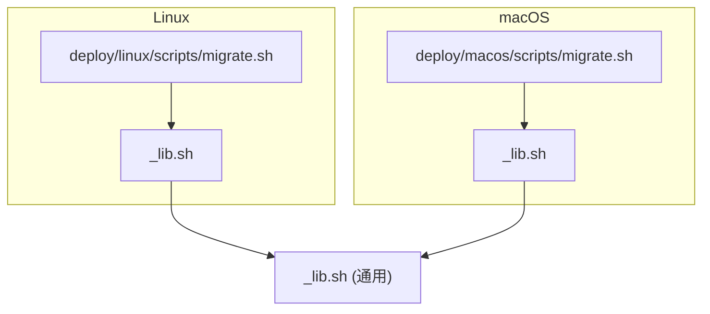
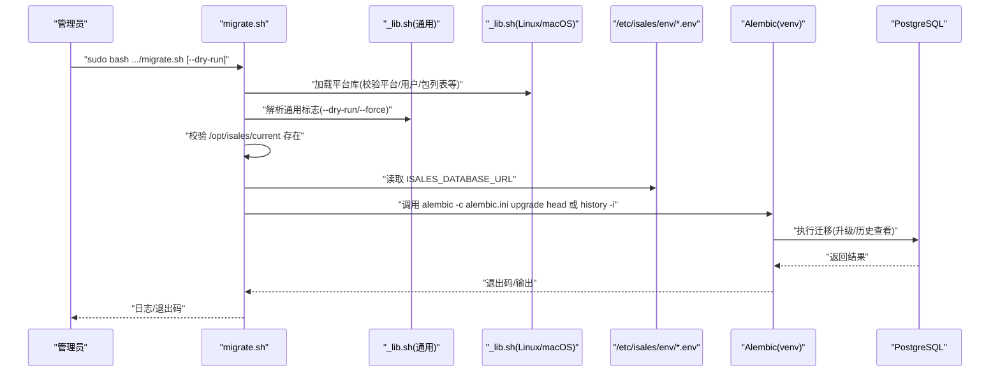
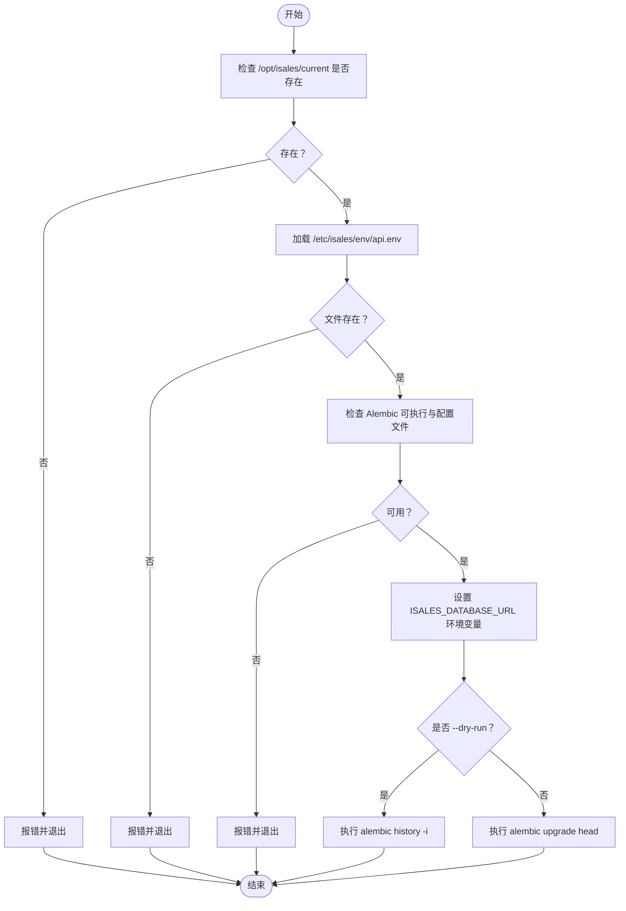
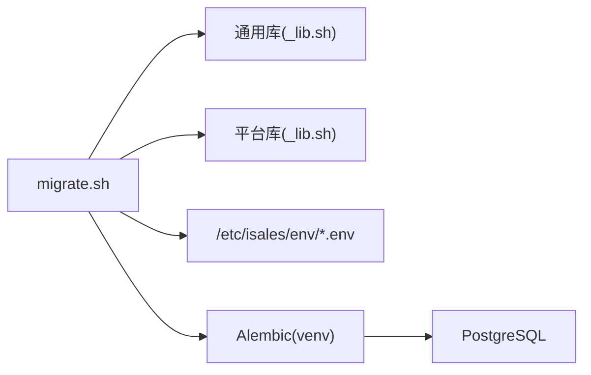

# 数据库迁移脚本 (migrate.sh)

<cite>
**本文引用的文件**
- [deploy/linux/scripts/migrate.sh](file://deploy/linux/scripts/migrate.sh)
- [deploy/macos/scripts/migrate.sh](file://deploy/macos/scripts/migrate.sh)
- [deploy/common/_lib.sh](file://deploy/common/_lib.sh)
- [deploy/linux/scripts/_lib.sh](file://deploy/linux/scripts/_lib.sh)
- [deploy/macos/scripts/_lib.sh](file://deploy/macos/scripts/_lib.sh)
- [openspec/changes/archive/2026-05-09-impl-deploy/specs/deployment-topology/spec.md](file://openspec/changes/archive/2026-05-09-impl-deploy/specs/deployment-topology/spec.md)
- [deploy/cloud/env/README.md](file://deploy/cloud/env/README.md)
- [deploy/.gitignore](file://deploy/.gitignore)
</cite>

## 目录
1. [简介](#简介)
2. [项目结构](#项目结构)
3. [核心组件](#核心组件)
4. [架构总览](#架构总览)
5. [详细组件分析](#详细组件分析)
6. [依赖关系分析](#依赖关系分析)
7. [性能考量](#性能考量)
8. [故障排查指南](#故障排查指南)
9. [结论](#结论)
10. [附录](#附录)

## 简介
本文档面向 iSales 的数据库迁移脚本 migrate.sh，系统性阐述其基于 Alembic 的升级流程、版本控制策略、迁移执行与状态管理、回滚机制、前置检查、错误处理、迁移后验证、备份建议、性能优化与并发控制策略，并提供完整使用示例与常见问题解决方案。读者可据此在 Linux 或 macOS 平台上安全、可控地完成数据库模式升级。

## 项目结构
migrate.sh 分布于 Linux 与 macOS 两套部署脚本中，均以 Bash 实现，共享通用库与平台差异化的环境变量与用户账户约定。整体结构如下：

图示来源
- [deploy/linux/scripts/migrate.sh:1-61](file://deploy/linux/scripts/migrate.sh#L1-L61)
- [deploy/macos/scripts/migrate.sh:1-73](file://deploy/macos/scripts/migrate.sh#L1-L73)
- [deploy/linux/scripts/_lib.sh:1-47](file://deploy/linux/scripts/_lib.sh#L1-L47)
- [deploy/macos/scripts/_lib.sh:1-69](file://deploy/macos/scripts/_lib.sh#L1-L69)
- [deploy/common/_lib.sh:1-181](file://deploy/common/_lib.sh#L1-L181)

章节来源
- [deploy/linux/scripts/migrate.sh:1-61](file://deploy/linux/scripts/migrate.sh#L1-L61)
- [deploy/macos/scripts/migrate.sh:1-73](file://deploy/macos/scripts/migrate.sh#L1-L73)
- [deploy/common/_lib.sh:1-181](file://deploy/common/_lib.sh#L1-L181)
- [deploy/linux/scripts/_lib.sh:1-47](file://deploy/linux/scripts/_lib.sh#L1-L47)
- [deploy/macos/scripts/_lib.sh:1-69](file://deploy/macos/scripts/_lib.sh#L1-L69)

## 核心组件
- 迁移入口脚本
  - Linux：[deploy/linux/scripts/migrate.sh:1-61](file://deploy/linux/scripts/migrate.sh#L1-L61)
  - macOS：[deploy/macos/scripts/migrate.sh:1-73](file://deploy/macos/scripts/migrate.sh#L1-L73)
- 通用库与平台库
  - 通用库：[deploy/common/_lib.sh:1-181](file://deploy/common/_lib.sh#L1-L181)
  - Linux 平台库：[deploy/linux/scripts/_lib.sh:1-47](file://deploy/linux/scripts/_lib.sh#L1-L47)
  - macOS 平台库：[deploy/macos/scripts/_lib.sh:1-69](file://deploy/macos/scripts/_lib.sh#L1-L69)
- 环境变量契约与部署规范
  - [openspec/changes/archive/2026-05-09-impl-deploy/specs/deployment-topology/spec.md:37-61](file://openspec/changes/archive/2026-05-09-impl-deploy/specs/deployment-topology/spec.md#L37-L61)
  - [deploy/.gitignore:1-4](file://deploy/.gitignore#L1-L4)
  - [deploy/cloud/env/README.md:78-106](file://deploy/cloud/env/README.md#L78-L106)

章节来源
- [deploy/linux/scripts/migrate.sh:1-61](file://deploy/linux/scripts/migrate.sh#L1-L61)
- [deploy/macos/scripts/migrate.sh:1-73](file://deploy/macos/scripts/migrate.sh#L1-L73)
- [deploy/common/_lib.sh:1-181](file://deploy/common/_lib.sh#L1-L181)
- [openspec/changes/archive/2026-05-09-impl-deploy/specs/deployment-topology/spec.md:37-61](file://openspec/changes/archive/2026-05-09-impl-deploy/specs/deployment-topology/spec.md#L37-L61)
- [deploy/.gitignore:1-4](file://deploy/.gitignore#L1-L4)
- [deploy/cloud/env/README.md:78-106](file://deploy/cloud/env/README.md#L78-L106)

## 架构总览
migrate.sh 的执行路径与关键依赖如下：

图示来源
- [deploy/linux/scripts/migrate.sh:32-60](file://deploy/linux/scripts/migrate.sh#L32-L60)
- [deploy/macos/scripts/migrate.sh:38-72](file://deploy/macos/scripts/migrate.sh#L38-L72)
- [deploy/common/_lib.sh:52-70](file://deploy/common/_lib.sh#L52-L70)
- [deploy/linux/scripts/_lib.sh:11](file://deploy/linux/scripts/_lib.sh#L11)
- [deploy/macos/scripts/_lib.sh:11](file://deploy/macos/scripts/_lib.sh#L11)

## 详细组件分析

### 组件一：迁移入口脚本（Linux 与 macOS）
- 功能职责
  - 校验运行环境与前置条件
  - 从集中式环境文件读取数据库连接串
  - 以受控用户身份执行 Alembic 升级或历史查看
  - 支持“仅预演”模式（dry-run）
- 关键行为
  - 前置检查
    - 当前发布目录存在性校验
    - 环境文件存在性校验
    - Alembic 可执行文件与配置文件存在性校验
  - 环境注入
    - 将数据库连接串注入到 Alembic 执行上下文中
  - 执行模式
    - dry-run：打印迁移历史而不实际变更
    - 正常模式：执行升级至最新版本
  - 用户与工作目录
    - Linux 使用固定系统用户
    - macOS 使用带下划线的系统用户，并在执行前切换工作目录以规避导入权限问题

章节来源
- [deploy/linux/scripts/migrate.sh:32-60](file://deploy/linux/scripts/migrate.sh#L32-L60)
- [deploy/macos/scripts/migrate.sh:38-72](file://deploy/macos/scripts/migrate.sh#L38-L72)

### 组件二：通用库与平台库
- 通用库能力
  - 通用标志解析（--dry-run/--force）
  - 日志与错误处理（统一颜色输出）
  - 权限与用户要求（root/指定用户）
  - 交互确认（支持强制跳过）
  - 文件写入（幂等、固定权限与属主）
  - 环境模板引导（生成 /etc/isales/env/*.env）
  - 随机密钥生成
- 平台库差异
  - Linux：定义 apt 包列表、环境模板目录
  - macOS：定义 Homebrew 前缀、包列表、系统服务账户与 UID/GID、macOS 版本与架构校验

章节来源
- [deploy/common/_lib.sh:1-181](file://deploy/common/_lib.sh#L1-L181)
- [deploy/linux/scripts/_lib.sh:1-47](file://deploy/linux/scripts/_lib.sh#L1-L47)
- [deploy/macos/scripts/_lib.sh:1-69](file://deploy/macos/scripts/_lib.sh#L1-L69)

### 组件三：数据库连接与版本控制策略
- 连接配置
  - 通过集中式环境文件注入数据库连接串，确保多服务一致性
  - 环境文件权限严格控制，避免泄露
- 版本控制与迁移策略
  - 采用 Alembic 进行迁移管理，脚本直接调用升级至最新版本
  - 支持历史查看用于预演与审计
- 回滚机制
  - 脚本未内置回滚命令；如需回滚，应结合 Alembic 的 downgrade 能力与平台运维流程进行

章节来源
- [openspec/changes/archive/2026-05-09-impl-deploy/specs/deployment-topology/spec.md:37-61](file://openspec/changes/archive/2026-05-09-impl-deploy/specs/deployment-topology/spec.md#L37-L61)
- [deploy/.gitignore:1-4](file://deploy/.gitignore#L1-L4)
- [deploy/linux/scripts/migrate.sh:44-59](file://deploy/linux/scripts/migrate.sh#L44-L59)
- [deploy/macos/scripts/migrate.sh:50-71](file://deploy/macos/scripts/migrate.sh#L50-L71)

### 组件四：迁移前检查与执行流程
- 前置检查清单
  - 已完成安装与部署，当前发布目录存在
  - 集中式环境文件存在且可读
  - Alembic 可执行文件与配置文件存在
  - 运行用户具备必要权限
- 执行流程
  - 解析通用标志（--dry-run/--force）
  - 设置 Alembic 环境变量（数据库连接串）
  - 选择执行模式：历史查看或升级 head
  - 记录日志并返回退出码

图示来源
- [deploy/linux/scripts/migrate.sh:32-60](file://deploy/linux/scripts/migrate.sh#L32-L60)
- [deploy/macos/scripts/migrate.sh:38-72](file://deploy/macos/scripts/migrate.sh#L38-L72)

### 组件五：错误处理与回滚机制
- 错误处理
  - 统一通过日志输出错误信息并以非零退出码终止
  - 前置条件失败时立即终止，避免无效尝试
- 回滚机制
  - 脚本未内建回滚命令；如需回滚，请结合 Alembic 的 downgrade 能力与平台运维流程进行

章节来源
- [deploy/common/_lib.sh:45-48](file://deploy/common/_lib.sh#L45-L48)
- [deploy/linux/scripts/migrate.sh:41-42](file://deploy/linux/scripts/migrate.sh#L41-L42)
- [deploy/macos/scripts/migrate.sh:47-48](file://deploy/macos/scripts/migrate.sh#L47-L48)

### 组件六：迁移后验证与状态管理
- 状态管理
  - 通过 Alembic 历史查看与升级记录跟踪迁移状态
- 迁移后验证
  - 建议在生产环境执行前先在测试环境进行 dry-run 验证
  - 结合数据库连接测试与关键表结构校验

章节来源
- [deploy/linux/scripts/migrate.sh:49-59](file://deploy/linux/scripts/migrate.sh#L49-L59)
- [deploy/macos/scripts/migrate.sh:61-71](file://deploy/macos/scripts/migrate.sh#L61-L71)

### 组件七：数据库备份建议
- 备份策略
  - 在执行迁移前进行数据库备份，确保可回滚
  - 密钥轮换与敏感信息更新需同步更新服务配置并重启受影响的服务
- 安全与合规
  - 真实密钥仅存放于目标主机的集中式环境目录，仓库仅保留模板
  - 如发生泄露，需强制推送重写历史

章节来源
- [deploy/cloud/env/README.md:78-106](file://deploy/cloud/env/README.md#L78-L106)
- [deploy/.gitignore:1-4](file://deploy/.gitignore#L1-L4)

## 依赖关系分析
- 组件耦合
  - migrate.sh 依赖平台库与通用库提供的标志解析、日志与权限校验
  - 依赖集中式环境文件提供数据库连接串
  - 依赖 Alembic 可执行与配置文件完成迁移
- 外部依赖
  - PostgreSQL 服务器
  - Alembic 环境（Python 虚拟环境）

图示来源
- [deploy/linux/scripts/migrate.sh:18-20](file://deploy/linux/scripts/migrate.sh#L18-L20)
- [deploy/macos/scripts/migrate.sh:23-25](file://deploy/macos/scripts/migrate.sh#L23-L25)
- [deploy/common/_lib.sh:1-181](file://deploy/common/_lib.sh#L1-L181)
- [deploy/linux/scripts/_lib.sh:14](file://deploy/linux/scripts/_lib.sh#L14)
- [deploy/macos/scripts/_lib.sh:15](file://deploy/macos/scripts/_lib.sh#L15)

## 性能考量
- 迁移窗口规划
  - 在业务低峰期执行迁移，减少对在线服务的影响
- 并发控制策略
  - 迁移期间限制数据库连接数与并发写入
  - 对大表重建索引或批量数据变更操作，建议分批执行
- 依赖与资源
  - 确保 Alembic 执行环境与数据库网络稳定
  - 控制迁移日志输出，避免磁盘 IO 压力过大

## 故障排查指南
- 常见问题与解决
  - 当前发布目录不存在
    - 现象：提示当前发布目录不存在
    - 处理：先执行安装与部署流程，再运行迁移脚本
  - 环境文件缺失
    - 现象：提示环境文件缺失
    - 处理：先执行初始化流程生成环境文件
  - Alembic 可执行或配置文件缺失
    - 现象：提示 Alembic 不可执行或配置文件缺失
    - 处理：检查虚拟环境与配置文件路径
  - 权限不足
    - 现象：提示必须以 root 或 sudo 运行
    - 处理：使用 root 权限重新执行
  - macOS 工作目录权限问题
    - 现象：Python 导入因工作目录不可读报错
    - 处理：脚本已自动切换工作目录；若手动调用请保持可读
- 回滚与恢复
  - 若迁移失败，结合 Alembic 的 downgrade 能力与备份进行回滚
  - 更新密钥后需重启受影响服务

章节来源
- [deploy/linux/scripts/migrate.sh:35-42](file://deploy/linux/scripts/migrate.sh#L35-L42)
- [deploy/macos/scripts/migrate.sh:41-48](file://deploy/macos/scripts/migrate.sh#L41-L48)
- [deploy/common/_lib.sh:74-88](file://deploy/common/_lib.sh#L74-L88)
- [deploy/macos/scripts/migrate.sh:55-59](file://deploy/macos/scripts/migrate.sh#L55-L59)

## 结论
migrate.sh 以简洁稳健的方式封装了 Alembic 的数据库迁移流程，配合集中式环境变量与严格的权限控制，实现了跨平台的一致性与可审计性。通过 dry-run 预演、前置检查与日志输出，能够在保障生产安全的前提下高效完成数据库模式升级。建议在生产环境中遵循迁移窗口规划、备份策略与并发控制策略，确保迁移过程可控、可回滚。

## 附录

### 使用示例
- 升级至最新版本
  - Linux：sudo bash deploy/linux/scripts/migrate.sh
  - macOS：sudo bash deploy/macos/scripts/migrate.sh
- 仅预演（查看迁移历史）
  - Linux：sudo bash deploy/linux/scripts/migrate.sh --dry-run
  - macOS：sudo bash deploy/macos/scripts/migrate.sh --dry-run

### 最佳实践
- 在测试环境先行 dry-run 验证
- 在业务低峰期执行迁移
- 迁移前后做好数据库备份
- 更新密钥后重启受影响服务
- 严格遵守集中式环境变量与权限策略