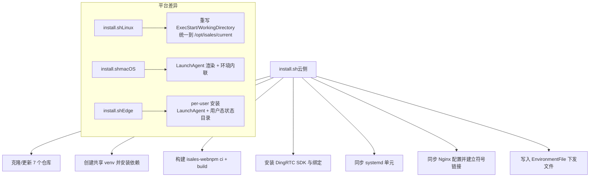
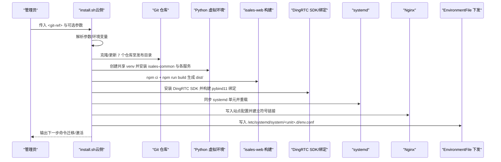
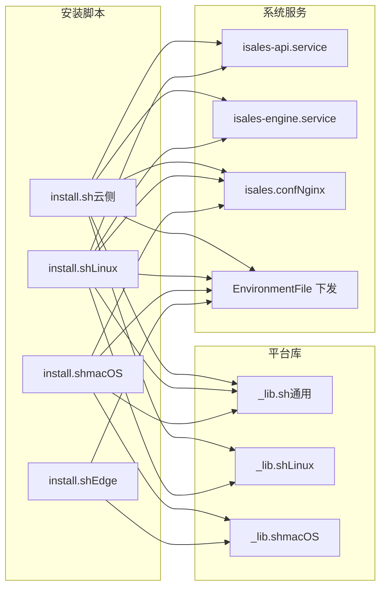

# 服务安装脚本 (install.sh)

<cite>
**本文引用的文件**
- [install.sh（云侧）](file://deploy/cloud/scripts/install.sh)
- [install.sh（Linux）](file://deploy/linux/scripts/install.sh)
- [install.sh（macOS）](file://deploy/macos/scripts/install.sh)
- [install.sh（Edge）](file://deploy/edge/scripts/install.sh)
- [_lib.sh（通用）](file://deploy/common/_lib.sh)
- [_lib.sh（Linux）](file://deploy/linux/scripts/_lib.sh)
- [_lib.sh（macOS）](file://deploy/macos/scripts/_lib.sh)
- [isales-api.service（云侧 systemd 单元）](file://deploy/cloud/systemd/isales-api.service)
- [isales-engine.service（云侧 systemd 单元）](file://deploy/cloud/systemd/isales-engine.service)
- [isales.conf（云侧 Nginx 配置）](file://deploy/cloud/nginx/isales.conf)
- [api.env.example（云侧 API 环境）](file://deploy/cloud/env/api.env.example)
- [engine.env.example（云侧引擎环境）](file://deploy/cloud/env/engine.env.example)
- [scheduler.env.example（云侧调度器环境）](file://deploy/cloud/env/scheduler.env.example)
- [worker.env.example（云侧工作器环境）](file://deploy/cloud/env/worker.env.example)
- [edge.env.example（Edge 端环境）](file://deploy/edge/env/edge.env.example)
</cite>

## 目录
1. [简介](#简介)
2. [项目结构](#项目结构)
3. [核心组件](#核心组件)
4. [架构总览](#架构总览)
5. [详细组件分析](#详细组件分析)
6. [依赖关系分析](#依赖关系分析)
7. [性能与构建优化](#性能与构建优化)
8. [使用示例与参数说明](#使用示例与参数说明)
9. [故障排查指南](#故障排查指南)
10. [结论](#结论)

## 简介
本文档面向 iSales 服务安装脚本，系统性解析 install.sh 的完整安装流程，覆盖以下方面：
- 7 个服务仓库的拉取与版本管理
- Python 虚拟环境创建与依赖安装
- Node.js 构建与静态资源分发
- 目录结构组织与符号链接策略
- 环境变量注入与权限设置
- systemd（Linux）或 LaunchAgent（macOS）集成
- 启动配置与激活流程
- 参数说明、使用示例与故障排查

## 项目结构
围绕安装脚本的关键文件与配置如下：
- 云侧安装：deploy/cloud/scripts/install.sh
- Linux 安装：deploy/linux/scripts/install.sh
- macOS 安装：deploy/macos/scripts/install.sh
- Edge 安装：deploy/edge/scripts/install.sh
- 通用库：deploy/common/_lib.sh
- 平台特定库：deploy/linux/scripts/_lib.sh、deploy/macos/scripts/_lib.sh
- 云侧 systemd 单元：deploy/cloud/systemd/*.service
- 云侧 Nginx 配置：deploy/cloud/nginx/isales.conf
- 环境模板：deploy/cloud/env/*.env.example、deploy/edge/env/edge.env.example

图表来源
- [install.sh（云侧）:104-297](file://deploy/cloud/scripts/install.sh#L104-L297)
- [install.sh（Linux）:130-173](file://deploy/linux/scripts/install.sh#L130-L173)
- [install.sh（macOS）:188-320](file://deploy/macos/scripts/install.sh#L188-L320)
- [install.sh（Edge）:163-202](file://deploy/edge/scripts/install.sh#L163-L202)

章节来源
- [install.sh（云侧）:1-300](file://deploy/cloud/scripts/install.sh#L1-L300)
- [install.sh（Linux）:1-275](file://deploy/linux/scripts/install.sh#L1-L275)
- [install.sh（macOS）:1-417](file://deploy/macos/scripts/install.sh#L1-L417)
- [install.sh（Edge）:1-222](file://deploy/edge/scripts/install.sh#L1-L222)

## 核心组件
- 通用库与工具
  - 日志、错误处理、确认提示、命令执行包装、环境模板引导等
- 平台适配
  - Linux：apt 包列表、环境模板路径、兼容旧路径提示
  - macOS：Homebrew 前缀、brew 包列表、系统账户与架构校验
- 云侧安装流程
  - 解析参数与环境变量、准备发布目录、克隆/更新仓库、创建虚拟环境、构建前端、安装 DingRTC SDK 与绑定、同步 systemd 单元、同步 Nginx 配置、写入环境下发文件、可选激活
- Linux/macOS 安装流程
  - 与云侧类似，但重写 systemd 单元中的 ExecStart/WorkingDirectory，或渲染 LaunchAgent plist 并内联环境变量
- Edge 安装流程
  - per-user 安装，创建 venv、克隆仓库、安装依赖、同步 LaunchAgent、初始化用户态状态与日志目录、写入用户环境文件

章节来源
- [_lib.sh（通用）:1-181](file://deploy/common/_lib.sh#L1-L181)
- [_lib.sh（Linux）:1-47](file://deploy/linux/scripts/_lib.sh#L1-L47)
- [_lib.sh（macOS）:1-69](file://deploy/macos/scripts/_lib.sh#L1-L69)
- [install.sh（云侧）:104-297](file://deploy/cloud/scripts/install.sh#L104-L297)
- [install.sh（Linux）:130-255](file://deploy/linux/scripts/install.sh#L130-L255)
- [install.sh（macOS）:188-399](file://deploy/macos/scripts/install.sh#L188-L399)
- [install.sh（Edge）:163-219](file://deploy/edge/scripts/install.sh#L163-L219)

## 架构总览
下图展示云侧安装的整体流程与关键步骤之间的依赖关系。

图表来源
- [install.sh（云侧）:104-297](file://deploy/cloud/scripts/install.sh#L104-L297)

章节来源
- [install.sh（云侧）:104-297](file://deploy/cloud/scripts/install.sh#L104-L297)

## 详细组件分析

### 版本管理与发布目录
- 发布时间戳命名：基于当前时间生成唯一目录 /opt/isales/releases/<YYYYMMDD-HHMMSS>
- 权限与所有权：发布目录由 isales 用户/组创建，便于后续以该用户身份执行
- 失败清理：安装过程中若发生错误，将删除不完整的发布目录，避免残留

章节来源
- [install.sh（云侧）:111-123](file://deploy/cloud/scripts/install.sh#L111-L123)
- [install.sh（Linux）:57-69](file://deploy/linux/scripts/install.sh#L57-L69)
- [install.sh（macOS）:71-81](file://deploy/macos/scripts/install.sh#L71-L81)

### 仓库克隆与更新
- 默认仓库集合：isales-common、isales-api、isales-engine、isales-scheduler、isales-worker、isales-web（云侧还包含 isales-web）
- 自定义仓库：通过环境变量 ISALES_REPOS 覆盖默认集合
- 自定义基地址：ISALES_GIT_BASE 支持替换默认 GitHub 地址
- 深度克隆：使用浅克隆减少带宽与时间
- 切换分支/标签：checkout 到指定的 <git-ref>

章节来源
- [install.sh（云侧）:107-113](file://deploy/cloud/scripts/install.sh#L107-L113)
- [install.sh（Linux）:53-55](file://deploy/linux/scripts/install.sh#L53-L55)
- [install.sh（macOS）:67-69](file://deploy/macos/scripts/install.sh#L67-L69)
- [install.sh（Edge）:104-106](file://deploy/edge/scripts/install.sh#L104-L106)

### Python 虚拟环境与依赖安装
- 共享 venv：所有服务共享同一虚拟环境，降低磁盘占用
- Python 版本：Linux 使用系统 Python 3.12；macOS 使用 Homebrew 的 python@3.12
- 安装顺序：先安装 isales-common，再安装各服务
- 云侧额外：isales-engine 的 DingRTC 绑定在 venv 中构建

章节来源
- [install.sh（云侧）:157-166](file://deploy/cloud/scripts/install.sh#L157-L166)
- [install.sh（Linux）:106-116](file://deploy/linux/scripts/install.sh#L106-L116)
- [install.sh（macOS）:159-175](file://deploy/macos/scripts/install.sh#L159-L175)
- [install.sh（Edge）:151-161](file://deploy/edge/scripts/install.sh#L151-L161)

### Node.js 构建与静态资源
- 构建命令：npm ci 安装依赖，npm run build 生成 dist/
- 产物位置：isales-web/dist/，供 Nginx 或 macOS 的 docroot 符号链接指向
- 云侧：Nginx 将 /var/www/isales-web 指向当前发布版本的 dist
- macOS：brew nginx 的 docroot 与端口重写，确保 8080 监听与符号链接正确

章节来源
- [install.sh（云侧）:170-176](file://deploy/cloud/scripts/install.sh#L170-L176)
- [install.sh（Linux）:120-126](file://deploy/linux/scripts/install.sh#L120-L126)
- [install.sh（macOS）:179-186](file://deploy/macos/scripts/install.sh#L179-L186)
- [isales.conf（云侧 Nginx 配置）:39-69](file://deploy/cloud/nginx/isales.conf#L39-L69)

### 符号链接策略与目录组织
- Linux：/opt/isales/current 指向当前发布版本；/var/www/isales-web 指向 current/isales-web/dist
- macOS：docroot 位于 $BREW_PREFIX/var/www；同样通过符号链接指向 current
- Edge：per-user 状态目录 ~/Library/Application Support/isales/ 与日志目录 ~/Library/Logs/isales/

章节来源
- [install.sh（云侧）:240-242](file://deploy/cloud/scripts/install.sh#L240-L242)
- [install.sh（Linux）:187-193](file://deploy/linux/scripts/install.sh#L187-L193)
- [install.sh（macOS）:395-399](file://deploy/macos/scripts/install.sh#L395-L399)
- [install.sh（Edge）:182-202](file://deploy/edge/scripts/install.sh#L182-L202)

### 环境变量注入与权限设置
- Linux/macOS：systemd 单元通过 EnvironmentFile 下发集中式环境文件 /etc/isales/env/<name>.env
- 云侧：install.sh 写入 /etc/systemd/system/<unit>.d/env.conf，强制覆盖单元内置路径
- Edge：per-user 环境文件 ~/.config/isales/edge.env（0600），由 LaunchAgent 读取
- 权限与属主：集中环境文件采用 0640，属主为 root:isales

章节来源
- [install.sh（云侧）:254-278](file://deploy/cloud/scripts/install.sh#L254-L278)
- [install.sh（Linux）:208-236](file://deploy/linux/scripts/install.sh#L208-L236)
- [install.sh（macOS）:239-320](file://deploy/macos/scripts/install.sh#L239-L320)
- [install.sh（Edge）:180-202](file://deploy/edge/scripts/install.sh#L180-L202)
- [api.env.example（云侧 API 环境）:1-24](file://deploy/cloud/env/api.env.example#L1-L24)
- [engine.env.example（云侧引擎环境）:1-76](file://deploy/cloud/env/engine.env.example#L1-L76)
- [scheduler.env.example（云侧调度器环境）:1-25](file://deploy/cloud/env/scheduler.env.example#L1-L25)
- [worker.env.example（云侧工作器环境）:1-28](file://deploy/cloud/env/worker.env.example#L1-L28)
- [edge.env.example（Edge 端环境）:1-34](file://deploy/edge/env/edge.env.example#L1-L34)

### systemd 单元与启动配置（Linux）
- 单元来源：各服务仓库内的 deploy/*.service
- 重写规则：将 ExecStart 与 WorkingDirectory 统一指向 /opt/isales/current，实现原子切换
- 重载：安装后执行 daemon-reload

章节来源
- [install.sh（Linux）:140-173](file://deploy/linux/scripts/install.sh#L140-L173)
- [isales-api.service（云侧 systemd 单元）:1-35](file://deploy/cloud/systemd/isales-api.service#L1-L35)
- [isales-engine.service（云侧 systemd 单元）:1-42](file://deploy/cloud/systemd/isales-engine.service#L1-L42)

### LaunchAgent 与启动配置（macOS）
- LaunchAgent 渲染：将 /etc/isales/env/<name>.env 的键值内联到 plist 的 EnvironmentVariables 字典
- 启动：通过 launchctl bootstrap/launchctl bootout 实现幂等加载
- 运行时引导：com.isales.bootstrap-runtime.plist 在系统启动后重建 /var/run/isales

章节来源
- [install.sh（macOS）:239-320](file://deploy/macos/scripts/install.sh#L239-L320)

### Edge 安装与 per-user 启动
- per-user 安装：不以 root 运行，使用 LaunchAgent
- 状态与日志：~/Library/Application Support/isales/ 与 ~/Library/Logs/isales/
- 激活：通过 --activate 切换 /opt/isales/current 并重启 LaunchAgent

章节来源
- [install.sh（Edge）:65-98](file://deploy/edge/scripts/install.sh#L65-L98)
- [install.sh（Edge）:163-202](file://deploy/edge/scripts/install.sh#L163-L202)

### DingRTC SDK 与绑定（云侧）
- SDK 安装：install-dingrtc-sdk.sh 安装到 /opt/isales/vendor/DingRTC_Linux_SDK_*
- 绑定构建：在 release venv 中构建 pybind11 绑定，读取 VIRTUAL_ENV 与 ISALES_DINGRTC_LINUX_SDK_PATH
- 依赖：引擎单元通过环境变量注入 LD_LIBRARY_PATH 与 PYTHONPATH

章节来源
- [install.sh（云侧）:180-201](file://deploy/cloud/scripts/install.sh#L180-L201)
- [engine.env.example（云侧引擎环境）:48-54](file://deploy/cloud/env/engine.env.example#L48-L54)
- [isales-engine.service（云侧 systemd 单元）:20-25](file://deploy/cloud/systemd/isales-engine.service#L20-L25)

## 依赖关系分析

图表来源
- [install.sh（云侧）:40-41](file://deploy/cloud/scripts/install.sh#L40-L41)
- [install.sh（Linux）:27-31](file://deploy/linux/scripts/install.sh#L27-L31)
- [install.sh（macOS）:38-41](file://deploy/macos/scripts/install.sh#L38-L41)
- [install.sh（Edge）:38-40](file://deploy/edge/scripts/install.sh#L38-L40)
- [isales-api.service（云侧 systemd 单元）:1-35](file://deploy/cloud/systemd/isales-api.service#L1-L35)
- [isales-engine.service（云侧 systemd 单元）:1-42](file://deploy/cloud/systemd/isales-engine.service#L1-L42)
- [isales.conf（云侧 Nginx 配置）:1-103](file://deploy/cloud/nginx/isales.conf#L1-L103)

章节来源
- [install.sh（云侧）:40-41](file://deploy/cloud/scripts/install.sh#L40-L41)
- [install.sh（Linux）:27-31](file://deploy/linux/scripts/install.sh#L27-L31)
- [install.sh（macOS）:38-41](file://deploy/macos/scripts/install.sh#L38-L41)
- [install.sh（Edge）:38-40](file://deploy/edge/scripts/install.sh#L38-L40)

## 性能与构建优化
- 浅克隆：--depth 50 限制克隆深度，缩短首次安装时间
- 共享 venv：减少重复依赖安装与磁盘占用
- 并行化：脚本按步骤串行执行，未显式并行化；可在多机部署时并行运行不同主机的安装
- NPM 缓存：npm ci 使用缓存，提升重复安装速度
- 符号链接：通过 /opt/isales/current 与 /var/www/isales-web 符号链接实现零停机切换

章节来源
- [install.sh（云侧）:150-151](file://deploy/cloud/scripts/install.sh#L150-L151)
- [install.sh（Linux）:99-100](file://deploy/linux/scripts/install.sh#L99-L100)
- [install.sh（macOS）:152-153](file://deploy/macos/scripts/install.sh#L152-L153)

## 使用示例与参数说明

### 通用参数
- <git-ref>：目标版本/分支/标签（如 v1.0.0、main）
- --dry-run：预演模式，仅打印将要执行的操作
- --force：跳过交互确认（谨慎使用）

### 云侧安装（install.sh cloud）
- 基本用法
  - sudo bash deploy/cloud/scripts/install.sh v1.0.0
- 可选参数
  - --activate <release-ts>：切换到指定发布版本并重启服务
  - --help/-h：显示帮助
- 环境变量
  - ISALES_GIT_BASE：自定义仓库基地址
  - ISALES_REPOS：空格分隔的服务仓库列表
  - ISALES_DOMAIN：用于 Nginx 配置中的域名占位符

章节来源
- [install.sh（云侧）:8-11](file://deploy/cloud/scripts/install.sh#L8-L11)
- [install.sh（云侧）:51-59](file://deploy/cloud/scripts/install.sh#L51-L59)
- [install.sh（云侧）:107-109](file://deploy/cloud/scripts/install.sh#L107-L109)
- [install.sh（云侧）:105-105](file://deploy/cloud/scripts/install.sh#L105-L105)

### Linux 安装（install.sh linux）
- 基本用法
  - sudo bash deploy/linux/scripts/install.sh v0.1.0
- 可选参数
  - --help/-h：显示帮助
- 环境变量
  - ISALES_GIT_BASE、ISALES_REPOS

章节来源
- [install.sh（Linux）:7-10](file://deploy/linux/scripts/install.sh#L7-L10)
- [install.sh（Linux）:38-47](file://deploy/linux/scripts/install.sh#L38-L47)
- [install.sh（Linux）:53-55](file://deploy/linux/scripts/install.sh#L53-L55)

### macOS 安装（install.sh macos）
- 基本用法
  - sudo bash deploy/macos/scripts/install.sh v0.1.0
- 可选参数
  - --skip-clone：跳过克隆，复用已存在的发布目录
  - --release-dir=<dir>：指定发布目录（覆盖时间戳命名）
  - --help/-h：显示帮助
- 环境变量
  - ISALES_GIT_BASE、ISALES_REPOS

章节来源
- [install.sh（macOS）:13-16](file://deploy/macos/scripts/install.sh#L13-L16)
- [install.sh（macOS）:49-59](file://deploy/macos/scripts/install.sh#L49-L59)
- [install.sh（macOS）:67-69](file://deploy/macos/scripts/install.sh#L67-L69)

### Edge 安装（install.sh edge）
- 基本用法
  - bash deploy/edge/scripts/install.sh v1.0.0
- 可选参数
  - --activate <release-ts>：切换到指定发布版本并重启 LaunchAgent
  - --help/-h：显示帮助
- 环境变量
  - ISALES_GIT_BASE、ISALES_REPOS

章节来源
- [install.sh（Edge）:13-17](file://deploy/edge/scripts/install.sh#L13-L17)
- [install.sh（Edge）:50-58](file://deploy/edge/scripts/install.sh#L50-L58)
- [install.sh（Edge）:104-106](file://deploy/edge/scripts/install.sh#L104-L106)

## 故障排查指南
- 权限问题
  - 必须以 root（或 sudo）运行 Linux/macOS 安装脚本
  - Edge 安装必须以普通用户运行，不能以 root 运行
- 缺少命令
  - Linux：确认 apt 包已安装（PostgreSQL、Redis、Nginx、Node.js、Python 3.12、git 等）
  - macOS：确认 Homebrew python@3.12、node@20、pkg-config、git 已安装
- 发布目录不完整
  - 若安装中途失败，会自动清理不完整的发布目录；重新执行安装
- Nginx 配置错误
  - 云侧：检查 /etc/nginx/sites-available/isales 是否存在且语法正确
  - macOS：确认 docroot 路径与端口重写是否生效
- systemd 单元未加载
  - Linux：执行 daemon-reload 并检查单元状态
- LaunchAgent 未启动
  - macOS：确认 plist 已安装并通过 launchctl bootstrap/launchctl bootout 生效
- 环境变量未生效
  - 云侧：检查 /etc/systemd/system/<unit>.d/env.conf 是否存在且内容正确
  - Edge：检查 ~/.config/isales/edge.env 权限与内容
- DingRTC SDK/绑定问题
  - 确认 /opt/isales/vendor/DingRTC_Linux_SDK_* 存在
  - 确认引擎 venv 中已构建 pybind11 绑定

章节来源
- [_lib.sh（通用）:74-89](file://deploy/common/_lib.sh#L74-L89)
- [install.sh（Linux）:172-173](file://deploy/linux/scripts/install.sh#L172-L173)
- [install.sh（macOS）:290-296](file://deploy/macos/scripts/install.sh#L290-L296)
- [install.sh（云侧）:218-222](file://deploy/cloud/scripts/install.sh#L218-L222)
- [install.sh（Edge）:174-178](file://deploy/edge/scripts/install.sh#L174-L178)

## 结论
iSales 安装脚本通过标准化的发布目录、共享虚拟环境、前端构建与系统服务集成，实现了跨平台的一致化部署体验。云侧安装脚本进一步引入了 DingRTC SDK 与绑定、Nginx 多监听端口与 TLS 终结、以及集中式环境下发机制，满足生产级部署需求。结合本文档提供的参数说明、使用示例与故障排查建议，可高效完成 iSales 服务的安装与维护。